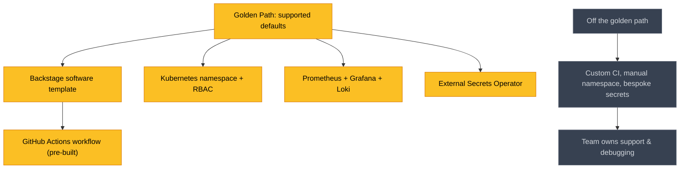
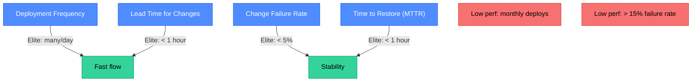

# IDP Concepts: Golden Paths, DORA, and Developer Experience

The Internal Developer Platform is not a tool — it is a set of capabilities that abstracts away infrastructure complexity. This page covers the conceptual foundations: what a golden path actually is, how DORA metrics measure platform effectiveness, and how the SPACE framework captures developer experience beyond just deployment speed.

  0/0 checks
  

---

## 1. Golden Paths

A **golden path** (also called a paved road) is the officially supported, opinionated route from source code to a running service. It bundles together:
- A project template (directory layout, CI pipeline, Dockerfile)
- A deployment target (a Kubernetes namespace or ApplicationSet)
- An observability stack (metrics, logs, traces pre-wired)
- A secrets provider (Vault integration, ESO setup)
- An on-call runbook template

The word *golden* matters: the path is not mandatory. Teams can step off it — but they own the consequences. The platform team only provides SLA guarantees for services that stay on the golden path.

**What makes a good golden path?**
- Less than 30 minutes from `git init` to a service running in staging.
- Zero platform-team Slack messages required.
- Encodes security and compliance defaults (image scanning, network policies, audit logging) — developers get compliance for free by staying on path.
- Versioned and treated as a product with a changelog.

  
A team wants to use a custom secrets manager that isn't part of the golden path. The platform team says "that's fine, but we won't support it." Is this a good or bad policy, and why?

  <button class="quiz-reveal">Reveal answer</button>
  
Good policy. Golden paths are opt-in, not mandatory. Forcing every team onto the same toolchain would make Platform Engineering a bottleneck instead of an accelerator. The key invariant is clear accountability: teams on the golden path get support; teams off it own their own problems. This preserves team autonomy while giving the platform team a bounded support surface.

---

## 2. Cognitive Load and Team Topologies

John Sweller's cognitive load theory distinguishes:
- **Intrinsic load**: complexity inherent to the task (the actual business logic).
- **Extraneous load**: complexity added by poor tooling, unclear docs, or unnecessary context-switching.

Platform Engineering attacks extraneous load. A developer should spend cognitive budget on the domain problem (payments logic, recommendation algorithm), not on Kubernetes scheduler internals.

Three types of cognitive load in software teams:
1. **Intrinsic**: the inherent complexity of the service being built.
2. **Germane**: learning new skills that directly improve the team's capability.
3. **Extraneous**: fighting the platform — opening tickets, debugging flaky CI, hand-rolling namespaces.

The platform team's job is to minimize extraneous load for stream-aligned teams.

  
A developer spends two hours debugging why their Kubernetes pod can't pull a Docker image, because the image pull secret rotated and they didn't know. Which type of cognitive load is this, and what is the platform-side fix?

  <button class="quiz-reveal">Reveal answer</button>
  
Extraneous load — time spent fighting the platform instead of building the product. The platform fix: External Secrets Operator (ESO) auto-rotates image pull secrets and injects them into namespaces; developers never touch secret lifecycle. Alternatively, Workload Identity (GKE/EKS) eliminates the secret entirely. Either way, this is a platform reliability problem, not a developer education problem.

---

## 3. DORA Metrics

The DevOps Research and Assessment (DORA) program identified four metrics that statistically distinguish elite-performing engineering organizations from low performers:

| Metric | What it measures | Elite target |
|---|---|---|
| **Deployment Frequency** | How often you successfully release to production | Multiple times per day |
| **Lead Time for Changes** | Code commit → running in production | Less than one hour |
| **Change Failure Rate** | % of deployments causing a production incident | Less than 5% |
| **Time to Restore Service (MTTR)** | How long to recover from a production failure | Less than one hour |

**How DORA maps to platform capabilities:**
- High deployment frequency → automated release pipelines, feature flags, canary deployments.
- Low lead time → self-service environments, no manual approvals for standard changes.
- Low failure rate → automated testing gates, rollback-by-default (GitOps).
- Low MTTR → pre-built runbooks, automated alert routing, chaos engineering practice.

  
A team deploys every 3 weeks and has a 2% change failure rate. Are they a high or low performer by DORA standards, and which metric should their platform team focus on improving first?

  <button class="quiz-reveal">Reveal answer</button>
  
Low performer on Deployment Frequency (elite is multiple deploys per day; monthly is the bottom tier), but good on Change Failure Rate (under 5%). The platform team should focus on Deployment Frequency and Lead Time — this usually means removing manual gates (ticket-based namespace provisioning, approval workflows for staging deployments), adding CI parallelism, and enabling one-click rollback so teams feel safe deploying more often.

---

## 4. The SPACE Framework

DORA covers deployment throughput and stability, but misses developer *experience*. The SPACE framework (Nicole Forsgren et al., 2021) adds five dimensions:

| Letter | Dimension | Example measures |
|---|---|---|
| **S** | Satisfaction & wellbeing | Developer satisfaction survey, on-call burden |
| **P** | Performance | Reliability of delivered work (vs. raw output volume) |
| **A** | Activity | Code commits, PRs reviewed, incidents resolved |
| **C** | Communication & collaboration | PR review latency, cross-team dependency wait time |
| **E** | Efficiency & flow | Interruptions/day, time in unplanned work, CI wait time |

The key insight: no single metric captures DX. A team with high Activity (many commits) might have terrible Satisfaction (burned out, fighting the platform). DORA + SPACE together give a balanced view.

Platform Engineering levers for each SPACE dimension:
- **S**: reduce on-call burden via better alerts, runbooks, and self-healing.
- **P**: reduce change failure rate; increase test coverage tooling.
- **A**: increase deployment frequency; reduce time spent on compliance toil.
- **C**: reduce cross-team dependency wait (self-service eliminates many approval flows).
- **E**: reduce CI wait time, reduce context-switching from platform interruptions.

  
A platform team proposes measuring developer productivity by counting git commits per developer per week. Which SPACE dimension does this correspond to, and why is it insufficient on its own?

  <button class="quiz-reveal">Reveal answer</button>
  
Activity (A). It's insufficient because Activity metrics in isolation can be gamed (many tiny commits) and miss quality, satisfaction, and flow. A developer refactoring a core library might produce fewer commits but deliver more value than one churning out trivial changes. SPACE explicitly warns against single-dimension productivity measurement — the dimensions interact, and ignoring Satisfaction or Efficiency leads to optimization that burns out teams.

---

## 5. Platform as a Product

The most common failure mode in Platform Engineering is treating the platform as an internal tool rather than a product. The difference:

  

    <button class="tab-btn" data-tab="tool" class="active">Internal Tool mindset</button>
    <button class="tab-btn" data-tab="product">Product mindset</button>
  

  

**Internal Tool mindset:**
- Platform team decides features based on what they want to build.
- Documentation is an afterthought.
- "If you have a problem, read the source code."
- No SLOs for the platform itself.
- Success measured by how many tools are deployed.
- Adoption is assumed because it's mandated.

  

  

**Product mindset:**
- Platform team runs regular developer surveys and has a formal feedback loop.
- Documentation is a first-class deliverable alongside code.
- Platform has its own SLOs (portal uptime, template render time, CI queue wait time).
- Success measured by developer adoption, lead time reduction, and DORA scores.
- Adoption is earned; developers choose the platform because it makes them faster.
- A roadmap exists, with quarterly priorities shaped by user input.

  

  
A platform team has 100% adoption of their CI/CD pipeline — it's mandatory. Their developer satisfaction score is 2/5. From a "platform as a product" perspective, what is the core problem?

  <button class="quiz-reveal">Reveal answer</button>
  
Mandatory adoption is not the same as earned adoption — it masks product failure. The 2/5 satisfaction score is the real signal: the platform is not serving developers' needs. A product mindset would treat this as a critical bug, run user interviews to understand the pain points, and prioritize fixing them over shipping new features. Mandating bad tooling doesn't solve the DX problem; it just hides it until attrition or workarounds appear.

---

## 6. Platform Team Structure and Funding

Platform teams are typically funded as **cost centers** (shared infrastructure) but should be measured like **value centers** (contribution to delivery throughput). This tension is real: platform work is invisible when it's working well.

Common structures:
- **Centralized platform team**: one team serves all stream teams. Scales well for 50–500 engineers; above that, specialized sub-teams emerge.
- **Platform guild**: no dedicated team; platform work is distributed across staff engineers. Low maturity; high inconsistency.
- **Federated platform**: a central team sets standards; embedded platform engineers in each business unit implement them locally.

The **developer-to-platform-engineer ratio** CNCF recommends is approximately 10:1 to 20:1. Below that ratio, the platform team can't move fast enough. Above it, the platform is too thin and support burden falls back on developers.

  
An organization has 300 developers and 5 platform engineers. According to typical CNCF recommendations, is this ratio appropriate? What is likely to happen?

  <button class="quiz-reveal">Reveal answer</button>
  
The ratio is 60:1 — well above the recommended 10:1–20:1. The platform team is spread too thin. What typically happens: platform engineers become a bottleneck (every team waits on them), documentation is neglected (no time), and ad hoc shortcuts proliferate as teams work around the platform instead of through it. The fix is either growing the platform team or reducing scope by adopting SaaS/managed services for non-differentiating platform components.

---

## 7. Getting Started: Platform Engineering Maturity Ladder

A practical three-step ladder for teams starting from scratch:

  

    <button class="stepper-prev" disabled>←</button>
    Step 1 of 3
    <button class="stepper-next">→</button>
  

  

  

    

### Step 1 — Pave the path (Month 1–3)

Pick the single most painful workflow and eliminate its toil. Usually this is environment provisioning or CI pipeline bootstrapping.

- Survey developers: "What takes you the most time that shouldn't?"
- Pick the top answer.
- Build a self-service workflow for just that one thing.
- Measure before and after: lead time, ticket volume, developer satisfaction.

Don't build a portal yet. A CLI or a Backstage template that runs a script is enough.

    

    

### Step 2 — Add a catalog (Month 3–6)

Once one workflow is self-service, add discoverability: a service catalog (Backstage) that shows what services exist, who owns them, their SLOs, and how to deploy them.

- Install Backstage with just the Catalog plugin.
- Require every new service to have a `catalog-info.yaml` (enforced via CI lint).
- Integrate with GitHub so ownership and run state are visible.

At this point you have a north star for developers: one place to find everything.

    

    

### Step 3 — Measure and iterate (Month 6–12)

Add DORA metric collection. Show a dashboard to every engineering manager.

- Instrument deployment frequency via ArgoCD sync events → webhook → time-series DB.
- Instrument lead time via PR merge timestamp → ArgoCD sync timestamp.
- Instrument MTTR via PagerDuty incident open/close events.
- Run quarterly developer satisfaction surveys.

Use this data to prioritize platform roadmap. The platform team now operates like a product team: data-driven, roadmap-driven, customer-driven.

    

  

  
Why should a platform team measure DORA metrics *before* building most of the platform, rather than waiting until they think the platform is complete?

  <button class="quiz-reveal">Reveal answer</button>
  
Because you need a baseline to know if anything improved. Without pre-platform measurements, you can't prove the platform had any effect — which matters for budget justification. More importantly, early measurement reveals *which* DORA metric is the bottleneck: a team with low deployment frequency needs different platform investments than one with high change failure rate. Measurement drives prioritization, not the platform team's intuition about what to build next.

