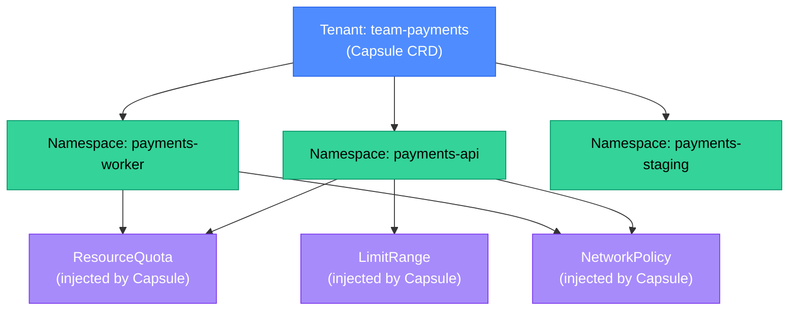
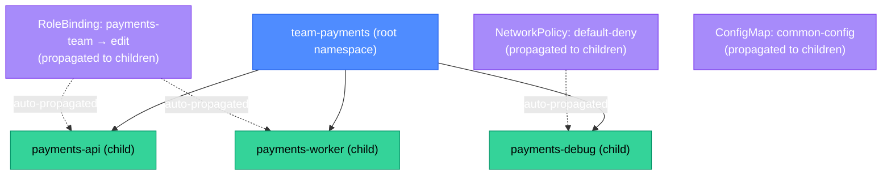
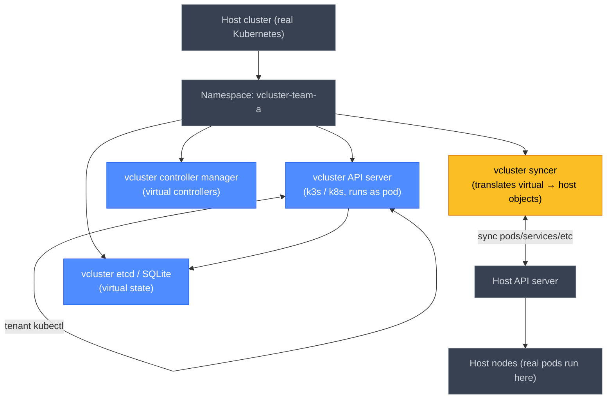

# Kubernetes Multi-Tenancy: vcluster, Capsule, and HNC

A single Kubernetes cluster shared by multiple teams is cheaper to operate than N separate clusters, but sharing introduces isolation challenges: one team's noisy workloads can starve another's; a misconfigured RBAC role can give a developer cluster-admin; a bug in one team's namespace can affect cluster-wide resources. Multi-tenancy tools add isolation layers without requiring every team to run their own cluster.

<div class="quiz-progress" data-quiz-progress>
  <span class="quiz-progress-label">0/0 checks</span>
  <span class="quiz-progress-bar"><span class="quiz-progress-fill"></span></span>
</div>

---

## 1. The Namespace Is Not Enough

A Kubernetes namespace provides:
- RBAC scope (roles and bindings are namespace-scoped).
- Resource quota boundary.
- Network policy scope (if a CNI enforces it).

A namespace does **not** provide:
- API server isolation (all tenants share the same API server, etcd, and scheduler).
- Node-level isolation (a pod in namespace A can be co-located with pods from namespace B on the same node).
- Cluster-scoped resource isolation (CRDs, StorageClasses, ClusterRoles are shared).
- Admission webhook isolation (a bad webhook can affect all namespaces).

This is the **noisy neighbor problem** at the control plane level. Three tools address it at different isolation depths:

| Tool | Isolation level | Cost | Complexity |
|---|---|---|---|
| **Namespace + RBAC + Quota** | Soft (logical) | Free | Low |
| **Capsule** | Logical + policy enforcement | Free | Medium |
| **HNC** | Namespace hierarchy + inheritance | Free | Medium |
| **vcluster** | Full virtual API server | Moderate (extra pods) | High |
| **Separate cluster** | Complete | High (cluster management) | Very high |

<div class="quiz-card">
  <p class="quiz-q">Team A runs a poorly written operator that creates ClusterRoles on every reconcile loop. This crashes the etcd compaction cycle and slows the entire shared cluster's API server. Which of the four isolation levels above would prevent this, and which would not?</p>
  <button class="quiz-reveal">Reveal answer</button>
  <div class="quiz-a" hidden>Only **vcluster** (virtual API server) or a **separate cluster** would prevent this. Capsule and HNC are namespace-scoped — they cannot prevent cluster-scoped resource creation by a tenant with operator-level RBAC. The noisy operator writes ClusterRoles directly to the shared API server/etcd, which Capsule and HNC cannot intercept. vcluster gives Team A their own isolated API server and etcd; their ClusterRoles go into the virtual cluster's etcd, not the host cluster's. Namespace + Quota catches compute resource abuse (CPU/memory) but not API object creation rate abuse.</div>
</div>

---

## 2. Capsule

Capsule is a CNCF project that adds a **Tenant** custom resource to Kubernetes. A Tenant represents a group of namespaces owned by one team, with shared policies enforced across all of them.

### Tenant definition

```yaml
apiVersion: capsule.clastix.io/v1beta2
kind: Tenant
metadata:
  name: team-payments
spec:
  owners:
    - name: alice@acme.com
      kind: User
    - name: payments-team
      kind: Group
  namespaceOptions:
    quota: 5
    forbiddenLabels:
      denied: [team]
  resourceQuotas:
    items:
      - hard:
          requests.cpu: "20"
          requests.memory: 40Gi
          pods: "100"
  limitRanges:
    items:
      - limits:
          - type: Container
            default:
              cpu: 500m
              memory: 512Mi
            defaultRequest:
              cpu: 100m
              memory: 128Mi
  networkPolicies:
    items:
      - podSelector: {}
        policyTypes: [Ingress]
        ingress:
          - from:
              - namespaceSelector:
                  matchLabels:
                    capsule.clastix.io/tenant: team-payments
  ingressOptions:
    allowedHostnames:
      allowed: ["*.payments.acme.io"]
  storageClasses:
    allowed: [standard, premium-rwo]
```

What Capsule enforces:
- **Namespace quota**: team-payments can create at most 5 namespaces.
- **Cross-namespace NetworkPolicy**: pods in team-payments namespaces can only receive traffic from other team-payments namespaces (plus explicitly allowed sources).
- **Hostname restriction**: Ingresses can only use `*.payments.acme.io` — not `*.internal.acme.io` (which belongs to another tenant).
- **StorageClass restriction**: only `standard` and `premium-rwo` may be used.
- **ResourceQuota propagation**: the total quota is enforced across all namespaces owned by the tenant.



<div class="quiz-card">
  <p class="quiz-q">A developer in team-payments creates a namespace `payments-debug` but forgets to add a ResourceQuota. What happens, and why?</p>
  <button class="quiz-reveal">Reveal answer</button>
  <div class="quiz-a" hidden>Capsule automatically injects the Tenant's ResourceQuota and LimitRange into any namespace that has the tenant label (`capsule.clastix.io/tenant: team-payments`). The developer doesn't need to add quotas manually — Capsule propagates them. If the team has already created 4 namespaces (approaching their quota of 5), the 5th is allowed; a 6th namespace creation attempt would be rejected by the Capsule admission webhook with a "tenant namespace quota exceeded" error.</div>
</div>

---

## 3. Hierarchical Namespace Controller (HNC)

HNC (from the Kubernetes multitenancy working group, now in sig-multicluster) adds **subnamespace** semantics: a namespace can be a child of another namespace, inheriting its resources (RBAC roles, NetworkPolicies, ConfigMaps, Secrets) automatically.

### Subnamespace propagation

```yaml
apiVersion: hnc.x-k8s.io/v1alpha2
kind: SubnamespaceAnchor
metadata:
  name: payments-debug
  namespace: team-payments  # parent namespace
```

Running this creates `payments-debug` as a child of `team-payments`. Objects in `team-payments` that are labeled `propagate.hnc.x-k8s.io/object: true` are automatically copied to `payments-debug` and kept in sync.



**Use cases for HNC:**
- A team has a root namespace and creates temporary child namespaces for feature branches or experiments. The child automatically inherits RBAC and NetworkPolicy.
- A platform team propagates a common ConfigMap (shared feature flags, common CA certificates) to all descendant namespaces without maintaining per-namespace copies.
- A "production" namespace tree (prod → prod-payments, prod-notifications) inherits stricter admission controls set at the production root level.

**What HNC does not do:**
- It does not enforce namespace quotas (use Capsule or direct ResourceQuotas for that).
- It does not provide API server isolation (still the same shared API server).
- It does not prevent a child namespace admin from overriding propagated objects.

<div class="quiz-card">
  <p class="quiz-q">HNC propagates a NetworkPolicy from `team-payments` to all its child namespaces. A developer in `payments-debug` runs `kubectl delete networkpolicy default-deny`. What happens next?</p>
  <button class="quiz-reveal">Reveal answer</button>
  <div class="quiz-a" hidden>HNC continuously reconciles propagated objects. After the deletion, the HNC controller detects that `payments-debug/default-deny` no longer matches the propagated copy from `team-payments` and recreates it within seconds. The developer cannot permanently delete a propagated NetworkPolicy from a child namespace — they would need to remove the propagation label on the source object in the parent namespace (which requires access to the parent, typically restricted to the platform team).</div>
</div>

---

## 4. vcluster

vcluster runs a **virtual Kubernetes cluster** inside a namespace of a host cluster. Each virtual cluster has its own API server, controller manager, and etcd (or SQLite for small instances) — but pods actually run on the host cluster's nodes, synced by the vcluster syncer component.



**What the virtual cluster provides:**
- A **separate API server**: tenants get full `kubectl` access, including `kubectl get nodes`, `kubectl create clusterrole`, etc. — all scoped to the virtual cluster.
- **CRD isolation**: a tenant can install any CRD into the virtual cluster without affecting the host cluster's etcd.
- **Admission webhook isolation**: the tenant can install their own admission webhooks — they run inside the virtual cluster and don't affect other tenants.
- **Full RBAC namespace**: within the virtual cluster, the tenant can create Namespaces, ClusterRoles, ClusterRoleBindings freely.

**What vcluster does NOT provide:**
- Node isolation. Tenant pods run on the host cluster's nodes — a `limits.cpu` on a pod in the virtual cluster is enforced by the host kubelet against the host's resources.
- Network isolation by default. The syncer creates real Services on the host; inter-vcluster network policies require host-level CNI configuration.
- etcd isolation. The virtual etcd is a pod; it still consumes host-cluster resources.

### Installing vcluster

```bash
# Using the vcluster CLI
vcluster create team-a \
  --namespace vcluster-team-a \
  --set storage.className=standard

# Access the virtual cluster
vcluster connect team-a -n vcluster-team-a
# → sets KUBECONFIG to point to the virtual API server
kubectl get namespaces  # sees virtual namespaces only
```

<div class="quiz-card">
  <p class="quiz-q">Team A installs the Prometheus Operator CRD into their vcluster. Team B uses a separate vcluster on the same host cluster. Does Team B's vcluster see Team A's Prometheus Operator CRDs?</p>
  <button class="quiz-reveal">Reveal answer</button>
  <div class="quiz-a" hidden>No. Each vcluster has its own API server and etcd. CRDs installed into vcluster A are stored in A's virtual etcd and served only by A's API server. They are never propagated to the host cluster or to other vclusters. This is the key isolation benefit: Team A's CRD churn doesn't pollute the shared etcd or conflict with Team B's CRD versions. In a shared cluster without vcluster, CRDs are cluster-scoped and visible (and potentially conflicting) across all tenants.</div>
</div>

---

## 5. Choosing the Right Tool

<div class="tab-group">
  <div class="tab-buttons">
    <button class="tab-btn active" data-tab="when-capsule">When Capsule</button>
    <button class="tab-btn" data-tab="when-hnc">When HNC</button>
    <button class="tab-btn" data-tab="when-vcluster">When vcluster</button>
  </div>
  <div class="tab-panel active" data-tab-panel="when-capsule">

**Use Capsule when:**
- You want one team = one Tenant, with multiple namespaces per team.
- You need automatic policy enforcement across a team's namespaces (quotas, NetworkPolicies, StorageClass restrictions).
- Teams shouldn't need to know about each other's namespaces, but don't need API server isolation.
- You want the platform team to define guardrails that auto-propagate and self-heal.

**Capsule is not the right choice when:**
- Teams need to install CRDs (cluster-scoped resources).
- Teams need Kubernetes cluster admin for testing (e.g., CI testing cluster-level features).
- Teams need their own admission webhooks.

  </div>
  <div class="tab-panel" data-tab-panel="when-hnc">

**Use HNC when:**
- You have a namespace hierarchy within a team (e.g., team → service → environment).
- You want to propagate common objects (ConfigMaps, Secrets, RBAC) to child namespaces automatically.
- You want temporary child namespaces that inherit parent policies on creation.
- You're managing a multi-environment setup where `production` should inherit stricter policies than `staging`.

**HNC is not the right choice when:**
- You need tenant isolation from each other (HNC is within-team, not between-team isolation).
- You need quota enforcement across a namespace tree (use Capsule or direct ResourceQuotas for that).

  </div>
  <div class="tab-panel" data-tab-panel="when-vcluster">

**Use vcluster when:**
- Teams need to install and test CRDs without affecting the host cluster.
- You're running CI testing that requires a full Kubernetes API (controller tests, operator tests).
- Tenants are external customers who need isolated, self-managed Kubernetes access.
- Teams need to run their own admission webhooks, operators, or controllers.
- You need strong isolation for compliance reasons (PCI-DSS scope separation, regulatory boundary).

**vcluster is not the right choice when:**
- You need node-level isolation (use separate clusters or node taints/tolerations).
- Cost is a primary concern (each vcluster runs extra pods: API server, etcd, syncer).
- Team count is very large (> 50 vclusters adds operational complexity).

  </div>
</div>

<div class="quiz-card">
  <p class="quiz-q">A platform team needs to support three scenarios simultaneously: (a) dev teams needing namespace quota enforcement, (b) a QA team that installs custom CRDs for testing, (c) a CI system that needs to run full Kubernetes controller tests. Which combination of tools handles all three?</p>
  <button class="quiz-reveal">Reveal answer</button>
  <div class="quiz-a" hidden>(a) **Capsule Tenant** for dev teams — automatic quota and NetworkPolicy enforcement across their namespaces. (b) **vcluster** for the QA team — isolated API server lets them install CRDs without polluting the host cluster. (c) **vcluster** for the CI system — each CI run can spin up a fresh vcluster (`vcluster create ci-run-$BUILD_ID`), test against it, then delete it. All three can coexist on the same host cluster: Capsule manages the dev team namespaces, vclusters run in dedicated namespaces, and the host cluster's ResourceQuotas bound vcluster pod consumption.</div>
</div>
