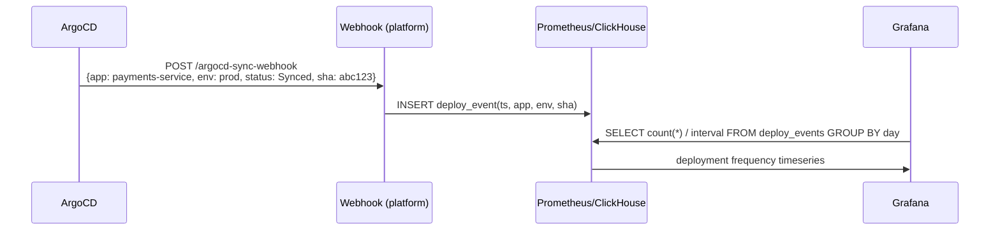
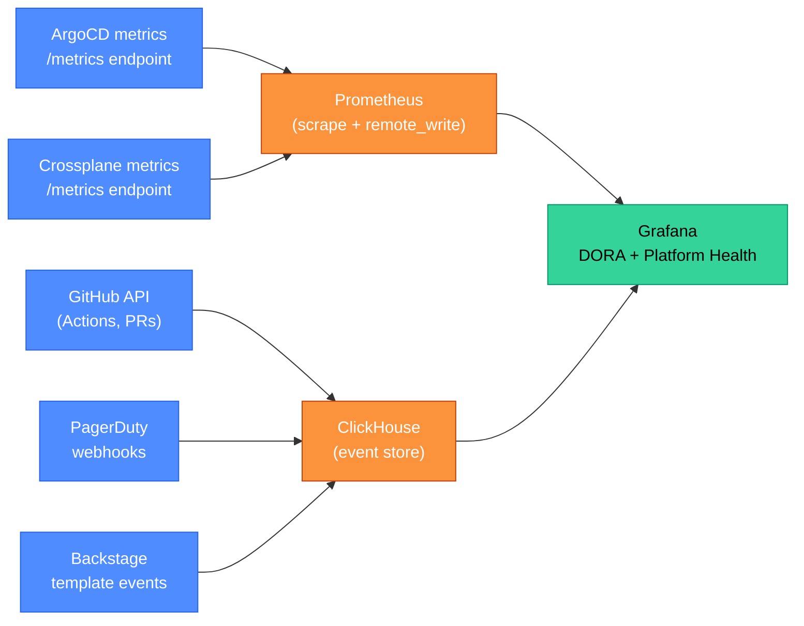

# Platform Observability: DORA Metrics and Engineering Effectiveness

Observability for a platform team is different from service observability. It's not about latency histograms and error rates for the platform's own APIs (though those matter) — it's about measuring whether the platform is actually improving engineering velocity. DORA metrics are the industry standard: four numbers that tell you whether your engineering organization is performing at an elite, high, medium, or low level.

<div class="quiz-progress" data-quiz-progress>
  <span class="quiz-progress-label">0/0 checks</span>
  <span class="quiz-progress-bar"><span class="quiz-progress-fill"></span></span>
</div>

---

## 1. Why Measure Platform Effectiveness?

A platform team that doesn't measure its impact faces two failure modes:
1. **Invisible success**: the platform is working, but leadership can't see it, so the team loses headcount.
2. **Invisible failure**: the platform isn't helping (or is actively hurting), but the team doesn't know it and keeps building the wrong things.

DORA research (the "Accelerate" book, Nicole Forsgren et al.) provides the answer: four metrics that are statistically predictive of organizational performance (revenue, profitability, market share, employee satisfaction).

```mermaid
graph TD
    classDef elite fill:#34d399,stroke:#059669,color:#000
    classDef high fill:#4f8cff,stroke:#2563eb,color:#fff
    classDef med fill:#fbbf24,stroke:#d97706,color:#000
    classDef low fill:#f87171,stroke:#dc2626,color:#fff

    DF["Deployment Frequency"]
    LT["Lead Time for Changes"]
    CFR["Change Failure Rate"]
    MTTR["Time to Restore (MTTR)"]

    E_DF["Elite: multiple/day"]:::elite
    H_DF["High: weekly"]:::high
    M_DF["Medium: monthly"]:::med
    L_DF["Low: < 6 months"]:::low

    DF --> E_DF
    DF --> H_DF
    DF --> M_DF
    DF --> L_DF

    E_LT["Elite: < 1 hour"]:::elite
    H_LT["High: 1 day – 1 week"]:::high

    LT --> E_LT
    LT --> H_LT

    E_CFR["Elite: 0–5%"]:::elite
    H_CFR["High: 5–10%"]:::high

    CFR --> E_CFR
    CFR --> H_CFR

    E_MTTR["Elite: < 1 hour"]:::elite
    H_MTTR["High: < 1 day"]:::high

    MTTR --> E_MTTR
    MTTR --> H_MTTR
```



<div class="quiz-card">
  <p class="quiz-q">Your team deploys to production once per week and has a 3% change failure rate. Based on DORA benchmarks, are you a high performer, and if not, which metric needs work?</p>
  <button class="quiz-reveal">Reveal answer</button>
  <div class="quiz-a" hidden>Mixed: **High performer on Change Failure Rate** (3% is within the elite 0–5% range) but **medium performer on Deployment Frequency** (weekly is the high-performer tier; elite is multiple deploys per day). To improve, the team should focus on increasing deployment frequency — this typically means smaller PRs, automated release pipelines, feature flags to decouple deploy from release, and removing approval gates for standard changes. A low failure rate shows the process is solid; the bottleneck is throughput, not stability.</div>
</div>

---

## 2. Collecting DORA Metrics

DORA metrics are not produced by a single tool — each metric taps a different event stream.

### Deployment Frequency

**Event**: a successful deployment to production.
**Sources**: ArgoCD sync events, GitHub Actions deployment events, Spinnaker pipeline completions.



**ArgoCD notification config** (in `argocd-notifications-cm`):

```yaml
trigger.on-sync-succeeded: |
  - when: app.status.sync.status == 'Synced'
    send: [post-to-dora-webhook]
template.post-to-dora-webhook:
  webhook:
    deploy-events:
      method: POST
      path: /events
      body: |
        {
          "event": "deployment",
          "app": "{{.app.metadata.name}}",
          "sha": "{{.app.status.sync.revision}}",
          "env": "{{.app.metadata.labels.environment}}",
          "ts": "{{now | date \"2006-01-02T15:04:05Z07:00\"}}"
        }
```

### Lead Time for Changes

**Event**: code merged to main → deployment to production.
**Measurement**: `deploy_timestamp - merge_timestamp` for the PR's merge commit SHA.

Requires correlating two event streams:
1. GitHub webhook: PR merged event (captures `merged_at` + `merge_commit_sha`).
2. ArgoCD sync event: deployment event (captures `revision` = SHA).

```
lead_time = deploy_event.timestamp WHERE deploy_event.sha == pr.merge_commit_sha
          - pr.merged_at
```

This is non-trivial: a deployment may include multiple merged PRs (batch deploy). The lead time for a batch is the average (or maximum) across all PRs in the batch.

<div class="quiz-card">
  <p class="quiz-q">Your ArgoCD deploys every merged PR automatically, but there's a 30-minute staging validation pipeline between merge and production sync. Where should you measure lead time — from merge to staging, or from merge to production?</p>
  <button class="quiz-reveal">Reveal answer</button>
  <div class="quiz-a" hidden>From merge to **production** — DORA defines lead time as the time from code committed to code running in production. Staging is an intermediate step, not the final destination. Measuring only to staging underestimates lead time and masks the 30-minute staging gate from your DORA metrics. If the 30-minute gate is a bottleneck, you want to see it in your lead time numbers so you can make a data-driven decision about whether to optimize it (parallelize tests, reduce gate scope) or accept it as necessary quality assurance.</div>
</div>

### Change Failure Rate

**Event**: a production deployment followed by a rollback or incident within a configurable window (typically 1 hour).
**Measurement**: `count(failed_deployments) / count(total_deployments)`.

**Defining failure**:
- A rollback in ArgoCD (the sync.revision reverts to an older SHA).
- A PagerDuty incident opened within 1 hour of a deployment (correlated by timestamp).
- A deployment annotated with `post-mortem: true` in the DORA tracking system.

The PagerDuty correlation approach is most accurate but requires a join across two systems.

### Time to Restore (MTTR)

**Event**: production incident opened → incident resolved.
**Sources**: PagerDuty incident lifecycle events (triggered → acknowledged → resolved).

```
MTTR = (incident.resolved_at - incident.triggered_at)
       averaged across all production incidents
```

PagerDuty, OpsGenie, and Grafana OnCall all expose incident lifecycle webhooks. A DORA tracking service subscribes to these and writes to the time-series DB.

<div class="quiz-card">
  <p class="quiz-q">Your MTTR is 45 minutes on average, which is in the elite range. But your change failure rate is 15% — low performer. What does this combination tell you about your team's practices?</p>
  <button class="quiz-reveal">Reveal answer</button>
  <div class="quiz-a" hidden>The team is good at *recovering* from problems but bad at *preventing* them. A 15% change failure rate means 1 in 7 deployments causes a production incident — too many bad changes are reaching production. But when they do, the team resolves them quickly (45 min MTTR). The platform fix is in the *prevention* direction: stronger automated testing gates (integration tests, contract tests), canary deployments to catch failures before 100% rollout, or feature flags to decouple release from deploy. MTTR and CFR often trade off: a team that's afraid of failures slows down (lowers deployment frequency) to reduce CFR; the goal is to improve both simultaneously through better automation.</div>
</div>

---

## 3. Tools for DORA Collection

| Tool | What it collects | Open-source? |
|---|---|---|
| **Four Keys** (Google) | DORA metrics from GitHub + Cloud Deploy events | Yes (GitHub repo) |
| **Pelorus** (Red Hat) | DORA metrics from Jira + ArgoCD + PagerDuty | Yes |
| **LinearB** | DORA metrics + PR cycle time + code review analytics | No (SaaS) |
| **Faros AI** | DORA metrics + engineering insights from multiple sources | No (SaaS) |
| **DORA Metrics (custom)** | Build your own webhook collector + Prometheus + Grafana | Yes (DIY) |
| **Grafana DORA plugin** | Grafana Labs plugin, pulls from GitHub/GitLab + PagerDuty | Community plugin |

**DIY DORA stack** (the approach most platform teams with Grafana already use):
1. ArgoCD notifications → webhook → time-series DB (Prometheus remote_write or ClickHouse).
2. GitHub webhook → deployment events DB.
3. PagerDuty webhook → incident events DB.
4. Grafana dashboard joins the three streams.

<div class="quiz-card">
  <p class="quiz-q">Your platform team decides to use Four Keys (the Google open-source DORA tool). Your CI/CD uses GitHub Actions and ArgoCD. What is the minimum integration work required?</p>
  <button class="quiz-reveal">Reveal answer</button>
  <div class="quiz-a" hidden>Four Keys natively integrates with GitHub (for deployment and PR events) and Google Cloud Deploy. For ArgoCD, you need a custom event forwarder: configure ArgoCD notifications to POST sync events to the Four Keys event ingestion endpoint, transforming the ArgoCD payload into the Four Keys `deployment` event schema. PagerDuty integration (for CFR and MTTR) uses Four Keys' built-in PagerDuty webhook subscription. The work is: (1) deploy Four Keys to GCP, (2) configure ArgoCD notifications, (3) configure PagerDuty webhook. Total: 1–2 days of platform engineering work.</div>
</div>

---

## 4. Engineering Effectiveness Dashboards in Grafana

Beyond DORA, a full engineering effectiveness dashboard in Grafana covers:

### Platform health metrics

| Metric | Source | Alert threshold |
|---|---|---|
| CI queue wait time (p95) | GitHub Actions API | > 5 minutes |
| ArgoCD sync backlog | ArgoCD metrics | > 10 pending syncs |
| Backstage portal uptime | Synthetic monitor | < 99.5% |
| Crossplane reconcile errors | Prometheus (crossplane_managed_resource_ready) | > 5% error rate |
| Namespace provisioning time (p99) | Backstage template execution time | > 15 minutes |

### Developer experience signals

| Signal | Source | Review frequency |
|---|---|---|
| Developer satisfaction score | Quarterly survey | Quarterly |
| On-call burden (hours/engineer/month) | PagerDuty | Monthly |
| Time spent in unplanned work | Sprint retrospective data | Monthly |
| PR review cycle time (p50) | GitHub API | Weekly |



<div class="quiz-card">
  <p class="quiz-q">The CI queue wait time p95 is 18 minutes during business hours but 30 seconds at night. The alert threshold is 5 minutes. What is the platform team's most likely action, and why should they check GitHub Actions runner capacity before adding more self-hosted runners?</p>
  <button class="quiz-reveal">Reveal answer</button>
  <div class="quiz-a" hidden>The pattern (high during business hours, low at night) is a concurrency problem, not a runner speed problem. Before adding runners, check: (1) how many concurrent workflows GitHub Actions is running vs. the self-hosted runner pool size, (2) whether the queue is caused by too many workflows starting simultaneously (a burst problem) or a steady-state overload. Adding runners solves burst problems but not workflow inefficiency. A cheaper fix might be: parallelizing slow workflows, caching dependencies aggressively, or adding runner auto-scaling (Actions Runner Controller for Kubernetes) so the runner pool grows during business hours and shrinks at night without paying for idle capacity.</div>
</div>

---

## 5. Alert Fatigue as a Platform Metric

Alert fatigue — when engineers receive so many alerts that they start ignoring them — is a platform problem, not a team problem. It means the alerting layer (usually owned or guided by the platform team) is not working correctly.

Measuring alert fatigue:
- **Alert noise ratio**: `count(alerts that resolved without human action) / count(total alerts)`. Elite teams aim for < 10% noise.
- **Alerts per on-call shift**: if an engineer receives > 5 actionable alerts per shift, on-call is unsustainable.
- **MTTD (Mean Time to Detect)**: how long between an incident starting and an alert firing. High MTTD means missing signals; low MTTD with high noise means too-sensitive thresholds.
- **Ack rate**: percentage of alerts that are acknowledged vs. silenced without action. Low ack rate = alert fatigue.

Platform actions to reduce alert fatigue:
1. **SLO-based alerting**: alert on error budget burn rate, not on raw error rate thresholds. Burn rate alerting is more predictive and has fewer false positives.
2. **Alert deduplication**: PagerDuty and Alertmanager group related alerts into one incident.
3. **Alert ownership**: every alert has an owner; ownerless alerts are deleted quarterly.
4. **Alert review cadence**: monthly alert review meeting to prune stale and noisy alerts.

<div class="quiz-card">
  <p class="quiz-q">A team receives 200 alerts per on-call shift. 180 of them auto-resolve in under 2 minutes without any human action. What is the alert noise ratio, and what does this indicate about their alerting configuration?</p>
  <button class="quiz-reveal">Reveal answer</button>
  <div class="quiz-a" hidden>Noise ratio = 180/200 = **90%** — severely above the elite target of < 10%. This means 9 out of 10 alerts are false positives that auto-resolve. It indicates: (1) alert thresholds are too sensitive (firing on transient spikes that resolve on their own), (2) SLO-based alerting is not in use (burn-rate alerting filters out transients by design), or (3) alerts are firing on symptoms rather than user-impacting conditions. The fix: switch to error budget burn rate alerts, raise thresholds, add minimum duration requirements (alert must fire for 5+ minutes before paging), and delete any alert that has auto-resolved more than 80% of the time over the past 30 days.</div>
</div>
