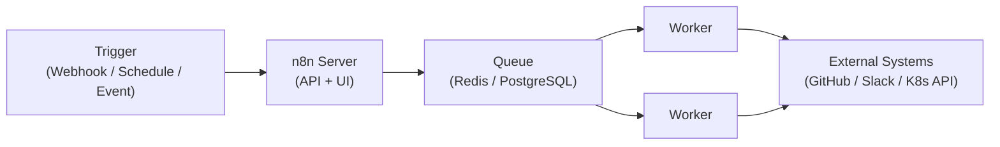
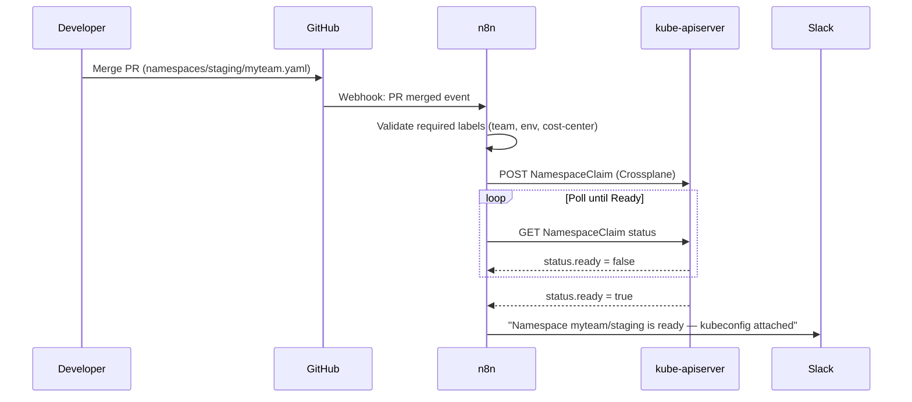
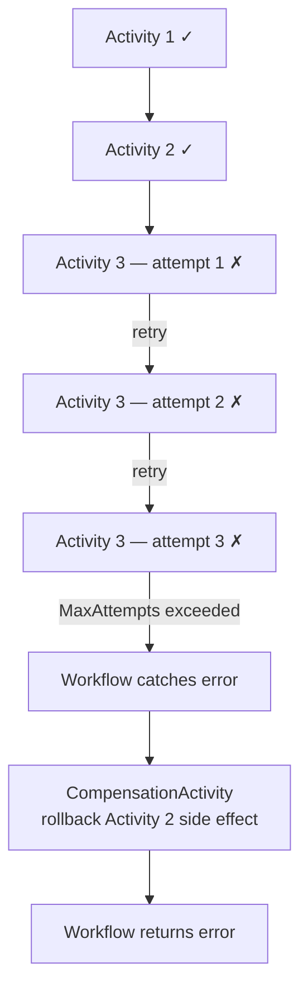

# Workflow Automation Engines

<div class="prereq-chips">
  <span class="prereq-chip">Platform Engineering</span>
  <span class="prereq-chip">Kubernetes</span>
  <span class="prereq-chip">CI/CD</span>
</div>

## Why Platforms Need Automation Engines

Shell scripts work for one-off tasks. They break as platforms grow: no retry logic, no visibility into what ran and when, no audit log, and they're hard to trigger from other systems. Automation engines solve this:

- **Visibility** — every workflow run has a log, status, duration, and output
- **Retries and error handling** — configurable retry policies without writing retry loops
- **Triggers** — webhooks, schedules, events from queues/topics, other workflows
- **Audit trail** — who triggered what, when, with what inputs

The platform team typically builds golden paths that require glue: GitHub PR merged → cluster namespace provisioned → Slack notification sent → access policy applied. That glue is where automation engines live.

---

## n8n

n8n is a self-hostable, visual workflow automation tool. Think Zapier or Make, but open-source and running in your cluster. Non-engineering teams can build workflows; engineers can extend them with custom HTTP calls or inline JavaScript.

### Architecture



Key components:
- **n8n server** — serves the UI and REST API; in smaller deployments also executes workflows directly
- **Worker processes** — separate nodes that pull jobs from the queue; enables horizontal scaling
- **Queue** — Redis (preferred) or PostgreSQL-backed; decouples trigger receipt from execution
- **Database** — PostgreSQL for production, SQLite for dev; stores workflows, credentials, execution history

### Node Types

| Category | Examples |
|----------|---------|
| **Trigger** | Webhook (HTTP POST), Schedule (cron), GitHub events, Kafka consumer, Slack message |
| **Action** | HTTP Request, PostgreSQL, Kubernetes (via kube-apiserver HTTP), Slack, PagerDuty, AWS |
| **Logic** | IF, Switch, Merge, Loop Over Items, Set, Wait |
| **Code** | Execute arbitrary JavaScript or Python inline |

### Credential Management

Credentials (OAuth2, API keys, basic auth) are stored AES-256 encrypted in the database — never logged or exposed in execution output. Workers decrypt at runtime only; credentials never leave the n8n cluster. Each credential type has a schema n8n validates before saving, so malformed tokens are rejected at input time, not at execution time.

### K8s Deployment

```bash
helm repo add n8n https://8gears.container-registry.com/chartrepo/library
helm install n8n n8n/n8n \
  --set db.type=postgresdb \
  --set db.postgresdb.host=postgres-service \
  --set executions.mode=queue \
  --set redis.host=redis-service \
  --set n8n.encryption_key="<32-char-random-key>" \
  --set persistence.enabled=true
```

Critical values:
- `db.type=postgresdb` — never use SQLite in production (file locking breaks under concurrent workers)
- `executions.mode=queue` — enables the worker pool; without this, the server handles all executions serially
- `persistence.enabled=true` — workflow definitions survive pod restarts

### Real-World Example: Self-Service Namespace Provisioning



<div class="quiz-card">
  <p class="quiz-q">A provisioning workflow has 8 steps. Step 5 (creating a database) fails. What happens in n8n by default, and how would you configure it to retry step 5 up to 3 times with 30s backoff?</p>
  <button class="quiz-reveal">Reveal answer</button>
  <div class="quiz-a" hidden>By default n8n marks the execution as failed and stops — it does NOT auto-retry. You configure retries per-node: in the node settings panel, enable "Retry On Fail" and set Max Tries to 3 and Wait Between Tries to 30000ms. On each retry, n8n re-runs that specific node only — not the whole workflow from the beginning. Steps 1–4 are not re-executed.</div>
</div>

---

## Temporal

Temporal is a durable execution engine for workflows-as-code. Where n8n gives you a visual builder for glue logic, Temporal is for long-running, crash-safe workflows written in Go, TypeScript, Python, or Java. Used by Uber, Netflix, and Stripe for multi-step business processes.

### What Is Durable Execution?

Normal code: if a process crashes mid-execution, everything is lost. Temporal rewrites this contract.

<div class="stepper">
  <div class="stepper-panels">
    <div class="stepper-panel active">
      <strong>Workflow function</strong> — pure deterministic orchestration logic. No <code>random()</code>, no <code>time.Now()</code> for branching decisions, no direct I/O. Defines the sequence of activities to call and the compensation logic on failure. The Temporal SDK replays this function on crash using the event history — it must produce identical results each replay.
    </div>
    <div class="stepper-panel">
      <strong>Activity function</strong> — the actual side-effectful work: API call, database write, <code>kubectl apply</code>. Activities are retried automatically per a configurable RetryPolicy. Completed activity results are recorded in the event log — a replaying workflow does not re-execute completed activities.
    </div>
    <div class="stepper-panel">
      <strong>Worker</strong> — a process you run that polls a Task Queue and executes Workflow and Activity code. You own the worker; Temporal Server owns the scheduler and event log. If your worker crashes, another worker (or a restarted one) picks up from the last persisted event.
    </div>
  </div>
  <div class="stepper-controls">
    <button class="stepper-prev">← Prev</button>
    <span class="stepper-dots"></span>
    <span class="stepper-label"></span>
    <button class="stepper-next">Next →</button>
  </div>
</div>

### Core Concepts in Code

Multi-step K8s namespace provisioning in Go — crash-safe:

```go
func ProvisionNamespaceWorkflow(ctx workflow.Context, input NamespaceRequest) error {
    ao := workflow.ActivityOptions{
        StartToCloseTimeout: 5 * time.Minute,
        RetryPolicy: &temporal.RetryPolicy{
            MaxAttempts:    3,
            InitialInterval: 10 * time.Second,
        },
    }
    ctx = workflow.WithActivityOptions(ctx, ao)

    // Step 1 — create the Crossplane claim
    var nsID string
    if err := workflow.ExecuteActivity(ctx, CreateCrossplaneClaimActivity, input).Get(ctx, &nsID); err != nil {
        return err
    }

    // Step 2 — wait for the claim to become Ready (timer survives worker restarts)
    if err := workflow.Sleep(ctx, 30*time.Second); err != nil {
        return err
    }

    // Step 3 — verify namespace is ready; compensate on failure
    if err := workflow.ExecuteActivity(ctx, VerifyNamespaceReadyActivity, nsID).Get(ctx, nil); err != nil {
        _ = workflow.ExecuteActivity(ctx, DeleteCrossplaneClaimActivity, nsID).Get(ctx, nil)
        return fmt.Errorf("namespace not ready: %w", err)
    }

    // Step 4 — notify team
    return workflow.ExecuteActivity(ctx, SendSlackNotificationActivity, input.Team, nsID).Get(ctx, nil)
}
```

If the worker crashes after `CreateCrossplaneClaimActivity` completes but before `VerifyNamespaceReadyActivity`, Temporal replays the workflow — `CreateCrossplaneClaimActivity` is **not called again** (its result is in the event history), and execution resumes at the `Sleep` call.

### Activity Failure and Compensation



### K8s Deployment

```bash
helm repo add temporalio https://go.temporal.io/helm-charts
helm install temporal temporalio/temporal \
  --set server.config.persistence.defaultStore=postgres \
  --set server.config.persistence.visibilityStore=postgres
```

Workers are plain Deployments — just your binary registering Workflow + Activity functions:

```yaml
containers:
- name: worker
  image: your-org/temporal-worker:latest
  env:
  - name: TEMPORAL_ADDRESS
    value: temporal-frontend:7233
  - name: TASK_QUEUE
    value: platform-provisioning
```

### Temporal Cloud vs Self-Hosted

<div class="tab-group">
  <div class="tab-buttons">
    <button data-tab="cloud" class="active">Temporal Cloud</button>
    <button data-tab="self">Self-Hosted</button>
  </div>
  <div class="tab-panels">
    <div class="tab-panel active" data-tab-panel="cloud">
      <strong>Managed service.</strong> No Cassandra/PostgreSQL to run, no Temporal server upgrades, no persistence tuning. Pay per action (workflow state transition). SOC2 Type II certified. Latency: ~5–20ms round-trip to nearest region. Best choice for most teams unless you have data residency requirements or extreme scale budgets.<br><br>
      <code>temporalcloud</code> CLI manages namespaces and certificates. Workers still run in your cluster — only the server is managed.
    </div>
    <div class="tab-panel" data-tab-panel="self">
      <strong>Self-hosted (open-source).</strong> Full control, no SaaS dependency, no per-action cost. You operate: Temporal server cluster, persistence backend (Cassandra or PostgreSQL), Elasticsearch for visibility queries, and the observability stack (Prometheus metrics, Grafana dashboards). Requires capacity planning — Temporal server is stateless, but the persistence backend is not. Choose self-hosted for air-gapped environments, large-scale cost optimization, or strict data sovereignty.
    </div>
  </div>
</div>

<div class="quiz-card">
  <p class="quiz-q">A Temporal workflow calls three external APIs sequentially. The third fails after all retry attempts. Temporal routes the error back to the Workflow function. Are the side effects from the first two API calls rolled back automatically?</p>
  <button class="quiz-reveal">Reveal answer</button>
  <div class="quiz-a" hidden>No. Temporal does not roll back completed activities automatically — it has no way to know how to undo an arbitrary API call. The workflow code must implement compensation: explicitly calling rollback/undo activities in the error-handling path. This is the Saga compensation pattern. What Temporal guarantees is that your compensation code will run reliably even if a worker crashes mid-compensation — the event log ensures it resumes.</div>
</div>

---

## Argo Workflows

Argo Workflows is a CNCF graduated project — a Kubernetes-native workflow engine where each step runs as a pod. No separate server: the Argo controller runs inside K8s and uses the K8s API (etcd) as its persistence layer. Popular for CI/CD pipelines, ML training jobs, and data processing — anything that benefits from arbitrary container images per step.

### Key Concepts

<div class="stepper">
  <div class="stepper-panels">
    <div class="stepper-panel active">
      <strong>Workflow</strong> — a K8s CRD (<code>kind: Workflow</code>) that defines the DAG or sequential steps. Each Workflow run creates actual pods in your cluster — resource usage is visible in K8s, and step logs are just pod logs.
    </div>
    <div class="stepper-panel">
      <strong>Templates</strong> — reusable step definitions referenced within a Workflow. Types: <code>container</code> (run a Docker image), <code>script</code> (inline Python/Bash), <code>dag</code> (dependency graph), <code>steps</code> (sequential), <code>resource</code> (apply a K8s manifest), <code>suspend</code> (wait for human approval).
    </div>
    <div class="stepper-panel">
      <strong>Artifacts</strong> — for large outputs between steps (model weights, datasets). Backed by S3, GCS, or a volume. Each step declares <code>outputs.artifacts</code>; the next declares <code>inputs.artifacts</code>. The controller handles the transfer. Parameters are for small values (&lt;256KB); artifacts for everything else.
    </div>
    <div class="stepper-panel">
      <strong>WorkflowTemplate</strong> — a cluster-scoped or namespace-scoped CRD of reusable templates. Workflows reference them via <code>templateRef</code>, enabling a library of shared steps (build-image, run-tests, notify-slack) shared across teams without copy-paste.
    </div>
  </div>
  <div class="stepper-controls">
    <button class="stepper-prev">← Prev</button>
    <span class="stepper-dots"></span>
    <span class="stepper-label"></span>
    <button class="stepper-next">Next →</button>
  </div>
</div>

### Example: CI Pipeline (build → test → deploy)

```yaml
apiVersion: argoproj.io/v1alpha1
kind: Workflow
metadata:
  generateName: ci-pipeline-
spec:
  entrypoint: pipeline
  templates:
  - name: pipeline
    dag:
      tasks:
      - name: build
        template: build-image
      - name: test
        dependencies: [build]
        template: run-tests
        arguments:
          parameters:
          - name: image
            value: "{{tasks.build.outputs.parameters.image}}"
      - name: deploy
        dependencies: [test]
        template: argo-rollout-update

  - name: build-image
    container:
      image: gcr.io/kaniko-project/executor:latest
      command: [/kaniko/executor]
      args: ["--destination=registry/myapp:{{workflow.name}}"]
    outputs:
      parameters:
      - name: image
        valueFrom:
          path: /tmp/image-name

  - name: run-tests
    inputs:
      parameters:
      - name: image
    container:
      image: "{{inputs.parameters.image}}"
      command: [go, test, ./...]

  - name: argo-rollout-update
    resource:
      action: patch
      manifest: |
        apiVersion: argoproj.io/v1alpha1
        kind: Rollout
        metadata:
          name: myapp
        spec:
          template:
            spec:
              containers:
              - name: myapp
                image: registry/myapp:{{workflow.name}}
```

### K8s Deployment

```bash
helm repo add argo https://argoproj.github.io/argo-helm
helm install argo-workflows argo/argo-workflows \
  --namespace argo \
  --create-namespace \
  --set server.authMode=server
```

### Argo Workflows vs ArgoCD

These are different tools that work together. ArgoCD is a GitOps continuous delivery tool — it syncs K8s manifests from Git to the cluster. Argo Workflows runs arbitrary multi-step jobs as pods. A common pattern: ArgoCD triggers an Argo Workflow for pre/post-sync hooks (database migration before rollout, smoke tests after deploy).

<div class="quiz-card">
  <p class="quiz-q">An Argo Workflow step produces a 500MB model artifact that the next step needs as input. You cannot use a parameters output (limited to ~256KB). What mechanism does Argo Workflows provide, and where is the artifact stored by default?</p>
  <button class="quiz-reveal">Reveal answer</button>
  <div class="quiz-a" hidden>Artifacts. Configure an <code>artifactRepository</code> in the argo-workflows ConfigMap pointing to your S3 bucket (default) or GCS/Azure Blob. The producing step declares <code>outputs.artifacts</code> with a name and path; the consuming step declares <code>inputs.artifacts</code> with the same name. The Argo controller handles upload after the producing pod exits and download before the consuming pod starts — your container just reads/writes a local path.</div>
</div>

---

## Kestra

Kestra is an open-source orchestration and scheduling platform that sits between n8n (visual-first) and Temporal (code-first). Workflows are YAML "flows" with a visual editor that renders the YAML — engineers version flows in Git, non-engineers read them in the UI. Every task maps to a plugin (500+ available: HTTP, Kubernetes, Spark, dbt, Terraform, Slack, and more).

### Core Concepts

| Concept | Description |
|---------|-------------|
| **Flow** | A YAML file defining tasks, triggers, inputs, and variables — the unit of work |
| **Task** | A single step; maps to a plugin (`io.kestra.plugin.http.Request`, `io.kestra.plugin.kubernetes.runner.Kubernetes`, etc.) |
| **Trigger** | What starts a flow: schedule (cron), webhook, flow completion, file arrival, Kafka/SQS message |
| **Namespace** | Logical grouping of flows — like K8s namespaces, with RBAC and secret scoping |

### Example: Webhook → Namespace Provisioning → Slack

```yaml
id: provision-namespace
namespace: platform.ops
inputs:
  - id: team
    type: STRING
  - id: environment
    type: STRING

tasks:
  - id: create-crossplane-claim
    type: io.kestra.plugin.kubernetes.runner.Kubernetes
    namespace: crossplane-system
    spec:
      apiVersion: platform.example.com/v1alpha1
      kind: NamespaceClaim
      metadata:
        name: "{{inputs.team}}-{{inputs.environment}}"
      spec:
        team: "{{inputs.team}}"
        environment: "{{inputs.environment}}"

  - id: wait-ready
    type: io.kestra.core.tasks.flows.Pause
    delay: PT30S

  - id: notify-slack
    type: io.kestra.plugin.notifications.slack.SlackIncomingWebhook
    url: "{{secret('SLACK_WEBHOOK')}}"
    payload: |
      {"text": "Namespace {{inputs.team}}/{{inputs.environment}} is ready."}

triggers:
  - id: webhook
    type: io.kestra.core.models.triggers.types.Webhook
    key: "{{secret('WEBHOOK_KEY')}}"
```

### K8s Deployment

```bash
helm repo add kestra https://helm.kestra.io/
helm install kestra kestra/kestra \
  --set configuration.kestra.storage.type=s3 \
  --set configuration.kestra.queue.type=postgres
```

<div class="quiz-card">
  <p class="quiz-q">Kestra and n8n both support webhook triggers and HTTP tasks. When would you choose Kestra over n8n?</p>
  <button class="quiz-reveal">Reveal answer</button>
  <div class="quiz-a" hidden>Choose Kestra when: (1) you want flows as YAML versioned in Git — n8n stores workflows in its database and exporting requires manual steps; (2) you need typed plugin integrations with K8s, Spark, or dbt rather than generic HTTP; (3) you need namespace isolation and RBAC across teams in a single instance. Choose n8n when: non-engineers need to build or modify automations via drag-and-drop, or you need the broadest range of SaaS integrations out of the box.</div>
</div>

---

## Automation Engine Decision Guide

| | n8n | Temporal | Argo Workflows | Kestra | Prefect | Windmill |
|--|-----|----------|----------------|--------|---------|----------|
| **Model** | Visual low-code | Workflows as code | K8s-native pods | YAML-first + UI | Python dataflow | Code + UI hybrid |
| **Durability** | DB-backed, per-node retries | Event-sourced history — survives mid-activity crashes | K8s etcd (pod state) | DB-backed | DB-backed | DB-backed |
| **Languages** | Any via HTTP; logic in JS/Python | Go, TypeScript, Python, Java | Any container image | YAML + plugins | Python | Python, TypeScript, Go |
| **Self-hosted** | Helm | Helm (+ Postgres) or Temporal Cloud | Helm (K8s required) | Docker / Helm | Docker / Cloud | Docker |
| **K8s-native** | No | No | Yes (CRD-based) | Partial (K8s plugin) | No | No |
| **Best for** | HTTP glue, non-dev teams | Long-running, crash-safe critical workflows | K8s CI/CD, ML pipelines, pod-based jobs | GitOps-friendly YAML flows | ML/data pipelines | Dev scripts + UI |
| **CNCF** | No | No | Yes (graduated) | No | No | No |
| **When NOT to use** | Crash-safety across long durations | Simple 1–2 step automations | No K8s, or need non-container steps | Real-time event-driven glue | Real-time ops workflows | Enterprise audit requirements |
