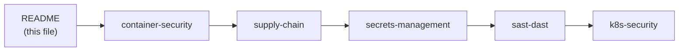

# Security Engineering: DevSecOps and Shift-Left Security

Security engineering is not a separate team that reviews PRs at the end — it is a set of practices, tools, and cultural norms that make security everyone's responsibility, embedded at every stage of the development lifecycle. The fundamental insight is that bugs found in production cost 100x more to fix than bugs found in code review, and security vulnerabilities are bugs.

---

## 1. Security Engineering vs DevOps

DevOps collapsed the wall between development and operations. Security engineering (DevSecOps) collapses the wall between both of those and security. The goal is not to slow down delivery — it is to make delivery inherently secure.

The traditional model: developers write code → operations deploys it → security audits it (quarterly, if at all). Problems with this:
- Vulnerabilities are found months after they were introduced, when fixing them requires large refactors.
- Security is a bottleneck, not an enabler — it blocks releases.
- Security teams don't understand the system; engineering teams don't understand the threat model.

The DevSecOps model: security checks run automatically in every PR, every build, and every deployment. Security engineers write tooling and policies, not tickets.

## 2. Shift-Left and the Cost-of-a-Bug Curve

"Shift left" means moving security checks earlier in the development lifecycle (to the left on a timeline). The IBM Systems Science Institute quantified the cost multiplier:

| Stage | Relative cost to fix a bug |
|-------|---------------------------|
| Design | 1× |
| Code review / PR | 6× |
| Integration testing | 15× |
| System testing (QA) | 30× |
| Production | 100× |

A secrets leak caught by a pre-commit hook costs a developer 30 seconds. The same leak caught after a production breach costs weeks of incident response, credential rotation, customer notification, and potential regulatory fines.

**Practical shift-left checklist:**
- Pre-commit: `gitleaks` / `detect-secrets` for hardcoded credentials
- PR / CI: SAST (Semgrep, CodeQL), IaC scanning (Checkov), dependency scanning (Dependabot)
- Build: image scanning (Trivy), supply chain signing (cosign)
- Deploy: admission control (Gatekeeper, Kyverno), runtime security (Falco, Tetragon)
- Runtime: continuous vulnerability scanning, audit log analysis

## 3. OWASP DevSecOps Maturity Model

OWASP defines four maturity levels for DevSecOps programs. Most organizations start at level 1 by default (doing nothing) and target level 3 as a reasonable production goal.

| Level | Description | Indicators |
|-------|-------------|------------|
| 1 | Ad hoc | Security is reactive; no automated checks in CI |
| 2 | Defined | SAST and dependency scanning in CI; security champions per team |
| 3 | Measured | SLAs for vulnerability remediation; DORA metrics include security metrics (MTTD, MTTR for CVEs) |
| 4 | Optimized | Automated remediation (auto-PR for CVE patches); threat modeling integrated into design phase |

Most production engineering teams operate between level 2 and 3.

## 4. Threat Modeling with STRIDE

Threat modeling is the practice of systematically identifying how an attacker could abuse a system, before writing code. STRIDE is a mnemonic for six threat categories, developed at Microsoft:

| Letter | Threat | Example |
|--------|--------|---------|
| S | Spoofing | Attacker sends requests pretending to be a trusted service |
| T | Tampering | Attacker modifies data in transit or at rest |
| R | Repudiation | Actor performs an action but denies it (no audit log) |
| I | Information disclosure | API returns more data than the caller should see |
| D | Denial of Service | Attacker floods an endpoint, making it unavailable |
| E | Elevation of privilege | Attacker escalates from low-privilege to admin access |

**How to run a STRIDE session:**
1. Draw a data flow diagram (DFD) of the system — every service, data store, and trust boundary.
2. For each component and data flow, systematically ask: can each STRIDE threat apply here?
3. For each threat identified: rate likelihood × impact (1–5), assign an owner, and decide to mitigate, accept, or transfer.

A 1-hour STRIDE session on a new API design catches more security issues than a 2-week penetration test run after launch, because it happens when the design can still change.

---

## Read Order

| File | What it covers |
|------|---------------|
| `container-security` | Image scanning, distroless images, Falco runtime security |
| `supply-chain` | SLSA, cosign signing, SBOM, dependency scanning |
| `secrets-management` | Vault, External Secrets Operator, Sealed Secrets, SOPS |
| `sast-dast` | Semgrep, Checkov, OWASP ZAP, false-positive triage |
| `k8s-security` | Pod Security Standards, Gatekeeper, Kyverno, audit logging |
