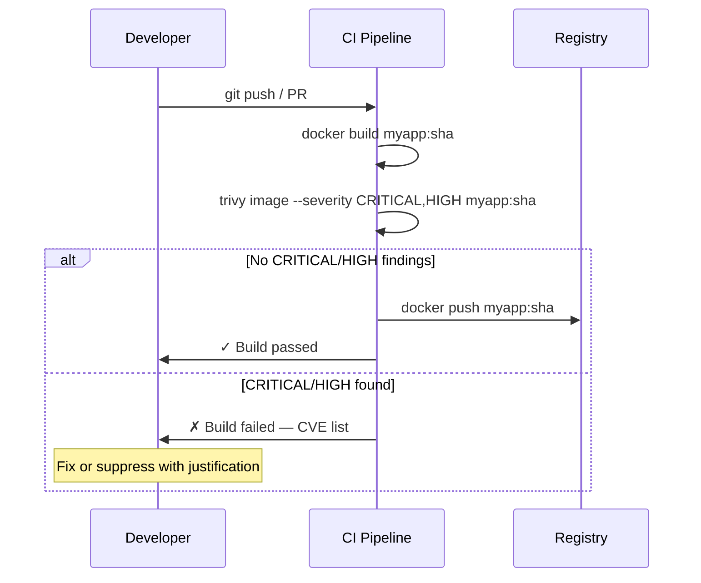

# Container Security: Images, Runtime, and the CIS Benchmark

A container is not a security boundary — it is a process isolation mechanism. Understanding where containers provide isolation and where they share resources with the host is the foundation of container security. Most container security incidents trace back to one of three root causes: a vulnerable dependency in the image, a misconfigured runtime (privileged mode, mounted Docker socket), or a missing runtime detection layer.

<div class="quiz-progress" data-quiz-progress>
  <span class="quiz-progress-label">0/0 checks</span>
  <span class="quiz-progress-bar"><span class="quiz-progress-fill"></span></span>
</div>

---

## 1. Why Image Size Is a Security Surface

Every package installed in a container image is a potential vulnerability. A Ubuntu 22.04 base image includes a C compiler, curl, bash, apt, and hundreds of other tools — none of which a production web service needs, all of which can be exploited if a CVE is discovered in them.

A Trivy scan comparison illustrates this directly:

```bash
# Ubuntu base image — 100+ known vulnerabilities
trivy image ubuntu:22.04
# Result: 25 CRITICAL, 45 HIGH, 58 MEDIUM

# Alpine 3.19 — minimal attack surface
trivy image alpine:3.19
# Result: 0 CRITICAL, 0 HIGH, 2 MEDIUM

# Distroless Python — no shell, no package manager
trivy image gcr.io/distroless/python3
# Result: 0 CRITICAL, 0 HIGH, 0 MEDIUM
```

The principle: **only ship what you need to run**. Every additional binary is an additional exploitation path.

---

## 2. Image Scanning with Trivy and Grype

### Trivy

Trivy (Aqua Security, CNCF project) scans container images, filesystem paths, and Git repositories for:
- OS package vulnerabilities (CVEs against the package database)
- Application dependency vulnerabilities (npm, pip, go.sum, Gemfile.lock)
- Misconfigurations in Dockerfiles and Kubernetes manifests
- Secrets hardcoded in image layers

```bash
# Scan an image, fail on CRITICAL or HIGH
trivy image --exit-code 1 --severity CRITICAL,HIGH myapp:latest

# Scan with SARIF output (for GitHub Code Scanning)
trivy image --format sarif --output trivy-results.sarif myapp:latest

# Scan a local filesystem (useful for CI before docker build)
trivy fs --severity CRITICAL,HIGH .
```

**CI integration (GitHub Actions):**

```yaml
- name: Scan image for vulnerabilities
  uses: aquasecurity/trivy-action@master
  with:
    image-ref: myapp:${{ github.sha }}
    format: table
    exit-code: 1
    severity: CRITICAL,HIGH
    ignore-unfixed: true   # skip CVEs where no fix exists yet
```

### Grype

Grype (Anchore) is an alternative with the same concept. It produces a Software Bill of Materials (SBOM) as a side effect, which is useful for supply chain compliance.

```bash
grype myapp:latest --fail-on critical
```

### Severity policy

Teams often struggle with "severity creep" — accumulating unfixed MEDIUM vulnerabilities until the scan output is meaningless. A practical policy:
- **CRITICAL**: block the build immediately, must fix before merge
- **HIGH**: block the build; engineer can open a tracking ticket with a 7-day SLA if a fix is not available
- **MEDIUM**: log and track; fix within 30 days
- **LOW/NEGLIGIBLE**: track in a backlog, no blocking

The `--ignore-unfixed` flag prevents blocking on CVEs where upstream has not yet released a patched package — otherwise engineers are blocked on things outside their control.



<div class="quiz-card">
  <p class="quiz-q">Your CI Trivy scan shows 3 CRITICAL vulnerabilities in `openssl` within the base image `python:3.11-slim`. You check and there is no patched version of this base image available yet. According to the severity policy described above, what are your two options and what does each require?</p>
  <button class="quiz-reveal">Reveal answer</button>
  <div class="quiz-a" hidden>Option 1: **Use `--ignore-unfixed`** — this tells Trivy to skip CVEs where no upstream fix is available. The build unblocks, but the vulnerability remains tracked. This is the correct choice when the upstream package maintainer hasn't released a patch yet and you have no workaround. Option 2: **Pin a different base image** — check if a newer tag of `python:3.11-slim` or an alternative (e.g., `python:3.11-alpine`, `chainguard/python`) has already picked up a patched `openssl`. If one exists, switching the base image fixes the underlying issue rather than suppressing the finding. Never use `--ignore-unfixed` as a permanent workaround when a fix actually exists — it masks real risk.</div>
</div>

---

## 3. Distroless and Minimal Base Images

Distroless images (Google) contain only the application runtime and its dependencies — no shell, no package manager, no coreutils. If an attacker gains code execution in a distroless container, they cannot run `ls`, `curl`, or `bash` to explore or exfiltrate.

```dockerfile
# Multi-stage: build in full image, copy to distroless
FROM python:3.11-slim AS builder
WORKDIR /app
COPY requirements.txt .
RUN pip install --no-cache-dir --prefix=/install -r requirements.txt

FROM gcr.io/distroless/python3-debian12
COPY --from=builder /install /usr/local
COPY --from=builder /app /app
WORKDIR /app
CMD ["server.py"]
```

**Chainguard images** are a commercial alternative with even more aggressive minimalism and daily CVE patching. They use a cryptographically-signed SBOM and are rebuilt from source daily.

**What you lose with distroless:**
- No `sh` for `kubectl exec` debugging (use ephemeral debug containers: `kubectl debug -it pod/x --image=busybox`)
- No package manager — you cannot install tools at runtime (which is the point)
- No `curl` for health-check scripts — use the application's own health endpoint

---

## 4. CIS Docker Benchmark

The CIS Docker Benchmark is a community standard for Docker security configuration. Key checks relevant to Kubernetes workloads:

| Check | What to verify | How to fix |
|-------|---------------|-----------|
| 4.1 | Container does not run as root | `USER 1000` in Dockerfile or `securityContext.runAsUser: 1000` |
| 4.6 | `HEALTHCHECK` instruction defined | Add `HEALTHCHECK CMD curl -f http://localhost/health` |
| 5.1 | AppArmor profile enabled | `--security-opt apparmor=docker-default` |
| 5.4 | Privileged containers not used | `securityContext.privileged: false` (the default) |
| 5.7 | Sensitive host paths not mounted | No `/var/run/docker.sock`, no `/etc` mounts |
| 5.12 | Read-only root filesystem | `securityContext.readOnlyRootFilesystem: true` |
| 5.15 | Host PID namespace not shared | `hostPID: false` (the default) |

**docker-bench-security** (CIS's own tool) automates these checks:

```bash
docker run --rm --net host --pid host --userns host --cap-add audit_control \
  -v /etc:/etc:ro -v /usr/bin/containerd:/usr/bin/containerd:ro \
  -v /var/lib:/var/lib:ro -v /var/run/docker.sock:/var/run/docker.sock:ro \
  docker/docker-bench-security
```

In Kubernetes, Gatekeeper and Kyverno policies enforce these same checks at the cluster level, preventing non-compliant pods from being scheduled.

<div class="quiz-card">
  <p class="quiz-q">A developer argues that setting `readOnlyRootFilesystem: true` will break their application because it writes temporary files to `/tmp`. They want to skip this CIS check. What is the correct resolution?</p>
  <button class="quiz-reveal">Reveal answer</button>
  <div class="quiz-a" hidden>Don't skip the check — mount a writable `emptyDir` volume at `/tmp`. A read-only root filesystem does not mean zero writable paths; it means the filesystem image itself cannot be modified. Specific directories can still be writable via volume mounts. The correct pod spec is: `readOnlyRootFilesystem: true` in the security context, plus a `volumes: [{name: tmp, emptyDir: {}}]` and `volumeMounts: [{name: tmp, mountPath: /tmp}]`. This satisfies the CIS check (root FS immutable, preventing an attacker from modifying binaries or config files) while giving the application a writable scratchpad. The `emptyDir` is ephemeral — it disappears when the pod is deleted — which is exactly what a temp directory should do.</div>
</div>

---

## 5. Runtime Security with Falco

Trivy finds vulnerabilities before deployment. Falco detects attacks at runtime — while they are happening. Falco uses eBPF (or a kernel module) to intercept every syscall and compares them against a rule set.

**Example Falco rule — detect shell spawned in container:**

```yaml
- rule: Terminal shell in container
  desc: A shell was spawned in a container with an attached terminal
  condition: >
    spawned_process
    and container
    and shell_procs
    and proc.tty != 0
  output: >
    Shell spawned in a container (user=%user.name container=%container.name
    image=%container.image.repository shell=%proc.name parent=%proc.pname
    cmdline=%proc.cmdline terminal=%proc.tty container_id=%container.id)
  priority: WARNING
  tags: [container, shell, mitre_execution]
```

**Example Falco rule — detect /etc/shadow access:**

```yaml
- rule: Read sensitive file untrusted
  desc: An attempt to read sensitive files by an untrusted process
  condition: >
    open_read
    and sensitive_files
    and not proc.name in (trusted_binaries)
    and container
  output: >
    Sensitive file read (user=%user.name file=%fd.name
    container=%container.name image=%container.image.repository)
  priority: CRITICAL
```

**Alerting to Slack via Falco Sidekick:**

```yaml
# falcosidekick config
slack:
  webhookurl: "https://hooks.slack.com/services/..."
  channel: "#security-alerts"
  minimumpriority: "warning"
```

Falco Sidekick routes Falco alerts to 50+ outputs including PagerDuty, Datadog, Elasticsearch, and Kafka. In a production environment, CRITICAL Falco alerts should page the on-call engineer immediately.

<div class="quiz-card">
  <p class="quiz-q">Falco detects that a process named `python3` in the `payments-api` container opened `/etc/passwd` for reading. The on-call engineer checks and confirms this is a legitimate path — the application reads `/etc/passwd` to resolve usernames for audit logging. How do you handle this without disabling the rule entirely?</p>
  <button class="quiz-reveal">Reveal answer</button>
  <div class="quiz-a" hidden>Add the process to the `trusted_binaries` macro, scoped to the specific container image. Falco macros are lists that can be extended without modifying the base rule. Add a `- macro: trusted_binaries` override in your local rules file: `condition: (trusted_binaries) or (proc.name = "python3" and container.image.repository = "myorg/payments-api")`. This suppresses the alert for the specific image + process combination without disabling the rule for other containers. The key is scoping the exception tightly: if you exempt all `python3` processes in all containers, you create a blind spot for every Python workload. Never suppress a CRITICAL Falco rule with an unscoped exception — that defeats the purpose of runtime detection.</div>
</div>

---

## 6. Rootless Containers and userns-remap

By default, the Docker daemon runs as root on the host. A container breakout in this configuration gives the attacker root on the host. Two mitigations:

**Rootless Docker** runs the Docker daemon as a non-root user (using user namespaces). Most operations work identically; the limitation is that certain host mounts (e.g., `--net host`) require additional configuration.

```bash
# Install and start rootless Docker
dockerd-rootless-setuptool.sh install
systemctl --user start docker
```

**userns-remap** keeps the Docker daemon running as root but maps the `root` user inside containers to an unprivileged user on the host:

```json
// /etc/docker/daemon.json
{
  "userns-remap": "default"
}
```

With `userns-remap: default`, the container's UID 0 maps to host UID 100000. If a process escapes the container, it has no privileges on the host — UID 100000 is an unprivileged user with no home directory or special permissions.

In Kubernetes, the equivalent is `securityContext.runAsNonRoot: true` and `securityContext.runAsUser: 1000` — containers must not run as root inside the pod, enforced by the kubelet before the container starts.
