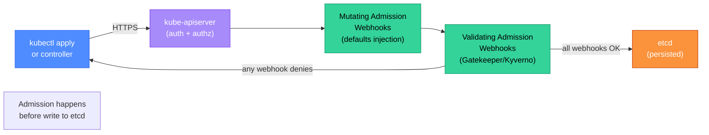

# Kubernetes Security: Admission Control, Policies, and Audit Logging

Kubernetes has extensive security primitives, but most of them are opt-in. A default-configured cluster allows privileged containers, hostPath mounts, and containers running as root — all of which are common container escape vectors. Securing a cluster means layering Pod Security Standards, admission controllers, network policies, and audit logging so that individual misconfigurations cannot cascade into cluster-wide compromise.

<div class="quiz-progress" data-quiz-progress>
  <span class="quiz-progress-label">0/0 checks</span>
  <span class="quiz-progress-bar"><span class="quiz-progress-fill"></span></span>
</div>

---

## 1. Pod Security Standards

Pod Security Standards (PSS) replaced the deprecated PodSecurityPolicy in Kubernetes 1.25. Three built-in profiles enforce increasing levels of restriction at the namespace level:

| Profile | What it allows | Use case |
|---------|---------------|----------|
| **privileged** | No restrictions — any pod spec is accepted | System namespaces (kube-system, Falco, CNI plugins) |
| **baseline** | Prevents the most egregious escalations: no privileged containers, no hostPID/hostIPC, no dangerous capabilities | General workloads that haven't been audited yet |
| **restricted** | Enforces security best practices: must run as non-root, readOnlyRootFilesystem, drop ALL capabilities, no volume types except emptyDir/configMap/secret/projected | Hardened production workloads |

**Enforcing via namespace label:**

```yaml
# Enforce restricted profile — reject any pod that violates it
apiVersion: v1
kind: Namespace
metadata:
  name: payments
  labels:
    pod-security.kubernetes.io/enforce: restricted
    pod-security.kubernetes.io/enforce-version: v1.29
    pod-security.kubernetes.io/warn: restricted    # also warn in kubectl output
    pod-security.kubernetes.io/audit: restricted   # log violations to audit log
```

Three modes are independent:
- `enforce`: reject pods that violate the profile
- `warn`: admit the pod but emit a warning in the kubectl response
- `audit`: admit the pod but log the violation in the Kubernetes audit log

Start with `warn` and `audit` on existing namespaces before switching to `enforce` — this reveals violations without breaking production.

---

## 2. OPA Gatekeeper

Gatekeeper (OPA-based, CNCF) extends PSS with custom policies written in Rego. It runs as a validating admission webhook — every API server request passes through it before being written to etcd.

**ConstraintTemplate** (defines the policy logic in Rego):

```yaml
apiVersion: templates.gatekeeper.sh/v1
kind: ConstraintTemplate
metadata:
  name: k8snolatestimage
spec:
  crd:
    spec:
      names:
        kind: K8sNoLatestImage
  targets:
    - target: admission.k8s.gatekeeper.sh
      rego: |
        package k8snolatestimage

        violation[{"msg": msg}] {
          container := input.review.object.spec.containers[_]
          endswith(container.image, ":latest")
          msg := sprintf("Container %v uses ':latest' tag — use a pinned digest", [container.name])
        }

        violation[{"msg": msg}] {
          container := input.review.object.spec.containers[_]
          not contains(container.image, ":")
          msg := sprintf("Container %v has no tag — use a pinned digest", [container.name])
        }
```

**Constraint** (instantiates the template, scopes it to namespaces):

```yaml
apiVersion: constraints.gatekeeper.sh/v1beta1
kind: K8sNoLatestImage
metadata:
  name: no-latest-image
spec:
  enforcementAction: deny   # or "warn" for audit-only mode
  match:
    kinds:
      - apiGroups: [""]
        kinds: ["Pod"]
    namespaceSelector:
      matchExpressions:
        - key: pod-security.kubernetes.io/enforce
          operator: Exists   # apply to any namespace that uses PSS
  parameters: {}
```

**Resource limits policy** (another common ConstraintTemplate):

```rego
violation[{"msg": msg}] {
  container := input.review.object.spec.containers[_]
  not container.resources.limits.cpu
  msg := sprintf("Container %v must have CPU limits set", [container.name])
}
```



<div class="quiz-card">
  <p class="quiz-q">Gatekeeper rejects a Deployment because its init container uses the `:latest` tag — the `K8sNoLatestImage` constraint checks `spec.containers[_]` but not `spec.initContainers[_]`. This is a gap in the ConstraintTemplate. How do you fix the Rego policy to cover init containers and ephemeral containers as well?</p>
  <button class="quiz-reveal">Reveal answer</button>
  <div class="quiz-a" hidden>Add additional `violation` rules for `spec.initContainers` and `spec.ephemeralContainers`. In Rego, each `violation` rule is independent, so you can copy the container check and change the array reference: `container := input.review.object.spec.initContainers[_]` for init containers, and `container := input.review.object.spec.ephemeralContainers[_]` for ephemeral containers. Alternatively, use a helper rule that aggregates all container types: `all_containers[container] { container := input.review.object.spec.containers[_] }` + `all_containers[container] { container := input.review.object.spec.initContainers[_] }` + `all_containers[container] { container := input.review.object.spec.ephemeralContainers[_] }`, then reference `all_containers[container]` in the violation rule. This avoids repeating the check three times. This pattern — checking only `containers` but not `initContainers` — is one of the most common Gatekeeper policy gaps in production clusters. Audit your existing ConstraintTemplates for this omission.</div>
</div>

---

## 3. Kyverno

Kyverno is an alternative to Gatekeeper that uses YAML instead of Rego. Policies are Kubernetes-native YAML resources — no new language to learn. Kyverno also supports mutating (auto-fix) and generating (create related resources) in addition to validating.

<div class="tab-group">
  <div class="tab-buttons">
    <button class="tab-btn active" data-tab="gatekeeper">Gatekeeper</button>
    <button class="tab-btn" data-tab="kyverno">Kyverno</button>
  </div>
  <div class="tab-panel active" data-tab-panel="gatekeeper">

**OPA Gatekeeper** — Rego-based policies.

- Policies written in Rego (OPA's policy language) — powerful, composable, but requires learning Rego
- Validate-only (can deny or warn); mutation requires a separate MutatingWebhookConfiguration
- Can query external data sources via Rego's `http.send`
- Widely adopted in enterprises already using OPA for other policy decisions (Terraform, API gateways)
- Audit mode: scans existing resources, not just new ones — flags pre-existing violations
- **Best for**: teams that already use OPA; complex multi-condition policies; audit-first rollout

  </div>
  <div class="tab-panel" data-tab-panel="kyverno">

**Kyverno** — YAML-native policies.

- Policies are ClusterPolicy YAML — same format as any other Kubernetes resource
- Supports validate, mutate, generate, and verifyImages (cosign integration) in one policy
- Mutating example: automatically add `runAsNonRoot: true` if missing
- Generate example: create a default NetworkPolicy when a new namespace is created
- Lower barrier to entry; platform teams can write policies without learning Rego
- **Best for**: teams that want to minimize new tools/languages; policies that also need mutation; cosign image verification enforcement

**Kyverno ClusterPolicy example — require non-root + auto-mutate:**

```yaml
apiVersion: kyverno.io/v1
kind: ClusterPolicy
metadata:
  name: require-non-root
spec:
  rules:
    - name: check-runAsNonRoot
      match:
        any:
          - resources:
              kinds: [Pod]
      mutate:
        patchStrategicMerge:
          spec:
            securityContext:
              +(runAsNonRoot): true
              +(runAsUser): 1000
      validate:
        message: "Pods must run as non-root"
        pattern:
          spec:
            securityContext:
              runAsNonRoot: true
```

  </div>
</div>

---

## 4. Network Policies for Microsegmentation

By default, every pod in a Kubernetes cluster can reach every other pod — there is no network isolation between namespaces or between teams. A compromised pod can laterally move to any service in the cluster. Network policies are the firewall rules for pod-to-pod traffic.

**Default deny — block all ingress and egress, then allow only what's needed:**

```yaml
# Apply to every namespace — zero-trust baseline
apiVersion: networking.k8s.io/v1
kind: NetworkPolicy
metadata:
  name: default-deny-all
  namespace: payments
spec:
  podSelector: {}   # applies to all pods in the namespace
  policyTypes:
    - Ingress
    - Egress
```

**Allow only from the frontend namespace to payments-api on port 8080:**

```yaml
apiVersion: networking.k8s.io/v1
kind: NetworkPolicy
metadata:
  name: allow-frontend-to-payments
  namespace: payments
spec:
  podSelector:
    matchLabels:
      app: payments-api
  ingress:
    - from:
        - namespaceSelector:
            matchLabels:
              kubernetes.io/metadata.name: frontend
          podSelector:
            matchLabels:
              app: frontend
      ports:
        - port: 8080
  egress:
    - to:
        - podSelector:
            matchLabels:
              app: postgres
      ports:
        - port: 5432
    - to:
        - namespaceSelector:
            matchLabels:
              kubernetes.io/metadata.name: kube-system
      ports:
        - port: 53   # DNS
```

**Testing with netshoot:**

```bash
# From a debug pod in the frontend namespace — should succeed
kubectl run tmp --rm -i --tty -n frontend --image=nicolaka/netshoot -- curl http://payments-api.payments:8080/health

# From a pod in a different namespace — should be blocked
kubectl run tmp --rm -i --tty -n monitoring --image=nicolaka/netshoot -- curl http://payments-api.payments:8080/health
# Expected: connection timeout (no ICMP reject — the packets are silently dropped)
```

---

## 5. Privilege Escalation Paths

Understanding how attackers escape containers helps you configure admission control to block the escape paths:

| Escape vector | Mechanism | Admission control fix |
|---------------|-----------|----------------------|
| **`/var/run/docker.sock` mount** | Container with Docker socket access can run new privileged containers on the host | Gatekeeper: deny `hostPath` mounts containing `docker.sock`; Kyverno: same |
| **`hostPID: true`** | Container can see and send signals to all host processes; combined with `ptrace`, can compromise other containers | PSS baseline/restricted: denied |
| **`privileged: true`** | Container has all capabilities + access to all host devices; nearly equivalent to root on the host | PSS baseline/restricted: denied |
| **`CAP_SYS_ADMIN`** | Single capability that enables namespace, mount, and many other privileged operations | PSS restricted: `drop: ALL`, no `add`; Gatekeeper: deny specific dangerous caps |
| **Writable `hostPath`** | Container writes to a host directory; can modify `/etc/cron.d` or `/usr/bin` | PSS baseline: restricted `hostPath` types; Gatekeeper: deny writable host mounts |

---

## 6. Audit Logging

The Kubernetes API server can log every request — who called what API, when, with what parameters. Audit logs are the forensic record for incident investigation.

**Audit policy** (`/etc/kubernetes/audit-policy.yaml`):

```yaml
apiVersion: audit.k8s.io/v1
kind: Policy
rules:
  # Log all requests to secrets at RequestResponse level (full body)
  - level: RequestResponse
    resources:
      - group: ""
        resources: ["secrets"]

  # Log pod exec at Metadata level (who ran exec, but not the command content)
  - level: Metadata
    verbs: ["create"]
    resources:
      - group: ""
        resources: ["pods/exec", "pods/portforward", "pods/attach"]

  # Ignore read-only requests to non-sensitive resources
  - level: None
    verbs: ["get", "list", "watch"]
    resources:
      - group: ""
        resources: ["configmaps", "pods", "services"]

  # Default: log everything else at Metadata level
  - level: Metadata
```

**Audit levels:**
- `None`: don't log
- `Metadata`: log the request metadata (user, verb, resource) but not the body
- `Request`: log metadata + request body
- `RequestResponse`: log metadata + request body + response body (most verbose, expensive for high-traffic APIs)

**Shipping to SIEM** via Fluent Bit:

```yaml
# fluent-bit-config.yaml
[INPUT]
    Name   tail
    Path   /var/log/kubernetes/audit.log
    Parser json

[FILTER]
    Name  grep
    Match *
    Regex level (RequestResponse|Metadata)

[OUTPUT]
    Name  es
    Match *
    Host  elasticsearch.logging.svc
    Port  9200
    Index k8s-audit
```

Alert on: `kubectl exec` to pods in production namespaces outside business hours; any access to Secrets by ServiceAccounts that shouldn't need them; API calls from unusual source IPs (not the cluster's pod CIDR).
