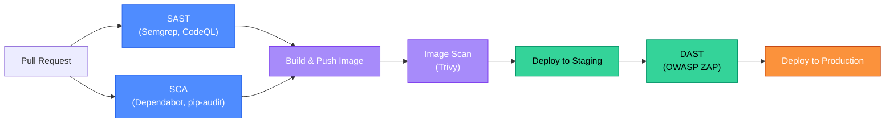

# SAST, DAST, and SCA: Automated Security Testing in the Pipeline

Automated security testing is the mechanism by which "shift left" becomes operational rather than aspirational. Three distinct techniques cover different vulnerability classes at different pipeline stages — and they are complementary, not interchangeable. A team that only runs SAST will miss entire vulnerability classes that only DAST can detect, and vice versa.

<div class="quiz-progress" data-quiz-progress>
  <span class="quiz-progress-label">0/0 checks</span>
  <span class="quiz-progress-bar"><span class="quiz-progress-fill"></span></span>
</div>

---

## 1. SAST vs DAST vs SCA

| Technique | What it analyzes | When it runs | What it catches | What it misses |
|-----------|-----------------|--------------|-----------------|----------------|
| **SAST** (Static Analysis) | Source code without executing it | PR / pre-merge | SQL injection patterns, hardcoded secrets, unsafe deserialization, known bad API usage | Logic bugs that only appear at runtime; configuration issues; third-party library vulnerabilities |
| **DAST** (Dynamic Analysis) | Running application, via HTTP | Post-deploy to staging | Actual exploitable vulnerabilities in the running app: XSS, CSRF, auth bypass, directory traversal | Source-only bugs; vulnerabilities in code paths DAST can't reach (authenticated deep flows) |
| **SCA** (Software Composition Analysis) | Dependency manifests and lock files | PR / pre-merge | Known CVEs in third-party libraries | Zero-day vulnerabilities; custom code bugs |

The three work together:
- SCA: your `requests==2.28.0` has CVE-2023-32681 — update the package
- SAST: your code calls `cursor.execute(f"SELECT * FROM users WHERE id={user_id}")` — SQL injection pattern
- DAST: your running app returns `Set-Cookie: session=abc123` without `HttpOnly` — exploitable session hijacking



<div class="quiz-card">
  <p class="quiz-q">Your team runs Semgrep (SAST) on every PR but has no DAST. A penetration tester finds a stored XSS vulnerability in your application. Explain why Semgrep missed this and what DAST configuration would have caught it.</p>
  <button class="quiz-reveal">Reveal answer</button>
  <div class="quiz-a" hidden>SAST analyzes code statically — it looks for patterns in source code that match known vulnerability signatures. Stored XSS requires tracing a data flow from user input (stored in a database) through a later rendering step (where the data is output to HTML without escaping). This cross-request taint flow is very difficult for static analysis to reliably detect, especially when the data passes through a database and is retrieved by a different code path than where it was stored. Semgrep has rules for common output-without-escaping patterns, but complex multi-step flows evade them. DAST would have caught this by: submitting a payload like `<script>alert(1)</script>` as user input (through OWASP ZAP's active scanner), then navigating to pages that display user-generated content, and observing whether the script tag executes. ZAP's active scan includes XSS payloads and checks if they are reflected in responses. Configure ZAP with an authenticated session (so it can reach the pages that display stored content) and enable the Cross Site Scripting (Persistent) scan rule.</div>
</div>

---

## 2. Semgrep

Semgrep is a fast, open-source SAST tool that uses a simple pattern syntax matching the shape of the AST (Abstract Syntax Tree). Unlike regex (which is text-based), Semgrep patterns are language-aware: `func($X)` matches function calls regardless of whitespace or formatting.

**Running Semgrep in CI:**

```yaml
# GitHub Actions
- name: Semgrep SAST
  uses: semgrep/semgrep-action@v1
  with:
    config: >
      p/default
      p/python
      p/owasp-top-ten
    publishDeployment: false
    publishToken: ${{ secrets.SEMGREP_APP_TOKEN }}
```

**Example custom rule** — detect raw SQL string formatting:

```yaml
rules:
  - id: no-sql-string-format
    patterns:
      - pattern: cursor.execute("..." % ...)
      - pattern: cursor.execute(f"...")
      - pattern: cursor.execute("..." + ...)
    message: "SQL query built with string formatting — use parameterized queries"
    languages: [python]
    severity: ERROR
    metadata:
      cwe: CWE-89
      owasp: "A03:2021 Injection"
```

**`.semgrepignore`** — exclude paths from scanning:

```
# .semgrepignore
tests/
vendor/
node_modules/
*.test.py
migrations/    # generated SQL files
```

**Suppressing individual findings** (with justification):

```python
password = "hardcoded-for-testing"  # nosec B105
# or with Semgrep's annotation:
cursor.execute(query)  # nosemgrep: no-sql-string-format
```

---

## 3. Checkov for IaC Scanning

Checkov scans Terraform, CloudFormation, Kubernetes manifests, Dockerfile, and Helm charts for security misconfigurations. It ships with 1000+ built-in checks aligned to CIS Benchmarks, NIST, SOC2, and PCI-DSS.

**Running Checkov:**

```bash
# Scan Terraform directory
checkov -d . --framework terraform --soft-fail-on MEDIUM

# Scan a Kubernetes manifest
checkov -f deployment.yaml --framework kubernetes

# Fail on any CRITICAL
checkov -d . --check HIGH --halt-on-broken-skip-path
```

**Key Terraform checks:**

| Check ID | What it enforces |
|----------|-----------------|
| CKV_AWS_18 | S3 bucket has access logging enabled |
| CKV_AWS_19 | S3 bucket has server-side encryption |
| CKV_AWS_20 | S3 bucket is not publicly accessible |
| CKV_AWS_57 | S3 bucket has public access block enabled |
| CKV_AWS_111 | IAM policy does not allow `*` actions |

**Key Kubernetes checks:**

| Check ID | What it enforces |
|----------|-----------------|
| CKV_K8S_6 | Do not admit root containers |
| CKV_K8S_20 | Containers should not run with `allowPrivilegeEscalation` |
| CKV_K8S_28 | Do not admit containers with `NET_RAW` capability |
| CKV_K8S_30 | Do not admit containers with added capabilities |
| CKV_K8S_37 | Minimize the admission of containers with `hostPath` mounts |

**Suppressing a check** when it is intentionally violated (e.g., a public S3 bucket for a static website):

```hcl
resource "aws_s3_bucket" "static_site" {
  bucket = "myapp-static-assets"
  # checkov:skip=CKV_AWS_20:Public access required for static website hosting
}
```

<div class="quiz-card">
  <p class="quiz-q">Checkov flags `CKV_AWS_111` on a Terraform IAM policy: "IAM policy allows * actions." The policy is for a CI runner that needs broad permissions. The team adds a `checkov:skip` annotation. What are the two risks of this suppression, and what is a more secure alternative?</p>
  <button class="quiz-reveal">Reveal answer</button>
  <div class="quiz-a" hidden>Risk 1: **Scope creep** — once the skip annotation exists, the policy tends to accumulate more wildcard permissions over time because "it already skips the check." The `*` actions scope today becomes `*` resources + `*` actions tomorrow. Risk 2: **Blast radius** — if the CI runner's credentials are stolen (e.g., via a compromised GitHub Actions secret), the attacker has unrestricted AWS access. A more secure alternative: use **permission boundaries** (AWS) to cap what any role can do, even if the role policy is broad. Set a permission boundary that allows only CI-relevant services (ECR, ECS, EKS, S3 for artifacts) — even if someone adds `*` to the role policy, the permission boundary limits the effective permissions to the intersection. The even better alternative: audit what the CI runner actually uses (`aws cloudtrail lookup-events` + IAM Access Analyzer) and replace `*` with the specific actions used in practice. Most CI runners that "need broad permissions" actually need 20–30 specific actions.</div>
</div>

---

## 4. DAST with OWASP ZAP

OWASP ZAP (Zed Attack Proxy) is an open-source DAST tool that acts as an HTTP proxy between the test runner and the application, actively scanning for vulnerabilities. It runs against a deployed instance (staging/preview environment), not source code.

**ZAP Automation Framework** (YAML-based, replaces scripting):

```yaml
# zap-config.yaml
env:
  contexts:
    - name: payments-app
      urls:
        - https://payments-staging.internal
      authentication:
        method: form
        parameters:
          loginUrl: https://payments-staging.internal/login
          loginRequestData: "username=&password="
        verification:
          method: response
          loggedOutRegex: ".*You are not logged in.*"
      users:
        - name: test-user
          credentials:
            username: zap-test@internal.com
            password: ${{ ZAP_TEST_PASSWORD }}

jobs:
  - type: spider
    parameters:
      context: payments-app
      maxDuration: 5
      acceptCookies: true

  - type: activeScan
    parameters:
      context: payments-app
      policy: Default Policy
      maxRuleDurationInMins: 2

  - type: report
    parameters:
      template: traditional-html
      reportFile: zap-report.html

  - type: alertFilter   # fail CI on high-risk findings
    parameters:
      alertFilters:
        - ruleId: 40012   # Cross Site Scripting (Reflected)
          newRisk: High
        - ruleId: 90022   # Application Error Disclosure
          newRisk: Informational   # downgrade noisy check
```

```bash
# Run in CI
docker run -v $(pwd):/zap/wrk/:rw zaproxy/zap-stable zap.sh \
  -cmd -autorun /zap/wrk/zap-config.yaml
```

**Interpreting ZAP alerts:**
- **High confidence + High risk**: block the deployment (SQL injection, CSRF, stored XSS)
- **Medium confidence + High risk**: require manual verification before blocking
- **Low confidence**: informational, log and review in the next sprint
- **False positives**: common with path traversal checks on SPAs (ZAP may flag `../api/v1` in a URL as traversal)

---

## 5. False-Positive Triage and Noise Management

A security pipeline with a 30% false-positive rate quickly becomes ignored — engineers learn to click "Dismiss" without reading. Noise management is a first-class concern.

**Suppression comments** (make the justification mandatory):

```python
# Semgrep
result = cursor.execute(query, params)  # nosemgrep: no-sql-string-format -- parameterized, safe

# Bandit (Python SAST)
import pickle  # nosec B403 -- internal trusted data only, never user input

# Checkov
resource "aws_s3_bucket" "public" {}  # checkov:skip=CKV_AWS_20:Intentionally public for CDN origin
```

**Tracking the noise ratio:**
```
noise_ratio = suppressed_findings / total_findings
```

Target: < 15% of findings suppressed. A high suppression rate means the rules are poorly tuned for your codebase — tune the tool, not the code.

**Monthly false-positive review:**
1. Export all suppressions from the last 30 days.
2. For each suppression: is the justification still valid? Has the code changed?
3. For suppressions added more than 90 days ago: re-evaluate or escalate.
4. Identify patterns: if `nosemgrep: sql-injection` appears 20 times, the underlying issue may be an ORM usage pattern that Semgrep doesn't understand — add a Semgrep exception rule targeting the ORM rather than suppressing 20 individual findings.

<div class="quiz-card">
  <p class="quiz-q">Your Semgrep scan produces 200 findings per PR, of which engineers suppress 180 without reading them. The security team wants to fix this. What are two concrete changes to the Semgrep configuration that would reduce noise without reducing real coverage?</p>
  <button class="quiz-reveal">Reveal answer</button>
  <div class="quiz-a" hidden>Change 1: **Scope to CRITICAL and ERROR severity only**. Semgrep rules have severity levels. Adding `--severity ERROR` to the CI invocation filters out WARNING and INFO findings, which are typically lower-confidence. Most suppressions come from lower-severity rules that generate high volume. Run WARNING/INFO in a separate job that doesn't block PRs but reports to a dashboard — this gives visibility without forcing engineers to dismiss 150 warnings per PR. Change 2: **Audit and remove unused rulesets**. The `p/default` and `p/python` rulesets contain rules for every Python vulnerability pattern, including many that don't apply to your codebase (e.g., Flask-specific rules on a FastAPI codebase, or AWS Lambda rules on a non-Lambda service). Replace `p/default` with a curated `semgrep.yaml` containing only rules that apply to your tech stack. A well-curated Semgrep config for a Python/Django app should produce 5–15 real findings per PR on code that actually changes — not 200.</div>
</div>
