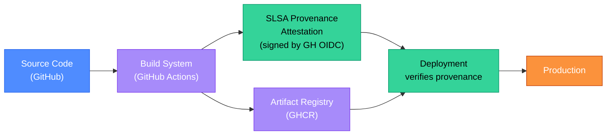

# Software Supply Chain Security: SLSA, Sigstore, and SBOM

The SolarWinds attack in 2020 demonstrated that the attack surface extends beyond your own code — it includes every tool that builds, signs, and distributes your software. Attackers who compromise your build system can ship malicious artifacts with your organization's signature. Supply chain security is the practice of ensuring that the artifact that runs in production is the artifact your developers wrote and nothing else.

<div class="quiz-progress" data-quiz-progress>
  <span class="quiz-progress-label">0/0 checks</span>
  <span class="quiz-progress-bar"><span class="quiz-progress-fill"></span></span>
</div>

---

## 1. Supply Chain Attack Anatomy

The SolarWinds attack followed a pattern that has since been repeated in dozens of incidents:

1. **Compromise the build system** — attackers inserted malicious code into the SolarWinds Orion build process, not the source code repository. The source code looked clean.
2. **Produce a signed artifact** — the build system signed the malicious binary with SolarWinds' legitimate code-signing certificate. Security scanners saw a valid signature.
3. **Distribute through trusted channels** — customers downloaded and installed the malicious update through the official SolarWinds update mechanism, which their security policies explicitly trusted.
4. **Victims run it** — 18,000 organizations installed the backdoored software. The malware was dormant for weeks to evade detection.

The key insight: **a valid signature proves that the artifact was signed by a specific key — it does not prove what was in the build environment when the artifact was built.** Traditional code signing is necessary but not sufficient.

Other patterns:
- **Dependency confusion** (2021): attacker publishes `company-internal-package` to npm with a higher version than the internal package — npm resolves to the attacker's version.
- **Typosquatting**: `reqeusts` vs `requests` on PyPI — users install the malicious package by typo.
- **Compromised maintainer account**: NPM package with millions of weekly downloads; maintainer's npm credentials stolen; attacker publishes malicious version.

---

## 2. SLSA Framework

SLSA (Supply-chain Levels for Software Artifacts, pronounced "salsa") is a security framework from Google that defines what evidence must exist about how an artifact was produced. It has four levels:

| Level | Requirements | What it prevents |
|-------|-------------|-----------------|
| 0 | No requirements | Nothing — baseline |
| 1 | Build provenance exists (who built it, when, from what source) | Accidental modification; establishes audit trail |
| 2 | Build provenance is signed by the build service; build is hosted (not local) | Tampering with provenance after the fact; local builds |
| 3 | Hardened build platform; source is reviewed (two-party); builds are hermetic | Compromised build platform; unreviewed code changes |

**Achieving SLSA Level 2 with GitHub Actions** (the most common starting point):

```yaml
# .github/workflows/build.yml
name: Build and attest
on: [push]

permissions:
  id-token: write   # required for OIDC token (keyless signing)
  contents: read
  attestations: write

jobs:
  build:
    runs-on: ubuntu-latest
    steps:
      - uses: actions/checkout@v4

      - name: Build image
        run: docker build -t myapp:${{ github.sha }} .

      - name: Login to GHCR
        uses: docker/login-action@v3
        with:
          registry: ghcr.io
          username: ${{ github.actor }}
          password: ${{ secrets.GITHUB_TOKEN }}

      - name: Push image
        run: docker push ghcr.io/myorg/myapp:${{ github.sha }}

      # GitHub's native SLSA provenance attestation — SLSA Level 2
      - uses: actions/attest-build-provenance@v1
        with:
          subject-name: ghcr.io/myorg/myapp
          subject-digest: sha256:${{ steps.push.outputs.digest }}
```

GitHub Actions is SLSA Level 2 certified: the runner is hosted (not local), the workflow file is in the repo (source-tracked), and the provenance attestation is signed by GitHub's OIDC-based signing infrastructure.



<div class="quiz-card">
  <p class="quiz-q">Your team achieves SLSA Level 2. A security auditor points out that a compromised GitHub Actions runner could still inject malicious code into the build without the provenance attestation detecting it. Is the auditor correct, and what level would prevent this?</p>
  <button class="quiz-reveal">Reveal answer</button>
  <div class="quiz-a" hidden>The auditor is correct. SLSA Level 2 proves that the build happened on GitHub Actions (a hosted, audited platform), but does not prevent a compromised runner from executing arbitrary code during the build. The provenance attestation records what the build *claimed* to do, not what it *actually* did at the syscall level. **SLSA Level 3** addresses this through hermetic builds: the build runs in an isolated, reproducible environment where all inputs are declared and network access is restricted. A hermetic build means that if you run the same inputs through the same build process twice, you get bit-for-bit identical output — a compromised runner that injects extra code would produce different output and break reproducibility. Achieving SLSA Level 3 currently requires specialized infrastructure (Google's SLSA for Google Cloud Build, or custom hermetic build systems) — GitHub Actions alone is not Level 3 certified as of 2026.</div>
</div>

---

## 3. Sigstore and cosign Image Signing

Cosign (part of the Sigstore project, CNCF) signs OCI container images and stores the signature in the same registry as the image itself. Unlike traditional PKI-based signing (which requires managing private keys and certificates), cosign supports **keyless signing** using OIDC tokens from GitHub Actions, Google Workload Identity, or AWS IRSA.

**Keyless signing in CI (GitHub Actions):**

```bash
# No key to manage — uses the GitHub Actions OIDC token
cosign sign --yes ghcr.io/myorg/myapp@sha256:abc123...
```

Cosign contacts Sigstore's Fulcio (certificate authority) with the OIDC token. Fulcio issues a short-lived (10-minute) certificate binding the signing identity (e.g., `https://github.com/myorg/myapp/.github/workflows/build.yml@refs/heads/main`) to a public key. The signature and certificate are stored in Sigstore's Rekor transparency log (an append-only audit log).

**Verifying a signature at deploy time:**

```bash
# Verify that the image was signed by the expected GitHub Actions workflow
cosign verify \
  --certificate-identity "https://github.com/myorg/myapp/.github/workflows/build.yml@refs/heads/main" \
  --certificate-oidc-issuer "https://token.actions.githubusercontent.com" \
  ghcr.io/myorg/myapp:latest
```

**Enforcing cosign verification in Kubernetes** via Policy Controller (Sigstore):

```yaml
apiVersion: policy.sigstore.dev/v1beta1
kind: ClusterImagePolicy
metadata:
  name: require-signed-images
spec:
  images:
    - glob: "ghcr.io/myorg/**"
  authorities:
    - keyless:
        url: https://fulcio.sigstore.dev
        identities:
          - issuer: https://token.actions.githubusercontent.com
            subjectRegExp: "https://github.com/myorg/.*"
```

With this policy, any pod referencing an unsigned `ghcr.io/myorg/*` image will be rejected by the admission webhook.

<div class="quiz-card">
  <p class="quiz-q">A developer manually builds and pushes a hotfix image directly from their laptop (`docker push ghcr.io/myorg/myapp:hotfix`) bypassing CI. The cluster has a Sigstore ClusterImagePolicy requiring signatures from GitHub Actions. What happens when they try to deploy this image, and what is the correct process for legitimate hotfixes?</p>
  <button class="quiz-reveal">Reveal answer</button>
  <div class="quiz-a" hidden>The deployment is rejected. The admission webhook calls Sigstore Policy Controller, which checks whether the image has a valid cosign signature with a certificate issued by Fulcio for a GitHub Actions OIDC identity matching `https://github.com/myorg/.*`. The manually pushed image has no cosign signature at all, so Policy Controller denies the pod. This is the correct behavior — it enforces that every artifact in production went through the CI pipeline. The correct process for a hotfix: push to a hotfix branch → CI runs (even if abbreviated — tests + build + sign) → the signed image is available in the registry → deploy. If CI is unavailable, the emergency process is to temporarily relax the policy (document the exception, restore it within hours) — never to bypass signing permanently. The value of the policy is precisely that it prevents unauthorized images from running, including during "emergencies" that are actually attack vectors.</div>
</div>

---

## 4. SBOM: What's Inside Your Artifact

An SBOM (Software Bill of Materials) is a machine-readable inventory of every component in a software artifact — libraries, transitive dependencies, their versions, and their licenses. It is the "ingredients list" for software.

**Generating an SBOM with Syft:**

```bash
# Generate CycloneDX SBOM for a container image
syft myapp:latest -o cyclonedx-json > sbom.json

# Generate SPDX SBOM
syft myapp:latest -o spdx-json > sbom.spdx.json

# Attach SBOM to the image in the registry (as an OCI artifact)
cosign attach sbom --sbom sbom.json ghcr.io/myorg/myapp@sha256:abc123
```

**When to generate the SBOM:** in CI, immediately after the image is built, before the image scan. The SBOM enables faster scans (Grype can scan the SBOM directly without pulling the image) and serves as the audit record if a new CVE is discovered later.

<div class="tab-group">
  <div class="tab-buttons">
    <button class="tab-btn active" data-tab="cyclonedx">CycloneDX</button>
    <button class="tab-btn" data-tab="spdx">SPDX</button>
  </div>
  <div class="tab-panel active" data-tab-panel="cyclonedx">

**CycloneDX** — OWASP standard, focused on security use cases.

- Native support for vulnerabilities (VEX — Vulnerability Exploitability eXchange)
- Can include services and hardware components, not just software packages
- JSON and XML formats; JSON is preferred
- Consumed by Grype, Dependency-Track, many security scanners
- Better for: security teams, vulnerability management workflows

```json
{
  "bomFormat": "CycloneDX",
  "specVersion": "1.5",
  "components": [{
    "type": "library",
    "name": "requests",
    "version": "2.31.0",
    "purl": "pkg:pypi/requests@2.31.0",
    "licenses": [{"license": {"id": "Apache-2.0"}}]
  }]
}
```

  </div>
  <div class="tab-panel" data-tab-panel="spdx">

**SPDX** — Linux Foundation standard, focused on license compliance.

- ISO/IEC 5962:2021 international standard (government procurement requirement in some jurisdictions)
- Rich license expression syntax (SPDX-License-Identifier)
- Tag-value, JSON, RDF formats
- Required by US Executive Order 14028 for software sold to US federal agencies
- Better for: legal/compliance teams, government contracts, license auditing

```json
{
  "spdxVersion": "SPDX-2.3",
  "packages": [{
    "name": "requests",
    "versionInfo": "2.31.0",
    "downloadLocation": "https://pypi.org/project/requests/",
    "licenseConcluded": "Apache-2.0",
    "externalRefs": [{"referenceType": "purl", "referenceLocator": "pkg:pypi/requests@2.31.0"}]
  }]
}
```

  </div>
</div>

---

## 5. Dependency Scanning

Dependency scanning focuses on the specific package versions declared in `package.json`, `requirements.txt`, `go.mod`, etc. — before the image is built.

**Dependabot** (GitHub-native): automatically opens PRs when a dependency has a known CVE or a new version is available.

```yaml
# .github/dependabot.yml
version: 2
updates:
  - package-ecosystem: npm
    directory: "/"
    schedule:
      interval: daily
    open-pull-requests-limit: 10
    # Auto-merge patch-level security updates
    labels: ["dependencies", "security"]
```

**Renovate** (more configurable than Dependabot): supports monorepos, custom registries, grouped PRs.

**CLI scanning in CI:**

```bash
# npm
npm audit --audit-level=high

# Python
pip-audit --requirement requirements.txt --fail-on-severity high

# Go
govulncheck ./...
```

**Auto-merge policy:** Safe to auto-merge patch updates with no breaking changes + green tests. Do not auto-merge major version bumps or anything touching authentication/cryptography libraries — those require human review regardless of test results.
