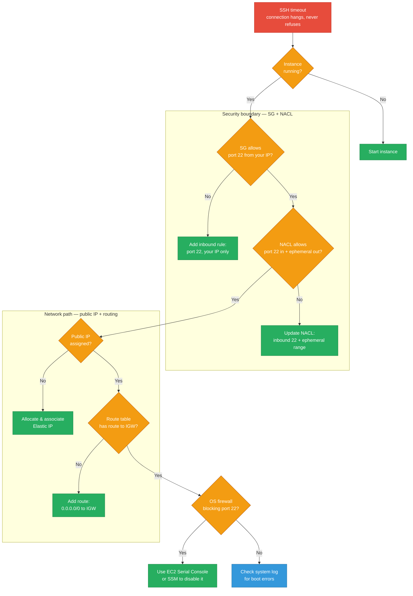
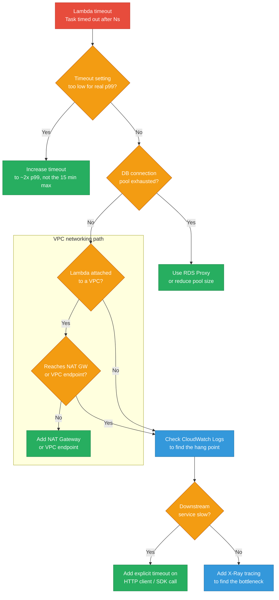
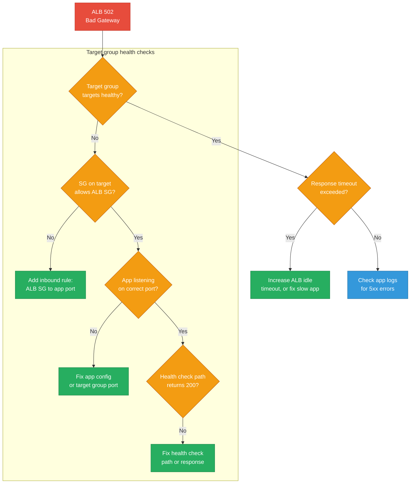
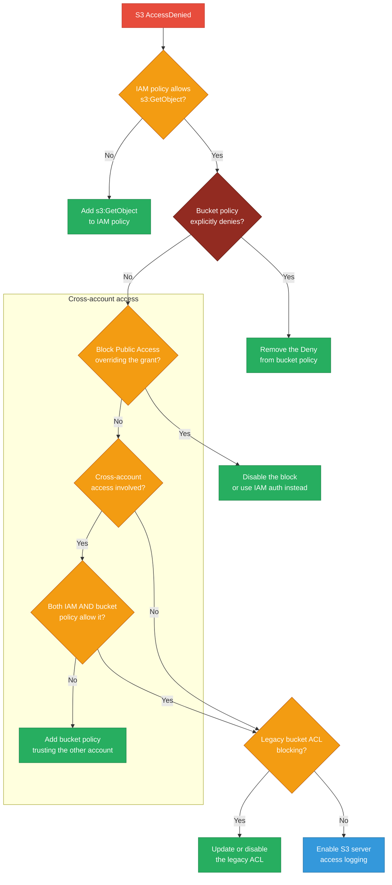
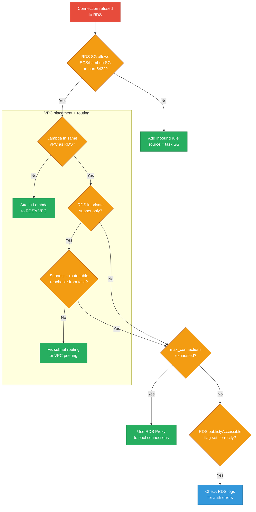
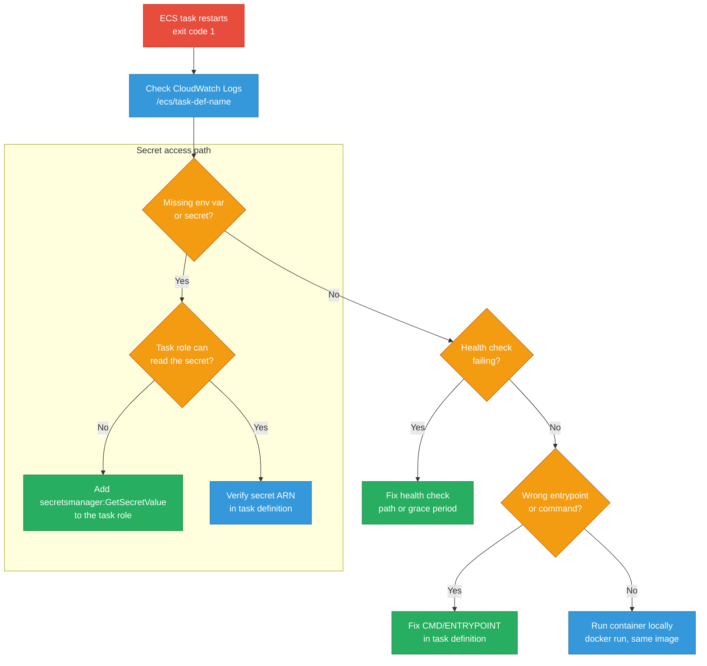
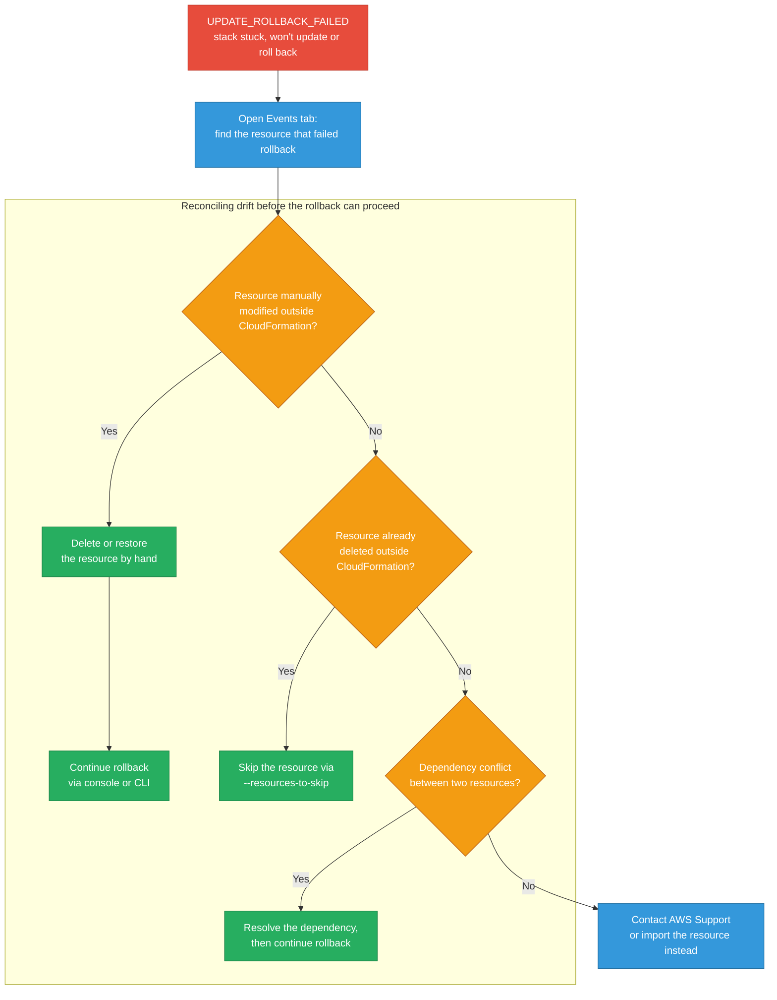
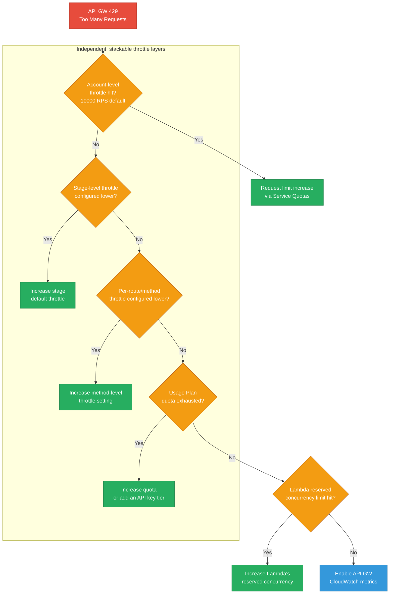
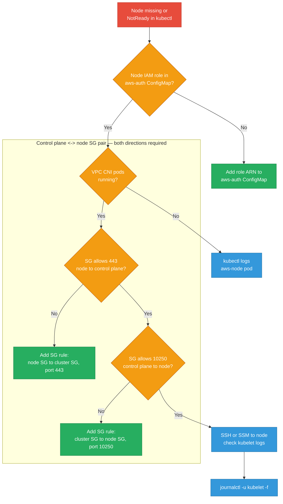
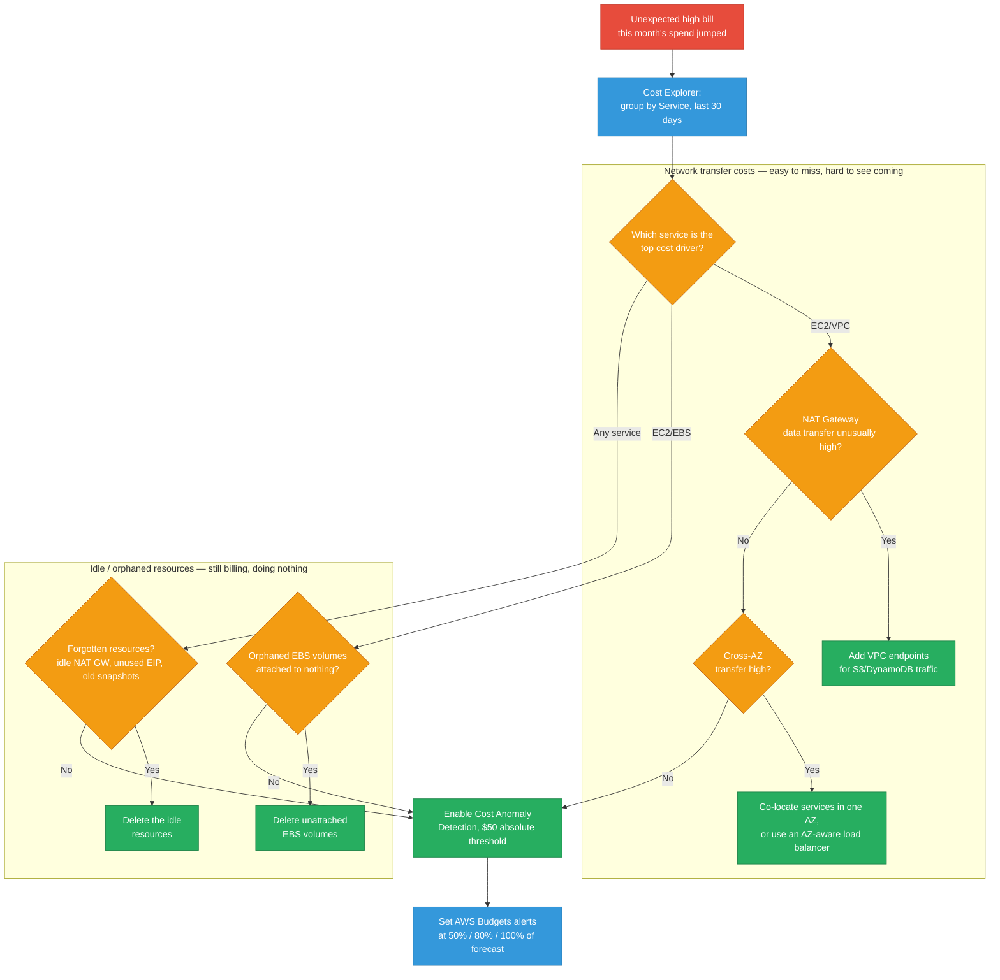

# AWS Debugging & Operational Scenarios

Ten failure patterns you'll actually hit running production workloads on AWS — the symptom, a diagnostic flowchart, the commands that confirm the cause, and the prevention that stops it recurring.

<div class="quiz-progress" data-quiz-progress>
  <span class="quiz-progress-label">0/0 checks</span>
  <span class="quiz-progress-bar"><span class="quiz-progress-fill"></span></span>
</div>

---

## 1. EC2 Instance Unreachable (SSH Timeout)



<div class="stepper">
  <div class="stepper-panels">
    <div class="stepper-panel active">
      <strong>1. Is the instance even running?</strong> A stopped or terminated instance is the most common cause of a plain timeout (as opposed to "connection refused," which usually means the instance is up but something on it is rejecting the socket). Check state before touching any network config.
    </div>
    <div class="stepper-panel">
      <strong>2. Security group, then NACL.</strong> Check the SG first — it's stateful and almost always the actual blocker. Only move to the NACL if the SG already allows it: NACLs are stateless, so the return path (ephemeral ports) needs its own explicit outbound rule, not just the inbound 22.
    </div>
    <div class="stepper-panel">
      <strong>3. Public IP and route table.</strong> No Elastic IP/public IP means there's nothing to SSH to from outside the VPC. Even with a public IP, the subnet's route table needs an explicit <code>0.0.0.0/0 → IGW</code> route or traffic never leaves the VPC.
    </div>
    <div class="stepper-panel">
      <strong>4. OS-level firewall and boot log.</strong> If every AWS-side control looks correct, the OS's own firewall (iptables/firewalld) or a boot-time failure is next — reachable via EC2 Serial Console or SSM, neither of which needs port 22 to work.
    </div>
  </div>
  <div class="stepper-controls">
    <button class="stepper-prev">← Prev</button>
    <span class="stepper-dots"></span>
    <span class="stepper-label"></span>
    <button class="stepper-next">Next →</button>
  </div>
</div>

**Commands**

```bash
# Check instance state
aws ec2 describe-instances --instance-ids i-xxxx \
  --query 'Reservations[].Instances[].[InstanceId,State.Name,PublicIpAddress]'

# Check security group rules
aws ec2 describe-security-groups --group-ids sg-xxxx \
  --query 'SecurityGroups[].IpPermissions'

# Check NACLs for the subnet
SUBNET=$(aws ec2 describe-instances --instance-ids i-xxxx \
  --query 'Reservations[].Instances[].SubnetId' --output text)
aws ec2 describe-network-acls \
  --filters "Name=association.subnet-id,Values=$SUBNET"

# Check route table
aws ec2 describe-route-tables \
  --filters "Name=association.subnet-id,Values=$SUBNET"

# Get system log (boot errors)
aws ec2 get-console-output --instance-id i-xxxx --latest

# Connect via SSM (no SSH needed)
aws ssm start-session --target i-xxxx
```

**Prevention:** Never rely on SSH for production access — use SSM Session Manager instead (no port 22, no key management, full audit trail in CloudTrail). Enforce this with an SCP: `Deny ec2:AuthorizeSecurityGroupIngress where port=22 from 0.0.0.0/0`. Keep an EC2 Systems Manager baseline policy on every instance role.

<div class="quiz-card">
  <p class="quiz-q">Why does the prevention advice enforce SSM over SSH with an SCP that denies opening port 22, instead of just relying on tight security group rules and hoping engineers use SSM voluntarily?</p>
  <button class="quiz-reveal">Reveal answer</button>
  <div class="quiz-a" hidden>A tight SG rule is a per-resource setting someone can loosen later without anyone noticing. An SCP denying <code>ec2:AuthorizeSecurityGroupIngress</code> for port 22 from 0.0.0.0/0 blocks the action at the organization level — no account under it can ever (re)open port 22 broadly, intentionally or by mistake. That's on top of SSM's own advantages already called out: no port 22 at all, no key management, and a full audit trail in CloudTrail that plain SSH access never gives you.</div>
</div>

---

## 2. Lambda Function Timing Out



**Commands**

```bash
# Check current timeout
aws lambda get-function-configuration --function-name my-fn \
  --query '[Timeout,MemorySize,VpcConfig]'

# Update timeout
aws lambda update-function-configuration \
  --function-name my-fn --timeout 30

# Tail live logs
aws logs tail /aws/lambda/my-fn --follow

# Last 20 min of logs
aws logs filter-log-events \
  --log-group-name /aws/lambda/my-fn \
  --start-time $(date -v-20M +%s000) \
  --filter-pattern "Task timed out"

# Check Lambda concurrency
aws lambda get-function-concurrency --function-name my-fn

# Enable X-Ray tracing
aws lambda update-function-configuration \
  --function-name my-fn \
  --tracing-config Mode=Active
```

**Prevention:** Set `timeout` to 2× your p99 execution time, never the max (15 min). Add a CloudWatch alarm on `Errors + Throttles` for every Lambda. Enable X-Ray tracing from day one — retrofitting tracing after a production timeout incident is painful. Use provisioned concurrency for latency-sensitive functions to eliminate cold start timeouts.

<div class="toggle-switch">
  <div class="toggle-buttons">
    <button data-toggle-opt="timeout" class="active state-warn">Timeout set too low</button>
    <button data-toggle-opt="pool" class="state-warn">DB connection pool exhausted</button>
    <button data-toggle-opt="vpc" class="state-bad">VPC without NAT/endpoint</button>
    <button data-toggle-opt="downstream" class="state-warn">Downstream service slow</button>
  </div>
  <div class="toggle-panel active" data-toggle-panel="timeout">
    The function's configured timeout is shorter than its real p99 execution time. Fix: raise the timeout to roughly 2x p99 — never just jump straight to the 15-minute max, since that only delays failure detection instead of fixing it.
  </div>
  <div class="toggle-panel" data-toggle-panel="pool">
    Every concurrent invocation opens its own DB connection, and concurrency can scale far faster than the database's <code>max_connections</code> ceiling. New connection attempts queue or fail, which shows up as a Lambda timeout even though the Lambda code itself is fine. Fix: RDS Proxy to pool connections, or reduce per-function pool size.
  </div>
  <div class="toggle-panel" data-toggle-panel="vpc">
    A VPC-attached Lambda with no route to a NAT Gateway or VPC endpoint can reach resources inside the VPC but hangs forever trying to reach anything outside it (another AWS API, a third-party endpoint) — no error, just silence until the timeout fires.
  </div>
  <div class="toggle-panel" data-toggle-panel="downstream">
    The Lambda's own code and networking are fine — it's waiting on a slow downstream HTTP call or SDK request that has no timeout of its own, so it blocks until the Lambda's overall timeout kills the whole invocation. Fix: add an explicit timeout on the HTTP client/SDK so a slow dependency fails fast and visibly instead of eating the whole budget.
  </div>
</div>

<div class="quiz-card">
  <p class="quiz-q">Why is setting a Lambda's timeout to the 15-minute max a bad "quick fix" for timeout errors, even though it technically makes the errors stop?</p>
  <button class="quiz-reveal">Reveal answer</button>
  <div class="quiz-a" hidden>The prevention rule is specific: set timeout to 2x your p99 execution time, never the max. Jumping straight to 15 minutes doesn't fix whatever is actually slow — it just hides the symptom while the function ties up its concurrency slot far longer, delays failure detection, and stops giving you a meaningful signal (a function that "times out" at 15 minutes tells you almost nothing about whether it's actually healthy at 2x its normal p99).</div>
</div>

---

## 3. ALB Returns 502 Bad Gateway



**Commands**

```bash
# List target group health
aws elbv2 describe-target-health \
  --target-group-arn arn:aws:elasticloadbalancing:...

# Describe load balancer attributes (idle timeout)
aws elbv2 describe-load-balancer-attributes \
  --load-balancer-arn arn:aws:elasticloadbalancing:...

# Modify idle timeout
aws elbv2 modify-load-balancer-attributes \
  --load-balancer-arn arn:aws:elasticloadbalancing:... \
  --attributes Key=idle_timeout.timeout_seconds,Value=120

# Check ALB access logs (if enabled)
aws s3 cp s3://my-alb-logs/AWSLogs/... ./alb-logs/ --recursive

# Check security group of target
aws ec2 describe-security-groups --group-ids sg-target-xxxx \
  --query 'SecurityGroups[].IpPermissions'

# Describe target group health check settings
aws elbv2 describe-target-groups \
  --target-group-arns arn:aws:elasticloadbalancing:... \
  --query 'TargetGroups[].[HealthCheckPath,HealthCheckPort,Matcher]'
```

**Prevention:** Set `deregistration_delay` to 30s (down from 300s default) so deployments drain fast. Set `slow_start.duration_seconds` = 30 so new targets warm up before receiving full traffic. Alert on ALB `HTTPCode_Target_5XX_Count > 0` in CloudWatch. Test health check endpoint independently in staging with the exact ALB matcher config.

<div class="toggle-switch">
  <div class="toggle-buttons">
    <button data-toggle-opt="sg" class="active state-bad">SG blocks ALB → target</button>
    <button data-toggle-opt="port" class="state-bad">App on wrong port</button>
    <button data-toggle-opt="hc" class="state-warn">Health check misconfigured</button>
    <button data-toggle-opt="timeout" class="state-warn">Idle timeout exceeded</button>
  </div>
  <div class="toggle-panel active" data-toggle-panel="sg">
    The target's own security group doesn't allow inbound traffic from the ALB's security group on the app port. The ALB can't even reach the target to check its health, let alone route real traffic — it marks the target unhealthy and returns 502 for requests that land on it.
  </div>
  <div class="toggle-panel" data-toggle-panel="port">
    The application is listening on a different port than what the target group is configured to send traffic to (a common mismatch after a container port change). The SG can be perfectly correct and the app perfectly healthy — the ALB is just knocking on the wrong door.
  </div>
  <div class="toggle-panel" data-toggle-panel="hc">
    The SG and port are correct, but the health check path itself doesn't return the expected 200 (wrong path, or the app returns a non-2xx on that specific route). The ALB marks the target unhealthy based purely on that one endpoint's response, even if the rest of the app works fine.
  </div>
  <div class="toggle-panel" data-toggle-panel="timeout">
    Targets are healthy and reachable, but a slow backend response exceeds the ALB's idle timeout before the app finishes responding. The ALB gives up and returns 502 even though the app would have eventually answered — fixed by raising the idle timeout or by making the app itself faster.
  </div>
</div>

<div class="quiz-card">
  <p class="quiz-q">Why does the prevention advice set two separate timing knobs — deregistration_delay down to 30s and slow_start up to 30s — instead of tuning just one of them?</p>
  <button class="quiz-reveal">Reveal answer</button>
  <div class="quiz-a" hidden>They control opposite ends of a deployment. deregistration_delay governs how long the ALB keeps sending traffic to a target that's being removed (shortening it from the 300s default means old targets drain and deployments finish fast). slow_start.duration_seconds governs how gradually a brand-new target ramps up to full traffic after joining (giving it time to warm up — JIT caches, connection pools — before being hit at full load). One is about targets leaving, the other about targets arriving; tuning only one leaves the other side of every deploy exposed to 502s.</div>
</div>

---

## 4. S3 Access Denied



**Commands**

```bash
# Simulate IAM policy evaluation
aws iam simulate-principal-policy \
  --policy-source-arn arn:aws:iam::123456789:role/my-role \
  --action-names s3:GetObject \
  --resource-arns arn:aws:s3:::my-bucket/my-key

# Get bucket policy
aws s3api get-bucket-policy --bucket my-bucket

# Check Block Public Access settings
aws s3api get-public-access-block --bucket my-bucket

# Check bucket ACL
aws s3api get-bucket-acl --bucket my-bucket

# Check object ACL
aws s3api get-object-acl --bucket my-bucket --key my-key

# List bucket ownership controls
aws s3api get-bucket-ownership-controls --bucket my-bucket
```

**Prevention:** Use IAM Access Analyzer to continuously audit S3 bucket policies and flag public or cross-account access. Enable S3 Block Public Access at the account level. Test IAM policies with `aws iam simulate-principal-policy` in CI before deploying policy changes.

<div class="quiz-card">
  <p class="quiz-q">The diagnosis flow checks "does the IAM policy allow s3:GetObject?" before it ever checks the bucket policy for an explicit Deny. If the IAM answer is Yes, is the request guaranteed to succeed?</p>
  <button class="quiz-reveal">Reveal answer</button>
  <div class="quiz-a" hidden>No — that's exactly why the flow's very next check is a separate branch for the bucket policy explicitly denying access. An IAM policy that allows an action is necessary but not sufficient; a bucket policy (or Block Public Access, checked right after) can still block the same request. Confirming the IAM side is clean only rules out one of several independent places the request can still get denied.</div>
</div>

---

## 5. RDS Connection Refused from ECS/Lambda



<div class="stepper">
  <div class="stepper-panels">
    <div class="stepper-panel active">
      <strong>1. Security group first.</strong> The RDS instance's own SG has to explicitly allow inbound traffic from the ECS task's or Lambda's SG on the DB port — RDS defaults to allowing nothing.
    </div>
    <div class="stepper-panel">
      <strong>2. VPC placement and routing.</strong> A Lambda not attached to RDS's VPC can't reach it at all. Even when it is, an RDS instance living in a private-subnet-only setup still needs the calling task's subnet to have a working route (or peering) to reach it — VPC membership alone isn't routing.
    </div>
    <div class="stepper-panel">
      <strong>3. Connection pool exhaustion.</strong> If networking checks out but connections are still refused under load, <code>max_connections</code> may already be saturated by other callers — every new connection attempt gets refused, not queued.
    </div>
    <div class="stepper-panel">
      <strong>4. Public accessibility and auth.</strong> Confirm <code>PubliclyAccessible</code> is set the way the architecture expects, then fall back to RDS logs — a connection that gets this far but still fails is usually an authentication error, not a networking one.
    </div>
  </div>
  <div class="stepper-controls">
    <button class="stepper-prev">← Prev</button>
    <span class="stepper-dots"></span>
    <span class="stepper-label"></span>
    <button class="stepper-next">Next →</button>
  </div>
</div>

**Commands**

```bash
# Describe RDS instance network config
aws rds describe-db-instances --db-instance-identifier my-db \
  --query 'DBInstances[].[DBInstanceStatus,PubliclyAccessible,VpcSecurityGroups,Endpoint]'

# Check SG rules on RDS
aws ec2 describe-security-groups --group-ids sg-rds-xxxx

# Check RDS parameter max_connections
aws rds describe-db-parameters \
  --db-parameter-group-name my-pg \
  --query 'Parameters[?ParameterName==`max_connections`]'

# Check RDS enhanced monitoring / CloudWatch
aws cloudwatch get-metric-statistics \
  --namespace AWS/RDS \
  --metric-name DatabaseConnections \
  --dimensions Name=DBInstanceIdentifier,Value=my-db \
  --start-time $(date -u -v-1H +%Y-%m-%dT%H:%M:%SZ) \
  --end-time $(date -u +%Y-%m-%dT%H:%M:%SZ) \
  --period 60 --statistics Maximum

# Create RDS Proxy
aws rds create-db-proxy \
  --db-proxy-name my-proxy \
  --engine-family POSTGRESQL \
  --auth '[{"AuthScheme":"SECRETS","SecretArn":"arn:...","IAMAuth":"DISABLED"}]' \
  --role-arn arn:aws:iam::...role/rds-proxy-role \
  --vpc-subnet-ids subnet-a subnet-b \
  --vpc-security-group-ids sg-rds-xxxx
```

**Prevention:** Use RDS Proxy to pool connections — eliminates connection exhaustion as services scale. Set `max_connections` parameter group value explicitly. Alert on `DatabaseConnections` CloudWatch metric > 80% of `max_connections`. Use IAM auth for RDS so credentials never expire or get leaked.

<div class="quiz-card">
  <p class="quiz-q">Why does scaling up Lambda concurrency or ECS task count make a max_connections exhaustion problem worse, rather than just spreading the same load more thinly?</p>
  <button class="quiz-reveal">Reveal answer</button>
  <div class="quiz-a" hidden>Without a pooler, each concurrent invocation or task opens its own connection to the database — so connection count scales roughly 1:1 with application concurrency, not with actual query volume. Scaling the app layer directly scales the number of open connections, which can blow past a fixed max_connections ceiling even if the database's real workload hasn't grown. That's exactly why the prevention advice is RDS Proxy specifically — it pools and multiplexes connections so scaling the application doesn't scale raw DB connections in lockstep.</div>
</div>

---

## 6. ECS Task Keeps Restarting (Exit Code 1)



**Commands**

```bash
# List stopped tasks with reason
aws ecs list-tasks --cluster my-cluster --desired-status STOPPED
aws ecs describe-tasks --cluster my-cluster \
  --tasks task-id-xxxx \
  --query 'tasks[].[taskArn,stoppedReason,containers[].{name:name,exitCode:exitCode,reason:reason}]'

# Get CloudWatch log group for task
aws ecs describe-task-definition --task-definition my-task:5 \
  --query 'taskDefinition.containerDefinitions[].logConfiguration'

# Tail ECS logs
aws logs tail /ecs/my-task --follow

# Check task IAM role policies
aws iam list-role-policies --role-name ecsTaskRole
aws iam get-role-policy --role-name ecsTaskRole --policy-name MyPolicy

# Verify secret exists
aws secretsmanager describe-secret --secret-id my-secret

# Increase health check grace period
aws ecs update-service --cluster my-cluster --service my-svc \
  --health-check-grace-period-seconds 120
```

**Prevention:** Use ECS Exec (SSM-based) instead of SSH for debugging running containers. Set `healthCheckGracePeriodSeconds` equal to your app's p99 startup time. Alert on ECS `ServiceTaskCount < desired`. Use task role + Secrets Manager for credentials — never bake secrets into environment variables.

<div class="toggle-switch">
  <div class="toggle-buttons">
    <button data-toggle-opt="secret" class="active state-bad">Missing/unreadable secret</button>
    <button data-toggle-opt="hc" class="state-warn">Health check misconfigured</button>
    <button data-toggle-opt="entrypoint" class="state-warn">Wrong entrypoint/command</button>
  </div>
  <div class="toggle-panel active" data-toggle-panel="secret">
    The task definition references a secret the task role isn't allowed to read (missing <code>secretsmanager:GetSecretValue</code>), or the secret ARN itself is wrong. The container never even gets the credential it needs to start, so it exits immediately — this can look identical to "my app is broken" even though the image itself is fine.
  </div>
  <div class="toggle-panel" data-toggle-panel="hc">
    The container starts and runs, but ECS's health check fails before the app has finished its own startup work, so ECS kills and restarts it in a loop that never lets it stabilize. Fix: set <code>healthCheckGracePeriodSeconds</code> to actually cover the app's real startup time.
  </div>
  <div class="toggle-panel" data-toggle-panel="entrypoint">
    The task definition's CMD/ENTRYPOINT doesn't match what the image actually expects — a stale override from a previous version of the image, for example. The container exits on its own the instant it starts, independent of secrets or health checks entirely.
  </div>
</div>

<div class="quiz-card">
  <p class="quiz-q">A container that runs fine with `docker run` locally fails immediately with exit code 1 in ECS, with an AccessDenied-style error in the logs. The image hasn't changed. What's the most likely explanation?</p>
  <button class="quiz-reveal">Reveal answer</button>
  <div class="quiz-a" hidden>The task role most likely lacks permission to read a secret the task definition references — commonly a missing <code>secretsmanager:GetSecretValue</code> grant. Locally, the same credential is often just passed in directly; in ECS, the task pulls it from Secrets Manager at launch using the task role's IAM permissions, and if that grant is missing the container never gets the secret and exits before the app can even start. This is exactly why the prevention rule insists on task role + Secrets Manager rather than baking secrets into environment variables — it moves the failure to a well-known, auditable IAM permission instead of a silent runtime difference between "local" and "ECS."</div>
</div>

---

## 7. CloudFormation Stack Stuck in UPDATE_ROLLBACK_FAILED



**Commands**

```bash
# See stack events to find failed resource
aws cloudformation describe-stack-events \
  --stack-name my-stack \
  --query 'StackEvents[?ResourceStatus==`UPDATE_ROLLBACK_FAILED`]'

# Continue rollback (no skips)
aws cloudformation continue-update-rollback \
  --stack-name my-stack

# Continue rollback skipping a specific resource
aws cloudformation continue-update-rollback \
  --stack-name my-stack \
  --resources-to-skip MyBucketLogicalId

# Describe current stack status
aws cloudformation describe-stacks \
  --stack-name my-stack \
  --query 'Stacks[].[StackStatus,StackStatusReason]'

# Import existing resource into stack (alternative)
aws cloudformation create-change-set \
  --stack-name my-stack \
  --change-set-name import-fix \
  --change-set-type IMPORT \
  --resources-to-import '[{"ResourceType":"AWS::S3::Bucket","LogicalResourceId":"MyBucket","ResourceIdentifier":{"BucketName":"my-bucket"}}]' \
  --template-body file://template.yaml
```

**Prevention:** Always use Change Sets before any update to a production stack — never run `aws cloudformation update-stack` directly. Enable stack termination protection on all production stacks. Use `DeletionPolicy: Retain` on stateful resources (RDS, S3) so accidental stack deletion doesn't destroy data.

<div class="toggle-switch">
  <div class="toggle-buttons">
    <button data-toggle-opt="manual" class="active state-bad">Resource modified outside CF</button>
    <button data-toggle-opt="deleted" class="state-warn">Resource already deleted</button>
    <button data-toggle-opt="dep" class="state-warn">Dependency conflict</button>
  </div>
  <div class="toggle-panel active" data-toggle-panel="manual">
    Someone changed or deleted a resource directly in the console or CLI, outside CloudFormation's view. CloudFormation's rollback still thinks the resource is in its last-known state and fails trying to reconcile against reality. Fix: manually restore or delete the resource to match what CloudFormation expects, then continue the rollback.
  </div>
  <div class="toggle-panel" data-toggle-panel="deleted">
    The resource CloudFormation is trying to roll back genuinely no longer exists (deleted some other way). There's nothing to reconcile — tell CloudFormation to skip it explicitly with <code>--resources-to-skip</code> rather than fighting to recreate something that's intentionally gone.
  </div>
  <div class="toggle-panel" data-toggle-panel="dep">
    Two resources in the stack have a dependency relationship that the rollback can't satisfy in its current order (e.g. one needs to change before the other can revert cleanly). Resolve the actual dependency conflict first, then continue the rollback — skipping the resource here often just moves the failure to the next one.
  </div>
</div>

<div class="quiz-card">
  <p class="quiz-q">Why does the prevention advice insist on Change Sets for every production update, when `update-stack` achieves the same end result if nothing goes wrong?</p>
  <button class="quiz-reveal">Reveal answer</button>
  <div class="quiz-a" hidden>The value of a Change Set is entirely in previewing what would happen before it happens — it shows exactly which resources would be modified, replaced, or deleted. `update-stack` applies changes directly with no such preview, so an unexpected replacement or deletion is only discovered after CloudFormation is already mid-update, which is precisely the kind of surprise that leads to a stack getting stuck in UPDATE_ROLLBACK_FAILED in the first place.</div>
</div>

---

## 8. API Gateway Returns 429 Too Many Requests



**Commands**

```bash
# Get stage throttle settings
aws apigateway get-stage \
  --rest-api-id abc123 \
  --stage-name prod \
  --query '[defaultRouteSettings,throttlingBurstLimit,throttlingRateLimit]'

# Update stage-level throttle
aws apigateway update-stage \
  --rest-api-id abc123 \
  --stage-name prod \
  --patch-operations \
    op=replace,path=/defaultRouteSettings/throttlingRateLimit,value=5000 \
    op=replace,path=/defaultRouteSettings/throttlingBurstLimit,value=10000

# List usage plans
aws apigateway get-usage-plans

# Check current account throttle limits
aws service-quotas list-service-quotas \
  --service-code apigateway \
  --query 'Quotas[?contains(QuotaName,`throttle`)]'

# Request quota increase
aws service-quotas request-service-quota-increase \
  --service-code apigateway \
  --quota-code L-310E2D3C \
  --desired-value 20000

# Check Lambda concurrency
aws lambda get-function-concurrency --function-name my-fn

# CloudWatch 429 metric
aws cloudwatch get-metric-statistics \
  --namespace AWS/ApiGateway \
  --metric-name 4XXError \
  --dimensions Name=ApiName,Value=my-api Name=Stage,Value=prod \
  --start-time $(date -u -v-1H +%Y-%m-%dT%H:%M:%SZ) \
  --end-time $(date -u +%Y-%m-%dT%H:%M:%SZ) \
  --period 60 --statistics Sum
```

**Prevention:** Set Usage Plans and API Keys for all external-facing APIs. Use Lambda reserved concurrency to prevent a burst from one API consuming all account concurrency. Add a WAF rate-based rule as an additional layer. Alert on `4XXError rate > 5%` in CloudWatch — catches throttling before it becomes an outage.

<div class="quiz-card">
  <p class="quiz-q">A team gets its account-level Service Quota increased after hitting 429s, but the errors continue at the same rate. Based on the diagnosis flow above, what did they most likely skip checking?</p>
  <button class="quiz-reveal">Reveal answer</button>
  <div class="quiz-a" hidden>The account-level throttle is only the first, highest layer in the chain — stage-level throttle, per-route/method throttle, and Usage Plan quota each sit independently below it, and any one of them can cap requests regardless of what the account ceiling allows. Lambda's own reserved concurrency limit is a separate cap again, on a completely different service. Raising one layer does nothing if a lower layer (or a different service's limit entirely) is the actual bottleneck — the flow has to be walked top to bottom, not just fixed at the first checkpoint.</div>
</div>

---

## 9. EKS Nodes Not Joining the Cluster



<div class="stepper">
  <div class="stepper-panels">
    <div class="stepper-panel active">
      <strong>1. IAM identity mapping.</strong> The node's IAM role has to be listed in the <code>aws-auth</code> ConfigMap under <code>mapRoles</code> — without it, the node can authenticate to AWS but Kubernetes itself has no idea it's allowed to register as <code>system:node</code>.
    </div>
    <div class="stepper-panel">
      <strong>2. VPC CNI health.</strong> The <code>aws-node</code> DaemonSet has to actually be running on the node before pod networking can come up at all. If it's crash-looping, nothing downstream — including the node ever going Ready — will work.
    </div>
    <div class="stepper-panel">
      <strong>3. Security group pair — both directions.</strong> This is a two-way requirement: the node's SG needs an egress/ingress path to the control plane on 443, <em>and</em> the control plane's SG needs a path back to the node on 10250. Getting only one direction right still fails — it's not "a" security group rule, it's two.
    </div>
    <div class="stepper-panel">
      <strong>4. Kubelet logs, last resort.</strong> If IAM, CNI, and both SG directions all check out, the remaining failures live on the node itself — SSH/SSM in and tail <code>journalctl -u kubelet -f</code> for the actual bootstrap error.
    </div>
  </div>
  <div class="stepper-controls">
    <button class="stepper-prev">← Prev</button>
    <span class="stepper-dots"></span>
    <span class="stepper-label"></span>
    <button class="stepper-next">Next →</button>
  </div>
</div>

**Commands**

```bash
# Check node status
kubectl get nodes -o wide

# View aws-auth ConfigMap
kubectl get configmap aws-auth -n kube-system -o yaml

# Add node IAM role to aws-auth (edit directly)
kubectl edit configmap aws-auth -n kube-system
# Add under mapRoles:
# - rolearn: arn:aws:iam::123456789:role/eks-node-role
#   username: system:node:{{EC2PrivateDNSName}}
#   groups: [system:bootstrappers, system:nodes]

# Check VPC CNI pods
kubectl get pods -n kube-system -l k8s-app=aws-node
kubectl logs -n kube-system daemonset/aws-node

# Check node SG rules (cluster SG)
CLUSTER_SG=$(aws eks describe-cluster --name my-cluster \
  --query 'cluster.resourcesVpcConfig.clusterSecurityGroupId' --output text)
aws ec2 describe-security-groups --group-ids $CLUSTER_SG

# Check kubelet logs on node (via SSM)
aws ssm start-session --target i-nodexxxx
# Then: journalctl -u kubelet -f

# Describe node for events
kubectl describe node ip-10-0-x-x.ec2.internal
```

**Prevention:** Use managed node groups — AWS handles the bootstrap script and AMI versioning. Pin AMI IDs in Terraform and test node-join in a staging cluster before rolling to prod. Use Launch Template user data validation: add a `curl` to the EKS cluster endpoint as the last line of bootstrap — it fails fast if networking is wrong. Alert on `cluster_failed_node_count > 0`.

<div class="quiz-card">
  <p class="quiz-q">The prevention advice says to add a curl to the EKS cluster endpoint as the last line of the bootstrap user data. What specifically does that catch, and why is catching it there better than waiting to see the node show up as NotReady in kubectl?</p>
  <button class="quiz-reveal">Reveal answer</button>
  <div class="quiz-a" hidden>It catches basic network reachability problems — the same kind of SG or routing misconfiguration this scenario's flow spends most of its steps diagnosing — during the node's own bootstrap, before kubelet ever attempts to register. A bootstrap-time curl failure fails fast and visibly (in the instance's user-data/console output) right where the problem actually is, instead of the node quietly ending up NotReady or missing from kubectl entirely with no obvious signal pointing at networking as the cause.</div>
</div>

---

## 10. High AWS Bill — Finding the Source



**Commands**

```bash
# Cost Explorer: top services last 30 days
aws ce get-cost-and-usage \
  --time-period Start=$(date -v-30d +%Y-%m-%d),End=$(date +%Y-%m-%d) \
  --granularity MONTHLY \
  --metrics BlendedCost \
  --group-by Type=DIMENSION,Key=SERVICE \
  --query 'ResultsByTime[].Groups[] | sort_by(@, &Metrics.BlendedCost.Amount) | reverse(@) | [:10]'

# Find unattached EBS volumes
aws ec2 describe-volumes \
  --filters Name=status,Values=available \
  --query 'Volumes[].[VolumeId,Size,CreateTime]'

# Find unassociated Elastic IPs
aws ec2 describe-addresses \
  --query 'Addresses[?AssociationId==null].[AllocationId,PublicIp]'

# Find NAT Gateways (cost ~$0.045/hr each)
aws ec2 describe-nat-gateways \
  --filter Name=state,Values=available \
  --query 'NatGateways[].[NatGatewayId,SubnetId,CreateTime]'

# Check data transfer via NAT GW (CloudWatch)
aws cloudwatch get-metric-statistics \
  --namespace AWS/NATGateway \
  --metric-name BytesOutToDestination \
  --dimensions Name=NatGatewayId,Value=nat-xxxx \
  --start-time $(date -u -v-1d +%Y-%m-%dT%H:%M:%SZ) \
  --end-time $(date -u +%Y-%m-%dT%H:%M:%SZ) \
  --period 3600 --statistics Sum

# Create Cost Anomaly Detection monitor
aws ce create-anomaly-monitor \
  --anomaly-monitor '{"MonitorName":"AllServices","MonitorType":"DIMENSIONAL","MonitorDimension":"SERVICE"}'

# Create budget alert at $200/month
aws budgets create-budget \
  --account-id 123456789012 \
  --budget '{"BudgetName":"monthly-limit","BudgetLimit":{"Amount":"200","Unit":"USD"},"TimeUnit":"MONTHLY","BudgetType":"COST"}' \
  --notifications-with-subscribers '[{"Notification":{"NotificationType":"ACTUAL","ComparisonOperator":"GREATER_THAN","Threshold":80},"Subscribers":[{"SubscriptionType":"EMAIL","Address":"you@example.com"}]}]'
```

**Prevention:** Set AWS Budgets alerts at 50%, 80%, and 100% of monthly forecast from day one. Enable Cost Anomaly Detection with a `$50 absolute threshold` — it alerts within hours of a runaway resource. Tag every resource with `team`, `env`, `service` tags enforced by an AWS Config rule. Review Cost Explorer weekly during growth phases.

<div class="toggle-switch">
  <div class="toggle-buttons">
    <button data-toggle-opt="nat" class="active state-warn">NAT Gateway data transfer</button>
    <button data-toggle-opt="az" class="state-warn">Cross-AZ transfer</button>
    <button data-toggle-opt="ebs" class="state-bad">Orphaned EBS volumes</button>
    <button data-toggle-opt="idle" class="state-bad">Forgotten idle resources</button>
  </div>
  <div class="toggle-panel active" data-toggle-panel="nat">
    Traffic to S3 or DynamoDB is routed through a NAT Gateway instead of a VPC endpoint, so every byte gets billed at NAT's per-GB processing rate on top of the Gateway's hourly cost. Fix: add a VPC endpoint for S3/DynamoDB traffic — it's free for gateway endpoints and removes the NAT hop entirely for that traffic.
  </div>
  <div class="toggle-panel" data-toggle-panel="az">
    Chatty services that call each other across Availability Zones pay AWS's inter-AZ data transfer rate on every request-response pair, even though the traffic never leaves the region. Fix: co-locate the noisy services in the same AZ, or route through an AZ-aware load balancer that prefers same-AZ targets.
  </div>
  <div class="toggle-panel" data-toggle-panel="ebs">
    An EBS volume keeps billing for its provisioned size and IOPS whether or not any instance is attached to it — a terminated instance doesn't automatically take its volumes with it unless <code>DeleteOnTermination</code> was set. Fix: find volumes in <code>available</code> state (no attachment) and delete the ones nobody's using.
  </div>
  <div class="toggle-panel" data-toggle-panel="idle">
    NAT Gateways, unassociated Elastic IPs, and old EBS snapshots all keep billing quietly with no traffic and no alert to notice them — an EIP not attached to a running instance is billed specifically because it's sitting idle. Fix: sweep for and delete resources with no active association on a schedule, don't wait for someone to notice the line item.
  </div>
</div>

<div class="quiz-card">
  <p class="quiz-q">The prevention advice lists both AWS Budgets alerts (at 50/80/100% of monthly forecast) and Cost Anomaly Detection (at a $50 absolute threshold). Why isn't the Budgets alert alone enough to catch a runaway resource quickly?</p>
  <button class="quiz-reveal">Reveal answer</button>
  <div class="quiz-a" hidden>Budgets alerts are tied to a percentage of the monthly forecast, so on a large enough budget a sudden spike from one forgotten resource can stay under the next percentage threshold for weeks while it quietly compounds. Cost Anomaly Detection isn't scaled to the overall budget at all — with a flat $50 absolute threshold it flags an unusual spend as soon as it appears, typically within hours, regardless of how small a fraction of the total budget it represents. One catches sustained overall drift over the course of a month; the other catches a sudden anomaly early enough to kill it before it compounds into next month's bill.</div>
</div>

---

*Last updated: 2026-06-16*
