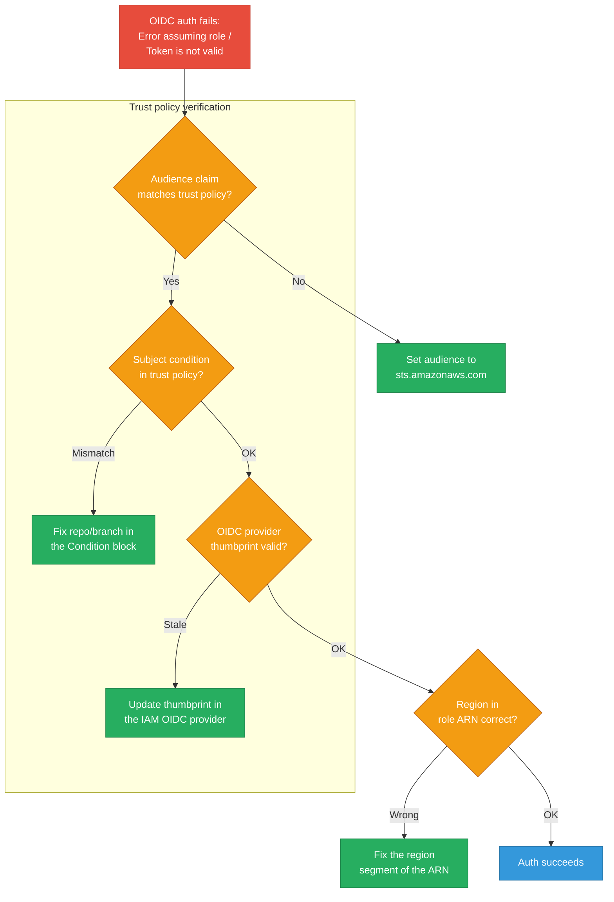
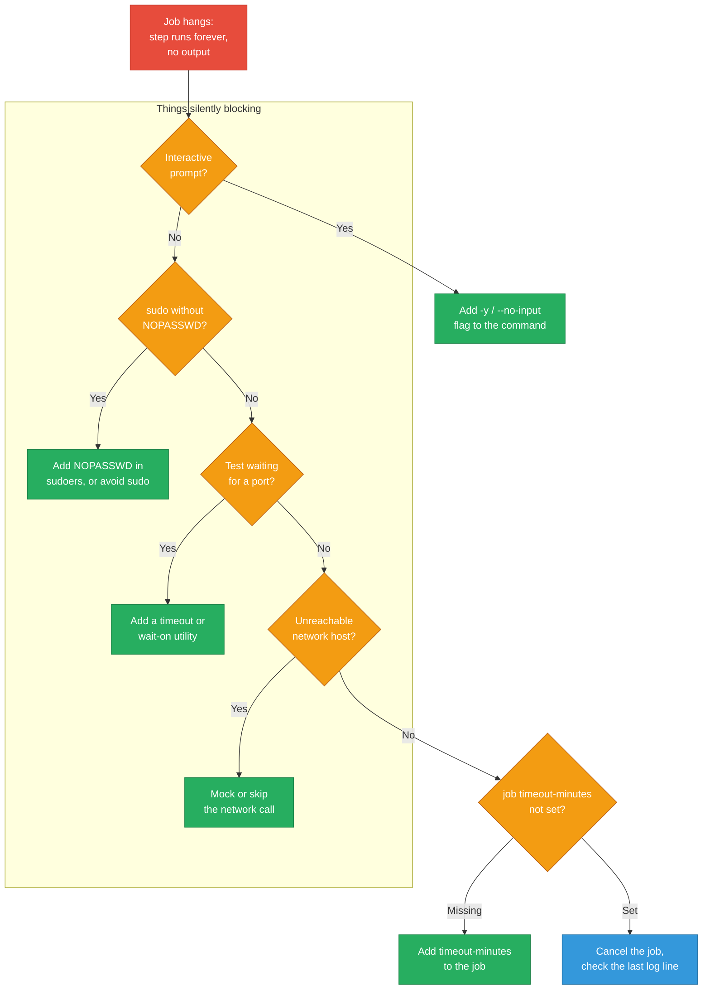
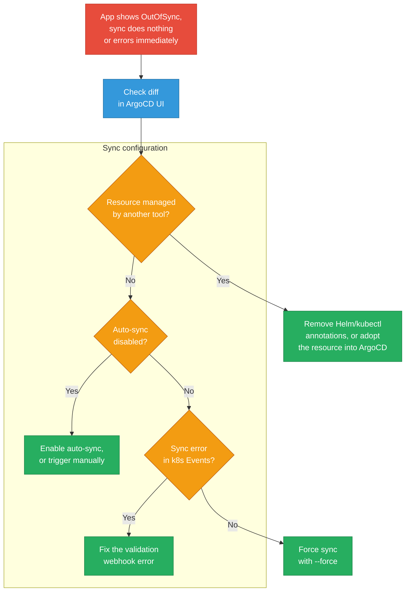
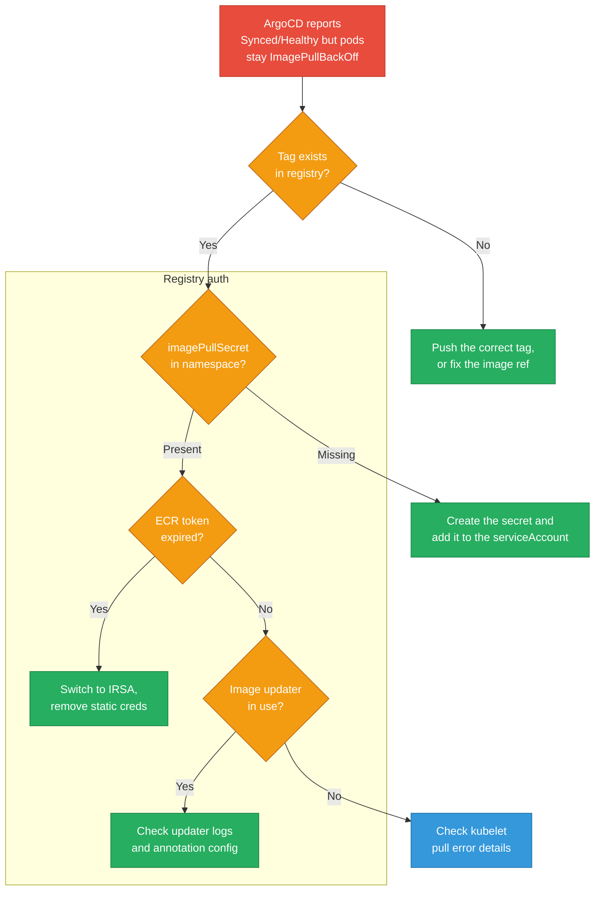
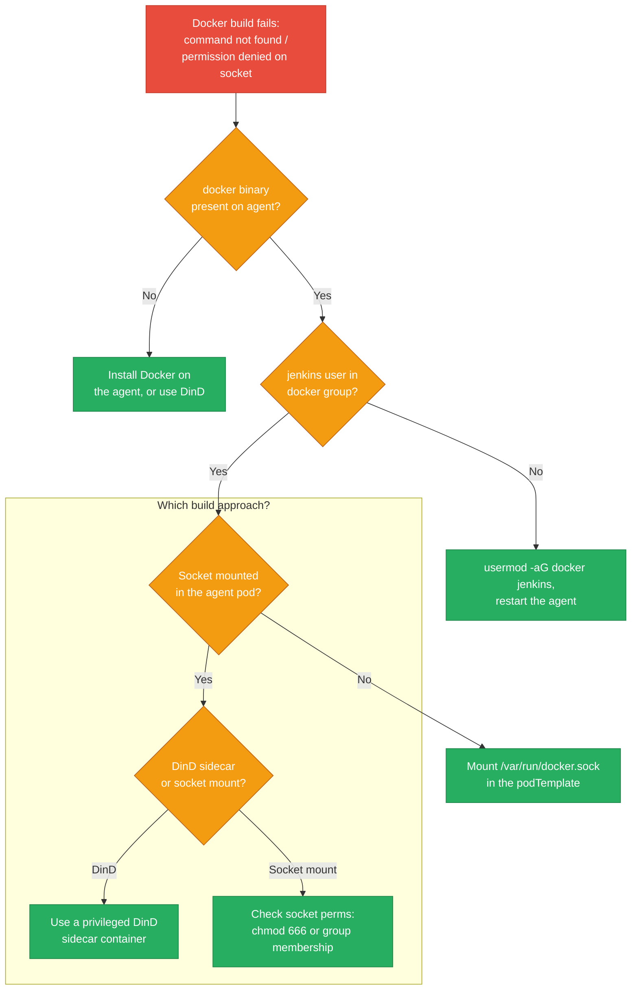
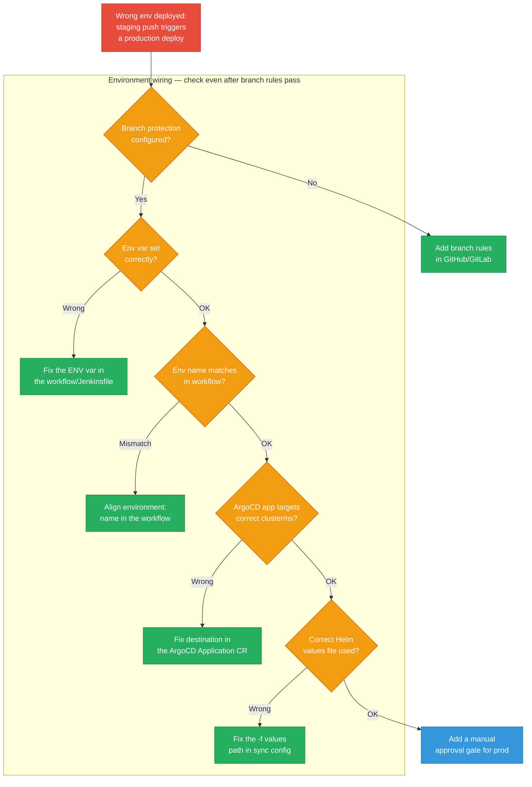
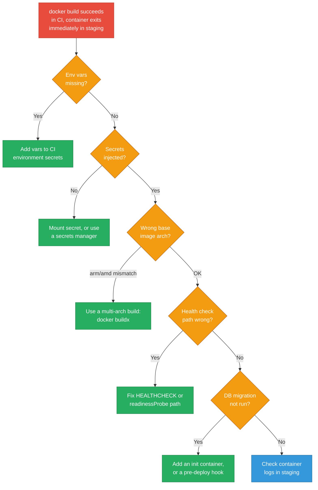
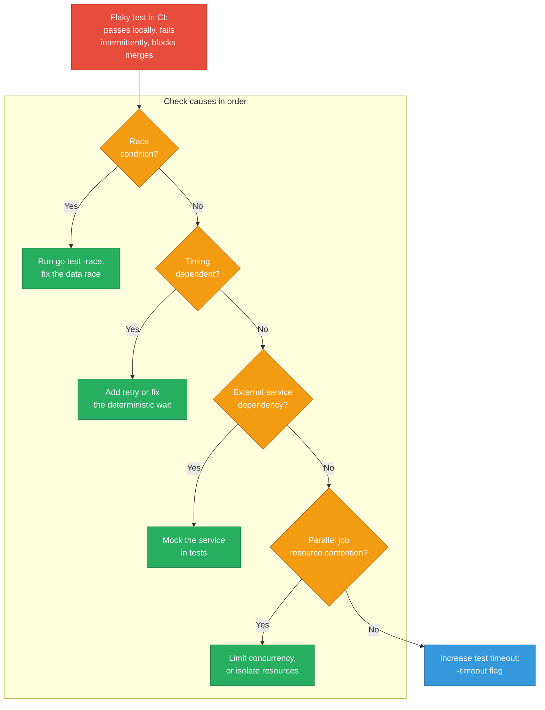

# CI/CD Debugging Scenarios

Practical debugging playbooks for GitHub Actions, ArgoCD, and Jenkins.

<div class="quiz-progress" data-quiz-progress>
  <span class="quiz-progress-label">0/0 checks</span>
  <span class="quiz-progress-bar"><span class="quiz-progress-fill"></span></span>
</div>

---

## 1. GitHub Actions: OIDC Auth to AWS Fails

**Symptom:** `Error assuming role` or `Token is not valid` when using `aws-actions/configure-aws-credentials`.



<div class="stepper">
  <div class="stepper-panels">
    <div class="stepper-panel active">
      <strong>1. Confirm the audience claim.</strong> The <code>audience</code> field in the workflow's <code>configure-aws-credentials</code> step must exactly match what the trust policy expects — almost always <code>sts.amazonaws.com</code>. A mismatch here fails before AWS ever gets to evaluating the subject.
    </div>
    <div class="stepper-panel">
      <strong>2. Check the trust policy's subject condition.</strong> The <code>token.actions.githubusercontent.com:sub</code> condition encodes exactly which repo and ref (branch or tag) is allowed to assume the role — e.g. <code>repo:org/repo:ref:refs/heads/main</code>. A PR from a different branch, or a fork, won't match and the assume-role call is rejected outright.
    </div>
    <div class="stepper-panel">
      <strong>3. Verify the OIDC provider thumbprint.</strong> <code>aws iam get-open-id-connect-provider</code> shows the thumbprint IAM trusts for GitHub's certificate chain. GitHub rotates its intermediate certs occasionally; a stale thumbprint in IAM breaks every workflow using that provider at once, not just one repo.
    </div>
    <div class="stepper-panel">
      <strong>4. Check the region in the role ARN.</strong> <code>role-to-assume</code> is a fully-qualified ARN — a typo'd or leftover region segment from a copy-pasted ARN fails the exact same way as a genuine trust-policy problem, so rule it out before digging further into IAM.
    </div>
    <div class="stepper-panel">
      <strong>5. Confirm with a manual identity check.</strong> Run <code>aws sts get-caller-identity</code> right after the credentials step. It confirms the whole chain — audience, subject, thumbprint, and region — resolved correctly, in one command.
    </div>
  </div>
  <div class="stepper-controls">
    <button class="stepper-prev">← Prev</button>
    <span class="stepper-dots"></span>
    <span class="stepper-label"></span>
    <button class="stepper-next">Next →</button>
  </div>
</div>

**Checklist & commands:**

```yaml
# workflow snippet — audience must match
- uses: aws-actions/configure-aws-credentials@v4
  with:
    role-to-assume: arn:aws:iam::123456789012:role/MyRole
    aws-region: us-east-1
    audience: sts.amazonaws.com   # must match trust policy
```

```json
// IAM trust policy — subject must match branch/repo
{
  "Condition": {
    "StringLike": {
      "token.actions.githubusercontent.com:sub": "repo:org/repo:ref:refs/heads/main",
      "token.actions.githubusercontent.com:aud": "sts.amazonaws.com"
    }
  }
}
```

```bash
# verify OIDC provider thumbprint
aws iam list-open-id-connect-providers
aws iam get-open-id-connect-provider \
  --open-id-connect-provider-arn arn:aws:iam::ACCOUNT:oidc-provider/token.actions.githubusercontent.com

# test assume-role manually with a debug token
aws sts get-caller-identity
```

**Prevention:** Pin the `aws-actions/configure-aws-credentials` version (`@v4` not `@main`). Store the role ARN in a repository variable not hardcoded in the workflow. Add a CI test workflow that fires on every trust-policy change PR and asserts `aws sts get-caller-identity` succeeds.

<div class="quiz-card">
  <p class="quiz-q">A GitHub Actions job fails with "Error assuming role" even though the IAM role has every S3 permission the job needs. Where's the actual problem, and where do you look first?</p>
  <button class="quiz-reveal">Reveal answer</button>
  <div class="quiz-a" hidden>OIDC auth failures are almost always about federation, not permissions — the role's <em>trust policy</em> (who is allowed to assume it) is a completely separate thing from the role's <em>permissions policy</em> (what it can do once assumed). Check first whether the workflow's <code>audience</code> matches what the trust policy expects, and whether the <code>sub</code> condition's repo/branch matches exactly. A role with a flawless S3 policy still can't be assumed if the trust policy's Condition block doesn't match the token GitHub is presenting.</div>
</div>

---

## 2. GitHub Actions: Job Hangs Indefinitely

**Symptom:** A step runs forever with no output; job never completes.



**Commands:**

```yaml
jobs:
  build:
    timeout-minutes: 15      # always set a ceiling
    steps:
      - run: apt-get install -y curl   # -y prevents prompt
```

```bash
# cancel a stuck run via CLI
gh run list --limit 5
gh run cancel <run-id>

# stream logs to find the last line before hang
gh run view <run-id> --log | tail -40
```

<div class="toggle-switch">
  <div class="toggle-buttons">
    <button data-toggle-opt="prompt" class="active state-warn">Interactive prompt</button>
    <button data-toggle-opt="sudo" class="state-warn">sudo without NOPASSWD</button>
    <button data-toggle-opt="port" class="state-warn">Waiting on a port</button>
    <button data-toggle-opt="network" class="state-bad">Unreachable host</button>
  </div>
  <div class="toggle-panel active" data-toggle-panel="prompt">
    A command like <code>apt-get install curl</code> without <code>-y</code> silently blocks on a confirmation prompt no one is there to answer — CI has no TTY to type "yes" into, so the process just sits there until something else (a job timeout, if you set one) kills it. Fix: pass the non-interactive flag every tool supports (<code>-y</code>, <code>--no-input</code>, <code>DEBIAN_FRONTEND=noninteractive</code>).
  </div>
  <div class="toggle-panel" data-toggle-panel="sudo">
    A <code>sudo</code> call in a step whose user isn't configured with <code>NOPASSWD</code> in <code>sudoers</code> blocks waiting for a password that will never arrive. Fix: add a <code>NOPASSWD</code> entry for the CI user, or restructure the step so it doesn't need <code>sudo</code> at all.
  </div>
  <div class="toggle-panel" data-toggle-panel="port">
    A test or health check that polls a port before the service under test has actually started can spin forever if the polling loop has no bound — it isn't "hung" in the technical sense, it's looping with no exit condition. Fix: use a <code>wait-on</code>-style utility with an explicit timeout, not a raw unbounded loop.
  </div>
  <div class="toggle-panel" data-toggle-panel="network">
    The sneaky one: a step that reaches out to a host CI runners can't route to (an internal service, something blocked by firewall rules) hangs on the TCP connect attempt until the OS-level connect timeout fires — which can be minutes, not seconds, and produces zero output the whole time. Fix: mock or skip the network call in CI.
  </div>
</div>

**Prevention:** Set `timeout-minutes` on every job and every step. Use `continue-on-error: false` (default) and add `cancel-in-progress: true` to concurrency groups so a new push cancels stuck old runs. Add a `job_timeout` metric via GitHub API to alert if any job exceeds 30 minutes.

<div class="quiz-card">
  <p class="quiz-q">You set <code>timeout-minutes: 15</code> on a job that's prone to hanging. Is that alone enough to stop a bad push from piling up stuck runs?</p>
  <button class="quiz-reveal">Reveal answer</button>
  <div class="quiz-a" hidden>No — <code>timeout-minutes</code> only bounds how long a single run can hang before it's killed. A new push on the same branch still queues or races behind however many previous runs are still ticking down their own 15 minutes. Pair it with <code>cancel-in-progress: true</code> on the workflow's concurrency group so a new push on the same ref actively cancels the old, still-hanging job instead of leaving it to time out on its own.</div>
</div>

---

## 3. ArgoCD: App Out of Sync But Won't Sync

**Symptom:** App shows `OutOfSync` in the UI but sync does nothing or errors immediately.



<div class="stepper">
  <div class="stepper-panels">
    <div class="stepper-panel active">
      <strong>1. Read the diff, don't guess.</strong> <code>argocd app diff my-app</code> shows exactly which fields ArgoCD thinks are different between desired and live state — this is the fastest way to tell genuine drift apart from a sync mechanism that's actually broken.
    </div>
    <div class="stepper-panel">
      <strong>2. Rule out an ownership conflict.</strong> If a live resource carries Helm-release annotations or was last touched by a manual <code>kubectl apply</code> instead of ArgoCD's own tracking annotation, ArgoCD reports perpetual drift because another tool keeps changing the object out from under it. Remove the foreign annotations, or formally adopt the resource into the ArgoCD Application.
    </div>
    <div class="stepper-panel">
      <strong>3. Check whether sync is actually enabled.</strong> <code>argocd app get my-app</code> shows the sync policy. A disabled auto-sync means ArgoCD is faithfully reporting drift and just waiting for a human to click Sync — that's expected behavior, not a bug to chase.
    </div>
    <div class="stepper-panel">
      <strong>4. Look for a rejected sync in Events.</strong> <code>kubectl get events</code> surfaces admission/validation-webhook rejections that would otherwise look, from the ArgoCD UI alone, like sync is silently doing nothing.
    </div>
    <div class="stepper-panel">
      <strong>5. Force sync only once the cause is known.</strong> <code>argocd app sync my-app --force</code> overwrites live state unconditionally — reach for it after the diff and events have told you what's actually wrong, not as the first move.
    </div>
  </div>
  <div class="stepper-controls">
    <button class="stepper-prev">← Prev</button>
    <span class="stepper-dots"></span>
    <span class="stepper-label"></span>
    <button class="stepper-next">Next →</button>
  </div>
</div>

**Commands:**

```bash
# inspect what ArgoCD thinks is different
argocd app diff my-app

# check sync status and last error
argocd app get my-app

# enable sync if disabled
argocd app set my-app --sync-policy automated

# force sync (overwrites live state)
argocd app sync my-app --force

# check for webhook rejections in k8s events
kubectl get events -n my-namespace --sort-by='.lastTimestamp' | tail -20
```

**Prevention:** Enable ArgoCD auto-sync with `selfHeal: true` and `prune: true` in non-prod environments so drift is corrected automatically. Use `syncPolicy.syncOptions: [CreateNamespace=true]` to avoid manual namespace creation. Add `argocd app wait` in the CD pipeline — fails the deploy pipeline if ArgoCD doesn't reach `Synced+Healthy` within the timeout.

<div class="quiz-card">
  <p class="quiz-q">Should you turn on ArgoCD's <code>selfHeal: true</code> and <code>prune: true</code> in production the same way you'd enable them in staging?</p>
  <button class="quiz-reveal">Reveal answer</button>
  <div class="quiz-a" hidden>The prevention advice here is scoped deliberately to non-prod: enable <code>selfHeal</code> and <code>prune</code> in non-prod environments so drift self-corrects automatically. In production, a controller that auto-heals and auto-prunes will just as happily revert or delete something an engineer changed live for a legitimate reason — an emergency scale-up, a break-glass hotfix — which is a much larger blast radius than the same behavior in staging. Treat it as an environment-scoped setting, not a global default.</div>
</div>

---

## 4. ArgoCD: ImagePullBackOff After Deploy

**Symptom:** ArgoCD reports `Synced/Healthy` but pods stay in `ImagePullBackOff`.



**Commands:**

```bash
# check pod events for pull error details
kubectl describe pod <pod-name> -n <ns> | grep -A 10 Events

# verify image tag exists in ECR
aws ecr describe-images --repository-name my-repo \
  --image-ids imageTag=v1.2.3

# create ECR pull secret (short-term fix)
kubectl create secret docker-registry ecr-creds \
  --docker-server=<account>.dkr.ecr.<region>.amazonaws.com \
  --docker-username=AWS \
  --docker-password=$(aws ecr get-login-password)

# check argocd-image-updater logs
kubectl logs -n argocd deploy/argocd-image-updater | tail -50
```

<div class="toggle-switch">
  <div class="toggle-buttons">
    <button data-toggle-opt="tag" class="active state-bad">Tag-based reference</button>
    <button data-toggle-opt="digest" class="state-ok">Digest-pinned reference</button>
  </div>
  <div class="toggle-panel active" data-toggle-panel="tag">
    <code>image: myapp:latest</code> (or any mutable tag like <code>:v1.2.3</code> that gets re-pushed) is a moving pointer — the tag that existed when ArgoCD last synced can point at a different digest by the time a node actually pulls it. That race is exactly how a `Synced/Healthy` app ends up with pods that can't pull: the tag ArgoCD recorded and the tag currently in the registry disagree.
  </div>
  <div class="toggle-panel" data-toggle-panel="digest">
    <code>image: myapp@sha256:...</code> pins to one immutable content hash. There's no "the tag changed underneath me" race to debug at all — whatever digest ArgoCD synced is byte-for-byte what every node pulls, forever. This is the fix the Prevention note below calls out directly.
  </div>
</div>

**Prevention:** Use image digest pinning in ArgoCD (`image: myapp@sha256:...`) — eliminates tag races. Store `imagePullSecrets` as a sealed secret or External Secrets Operator resource, not a manually-created secret. Add a registry reachability check to the CD pipeline before deploying.

---

## 5. Jenkins Pipeline: Docker Build Fails in Agent

**Symptom:** `docker: command not found` or `permission denied /var/run/docker.sock`.



<div class="stepper">
  <div class="stepper-panels">
    <div class="stepper-panel active">
      <strong>1. Confirm the docker binary exists on the agent.</strong> If the base agent image doesn't ship Docker at all, every check downstream is moot — install it on the agent, or switch the whole approach to Docker-in-Docker.
    </div>
    <div class="stepper-panel">
      <strong>2. Check group membership.</strong> The <code>jenkins</code> user needs to be in the host's <code>docker</code> group to talk to the socket without root. <code>usermod -aG docker jenkins</code> plus an agent restart is required to pick up the new group — reloading the Jenkins service alone isn't enough, since group membership is resolved at session/login time, not by the app.
    </div>
    <div class="stepper-panel">
      <strong>3. Verify the socket is actually mounted into the pod.</strong> On Kubernetes agents this is a podTemplate concern, not a Jenkins-config concern — <code>/var/run/docker.sock</code> has to be an explicit <code>hostPath</code> volume mount, or the container never sees the host's Docker daemon regardless of user/group settings.
    </div>
    <div class="stepper-panel">
      <strong>4. Check socket permissions directly.</strong> <code>ls -la /var/run/docker.sock</code> should show <code>srw-rw----</code> owned by the <code>docker</code> group. Wrong permissions here produce the exact same "permission denied" error as a missing group membership, so check both rather than assuming which one it is.
    </div>
    <div class="stepper-panel">
      <strong>5. Decide DinD vs. socket mount going forward.</strong> Socket mount shares the host's daemon (fast, but any container that can reach the socket can launch a privileged container and effectively become root on the host). DinD isolates the daemon per-pipeline but needs its own privileged sidecar. Neither is free — see Prevention below for the fix that avoids the trade-off entirely.
    </div>
  </div>
  <div class="stepper-controls">
    <button class="stepper-prev">← Prev</button>
    <span class="stepper-dots"></span>
    <span class="stepper-label"></span>
    <button class="stepper-next">Next →</button>
  </div>
</div>

**Pipeline snippet & commands:**

<div class="tab-group">
  <div class="tab-buttons">
    <button data-tab="socket" class="active">Socket mount</button>
    <button data-tab="dind">DinD sidecar</button>
  </div>
  <div class="tab-panels">
    <div class="tab-panel active" data-tab-panel="socket">
      <pre><code class="language-groovy">// Jenkinsfile — socket mount approach
pipeline {
  agent {
    kubernetes {
      yaml """
apiVersion: v1
kind: Pod
spec:
  containers:
  - name: docker
    image: docker:24-cli
    command: [sleep, infinity]
    volumeMounts:
    - name: docker-sock
      mountPath: /var/run/docker.sock
  volumes:
  - name: docker-sock
    hostPath:
      path: /var/run/docker.sock
"""
    }
  }
  stages {
    stage('Build') {
      steps {
        container('docker') {
          sh 'docker build -t my-image .'
        }
      }
    }
  }
}</code></pre>
      Shares the host's Docker daemon directly. Fastest option and no extra container to boot, but any build step that can reach the socket has an effective path to host root — treat the mount as equivalent to running the build step privileged.
    </div>
    <div class="tab-panel" data-tab-panel="dind">
      <pre><code class="language-groovy">// Jenkinsfile — Docker-in-Docker sidecar approach
pipeline {
  agent {
    kubernetes {
      yaml """
apiVersion: v1
kind: Pod
spec:
  containers:
  - name: docker
    image: docker:24-cli
    command: [sleep, infinity]
    env:
    - name: DOCKER_HOST
      value: tcp://localhost:2375
  - name: dind
    image: docker:24-dind
    securityContext:
      privileged: true
    env:
    - name: DOCKER_TLS_CERTDIR
      value: ""
"""
    }
  }
  stages {
    stage('Build') {
      steps {
        container('docker') {
          sh 'docker build -t my-image .'
        }
      }
    }
  }
}</code></pre>
      Runs an isolated daemon per pipeline in a <code>dind</code> sidecar, so no build shares the node's actual Docker socket. Trade-off: the sidecar itself must run <code>privileged: true</code>, so the risk moves from "shared host socket" to "one more privileged container per build" rather than disappearing.
    </div>
  </div>
</div>

```bash
# on the agent node — add jenkins to docker group
sudo usermod -aG docker jenkins
sudo systemctl restart jenkins

# verify socket permissions
ls -la /var/run/docker.sock   # should be srw-rw---- docker group
```

**Prevention:** Use rootless Docker or Kaniko/Buildah in CI agents — eliminates the `docker.sock` privilege escalation risk entirely. If Docker-in-Docker is required, use `--privileged` only in isolated ephemeral agents, never on long-lived shared agents.

<div class="quiz-card">
  <p class="quiz-q">The socket-mount fix for Jenkins' <code>docker.sock</code> permission error works — the build goes green. Is that the recommended long-term fix?</p>
  <button class="quiz-reveal">Reveal answer</button>
  <div class="quiz-a" hidden>No. The Prevention rule for this scenario is explicit: getting socket permissions right doesn't remove the underlying risk — any container that can reach <code>docker.sock</code> can launch a privileged container and effectively become root on the host. Both socket-mount and DinD carry this risk in different shapes. The recommended fix is to move off Docker entirely for CI builds in favor of rootless Docker or Kaniko/Buildah, which eliminates the privilege-escalation path rather than just permissioning around it. DinD with <code>--privileged</code> is acceptable only as a fallback, and only on isolated, ephemeral agents — never long-lived shared ones.</div>
</div>

---

## 6. Pipeline Deploys to Wrong Environment

**Symptom:** A staging branch push triggers a production deployment.



**Concrete fixes:**

```yaml
# GitHub Actions — gate production on branch + approval
jobs:
  deploy-prod:
    if: github.ref == 'refs/heads/main'
    environment: production          # requires manual approval in repo settings
    steps:
      - run: helm upgrade --install my-app ./chart -f values/prod.yaml
```

```bash
# verify ArgoCD app destination
argocd app get my-app -o json | jq '.spec.destination'

# check which values file ArgoCD is using
argocd app get my-app -o json | jq '.spec.source.helm'
```

**Prevention:** Use ArgoCD ApplicationSets with environment-specific values files and `project` RBAC — engineers can't promote to prod without approval. Add a `diff` step to the CD pipeline that shows what will change in each environment before applying. Use Helm `--atomic` flag so failed upgrades auto-rollback.

<div class="quiz-card">
  <p class="quiz-q">Branch protection is correctly configured so only <code>main</code> can trigger the production deploy job. Does that fully prevent a wrong-environment deploy?</p>
  <button class="quiz-reveal">Reveal answer</button>
  <div class="quiz-a" hidden>No — branch protection only controls <em>which branch</em> is allowed to run the production job. It says nothing about whether that job's environment variable, its <code>environment:</code> name, the ArgoCD Application's destination cluster/namespace, or the Helm values file path actually point at production. Any one of those can be misconfigured — a copy-pasted destination, a stale values path — and silently deploy the right branch to the wrong place. That's exactly why the diagnostic flow keeps checking env var, environment name, ArgoCD destination, and values file even after branch protection has already passed.</div>
</div>

---

## 7. Container Image Build Passes but App Crashes in Staging

**Symptom:** `docker build` succeeds in CI, but container exits immediately in staging.



**Commands:**

```bash
# pull and inspect the exact CI-built image locally
docker pull <registry>/my-app:<ci-tag>
docker run --rm -e ENV=staging <registry>/my-app:<ci-tag>

# check arch of built image
docker inspect <image> | jq '.[].Architecture'

# multi-arch build
docker buildx build --platform linux/amd64,linux/arm64 -t my-app:latest --push .

# check staging pod logs
kubectl logs -n staging deploy/my-app --previous
kubectl logs -n staging deploy/my-app -f

# describe pod for crash reason
kubectl describe pod -n staging -l app=my-app | grep -A 5 "Last State"
```

**Prevention:** Add a post-deploy smoke test step in the CD pipeline: `kubectl rollout status deployment/my-app -n staging --timeout=120s && curl -f https://staging.example.com/health`. If it fails, auto-rollback with `kubectl rollout undo`. Use `progressDeadlineSeconds: 120` on Deployments so rollouts auto-fail fast.

<div class="quiz-card">
  <p class="quiz-q">A container image builds and runs fine on the CI runner, but crash-loops the instant it's deployed to staging. What's a likely cause the build step wouldn't have caught at all?</p>
  <button class="quiz-reveal">Reveal answer</button>
  <div class="quiz-a" hidden>An architecture mismatch — the CI runner is amd64 but staging nodes are arm64 (or vice versa), so the compiled binary inside the image simply can't execute on the target CPU. A single-arch <code>docker build</code> produces a single-arch image, and it "succeeds" on CI because CI's architecture happens to match the image it just built — the mismatch only surfaces once the same image lands on different hardware. Fix with a multi-arch build (<code>docker buildx build --platform linux/amd64,linux/arm64</code>), not by re-running the same single-arch build and hoping.</div>
</div>

---

## 8. Flaky Tests Blocking Pipeline

**Symptom:** Tests pass locally and sometimes in CI, but fail intermittently and block merges.



<div class="toggle-switch">
  <div class="toggle-buttons">
    <button data-toggle-opt="race" class="active state-bad">Race condition</button>
    <button data-toggle-opt="timing" class="state-warn">Timing dependent</button>
    <button data-toggle-opt="external" class="state-warn">External dependency</button>
    <button data-toggle-opt="contention" class="state-warn">Resource contention</button>
  </div>
  <div class="toggle-panel active" data-toggle-panel="race">
    The hardest one to catch by inspection: two goroutines/threads touch shared state without synchronization, and the outcome depends on scheduling order that varies run to run — often only under CI's specific CPU/load conditions, not locally. Fix: run <code>go test -race</code> to have the race detector instrument every memory access and flag the exact unsynchronized read/write, then fix the underlying data race, not the symptom.
  </div>
  <div class="toggle-panel" data-toggle-panel="timing">
    The test assumes something finishes within a fixed sleep or short window — a goroutine starts, an async callback fires, a debounce settles — and that assumption holds most of the time but not always, especially under CI's noisier, often slower shared hardware. Fix: replace the fixed sleep with a deterministic wait (poll for the actual condition), or add a bounded retry as a stopgap.
  </div>
  <div class="toggle-panel" data-toggle-panel="external">
    The test talks to a real external service (a third-party API, a shared staging database) whose own latency or occasional unavailability leaks into the test result. Fix: mock the dependency so the test's pass/fail depends only on the code under test, not on someone else's uptime.
  </div>
  <div class="toggle-panel" data-toggle-panel="contention">
    Multiple test jobs run in parallel on the same CI runner and fight over a shared resource — a fixed port, a shared temp directory, a rate-limited API key — so failures appear only when enough jobs happen to collide. Fix: limit concurrency, or give each parallel job its own isolated copy of the contended resource.
  </div>
</div>

**Commands:**

```bash
# detect races
go test -race ./...

# run with explicit timeout
go test -timeout 120s ./...

# re-run flaky test N times locally
for i in $(seq 1 10); do go test -run TestMyFlaky ./pkg/...; done

# run only failed tests from last run (requires gotestsum)
gotestsum --rerun-fails=3 --packages ./...
```

```yaml
# GitHub Actions — retry flaky step
- name: Test
  uses: nick-fields/retry@v3
  with:
    timeout_minutes: 10
    max_attempts: 3
    command: go test -race -timeout 90s ./...
```

**Prevention:** Track flakiness rate per test in CI metrics — quarantine any test with >5% flakiness until fixed (don't just retry). Use `go test -count=1` to disable test caching and always run fresh. For integration tests: use `testcontainers-go` to spin up real dependencies instead of mocks — eliminates a whole class of flakiness from mock state pollution.

<div class="quiz-card">
  <p class="quiz-q">A flaky test gets wrapped in <code>nick-fields/retry</code> with <code>max_attempts: 3</code>, and the pipeline goes green again. Does that count as fixing the flaky test?</p>
  <button class="quiz-reveal">Reveal answer</button>
  <div class="quiz-a" hidden>Only as a stopgap — the Prevention rule says so directly: track flakiness rate per test and quarantine anything over roughly 5% flaky until it's actually fixed, don't just retry. A blind retry wrapper hides the failure rate instead of reducing it, and it costs CI time on every single run, not just the flaky ones. Retry is fine as a temporary band-aid while the real fix — removing the data race, replacing a fixed sleep with a deterministic wait, mocking an external dependency, or isolating a contended resource — is actually in progress.</div>
</div>

---

## Quick Reference

| Symptom | First command |
|---------|--------------|
| OIDC auth fails | `aws sts get-caller-identity` |
| Job hangs | `gh run cancel <id>` + check last log |
| ArgoCD won't sync | `argocd app diff my-app` |
| ImagePullBackOff | `kubectl describe pod` → check Events |
| Docker not found in Jenkins | `ls -la /var/run/docker.sock` |
| Wrong env deployed | `argocd app get my-app -o json \| jq .spec.destination` |
| App crashes in staging | `kubectl logs deploy/my-app --previous` |
| Flaky tests | `go test -race ./...` |
