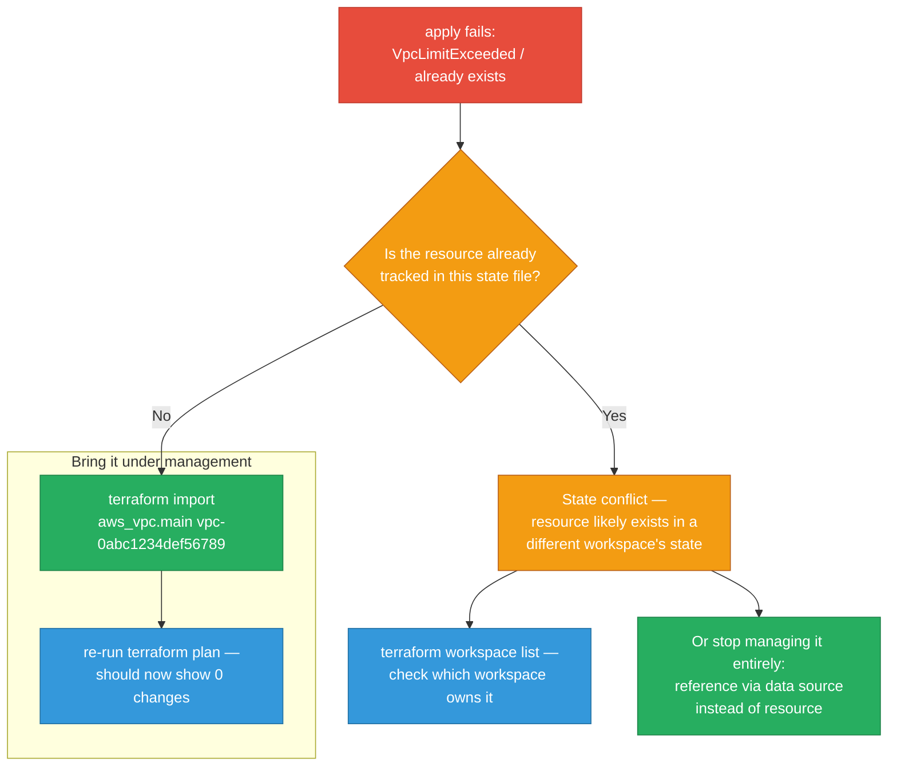
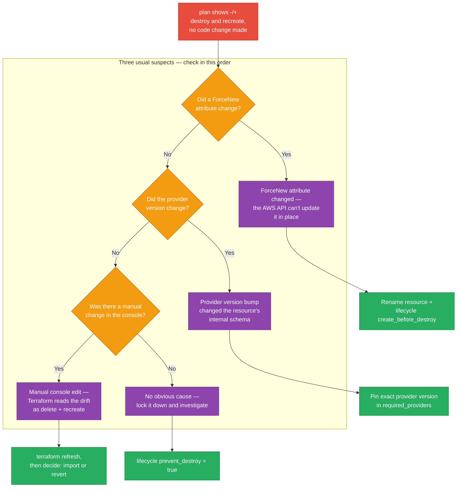
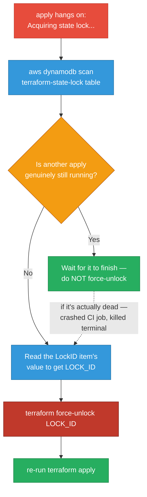
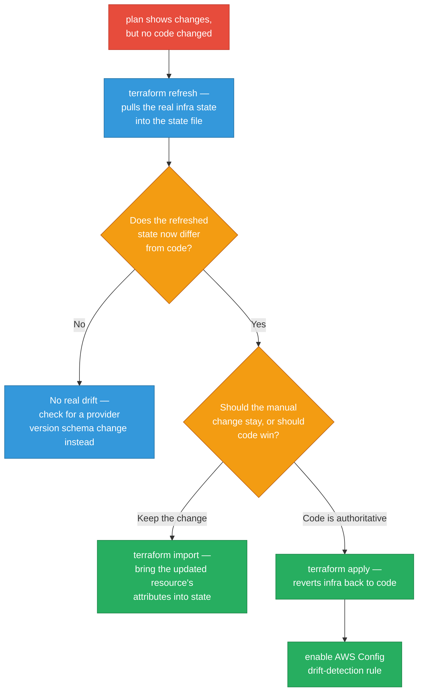
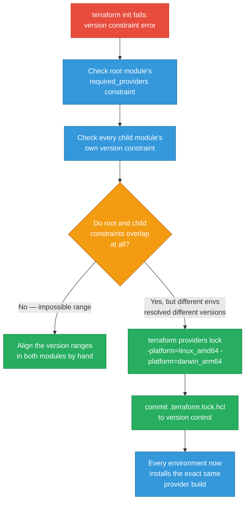
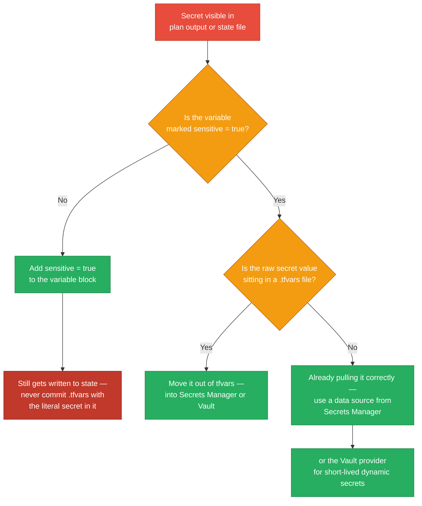
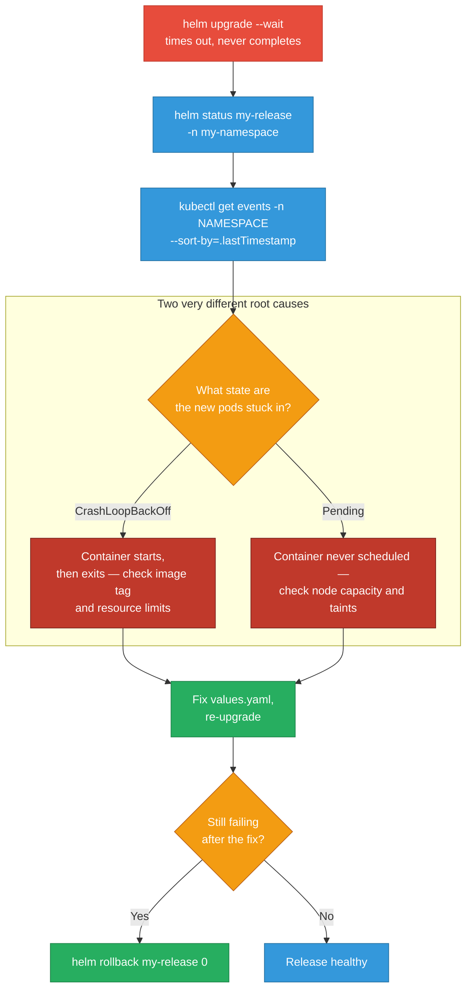
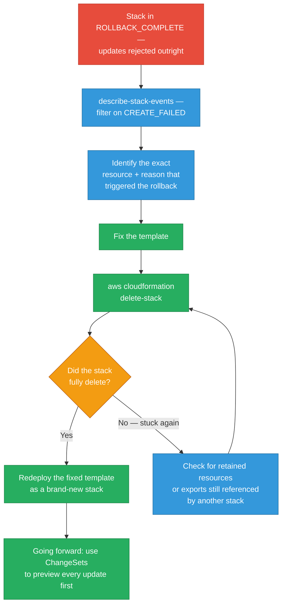

# IaC Debugging Scenarios

Terraform, Helm, and CloudFormation failure patterns with diagnosis flowcharts and concrete commands.

<div class="quiz-progress" data-quiz-progress>
  <span class="quiz-progress-label">0/0 checks</span>
  <span class="quiz-progress-bar"><span class="quiz-progress-fill"></span></span>
</div>

---

## 1. terraform apply Fails: Resource Already Exists

**Symptom:** `Error creating VPC: VpcLimitExceeded` or `already exists`



**Commands:**
```bash
# Import existing resource into state
terraform import aws_vpc.main vpc-0abc1234def56789

# Or reference without managing it
# In .tf:
data "aws_vpc" "main" {
  id = "vpc-0abc1234def56789"
}

# Check all workspaces
terraform workspace list
```

**Prevention:** Run `terraform plan` in CI on every PR and require approval before `apply`. Use `lifecycle { prevent_destroy = true }` on stateful resources. Add `terraform validate` and `tflint` as required CI checks to catch config errors before they reach `apply`.

---

## 2. terraform plan Shows Unexpected Destroy

**Symptom:** Plan shows `-/+` destroy and recreate for a resource you didn't change.



<div class="toggle-switch">
  <div class="toggle-buttons">
    <button data-toggle-opt="forcenew" class="active state-warn">ForceNew attribute changed</button>
    <button data-toggle-opt="provider" class="state-warn">Provider version changed</button>
    <button data-toggle-opt="manual" class="state-bad">Manual console change</button>
  </div>
  <div class="toggle-panel active" data-toggle-panel="forcenew">
    Some resource attributes can't be updated in place at the cloud API level — changing them forces Terraform to destroy the old resource and create a new one. <code>terraform show -json plan.tfplan | jq</code> on the plan will show exactly which attribute triggered the <code>delete</code> action. Fix: if the replacement is unavoidable, rename the resource and add a <code>create_before_destroy</code> lifecycle so the new one exists before the old one is torn down.
  </div>
  <div class="toggle-panel" data-toggle-panel="provider">
    A provider version bump can change how a resource's internal schema is represented, even though nothing in your <code>.tf</code> changed. This is exactly why pinning matters: <code>required_providers { aws = { version = "= 5.31.0" } }</code> stops an unattended <code>terraform init -upgrade</code> from silently altering how existing resources are planned.
  </div>
  <div class="toggle-panel" data-toggle-panel="manual">
    Someone edited the resource by hand in the console. Terraform's state still reflects the old configuration, so the next plan reads the difference as "this needs to be destroyed and recreated" rather than "this was already changed." Run <code>terraform refresh</code> to pull the real state in, then decide whether to accept the manual change or let Terraform revert it.
  </div>
</div>

<div class="quiz-card">
  <p class="quiz-q">A <code>terraform plan</code> shows an unexpected <code>-/+</code> destroy-and-recreate on a resource nobody touched in code. What's the fastest way to find out which attribute is forcing the replacement, before you decide on a fix?</p>
  <button class="quiz-reveal">Reveal answer</button>
  <div class="quiz-a" hidden>Run <code>terraform plan -out=plan.tfplan</code> and then <code>terraform show -json plan.tfplan | jq '.resource_changes[] | select(.change.actions[] == "delete")'</code> — this surfaces the exact resource and attribute Terraform is reacting to, instead of guessing among the three usual causes (a ForceNew attribute, a provider version bump, or a manual console edit). Only after you know which one it is should you reach for the matching fix: a lifecycle alias, pinning the provider version, or a refresh-then-decide.</div>
</div>

**Commands:**
```bash
# See what attribute is forcing replacement
terraform plan -out=plan.tfplan
terraform show -json plan.tfplan | jq '.resource_changes[] | select(.change.actions[] == "delete")'

# Protect critical resources
# In .tf:
lifecycle {
  prevent_destroy = true
}

# Pin provider version
terraform {
  required_providers {
    aws = { source = "hashicorp/aws", version = "= 5.31.0" }
  }
}
```

**Prevention:** Always run `terraform plan -out=tfplan` and pipe it through `terraform show -json tfplan | jq '[.resource_changes[] | select(.change.actions[] | contains("delete"))] | length'` in CI — fail the pipeline if this count exceeds an expected threshold. Use `lifecycle { prevent_destroy = true }` on databases, S3 buckets, and KMS keys.

---

## 3. State Lock: terraform apply Hangs

**Symptom:** `Acquiring state lock...` hangs indefinitely.



<div class="stepper">
  <div class="stepper-panels">
    <div class="stepper-panel active">
      <strong>1. Find the stuck lock.</strong> <code>aws dynamodb scan --table-name terraform-state-lock --filter-expression "attribute_exists(LockID)"</code> shows every lock item currently held, including who created it and when.
    </div>
    <div class="stepper-panel">
      <strong>2. Confirm nothing is actually still running.</strong> This is the step people skip. Check CI for an in-progress job, and check with the team for a local <code>apply</code> left running in a terminal. Force-unlocking a lock that's protecting a live apply is how two processes end up writing to the same state file at once — <code>terraform force-unlock</code> only exists for a lock that got orphaned (crashed process, killed terminal, network drop), never for one that's doing its job.
    </div>
    <div class="stepper-panel">
      <strong>3. Get the LOCK_ID.</strong> The DynamoDB item's value (or the error message Terraform printed when it first failed to acquire the lock) contains the lock's ID — that's the argument <code>force-unlock</code> needs.
    </div>
    <div class="stepper-panel">
      <strong>4. Force-unlock, then re-run.</strong> <code>terraform force-unlock &lt;LOCK_ID&gt;</code> clears the DynamoDB item. Re-run <code>apply</code> immediately after — a cleared lock doesn't mean the underlying operation that orphaned it actually finished, so verify the state file looks sane before trusting the re-run's plan.
    </div>
  </div>
  <div class="stepper-controls">
    <button class="stepper-prev">← Prev</button>
    <span class="stepper-dots"></span>
    <span class="stepper-label"></span>
    <button class="stepper-next">Next →</button>
  </div>
</div>

<div class="quiz-card">
  <p class="quiz-q">Before running <code>terraform force-unlock &lt;LOCK_ID&gt;</code>, what's the one check you must not skip?</p>
  <button class="quiz-reveal">Reveal answer</button>
  <div class="quiz-a" hidden>Confirm there isn't an <code>apply</code> genuinely still running — in CI or on someone's terminal. The commands section is explicit that force-unlock is safe "only if no apply is running." Forcing the lock open while a real apply is mid-flight lets a second process start writing to the same state file concurrently, which is exactly the corruption the lock exists to prevent.</div>
</div>

**Commands:**
```bash
# Find the stuck lock in DynamoDB
aws dynamodb scan \
  --table-name terraform-state-lock \
  --filter-expression "attribute_exists(LockID)"

# Force unlock (only if no apply is running!)
terraform force-unlock <LOCK_ID>

# Or delete the DynamoDB item directly
aws dynamodb delete-item \
  --table-name terraform-state-lock \
  --key '{"LockID": {"S": "my-bucket/path/to/terraform.tfstate"}}'
```

**Prevention:** Use Terraform Cloud or Atlantis for all `apply` runs — eliminates local lock issues entirely. Set S3 state backend with `encrypt = true` and DynamoDB locking. Add a CI check that detects stale locks older than 30 minutes and alerts the on-call.

---

## 4. Terraform State Drift

**Symptom:** `terraform plan` shows changes even though no code changed.



**Commands:**
```bash
# Refresh state from real infrastructure
terraform refresh

# See what drifted
terraform plan -detailed-exitcode
# exit 2 = changes present

# Import the manually-changed resource
terraform import aws_security_group.web sg-0abc1234

# Enable AWS Config rule for drift detection
aws configservice put-config-rule --config-rule '{
  "ConfigRuleName": "required-tags",
  "Source": {"Owner": "AWS", "SourceIdentifier": "REQUIRED_TAGS"}
}'
```

**Prevention:** Run `terraform plan` on a schedule (nightly) and alert if it shows non-empty diff — that's drift. Use AWS Config Rules to detect manual console changes and trigger notifications. Enable CloudTrail and set up EventBridge rules to alert when resources are modified outside Terraform.

<div class="quiz-card">
  <p class="quiz-q"><code>terraform refresh</code> confirms real drift on a resource. What actually decides whether you run <code>terraform import</code> or <code>terraform apply</code> next?</p>
  <button class="quiz-reveal">Reveal answer</button>
  <div class="quiz-a" hidden>Whether the manual change should be kept or thrown away. If the manual change is correct and should become the new source of truth, <code>terraform import</code> pulls its updated attributes into state so code and reality agree. If code should stay authoritative, <code>terraform apply</code> reverts the manual change back to what's written in <code>.tf</code>. Refresh only tells you drift exists — it doesn't tell you which side should win.</div>
</div>

---

## 5. Module Version Conflict

**Symptom:** `terraform init` fails with version constraint errors across environments.



<div class="tab-group">
  <div class="tab-buttons">
    <button data-tab="exact" class="active">= X.Y.Z (exact)</button>
    <button data-tab="pessimistic">~> X.Y (pessimistic)</button>
    <button data-tab="minimum">&gt;= X.Y (minimum)</button>
  </div>
  <div class="tab-panels">
    <div class="tab-panel active" data-tab-panel="exact">
      <code>version = "= 5.1.2"</code> — locks to exactly one version, everywhere. This is what the Prevention rule calls for in production: no environment can silently resolve a different provider build than another.
    </div>
    <div class="tab-panel" data-tab-panel="pessimistic">
      <code>version = "~&gt; 5.1"</code> — allows patch upgrades (5.1.x) but not a minor bump. Convenient for fast-moving dev environments, but it's exactly the kind of range that lets two environments running <code>terraform init</code> on different days silently resolve two different provider versions — which is how this scenario's version conflict shows up in the first place.
    </div>
    <div class="tab-panel" data-tab-panel="minimum">
      <code>version = "&gt;= 5.1"</code> — no upper bound at all. The riskiest option: a brand-new major provider release can get pulled in automatically, changing resource schemas underneath you with zero warning. The Prevention rule is explicit that this should never be used in production.
    </div>
  </div>
</div>

**Commands:**
```bash
# See current provider constraints
terraform providers

# Generate/update lock file for all platforms
terraform providers lock \
  -platform=linux_amd64 \
  -platform=darwin_arm64

# Upgrade a specific provider within constraints
terraform init -upgrade

# Check what version is locked
cat .terraform.lock.hcl

# In modules, pin versions:
# module "vpc" {
#   source  = "terraform-aws-modules/vpc/aws"
#   version = "= 5.1.2"
# }
```

**Prevention:** Pin all module versions to exact versions (`= X.Y.Z`) in production, never use `~>` or `>=`. Use `terraform providers lock` to generate a `.terraform.lock.hcl` and commit it — enforces exact provider versions across all environments. Review module changelogs before bumping versions.

<div class="quiz-card">
  <p class="quiz-q">Two environments both run <code>terraform init</code> against a module pinned with <code>version = "~> 5.1"</code>, on different days. Why can they end up with different provider behavior even though nobody changed the constraint?</p>
  <button class="quiz-reveal">Reveal answer</button>
  <div class="quiz-a" hidden><code>~></code> is a pessimistic range, not a single version — it allows any patch release within 5.1.x, so whichever 5.1.x happened to be latest on the day <code>init</code> ran gets resolved. Two environments initializing on different dates can land on two different patch versions of the same provider. That's exactly why the Prevention rule says to pin exact versions (<code>= X.Y.Z</code>) in production and commit <code>.terraform.lock.hcl</code> — the lock file, not the constraint string, is what actually guarantees every environment installs the identical provider build.</div>
</div>

---

## 6. Sensitive Values in State / Plan Output

**Symptom:** Passwords or secrets visible in `terraform plan` or stored in state file.



<div class="tab-group">
  <div class="tab-buttons">
    <button data-tab="hardcoded" class="active">Hardcoded in HCL</button>
    <button data-tab="sensitiveflag">sensitive = true</button>
    <button data-tab="secretsmgr">Secrets Manager data source</button>
    <button data-tab="vault">Vault dynamic secret</button>
  </div>
  <div class="tab-panels">
    <div class="tab-panel active" data-tab-panel="hardcoded">
      <code>password = "hunter2"</code> written directly in a <code>.tf</code> or <code>.tfvars</code> file. Worst case: the plaintext value lands in version control history forever, in the plan output, and in the state file. This is the exact pattern the Prevention rule says never to do.
    </div>
    <div class="tab-panel" data-tab-panel="sensitiveflag">
      <code>variable "db_password" { sensitive = true }</code> stops the value from being printed in CLI plan/apply output. It does <strong>not</strong> stop the value from being written into the state file itself — the state still needs to be treated as sensitive (S3 bucket locked to the CI role, SSE-KMS encryption), and the raw value still shouldn't be sitting in a committed <code>.tfvars</code>.
    </div>
    <div class="tab-panel" data-tab-panel="secretsmgr">
      <code>data "aws_secretsmanager_secret_version"</code> fetches the value at apply time instead of storing it in HCL at all — Terraform never has a plaintext copy to accidentally commit. This is the approach the Prevention rule recommends by name.
    </div>
    <div class="tab-panel" data-tab-panel="vault">
      <code>data "vault_generic_secret"</code> goes a step further: the secret can be short-lived and dynamically generated per-lease, so even a state file compromise only exposes a value that may have already expired.
    </div>
  </div>
</div>

**Commands:**
```hcl
# Mark variable as sensitive
variable "db_password" {
  type      = string
  sensitive = true
}

# Fetch from Secrets Manager instead
data "aws_secretsmanager_secret_version" "db" {
  secret_id = "prod/db/password"
}

resource "aws_db_instance" "main" {
  password = data.aws_secretsmanager_secret_version.db.secret_string
}

# Vault provider for dynamic secrets
data "vault_generic_secret" "db" {
  path = "secret/prod/db"
}
```

```bash
# Check if secrets are in state (never log this in CI)
terraform state show aws_db_instance.main

# Add to .gitignore
echo "*.tfvars" >> .gitignore
echo "terraform.tfstate*" >> .gitignore
```

**Prevention:** Never put passwords in Terraform — use `aws_secretsmanager_secret` data sources to reference secrets, never create them with the value in HCL. Mark sensitive outputs with `sensitive = true`. Restrict S3 state bucket access to CI role only with `Block Public Access` enabled and SSE-KMS encryption.

<div class="quiz-card">
  <p class="quiz-q">A variable holding a database password is marked <code>sensitive = true</code>. Does that fully solve the secrets-in-Terraform problem?</p>
  <button class="quiz-reveal">Reveal answer</button>
  <div class="quiz-a" hidden>No — <code>sensitive = true</code> only stops the value from being echoed in CLI plan/apply output. The value still ends up in the state file, which is why the Prevention rule separately calls for restricting S3 state bucket access to the CI role only, with Block Public Access and SSE-KMS encryption. The deeper fix is to never put the plaintext value in HCL at all — reference it via an <code>aws_secretsmanager_secret_version</code> data source (or the Vault provider) so Terraform fetches it at apply time instead of storing it.</div>
</div>

---

## 7. Helm Release Fails: Timeout Waiting for Resources

**Symptom:** `helm upgrade --wait` times out without completing.



<div class="toggle-switch">
  <div class="toggle-buttons">
    <button data-toggle-opt="crashloop" class="active state-bad">CrashLoopBackOff</button>
    <button data-toggle-opt="pending" class="state-warn">Pending</button>
  </div>
  <div class="toggle-panel active" data-toggle-panel="crashloop">
    The container is being scheduled and started, but it keeps exiting — Kubernetes keeps restarting it and backing off between attempts. Check the image tag (did a bad build get pushed?) and resource limits (is it being OOMKilled?) with <code>kubectl logs --previous</code> and <code>kubectl describe pod</code>.
  </div>
  <div class="toggle-panel" data-toggle-panel="pending">
    The pod never gets scheduled onto a node at all, so there's no container to check logs for yet. Check node capacity (is the cluster out of allocatable CPU/memory?) and taints/tolerations (does the pod tolerate the nodes that are actually available?).
  </div>
</div>

<div class="stepper">
  <div class="stepper-panels">
    <div class="stepper-panel active">
      <strong>1. Check release status.</strong> <code>helm status my-release -n my-namespace</code> tells you which revision Helm thinks is deploying and what phase it's stuck in.
    </div>
    <div class="stepper-panel">
      <strong>2. Pull events, sorted by time.</strong> <code>kubectl get events -n my-namespace --sort-by='.lastTimestamp'</code> — this is almost always faster than guessing; scheduling failures, image pull errors, and OOMKills all show up here before you'd see them anywhere else.
    </div>
    <div class="stepper-panel">
      <strong>3. Branch on pod state.</strong> <code>kubectl describe pod</code> and <code>kubectl logs --previous</code> tell you whether you're looking at a CrashLoopBackOff (container starts and dies — check image tag and resource limits) or a Pending pod (container never starts — check node capacity and taints).
    </div>
    <div class="stepper-panel">
      <strong>4. Fix values.yaml and re-upgrade.</strong> Apply the fix implied by step 3, then re-run <code>helm upgrade</code> with the same <code>--wait --timeout</code> flags.
    </div>
    <div class="stepper-panel">
      <strong>5. Still failing? Roll back.</strong> <code>helm rollback my-release 0</code> returns to the last known-good revision (<code>0</code> means "previous revision") rather than leaving the cluster in a half-upgraded state while you keep debugging.
    </div>
  </div>
  <div class="stepper-controls">
    <button class="stepper-prev">← Prev</button>
    <span class="stepper-dots"></span>
    <span class="stepper-label"></span>
    <button class="stepper-next">Next →</button>
  </div>
</div>

**Commands:**
```bash
# Check release status
helm status my-release -n my-namespace

# Get pod events
kubectl get events -n my-namespace --sort-by='.lastTimestamp'

# Check pod logs
kubectl logs -n my-namespace -l app=my-app --previous

# Describe crashing pod
kubectl describe pod -n my-namespace <pod-name>

# Rollback to previous revision (0 = last good)
helm rollback my-release 0 -n my-namespace

# Upgrade with longer timeout
helm upgrade my-release ./chart \
  --wait \
  --timeout 10m \
  --atomic \
  -n my-namespace

# List revision history
helm history my-release -n my-namespace
```

**Prevention:** Always set `--atomic` on `helm upgrade` in CI — auto-rolls back if the release fails. Set `--timeout` equal to your app's p99 startup time + 60s buffer. Add readiness probes on all Deployments so Helm's `--wait` has something meaningful to check. Test chart changes in a throwaway namespace first: `helm upgrade --install --create-namespace -n test-$PR_NUMBER`.

<div class="quiz-card">
  <p class="quiz-q">Why does the Prevention rule call for readiness probes on every Deployment, specifically in the context of <code>helm upgrade --wait</code>?</p>
  <button class="quiz-reveal">Reveal answer</button>
  <div class="quiz-a" hidden>Because <code>--wait</code> needs something meaningful to check before it will report the release as ready. Without readiness probes, Helm has no reliable signal that a pod is actually serving traffic — it can only see that the pod object exists, not that the app inside it is healthy. Pair this with <code>--atomic</code> (auto-rollback on failure) and a <code>--timeout</code> set to the app's real p99 startup time plus a buffer, so a slow-but-healthy start isn't mistaken for a failed one.</div>
</div>

---

## 8. CloudFormation: Stack in ROLLBACK_COMPLETE Can't Be Updated

**Symptom:** Stack stuck in `ROLLBACK_COMPLETE` state; updates are rejected.



<div class="toggle-switch">
  <div class="toggle-buttons">
    <button data-toggle-opt="rollback" class="active state-ok">--on-failure ROLLBACK (default)</button>
    <button data-toggle-opt="donothing" class="state-warn">--on-failure DO_NOTHING</button>
  </div>
  <div class="toggle-panel active" data-toggle-panel="rollback">
    CloudFormation's default. On a `CREATE_FAILED`, it automatically tears down whatever partial resources it created, landing the stack in `ROLLBACK_COMPLETE` — this is exactly the state this scenario is about, and the reason a fresh <code>delete-stack</code> is needed before you can retry. Safe for production because it never leaves half-built infrastructure lying around unmanaged.
  </div>
  <div class="toggle-panel" data-toggle-panel="donothing">
    Tells CloudFormation to leave whatever it already created in place and stop, landing the stack in `CREATE_FAILED` instead of `ROLLBACK_COMPLETE`. Useful in development because the partially-created resources stay around for you to inspect directly. The Prevention rule is explicit that this is a development-only setting — leaving it on in production means a failed deploy can leave unmanaged, half-built infrastructure behind.
  </div>
</div>

<div class="stepper">
  <div class="stepper-panels">
    <div class="stepper-panel active">
      <strong>1. Find the root cause.</strong> <code>aws cloudformation describe-stack-events --stack-name my-stack --query 'StackEvents[?ResourceStatus==`CREATE_FAILED`]...'</code> pinpoints the exact logical resource and the reason string CloudFormation recorded when it failed.
    </div>
    <div class="stepper-panel">
      <strong>2. Fix the template.</strong> Address whatever the error reason called out — a bad parameter, an IAM permission gap, a resource limit.
    </div>
    <div class="stepper-panel">
      <strong>3. Delete the stuck stack.</strong> A stack in <code>ROLLBACK_COMPLETE</code> can't be updated directly — the only way forward is <code>aws cloudformation delete-stack</code>, then <code>wait stack-delete-complete</code> before doing anything else.
    </div>
    <div class="stepper-panel">
      <strong>4. If it won't delete, check retained resources.</strong> A stack can refuse to fully delete if some of its resources are marked <code>DeletionPolicy: Retain</code>, or if another stack still imports one of its exported outputs. Clear those blockers, then retry the delete.
    </div>
    <div class="stepper-panel">
      <strong>5. Redeploy, then switch to ChangeSets.</strong> Once the stack is gone, redeploy the fixed template as a fresh stack. From here forward, use <code>create-change-set</code> → <code>describe-change-set</code> → <code>execute-change-set</code> so every future update is previewed before anything actually changes.
    </div>
  </div>
  <div class="stepper-controls">
    <button class="stepper-prev">← Prev</button>
    <span class="stepper-dots"></span>
    <span class="stepper-label"></span>
    <button class="stepper-next">Next →</button>
  </div>
</div>

**Commands:**
```bash
# Check why it rolled back
aws cloudformation describe-stack-events \
  --stack-name my-stack \
  --query 'StackEvents[?ResourceStatus==`CREATE_FAILED`].[LogicalResourceId,ResourceStatusReason]' \
  --output table

# Delete the stuck stack
aws cloudformation delete-stack --stack-name my-stack

# Wait for deletion
aws cloudformation wait stack-delete-complete --stack-name my-stack

# Redeploy
aws cloudformation deploy \
  --stack-name my-stack \
  --template-file template.yaml \
  --capabilities CAPABILITY_IAM

# Use ChangeSets to preview before next deploy
aws cloudformation create-change-set \
  --stack-name my-stack \
  --change-set-name preview-changes \
  --template-body file://template.yaml

aws cloudformation describe-change-set \
  --stack-name my-stack \
  --change-set-name preview-changes

aws cloudformation execute-change-set \
  --stack-name my-stack \
  --change-set-name preview-changes
```

**Prevention:** Always deploy via Change Sets, never direct update. Set `--on-failure DO_NOTHING` during development so stacks stay in `CREATE_FAILED` with resources intact for debugging (don't use in production). Enable CloudFormation stack notifications via SNS so failures are immediately visible. Use `aws cloudformation describe-stack-events` to see the exact resource that caused rollback.

<div class="quiz-card">
  <p class="quiz-q">A direct <code>update-stack</code> and a ChangeSet-based update both eventually apply the same template. What does the Prevention rule say the ChangeSet approach buys you that a direct update doesn't?</p>
  <button class="quiz-reveal">Reveal answer</button>
  <div class="quiz-a" hidden>A preview before anything actually changes. <code>create-change-set</code> followed by <code>describe-change-set</code> lets you inspect exactly which resources will be added, modified, or replaced before you commit to <code>execute-change-set</code> — a direct <code>update-stack</code> gives you no such checkpoint, so a bad template only reveals itself once CloudFormation is already mid-rollback. This scenario's entire painful state — a stack stuck in <code>ROLLBACK_COMPLETE</code> — is exactly what a previewed ChangeSet is meant to prevent from happening in the first place.</div>
</div>

---

## Quick Reference

| Scenario | Key Command |
|---|---|
| Resource exists, not in state | `terraform import <resource> <id>` |
| Unexpected destroy | `terraform show -json plan.tfplan \| jq` |
| State lock stuck | `terraform force-unlock <LOCK_ID>` |
| State drift | `terraform refresh` then decide |
| Module version conflict | `terraform providers lock` |
| Secrets in plan | `sensitive = true` + Secrets Manager |
| Helm timeout | `helm rollback <release> 0` |
| CFN ROLLBACK_COMPLETE | delete stack → fix → redeploy |
