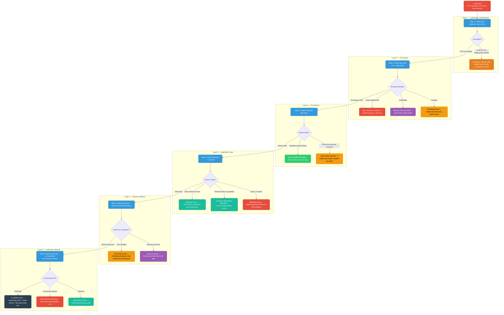
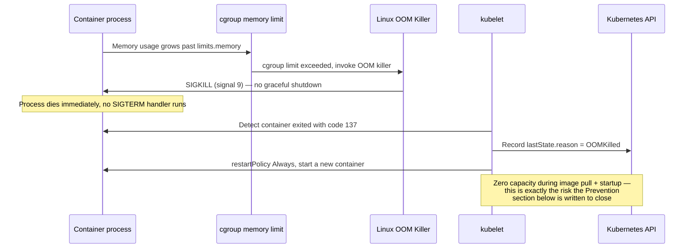
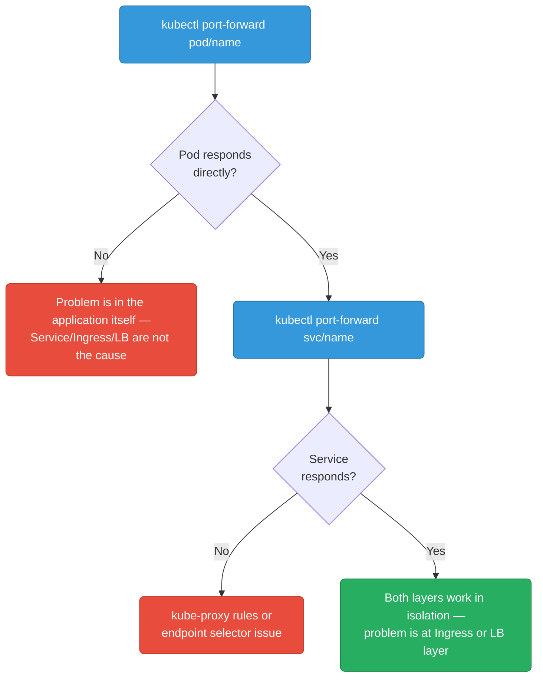
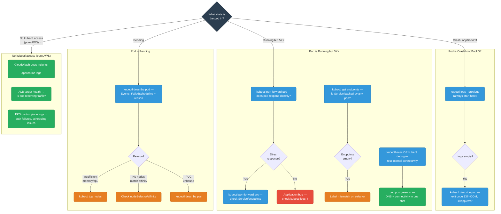

# SRE: Debugging & Recovery

<div class="quiz-progress" data-quiz-progress>
  <span class="quiz-progress-label">0/0 checks</span>
  <span class="quiz-progress-bar"><span class="quiz-progress-fill"></span></span>
</div>

---

## Debugging 5XX Errors — The SRE Way

When your application starts returning 5XX errors, there is a systematic investigation order. Jumping straight to application logs often wastes time — start from the outside (load balancer, pod status) and work inward.

### The Debugging Funnel



<div class="stepper">
  <div class="stepper-panels">
    <div class="stepper-panel active">
      <strong>1. Load balancer first.</strong> Check ALB/NLB metrics before touching anything in the cluster. If the LB shows 5XX but the target group itself is healthy, the problem is at the LB layer — listener rules, health check config, or an expired SSL cert — and nothing downstream matters yet.
    </div>
    <div class="stepper-panel">
      <strong>2. Pod status.</strong> <code>kubectl get pods -n ns -l app=name</code>. <code>CrashLoopBackOff</code> means the app is crashing on startup (go straight to <code>kubectl logs --previous</code>). <code>OOMKilled</code> means the memory limit was exceeded. <code>Pending</code> means a scheduling issue. Only if pods are Running but still serving 5XX do you move inward.
    </div>
    <div class="stepper-panel">
      <strong>3. Pod events.</strong> <code>kubectl describe pod name</code>. A failing readiness probe means the app is unhealthy internally — check its startup errors. Resource pressure warnings mean the node itself is under strain, not the app.
    </div>
    <div class="stepper-panel">
      <strong>4. Application logs.</strong> <code>kubectl logs pod -f --tail=200</code>. DB connection errors point at the database; upstream timeouts point at a degraded dependency; a panic or nil dereference is an application bug that needs a fix and redeploy — not a config change.
    </div>
    <div class="stepper-panel">
      <strong>5. Resource metrics.</strong> <code>kubectl top pods</code>, cross-checked against Prometheus/Grafana. CPU throttling causes slow responses and timeouts without ever triggering an OOM kill — it's a silent cause easy to miss if you only watch for OOMKilled events. Memory near the limit means you're about to OOM.
    </div>
    <div class="stepper-panel">
      <strong>6. Network — innermost layer.</strong> <code>kubectl exec pod -- curl upstream</code> and <code>nslookup service</code>. DNS failures point at CoreDNS; connection refused often means a NetworkPolicy is blocking the traffic; timeouts mean the upstream itself is slow. By the time you're here, every outer layer has already been ruled out.
    </div>
  </div>
  <div class="stepper-controls">
    <button class="stepper-prev">← Prev</button>
    <span class="stepper-dots"></span>
    <span class="stepper-label"></span>
    <button class="stepper-next">Next →</button>
  </div>
</div>

### kubectl Runbook

```bash
# --- Step 1: Pod overview ---
kubectl get pods -n <namespace> -l app=<name> -o wide
# Look for: STATUS (CrashLoopBackOff, OOMKilled, Pending), RESTARTS count, NODE assignment

# --- Step 2: Describe pod — most important first step ---
kubectl describe pod <pod-name> -n <namespace>
# Key sections to scan:
#   Events: at the bottom — "Back-off restarting failed container", "OOMKilled", "FailedScheduling"
#   Conditions: Ready=False, reason
#   Containers → State: Waiting/Running/Terminated, LastState: exit code

# Exit code reference:
#   137 = OOMKilled (128 + signal 9 SIGKILL)
#   1   = Application error / unhandled exception
#   2   = Misuse of shell command
#   143 = SIGTERM (graceful shutdown, 128 + signal 15)

# --- Step 3: Logs ---
kubectl logs <pod-name> -n <namespace> --tail=200
kubectl logs <pod-name> -n <namespace> --previous     # logs from last crashed container
kubectl logs <pod-name> -n <namespace> -c <container> # specific container in multi-container pod
kubectl logs -l app=<name> -n <namespace> --tail=50   # logs from ALL pods with this label

# --- Step 4: Resource consumption ---
kubectl top pods -n <namespace> --sort-by=memory
kubectl top nodes
kubectl describe node <node-name> | grep -A5 "Allocated resources"

# --- Step 5: Events (cluster-wide, sorted by time) ---
kubectl get events -n <namespace> --sort-by='.lastTimestamp'
kubectl get events -n <namespace> --field-selector reason=OOMKilling

# --- Step 6: Exec into pod for debugging ---
kubectl exec -it <pod-name> -n <namespace> -- sh
# Inside: curl, wget, nslookup, cat /proc/meminfo, env

# --- Step 7: Check endpoints (is service pointing to healthy pods?) ---
kubectl get endpoints <service-name> -n <namespace>
# If empty or missing IPs → pods not matching service selector, or pods not Ready

# --- Step 8: Port-forward to test pod directly (bypass LB/ingress) ---
kubectl port-forward pod/<pod-name> 8080:8080 -n <namespace>
curl -v localhost:8080/healthz
```

<div class="quiz-card">
  <p class="quiz-q">A container exits with code 143. Was it OOMKilled?</p>
  <button class="quiz-reveal">Reveal answer</button>
  <div class="quiz-a" hidden>No. Exit code 143 is 128 + signal 15 (SIGTERM) — a graceful shutdown request, not the kernel's OOM killer. OOMKilled is exit code 137 (128 + signal 9, SIGKILL) — no graceful shutdown at all. Mixing these up matters operationally: a 143 means your app got a chance to drain and shut down cleanly; a 137 means it was killed mid-request with zero warning.</div>
</div>

### Common 5XX Root Causes

| Symptom | Likely cause | Fix |
|---------|-------------|-----|
| `CrashLoopBackOff`, exit code 1 | App panics on startup — missing env var, bad config, failed DB migration | Check logs from previous container |
| `OOMKilled`, exit code 137 | Memory limit too low, or memory leak | Increase limit, profile heap, check for goroutine leaks |
| Readiness probe fails, pod not Ready | App takes too long to start, or /readyz endpoint broken | Tune `initialDelaySeconds`, fix readiness logic |
| All pods Running but 5XX | Upstream dependency down (DB, cache, external API) | Check dependency health, circuit breaker open? |
| 5XX only from some pods | Node-level issue (disk pressure, kernel bug) | `kubectl cordon <node>`, drain, investigate node |
| CPU throttling (`kubectl top` shows 100% but no OOM) | CPU limit too restrictive | Increase CPU limit, or remove limit entirely (requests only) |
| `Pending` pods | Insufficient cluster capacity, PodAffinity mismatch, PV stuck | Check events: `FailedScheduling`, check `kubectl describe pod` |

**Prevention:** Alert on SLO burn rate (not raw error count) so you're paged before users notice. Set `progressDeadlineSeconds` on all Deployments — failed rollouts self-report. Add a post-deploy smoke test in CI: `kubectl rollout status && curl /healthz`. Use `preStop: sleep 5` on all pods to prevent connection reset on rolling updates.

<div class="quiz-card">
  <p class="quiz-q">Why does this Prevention rule call for alerting on SLO burn rate rather than raw error count?</p>
  <button class="quiz-reveal">Reveal answer</button>
  <div class="quiz-a" hidden>A raw error-count threshold treats every service the same regardless of its traffic volume and its error budget, so it either pages too late for a high-traffic service (by the time raw errors cross a fixed number, users have already been affected for a while) or too often for a low-traffic one. Burn-rate alerting ties the threshold to how fast you're consuming your actual error budget, which is what lets you get paged <em>before</em> users notice instead of after.</div>
</div>

---

## Debugging 5XX Errors — EKS-Specific

When running on EKS, you have additional AWS-native tooling on top of the kubectl workflow above.

### AWS Load Balancer Controller — Target Group Health

The AWS Load Balancer Controller creates ALBs/NLBs in response to Ingress/Service objects. If pods are healthy but ALB returns 503, the target group may not have registered the pods yet (or the health check is misconfigured).

```bash
# Find the ALB created for your ingress
kubectl get ingress -n <namespace>
# ANNOTATION: kubernetes.io/ingress.class: alb shows it's managed by LBC

# Get the ALB ARN from the ingress status
kubectl describe ingress <name> -n <namespace>
# Look for: Address: <alb-dns-name>

# Check target group health via AWS CLI
aws elbv2 describe-target-health \
  --target-group-arn arn:aws:elasticloadbalancing:us-east-1:123:targetgroup/k8s-xxx/xxx \
  --region us-east-1
# Unhealthy targets show: State.Reason = "Target.FailedHealthChecks"

# Common cause: security group on the node/pod doesn't allow
# health check traffic from the ALB security group on the health check port
```

<div class="stepper">
  <div class="stepper-panels">
    <div class="stepper-panel active">
      <strong>1. Find the ALB.</strong> <code>kubectl get ingress -n namespace</code>. The <code>kubernetes.io/ingress.class: alb</code> annotation confirms this Ingress is managed by the AWS Load Balancer Controller, not a generic ingress-nginx setup.
    </div>
    <div class="stepper-panel">
      <strong>2. Get the ALB's address.</strong> <code>kubectl describe ingress name -n namespace</code> and read the <code>Address:</code> field — that's the ALB's DNS name, which you'll need to find the matching resource in the AWS console or CLI.
    </div>
    <div class="stepper-panel">
      <strong>3. Check target group health.</strong> <code>aws elbv2 describe-target-health --target-group-arn ...</code>. Unhealthy targets report <code>State.Reason = "Target.FailedHealthChecks"</code> — this confirms the pods themselves aren't the problem, the ALB just can't reach them on the health check path/port.
    </div>
    <div class="stepper-panel">
      <strong>4. Root-cause the failed health check.</strong> The most common cause: the security group on the node or pod doesn't allow traffic from the ALB's security group on the health check port. Pods can be perfectly healthy and still show as unhealthy targets if this one rule is missing.
    </div>
  </div>
  <div class="stepper-controls">
    <button class="stepper-prev">← Prev</button>
    <span class="stepper-dots"></span>
    <span class="stepper-label"></span>
    <button class="stepper-next">Next →</button>
  </div>
</div>

<div class="quiz-card">
  <p class="quiz-q">Target group health shows <code>State.Reason = "Target.FailedHealthChecks"</code>, but <code>kubectl get pods</code> shows every pod Running and passing its own readiness probe. What's the most common cause?</p>
  <button class="quiz-reveal">Reveal answer</button>
  <div class="quiz-a" hidden>A security group on the node or pod that doesn't allow health-check traffic from the ALB's security group on the health check port. The pod being internally healthy is irrelevant if the ALB's health-check packets never reach it in the first place — this is a network-layer problem, not an application-layer one, and Kubernetes-side health signals won't show it.</div>
</div>

### CloudWatch Container Insights

When Container Insights is enabled (via `aws-node` add-on or ADOT), metrics flow to CloudWatch:

```bash
# Query pod OOM events via CloudWatch Logs Insights
# Log group: /aws/containerinsights/<cluster>/performance

fields @timestamp, PodName, reason
| filter Type = "Pod" and reason = "OOMKilling"
| sort @timestamp desc
| limit 50
```

```bash
# Application logs from pods (if using Fluent Bit DaemonSet)
# Log group: /aws/containerinsights/<cluster>/application

fields @timestamp, kubernetes.pod_name, log
| filter kubernetes.namespace_name = "production"
| filter log like /ERROR|PANIC|fatal/
| sort @timestamp desc
| limit 100
```

### EKS Control Plane Logs for Debugging

```bash
# Scheduler logs — why is my pod Pending?
aws logs filter-log-events \
  --log-group-name /aws/eks/my-cluster/cluster \
  --log-stream-name-prefix kube-scheduler \
  --filter-pattern '"my-pod-name"' \
  --region us-east-1

# API Server audit log — who deleted/modified a resource?
aws logs filter-log-events \
  --log-group-name /aws/eks/my-cluster/cluster \
  --log-stream-name-prefix kube-apiserver-audit \
  --filter-pattern '{ $.requestURI = "/apis/apps/v1/namespaces/prod/deployments/my-app" }' \
  --region us-east-1

# Authenticator logs — auth failures (403, unauthorized)
aws logs filter-log-events \
  --log-group-name /aws/eks/my-cluster/cluster \
  --log-stream-name-prefix authenticator \
  --filter-pattern '"error"' \
  --region us-east-1
```

### X-Ray / AWS Distro for OpenTelemetry (ADOT)

If your app instruments with OpenTelemetry and sends traces to X-Ray via ADOT Collector:

```bash
# X-Ray service map shows 5XX at which service hop
aws xray get-service-graph \
  --start-time $(date -u -v-1H +%s) \
  --end-time $(date -u +%s) \
  --region us-east-1

# Get traces with 5XX status
aws xray get-trace-summaries \
  --start-time $(date -u -v-1H +%s) \
  --end-time $(date -u +%s) \
  --filter-expression 'responsetime > 5 AND http.status = 500' \
  --region us-east-1
```

Four AWS-native tools, four different jobs — pick based on what you're trying to answer:

<div class="tab-group">
  <div class="tab-buttons">
    <button data-tab="alb" class="active">ALB Target Group Health</button>
    <button data-tab="ci">CloudWatch Container Insights</button>
    <button data-tab="cp">EKS Control Plane Logs</button>
    <button data-tab="xray">X-Ray / ADOT</button>
  </div>
  <div class="tab-panels">
    <div class="tab-panel active" data-tab-panel="alb">
      Answers: "are my pods actually receiving traffic from the load balancer?" Checks target registration and health-check state at the AWS layer, outside Kubernetes entirely — catches the case where pods are Running and Ready but the ALB still thinks they're unhealthy.
    </div>
    <div class="tab-panel" data-tab-panel="ci">
      Answers: "what happened inside the cluster, in aggregate, over time?" Once enabled, ships pod-level metrics and OOM events (via <code>aws-node</code>/ADOT) and application logs (via Fluent Bit) into CloudWatch Logs Insights, queryable with the same syntax shown above.
    </div>
    <div class="tab-panel" data-tab-panel="cp">
      Answers: "why didn't the control plane do what I expected?" Scheduler logs explain <code>Pending</code> pods, the API server audit log answers "who changed this resource," and authenticator logs surface 403/unauthorized auth failures — none of this is visible from inside the cluster with kubectl alone.
    </div>
    <div class="tab-panel" data-tab-panel="xray">
      Answers: "which service hop in the request path actually returned the 5XX?" Requires the app to already be instrumented with OpenTelemetry and shipping to X-Ray via the ADOT Collector — the service map and trace summaries pinpoint the failing hop instead of you guessing from logs.
    </div>
  </div>
</div>

**Prevention:** Enable Container Insights from cluster creation, not after an incident. Set ALB `deregistration_delay` to 30s (default 300s causes slow deployments and lingering 502s). Use IRSA for all pod-level AWS API access — eliminates the `401 Unauthorized` class of 5XX. Enable X-Ray tracing before you need it; retrofitting is painful.

<div class="quiz-card">
  <p class="quiz-q">A pod calling S3 gets intermittent <code>401 Unauthorized</code> errors that show up as 5XX to callers. Per this section's Prevention rule, what eliminates this entire class of error?</p>
  <button class="quiz-reveal">Reveal answer</button>
  <div class="quiz-a" hidden>Using IRSA (IAM Roles for Service Accounts) for all pod-level AWS API access. IRSA gives each pod short-lived, automatically-rotated credentials scoped to a specific IAM role, instead of relying on static credentials or node-level instance roles that can go stale or be misconfigured — the Prevention rule calls this out specifically as eliminating the entire 401 Unauthorized class of 5XX, not just reducing its frequency.</div>
</div>

---

## OOM-Killed Recovery

### Why OOM Kill Happens

The Linux kernel's **OOM Killer** is invoked when a container exceeds its **memory limit** (cgroup memory limit set from `spec.containers[].resources.limits.memory`). The kernel sends `SIGKILL` (signal 9) to the process — not SIGTERM. There is no graceful shutdown. The process is immediately killed.

Kubernetes detects the exit code 137 (128 + 9) and records the reason as `OOMKilled` in the pod's `lastState`.



```
Containers:
  app:
    Last State: Terminated
      Reason:   OOMKilled
      Exit Code: 137
      Started:  Sat, 06 Jun 2026 10:00:00
      Finished: Sat, 06 Jun 2026 10:15:32
```

**Requests vs Limits for memory:**
- `requests.memory`: the amount the scheduler reserves on the node. Used for placement. Guaranteed to the container.
- `limits.memory`: the hard ceiling the kernel enforces. Exceeding this = OOMKill.
- Best practice: set requests = your p95 steady-state memory, limits = your p99.9 + buffer. Never set limits to 10x requests "just in case" — this causes node over-commitment and cascading OOM kills during memory pressure.

<div class="toggle-switch">
  <div class="toggle-buttons">
    <button data-toggle-opt="requests" class="active state-ok">requests.memory</button>
    <button data-toggle-opt="limits" class="state-bad">limits.memory</button>
  </div>
  <div class="toggle-panel active" data-toggle-panel="requests">
    What the <strong>scheduler</strong> reserves on the node when deciding where the pod can fit. Guaranteed to the container — the node won't over-subscribe this amount to other pods. Setting this too low doesn't cause an OOM kill by itself; it just means the scheduler may pack the node tighter than the pod's real steady-state usage warrants.
  </div>
  <div class="toggle-panel" data-toggle-panel="limits">
    The hard ceiling the <strong>kernel</strong> enforces via the cgroup. Exceeding it is what triggers the OOM killer and a <code>SIGKILL</code> — nothing graceful about it. This is the number that actually determines whether a memory spike becomes an outage.
  </div>
</div>

<div class="quiz-card">
  <p class="quiz-q">Someone sets <code>limits.memory</code> to 10x <code>requests.memory</code> "just in case," reasoning that a generous limit gives the app plenty of headroom before ever risking an OOM kill. What does this best-practice note say actually goes wrong?</p>
  <button class="quiz-reveal">Reveal answer</button>
  <div class="quiz-a" hidden>It causes node over-commitment: the scheduler places pods based on <code>requests</code>, so the node happily packs in far more pods than it could actually support if they all grew toward their generous <code>limits</code> at once. When several pods spike memory simultaneously, the node runs out of real memory and the kernel starts OOM-killing pods — potentially cascading across several pods on that node, not just the one that grew. The fix is realistic limits (p99.9 + buffer), not maximally generous ones.</div>
</div>

### Diagnosing the Memory Issue

```bash
# 1. Confirm OOM kill and see historical container memory usage
kubectl describe pod <pod-name>

# 2. Check current memory usage
kubectl top pods -n <namespace> --containers

# 3. If app is still running (not yet OOM killed), capture heap profile
# (requires pprof endpoint in the app)
kubectl port-forward pod/<pod-name> 6060:6060
go tool pprof http://localhost:6060/debug/pprof/heap
# In pprof: top20, list <func>, web (opens flame graph)

# 4. Check for goroutine leaks (goroutines hold stack memory)
curl http://localhost:6060/debug/pprof/goroutine?debug=2 | head -100
```

<div class="stepper">
  <div class="stepper-panels">
    <div class="stepper-panel active">
      <strong>1. Confirm the OOM kill.</strong> <code>kubectl describe pod pod-name</code> shows <code>lastState.reason = OOMKilled</code> and the historical container memory usage leading up to the kill — your starting evidence that this really was a memory limit, not something else.
    </div>
    <div class="stepper-panel">
      <strong>2. Check current memory usage.</strong> <code>kubectl top pods -n namespace --containers</code> shows whether the replacement container (or other pods in the same workload) are trending toward the same limit right now.
    </div>
    <div class="stepper-panel">
      <strong>3. Capture a heap profile, if the app is still running.</strong> Port-forward to a pprof endpoint and pull <code>/debug/pprof/heap</code> — <code>top20</code> and <code>list func</code> in the pprof shell point at exactly which allocations are dominating the heap.
    </div>
    <div class="stepper-panel">
      <strong>4. Check for goroutine leaks.</strong> Goroutines hold stack memory even when idle, so a leak here shows up as slow, steady memory growth rather than a sudden spike — <code>/debug/pprof/goroutine?debug=2</code> dumps every goroutine's stack so you can spot ones that never should have stayed alive.
    </div>
  </div>
  <div class="stepper-controls">
    <button class="stepper-prev">← Prev</button>
    <span class="stepper-dots"></span>
    <span class="stepper-label"></span>
    <button class="stepper-next">Next →</button>
  </div>
</div>

### Recovery: Singleton Pod

A **singleton** is a single-replica deployment — typically a controller, cron job, leader-elected worker, or stateful singleton service.

**The risk:** When OOM-killed, the pod restarts (kubelet's `restartPolicy: Always`). During the restart window (image pull + startup time), there is **zero capacity** serving requests. For a stateful singleton, in-flight operations are lost.

**Mitigation strategies:**

```yaml
apiVersion: apps/v1
kind: Deployment
metadata:
  name: my-singleton
spec:
  replicas: 1  # singleton
  template:
    spec:
      containers:
        - name: app
          image: my-org/my-app:v1
          resources:
            requests:
              memory: "256Mi"   # what the scheduler reserves
              cpu: "100m"
            limits:
              memory: "512Mi"   # OOM if exceeded — set realistically
              cpu: "500m"

          # Give the process time to finish in-flight work before SIGKILL
          lifecycle:
            preStop:
              exec:
                command: ["/bin/sh", "-c", "sleep 5"]  # drain connections

          # Readiness probe prevents traffic during restart
          readinessProbe:
            httpGet:
              path: /readyz
              port: 8080
            initialDelaySeconds: 5
            periodSeconds: 5
            failureThreshold: 3

      # Give the pod up to 30s to shutdown gracefully after SIGTERM
      terminationGracePeriodSeconds: 30
```

**For a true singleton, also consider Vertical Pod Autoscaler (VPA)** to automatically right-size memory based on historical usage:

```yaml
apiVersion: autoscaling.k8s.io/v1
kind: VerticalPodAutoscaler
metadata:
  name: my-singleton-vpa
spec:
  targetRef:
    apiVersion: apps/v1
    kind: Deployment
    name: my-singleton
  updatePolicy:
    updateMode: "Auto"   # or "Off" to just see recommendations without applying
  resourcePolicy:
    containerPolicies:
      - containerName: app
        minAllowed:
          memory: "128Mi"
        maxAllowed:
          memory: "2Gi"
```

<div class="quiz-card">
  <p class="quiz-q">In the singleton mitigation manifest, the pod has both a <code>preStop</code> hook and a <code>readinessProbe</code>. During an OOM kill specifically, which of these two actually gets a chance to run, and why does the other one matter anyway?</p>
  <button class="quiz-reveal">Reveal answer</button>
  <div class="quiz-a" hidden>Neither <code>preStop</code> nor graceful shutdown logic runs during an OOM kill — the kernel sends <code>SIGKILL</code> directly, with no warning and no lifecycle hook invoked. <code>preStop</code> only helps during voluntary terminations (rolling updates, node drains, scale-downs), not an OOM kill. The <code>readinessProbe</code> is what actually matters here: after the pod restarts, it keeps the pod out of Service endpoints until <code>/readyz</code> passes, so the restart window's zero capacity doesn't turn into requests being routed to a not-yet-ready container.</div>
</div>

### Recovery: Distributed/Replicated Pod

A **distributed** workload runs `replicas: N > 1`. When one pod OOM-kills, others continue serving. The key is ensuring:
1. **Enough replicas** so one death doesn't cause capacity collapse
2. **PodDisruptionBudget** so rolling restarts/node drains don't kill too many at once
3. **Anti-affinity** so replicas aren't all on the same node

```yaml
apiVersion: apps/v1
kind: Deployment
metadata:
  name: my-service
spec:
  replicas: 3
  strategy:
    type: RollingUpdate
    rollingUpdate:
      maxUnavailable: 1   # at most 1 pod down during update/restart
      maxSurge: 1
  template:
    spec:
      # Spread pods across nodes — don't put all replicas on same node
      affinity:
        podAntiAffinity:
          preferredDuringSchedulingIgnoredDuringExecution:
            - weight: 100
              podAffinityTerm:
                labelSelector:
                  matchLabels:
                    app: my-service
                topologyKey: kubernetes.io/hostname

      containers:
        - name: app
          resources:
            requests:
              memory: "256Mi"
              cpu: "200m"
            limits:
              memory: "512Mi"
              cpu: "1000m"
---
# PodDisruptionBudget — prevent too many simultaneous disruptions
# (node drains, rolling deployments, voluntary disruptions)
apiVersion: policy/v1
kind: PodDisruptionBudget
metadata:
  name: my-service-pdb
spec:
  selector:
    matchLabels:
      app: my-service
  minAvailable: 2   # always keep at least 2 pods running
  # OR: maxUnavailable: 1
```

**With PDB in place:** When a node is drained (for upgrade, scaling down), the drain will block if removing a pod would violate `minAvailable`. The node drain waits until a replacement pod is healthy before proceeding. This prevents rolling OOM-kills from cascading into a full outage.

**Prevention:** Set memory `requests == limits` (Guaranteed QoS) for critical services — prevents the OOM killer from targeting them during node pressure. Set `GOMEMLIMIT` in Go services to ~90% of the K8s limit so GC reclaims memory before the kernel kills the process. Use VPA in `Off` mode first to get right-sizing recommendations before enabling `Auto`. Alert on `container_memory_working_set_bytes / container_spec_memory_limit_bytes > 0.85`.

<div class="quiz-card">
  <p class="quiz-q">A node is under memory pressure and the kubelet has to evict something. Why does setting <code>requests == limits</code> (Guaranteed QoS) protect a critical pod from being the one chosen?</p>
  <button class="quiz-reveal">Reveal answer</button>
  <div class="quiz-a" hidden>Kubernetes assigns each pod a QoS class based on how requests and limits compare: Guaranteed (requests == limits on every resource, every container), Burstable (requests set but less than limits), or BestEffort (no requests/limits at all). Under node memory pressure, the kubelet evicts BestEffort pods first, then Burstable pods, and only reaches Guaranteed pods last. Setting requests == limits for a critical service moves it into the class that's evicted last — separate from, and in addition to, whatever GOMEMLIMIT does inside the Go runtime itself to reclaim memory before the kernel's OOM killer ever gets invoked.</div>
</div>

---


---

## Debugging Services Without SSH or SSM Access

In production EKS/GKE environments you often have no direct shell access to nodes. This is the full toolkit ordered from least to most invasive.

<div class="stepper">
  <div class="stepper-panels">
    <div class="stepper-panel active">
      <strong>Layer 1 — kubectl, no exec required.</strong> Pod state, events, logs (current and <code>--previous</code>), endpoint health, and the namespace-wide events timeline. This alone answers most "why is this pod broken" questions without touching a shell at all.
    </div>
    <div class="stepper-panel">
      <strong>Layer 2 — Port-forward to isolate the problem.</strong> Bypasses the entire LB → Ingress → Service → kube-proxy chain to test the pod (or the Service) directly. Still zero exec required — just a local TCP tunnel.
    </div>
    <div class="stepper-panel">
      <strong>Layer 3 — Ephemeral debug containers (K8s 1.23+).</strong> First real "shell-like" access: inject a debug container into a running pod, sharing its namespaces without modifying or restarting the original container. Requires the target pod to actually be running.
    </div>
    <div class="stepper-panel">
      <strong>Layer 4 — Temporary debug pod, same namespace.</strong> For when the target pod is CrashLoopBackOff and there's no running container to attach to. Runs netshoot as its own throwaway pod alongside the broken service instead of inside it.
    </div>
    <div class="stepper-panel">
      <strong>Layer 5 — Privileged DaemonSet-style debug pod.</strong> For node-level problems (disk pressure, kernel issue, iptables corruption) — schedules a privileged pod onto the specific node with <code>hostPID</code>/<code>hostNetwork</code> and a chroot into the host filesystem. The most invasive kubectl-based option.
    </div>
    <div class="stepper-panel">
      <strong>Layer 6 — AWS-specific tooling.</strong> When even <code>kubectl</code> access is unavailable: CloudWatch Logs Insights for application logs, ALB target health for traffic-layer visibility, EKS control plane logs for scheduler/auth/audit questions, and X-Ray for end-to-end trace visibility.
    </div>
  </div>
  <div class="stepper-controls">
    <button class="stepper-prev">← Prev</button>
    <span class="stepper-dots"></span>
    <span class="stepper-label"></span>
    <button class="stepper-next">Next →</button>
  </div>
</div>

### Layer 1 — kubectl (no exec required)

```bash
# Pod state and events — always start here
kubectl get pods -n <ns> -l app=<name> -o wide
kubectl describe pod <pod> -n <ns>
# Read the Events section at the bottom first:
# "Back-off restarting failed container" → CrashLoopBackOff with logs available
# "OOMKilling"                           → memory limit hit
# "Liveness probe failed"                → readiness/liveness misconfigured
# "FailedScheduling"                     → no node can fit the pod

# Logs — current and previous container
kubectl logs <pod> -n <ns> --tail=200 -f
kubectl logs <pod> -n <ns> --previous        # last crashed container's logs
kubectl logs -l app=<name> -n <ns> --tail=50  # all pods in selector simultaneously

# Is the Service actually backed by healthy pods?
kubectl get endpoints <svc-name> -n <ns>
# Empty = pods not matching selector labels OR no pods in Ready state

# Events timeline across namespace
kubectl get events -n <ns> --sort-by='.lastTimestamp' | tail -30
```

### Layer 2 — Port-forward to isolate the problem

Port-forward bypasses the entire LB → Ingress → Service → kube-proxy chain. Use it to test the pod in isolation:

```bash
# Test pod directly (eliminates LB, Ingress, Service, kube-proxy as suspects)
kubectl port-forward pod/<pod-name> 8080:8080 -n <ns>
curl -v localhost:8080/healthz

# Test via Service (validates kube-proxy rules and endpoint selection)
kubectl port-forward svc/<svc-name> 8080:80 -n <ns>
curl -v localhost:8080/healthz

# Decision tree:
# pod PF works + svc PF works → problem is at Ingress or LB layer
# pod PF works + svc PF fails → kube-proxy or endpoint selector issue
# pod PF fails               → problem is in the application itself
```



### Layer 3 — Ephemeral debug containers (K8s 1.23+)

Inject a debug container into a running pod. It shares the pod's namespaces without modifying the original container or requiring a pod restart:

```bash
# Inject busybox into a running pod
kubectl debug -it <pod> -n <ns> \
  --image=busybox:latest \
  --target=<container-name>

# Inject netshoot (full network tools)
kubectl debug -it <pod> -n <ns> \
  --image=nicolaka/netshoot \
  --target=<container-name>
# Now you can: curl, tcpdump, ss, nslookup, traceroute, iperf3

# The --target flag shares the target container's process namespace
# so you can see the app's processes and file descriptors

# Ephemeral containers are not restarted and cannot be removed until pod dies
kubectl describe pod <pod> -n <ns>   # shows ephemeral containers section
```

### Layer 4 — Temporary debug pod in the same namespace

When you need network tools but the target pod is CrashLoopBackOff (no exec possible):

```bash
# Run netshoot as a temporary pod in the problem namespace
kubectl run debug-pod --rm -it \
  --image=nicolaka/netshoot \
  --restart=Never \
  -n <ns> \
  -- bash

# Now inside netshoot — same namespace as the broken service:
# DNS resolution
nslookup payments-svc.payments.svc.cluster.local
nslookup payments-svc   # short name, relies on search domains

# Connectivity test
curl -v http://payments-svc:8080/healthz
curl -v http://10.96.45.20:8080/healthz   # direct ClusterIP (bypasses DNS)

# Port scan (is the app even listening?)
nc -zv payments-svc 8080

# Trace route to pod (shows where packets are dropped)
traceroute payments-svc

# Capture traffic (if you know which pod IP)
tcpdump -i eth0 host <pod-ip> and port 8080
```

<div class="toggle-switch">
  <div class="toggle-buttons">
    <button data-toggle-opt="ephemeral" class="active state-ok">Ephemeral container (Layer 3)</button>
    <button data-toggle-opt="tempPod" class="state-warn">Temporary debug pod (Layer 4)</button>
  </div>
  <div class="toggle-panel active" data-toggle-panel="ephemeral">
    Injected directly into a <strong>running</strong> pod, sharing its namespaces without modifying or restarting the original container. Requires there to be a live container to attach to — no help if the pod is stuck in <code>CrashLoopBackOff</code>. One-way door: ephemeral containers are never restarted and can't be removed until the pod itself dies.
  </div>
  <div class="toggle-panel" data-toggle-panel="tempPod">
    A brand-new, disposable pod (usually netshoot) run in the <strong>same namespace</strong> as the broken service — not attached to it at all. Works even when the target pod is <code>CrashLoopBackOff</code> and has nothing running to attach to, because it doesn't depend on the broken pod having a live container. Gives full network tooling (DNS, connectivity, port scan, packet capture) from the same network vantage point as the broken service.
  </div>
</div>

<div class="quiz-card">
  <p class="quiz-q">A pod is stuck in <code>CrashLoopBackOff</code> and you need netshoot's tooling to debug DNS and connectivity. Why won't <code>kubectl debug --target</code> (the ephemeral container approach) work here, and what's the alternative?</p>
  <button class="quiz-reveal">Reveal answer</button>
  <div class="quiz-a" hidden>An ephemeral debug container attaches to and shares the namespaces of an existing, running container in the target pod — but a <code>CrashLoopBackOff</code> pod has no live container to attach to, since it's repeatedly starting and immediately dying. The alternative is Layer 4: run netshoot as its own standalone pod (<code>kubectl run debug-pod --image=nicolaka/netshoot ...</code>) in the same namespace. It's not attached to the broken pod at all, so it doesn't need the broken pod to be running — it just needs to sit in the same namespace to reach the same Services and test DNS/connectivity from a comparable vantage point.</div>
</div>

### Layer 5 — Debug a node problem (via privileged DaemonSet)

When the issue is at the node level (disk pressure, kernel issue, iptables corruption) and you have no SSH:

```bash
# Create a privileged pod on a specific node
kubectl run node-debug \
  --image=busybox \
  --restart=Never \
  --rm -it \
  --overrides='{
    "spec": {
      "nodeName": "<node-name>",
      "hostPID": true,
      "hostNetwork": true,
      "containers": [{
        "name": "node-debug",
        "image": "busybox",
        "stdin": true,
        "tty": true,
        "securityContext": {"privileged": true},
        "volumeMounts": [{"name": "host-root","mountPath": "/host"}]
      }],
      "volumes": [{"name": "host-root","hostPath": {"path": "/"}}]
    }
  }' -- sh

# Inside: chroot to host filesystem
chroot /host bash
# Now you have full access to the node's filesystem and processes
# Check iptables, ss, top, dmesg, journalctl
iptables -t nat -L KUBE-SERVICES | head -50
ss -tlnp
journalctl -u kubelet --tail=100
```

### Layer 6 — AWS-specific (CloudWatch, X-Ray)

```bash
# Search application logs via CloudWatch Logs Insights
# (assumes Fluent Bit DaemonSet shipping to CloudWatch Container Insights)
aws logs start-query \
  --log-group-name /aws/containerinsights/<cluster>/application \
  --start-time $(date -u -v-1H +%s) \
  --end-time $(date -u +%s) \
  --query-string '
    fields @timestamp, kubernetes.pod_name, log
    | filter kubernetes.namespace_name = "payments"
    | filter log like /ERROR|PANIC|fatal/
    | sort @timestamp desc
    | limit 50
  '
# Get query ID from response, then:
aws logs get-query-results --query-id <id>

# ALB target health (why are targets unhealthy?)
aws elbv2 describe-target-health \
  --target-group-arn <arn> --region <region>
# "Reason": "Target.FailedHealthChecks" = app not responding on health check port
# "Reason": "Target.DeregistrationInProgress" = pod draining

# EKS control plane logs (scheduler, authenticator, API server)
# Enable first: EKS Console → Cluster → Logging → enable scheduler + api
aws logs filter-log-events \
  --log-group-name /aws/eks/<cluster>/cluster \
  --log-stream-name-prefix kube-scheduler \
  --filter-pattern '"<pod-name>"'

aws logs filter-log-events \
  --log-group-name /aws/eks/<cluster>/cluster \
  --log-stream-name-prefix authenticator \
  --filter-pattern '"Unauthorized"'

# X-Ray — trace 5XX errors end-to-end
aws xray get-trace-summaries \
  --start-time $(date -u -v-1H +%s) \
  --end-time $(date -u +%s) \
  --filter-expression 'http.status = 500' \
  --region <region>
```

### Decision tree — which tool to use



### Useful netshoot commands cheatsheet

```bash
# DNS
nslookup svc-name.namespace.svc.cluster.local
dig svc-name.namespace.svc.cluster.local
# Check /etc/resolv.conf for search domains
cat /etc/resolv.conf

# Connectivity
curl -sv http://svc:port/path 2>&1 | head -50
nc -zv svc-name port               # TCP reachability without curl
wget -qO- http://svc:port/healthz

# Network state
ss -tlnp                           # listening ports inside pod
ss -tnp state established          # active connections

# Packet capture
tcpdump -i eth0 -nn port 8080 -w /tmp/capture.pcap
tcpdump -i eth0 -nn 'host 10.0.1.5'

# Routing
ip route show
ip addr

# TLS
openssl s_client -connect svc:443 -servername hostname
curl -kv https://svc:443/          # ignore cert errors
```

<div class="quiz-card">
  <p class="quiz-q">From inside netshoot, <code>curl -v http://payments-svc:8080/healthz</code> hangs, but <code>curl -v http://10.96.45.20:8080/healthz</code> (the same Service's ClusterIP) responds instantly. What does that split result isolate?</p>
  <button class="quiz-reveal">Reveal answer</button>
  <div class="quiz-a" hidden>It isolates the problem to DNS resolution, not connectivity. Hitting the ClusterIP directly bypasses name resolution entirely — if that works while the DNS name doesn't, the Service, its endpoints, and the network path between pods are all fine; the failure is specifically in resolving <code>payments-svc</code> to that IP, which points at CoreDNS or <code>/etc/resolv.conf</code>'s search domains rather than at the application or the network.</div>
</div>
