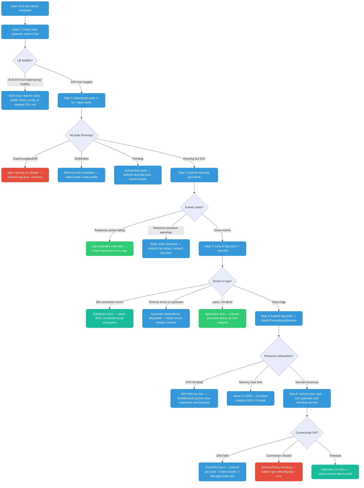

# SRE: Debugging & Recovery

---

## Debugging 5XX Errors — The SRE Way

When your application starts returning 5XX errors, there is a systematic investigation order. Jumping straight to application logs often wastes time — start from the outside (load balancer, pod status) and work inward.

### The Debugging Funnel



### kubectl Runbook

```bash
# --- Step 1: Pod overview ---
kubectl get pods -n <namespace> -l app=<name> -o wide
# Look for: STATUS (CrashLoopBackOff, OOMKilled, Pending), RESTARTS count, NODE assignment

# --- Step 2: Describe pod — most important first step ---
kubectl describe pod <pod-name> -n <namespace>
# Key sections to scan:
#   Events: at the bottom — "Back-off restarting failed container", "OOMKilled", "FailedScheduling"
#   Conditions: Ready=False, reason
#   Containers → State: Waiting/Running/Terminated, LastState: exit code

# Exit code reference:
#   137 = OOMKilled (128 + signal 9 SIGKILL)
#   1   = Application error / unhandled exception
#   2   = Misuse of shell command
#   143 = SIGTERM (graceful shutdown, 128 + signal 15)

# --- Step 3: Logs ---
kubectl logs <pod-name> -n <namespace> --tail=200
kubectl logs <pod-name> -n <namespace> --previous     # logs from last crashed container
kubectl logs <pod-name> -n <namespace> -c <container> # specific container in multi-container pod
kubectl logs -l app=<name> -n <namespace> --tail=50   # logs from ALL pods with this label

# --- Step 4: Resource consumption ---
kubectl top pods -n <namespace> --sort-by=memory
kubectl top nodes
kubectl describe node <node-name> | grep -A5 "Allocated resources"

# --- Step 5: Events (cluster-wide, sorted by time) ---
kubectl get events -n <namespace> --sort-by='.lastTimestamp'
kubectl get events -n <namespace> --field-selector reason=OOMKilling

# --- Step 6: Exec into pod for debugging ---
kubectl exec -it <pod-name> -n <namespace> -- sh
# Inside: curl, wget, nslookup, cat /proc/meminfo, env

# --- Step 7: Check endpoints (is service pointing to healthy pods?) ---
kubectl get endpoints <service-name> -n <namespace>
# If empty or missing IPs → pods not matching service selector, or pods not Ready

# --- Step 8: Port-forward to test pod directly (bypass LB/ingress) ---
kubectl port-forward pod/<pod-name> 8080:8080 -n <namespace>
curl -v localhost:8080/healthz
```

### Common 5XX Root Causes

| Symptom | Likely cause | Fix |
|---------|-------------|-----|
| `CrashLoopBackOff`, exit code 1 | App panics on startup — missing env var, bad config, failed DB migration | Check logs from previous container |
| `OOMKilled`, exit code 137 | Memory limit too low, or memory leak | Increase limit, profile heap, check for goroutine leaks |
| Readiness probe fails, pod not Ready | App takes too long to start, or /readyz endpoint broken | Tune `initialDelaySeconds`, fix readiness logic |
| All pods Running but 5XX | Upstream dependency down (DB, cache, external API) | Check dependency health, circuit breaker open? |
| 5XX only from some pods | Node-level issue (disk pressure, kernel bug) | `kubectl cordon <node>`, drain, investigate node |
| CPU throttling (`kubectl top` shows 100% but no OOM) | CPU limit too restrictive | Increase CPU limit, or remove limit entirely (requests only) |
| `Pending` pods | Insufficient cluster capacity, PodAffinity mismatch, PV stuck | Check events: `FailedScheduling`, check `kubectl describe pod` |

**Prevention:** Alert on SLO burn rate (not raw error count) so you're paged before users notice. Set `progressDeadlineSeconds` on all Deployments — failed rollouts self-report. Add a post-deploy smoke test in CI: `kubectl rollout status && curl /healthz`. Use `preStop: sleep 5` on all pods to prevent connection reset on rolling updates.

---

## Debugging 5XX Errors — EKS-Specific

When running on EKS, you have additional AWS-native tooling on top of the kubectl workflow above.

### AWS Load Balancer Controller — Target Group Health

The AWS Load Balancer Controller creates ALBs/NLBs in response to Ingress/Service objects. If pods are healthy but ALB returns 503, the target group may not have registered the pods yet (or the health check is misconfigured).

```bash
# Find the ALB created for your ingress
kubectl get ingress -n <namespace>
# ANNOTATION: kubernetes.io/ingress.class: alb shows it's managed by LBC

# Get the ALB ARN from the ingress status
kubectl describe ingress <name> -n <namespace>
# Look for: Address: <alb-dns-name>

# Check target group health via AWS CLI
aws elbv2 describe-target-health \
  --target-group-arn arn:aws:elasticloadbalancing:us-east-1:123:targetgroup/k8s-xxx/xxx \
  --region us-east-1
# Unhealthy targets show: State.Reason = "Target.FailedHealthChecks"

# Common cause: security group on the node/pod doesn't allow
# health check traffic from the ALB security group on the health check port
```

### CloudWatch Container Insights

When Container Insights is enabled (via `aws-node` add-on or ADOT), metrics flow to CloudWatch:

```bash
# Query pod OOM events via CloudWatch Logs Insights
# Log group: /aws/containerinsights/<cluster>/performance

fields @timestamp, PodName, reason
| filter Type = "Pod" and reason = "OOMKilling"
| sort @timestamp desc
| limit 50
```

```bash
# Application logs from pods (if using Fluent Bit DaemonSet)
# Log group: /aws/containerinsights/<cluster>/application

fields @timestamp, kubernetes.pod_name, log
| filter kubernetes.namespace_name = "production"
| filter log like /ERROR|PANIC|fatal/
| sort @timestamp desc
| limit 100
```

### EKS Control Plane Logs for Debugging

```bash
# Scheduler logs — why is my pod Pending?
aws logs filter-log-events \
  --log-group-name /aws/eks/my-cluster/cluster \
  --log-stream-name-prefix kube-scheduler \
  --filter-pattern '"my-pod-name"' \
  --region us-east-1

# API Server audit log — who deleted/modified a resource?
aws logs filter-log-events \
  --log-group-name /aws/eks/my-cluster/cluster \
  --log-stream-name-prefix kube-apiserver-audit \
  --filter-pattern '{ $.requestURI = "/apis/apps/v1/namespaces/prod/deployments/my-app" }' \
  --region us-east-1

# Authenticator logs — auth failures (403, unauthorized)
aws logs filter-log-events \
  --log-group-name /aws/eks/my-cluster/cluster \
  --log-stream-name-prefix authenticator \
  --filter-pattern '"error"' \
  --region us-east-1
```

### X-Ray / AWS Distro for OpenTelemetry (ADOT)

If your app instruments with OpenTelemetry and sends traces to X-Ray via ADOT Collector:

```bash
# X-Ray service map shows 5XX at which service hop
aws xray get-service-graph \
  --start-time $(date -u -v-1H +%s) \
  --end-time $(date -u +%s) \
  --region us-east-1

# Get traces with 5XX status
aws xray get-trace-summaries \
  --start-time $(date -u -v-1H +%s) \
  --end-time $(date -u +%s) \
  --filter-expression 'responsetime > 5 AND http.status = 500' \
  --region us-east-1
```

**Prevention:** Enable Container Insights from cluster creation, not after an incident. Set ALB `deregistration_delay` to 30s (default 300s causes slow deployments and lingering 502s). Use IRSA for all pod-level AWS API access — eliminates the `401 Unauthorized` class of 5XX. Enable X-Ray tracing before you need it; retrofitting is painful.

---

## OOM-Killed Recovery

### Why OOM Kill Happens

The Linux kernel's **OOM Killer** is invoked when a container exceeds its **memory limit** (cgroup memory limit set from `spec.containers[].resources.limits.memory`). The kernel sends `SIGKILL` (signal 9) to the process — not SIGTERM. There is no graceful shutdown. The process is immediately killed.

Kubernetes detects the exit code 137 (128 + 9) and records the reason as `OOMKilled` in the pod's `lastState`.

```
Containers:
  app:
    Last State: Terminated
      Reason:   OOMKilled
      Exit Code: 137
      Started:  Sat, 06 Jun 2026 10:00:00
      Finished: Sat, 06 Jun 2026 10:15:32
```

**Requests vs Limits for memory:**
- `requests.memory`: the amount the scheduler reserves on the node. Used for placement. Guaranteed to the container.
- `limits.memory`: the hard ceiling the kernel enforces. Exceeding this = OOMKill.
- Best practice: set requests = your p95 steady-state memory, limits = your p99.9 + buffer. Never set limits to 10x requests "just in case" — this causes node over-commitment and cascading OOM kills during memory pressure.

### Diagnosing the Memory Issue

```bash
# 1. Confirm OOM kill and see historical container memory usage
kubectl describe pod <pod-name>

# 2. Check current memory usage
kubectl top pods -n <namespace> --containers

# 3. If app is still running (not yet OOM killed), capture heap profile
# (requires pprof endpoint in the app)
kubectl port-forward pod/<pod-name> 6060:6060
go tool pprof http://localhost:6060/debug/pprof/heap
# In pprof: top20, list <func>, web (opens flame graph)

# 4. Check for goroutine leaks (goroutines hold stack memory)
curl http://localhost:6060/debug/pprof/goroutine?debug=2 | head -100
```

### Recovery: Singleton Pod

A **singleton** is a single-replica deployment — typically a controller, cron job, leader-elected worker, or stateful singleton service.

**The risk:** When OOM-killed, the pod restarts (kubelet's `restartPolicy: Always`). During the restart window (image pull + startup time), there is **zero capacity** serving requests. For a stateful singleton, in-flight operations are lost.

**Mitigation strategies:**

```yaml
apiVersion: apps/v1
kind: Deployment
metadata:
  name: my-singleton
spec:
  replicas: 1  # singleton
  template:
    spec:
      containers:
        - name: app
          image: my-org/my-app:v1
          resources:
            requests:
              memory: "256Mi"   # what the scheduler reserves
              cpu: "100m"
            limits:
              memory: "512Mi"   # OOM if exceeded — set realistically
              cpu: "500m"

          # Give the process time to finish in-flight work before SIGKILL
          lifecycle:
            preStop:
              exec:
                command: ["/bin/sh", "-c", "sleep 5"]  # drain connections

          # Readiness probe prevents traffic during restart
          readinessProbe:
            httpGet:
              path: /readyz
              port: 8080
            initialDelaySeconds: 5
            periodSeconds: 5
            failureThreshold: 3

      # Give the pod up to 30s to shutdown gracefully after SIGTERM
      terminationGracePeriodSeconds: 30
```

**For a true singleton, also consider Vertical Pod Autoscaler (VPA)** to automatically right-size memory based on historical usage:

```yaml
apiVersion: autoscaling.k8s.io/v1
kind: VerticalPodAutoscaler
metadata:
  name: my-singleton-vpa
spec:
  targetRef:
    apiVersion: apps/v1
    kind: Deployment
    name: my-singleton
  updatePolicy:
    updateMode: "Auto"   # or "Off" to just see recommendations without applying
  resourcePolicy:
    containerPolicies:
      - containerName: app
        minAllowed:
          memory: "128Mi"
        maxAllowed:
          memory: "2Gi"
```

### Recovery: Distributed/Replicated Pod

A **distributed** workload runs `replicas: N > 1`. When one pod OOM-kills, others continue serving. The key is ensuring:
1. **Enough replicas** so one death doesn't cause capacity collapse
2. **PodDisruptionBudget** so rolling restarts/node drains don't kill too many at once
3. **Anti-affinity** so replicas aren't all on the same node

```yaml
apiVersion: apps/v1
kind: Deployment
metadata:
  name: my-service
spec:
  replicas: 3
  strategy:
    type: RollingUpdate
    rollingUpdate:
      maxUnavailable: 1   # at most 1 pod down during update/restart
      maxSurge: 1
  template:
    spec:
      # Spread pods across nodes — don't put all replicas on same node
      affinity:
        podAntiAffinity:
          preferredDuringSchedulingIgnoredDuringExecution:
            - weight: 100
              podAffinityTerm:
                labelSelector:
                  matchLabels:
                    app: my-service
                topologyKey: kubernetes.io/hostname

      containers:
        - name: app
          resources:
            requests:
              memory: "256Mi"
              cpu: "200m"
            limits:
              memory: "512Mi"
              cpu: "1000m"
---
# PodDisruptionBudget — prevent too many simultaneous disruptions
# (node drains, rolling deployments, voluntary disruptions)
apiVersion: policy/v1
kind: PodDisruptionBudget
metadata:
  name: my-service-pdb
spec:
  selector:
    matchLabels:
      app: my-service
  minAvailable: 2   # always keep at least 2 pods running
  # OR: maxUnavailable: 1
```

**With PDB in place:** When a node is drained (for upgrade, scaling down), the drain will block if removing a pod would violate `minAvailable`. The node drain waits until a replacement pod is healthy before proceeding. This prevents rolling OOM-kills from cascading into a full outage.

**Prevention:** Set memory `requests == limits` (Guaranteed QoS) for critical services — prevents the OOM killer from targeting them during node pressure. Set `GOMEMLIMIT` in Go services to ~90% of the K8s limit so GC reclaims memory before the kernel kills the process. Use VPA in `Off` mode first to get right-sizing recommendations before enabling `Auto`. Alert on `container_memory_working_set_bytes / container_spec_memory_limit_bytes > 0.85`.

---


---

## Debugging Services Without SSH or SSM Access

In production EKS/GKE environments you often have no direct shell access to nodes. This is the full toolkit ordered from least to most invasive.

### Layer 1 — kubectl (no exec required)

```bash
# Pod state and events — always start here
kubectl get pods -n <ns> -l app=<name> -o wide
kubectl describe pod <pod> -n <ns>
# Read the Events section at the bottom first:
# "Back-off restarting failed container" → CrashLoopBackOff with logs available
# "OOMKilling"                           → memory limit hit
# "Liveness probe failed"                → readiness/liveness misconfigured
# "FailedScheduling"                     → no node can fit the pod

# Logs — current and previous container
kubectl logs <pod> -n <ns> --tail=200 -f
kubectl logs <pod> -n <ns> --previous        # last crashed container's logs
kubectl logs -l app=<name> -n <ns> --tail=50  # all pods in selector simultaneously

# Is the Service actually backed by healthy pods?
kubectl get endpoints <svc-name> -n <ns>
# Empty = pods not matching selector labels OR no pods in Ready state

# Events timeline across namespace
kubectl get events -n <ns> --sort-by='.lastTimestamp' | tail -30
```

### Layer 2 — Port-forward to isolate the problem

Port-forward bypasses the entire LB → Ingress → Service → kube-proxy chain. Use it to test the pod in isolation:

```bash
# Test pod directly (eliminates LB, Ingress, Service, kube-proxy as suspects)
kubectl port-forward pod/<pod-name> 8080:8080 -n <ns>
curl -v localhost:8080/healthz

# Test via Service (validates kube-proxy rules and endpoint selection)
kubectl port-forward svc/<svc-name> 8080:80 -n <ns>
curl -v localhost:8080/healthz

# Decision tree:
# pod PF works + svc PF works → problem is at Ingress or LB layer
# pod PF works + svc PF fails → kube-proxy or endpoint selector issue
# pod PF fails               → problem is in the application itself
```

### Layer 3 — Ephemeral debug containers (K8s 1.23+)

Inject a debug container into a running pod. It shares the pod's namespaces without modifying the original container or requiring a pod restart:

```bash
# Inject busybox into a running pod
kubectl debug -it <pod> -n <ns> \
  --image=busybox:latest \
  --target=<container-name>

# Inject netshoot (full network tools)
kubectl debug -it <pod> -n <ns> \
  --image=nicolaka/netshoot \
  --target=<container-name>
# Now you can: curl, tcpdump, ss, nslookup, traceroute, iperf3

# The --target flag shares the target container's process namespace
# so you can see the app's processes and file descriptors

# Ephemeral containers are not restarted and cannot be removed until pod dies
kubectl describe pod <pod> -n <ns>   # shows ephemeral containers section
```

### Layer 4 — Temporary debug pod in the same namespace

When you need network tools but the target pod is CrashLoopBackOff (no exec possible):

```bash
# Run netshoot as a temporary pod in the problem namespace
kubectl run debug-pod --rm -it \
  --image=nicolaka/netshoot \
  --restart=Never \
  -n <ns> \
  -- bash

# Now inside netshoot — same namespace as the broken service:
# DNS resolution
nslookup payments-svc.payments.svc.cluster.local
nslookup payments-svc   # short name, relies on search domains

# Connectivity test
curl -v http://payments-svc:8080/healthz
curl -v http://10.96.45.20:8080/healthz   # direct ClusterIP (bypasses DNS)

# Port scan (is the app even listening?)
nc -zv payments-svc 8080

# Trace route to pod (shows where packets are dropped)
traceroute payments-svc

# Capture traffic (if you know which pod IP)
tcpdump -i eth0 host <pod-ip> and port 8080
```

### Layer 5 — Debug a node problem (via privileged DaemonSet)

When the issue is at the node level (disk pressure, kernel issue, iptables corruption) and you have no SSH:

```bash
# Create a privileged pod on a specific node
kubectl run node-debug \
  --image=busybox \
  --restart=Never \
  --rm -it \
  --overrides='{
    "spec": {
      "nodeName": "<node-name>",
      "hostPID": true,
      "hostNetwork": true,
      "containers": [{
        "name": "node-debug",
        "image": "busybox",
        "stdin": true,
        "tty": true,
        "securityContext": {"privileged": true},
        "volumeMounts": [{"name": "host-root","mountPath": "/host"}]
      }],
      "volumes": [{"name": "host-root","hostPath": {"path": "/"}}]
    }
  }' -- sh

# Inside: chroot to host filesystem
chroot /host bash
# Now you have full access to the node's filesystem and processes
# Check iptables, ss, top, dmesg, journalctl
iptables -t nat -L KUBE-SERVICES | head -50
ss -tlnp
journalctl -u kubelet --tail=100
```

### Layer 6 — AWS-specific (CloudWatch, X-Ray)

```bash
# Search application logs via CloudWatch Logs Insights
# (assumes Fluent Bit DaemonSet shipping to CloudWatch Container Insights)
aws logs start-query \
  --log-group-name /aws/containerinsights/<cluster>/application \
  --start-time $(date -u -v-1H +%s) \
  --end-time $(date -u +%s) \
  --query-string '
    fields @timestamp, kubernetes.pod_name, log
    | filter kubernetes.namespace_name = "payments"
    | filter log like /ERROR|PANIC|fatal/
    | sort @timestamp desc
    | limit 50
  '
# Get query ID from response, then:
aws logs get-query-results --query-id <id>

# ALB target health (why are targets unhealthy?)
aws elbv2 describe-target-health \
  --target-group-arn <arn> --region <region>
# "Reason": "Target.FailedHealthChecks" = app not responding on health check port
# "Reason": "Target.DeregistrationInProgress" = pod draining

# EKS control plane logs (scheduler, authenticator, API server)
# Enable first: EKS Console → Cluster → Logging → enable scheduler + api
aws logs filter-log-events \
  --log-group-name /aws/eks/<cluster>/cluster \
  --log-stream-name-prefix kube-scheduler \
  --filter-pattern '"<pod-name>"'

aws logs filter-log-events \
  --log-group-name /aws/eks/<cluster>/cluster \
  --log-stream-name-prefix authenticator \
  --filter-pattern '"Unauthorized"'

# X-Ray — trace 5XX errors end-to-end
aws xray get-trace-summaries \
  --start-time $(date -u -v-1H +%s) \
  --end-time $(date -u +%s) \
  --filter-expression 'http.status = 500' \
  --region <region>
```

### Decision tree — which tool to use

```
Pod is CrashLoopBackOff
├── kubectl logs --previous       ← always start here
└── Logs empty?
    └── kubectl describe pod      ← exit code 137=OOM, 1=app error

Pod is Running but 5XX
├── kubectl port-forward pod      ← does pod respond directly?
│   ├── YES → kubectl port-forward svc → check Service/endpoints
│   └── NO  → application bug, check kubectl logs -f
├── kubectl get endpoints         ← is Service backed by any pod?
│   └── Empty → label mismatch on selector
└── kubectl exec OR kubectl debug ← test internal connectivity
    └── curl postgres-svc         ← DNS + connectivity in one shot

Pod is Pending
└── kubectl describe pod          ← Events: FailedScheduling + reason
    ├── Insufficient memory/cpu   ← kubectl top nodes
    ├── No nodes match affinity   ← check nodeSelector/affinity
    └── PVC unbound               ← kubectl describe pvc

No kubectl access (pure AWS)
├── CloudWatch Logs Insights      ← application logs
├── ALB target health             ← is pod receiving traffic?
└── EKS control plane logs        ← auth failures, scheduling issues
```

### Useful netshoot commands cheatsheet

```bash
# DNS
nslookup svc-name.namespace.svc.cluster.local
dig svc-name.namespace.svc.cluster.local
# Check /etc/resolv.conf for search domains
cat /etc/resolv.conf

# Connectivity
curl -sv http://svc:port/path 2>&1 | head -50
nc -zv svc-name port               # TCP reachability without curl
wget -qO- http://svc:port/healthz

# Network state
ss -tlnp                           # listening ports inside pod
ss -tnp state established          # active connections

# Packet capture
tcpdump -i eth0 -nn port 8080 -w /tmp/capture.pcap
tcpdump -i eth0 -nn 'host 10.0.1.5'

# Routing
ip route show
ip addr

# TLS
openssl s_client -connect svc:443 -servername hostname
curl -kv https://svc:443/          # ignore cert errors
```
