# Kubernetes Production Scenarios

Twenty-plus Kubernetes failure patterns pulled from real on-call rotations — the symptom, the diagnostic commands, the cause tree, and the prevention that stops it recurring in the next incident.

<div class="quiz-progress" data-quiz-progress>
  <span class="quiz-progress-label">0/0 checks</span>
  <span class="quiz-progress-bar"><span class="quiz-progress-fill"></span></span>
</div>

---

## CrashLoopBackOff: Debugging Runbook

`CrashLoopBackOff` means the container starts, crashes (exits non-zero), Kubernetes restarts it, it crashes again — and Kubernetes applies exponential backoff between restarts (10s → 20s → 40s → 80s → 160s → 5min cap). It will keep retrying indefinitely.

**It is not a single cause — it's a symptom.** The exit code tells you where to look first.

### Step 1: Get the exit code and last logs

```bash
# See restart count and status
kubectl get pod <pod> -n <ns>

# Last crash reason + exit code
kubectl describe pod <pod> -n <ns>
# Look for: Last State, Exit Code, Reason (OOMKilled / Error / Completed)

# Logs from the crashed container (not the current one)
kubectl logs <pod> -n <ns> --previous

# If multi-container pod
kubectl logs <pod> -n <ns> -c <container-name> --previous
```

### Step 2: Diagnose by exit code

| Exit Code | Meaning | Where to look |
|-----------|---------|---------------|
| `1` | App error / panic / unhandled exception | `--previous` logs — missing env var, failed DB connect, bad config |
| `2` | Misuse of shell / script error | Entrypoint/command misconfigured |
| `137` | `SIGKILL` — OOM killed by kernel | Memory limit too low, memory leak |
| `139` | Segfault | Corrupt binary, wrong arch (arm vs amd64) |
| `143` | `SIGTERM` not handled — graceful shutdown timeout | App ignores SIGTERM, preStop hook too short |
| `125` | Docker/container runtime error | Bad image, missing binary in container |
| `126` | Permission denied on entrypoint | File not executable, wrong user |
| `127` | Entrypoint binary not found | Typo in `command`, wrong base image |

### Step 3: Work through the cause tree

```mermaid
flowchart TD
    classDef oom fill:#e74c3c,stroke:#c0392b,color:#fff
    classDef apperr fill:#e67e22,stroke:#ba6018,color:#fff
    classDef binary fill:#8e44ad,stroke:#6c3483,color:#fff
    classDef emptylog fill:#3498db,stroke:#2471a3,color:#fff
    classDef probe fill:#f39c12,stroke:#ba6018,color:#fff

    ROOT["CrashLoopBackOff"] --> OOM["Exit 137 — OOMKilled"]:::oom
    ROOT --> APP["Exit 1 — App panic / error"]:::apperr
    ROOT --> BIN["Exit 127 — binary not found"]:::binary
    ROOT --> EMPTY["Exit 1, but --previous<br/>logs are empty"]:::emptylog
    ROOT --> LIVE["Liveness probe killing an<br/>otherwise-healthy pod"]:::probe

    subgraph OOMBranch["OOM branch"]
        OOM --> OOM1["memory.limit too low<br/>→ increase resources.limits.memory"]:::oom
        OOM --> OOM2["memory leak<br/>→ profile with pprof, check goroutine count"]:::oom
        OOM --> OOM3["JVM heap not set<br/>→ add -Xmx flag"]:::oom
    end

    subgraph AppBranch["App-error branch"]
        APP --> APP1["Missing env var<br/>→ describe pod, check envFrom / env"]:::apperr
        APP --> APP2["Can't connect to DB/Redis on startup<br/>→ wrong SERVICE_NAME or port"]:::apperr
        APP --> APP3["Failed DB migration in same container<br/>→ move to a separate init container"]:::apperr
        APP --> APP4["Config file not found<br/>→ ConfigMap not mounted / wrong mountPath"]:::apperr
        APP --> APP5["Secret not found<br/>→ Secret doesn't exist in this namespace"]:::apperr
    end

    subgraph BinBranch["Binary/build branch"]
        BIN --> BIN1["Wrong command/args<br/>in Deployment spec"]:::binary
        BIN --> BIN2["Multi-stage build forgot<br/>to copy the binary"]:::binary
    end

    subgraph EmptyBranch["Empty-log branch"]
        EMPTY --> EMPTY1["App crashes before logger initializes<br/>→ add stderr logging early"]:::emptylog
        EMPTY --> EMPTY2["Init container failing<br/>→ kubectl logs -c init-container"]:::emptylog
        EMPTY --> EMPTY3["readinessProbe killing pod<br/>before app fully starts"]:::emptylog
    end

    subgraph LiveBranch["Liveness-probe branch"]
        LIVE --> LIVE1["initialDelaySeconds too short<br/>→ app not ready when probe fires"]:::probe
        LIVE --> LIVE2["Probe endpoint wrong<br/>→ 404 returns, pod killed"]:::probe
        LIVE --> LIVE3["timeoutSeconds too low<br/>→ slow startup looks like failure"]:::probe
    end
```

<div class="stepper">
  <div class="stepper-panels">
    <div class="stepper-panel active">
      <strong>1. Capture the evidence before touching anything.</strong> <code>kubectl get pod</code> for the restart count, <code>kubectl describe pod</code> for the exit code and event history, and <code>kubectl logs --previous</code> for what the crashed container actually printed. Skipping straight to a fix without this step is how people restart their way through 5 backoff cycles without learning anything.
    </div>
    <div class="stepper-panel">
      <strong>2. Map the exit code to a category.</strong> The exit-code table above is the fork in the road — 137 means OOM, 1 means an app-level error, 127 means the entrypoint binary is missing, 143 means SIGTERM wasn't handled. Everything downstream depends on getting this branch right first.
    </div>
    <div class="stepper-panel">
      <strong>3. Walk the cause tree for that one branch.</strong> Don't re-check every branch — follow only the sub-causes under the exit code from step 2 until one matches what <code>--previous</code> logs and <code>describe pod</code> events actually show.
    </div>
    <div class="stepper-panel">
      <strong>4. Apply the fix, then confirm recovery.</strong> Watch <code>kubectl get pod -w</code> after the fix — the restart count should stop climbing and the pod should reach <code>Running</code> and stay there through at least one full backoff window, not just the next single restart.
    </div>
  </div>
  <div class="stepper-controls">
    <button class="stepper-prev">← Prev</button>
    <span class="stepper-dots"></span>
    <span class="stepper-label"></span>
    <button class="stepper-next">Next →</button>
  </div>
</div>

### Common contributors and fixes

#### 1. Missing / wrong environment variable

```bash
kubectl describe pod <pod> -n <ns> | grep -A5 "Environment"
# Or check what the app is actually seeing:
kubectl exec <pod> -n <ns> -- env | grep DB_

# Fix: check ConfigMap and Secret refs in Deployment
```

```yaml
# Common mistake: referencing a Secret that doesn't exist in this namespace
env:
- name: DB_PASSWORD
  valueFrom:
    secretKeyRef:
      name: db-secret      # does this Secret exist in the same namespace?
      key: password
```

```bash
kubectl get secret db-secret -n <ns>   # 404 here = pod will CrashLoop
```

#### 2. Can't connect to dependency on startup

App tries to connect to DB/Redis/external API during `init()` or startup, fails, panics.

```bash
# Test connectivity from inside a debug pod in same namespace
kubectl run debug --rm -it --image=busybox -n <ns> -- sh
wget -qO- http://my-service:5432   # or nc -zv my-service 5432
```

**Fix:** Add startup retry logic — don't fail fast on first connection attempt. Or use an init container to wait for the dependency:

```yaml
initContainers:
- name: wait-for-db
  image: busybox
  command: ['sh', '-c', 'until nc -z postgres-svc 5432; do echo waiting; sleep 2; done']
```

#### 3. OOMKilled — memory limit too low

```bash
kubectl describe pod <pod> | grep -A3 "Last State"
# Last State: Terminated  Reason: OOMKilled

# Check current memory usage before the crash
kubectl top pod <pod> -n <ns>

# Check limits
kubectl get pod <pod> -o jsonpath='{.spec.containers[0].resources}'
```

**Fix:**
```yaml
resources:
  requests:
    memory: "256Mi"
  limits:
    memory: "512Mi"   # increase this, or remove limit to use node memory
```

For Go apps: `GOGC` env var controls GC aggressiveness. `GOMEMLIMIT` (Go 1.19+) sets a soft memory ceiling before GC kicks in aggressively:

```yaml
env:
- name: GOMEMLIMIT
  value: "450MiB"   # slightly below the k8s limit
```

#### 4. Liveness probe killing the pod

Pod shows `CrashLoopBackOff` but logs look fine — the liveness probe is the killer.

```bash
kubectl describe pod <pod> | grep -A10 "Liveness"
# Events: Liveness probe failed: ... Killing container with id...
```

```yaml
# Fix: give app time to start before first probe
livenessProbe:
  httpGet:
    path: /healthz
    port: 8080
  initialDelaySeconds: 30    # wait 30s before first check
  periodSeconds: 10
  failureThreshold: 3        # need 3 consecutive failures before kill
  timeoutSeconds: 5          # give it 5s to respond
```

#### 5. Init container failing silently

```bash
# Init containers show separately
kubectl get pod <pod> -n <ns>
# Init:0/1 means init container hasn't completed

kubectl logs <pod> -n <ns> -c <init-container-name>
kubectl logs <pod> -n <ns> -c <init-container-name> --previous
```

#### 6. Wrong image / wrong arch

```bash
kubectl describe pod <pod> | grep -A5 "Events"
# exec format error → image built for wrong arch (amd64 image on arm node or vice versa)

# Fix: build multi-arch image
docker buildx build --platform linux/amd64,linux/arm64 -t my-org/app:v1 --push .
```

### Quick checklist

```
□ kubectl logs <pod> --previous          → read the actual crash message
□ kubectl describe pod <pod>             → exit code, events, probe config
□ kubectl get events -n <ns> --sort-by=.lastTimestamp  → cluster-level events
□ exit code 137?                         → OOMKilled, check memory limits
□ exit code 1, empty logs?               → init container? probe killing it?
□ env vars correct?                      → describe pod, check secret/configmap exists
□ can pod reach its dependencies?        → debug pod with nc/wget
□ liveness probe initialDelaySeconds?    → might be firing too early
□ init containers healthy?               → kubectl logs -c <init-container>
□ image right arch?                      → exec format error in events
```

**Prevention:** Set `resources.limits.memory` on all containers — OOMKills become predictable, not random. Use `GOMEMLIMIT` for Go apps. Add startup probes with `failureThreshold: 30` so slow-starting apps don't get killed by liveness. In CI: run `kubectl apply --dry-run=server` to catch missing secrets/configmaps before deploy. Use `init containers` for dependency checks instead of fast-failing in the main container.

<div class="quiz-card">
  <p class="quiz-q">A pod is CrashLoopBackOff but <code>kubectl logs --previous</code> comes back completely empty — no stack trace, nothing. What two distinct explanations does this runbook give for that, and how do you tell them apart?</p>
  <button class="quiz-reveal">Reveal answer</button>
  <div class="quiz-a" hidden>Either the app is crashing before its logger even initializes (nothing was ever written to stdout/stderr to capture), or a liveness/readiness probe is killing the pod before the app finishes starting — which looks identical to a crash from the outside but is really <code>kubectl describe pod</code> showing a "Liveness probe failed" event, not an application error at all. Check init container logs and the probe config/events in <code>describe pod</code> before assuming the app itself is broken — a startup probe with a generous <code>failureThreshold</code> fixes the second case without touching application code.</div>
</div>

---

## Pod Stuck in `Pending`

Pod is created but never scheduled — it's sitting in the scheduler queue with no node assigned.

```bash
kubectl describe pod <pod> -n <ns>
# Look at Events section at the bottom — FailedScheduling with reason
```

### Cause tree

| Event message | Root cause | Fix |
|--------------|-----------|-----|
| `0/3 nodes are available: 3 Insufficient cpu` | No node has enough CPU | Scale up node group, lower requests, or check if requests are over-specified |
| `0/3 nodes are available: 3 Insufficient memory` | No node has enough memory | Same as above |
| `0/3 nodes are available: 3 node(s) had taint... that the pod didn't tolerate` | Missing toleration | Add toleration for the taint |
| `0/3 nodes are available: 3 node(s) didn't match Pod's node affinity/selector` | nodeAffinity/nodeSelector mismatch | Check labels on nodes vs pod spec |
| `0/3 nodes are available: 3 node(s) had untolerated taint + 0 didn't match affinity` | Both issues at once | Fix both |
| `unbound immediate PersistentVolumeClaims` | PVC not bound to a PV | See PVC stuck section below |
| `didn't match pod anti-affinity rules` | Hard anti-affinity unsatisfiable | Not enough nodes, or switch to soft |

```bash
# Check actual node capacity vs allocatable
kubectl describe nodes | grep -A5 "Allocated resources"

# Check what's consuming resources
kubectl top nodes
kubectl top pods -A --sort-by=memory

# Check if cluster autoscaler is blocked
kubectl logs -n kube-system -l app=cluster-autoscaler | tail -50
```

**Prevention:** Set accurate `resources.requests` — oversized requests cause artificial pending. Use Cluster Autoscaler with proper `minSize`/`maxSize` and ensure node groups cover all required taints/labels. Add `podAntiAffinity` with `preferredDuringScheduling` (not `required`) to avoid unsatisfiable constraints. Test scheduling with `kubectl apply --dry-run=server`.

---

## All Replicas Scheduled on One Node — Node Dies — Full Outage

**Symptom:** A Deployment with `replicas: 3` (or any N > 1) has all replicas running on the same node. That node dies (hardware fault, kernel panic, host-level EC2 issue). All N pods disappear simultaneously — a full outage, not a partial degradation.

```bash
kubectl get pods -l app=<name> -o wide
# NAME            NODE
# my-app-abc123   node-a   ← all 3 rows show node-a — this is the exposure, even before node-a dies
# my-app-def456   node-a
# my-app-ghi789   node-a
```

**Why this happens even though it "shouldn't":** the default Kubernetes scheduler has **no anti-affinity behavior by default**. Its Score plugins (`LeastAllocated`/`ImageLocality` — see [scheduler-internals.md](../kubernetes/scheduler-internals.md)) optimize for bin-packing and resource fit, not spread. Nothing in the default algorithm prevents multiple replicas of the *same* Deployment from landing on the same node — if that node scores highest each time (common right after a batch of pods is created together, or on a lightly-loaded cluster), the scheduler will legitimately place all of them there. This is not a bug; it's the absence of a rule you have to add explicitly.

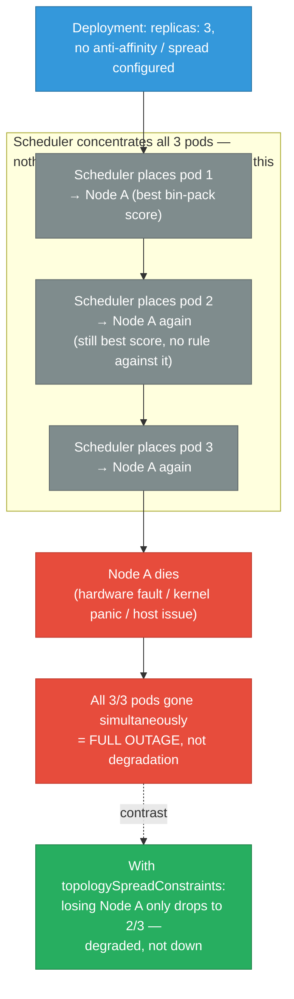

### Cause tree

| Root cause | Fix |
|---|---|
| No `topologySpreadConstraints` or `podAntiAffinity` on the Deployment | Add hard spread constraint keyed on `kubernetes.io/hostname` |
| Spread constraint set to `ScheduleAnyway` (soft) | Switch to `DoNotSchedule` (hard) for mission-critical services |
| Not enough schedulable nodes to satisfy a hard spread | Add Cluster Autoscaler/Karpenter capacity, or the hard constraint just leaves pods `Pending` |
| PodDisruptionBudget missing | A drain/eviction can re-collapse an already-spread set of pods back onto fewer nodes |
| Replica count too low (e.g. `replicas: 2`) | Losing 1 of 2 is a 50% capacity loss even with perfect spread — use `>= 3` for mission-critical |

<div class="stepper">
  <div class="stepper-panels">
    <div class="stepper-panel active">
      <strong>1. Detect the exposure before it costs you an outage.</strong> <code>kubectl get pods -l app=&lt;name&gt; -o wide</code> — if every row shows the same node, you're exposed right now even though nothing has failed yet.
    </div>
    <div class="stepper-panel">
      <strong>2. Understand why the scheduler allowed it.</strong> There is no default anti-affinity behavior. The Score plugins optimize for bin-packing and resource fit, not spread — if Node A scores highest for pod 1, it very likely still scores highest for pods 2 and 3 placed moments later.
    </div>
    <div class="stepper-panel">
      <strong>3. Add a hard topology spread constraint.</strong> <code>topologySpreadConstraints</code> with <code>whenUnsatisfiable: DoNotSchedule</code> keyed on <code>kubernetes.io/hostname</code> makes single-node concentration structurally impossible instead of just unlikely.
    </div>
    <div class="stepper-panel">
      <strong>4. Pair the constraint with capacity and a PDB.</strong> A hard constraint with no spare node capacity just produces <code>Pending</code> pods instead of a spread fleet — Cluster Autoscaler/Karpenter and a <code>PodDisruptionBudget</code> are not optional extras here, they're what makes the spread durable across drains and scale events.
    </div>
  </div>
  <div class="stepper-controls">
    <button class="stepper-prev">← Prev</button>
    <span class="stepper-dots"></span>
    <span class="stepper-label"></span>
    <button class="stepper-next">Next →</button>
  </div>
</div>

### The fix — make single-node concentration structurally impossible

```yaml
apiVersion: apps/v1
kind: Deployment
metadata:
  name: my-app
spec:
  replicas: 3
  template:
    spec:
      topologySpreadConstraints:
      # Spread across NODES — the direct fix for "3/3 on one node"
      - maxSkew: 1
        topologyKey: kubernetes.io/hostname
        whenUnsatisfiable: DoNotSchedule    # hard — refuse to co-locate beyond skew 1
        labelSelector:
          matchLabels: {app: my-app}
      # Spread across AZs too — protects against a whole-AZ failure, not just one node
      - maxSkew: 1
        topologyKey: topology.kubernetes.io/zone
        whenUnsatisfiable: DoNotSchedule
        labelSelector:
          matchLabels: {app: my-app}
```

`maxSkew: 1` with `topologyKey: kubernetes.io/hostname` caps the difference in pod count between the most- and least-loaded **node** at 1. With 3 replicas and 3+ available nodes, this forces one pod per node — losing any single node now drops you to 2/3, not 0/3.

**Older/equivalent mechanism — pod anti-affinity** (still common in existing manifests; `topologySpreadConstraints` is the modern preferred API):

```yaml
spec:
  template:
    spec:
      affinity:
        podAntiAffinity:
          requiredDuringSchedulingIgnoredDuringExecution:
          - labelSelector:
              matchLabels: {app: my-app}
            topologyKey: kubernetes.io/hostname   # hard: never co-locate two replicas on the same node
```

**Why `DoNotSchedule` (hard), not `ScheduleAnyway` (soft), for mission-critical services:** with the soft form, the scheduler *prefers* spreading but will still co-locate replicas if it has to — silently reintroducing the exact single-point-of-failure this is meant to prevent, with no warning at all. The hard form instead leaves a pod `Pending` if it truly can't satisfy the spread — which surfaces as a visible, alertable scheduling problem you can fix by adding capacity, instead of a silent landmine that only detonates when the node actually dies.

<div class="toggle-switch">
  <div class="toggle-buttons">
    <button data-toggle-opt="hard" class="active state-ok">DoNotSchedule (hard)</button>
    <button data-toggle-opt="soft" class="state-bad">ScheduleAnyway (soft)</button>
  </div>
  <div class="toggle-panel active" data-toggle-panel="hard">
    The scheduler <strong>refuses</strong> to place a pod beyond the configured <code>maxSkew</code>. If there isn't enough spread capacity, the pod stays <code>Pending</code> — visible, alertable, and fixable by adding nodes. Single-node concentration becomes structurally impossible, not just discouraged.
  </div>
  <div class="toggle-panel" data-toggle-panel="soft">
    The scheduler <em>prefers</em> spreading but will still co-locate replicas rather than leave one <code>Pending</code>. Under real capacity pressure it silently degrades back into exactly the single-point-of-failure this constraint exists to prevent — with zero warning until the node it collapsed onto actually dies.
  </div>
</div>

**This must be paired with cluster capacity, or it just creates Pending pods instead:**

```
□ At least as many schedulable nodes as replicas (3 replicas needs >= 3 nodes with free capacity)
□ Cluster Autoscaler / Karpenter can add nodes if the hard constraint currently can't be satisfied
□ PodDisruptionBudget (minAvailable) so a voluntary drain doesn't undo the spread by
  evicting 2 of 3 already-spread pods back onto the same remaining node
□ replicas >= 3 for mission-critical services — with 2 replicas, losing 1 node is
  already a 50% capacity loss even with perfect spread
```

### Detecting this before (or after) it bites you

```bash
# Where are a Deployment's replicas actually scheduled right now?
kubectl get pods -l app=my-app -o wide

# Fleet-wide audit: flag any app with >1 replica but only 1 distinct node in use
kubectl get pods -A -o json | jq -r '
  .items | group_by(.metadata.labels.app) |
  map({app: .[0].metadata.labels.app, nodes: (map(.spec.nodeName) | unique)}) |
  map(select((.nodes | length) == 1)) '
```

**Prevention:** Treat `topologySpreadConstraints` as a default, not opt-in, for every Deployment with more than 1 replica that matters for availability — enforce it fleet-wide via a Kyverno/OPA mutating policy so teams can't accidentally ship without it. Re-run the `jq` audit periodically (or wire it into a policy-as-code check), since a Deployment can drift into single-node concentration again after a later reschedule/drain even if it was correctly spread at initial rollout.

<div class="quiz-card">
  <p class="quiz-q">A Deployment had a correct hard <code>topologySpreadConstraints</code> at initial rollout — one replica per node. Six months later, all 3 replicas are found on the same node again, with no manifest change in between. How did that happen, and what's the fix for the process, not just the pods?</p>
  <button class="quiz-reveal">Reveal answer</button>
  <div class="quiz-a" hidden>A later reschedule or node drain can re-collapse an already-spread set of pods back onto fewer nodes — the spread constraint is enforced at scheduling time, not continuously, and nothing re-checks it afterward on its own. A missing PodDisruptionBudget makes this worse: a voluntary drain can evict 2 of 3 already-spread pods back onto the same remaining node. The fix isn't a one-time manifest edit — it's re-running the fleet-wide <code>jq</code> audit periodically (or wiring it into a policy-as-code check) so drift gets caught again, not just prevented once.</div>
</div>

---

## `ImagePullBackOff` / `ErrImagePull`

Container image can't be pulled. `ErrImagePull` is the first attempt; `ImagePullBackOff` is repeated failure with backoff.

```bash
kubectl describe pod <pod> -n <ns>
# Events: Failed to pull image "...", reason in the message
```

### Cause tree

| Error message | Cause | Fix |
|--------------|-------|-----|
| `unauthorized: authentication required` | No pull secret / wrong creds | Add `imagePullSecrets` to pod spec |
| `not found` / `manifest unknown` | Tag doesn't exist | `docker pull <image>` locally to verify |
| `no basic auth credentials` | ECR token expired (12hr TTL) | Refresh ECR token, or use IRSA + ECR pull-through |
| `exec format error` | Wrong arch (arm image on amd64 node) | Build multi-arch image |
| `connection refused` / timeout | Node can't reach registry | Check node's internet access / NAT GW / VPC endpoint for ECR |
| `ImagePullBackOff` on private registry | `imagePullSecrets` missing or wrong namespace | Secret must be in same namespace as pod |

```bash
# Test pulling manually on the node
kubectl debug node/<node-name> -it --image=busybox
# inside: docker pull <image> or crictl pull <image>

# Check if imagePullSecret exists in the right namespace
kubectl get secret regcred -n <ns>

# For ECR: check node IAM role has ecr:GetAuthorizationToken
aws iam simulate-principal-policy \
  --policy-source-arn <node-role-arn> \
  --action-names ecr:GetAuthorizationToken
```

**Prevention:** Use image digest pinning (`image: my-app@sha256:abc123`) instead of mutable tags in production — guarantees the same image always. Set up ECR pull-through cache or mirror to avoid rate limits. For ECR: use IRSA on the node role with `ecr:GetAuthorizationToken` + `ecr:BatchGetImage`. Test image pulls in CI before deploying.

---

## Pod Stuck in `Terminating`

`kubectl delete pod` was run but pod stays in Terminating state indefinitely.

```bash
kubectl describe pod <pod> -n <ns>
# Look for: finalizers, volumes not unmounting, preStop hook hanging
```

### Causes

<div class="tab-group">
  <div class="tab-buttons">
    <button data-tab="finalizer" class="active">Finalizer stuck</button>
    <button data-tab="prestop">preStop hanging</button>
    <button data-tab="volume">Volume unmount</button>
    <button data-tab="node">Node unreachable</button>
  </div>
  <div class="tab-panels">
    <div class="tab-panel active" data-tab-panel="finalizer">
      A controller registered a finalizer on the pod but crashed (or was uninstalled) before removing it — the API server won't actually delete the object while any finalizer remains, so the pod hangs forever with no natural timeout. This is the #1 cause of stuck Terminating pods in practice.
    </div>
    <div class="tab-panel" data-tab-panel="prestop">
      <code>preStop</code> has a hard deadline of <code>terminationGracePeriodSeconds</code> (default 30s). If the hook itself runs longer than that, the pod is force-killed anyway once the grace period expires — but a hook that hangs indefinitely on something like a wedged network call can still make deletion feel stuck in the meantime.
    </div>
    <div class="tab-panel" data-tab-panel="volume">
      The CSI/storage driver reports "Unable to unmount volumes" in events — usually because the underlying volume is wedged or the node's mount namespace is in a bad state. Force-deleting the pod is a last resort here since it can leave the volume itself in a bad state.
    </div>
    <div class="tab-panel" data-tab-panel="node">
      If the node the pod lives on went offline, the pod object stays Terminating until the node either comes back or the node object itself is deleted — kubelet is the thing that's supposed to confirm the container is actually gone, and it's unreachable.
    </div>
  </div>
</div>

**1. Finalizer not being removed**
```bash
kubectl get pod <pod> -n <ns> -o json | jq '.metadata.finalizers'
# If a controller crashed and never removed the finalizer, pod hangs

# Force remove finalizer (only if you're sure the controller is gone)
kubectl patch pod <pod> -n <ns> -p '{"metadata":{"finalizers":[]}}' --type=merge
```

**2. preStop hook hanging**
```yaml
# preStop has a hard deadline of terminationGracePeriodSeconds (default 30s)
# If hook runs longer, pod is force killed after the grace period
lifecycle:
  preStop:
    exec:
      command: ["/bin/sh", "-c", "sleep 5"]  # must complete within grace period
```

**3. Volume not unmounting (PVC)**
```bash
kubectl describe pod <pod> | grep -A5 "Volumes"
# "Unable to unmount volumes" in events = storage driver issue

# Force delete as last resort (may leave volume in bad state)
kubectl delete pod <pod> -n <ns> --grace-period=0 --force
```

**4. Node is NotReady / unreachable**
```bash
# If node went offline, pods on it stay Terminating until node comes back or is deleted
kubectl get node <node>
kubectl delete node <node>   # removes the node object, pods get rescheduled
```

**Prevention:** Avoid finalizers unless necessary — they're the #1 cause of stuck Terminating pods. Set `terminationGracePeriodSeconds` to a realistic value (preStop duration + drain time + buffer). For node failures: enable `NonGracefulNodeShutdown` feature gate (GA in 1.28) so stuck Terminating pods are auto-cleaned up.

<div class="quiz-card">
  <p class="quiz-q">Of the four causes of a stuck Terminating pod in this runbook, which one has no built-in timeout at all — the API server will wait forever unless a human intervenes?</p>
  <button class="quiz-reveal">Reveal answer</button>
  <div class="quiz-a" hidden>A finalizer that never gets removed. preStop hooks are bounded by <code>terminationGracePeriodSeconds</code>, and (as of 1.28's <code>NonGracefulNodeShutdown</code> GA) a dead node's stuck pods can be auto-cleaned up — but a finalizer left behind by a crashed or uninstalled controller has no expiry. The API server will not delete the object while any finalizer remains, which is exactly why this runbook calls it the #1 cause and why the prevention advice is to avoid finalizers unless truly necessary.</div>
</div>

---

## Node `NotReady`

```bash
kubectl get nodes
# NAME        STATUS      ROLES    AGE
# node-1      NotReady    <none>   2d

kubectl describe node <node-name>
# Look at: Conditions, Events, kubelet logs
```

### Cause tree

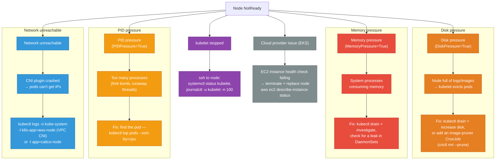

```bash
# Cordon + drain to safely remove workloads before investigating
kubectl cordon <node>
kubectl drain <node> --ignore-daemonsets --delete-emptydir-data

# Check node events
kubectl get events -n default --field-selector involvedObject.name=<node>
```

**Prevention:** Monitor node conditions with `kube_node_status_condition` Prometheus metric. Alert on `DiskPressure=True` before pods are evicted. Add image GC thresholds in kubelet config (`imageGCHighThresholdPercent: 80`). Use node health checks with AWS Auto Scaling Group health check integration so unhealthy nodes are automatically replaced.

---

## High Latency / Slow Requests

Pod is Running, no crashes, but requests are slow.

### Step 1 — isolate the layer

```bash
# Is it all pods or specific ones?
kubectl top pods -n <ns>    # CPU throttled? Memory pressure?

# Check if requests hit a specific pod (check per-pod metrics in Grafana/Datadog)
# Is load balancer distributing unevenly?
```

<div class="tab-group">
  <div class="tab-buttons">
    <button data-tab="cpu" class="active">CPU throttling</button>
    <button data-tab="gc">GC pauses</button>
    <button data-tab="pool">Connection pool</button>
    <button data-tab="dns">DNS resolution</button>
  </div>
  <div class="tab-panels">
    <div class="tab-panel active" data-tab-panel="cpu">
      The most common invisible cause. A CPU <code>limit</code> throttles the container even when cluster-wide CPU looks fine — check <code>container_cpu_cfs_throttled_periods_total / container_cpu_cfs_periods_total</code>; above 0.25 means a quarter of scheduling periods are being throttled. Fix: raise the limit, or remove it entirely and keep only <code>requests</code>.
    </div>
    <div class="tab-panel" data-tab-panel="gc">
      Go or JVM garbage-collection pauses show up as latency spikes with no CPU or network smoking gun. Check GC frequency and pause time via pprof (Go) or GC logs (JVM). Fix for Go: set <code>GOMEMLIMIT</code> to give the collector headroom before it hits the k8s memory limit.
    </div>
    <div class="tab-panel" data-tab-panel="pool">
      Symptoms: latency spikes specifically at high concurrency, logs showing "connection wait timeout" while the app itself is otherwise healthy — it's waiting for a free DB connection from the pool, not doing real work. Fix: increase pool size, or add read replicas / an RDS Proxy in front of the database.
    </div>
    <div class="tab-panel" data-tab-panel="dns">
      Every service-name lookup takes an unexpectedly long time. Time a manual <code>nslookup</code> from inside a pod and check CoreDNS's own CPU and error logs. Fix: use fully-qualified domain names to skip search-domain iteration, or tune CoreDNS replica count.
    </div>
  </div>
</div>

### Step 2 — CPU throttling (most common invisible cause)

```bash
# Check throttling metrics
kubectl top pod <pod> -n <ns>
# If CPU is at limit constantly → throttled

# In Prometheus:
# container_cpu_cfs_throttled_seconds_total — cumulative throttle time
# rate(container_cpu_cfs_throttled_periods_total[5m]) / rate(container_cpu_cfs_periods_total[5m])
# > 0.25 means 25%+ of scheduling periods throttled → very bad for latency
```

**Fix:** Either raise the CPU limit, or remove it entirely (keep only `requests`). CPU limits cause p99 latency spikes even when average CPU is low.

```yaml
resources:
  requests:
    cpu: "500m"
  limits:
    cpu: "2000m"   # raise this, or remove limits entirely for latency-sensitive services
```

### Step 3 — GC pauses (Go / JVM)

```bash
# Go: check GC stats via pprof
kubectl port-forward pod/<pod> 6060:6060
curl http://localhost:6060/debug/pprof/heap > heap.prof
go tool pprof heap.prof

# Check GC frequency
curl http://localhost:6060/debug/vars | jq '.memstats'
# NumGC high + PauseTotalNs high → GC pressure
```

**Fix for Go:** Set `GOMEMLIMIT` to give GC headroom before hitting k8s limit.

### Step 4 — connection pool exhaustion

```bash
# Symptoms: latency spikes at high concurrency, logs show "connection wait timeout"
# App is waiting for a DB connection from the pool

# Check pool metrics if exposed, or:
kubectl exec <pod> -- cat /proc/<pid>/net/tcp | wc -l   # open TCP connections
```

**Fix:** increase pool size, or add read replicas / RDS Proxy.

### Step 5 — DNS resolution slow

```bash
# DNS latency inside cluster
kubectl run dnstest --rm -it --image=busybox -- sh
time nslookup my-service.my-namespace.svc.cluster.local

# CoreDNS performance
kubectl top pods -n kube-system -l k8s-app=kube-dns
kubectl logs -n kube-system -l k8s-app=kube-dns | grep -i error
```

**Fix:** use fully qualified domain names (FQDN) to avoid search domain iteration, or tune CoreDNS replicas.

**Prevention:** Never set CPU limits on latency-sensitive services — use requests only. Alert on `container_cpu_cfs_throttled_periods_total / container_cpu_cfs_periods_total > 0.25`. Set `dnsConfig.options: [{name: ndots, value: "2"}]` on all pods. Use `GOMEMLIMIT` for Go services. Deploy NodeLocal DNSCache to eliminate DNS as a latency source.

<div class="quiz-card">
  <p class="quiz-q">A service's average CPU usage is comfortably under its limit, yet p99 latency has periodic spikes. A teammate says "CPU can't be the cause, usage isn't even close to the limit" — what's wrong with that reasoning?</p>
  <button class="quiz-reveal">Reveal answer</button>
  <div class="quiz-a" hidden>CPU limits are enforced per scheduling period (the CFS quota), not as a smooth average — a process can be well under its limit on average while still getting throttled hard during short bursts within individual periods, which is exactly what drives p99 (not average) latency. The averaged metric hides the throttling entirely. The real signal is <code>container_cpu_cfs_throttled_periods_total / container_cpu_cfs_periods_total</code>; above 0.25 is bad regardless of what the average CPU graph shows. This is why the prevention rule here is to remove CPU limits entirely for latency-sensitive services rather than trying to size them "generously."</div>
</div>

---

## PVC Stuck in `Pending`

```bash
kubectl get pvc -n <ns>
# NAME    STATUS    VOLUME   CAPACITY   STORAGECLASS
# data    Pending                       gp3

kubectl describe pvc data -n <ns>
# Events tell you why
```

| Event | Cause | Fix |
|-------|-------|-----|
| `no persistent volumes available` | No PV matches (static provisioning) | Create a PV or switch to dynamic |
| `storageclass not found` | Wrong `storageClassName` | `kubectl get storageclass` — check name |
| `waiting for first consumer` | StorageClass has `volumeBindingMode: WaitForFirstConsumer` | Normal — PVC binds when pod is scheduled |
| `failed to provision volume` | CSI driver error / IAM permissions | Check CSI driver pod logs |
| `exceeded quota` | ResourceQuota on namespace | `kubectl describe quota -n <ns>` |

```bash
# Check CSI driver (EBS on EKS)
kubectl logs -n kube-system -l app=ebs-csi-controller -c ebs-plugin | tail -50

# Check storage classes
kubectl get storageclass

# Check if IAM role for CSI has ebs:CreateVolume permission
```

**Prevention:** Use `WaitForFirstConsumer` volumeBindingMode on StorageClasses — prevents PVCs binding to the wrong AZ before the pod is scheduled. Set ResourceQuota for storage to prevent runaway PVC creation. Test CSI driver RBAC with `kubectl auth can-i` in staging before deploying new clusters.

<div class="quiz-card">
  <p class="quiz-q">A StorageClass uses the default (Immediate) volumeBindingMode. A PVC binds successfully to a PV in AZ-a, but then the pod that claims it gets stuck Pending. Why, and what StorageClass setting fixes it?</p>
  <button class="quiz-reveal">Reveal answer</button>
  <div class="quiz-a" hidden>With Immediate binding, the PVC gets bound to a PV as soon as it's created — before the scheduler has any say in which AZ the pod ends up in. If the scheduler then places the pod in a different AZ (for entirely unrelated reasons, like resource fit), the pod can never actually reach its volume. <code>volumeBindingMode: WaitForFirstConsumer</code> fixes this by delaying binding until a pod actually claims the PVC, so the PV gets provisioned in whichever AZ the pod was already scheduled to.</div>
</div>

---

## Resource Quota / LimitRange Blocking Pods

```bash
# Pod fails to create with "exceeded quota" or "must specify limits"
kubectl describe quota -n <ns>
kubectl describe limitrange -n <ns>

# Example output:
# Resource         Used    Hard
# requests.cpu     1800m   2000m    ← close to limit
# limits.memory    3Gi     4Gi
```

**LimitRange** sets defaults and min/max for containers in a namespace. If a pod has no `resources` set and LimitRange requires it, the pod is rejected.

```bash
# See what defaults are being injected
kubectl get limitrange -n <ns> -o yaml
```

<div class="tab-group">
  <div class="tab-buttons">
    <button data-tab="quota" class="active">ResourceQuota</button>
    <button data-tab="limitrange">LimitRange</button>
  </div>
  <div class="tab-panels">
    <div class="tab-panel active" data-tab-panel="quota">
      Caps the <strong>total</strong> resource consumption across an entire namespace — e.g. <code>requests.cpu: 2000m</code> hard across all pods combined. A pod is rejected once the namespace as a whole would exceed the quota, even if that individual pod's own request is small. Shows up as "exceeded quota" in the create error.
    </div>
    <div class="tab-panel" data-tab-panel="limitrange">
      Sets defaults and per-container min/max within a namespace — it acts on <strong>one pod at a time</strong>, not the namespace total. If a pod has no <code>resources</code> block and LimitRange requires one, the pod is rejected with "must specify limits" rather than a quota-exceeded error.
    </div>
  </div>
</div>

**Prevention:** Set LimitRange defaults in every namespace so pods without resource specs still get sane defaults. Alert on `kube_resourcequota{type="used"} / kube_resourcequota{type="hard"} > 0.80` to catch quota exhaustion before it blocks deployments. Document quota allocations per team in runbooks.

<div class="quiz-card">
  <p class="quiz-q">A single pod with a tiny <code>requests.cpu: 50m</code> fails to create with "exceeded quota" — but a LimitRange in the same namespace has generous per-container maximums that this pod is nowhere near. What's actually blocking it?</p>
  <button class="quiz-reveal">Reveal answer</button>
  <div class="quiz-a" hidden>ResourceQuota, not LimitRange — the error message "exceeded quota" is the tell. ResourceQuota caps <strong>total</strong> consumption across the whole namespace, so even a tiny individual request gets rejected if the namespace as a whole is already at its <code>requests.cpu</code> hard cap; the pod's own size is irrelevant once the aggregate is full. LimitRange operates per-pod (min/max per container, defaults when unset) and would instead produce a "must specify limits" style error, not a quota-exceeded one. <code>kubectl describe quota -n &lt;ns&gt;</code> — not <code>describe limitrange</code> — is the next command here.</div>
</div>

---

## Quick Reference: All Pod States

| Status | Meaning | First command |
|--------|---------|--------------|
| `Pending` | Not scheduled yet | `kubectl describe pod` → Events: FailedScheduling |
| `Init:0/1` | Init container running/failed | `kubectl logs <pod> -c <init-container>` |
| `PodInitializing` | Init done, main container starting | Normal, wait |
| `Running` but not Ready | Readiness probe failing | `kubectl describe pod` → probe config + app logs |
| `CrashLoopBackOff` | Container crashing repeatedly | `kubectl logs --previous`, check exit code |
| `OOMKilled` | Memory limit exceeded | Increase `limits.memory`, check for leak |
| `Error` | Container exited non-zero once | `kubectl logs <pod>` |
| `Completed` | Container exited 0 (Job/init) | Normal for Jobs |
| `Terminating` | Delete issued, waiting grace period | Check finalizers, preStop hook |
| `ImagePullBackOff` | Can't pull image | `kubectl describe pod` → registry/auth/tag |
| `ErrImageNeverPull` | `imagePullPolicy: Never` + image missing | Push image to node or change policy |
| `NodeLost` / `Unknown` | Node unreachable | `kubectl get node`, check cloud console |

---

## Pod Running But Requests Failing Silently

**Symptom:** Pod is `Running` and `Ready`, but requests return errors or wrong data. Readiness probe passes but the app is broken inside.

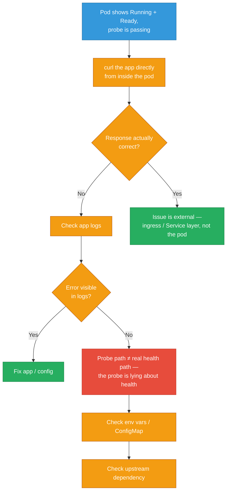

**Commands:**

```bash
# exec into pod and curl the app directly
kubectl exec -it <pod> -- curl -v http://localhost:<port>/healthz

# check app logs
kubectl logs <pod> --tail=100

# check readiness probe config
kubectl describe pod <pod> | grep -A 10 "Readiness"

# check env vars
kubectl exec -it <pod> -- env | grep -i db
kubectl exec -it <pod> -- env | grep -i api
```

**Expected output snippet:**
```
Readiness:  http-get http://:8080/ready delay=5s timeout=1s period=10s
# If /ready returns 200 but app is broken, the probe path is wrong
```

**Root Cause Table:**

| Root Cause | Fix |
|---|---|
| Readiness probe checks wrong path | Update probe to check real health endpoint |
| Missing/wrong env var or ConfigMap | Verify `envFrom` / `env` in pod spec |
| Upstream DB/service unavailable | Check upstream pod/service connectivity |
| App bug returns 200 on errors | Fix application logic |

**Prevention:** Separate liveness from readiness probes — readiness should check actual app health (e.g. DB ping), liveness should only check if the process is hung. Use `/readyz` for readiness (checks dependencies) and `/livez` for liveness (just checks process). Add integration tests in CI that deploy to staging and verify the probe endpoints return correct status codes.

<div class="quiz-card">
  <p class="quiz-q">A team makes their readiness and liveness probes hit the exact same endpoint, which pings the database. Under a brief DB blip, why is this worse than having two separate endpoints?</p>
  <button class="quiz-reveal">Reveal answer</button>
  <div class="quiz-a" hidden>Liveness should only check whether the process itself is hung — not whether a downstream dependency is reachable. If liveness also pings the DB and the DB has a brief blip, kubelet sees the liveness probe fail and kills a perfectly healthy pod process over an external dependency issue it can't fix by restarting. A readiness failure would have been the correct response instead — just stop routing traffic to it until the DB recovers, without killing the process. That's exactly why the prevention rule is <code>/readyz</code> (checks dependencies) for readiness and <code>/livez</code> (just checks the process) for liveness, as two distinct endpoints.</div>
</div>

---

## DNS Resolution Failures Inside Pods

**Symptom:** Pod gets `NXDOMAIN` or connection timeout when resolving service names. `nslookup my-svc` fails inside the pod.

```mermaid
sequenceDiagram
    participant P as Pod
    participant CD as CoreDNS
    participant S as Service object
    participant E as Endpoints/EndpointSlice

    Note over P,CD: Check 1 — is CoreDNS even reachable?
    P->>CD: nslookup my-svc (via resolv.conf search domains)
    rect rgb(80, 40, 40)
    CD-->>P: NXDOMAIN, or timeout entirely
    Note over P: If this fails, check CoreDNS pod status<br/>and NetworkPolicy egress to port 53 first
    end

    Note over CD,S: Check 2 — does the Service exist?
    CD->>S: Resolve my-svc.default.svc.cluster.local
    rect rgb(80, 40, 40)
    S-->>CD: Service not found in that namespace
    Note over S: kubectl get svc — create it, or fix the namespace
    end

    Note over S,E: Check 3 — does the Service have live backends?
    S->>E: Look up ready backend pod IPs
    rect rgb(80, 40, 40)
    E-->>S: Endpoints list is empty
    Note over E: Compare svc selector vs pod labels,<br/>and confirm pods are actually Ready
    end

    rect rgb(30, 70, 45)
    CD-->>P: Healthy path — returns ClusterIP
    end
```

**Commands:**

```bash
# test DNS from inside pod
kubectl exec -it <pod> -- nslookup my-svc
kubectl exec -it <pod> -- nslookup my-svc.default.svc.cluster.local

# check resolv.conf
kubectl exec -it <pod> -- cat /etc/resolv.conf
# expect: search default.svc.cluster.local svc.cluster.local cluster.local

# is CoreDNS running?
kubectl get pods -n kube-system -l k8s-app=kube-dns

# CoreDNS logs
kubectl logs -n kube-system -l k8s-app=kube-dns --tail=50
```

**Root Cause Table:**

| Root Cause | Fix |
|---|---|
| CoreDNS pod down/crashlooping | Restart CoreDNS pods; check its ConfigMap |
| Service doesn't exist in namespace | `kubectl get svc` — create if missing |
| Wrong search domain in resolv.conf | Check `dnsConfig` in pod spec |
| NetworkPolicy blocks pod→CoreDNS (port 53) | Allow egress to kube-dns on UDP/TCP 53 |

**Prevention:** Deploy NodeLocal DNSCache DaemonSet — each node caches DNS locally, eliminating CoreDNS as a SPOF. Set `ndots: 2` in pod dnsConfig to reduce DNS round trips. Alert on `coredns_dns_responses_total{rcode="SERVFAIL"}` and CoreDNS `OOMKilled`. Scale CoreDNS replicas proportional to cluster size (1 replica per 16 nodes minimum).

<div class="quiz-card">
  <p class="quiz-q">CoreDNS is running fine, but a node-level network blip briefly makes it unreachable from every pod on that node, causing a wave of DNS timeouts cluster-wide. What deployment pattern from this section's prevention rule removes CoreDNS as a single point of failure for that specific case?</p>
  <button class="quiz-reveal">Reveal answer</button>
  <div class="quiz-a" hidden>NodeLocal DNSCache — a DaemonSet that runs a DNS cache on every node, so lookups are served locally instead of crossing the network to a (possibly distant or momentarily unreachable) CoreDNS pod. This doesn't just add speed; it changes the failure mode from "any pod on any node can be hit by a CoreDNS-reachability blip" to "only a genuinely broken node loses DNS," since each node's own cache serves warm lookups even during a brief network hiccup elsewhere in the cluster.</div>
</div>

---

## NetworkPolicy Blocking Traffic

**Symptom:** Pod A can't reach Pod B or a Service, but both are `Running`. No obvious error — just connection refused or timeout.

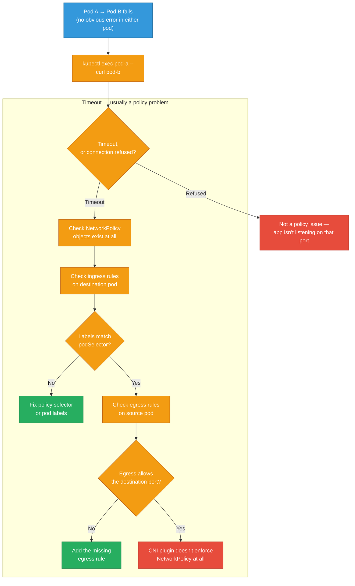

**Commands:**

```bash
# list all network policies in namespace
kubectl get networkpolicy -n <ns>

# inspect a policy
kubectl describe networkpolicy <policy-name> -n <ns>

# test connectivity from pod A
kubectl exec -it <pod-a> -- curl -v http://<pod-b-ip>:<port>

# use ephemeral debug container (k8s 1.23+)
kubectl debug -it <pod-a> --image=nicolaka/netshoot --target=<container>
# then: curl, nslookup, tcpdump
```

**Root Cause Table:**

| Root Cause | Fix |
|---|---|
| Ingress policy missing `from` rule | Add `podSelector` matching source pod labels |
| Egress policy missing `to` rule | Add egress rule for destination port |
| Pod labels don't match policy selector | Align pod labels with `podSelector` |
| CNI doesn't enforce NetworkPolicy | Switch to Calico/Cilium/Weave |

**Prevention:** Adopt a default-deny-all NetworkPolicy per namespace and explicitly allowlist required traffic. Test policies with `kubectl exec -- curl` in staging before prod. Use Cilium's `hubble observe --verdict DROPPED` to see what's being blocked in real time. Include NetworkPolicy in service deployment manifests so policies travel with the service.

---

## Service Not Routing to Pods (Empty Endpoints)

**Symptom:** Service exists and has a ClusterIP, but requests get `connection refused` or no backends respond.

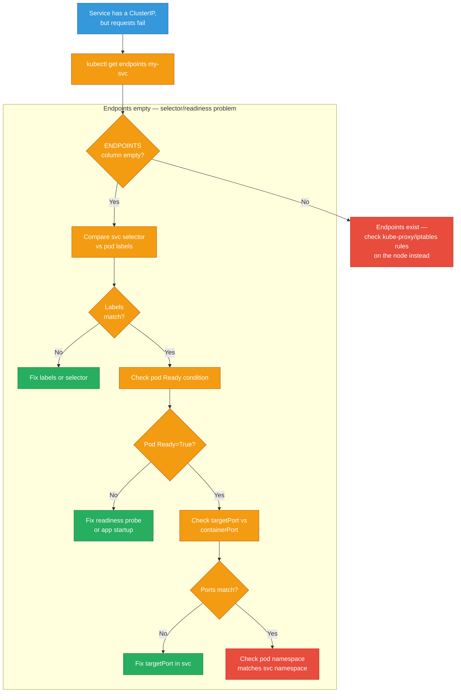

**Commands:**

```bash
# check endpoints
kubectl get endpoints my-svc
# ENDPOINTS column should not be "<none>"

# describe the service to see selector
kubectl describe svc my-svc

# check pod labels
kubectl get pods --show-labels

# verify targetPort
kubectl get svc my-svc -o jsonpath='{.spec.ports[*].targetPort}'
```

**Expected output snippet:**
```
NAME      ENDPOINTS         AGE
my-svc    <none>            5m   ← problem: no backends
```

**Root Cause Table:**

| Root Cause | Fix |
|---|---|
| Service selector doesn't match pod labels | Align `spec.selector` with pod labels |
| Pod not Ready (failing readiness probe) | Fix readiness probe or app startup |
| targetPort ≠ containerPort | Match `targetPort` to the port the app listens on |
| Pod in different namespace | Service and pods must be in same namespace |

**Prevention:** Use label conventions enforced by LimitRange/OPA — all pods must have `app` label. Write CI checks (`conftest`, `kyverno`) that validate Service selectors match Deployment labels before merge. Add a Prometheus alert on `kube_endpoint_address_not_ready > 0` sustained for > 2 minutes.

---

## HPA Not Scaling

**Symptom:** Load is high but HPA stays at `minReplicas`. `kubectl get hpa` shows `<unknown>` for current metrics.

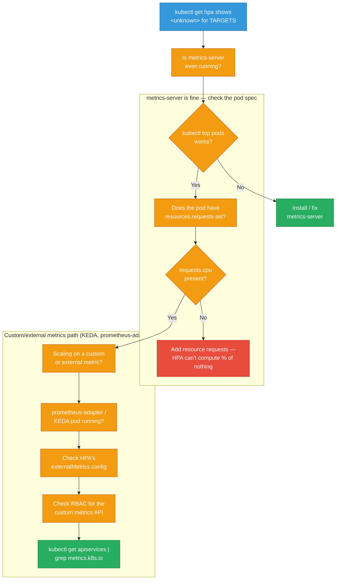

**Commands:**

```bash
# check HPA status
kubectl get hpa
kubectl describe hpa <hpa-name>

# verify metrics-server is reachable
kubectl top pods -n <ns>
kubectl top nodes

# check metrics API registration
kubectl get apiservices | grep metrics

# check if resource requests are set on pods
kubectl get pod <pod> -o jsonpath='{.spec.containers[*].resources}'
```

**Expected output snippet:**
```
NAME   REFERENCE         TARGETS         MINPODS  MAXPODS  REPLICAS
web    Deployment/web    <unknown>/50%   2        10       2
# <unknown> means metrics pipeline is broken
```

**Root Cause Table:**

| Root Cause | Fix |
|---|---|
| metrics-server not installed | Install via `kubectl apply -f metrics-server.yaml` |
| No `resources.requests.cpu` on pod | Add CPU request to pod/deployment spec |
| `v1beta1.metrics.k8s.io` not registered | Fix metrics-server or prometheus-adapter install |
| RBAC missing for metrics API | Add ClusterRole for HPA to read metrics |

**Prevention:** Always set `resources.requests.cpu` — HPA silently shows `<unknown>` without it. Install metrics-server as part of cluster bootstrap (not optional). For production: use KEDA with external metrics (queue depth, RPS) instead of CPU-only HPA — CPU is a lagging indicator of load.

<div class="quiz-card">
  <p class="quiz-q">A pod has no <code>resources.requests.cpu</code> set, but metrics-server is installed and healthy, and <code>kubectl top pods</code> works fine. Will the HPA scale correctly?</p>
  <button class="quiz-reveal">Reveal answer</button>
  <div class="quiz-a" hidden>No — <code>kubectl top pods</code> working proves metrics-server itself is fine, but that's a different signal from whether the HPA can compute a percentage. A CPU-target HPA needs <code>requests.cpu</code> as the denominator for "current usage as % of request"; with no request set, there's nothing to divide by, and the HPA shows <code>&lt;unknown&gt;</code> for TARGETS and never scales — even though every other part of the metrics pipeline is completely healthy. This is why the prevention rule is to always set <code>requests.cpu</code>, not just "install metrics-server."</div>
</div>

---

## Deployment Stuck in Rollout

**Symptom:** `kubectl rollout status` hangs. New pods won't start (CrashLoop/Pending) or old pods won't terminate.

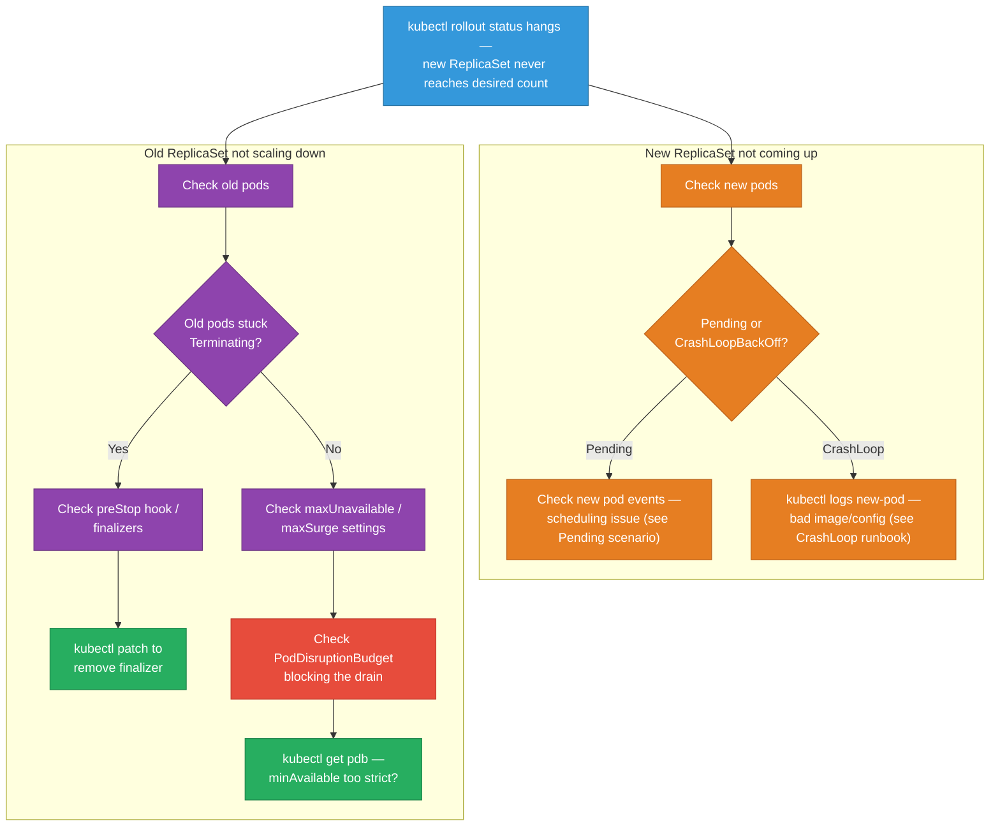

**Commands:**

```bash
# check rollout status
kubectl rollout status deployment/<name>

# rollout history
kubectl rollout history deployment/<name>

# inspect new and old pods
kubectl get pods -l app=<name> --sort-by=.metadata.creationTimestamp

# describe a stuck pod
kubectl describe pod <new-pod>

# check PodDisruptionBudget
kubectl get pdb -n <ns>
kubectl describe pdb <pdb-name>

# rollback if needed
kubectl rollout undo deployment/<name>
```

**Root Cause Table:**

| Root Cause | Fix |
|---|---|
| New image crash / bad config | Check logs; rollback with `kubectl rollout undo` |
| PDB blocks pod termination | Temporarily scale PDB `minAvailable` or fix pod health |
| preStop hook hangs | Fix hook or reduce `terminationGracePeriodSeconds` |
| maxUnavailable=0 + unschedulable nodes | Fix node capacity or adjust rollout strategy |

**Prevention:** Set a `progressDeadlineSeconds` (default 600s) — rollout auto-fails if new pods don't become Ready within that window, making CI pipelines fail fast. Always set a PDB with `minAvailable: 1` so rollouts can't kill all replicas. Add a readiness probe that fails until the app is truly ready (not just started).

<div class="stepper">
  <div class="stepper-panels">
    <div class="stepper-panel active">
      <strong>1. Split the investigation in two.</strong> A stuck rollout is always one of two independent problems — the <em>new</em> ReplicaSet not coming up, or the <em>old</em> ReplicaSet not scaling down. <code>kubectl get pods -l app=&lt;name&gt; --sort-by=.metadata.creationTimestamp</code> shows you both generations side by side so you know which half is actually stuck.
    </div>
    <div class="stepper-panel">
      <strong>2. If it's the new pods:</strong> treat it exactly like a fresh Pending or CrashLoopBackOff investigation — <code>kubectl describe pod</code> for scheduling events, or <code>kubectl logs</code> for a crash. Nothing about this being mid-rollout changes that diagnosis; the rollout is just the trigger that surfaced it.
    </div>
    <div class="stepper-panel">
      <strong>3. If it's the old pods:</strong> the two suspects are a hung <code>preStop</code>/stuck finalizer, or the rollout's own <code>maxUnavailable</code>/<code>maxSurge</code> budget colliding with a <code>PodDisruptionBudget</code>. <code>kubectl get pdb</code> is the fastest way to rule the PDB in or out — a <code>minAvailable</code> set too high for the current replica count silently blocks every eviction.
    </div>
    <div class="stepper-panel">
      <strong>4. Decide: fix forward, or roll back.</strong> If root cause isn't obvious in a couple of minutes, <code>kubectl rollout undo deployment/&lt;name&gt;</code> restores service immediately — <code>progressDeadlineSeconds</code> exists precisely so this decision gets forced automatically in CI instead of a human staring at a hung rollout indefinitely.
    </div>
  </div>
  <div class="stepper-controls">
    <button class="stepper-prev">← Prev</button>
    <span class="stepper-dots"></span>
    <span class="stepper-label"></span>
    <button class="stepper-next">Next →</button>
  </div>
</div>

<div class="quiz-card">
  <p class="quiz-q">A Deployment rollout hangs because the old ReplicaSet's pods won't terminate. <code>describe pod</code> shows no finalizers and no hanging preStop hook. What's the next thing to check, and why does the default rollout config make this easy to miss?</p>
  <button class="quiz-reveal">Reveal answer</button>
  <div class="quiz-a" hidden>Check the PodDisruptionBudget with <code>kubectl get pdb</code> — a <code>minAvailable</code> set too high for the current replica count will block the rollout's own eviction of old pods just as effectively as a stuck finalizer would, but with none of the obvious signals (no hung hook, no lingering finalizer in <code>describe pod</code>). It's easy to miss because nothing about the Deployment spec itself looks wrong; the PDB is a separate object that silently vetoes the eviction. This is exactly why the prevention rule pairs <code>progressDeadlineSeconds</code> with a sane PDB — the deadline at least forces the rollout to fail loudly instead of hanging forever.</div>
</div>

---

## Webhook Admission Failures

**Symptom:** `kubectl apply` returns an admission webhook error. Resource can't be created or updated.

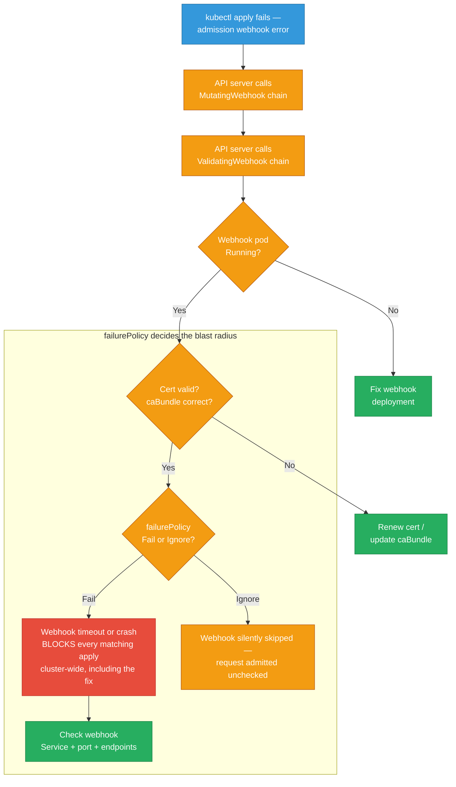

**Commands:**

```bash
# list webhook configs
kubectl get validatingwebhookconfigurations
kubectl get mutatingwebhookconfigurations

# inspect a webhook
kubectl describe validatingwebhookconfiguration <name>

# check webhook pod and service
kubectl get pods -n <webhook-ns>
kubectl get svc -n <webhook-ns>

# test webhook service reachability
kubectl exec -it <debug-pod> -- curl -k https://<webhook-svc>.<ns>.svc/validate
```

**Root Cause Table:**

| Root Cause | Fix |
|---|---|
| Webhook pod down | Restart webhook deployment |
| TLS cert expired / wrong caBundle | Rotate cert; update `caBundle` in webhook config |
| `failurePolicy: Fail` + unreachable webhook | Set `failurePolicy: Ignore` temporarily or fix pod |
| Webhook rejects valid resource (logic bug) | Fix webhook validation logic |

**Prevention:** Set `failurePolicy: Ignore` on all non-critical webhooks (security webhooks can be `Fail`). Add `namespaceSelector` to exclude `kube-system` from webhook scope — prevents the webhook from blocking its own recovery. Use cert-manager to auto-rotate webhook TLS certs. Run webhook pods with PDB and 2+ replicas.

<div class="toggle-switch">
  <div class="toggle-buttons">
    <button data-toggle-opt="fail" class="active state-bad">failurePolicy: Fail</button>
    <button data-toggle-opt="ignore" class="state-ok">failurePolicy: Ignore</button>
  </div>
  <div class="toggle-panel active" data-toggle-panel="fail">
    A webhook that's down, slow, or cert-expired now blocks <strong>every</strong> matching <code>apply</code> cluster-wide — including, potentially, the fix to the webhook deployment itself if it isn't excluded via <code>namespaceSelector</code>. Correct for security-critical admission control where "fail open" is unacceptable, but it turns a webhook outage into a cluster-wide outage.
  </div>
  <div class="toggle-panel" data-toggle-panel="ignore">
    A webhook that's down is silently skipped — requests get admitted unchecked rather than rejected. Safe default for most non-critical mutating/validating webhooks (defaulting, sidecar injection, label enforcement): an outage degrades a feature instead of blocking every deploy in the cluster.
  </div>
</div>

<div class="quiz-card">
  <p class="quiz-q">A validating webhook has <code>failurePolicy: Fail</code> and no <code>namespaceSelector</code> exclusions. Its own pod crashes. What happens next, and why can this become unrecoverable without a workaround?</p>
  <button class="quiz-reveal">Reveal answer</button>
  <div class="quiz-a" hidden>Every matching <code>apply</code> across the whole cluster starts failing — including any <code>kubectl apply</code> aimed at fixing or restarting the webhook's own Deployment, if that Deployment lives in a namespace the webhook itself scopes over. Without a <code>namespaceSelector</code> excluding at least <code>kube-system</code> (or wherever the webhook runs), you can end up needing to bypass the webhook config entirely (delete/patch the <code>ValidatingWebhookConfiguration</code> via the API, since normal applies are blocked) just to redeploy the thing that's supposed to fix itself. That's exactly the scenario the prevention advice heads off with <code>namespaceSelector</code> exclusions and PDB + 2+ replicas for the webhook pods.</div>
</div>

---

## Node Disk Pressure Evicting Pods

**Symptom:** Pods suddenly evicted with `reason: Evicted`. Node shows `DiskPressure=True` condition.

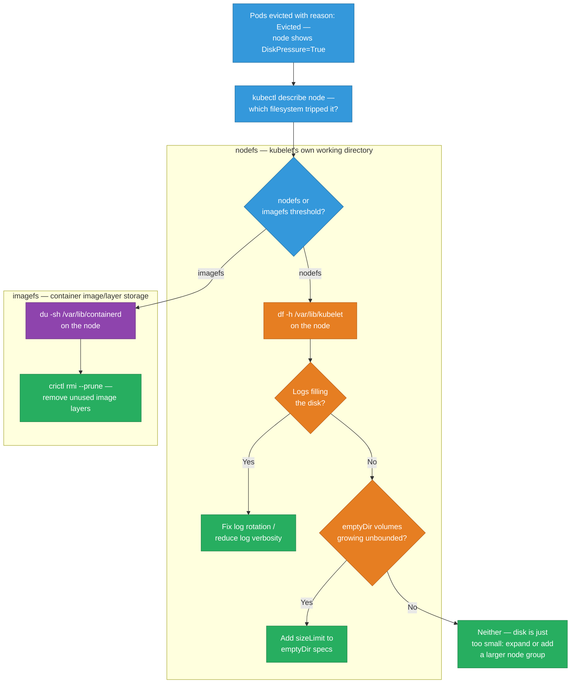

**Commands:**

```bash
# find evicted pods
kubectl get pods --field-selector=status.phase=Failed -A | grep Evicted

# describe node for disk pressure
kubectl describe node <node-name> | grep -A 5 "Conditions"

# debug node filesystem (k8s 1.23+)
kubectl debug node/<node-name> -it --image=ubuntu
# inside: df -h, du -sh /var/log/containers/*

# clean up evicted pods
kubectl delete pods --field-selector=status.phase=Failed -A
```

**Expected output snippet:**
```
Conditions:
  Type            Status  ...
  DiskPressure    True    kubelet has disk pressure
```

**Root Cause Table:**

| Root Cause | Fix |
|---|---|
| Container logs unbounded | Configure `logrotate` or set `--container-log-max-size` |
| Unused container images | Run `crictl rmi --prune` or configure image GC |
| emptyDir volumes growing large | Add `sizeLimit` to emptyDir volume spec |
| Node disk too small | Expand EBS volume or add larger node group |

**Prevention:** Set kubelet `--container-log-max-size=50Mi --container-log-max-files=3`. Configure image GC thresholds (`imageGCHighThresholdPercent: 80`). Alert on `node_filesystem_avail_bytes / node_filesystem_size_bytes < 0.15`. Add `sizeLimit` to all emptyDir volumes. Use instance types with ≥ 100Gi root volumes for nodes.

<div class="toggle-switch">
  <div class="toggle-buttons">
    <button data-toggle-opt="nodefs" class="active state-warn">nodefs pressure</button>
    <button data-toggle-opt="imagefs" class="state-warn">imagefs pressure</button>
  </div>
  <div class="toggle-panel active" data-toggle-panel="nodefs">
    The filesystem backing <code>/var/lib/kubelet</code> — container logs, emptyDir volumes, and general kubelet scratch space live here. Usually caused by unbounded log growth or an emptyDir volume with no <code>sizeLimit</code>. <code>crictl rmi</code> won't help this one; it's not an image problem.
  </div>
  <div class="toggle-panel" data-toggle-panel="imagefs">
    The filesystem backing <code>/var/lib/containerd</code> (or Docker's equivalent) — pulled image layers accumulate here across every deploy. Usually caused by image GC thresholds set too high or too infrequent, or simply too many distinct image versions retained. <code>crictl rmi --prune</code> is the direct fix; log rotation won't touch it.
  </div>
</div>

---

## etcd Slow / API Server Timeout

**Symptom:** `kubectl` commands hang or return timeout. All operations are slow. Cluster feels frozen.

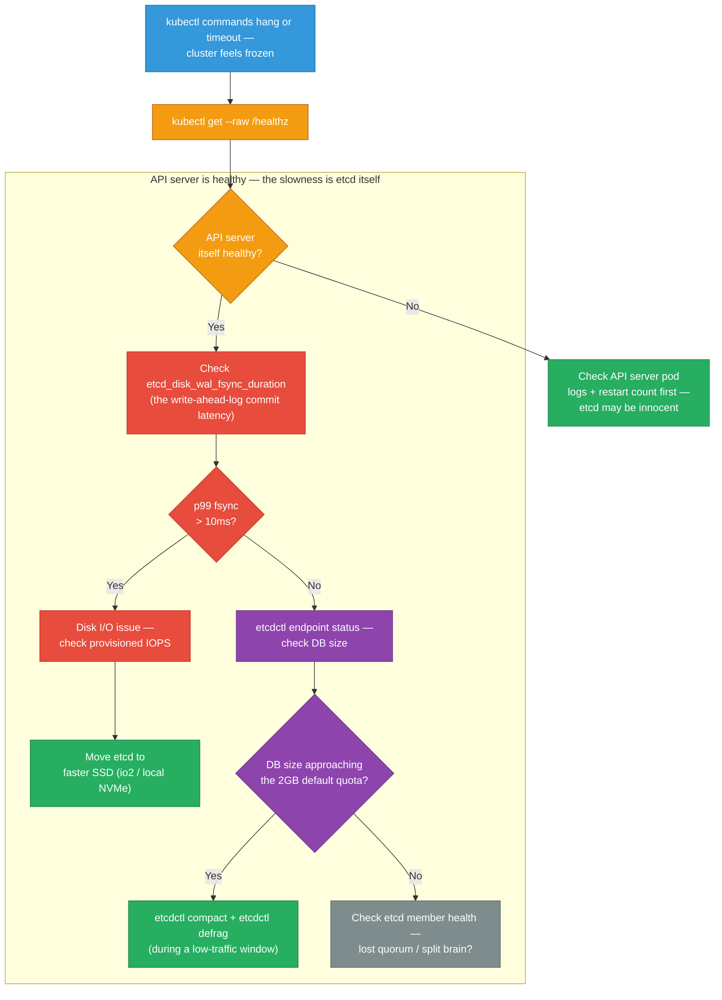

**Commands:**

```bash
# check API server health
kubectl get --raw /healthz
kubectl get --raw /readyz

# etcd health (run on etcd node or via pod)
etcdctl --endpoints=https://127.0.0.1:2379 \
  --cacert=/etc/kubernetes/pki/etcd/ca.crt \
  --cert=/etc/kubernetes/pki/etcd/healthcheck-client.crt \
  --key=/etc/kubernetes/pki/etcd/healthcheck-client.key \
  endpoint health

# etcd status (shows DB size)
etcdctl endpoint status --write-out=table

# defrag etcd (do during low-traffic window)
etcdctl defrag --endpoints=https://127.0.0.1:2379
```

**Root Cause Table:**

| Root Cause | Fix |
|---|---|
| Slow disk (high WAL fsync latency) | Move etcd to SSD; use gp3 with provisioned IOPS |
| etcd DB size > quota (default 2GB) | Compact revisions + defrag; increase `--quota-backend-bytes` |
| etcd member unhealthy / quorum lost | Recover failed member; restore from snapshot |
| Too many objects (large secrets/CMs) | Audit and prune large resources |

**Prevention:** Provision etcd on dedicated fast SSDs (io2 or local NVMe). Alert on `etcd_disk_wal_fsync_duration_seconds_bucket{quantile="0.99"} > 0.01` (10ms p99). Set up automated daily compaction and defrag as a CronJob. Monitor `etcd_mvcc_db_total_size_in_bytes` — alert at 1.5GB (before hitting 2GB default quota). Run etcd on at least 3 nodes for quorum.

<div class="stepper">
  <div class="stepper-panels">
    <div class="stepper-panel active">
      <strong>1. Rule the API server itself in or out first.</strong> <code>kubectl get --raw /healthz</code> — if the API server is unhealthy on its own (crashlooping, restarting), fix that before touching etcd at all. Don't assume etcd is guilty just because <code>kubectl</code> is slow; the API server is a separate hop that can be the actual bottleneck.
    </div>
    <div class="stepper-panel">
      <strong>2. Check disk I/O latency before anything else in etcd.</strong> <code>wal_fsync_duration</code> p99 above 10ms is disk-bound slowness — etcd fsyncs every write to disk before acknowledging it, so a slow disk directly becomes cluster-wide write latency. This is the single most common root cause and the fastest to confirm.
    </div>
    <div class="stepper-panel">
      <strong>3. If disk I/O is fine, check DB size against the quota.</strong> <code>etcdctl endpoint status --write-out=table</code> shows current size against the default 2GB <code>--quota-backend-bytes</code>. Compaction removes old revisions; defrag reclaims the freed space on disk — you typically need both, and defrag should run in a low-traffic window since it briefly blocks that member.
    </div>
    <div class="stepper-panel">
      <strong>4. If neither disk nor size explains it, suspect quorum.</strong> A lost or flaky member forces the remaining members to spend time on leader elections and consensus retries instead of serving requests — check member health directly rather than continuing to stare at fsync and size metrics that are both already fine.
    </div>
  </div>
  <div class="stepper-controls">
    <button class="stepper-prev">← Prev</button>
    <span class="stepper-dots"></span>
    <span class="stepper-label"></span>
    <button class="stepper-next">Next →</button>
  </div>
</div>

<div class="quiz-card">
  <p class="quiz-q">Why does this runbook recommend alerting on etcd DB size at 1.5GB rather than waiting until it actually approaches the 2GB default quota?</p>
  <button class="quiz-reveal">Reveal answer</button>
  <div class="quiz-a" hidden>Once the DB hits the <code>--quota-backend-bytes</code> limit (2GB by default), etcd doesn't just slow down — it stops accepting writes entirely, and the cluster goes read-only until someone compacts and defrags it, which is a much worse incident than a proactive fix. Alerting at 1.5GB leaves headroom to schedule compaction and defrag during a low-traffic window on your own terms, instead of doing emergency surgery on a cluster that's already refusing writes. This is the same "catch it before it's an outage, not after" logic as alerting on disk usage at 15% free rather than 0%.</div>
</div>

---

## RBAC 403 — Pod Can't Call Kubernetes API

**Symptom:** App inside a pod gets `403 Forbidden` when calling the Kubernetes API. ServiceAccount token is present but denied.

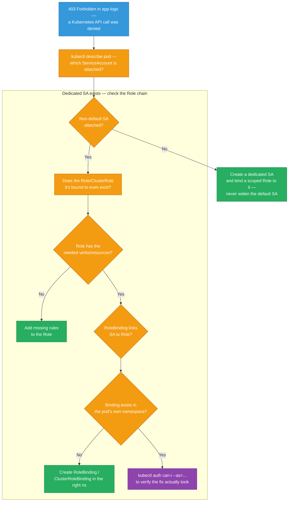

**Commands:**

```bash
# test permissions as the service account
kubectl auth can-i get pods \
  --as=system:serviceaccount:default:my-sa -n default

kubectl auth can-i list secrets \
  --as=system:serviceaccount:default:my-sa -n default

# check what SA the pod uses
kubectl get pod <pod> -o jsonpath='{.spec.serviceAccountName}'

# list role bindings in namespace
kubectl get rolebinding -n <ns>
kubectl get clusterrolebinding | grep my-sa

# describe the binding
kubectl describe rolebinding <name> -n <ns>
kubectl describe clusterrolebinding <name>
```

**Expected output snippet:**
```
no  ← kubectl auth can-i returns "no" → RBAC is the blocker
```

**Root Cause Table:**

| Root Cause | Fix |
|---|---|
| Default SA has no permissions | Create Role + RoleBinding for a dedicated SA |
| RoleBinding in wrong namespace | Re-create binding in the pod's namespace |
| Role missing required verb/resource | Add `verbs` and `resources` to Role rules |
| ClusterRole needed but only Role created | Use ClusterRole + ClusterRoleBinding for cluster-wide access |

**Prevention:** Use least-privilege by default — never use `cluster-admin` for application service accounts. Audit existing bindings regularly: `kubectl get clusterrolebinding -o json | jq '[.items[] | select(.subjects[]?.kind=="ServiceAccount")]'`. Use Kyverno or OPA Gatekeeper policies to prevent broad RBAC grants in CI. Test RBAC with `kubectl auth can-i --as=system:serviceaccount:ns:sa` in staging.
