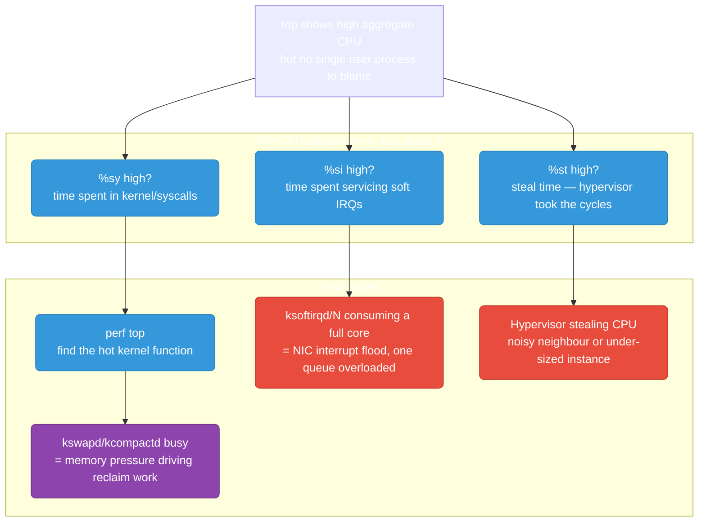
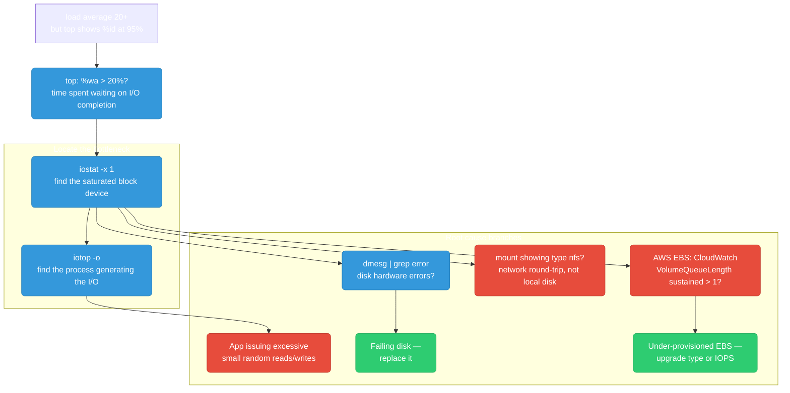
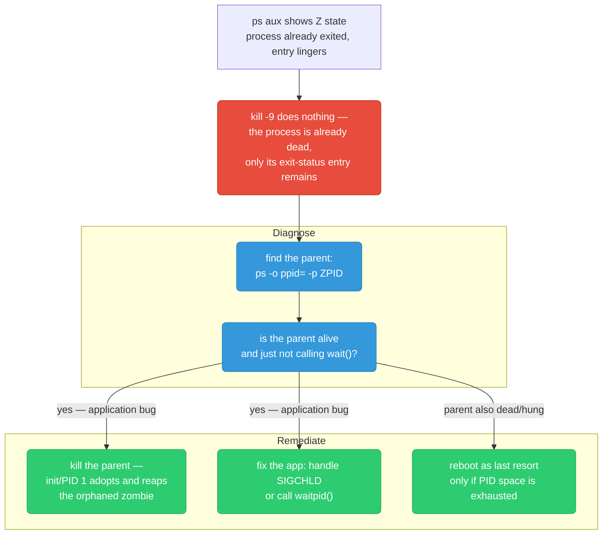
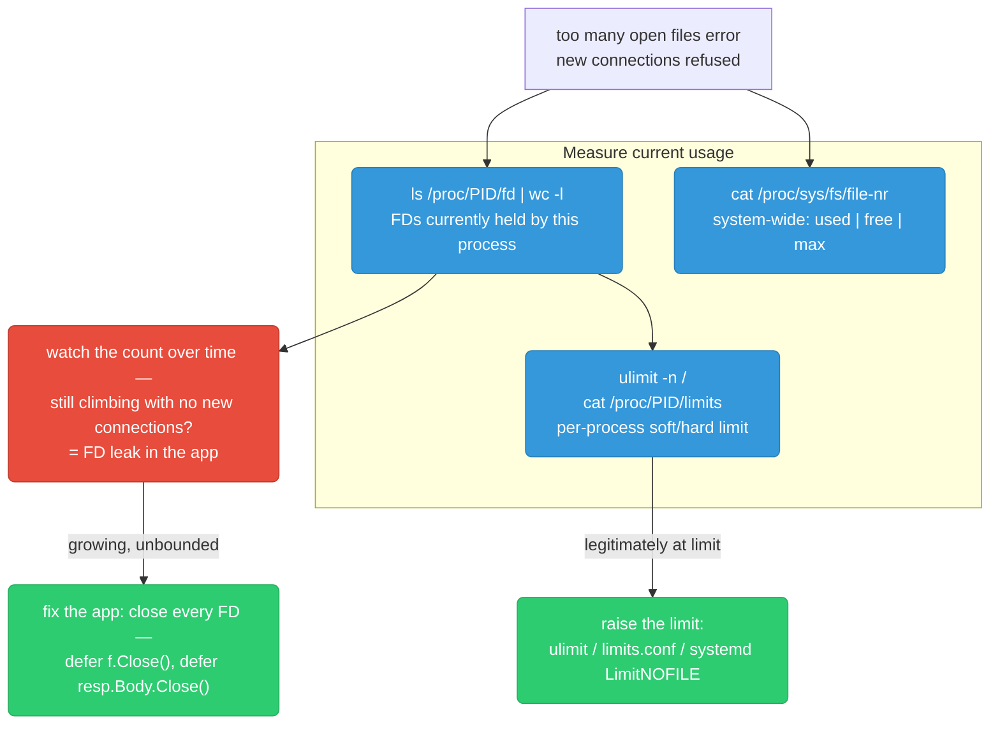
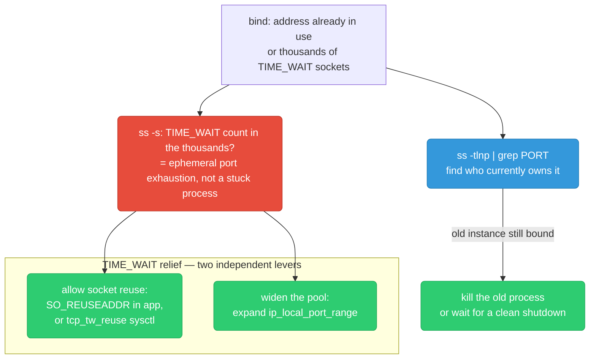
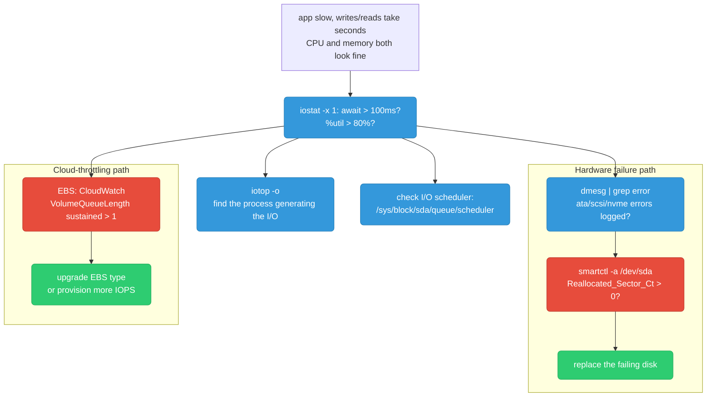
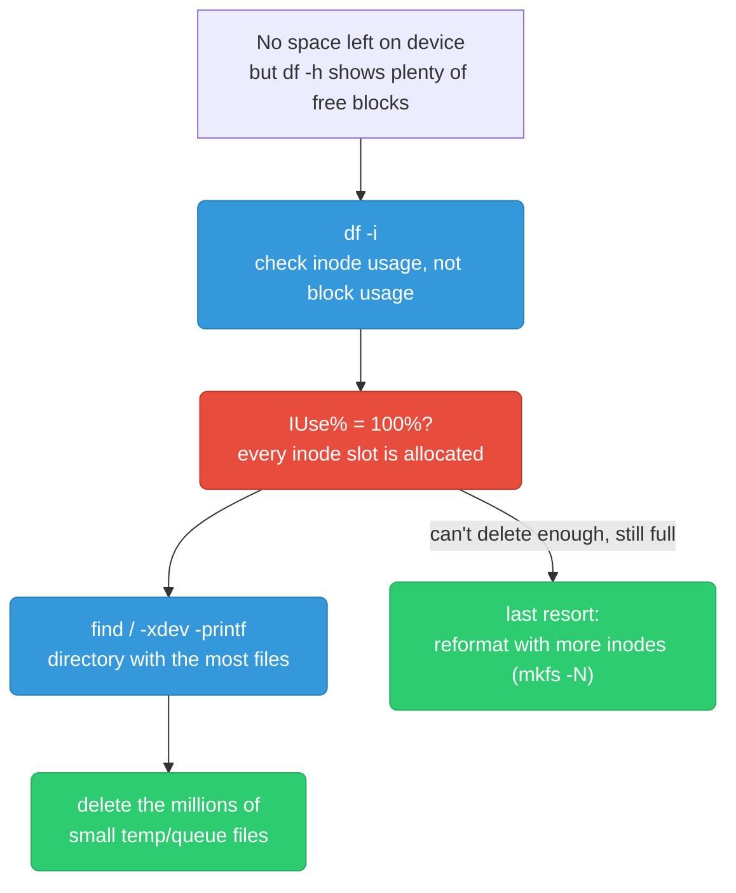
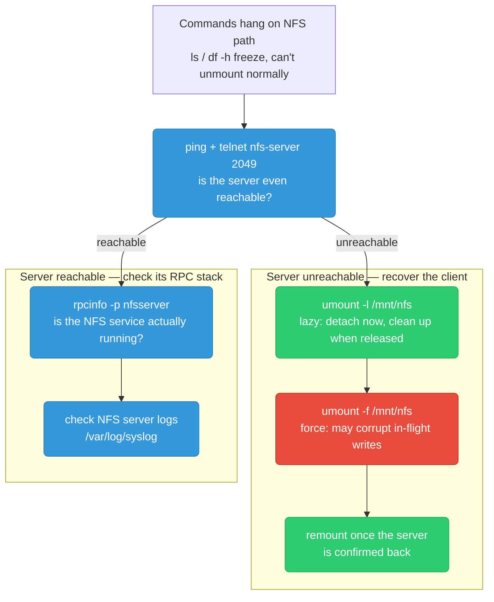
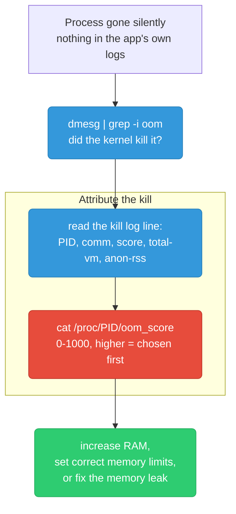
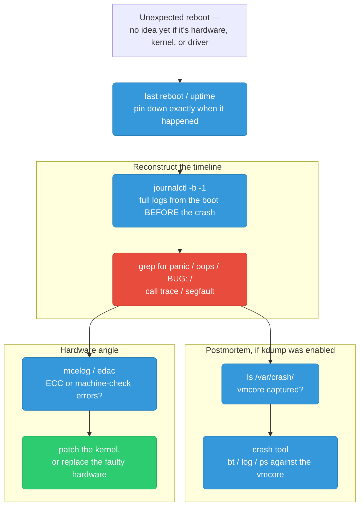

# Linux Debugging Scenarios

Ten failure patterns you'll actually hit operating Linux hosts in production — the symptom, a diagnostic flowchart, the commands that confirm the cause, and the prevention that stops it recurring.

<div class="quiz-progress" data-quiz-progress>
  <span class="quiz-progress-label">0/0 checks</span>
  <span class="quiz-progress-bar"><span class="quiz-progress-fill"></span></span>
</div>

---

## High CPU But `top` Shows Nothing Obvious

**Symptom:** System feels slow, load high, but no single user process shows high CPU in `top`. `%us` is low but `%sy` or `%si` is high.



```bash
top              # press 1 for per-CPU breakdown
                 # columns: %us %sy %ni %id %wa %hi %si %st

# %sy high — syscall/kernel overhead
perf top         # see hot kernel functions in real time
perf stat -a sleep 5   # aggregate counters

# %si high — soft IRQ (network packet processing)
cat /proc/softirqs        # see NET_RX/NET_TX counts per CPU
cat /proc/interrupts      # hardware interrupts per CPU
ethtool -l eth0           # check NIC queue count
# Fix: spread NIC queues across CPUs with irqbalance

# %st high — steal time (VM only)
# CPU cycles taken by hypervisor for other VMs
# Fix: move to dedicated instance, resize, or complain to cloud provider

# kswapd busy — memory pressure causing kernel to swap
vmstat 1         # si/so columns: swap in/out
free -h          # available memory
```

<div class="toggle-switch">
  <div class="toggle-buttons">
    <button data-toggle-opt="sy" class="active">%sy — kernel/syscall</button>
    <button data-toggle-opt="si" class="state-warn">%si — soft IRQ</button>
    <button data-toggle-opt="st" class="state-bad">%st — steal time</button>
  </div>
  <div class="toggle-panel active" data-toggle-panel="sy">
    Time spent executing in kernel mode on behalf of a process — syscalls, context switches, page faults. Use <code>perf top</code> to see which kernel function is hot. Often traces back to a kernel thread like <code>kswapd</code>/<code>kcompactd</code> working hard because of memory pressure, not the syscalls themselves.
  </div>
  <div class="toggle-panel" data-toggle-panel="si">
    Time spent servicing software interrupts, almost always network packet processing (<code>NET_RX</code>/<code>NET_TX</code>). Check <code>/proc/softirqs</code> and <code>/proc/interrupts</code> for a skewed distribution across CPUs — a single core pegged while others idle means the NIC's interrupts aren't spread out. Fix: enable RSS and run <code>irqbalance</code>.
  </div>
  <div class="toggle-panel" data-toggle-panel="st">
    CPU cycles the hypervisor took away to run other VMs on the same physical host — this only exists in virtualized/cloud environments. It is invisible to any per-process profiling on your box because the kernel never actually got the cycles to hand out. Fix: move to a dedicated/less contended instance, resize, or escalate to the cloud provider.
  </div>
</div>

**Prevention:** Alert on `node_cpu_seconds_total{mode="softirq"} > 15%` and `node_cpu_seconds_total{mode="steal"} > 10%` in Prometheus. For NIC floods, enable RSS and set `irqbalance` in systemd. Profile with `perf record -ag` on canary instances before problems reach prod.

<div class="quiz-card">
  <p class="quiz-q">A host shows 40% aggregate CPU usage in <code>top</code>, but no single user process is above 2%. What's the first thing to check, and why won't looking harder at the process list help?</p>
  <button class="quiz-reveal">Reveal answer</button>
  <div class="quiz-a" hidden>Press <code>1</code> in <code>top</code> to see the per-CPU breakdown and check <code>%sy</code>, <code>%si</code>, and <code>%st</code>. None of that CPU time is attributed to a user process at all — it's kernel/syscall overhead, soft-IRQ (network) processing, or hypervisor steal time, so no amount of scrolling the process list will surface a culprit. The fix is <code>perf top</code> for kernel-space hot spots, <code>/proc/softirqs</code> for interrupt distribution, or checking for steal time on a VM — not <code>ps</code>/<code>top</code>'s per-process view.</div>
</div>

---

## Load Average High But CPU Idle

**Symptom:** `load average` is 20+ but `top` shows `%id` at 95%. System sluggish. Classic I/O wait.



<div class="stepper">
  <div class="stepper-panels">
    <div class="stepper-panel active">
      <strong>1. Confirm it's actually I/O wait.</strong> <code>top</code> — if <code>%wa</code> is high while <code>%id</code> is also high, the CPUs are idle because processes are parked waiting on disk, not because there's nothing to do. Load average counts <code>R</code> (running) <em>and</em> <code>D</code> (uninterruptible sleep) processes, so a pile of blocked I/O shows up as load without touching CPU%.
    </div>
    <div class="stepper-panel">
      <strong>2. Find the saturated device.</strong> <code>iostat -x 1 5</code> — watch <code>await</code> (avg I/O wait time in ms, &gt;100ms is bad) and <code>%util</code> (device utilization, &gt;80% is saturated) per device. This tells you *which* disk is the bottleneck before you go looking for a process.
    </div>
    <div class="stepper-panel">
      <strong>3. Find the process doing it.</strong> <code>iotop -o</code> shows only processes actively doing I/O right now. If one process dominates, that's excessive small random I/O in the app — a code-level fix, not an infra one.
    </div>
    <div class="stepper-panel">
      <strong>4. Rule out hardware and cloud throttling.</strong> <code>dmesg | grep -iE "error|failure|ata|scsi|i/o"</code> for failing-disk symptoms; on AWS, check CloudWatch's <code>VolumeQueueLength</code> — sustained above 1 means the EBS volume is throttled, not failing, and the fix is more provisioned IOPS rather than a disk replacement.
    </div>
  </div>
  <div class="stepper-controls">
    <button class="stepper-prev">← Prev</button>
    <span class="stepper-dots"></span>
    <span class="stepper-label"></span>
    <button class="stepper-next">Next →</button>
  </div>
</div>

```bash
# Load average counts all RUNNABLE + UNINTERRUPTIBLE processes
# Uninterruptible = waiting for I/O — shows in load but not CPU %

top              # check %wa (iowait)

# Find the busy device
iostat -x 1 5
# Key columns:
# await   = avg I/O wait time (ms) — >100ms is bad
# %util   = device utilization — >80% is saturated
# r/s w/s = reads/writes per second

# Find the process doing the I/O
iotop -o         # -o = only show processes doing I/O
iotop -o -b -n 3 # batch mode, 3 iterations

# Check for disk errors
dmesg | grep -iE "error|failure|ata|scsi|i/o" | tail -20

# Check if EBS is throttled (AWS)
# CloudWatch: VolumeQueueLength > 1 sustained = throttled
# Fix: upgrade to io2 or increase IOPS provisioning
```

**Load average formula:** counts processes in `R` (running) + `D` (uninterruptible sleep, waiting for I/O). High I/O wait → many `D` state processes → high load, low CPU.

**Prevention:** Alert on `node_pressure_io_stalled_seconds_total` (PSI) before load spikes. Use `iostat` in node exporters; page at `await > 50ms` sustained. For EBS: provision io2 with explicit IOPS, set CloudWatch alarm on `VolumeQueueLength > 1`.

<div class="quiz-card">
  <p class="quiz-q">Load average is 20 on an 8-core box, but <code>top</code> shows <code>%id</code> at 95%. Is the CPU actually the bottleneck?</p>
  <button class="quiz-reveal">Reveal answer</button>
  <div class="quiz-a" hidden>No. Load average counts processes in the <code>R</code> (running/runnable) state <em>and</em> the <code>D</code> (uninterruptible sleep) state — a process blocked waiting on disk I/O still counts toward load even though it's consuming zero CPU. A high load with idle CPU is the classic signature of I/O wait, not CPU contention: the fix path is <code>iostat -x</code>/<code>iotop</code> to find the saturated device and the process driving it, not adding CPU capacity.</div>
</div>

---

## Zombie Process Accumulation

**Symptom:** `ps aux` shows many `Z` (zombie) processes. System may eventually run out of PIDs.



```bash
# Find zombies
ps aux | grep Z
# or
ps -eo pid,ppid,stat,comm | awk '$3 ~ /^Z/'

# Find the parent of a zombie
ps -o ppid= -p <zombie_pid>

# You CANNOT kill a zombie with kill -9 — it's already dead
# The zombie entry persists because the parent hasn't called wait()
# to collect the exit status

# Kill the parent — init (PID 1) will then reap all orphaned zombies
kill -9 <parent_pid>

# Check PID exhaustion
cat /proc/sys/kernel/pid_max   # default 32768
ps aux | wc -l                 # current process count

# Root cause: parent process creates children but doesn't handle SIGCHLD
# or never calls waitpid(). Fix in application code.
```

**Prevention:** Alert on `process_open_fds` (node exporter) or custom metric counting zombie processes (`ps -eo stat | grep -c Z`). Fix root cause in code: in Go `os/exec.Cmd.Wait()` always. Never fire-and-forget child processes.

<div class="quiz-card">
  <p class="quiz-q">You run <code>kill -9</code> against a zombie process's PID and it doesn't disappear. Is the kill failing, and what should you target instead?</p>
  <button class="quiz-reveal">Reveal answer</button>
  <div class="quiz-a" hidden>The kill isn't "failing" — a zombie has already exited, so there's no running process left to signal at all. What's left on the process table is just the exit-status entry, waiting for its parent to call <code>wait()</code>/<code>waitpid()</code>. Sending signals to the zombie's own PID can never clear it. The correct target is the <em>parent</em>: either fix the parent's code to reap children properly, or kill the parent itself so init (PID 1) adopts and reaps the orphaned zombie.</div>
</div>

---

## File Descriptor Exhaustion

**Symptom:** App logs `too many open files`. New connections refused. Existing connections may drop.



<div class="stepper">
  <div class="stepper-panels">
    <div class="stepper-panel active">
      <strong>1. Measure what this process is actually holding.</strong> <code>ls /proc/$PID/fd | wc -l</code> or <code>lsof -p $PID | wc -l</code> for a more detailed listing. This is the number to watch, not a one-time snapshot.
    </div>
    <div class="stepper-panel">
      <strong>2. Compare against the configured limit.</strong> <code>cat /proc/$PID/limits | grep "open files"</code> shows the soft and hard <code>nofile</code> ceiling this specific process is running under — separate from the system-wide total in <code>/proc/sys/fs/file-nr</code>.
    </div>
    <div class="stepper-panel">
      <strong>3. Watch the trend, not the snapshot.</strong> <code>watch -n 1 "ls /proc/$PID/fd | wc -l"</code> — a count that keeps climbing under steady traffic (not proportional to actual concurrent connections) means the app isn't closing something: sockets, files, or HTTP response bodies.
    </div>
    <div class="stepper-panel">
      <strong>4. Pick the right fix.</strong> If the count is stable but just legitimately large, raise the limit (<code>limits.conf</code> or <code>LimitNOFILE=</code> in the systemd unit). If it's climbing unbounded, raising the limit only delays the crash — the real fix is closing the leaked FDs in code.
    </div>
  </div>
  <div class="stepper-controls">
    <button class="stepper-prev">← Prev</button>
    <span class="stepper-dots"></span>
    <span class="stepper-label"></span>
    <button class="stepper-next">Next →</button>
  </div>
</div>

```bash
# Check per-process FD count
PID=$(pgrep myapp)
ls /proc/$PID/fd | wc -l
lsof -p $PID | wc -l         # more detailed

# Check current limit vs max
cat /proc/$PID/limits | grep "open files"

# System-wide FD usage: used | free | max
cat /proc/sys/fs/file-nr
# e.g.: 8192  0  1048576  → 8192 open, max 1M

# Increase per-process limit (persistent)
# /etc/security/limits.conf
echo "* soft nofile 65536" >> /etc/security/limits.conf
echo "* hard nofile 65536" >> /etc/security/limits.conf

# For systemd services:
# [Service]
# LimitNOFILE=65536

# Increase system-wide limit
sysctl -w fs.file-max=2097152
echo "fs.file-max = 2097152" >> /etc/sysctl.conf

# Detect FD leak: watch count over time
watch -n 1 "ls /proc/$PID/fd | wc -l"
```

**Prevention:** Export `process_open_fds / process_max_fds` via Prometheus process collector. Alert at 80% of limit. In Go: always `defer f.Close()` and `defer resp.Body.Close()`. Use `golangci-lint` with `bodyclose` linter to catch unclosed HTTP response bodies at CI time.

<div class="quiz-card">
  <p class="quiz-q">You bump <code>ulimit -n</code> from 1024 to 65536 to fix a "too many open files" error, and the error goes away for a day before coming back. What did the limit bump actually fix, and what didn't it fix?</p>
  <button class="quiz-reveal">Reveal answer</button>
  <div class="quiz-a" hidden>It only bought headroom — it didn't fix a leak. If the FD count is genuinely stable and was just legitimately larger than the old ceiling, raising the limit is the correct, permanent fix. But if the count is climbing unbounded (not proportional to real concurrent connections), that's an FD leak in the application — unclosed files or HTTP response bodies — and a higher limit just delays the same crash at a bigger number. The tell is watching the count over time with <code>watch -n 1 "ls /proc/$PID/fd | wc -l"</code>, not the one-time snapshot.</div>
</div>

---

## Port Already in Use / TIME_WAIT Accumulation

**Symptom:** Service fails to start: `bind: address already in use`. Or `ss` shows thousands of `TIME_WAIT` sockets causing port exhaustion.



```bash
# Find what's using the port
ss -tlnp | grep :8080
# or
lsof -i :8080

# Count TIME_WAIT sockets
ss -tan | grep TIME_WAIT | wc -l
ss -s   # summary: number of each socket state

# TIME_WAIT is normal — lasts 2×MSL (60s default)
# Problem: high-frequency connections exhaust ephemeral ports

# Enable TIME_WAIT socket reuse (safe for most cases)
sysctl -w net.ipv4.tcp_tw_reuse=1

# Expand ephemeral port range (default 32768-60999)
sysctl -w net.ipv4.ip_local_port_range="1024 65535"

# In application: set SO_REUSEADDR before bind()
# Go HTTP server does this automatically
# Immediate restart fix:
sysctl -w net.ipv4.tcp_fin_timeout=15  # reduce TIME_WAIT duration
```

<div class="toggle-switch">
  <div class="toggle-buttons">
    <button data-toggle-opt="stuck" class="active state-warn">Old process holding the port</button>
    <button data-toggle-opt="exhaustion" class="state-bad">TIME_WAIT port exhaustion</button>
  </div>
  <div class="toggle-panel active" data-toggle-panel="stuck">
    <code>ss -tlnp | grep :PORT</code> shows a live process already bound to it — usually a previous instance of the same service that didn't fully exit. Fix: kill that process (or wait for a graceful shutdown to finish) and retry the bind. No sysctl tuning needed here.
  </div>
  <div class="toggle-panel" data-toggle-panel="exhaustion">
    <code>ss -s</code> shows thousands of sockets in <code>TIME_WAIT</code>. This isn't a stuck process — <code>TIME_WAIT</code> is the normal, expected 2×MSL (default 60s) wait after a socket closes. The problem is high-frequency short-lived connections churning through the ephemeral port range faster than they can time out. Fix with either (or both) independent levers: enable <code>tcp_tw_reuse</code>/<code>SO_REUSEADDR</code> so closed sockets can be reused sooner, and widen <code>ip_local_port_range</code> so there are simply more ports to churn through.
  </div>
</div>

**Prevention:** Use connection pooling (keep-alive) so connections are reused instead of torn down per-request. In Go `http.Client`: set `MaxIdleConnsPerHost` to expected concurrency. Alert on `node_sockstat_TCP_tw > 10000`. Persist sysctl settings in `/etc/sysctl.d/` and apply via Ansible/Terraform.

<div class="quiz-card">
  <p class="quiz-q">A service that restarts frequently fails with "address already in use," and separately, another host shows thousands of sockets stuck in TIME_WAIT. Is TIME_WAIT itself the bug in either case?</p>
  <button class="quiz-reveal">Reveal answer</button>
  <div class="quiz-a" hidden>No — TIME_WAIT is normal, expected behavior that lasts 2×MSL (60s by default) after any socket closes; it exists to guarantee delayed duplicate packets don't get misdelivered to a new connection reusing the same tuple. It only becomes a production problem when a very high rate of short-lived connections churns through the ephemeral port range faster than sockets can clear TIME_WAIT — that's port exhaustion, fixed with <code>tcp_tw_reuse</code>/<code>SO_REUSEADDR</code> and/or a wider <code>ip_local_port_range</code>, not by treating TIME_WAIT as something to eliminate. The separate "address already in use" case is usually just a genuinely live old process still holding the port — a different problem entirely, solved by killing it, not by touching TIME_WAIT settings.</div>
</div>

---

## Disk I/O Latency Spike

**Symptom:** App is slow, no CPU/memory issue. Writes or reads taking seconds.



```bash
# Real-time I/O stats per device
iostat -x 1 5
# Key columns:
# Device  r/s   w/s   rMB/s  wMB/s  await  %util
# nvme0n1 10.0  50.0  0.5    2.0    250.0  95.0  ← await 250ms = bad

# Find which process is doing the I/O
iotop -o            # only show active processes
iotop -o -b -n 5    # non-interactive, 5 samples

# Check for disk errors
dmesg | grep -iE "error|ata|scsi|nvme|i/o err" | tail -20

# Check drive health (SMART)
smartctl -a /dev/sda
# Look for: Reallocated_Sector_Ct > 0 = bad sectors

# Check I/O scheduler
cat /sys/block/sda/queue/scheduler
# [mq-deadline] kyber none
# For SSD/NVMe: 'none' or 'mq-deadline' is best

# Simulate I/O to confirm
dd if=/dev/zero of=/tmp/test bs=1M count=1000 oflag=direct
# Check MB/s — compare with expected for disk type
```

**Prevention:** Alert on `node_disk_io_time_weighted_seconds_total` (saturation proxy) and `node_disk_read_time_seconds_total / node_disk_reads_completed_total` (latency per op). On AWS: use io2 Block Express for critical workloads, enable EBS burst balance alarm. Run `fio` benchmarks at instance provisioning time to establish baseline.

---

## Out of Inodes

**Symptom:** `No space left on device` but `df -h` shows free space. Writes fail.



```bash
# Check inode usage per filesystem
df -i
# Filesystem      Inodes  IUsed   IFree IUse%
# /dev/xvda1     6553600 6553600     0  100%  ← exhausted!

# Compare with block usage
df -h   # might show 40% used — space is fine, inodes are the issue

# Find directory with the most files (the culprit)
find / -xdev -printf '%h\n' 2>/dev/null | sort | uniq -c | sort -rn | head -10
# Output: 2847291 /var/spool/postfix/maildrop  ← likely culprit

# Count files in suspected directory
ls /var/spool/postfix/maildrop | wc -l

# Clean up (example: old temp files, mail queue, cache)
find /tmp -type f -mtime +7 -delete     # files older than 7 days
find /var/spool/postfix/maildrop -type f -delete

# Each file consumes 1 inode regardless of size — a directory full of
# zero-byte files can exhaust inodes on a filesystem that's nearly empty
# by block usage.
```

<div class="tab-group">
  <div class="tab-buttons">
    <button data-tab="mailqueue" class="active">Mail queue buildup</button>
    <button data-tab="tinyfiles">App-generated tiny files</button>
    <button data-tab="logrotate">Log rotation gone wrong</button>
  </div>
  <div class="tab-panels">
    <div class="tab-panel active" data-tab-panel="mailqueue">
      A misconfigured MTA (postfix, sendmail) can't deliver mail and keeps queuing it in <code>/var/spool/postfix/maildrop</code> or similar. Each stuck message is its own tiny file — millions of them consume every inode long before disk blocks run low. Fix: clear the queue and fix delivery, don't just delete blindly if messages matter.
    </div>
    <div class="tab-panel" data-tab-panel="tinyfiles">
      An application creating lock files, session files, or per-request temp files without ever cleaning them up. Common in naive caching layers or job queues that write one file per unit of work and never garbage-collect. Fix: bucket files into subdirectories (<code>tmp/ab/cd/abcdef...</code>) and add a reaper job, or move to a real store instead of the filesystem.
    </div>
    <div class="tab-panel" data-tab-panel="logrotate">
      <code>logrotate</code> configured to rotate frequently without a <code>maxfiles</code>/retention cap keeps creating <code>app.log.1</code>, <code>app.log.2</code>, ... indefinitely. Each rotated file is a new inode even if the total log volume in bytes is small. Fix: set an explicit retention count and prefer compression (<code>compress</code>) which doesn't reduce inode count but at least caps growth once paired with a rotation limit.
    </div>
  </div>
</div>

**Prevention:** Alert on `node_filesystem_files_free / node_filesystem_files < 0.10` (under 10% inodes free). For apps that generate many small files: use a subdirectory-per-bucket scheme (e.g. `tmp/ab/cd/abcdef...`). Configure log rotation with `maxfiles` limits.

<div class="quiz-card">
  <p class="quiz-q"><code>df -h</code> shows a filesystem at 40% block usage, yet writes are failing with "No space left on device." What metric does <code>df -h</code> not show, and what command reveals it?</p>
  <button class="quiz-reveal">Reveal answer</button>
  <div class="quiz-a" hidden><code>df -h</code> only reports block (space) usage — it says nothing about inode usage, a separate, fixed-size pool allocated at filesystem creation. Run <code>df -i</code> instead: if <code>IUse%</code> reads 100%, every inode slot is used even though plenty of disk blocks remain free, because each file consumes exactly one inode regardless of its size. A directory full of millions of near-empty files (mail queue spool, unbounded temp files, unrotated logs) can exhaust inodes on a filesystem that looks nearly empty by block usage.</div>
</div>

---

## NFS Mount Hanging

**Symptom:** Commands hang when accessing NFS mount. `ls` on mount point freezes. `df -h` hangs. Can't unmount normally.



```bash
# WARNING: don't run df -h or ls on the mount — they'll hang too

# Check if NFS server is reachable
ping nfs-server
telnet nfs-server 2049

# Check NFS mounts without hanging
cat /proc/mounts | grep nfs

# Lazy unmount (detaches mount point, cleans up when processes release)
umount -l /mnt/nfs

# Force unmount (may corrupt in-flight writes)
umount -f /mnt/nfs

# If processes are stuck in D state waiting for NFS
lsof | grep /mnt/nfs      # find processes
# D-state processes can only be killed by fixing the NFS server or rebooting

# Check NFS server RPC services
rpcinfo -p nfs-server
showmount -e nfs-server

# Mount options to prevent hanging (use in /etc/fstab):
# nfs-server:/export /mnt/nfs nfs soft,timeo=30,retrans=3,_netdev 0 0
# soft: return error instead of hanging forever
# timeo=30: timeout after 30 deciseconds
# _netdev: wait for network before mounting at boot
```

<div class="toggle-switch">
  <div class="toggle-buttons">
    <button data-toggle-opt="lazy" class="active state-ok">Lazy unmount (-l)</button>
    <button data-toggle-opt="force" class="state-bad">Force unmount (-f)</button>
  </div>
  <div class="toggle-panel active" data-toggle-panel="lazy">
    <code>umount -l /mnt/nfs</code> detaches the mount point from the filesystem tree immediately, but the actual filesystem stays busy in the background until every process still using it releases its reference. Safe first choice — no data corruption risk, and it unblocks new access to the path right away even while old handles drain.
  </div>
  <div class="toggle-panel" data-toggle-panel="force">
    <code>umount -f /mnt/nfs</code> forcibly severs the connection now, including any writes still in flight. This can corrupt data that hadn't finished being written to the server. Reach for it only when the lazy unmount isn't enough and you've accepted the risk — never as the default first move.
  </div>
</div>

**Prevention:** Always mount NFS with `soft,timeo=30,retrans=3` — never use hard mounts in production. Monitor NFS server availability with a synthetic probe. For K8s: prefer CSI drivers over direct NFS mounts; use PVCs with `ReadWriteMany` via EFS CSI driver which handles reconnect automatically.

<div class="quiz-card">
  <p class="quiz-q">An NFS mount hangs, and your instinct is to run <code>df -h</code> or <code>ls</code> on it to see how bad it is. What actually happens, and what should you check first instead?</p>
  <button class="quiz-reveal">Reveal answer</button>
  <div class="quiz-a" hidden>Both commands will hang too — any command that stats the mount point blocks the same way the original hung command did, so you've now got two stuck shells instead of one. Check server reachability first without touching the mount at all: <code>ping nfs-server</code> and <code>telnet nfs-server 2049</code>. This scenario is also the argument for the prevention rule: mounting with <code>soft,timeo=30,retrans=3</code> instead of a hard mount means the kernel returns an error after the timeout instead of blocking forever in the first place.</div>
</div>

---

## OOM Killer — Reading `dmesg`

**Symptom:** Process disappears without any error logs. Container/pod restarts unexpectedly.



```bash
# Check if OOM killer fired
dmesg | grep -iE "oom|killed process|out of memory"
journalctl -k | grep -i "oom\|killed process"

# Sample OOM kill log — what to look for:
# [1234567.890] Out of memory: Kill process 12345 (java) score 892 or sacrifice child
# [1234567.891] Killed process 12345 (java) total-vm:8192000kB, anon-rss:7890432kB
#
# Fields:
# score 892     → oom_score at time of kill (0-1000, higher = chosen first)
# total-vm      → virtual memory size
# anon-rss      → actual physical RAM used (this is what matters)

# Check oom_score of running processes (higher = killed first)
cat /proc/$(pgrep java)/oom_score

# Protect a process from OOM killer
echo -17 > /proc/$(pgrep critical-process)/oom_adj   # -17 = never kill

# Check memory at time of kill (the dmesg output shows a memory map)
# Look for: MemFree, Active, Inactive, Slab lines before the kill message

# For containers/K8s: exit code 137 = SIGKILL from OOM
# kubectl describe pod → Last State: OOMKilled
```

**Prevention:** Set memory `requests` = `limits` for Guaranteed QoS class in K8s (prevents OOM at pod level). Enable VPA to auto-tune limits. Alert on `container_memory_working_set_bytes / container_spec_memory_limit_bytes > 0.85`. Disable THP (`/sys/kernel/mm/transparent_hugepage/enabled = never`) for Redis/JVM workloads.

<div class="quiz-card">
  <p class="quiz-q">A process disappears with no error, warning, or crash entry anywhere in its own application logs. Where do you look, and why won't the app's own logging ever catch this?</p>
  <button class="quiz-reveal">Reveal answer</button>
  <div class="quiz-a" hidden>Check <code>dmesg | grep -iE "oom|killed process|out of memory"</code> (or <code>journalctl -k</code>). The OOM killer sends <code>SIGKILL</code> straight from the kernel when the system is critically low on memory — there's no signal handler, no exception, no chance for the process to write a final log line before it's gone. The kernel's own log is the only record: it shows the killed PID, its <code>oom_score</code> (0-1000, higher means more likely to be chosen), and the memory it held (<code>anon-rss</code> is the figure that matters, not <code>total-vm</code>). In Kubernetes this surfaces as exit code 137 and <code>Last State: OOMKilled</code>.</div>
</div>

---

## Kernel Panic / System Freeze — Reading Crash Dumps

**Symptom:** System rebooted unexpectedly. Need to find why — hardware error, kernel bug, or driver crash.



<div class="stepper">
  <div class="stepper-panels">
    <div class="stepper-panel active">
      <strong>1. Pin down when it happened.</strong> <code>last reboot</code> and <code>uptime</code> give you the exact reboot time, which you'll need to bound your log search — without it you're grepping through days of history for one event.
    </div>
    <div class="stepper-panel">
      <strong>2. Read the previous boot's logs, not the current one.</strong> <code>journalctl -b -1</code> pulls logs from the boot session <em>before</em> this one — the crash itself killed the current boot's early logging, so anything useful about the cause lives in the prior session. <code>journalctl -b -1 -p err</code> narrows to just errors.
    </div>
    <div class="stepper-panel">
      <strong>3. Look for the actual oops/panic signature.</strong> <code>dmesg | grep -iE "panic|oops|bug:|call trace|segfault|general protection"</code> — a real kernel oops includes a call trace with function names and offsets you can look up against the running kernel version.
    </div>
    <div class="stepper-panel">
      <strong>4. Check for a captured crash dump.</strong> If <code>kdump</code>/<code>kexec</code> was enabled beforehand, <code>/var/crash/</code> holds a full <code>vmcore</code> memory dump. Without it, you're limited to whatever dmesg/journalctl captured before the crash — which is exactly why enabling kdump ahead of time is this scenario's prevention rule, not an afterthought.
    </div>
    <div class="stepper-panel">
      <strong>5. Rule in or out a hardware cause.</strong> <code>mcelog --client</code> and <code>/sys/devices/system/edac/mc/mc0/ce_count</code> surface ECC/machine-check errors. A hardware root cause means replacing the part; a software root cause means patching the kernel or pinning the driver version.
    </div>
  </div>
  <div class="stepper-controls">
    <button class="stepper-prev">← Prev</button>
    <span class="stepper-dots"></span>
    <span class="stepper-label"></span>
    <button class="stepper-next">Next →</button>
  </div>
</div>

```bash
# When did the system reboot?
last reboot
uptime

# Read logs from the previous boot (before crash)
journalctl -b -1           # previous boot
journalctl -b -1 | tail -100  # last 100 lines before crash
journalctl -b -1 -p err    # only errors

# Look for kernel oops/panic in dmesg
dmesg | grep -iE "panic|oops|bug:|call trace|segfault|general protection"

# Sample kernel oops output:
# BUG: unable to handle kernel NULL pointer dereference at 0000000000000010
# IP: [<ffffffff8123abcd>] some_kernel_function+0x1a/0x80
# Call Trace:
#   [<ffffffff8123def0>] another_function+0x40/0x100
# This is a stack trace — look up the function names for the kernel version

# Check if kdump captured a crash dump
ls -lh /var/crash/
# vmcore file = full kernel memory dump at crash time

# Analyze with crash tool
crash /usr/lib/debug/lib/modules/$(uname -r)/vmlinux /var/crash/$(date +%Y-%m-%d)/vmcore
# Inside crash: bt (backtrace), log (dmesg), ps (processes at crash)

# Check for hardware memory errors (ECC errors, MCE)
mcelog --client                    # machine check exceptions
cat /sys/devices/system/edac/mc/mc0/ce_count   # correctable errors
```

<div class="toggle-switch">
  <div class="toggle-buttons">
    <button data-toggle-opt="panic" class="active state-bad">Kernel panic</button>
    <button data-toggle-opt="soft" class="state-warn">Soft lockup</button>
    <button data-toggle-opt="hard" class="state-bad">Hard lockup</button>
  </div>
  <div class="toggle-panel active" data-toggle-panel="panic">
    The kernel hits an unrecoverable error — a driver bug, a null pointer dereference, or a stack overflow in kernel space — and deliberately halts rather than continue in a corrupted state. This is what leaves the classic <code>BUG: unable to handle kernel NULL pointer dereference</code> call trace in the logs, and what a <code>kdump</code>-captured vmcore is most useful for diagnosing.
  </div>
  <div class="toggle-panel" data-toggle-panel="soft">
    Logged as <code>BUG: soft lockup - CPU#0 stuck for Ns</code> — a CPU has been stuck executing kernel code for more than ~20 seconds without yielding, but the system isn't fully dead: other CPUs and interrupts are still running. Often a spinlock held too long or an infinite loop in a driver or kernel module.
  </div>
  <div class="toggle-panel" data-toggle-panel="hard">
    The NMI (non-maskable interrupt) watchdog fires because a CPU is completely unresponsive, even to interrupts — a step worse than a soft lockup. This usually means the CPU is wedged at the hardware/firmware level, not just stuck in a bad loop, and often points toward a hardware or firmware issue rather than a pure software bug.
  </div>
</div>

**Prevention:** Enable `kdump`/`kexec` on all nodes so crashes leave a vmcore for postmortem. Use AWS SSM Parameter Store or CloudWatch to capture last-boot logs. Keep kernels patched and pin driver versions in AMI builds. Alert on `node_boot_time_seconds` changing unexpectedly (unexpected reboot detector).

<div class="quiz-card">
  <p class="quiz-q">A host rebooted unexpectedly. You run <code>dmesg</code> right after it comes back up, looking for the panic message, and find nothing useful. Why, and where should you actually look?</p>
  <button class="quiz-reveal">Reveal answer</button>
  <div class="quiz-a" hidden>The crash ended the previous boot session — the current <code>dmesg</code> buffer only holds logs from <em>this</em> boot, starting fresh after the reboot, so it never contains the panic itself. The fix is <code>journalctl -b -1</code>, which pulls logs from the boot session before the current one, where the actual oops/panic/call-trace lives. This is also why enabling <code>kdump</code>/<code>kexec</code> ahead of time matters as prevention: it captures a full <code>vmcore</code> memory dump at crash time for the <code>crash</code> tool to analyze, instead of relying only on whatever made it into the log before the kernel went down.</div>
</div>

---

## Quick Reference: Linux Debugging Commands

| Symptom | First command | What to look for |
|---------|--------------|-----------------|
| High CPU, nothing in top | `perf top` | Kernel function consuming cycles |
| High load, CPU idle | `iostat -x 1` | `await > 100ms`, `%util > 80%` |
| Zombies | `ps -eo pid,ppid,stat,comm \| awk '$3~/Z/'` | PPID of zombie |
| FD exhaustion | `lsof -p PID \| wc -l` | Count growing over time = leak |
| Port in use | `ss -tlnp \| grep :PORT` | PID holding the port |
| Slow I/O | `iotop -o` | Process with highest I/O |
| No space (but df is fine) | `df -i` | IUse% = 100% |
| NFS hang | `umount -l /mnt/nfs` | Then check server reachability |
| Process disappeared | `dmesg \| grep -i oom` | `Killed process` entry |
| Unexpected reboot | `journalctl -b -1 \| tail -50` | Last log lines before crash |
