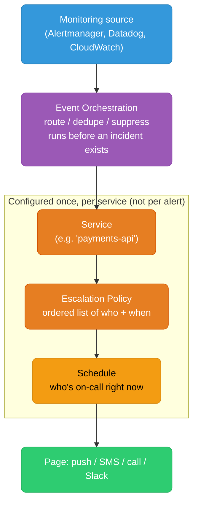
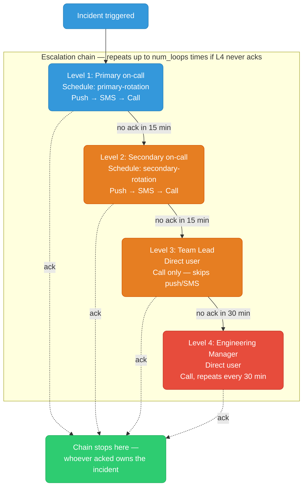
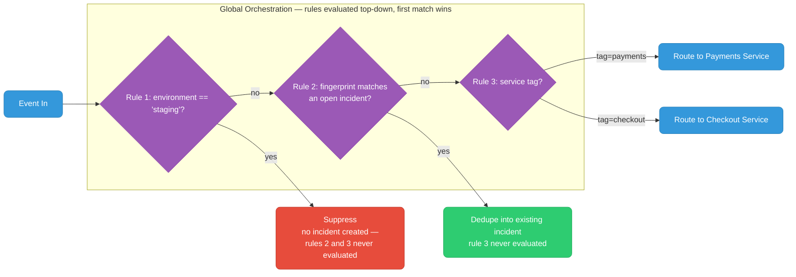
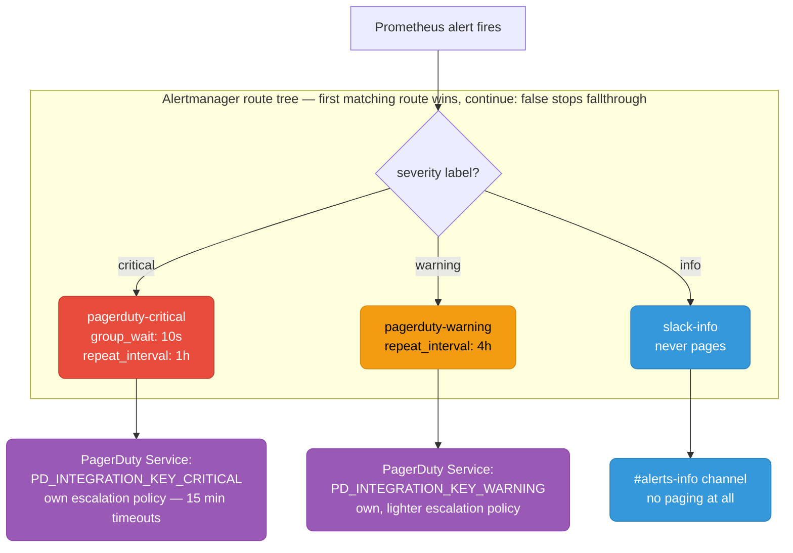
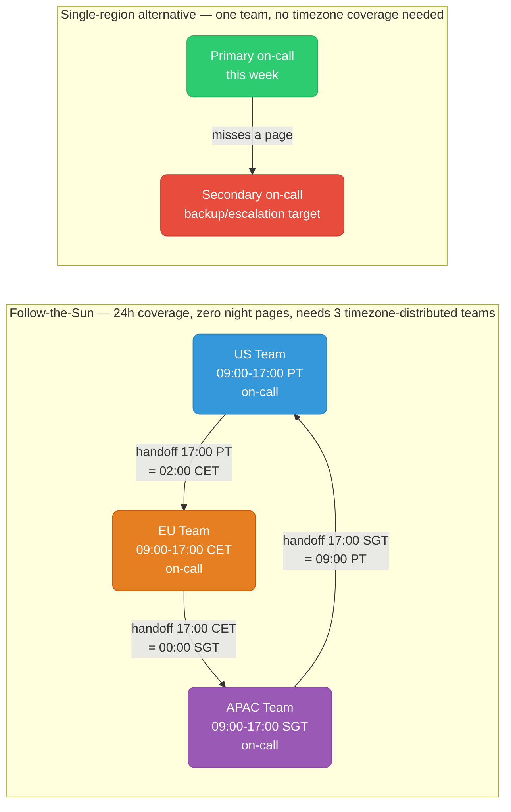
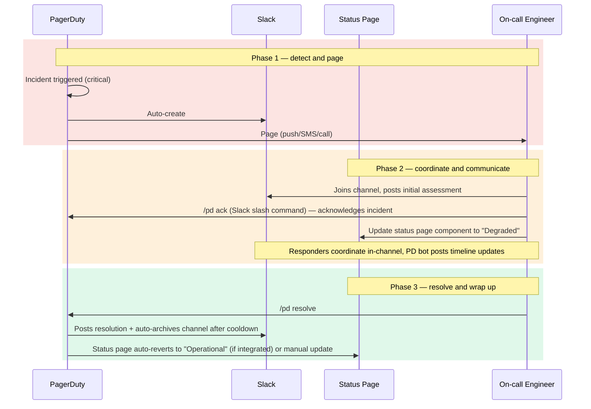
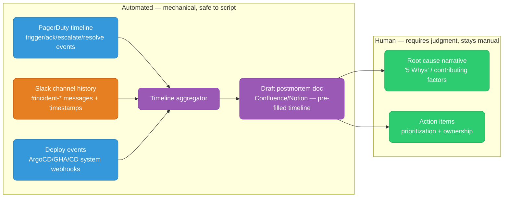

# On-Call Tooling

PagerDuty/Opsgenie configuration, Alertmanager integration, alert fatigue metrics, schedule design, and incident-command/ChatOps wiring. Complements [alerting-philosophy.md](../monitoring/alerting-philosophy.md) (what to alert on) and [alertmanager.md](../monitoring/alertmanager.md) (routing internals) — this file covers the on-call paging layer itself.

<div class="quiz-progress" data-quiz-progress>
  <span class="quiz-progress-label">0/0 checks</span>
  <span class="quiz-progress-bar"><span class="quiz-progress-fill"></span></span>
</div>

---

## 1. PagerDuty Core Concepts



| Concept | Definition |
|---------|------------|
| **Service** | A monitored component (e.g. `payments-api`, `checkout-db`). Alerts route into a Service. Has its own escalation policy, integration keys, and maintenance windows |
| **Escalation Policy** | Ordered list of who gets paged and when, if the previous level doesn't acknowledge in time |
| **Schedule** | Rotation defining who is "on-call" at any given moment — feeds into escalation policy layers |
| **Event Orchestration** (formerly Event Rules) | Rule engine that processes incoming events *before* they become incidents — routing, deduplication, suppression, enrichment |
| **Integration key (routing key)** | Per-service token used by senders (Alertmanager, CloudWatch, custom scripts) to submit events via the Events API v2 |

<div class="quiz-card">
  <p class="quiz-q">In the flow above, does Event Orchestration run before or after an event is assigned to a Service?</p>
  <button class="quiz-reveal">Reveal answer</button>
  <div class="quiz-a" hidden>Before. Event Orchestration is the rule engine that processes incoming events <em>before</em> they become incidents — routing, deduplication, suppression, and enrichment all happen first. By the time an event reaches a Service, orchestration has already decided whether it should even exist as an incident.</div>
</div>

---

## 2. Escalation Policy Example



| Level | Target | Timeout before escalating | Notification channels |
|-------|--------|---------------------------|------------------------|
| 1 | Primary on-call (schedule) | 15 min | Push → SMS → phone call |
| 2 | Secondary on-call (schedule) | 15 min | Push → SMS → phone call |
| 3 | Team lead (named user) | 30 min | Phone call (skip push/SMS — direct escalation) |
| 4 | Engineering manager (named user) | — (final level, repeats every 30 min until ack) | Phone call |

The walkthrough below traces the same chain as a sequence of events instead of a static diagram — useful for seeing exactly when the clock resets and when it doesn't:

<div class="stepper">
  <div class="stepper-panels">
    <div class="stepper-panel active">
      <strong>1. Page.</strong> An incident triggers on the <code>payments-api</code> service. Escalation Policy Level 1 fires: the primary on-call — whoever the <code>primary-rotation</code> schedule says is up right now — gets a push notification, then SMS, then a phone call if those go unanswered.
    </div>
    <div class="stepper-panel">
      <strong>2. No ack.</strong> 15 minutes pass with no acknowledgment from Level 1 — no <code>/pd ack</code>, no tap on the mobile push, nothing. The policy doesn't wait any longer than its configured timeout; there's no partial credit for "probably saw it."
    </div>
    <div class="stepper-panel">
      <strong>3. Escalate.</strong> The policy automatically moves to Level 2: the secondary on-call, via the same push → SMS → call sequence, with a fresh 15-minute timeout that starts from zero — Level 1's elapsed time doesn't carry over.
    </div>
    <div class="stepper-panel">
      <strong>4. Next level.</strong> If Level 2 also times out, escalation jumps to Level 3 — a named user (the team lead), skipping push/SMS entirely and going straight to a phone call, with a longer 30-minute timeout. If that times out too, Level 4 (the engineering manager) is paged and repeats every 30 minutes until someone finally acks.
    </div>
  </div>
  <div class="stepper-controls">
    <button class="stepper-prev">← Prev</button>
    <span class="stepper-dots"></span>
    <span class="stepper-label"></span>
    <button class="stepper-next">Next →</button>
  </div>
</div>

PagerDuty escalation policy as Terraform (common IaC pattern for reproducible on-call config):

```hcl
resource "pagerduty_escalation_policy" "payments_api" {
  name      = "payments-api-escalation"
  num_loops = 2 # repeat the whole chain twice before giving up

  rule {
    escalation_delay_in_minutes = 15
    target {
      type = "schedule_reference"
      id   = pagerduty_schedule.primary.id
    }
  }

  rule {
    escalation_delay_in_minutes = 15
    target {
      type = "schedule_reference"
      id   = pagerduty_schedule.secondary.id
    }
  }

  rule {
    escalation_delay_in_minutes = 30
    target {
      type = "user_reference"
      id   = pagerduty_user.team_lead.id
    }
  }

  rule {
    escalation_delay_in_minutes = 30
    target {
      type = "user_reference"
      id   = pagerduty_user.eng_manager.id
    }
  }
}
```

<div class="quiz-card">
  <p class="quiz-q">The primary on-call acknowledges the page 2 minutes after it fires. Does the escalation policy still page the secondary on-call at the 15-minute mark?</p>
  <button class="quiz-reveal">Reveal answer</button>
  <div class="quiz-a" hidden>No. Escalation only fires on a timeout with <em>no</em> acknowledgment — an ack at any point halts the chain right there, at whatever level acknowledged. The 15-minute timer isn't a countdown to a page that happens regardless; it's a countdown to escalation that an ack cancels entirely. This is a common misreading of escalation policies: people assume the chain is time-based and will page everyone eventually, when in fact it only advances past a level that never responds.</div>
</div>

---

## 3. Event Orchestration — Routing, Dedup, Suppression

Event Orchestration evaluates rules **before** an event becomes (or updates) an incident. Rules run top-down, first match per orchestration wins, with explicit fallthrough control.



### Rule examples (Global Orchestration, PD's rule DSL)

**Suppress non-prod alerts:**

```yaml
conditions:
  - expression: "event.custom_details.environment matches 'staging' or event.custom_details.environment matches 'dev'"
actions:
  suppress: true
```

**Dedupe by fingerprint** (PagerDuty does this automatically via `dedup_key` in the Events API v2 payload — the orchestration layer complements it for cross-source dedup):

```yaml
conditions:
  - expression: "event.custom_details.fingerprint exists"
actions:
  dedup_key: "event.custom_details.fingerprint" # groups events sharing this value into one incident
```

```json
// Sending client sets dedup_key directly via Events API v2 — same effect
{
  "routing_key": "<integration-key>",
  "event_action": "trigger",
  "dedup_key": "high-cpu-node-42",
  "payload": {
    "summary": "Node 42 CPU > 90% for 10m",
    "severity": "critical",
    "source": "prometheus"
  }
}
```

**Route by service tag:**

```yaml
conditions:
  - expression: "event.custom_details.service matches 'payments'"
actions:
  route_to: "PAYMENTS_SERVICE_ID"

conditions:
  - expression: "event.custom_details.service matches 'checkout'"
actions:
  route_to: "CHECKOUT_SERVICE_ID"
```

**Auto-resolve flapping noise** (a common orchestration pattern not always obvious): route low-confidence alerts through a time-window rule that only pages if the condition persists, rather than relying purely on the source system's `for:` duration.

<div class="quiz-card">
  <p class="quiz-q">An event comes from the staging environment, and its fingerprint also matches an already-open incident. In the rule flow above, which rule handles it — suppression or dedup?</p>
  <button class="quiz-reveal">Reveal answer</button>
  <div class="quiz-a" hidden>Suppression. Rules run top-down and the first match wins — Rule 1 (the staging check) is evaluated before Rule 2 (the fingerprint check), so the event is suppressed and dropped before dedup logic ever runs. Rule order isn't just documentation convenience here; it determines outcome. Putting the fingerprint check first would have produced a completely different result for the same event.</div>
</div>

---

## 4. Prometheus Alertmanager → PagerDuty Integration

```yaml
# alertmanager.yml
global:
  resolve_timeout: 5m

route:
  receiver: default-pagerduty
  group_by: [alertname, cluster, namespace]
  group_wait: 30s
  group_interval: 5m
  repeat_interval: 4h
  routes:
    - matchers:
        - severity = critical
      receiver: pagerduty-critical
      group_wait: 10s
      repeat_interval: 1h
      continue: false

    - matchers:
        - severity = warning
      receiver: pagerduty-warning
      repeat_interval: 4h
      continue: false

    - matchers:
        - severity = info
      receiver: slack-info # info-level never pages, goes to Slack only
      continue: false

receivers:
  - name: pagerduty-critical
    pagerduty_configs:
      - service_key: '<PD_INTEGRATION_KEY_CRITICAL>'   # legacy "Events API v1" field name; PD calls this routing_key in v2
        severity: 'critical'
        description: '{{ .CommonAnnotations.summary }}'
        details:
          firing: '{{ .Alerts.Firing | len }}'
          cluster: '{{ .CommonLabels.cluster }}'
          runbook: '{{ .CommonAnnotations.runbook_url }}'

  - name: pagerduty-warning
    pagerduty_configs:
      - service_key: '<PD_INTEGRATION_KEY_WARNING>'   # separate PD Service = separate escalation policy for warnings
        severity: 'warning'
        description: '{{ .CommonAnnotations.summary }}'

  - name: slack-info
    slack_configs:
      - api_url: '<SLACK_WEBHOOK_URL>'
        channel: '#alerts-info'
        send_resolved: true
```



**Why separate PD integration keys per severity, not one key with a severity field:** each PagerDuty Service maps to its own escalation policy. Routing `critical` and `warning` to different Services lets critical alerts hit the aggressive escalation policy (15-min timeouts, pages secondary/lead) while warnings sit on a lighter policy (Slack + delayed page, no 2am wakeups for non-urgent issues). One shared Service with just a severity annotation can't express that differentiated escalation behavior.

```bash
# Verify Alertmanager config before reload
amtool check-config alertmanager.yml

# Test a specific route resolves to the expected receiver without firing a real alert
amtool config routes test --config.file=alertmanager.yml severity=critical cluster=prod
```

<div class="quiz-card">
  <p class="quiz-q">Why can't a single PagerDuty Service with one integration key, tagged by a severity annotation, replicate the differentiated escalation behavior of two separate Services?</p>
  <button class="quiz-reveal">Reveal answer</button>
  <div class="quiz-a" hidden>Because escalation policy is configured per Service, not per alert or per annotation. A single shared Service has exactly one escalation policy — there's nowhere to attach "15-min aggressive timeouts for critical" and "lighter, delayed policy for warning" simultaneously. Splitting critical and warning into separate PagerDuty Services (and therefore separate integration keys) is what lets each severity carry its own escalation policy at all.</div>
</div>

---

## 5. Opsgenie as an Alternative

| Feature | PagerDuty | Opsgenie |
|---------|-----------|----------|
| Core model | Services + Escalation Policies + Schedules | Teams + Escalation Policies + Schedules (near-identical concepts) |
| Alert routing engine | Event Orchestration | Alert Policies + Routing rules |
| Dedup mechanism | `dedup_key` (Events API v2) | Alert deduplication via "Alert Deduplication" tab, similar fingerprint-based grouping |
| On-call rotation types | Weekly, daily, custom, follow-the-sun via multiple layered schedules | Same — plus native "rotation" templates for round robin, custom, and daily handoff times |
| ChatOps integration | Native Slack, MS Teams; auto incident channel creation | Native Slack, MS Teams; similar auto-channel features |
| Status page | PagerDuty Status Pages (own product) | Atlassian Statuspage (same parent company, tighter integration) |
| Pricing tier granularity | Per-user tiers (Professional/Business/Digital Ops) | Per-user tiers (Essentials/Standard/Enterprise) |
| Ecosystem | 700+ integrations, large community, mature Terraform provider | ~200+ integrations, smaller community, solid Terraform provider (owned by Atlassian, tight Jira Service Management tie-in) |
| Strongest fit | Org already invested in the PagerDuty ecosystem, dedicated incident command tooling (PD Incident Response product) | Org already on Atlassian stack (Jira, Confluence, Statuspage) — tighter native integration |

The table above is the full feature-by-feature comparison — worth scanning row by row when you're evaluating a migration. For the simpler "which one do we default to" question, it usually comes down to which ecosystem you're already in:

<div class="toggle-switch">
  <div class="toggle-buttons">
    <button data-toggle-opt="pd" class="active">PagerDuty</button>
    <button data-toggle-opt="og">Opsgenie</button>
  </div>
  <div class="toggle-panel active" data-toggle-panel="pd">
    <strong>Pick PagerDuty when...</strong> the org is already invested in its ecosystem — 700+ integrations is hard to beat for a heterogeneous toolchain, and the dedicated PagerDuty Incident Response product (auto incident channels, stakeholder communications, retrospective tooling) is a first-class product rather than a bolt-on. Its Terraform provider is the most mature of the two, which matters if escalation policies and schedules are managed as code across many services.
  </div>
  <div class="toggle-panel" data-toggle-panel="og">
    <strong>Pick Opsgenie when...</strong> the org already lives in the Atlassian stack — Jira Service Management, Confluence, and Atlassian Statuspage. Opsgenie's Statuspage integration is tighter because it's the same parent company, and incidents opened in Opsgenie can tie directly into existing Jira tickets without a separate integration layer. The ~200+ integration count is smaller than PagerDuty's, but that usually doesn't matter if the rest of the toolchain is already Atlassian-native.
  </div>
</div>

### Rotation types (both platforms support these; naming differs slightly)

| Rotation type | Pattern | Best for |
|---|---|---|
| Round robin | Fixed order, cycles through members on a fixed interval | Small teams, predictable handoff |
| Daily rotation | New person on-call every 24h, handoff at a fixed time (e.g. 9am) | Reduces single-person fatigue vs weekly |
| Weekly rotation | New person every 7 days | Most common default — balances context-retention vs burnout |
| Follow-the-sun | Region-based schedule layers so "on-call" always maps to someone in daytime hours | Global teams (US/EU/APAC) avoiding 3am pages entirely |
| Custom/override | Manual overrides layered on top of a base rotation | Holidays, planned leave, temporary swaps |

<div class="quiz-card">
  <p class="quiz-q">An org already runs Jira Service Management, Confluence, and Atlassian Statuspage for everything else. Based on ecosystem fit alone, which paging tool has the edge?</p>
  <button class="quiz-reveal">Reveal answer</button>
  <div class="quiz-a" hidden>Opsgenie — it's the same parent company as Statuspage and has a tight native tie-in to Jira Service Management, so incidents and status-page updates plug into tooling the org already has rather than requiring a separate integration layer. PagerDuty's larger integration count (700+ vs ~200+) doesn't outweigh that when the rest of the stack is already Atlassian-native.</div>
</div>

---

## 6. Alert Fatigue Metrics

If you can't measure fatigue, you can't argue for fixing the alert rules causing it.

| Metric | Formula | Healthy target | Signals a problem when |
|--------|---------|-----------------|--------------------------|
| Alerts per week per engineer | `total pages / on-call engineers / weeks` | < 2/week sustained | > 5/week — burnout risk, alert rules too sensitive |
| Actionable alert % | `(alerts leading to a real fix) / (total alerts) × 100` | > 90% | < 70% — alert threshold or condition needs tuning, likely flapping |
| MTTA (Mean Time to Acknowledge) | `sum(ack_time - trigger_time) / count(incidents)` | < 5 min for critical | Rising trend → either fatigue (ignoring pages) or escalation policy misconfigured |
| MTTR (Mean Time to Resolve) | `sum(resolve_time - trigger_time) / count(incidents)` | Service-SLO dependent | Rising trend with stable MTTA → runbooks/tooling gap, not paging gap |
| Repeat-alert rate | `% of alerts that are the same alertname within 24h` | < 10% | High → symptom of flapping or missing root-cause fix, not real new incidents |
| After-hours page rate | `% of pages outside working hours` | Team-dependent, track trend not absolute | Sudden spike → check for a new noisy alert rule shipped recently |

```promql
# Alerts fired per week, from Alertmanager's own metrics (requires alertmanager_notifications_total)
sum(increase(alertmanager_notifications_total{integration="pagerduty"}[7d]))

# Approximate actionable-alert tracking requires tagging resolution in PagerDuty
# (e.g., custom field "resolution: fixed | false-positive | flapping" set on incident close)
# then querying via PagerDuty Analytics API — not derivable from Prometheus alone.
```

PagerDuty's own Analytics tooling reports MTTA/MTTR natively per-service — pull that first before building custom dashboards; only build a custom exporter if you need cross-tool correlation (e.g., joining PD data with deploy events).

<div class="quiz-card">
  <p class="quiz-q">MTTA is rising while MTTR stays flat and low. Is that an alert-fatigue problem or a runbook/tooling problem?</p>
  <button class="quiz-reveal">Reveal answer</button>
  <div class="quiz-a" hidden>An alert-fatigue (or escalation-policy) problem, not a runbook gap. Rising MTTA means it's taking longer for someone to acknowledge a page in the first place — that points to people ignoring pages (fatigue) or a misconfigured escalation policy, not to a lack of remediation tooling. If MTTR were the one climbing while MTTA stayed low, that would instead point at a runbook/tooling gap — people ack quickly but the fix itself takes too long.</div>
</div>

---

## 7. On-Call Schedule Design Patterns



| Pattern | Structure | Tradeoff |
|---------|-----------|----------|
| **Follow-the-sun** | 3 regional teams, each covers their daytime hours, handoff at shift boundary | Requires 3 timezone-distributed teams; eliminates night pages entirely but needs solid handoff docs/tooling for context transfer |
| **Primary/secondary** | One primary on-call, one secondary as backup/escalation target | Standard baseline for single-region or single-timezone teams; secondary absorbs primary's missed pages |
| **Weekly rotation** | Full week per person | Good context retention (you remember what broke Monday by Friday); risk of end-of-week fatigue |
| **Daily rotation** | 24h per person | Lower fatigue per shift; worse context continuity — handoff notes become critical |
| **Split day/night shift** (single region) | Two people split a 24h day (e.g. 8am-8pm / 8pm-8am) | Avoids one person owning all-hours risk; doubles the on-call headcount requirement |

**Handoff checklist (should be automated where possible, not tribal knowledge):**
- Open incidents and their current status
- Any active suppressions/silences and why
- Recent deploys in the last 24h (correlate with any anomalies)
- Known flaky alerts currently being tuned

<div class="quiz-card">
  <p class="quiz-q">Which trades better context retention for higher end-of-week fatigue risk — weekly rotation or daily rotation?</p>
  <button class="quiz-reveal">Reveal answer</button>
  <div class="quiz-a" hidden>Weekly rotation. A full week per person means you still remember what broke Monday by Friday, which is good for context — but that same person is absorbing every page all week, which is the tradeoff against burnout. Daily rotation flips it: lower fatigue per shift, but context continuity gets worse, so handoff notes become critical to avoid re-learning the same incident from scratch every 24 hours.</div>
</div>

---

## 8. Incident Command Integration (ChatOps)



**Key integration points:**

| Integration | What it does |
|---|---|
| PagerDuty ↔ Slack app | `/pd trigger`, `/pd ack`, `/pd resolve` slash commands; incident status changes post automatically to the channel |
| Auto incident channel creation | PagerDuty (or a Slack workflow triggered by its webhook) creates `#incident-<date>-<service>` on trigger, invites the escalation chain automatically |
| Status page integration | PagerDuty Status Pages or Atlassian Statuspage — component status flips can be tied to incident lifecycle (manual is safer for customer-facing accuracy; full automation risks premature "resolved" announcements) |
| Video/bridge auto-start | Some orgs wire a Zoom/Meet link into the auto-created channel topic for P1s specifically |

```yaml
# Example: Alertmanager webhook -> custom service -> Slack channel creation
# (not native Alertmanager behavior; typically a small webhook receiver)
receivers:
  - name: incident-bot
    webhook_configs:
      - url: 'http://incident-bot.internal/webhook'
        send_resolved: true
```

```python
# incident-bot webhook receiver (sketch) — creates a Slack channel per new critical incident
@app.route("/webhook", methods=["POST"])
def handle_alert():
    payload = request.json
    for alert in payload["alerts"]:
        if alert["status"] == "firing" and alert["labels"]["severity"] == "critical":
            channel_name = f"incident-{date.today()}-{alert['labels']['service']}"
            slack_client.conversations_create(name=channel_name)
            slack_client.chat_postMessage(channel=channel_name, text=alert["annotations"]["summary"])
    return "", 200
```

<div class="quiz-card">
  <p class="quiz-q">Why might fully automating the status-page revert (auto-flip to "Operational" the instant PagerDuty marks the incident resolved) be riskier than doing that step manually?</p>
  <button class="quiz-reveal">Reveal answer</button>
  <div class="quiz-a" hidden>Because "resolved in PagerDuty" and "actually stable in production" aren't guaranteed to be the same moment — an engineer might resolve the incident the instant the immediate symptom clears, before confirming the fix is holding. A premature "Operational" announcement to customers is worse than a slightly delayed one, so manual is the safer default for anything customer-facing, even though full automation is technically straightforward to wire up.</div>
</div>

---

## 9. Post-Incident Review Automation

Manually reconstructing a timeline (who did what, when, from three different tools) is the slowest part of writing a postmortem. Automate the raw data collection; keep the analysis/narrative human-written.



**Data sources to pull automatically:**

| Source | What it contributes |
|---|---|
| PagerDuty incident log | Trigger time, ack time, escalation events, who was paged, resolve time — the incident's own MTTA/MTTR |
| Slack channel export | Human commentary, decisions made, links posted, screenshots — the "why" context PD alone doesn't have |
| Deploy/CD system (ArgoCD, GitHub Actions, Jenkins) | Correlate incident start time against recent deploys — often the actual root cause trigger |
| Monitoring system (Grafana annotations, Prometheus) | Graph snapshots at incident boundaries for the doc |

```python
# Sketch: pull PD incident log + Slack history, merge into a single timeline
import requests

def build_timeline(incident_id, slack_channel_id):
    pd_log = requests.get(
        f"https://api.pagerduty.com/incidents/{incident_id}/log_entries",
        headers={"Authorization": f"Token token={PD_API_KEY}"},
    ).json()["log_entries"]

    slack_msgs = slack_client.conversations_history(channel=slack_channel_id)["messages"]

    events = []
    for entry in pd_log:
        events.append({"ts": entry["created_at"], "source": "pagerduty", "text": entry["summary"]})
    for msg in slack_msgs:
        events.append({"ts": msg["ts"], "source": "slack", "text": msg.get("text", "")})

    return sorted(events, key=lambda e: e["ts"])
```

**What to automate vs keep manual:**

| Automate | Keep manual |
|---|---|
| Timeline event collection (PD + Slack + deploys) | Root cause analysis narrative |
| Draft doc creation with pre-filled timeline | "5 Whys" / contributing factors discussion |
| MTTA/MTTR/impact-duration calculation | Action item prioritization and ownership |
| Linking related past incidents (same alertname/service) | Blameless framing and psychological safety of the review meeting itself |

<div class="quiz-card">
  <p class="quiz-q">Should the root-cause narrative be pulled into the postmortem doc automatically, the same way the incident timeline is?</p>
  <button class="quiz-reveal">Reveal answer</button>
  <div class="quiz-a" hidden>No. Timeline collection (PagerDuty log entries, Slack messages, deploy events) is mechanical — merge and sort by timestamp, no judgment required — so it's safe and valuable to automate. The "why" behind the incident (5 Whys, contributing factors) requires human analysis of context an aggregator can't infer from timestamps alone, so it stays manual even though the raw data feeding into that discussion is auto-collected.</div>
</div>
