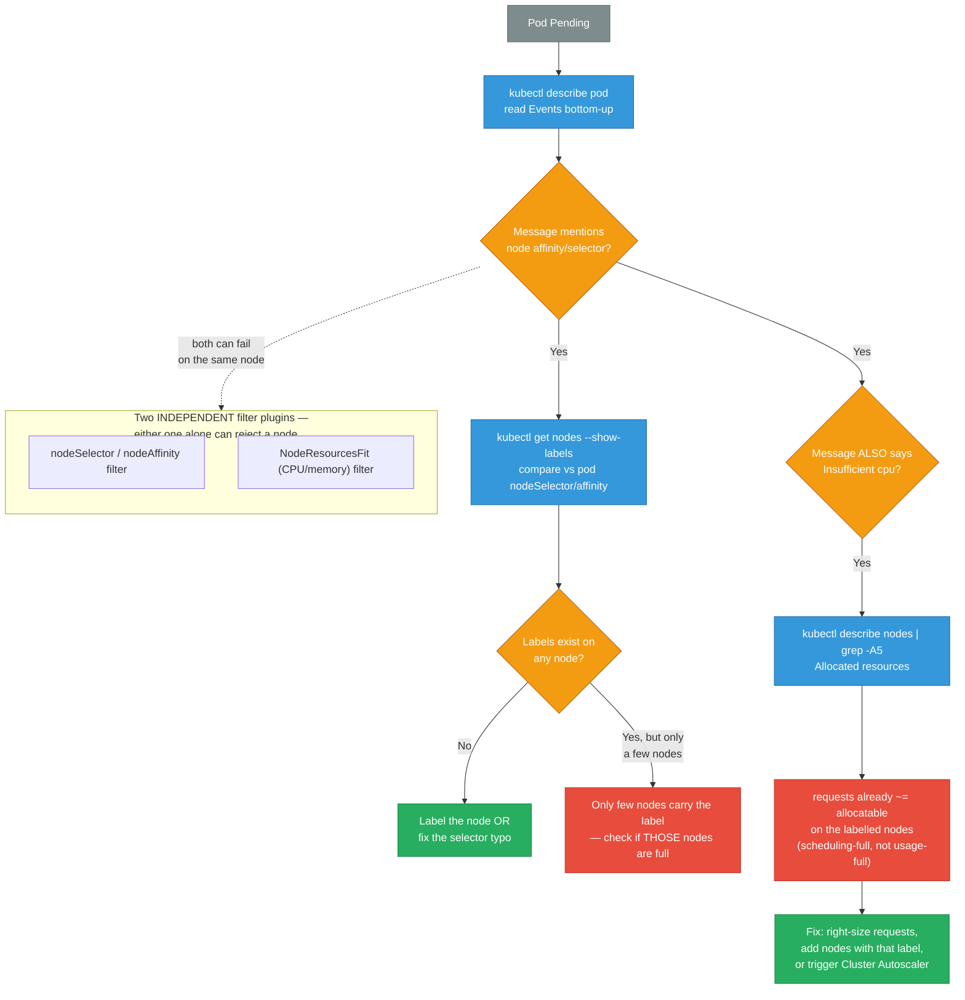
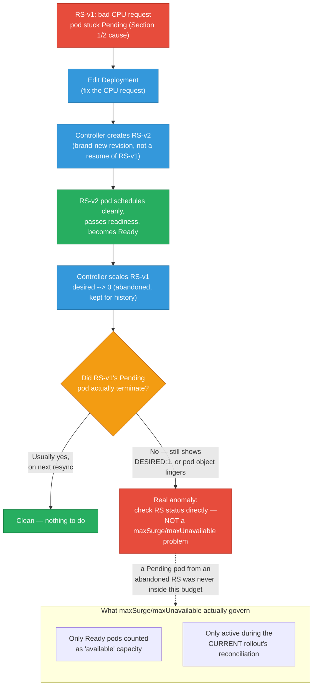
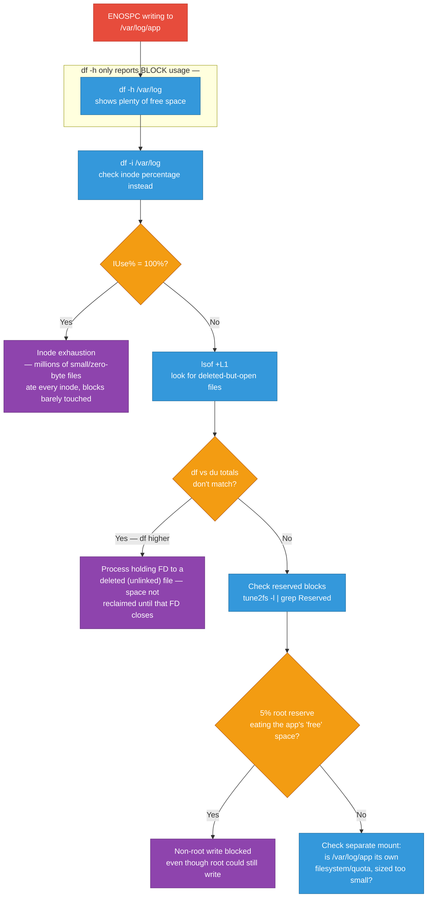
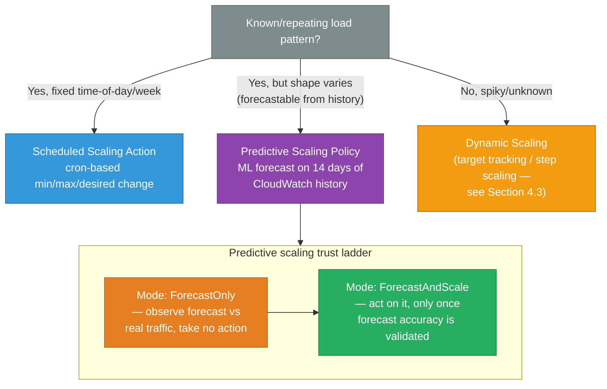
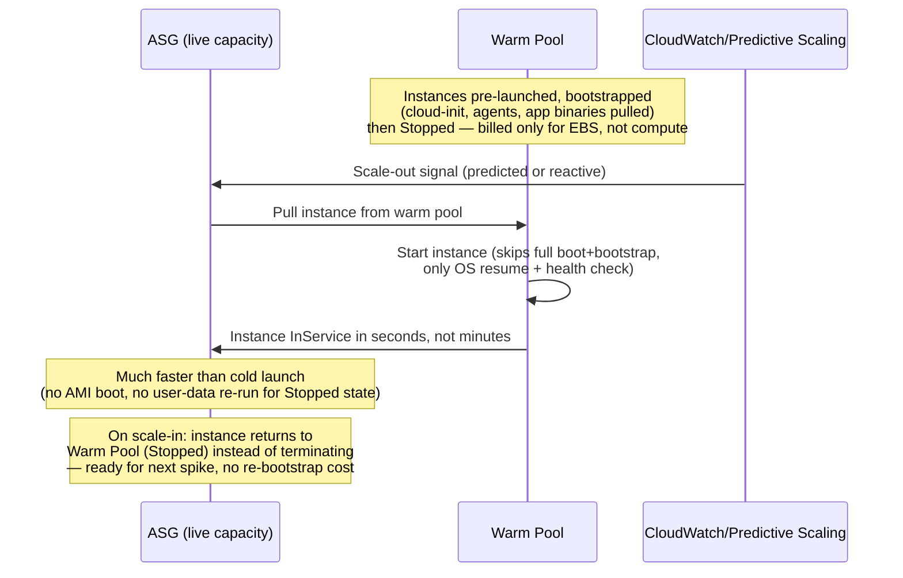
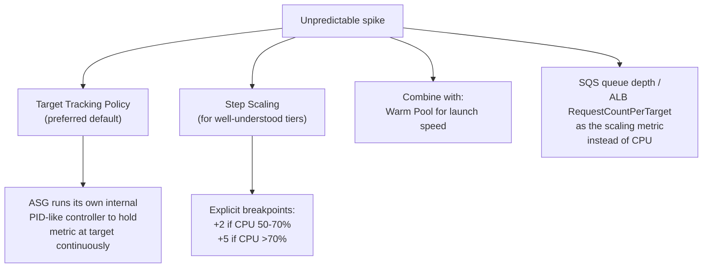
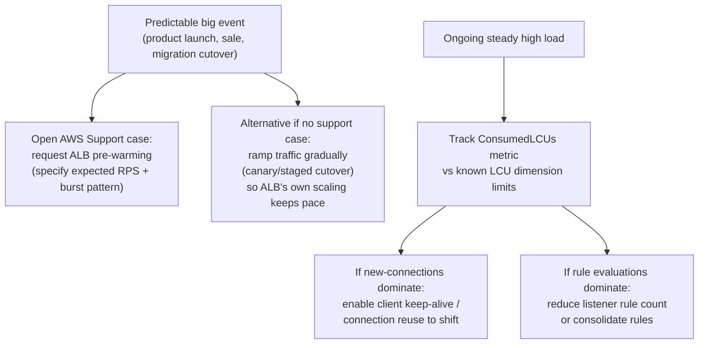

# Scheduling, Rollout, Linux Storage, and ASG Scaling — Deep Dive Scenarios

Companion to [k8s-scenarios.md](./k8s-scenarios.md), [linux-debugging.md](./linux-debugging.md), and [aws-scenarios.md](./aws-scenarios.md). Covers: pod scheduling failures caused by label/selector + resource pressure, why old pods survive a rolling update, `/var/log` "No space left on device" with free space showing, and ASG scaling strategies (predicted, warm pools, ALB/NLB LCU capacity planning, unpredictable bursts) — plus the exact math behind HPA/VPA rounding.

<div class="quiz-progress" data-quiz-progress>
  <span class="quiz-progress-label">0/0 checks</span>
  <span class="quiz-progress-bar"><span class="quiz-progress-fill"></span></span>
</div>

---

## 1. Pod Not Scheduling — Label/Selector Mismatch + Insufficient CPU

**Symptom:** New pod stuck in `Pending`. `kubectl describe pod` shows `FailedScheduling` citing both a node-affinity mismatch and insufficient CPU.

The scheduler runs **Filter plugins** in sequence per node — `nodeSelector`/`nodeAffinity` matching and `NodeResourcesFit` (CPU/memory) are independent filters. A node is eliminated if **any** filter fails, so both problems can co-exist and BOTH show up in the same event message.

```bash
kubectl describe pod <pod> -n <ns>
```

```
Events:
  Warning  FailedScheduling  <unknown>  default-scheduler
  0/5 nodes are available: 2 node(s) didn't match Pod's node affinity/selector,
  3 Insufficient cpu, 2 node(s) had untolerated taint {dedicated: gpu}.
```

Read this literally as: "of 5 nodes, 2 failed on label/selector, 3 failed on CPU, 2 also failed on taint" — a node can be double-counted across reasons (e.g. wrong label **and** short on CPU).



**Diagnosis commands:**

```bash
# What is the pod actually asking for?
kubectl get pod <pod> -o jsonpath='{.spec.nodeSelector}{"\n"}{.spec.affinity}{"\n"}'
kubectl get pod <pod> -o jsonpath='{.spec.containers[*].resources}'

# Which nodes carry the matching label?
kubectl get nodes -L <label-key>
kubectl get nodes --show-labels | grep <label-value>

# Of those nodes, how much CPU is actually free?
kubectl describe nodes <node> | grep -A8 "Allocated resources"
# Resource           Requests      Limits
# cpu                7800m (97%)   9000m (112%)   ← effectively full

# Cluster-wide view — sum of requests vs allocatable
kubectl get nodes -o json | jq -r '.items[] | "\(.metadata.name) \(.status.allocatable.cpu)"'
```

**Why "insufficient cpu" happens even when nodes look idle in `top`:** the scheduler only looks at **requested** CPU (the reservation), not actual usage. A node can be scheduling-full (sum of `requests.cpu` == allocatable) while CPU utilization is 10%. This is intentional — requests are a reservation contract, not a live measurement.

**Fixes, in order of speed:**
1. Fix the label typo / add the missing node label — fastest, no infra change.
2. If the label is correct but those specific nodes are full: scale that node group (manually or let Cluster Autoscaler react — it only triggers if it can find a node group whose template satisfies **both** the label and the resource ask).
3. Lower `requests.cpu` if it was over-provisioned relative to actual usage (check VPA recommendations or historical `container_cpu_usage_seconds_total`).

**Prevention:** Use `nodeAffinity` with `preferredDuringScheduling` instead of `required` where the constraint isn't a hard business requirement — it degrades to "best effort" instead of blocking. Tag node groups so Cluster Autoscaler's node-group templates carry the same labels the pod selects on, otherwise CA can't tell which group to expand for a label-constrained pod. Alert on `kube_node_status_allocatable_cpu_cores - kube_node_status_capacity_cpu_cores` trending to zero per label group, not just cluster-wide.

<div class="stepper">
  <div class="stepper-panels">
    <div class="stepper-panel active">
      <strong>1. Read the Events message literally.</strong> <code>kubectl describe pod</code> lists every reason a node was rejected, with a count — "2 node(s) didn't match... 3 Insufficient cpu... 2 node(s) had untolerated taint" is a tally across all nodes, and a single node can be counted under more than one reason.
    </div>
    <div class="stepper-panel">
      <strong>2. Isolate the label/affinity problem first.</strong> <code>kubectl get nodes --show-labels</code> against the pod's <code>nodeSelector</code>/<code>affinity</code>. Zero matching nodes means fix the label or the selector typo — done, no infra change needed.
    </div>
    <div class="stepper-panel">
      <strong>3. If nodes DO carry the label, check whether those specific nodes are full.</strong> <code>kubectl describe nodes &lt;node&gt; | grep -A8 "Allocated resources"</code> — remember this is <strong>requested</strong> CPU, not live usage, so a node can be scheduling-full while <code>top</code> shows it mostly idle.
    </div>
    <div class="stepper-panel">
      <strong>4. Fix in order of speed.</strong> Label typo/missing label first (instant, no infra change) → scale the labelled node group or let Cluster Autoscaler react (only works if CA's node-group template carries the same label) → lower over-provisioned <code>requests.cpu</code> if VPA/usage history shows headroom.
    </div>
  </div>
  <div class="stepper-controls">
    <button class="stepper-prev">← Prev</button>
    <span class="stepper-dots"></span>
    <span class="stepper-label"></span>
    <button class="stepper-next">Next →</button>
  </div>
</div>

<div class="quiz-card">
  <p class="quiz-q">A node shows 10% CPU utilization in <code>top</code>, yet the scheduler reports "Insufficient cpu" and refuses to place a new pod there. Is the scheduler wrong?</p>
  <button class="quiz-reveal">Reveal answer</button>
  <div class="quiz-a" hidden>No. The scheduler only looks at <strong>requested</strong> CPU (the reservation via <code>resources.requests.cpu</code>), not actual usage — this is intentional, since requests are a reservation contract, not a live measurement. A node can be scheduling-full (sum of requests == allocatable) while utilization is 10%, because the pods running there simply aren't using all of what they reserved. Fixing this means right-sizing over-provisioned requests, not "waiting for CPU to free up."</div>
</div>

---

## 2. Old Pod Stuck in Pending After Deployment Change — Rolling Update Math

**Symptom:** You update a Deployment (new image, or new resource request that no longer fits). The **new** pod is `Pending`, and the **old** pod that should have been replaced is still sitting around too — sometimes also `Pending` or not terminating.

This is almost never "stuck because of the rolling update strategy" in the sense of a bug — it's the *documented* surge math working exactly as configured, colliding with a scheduling constraint.

### The RollingUpdate math

```
maxSurge:       25%   → ceil(desiredReplicas × 0.25) extra pods allowed ABOVE desired
maxUnavailable: 25%   → floor(desiredReplicas × 0.25) pods allowed BELOW desired

Example: desiredReplicas = 4
maxSurge       = ceil(4 × 0.25) = 1   → up to 5 pods total during rollout
maxUnavailable = floor(4 × 0.25) = 1  → at least 3 pods must stay Ready
```

Kubernetes **rounds maxSurge up and maxUnavailable down** — this is deliberate: it biases toward keeping more capacity available during a rollout rather than less. So with 4 replicas you get exactly 1 pod of surge and 1 pod of allowed unavailability, never both rounding to 0.

```mermaid
sequenceDiagram
    participant D as Deployment Controller
    participant RSold as ReplicaSet v1 (OLD)
    participant RSnew as ReplicaSet v2 (NEW)
    participant SCHED as Scheduler

    Note over D,SCHED: desired=4, maxSurge=1, maxUnavailable=1<br/>Ceiling = desired + maxSurge = 5 pods max<br/>Floor = desired - maxUnavailable = 3 Ready pods min

    D->>RSold: scale down toward the floor<br/>(spend the maxUnavailable=1 budget up front)
    activate RSold
    RSold-->>D: now 3/3/3 — Ready count sits exactly at floor
    D->>RSnew: scale to 1 (create the surge pod)
    activate RSnew
    RSnew->>SCHED: pod v2-1 created, currently Pending

    rect rgb(80, 30, 30)
    Note over SCHED: v2-1 can't schedule — resource request too big,<br/>new nodeSelector, or a missing toleration
    SCHED-->>RSnew: pod stays Pending indefinitely, never becomes Ready
    end

    Note over D: Every resync: removing one more old pod would drop<br/>Ready below floor (3) --> refused. The unavailable<br/>budget is already fully spent, so this is the stable<br/>(stalled) state until v2-1 becomes schedulable.
    deactivate RSold
    deactivate RSnew

    Note over RSold,RSnew: Steady stalled state: 3 old (Ready) + 1 new (Pending).<br/>Not a leak — the controller is correctly refusing to<br/>breach the maxUnavailable contract while it waits<br/>forever for the new pod to become schedulable.
```



**This is the key mechanic:** the Deployment controller only scales the **old** ReplicaSet down once the **new** pods are `Ready` (not just `Running` — `Ready` means passing readiness probes). If the new pod can never be scheduled (resource increase doesn't fit, new label selector doesn't match any node, new toleration required), the rollout **stalls with the surge pod Pending and the old pod deliberately kept alive** — because deleting the old pod would breach `maxUnavailable` and the controller refuses to do that.

So the "stuck old pod" is not a leak — it is the controller correctly refusing to go below `desired - maxUnavailable` Ready replicas while it waits forever for the new pod to become schedulable.

**Diagnosis:**

```bash
kubectl rollout status deployment/<name>
# Waiting for deployment "<name>" rollout to finish: 1 out of 4 new replicas have been updated...

kubectl get rs -l app=<name>
# NAME            DESIRED   CURRENT   READY   AGE
# app-7c9d8f      3         3         3       2d   ← old RS, still holding 3 (desired-maxUnavailable)
# app-9f1a2b      1         1         0       5m   ← new RS, 1 pod Pending

kubectl describe pod <new-pod>
# Events: FailedScheduling — same causes as Section 1 (resources/affinity/taints)

# Confirm the strategy in effect
kubectl get deployment <name> -o jsonpath='{.spec.strategy}{"\n"}'
kubectl get deployment <name> -o jsonpath='{.status.updatedReplicas}/{.status.replicas}/{.status.availableReplicas}{"\n"}'
```

**Fixes:**
- If the new pod can't schedule because of a resource bump: right-size the request, or scale the node group / cluster autoscaler to add capacity.
- If it's a bad rollout (crashing new image): `kubectl rollout undo deployment/<name>` — this reverts to the old ReplicaSet and immediately un-stalls, restoring the old pods to full desired count.
- If you need the rollout to fail fast instead of hanging forever: set `progressDeadlineSeconds` (default 600s) — after that window the Deployment condition flips to `Progressing=False, Reason=ProgressDeadlineExceeded`, which you can alert on and auto-rollback from in CI/CD.
- Temporarily raise `maxUnavailable` (e.g. to 50%) only if you can tolerate the availability drop and need to force the old pods out to prove/reproduce a different issue — not a routine fix.

**Prevention:** Always set `progressDeadlineSeconds` well below your alert SLA so a bad rollout surfaces as a pipeline failure, not silent Pending pods days later. Use `kubectl apply --dry-run=server` in CI to catch new resource requests that clearly exceed node capacity before deploy. Pair rollout with a PodDisruptionBudget so `maxUnavailable` intent is enforced consistently even under voluntary disruptions (node drains) at the same time as a rollout.

<div class="stepper">
  <div class="stepper-panels">
    <div class="stepper-panel active">
      <strong>1. Confirm it's stalled, not just slow.</strong> <code>kubectl rollout status deployment/&lt;name&gt;</code> — if it's been sitting at "1 out of 4 new replicas have been updated" far longer than a normal rollout takes, move on to the next step instead of waiting it out.
    </div>
    <div class="stepper-panel">
      <strong>2. Read both ReplicaSets side by side.</strong> <code>kubectl get rs -l app=&lt;name&gt;</code> — the old RS holding exactly <code>desired - maxUnavailable</code> Ready pods, next to a new RS with 0 Ready, is the fingerprint of this exact scenario, not a random glitch.
    </div>
    <div class="stepper-panel">
      <strong>3. Find out why the new pod can't schedule.</strong> <code>kubectl describe pod &lt;new-pod&gt;</code> — the <code>FailedScheduling</code> reason is the same category of causes as Section 1 (resources, affinity, taints).
    </div>
    <div class="stepper-panel">
      <strong>4. Pick the fix that matches the cause.</strong> Resource bump that doesn't fit → right-size or add capacity. Bad image/crash → <code>kubectl rollout undo</code>. Either way, set <code>progressDeadlineSeconds</code> so the next bad rollout fails loudly instead of hanging silently.
    </div>
  </div>
  <div class="stepper-controls">
    <button class="stepper-prev">← Prev</button>
    <span class="stepper-dots"></span>
    <span class="stepper-label"></span>
    <button class="stepper-next">Next →</button>
  </div>
</div>

<div class="quiz-card">
  <p class="quiz-q">A Deployment has 3 replicas, with maxSurge and maxUnavailable both set to the default 25%. During a stalled rollout, how many old pods is the controller allowed to remove, and how many extra surge pods can it create?</p>
  <button class="quiz-reveal">Reveal answer</button>
  <div class="quiz-a" hidden>Zero old pods removable, one surge pod creatable. maxUnavailable = floor(3 × 0.25) = floor(0.75) = 0 — Kubernetes rounds unavailability DOWN, so at 3 replicas it guarantees zero forced unavailability. maxSurge = ceil(3 × 0.25) = ceil(0.75) = 1 — surge rounds UP, guaranteeing at least one extra slot even from a fraction. This asymmetric rounding is why small replica counts behave like "surge-only" rollouts: the controller can add capacity but is structurally forbidden from removing any old pod until the new one is Ready.</div>
</div>

---

## 2b. Orphaned Pending Pod Survives After You Fix the Deployment (Second Edit, New ReplicaSet)

**Symptom:** Deployment's pod is stuck `Pending` (bad `resources.requests.cpu`, as in Section 1/2). You edit the Deployment to fix the request — this creates a **second, new** ReplicaSet, and *its* pod comes up `Running`/`Ready` fine. But the **first** bad ReplicaSet's `Pending` pod is still sitting there, uncleared.

This is not the same problem as Section 2 — that was one rollout stalled waiting for its own surge pod. This is a **second** rollout succeeding while debris from the **first, abandoned** rollout attempt lingers.

**Why `maxSurge`/`maxUnavailable` cannot fix this — and why tuning them (`maxUnavailable: 0`, `maxSurge: 1`, or leaving them as percentages) has no effect on it:**

`maxSurge`/`maxUnavailable` are an *availability budget* — they cap how many **Ready** pods the controller may add above/remove below desired **while a rollout is actively in progress**. A pod that never became Ready (Pending) is not counted as "available" capacity in that budget at all, so it was never inside the mechanism these two fields govern. Once you make a second edit, the Deployment controller's reconciliation loop shifts its attention to the newest ReplicaSet against the current desired state — the first bad ReplicaSet becomes historical bookkeeping (kept for rollback, per `revisionHistoryLimit`), not part of the active surge/unavailable calculation. Changing the percentages, or switching to fixed integers (`maxUnavailable: 0`, `maxSurge: 1` — the standard zero-downtime pattern), only changes the *pace and safety margin of future rollouts*. It does not retroactively clean up a Pending pod from an already-abandoned ReplicaSet.



**Diagnosis — confirm whether it's actually stuck, or just cosmetic:**

```bash
# Which ReplicaSet does each pod really belong to?
kubectl get rs -l app=<name> -o wide
# NAME          DESIRED   CURRENT   READY   AGE
# app-v1-abcde  0         0         0       10m   ← should already be 0/0 if reconciled
# app-v2-fghij  3         3         3       2m    ← current, healthy

# If RS-v1 shows DESIRED > 0, the controller hasn't reconciled it — real anomaly
kubectl describe rs app-v1-abcde -n <ns>

# Confirm no Pending pods remain from the old RS
kubectl get pods -l app=<name> --field-selector=status.phase=Pending
```

If `RS-v1` already shows `DESIRED: 0` but a Pending pod object still exists, it's an orphaned pod object (rare, usually a stale API object) — delete it directly:

```bash
kubectl delete pod <old-pending-pod> -n <ns>
```

If `RS-v1` still shows `DESIRED: 1` (the controller genuinely never reconciled it down), force it explicitly instead of waiting:

```bash
kubectl scale rs app-v1-abcde --replicas=0 -n <ns>
```

**The actual fix so this doesn't need manual cleanup every time — `progressDeadlineSeconds`, not the surge/unavailable fields:**

```yaml
spec:
  progressDeadlineSeconds: 120   # fail the rollout fast instead of leaving a bad RS's pod hanging indefinitely
  revisionHistoryLimit: 10       # bounds how many old (scaled-to-0) RS objects are retained for rollback
  strategy:
    type: RollingUpdate
    rollingUpdate:
      maxSurge: 1          # fixed int — standard zero-downtime pattern, not a fix for this issue
      maxUnavailable: 0    # fixed int — same; controls availability budget, not orphan cleanup
```

With `progressDeadlineSeconds` set, a rollout that can't get its pod Ready in time flips the Deployment's `Progressing` condition to `False` with `Reason: ProgressDeadlineExceeded` — a reliable, alertable signal instead of a silently lingering Pending pod:

```bash
kubectl get deployment <name> -o jsonpath='{.status.conditions[?(@.type=="Progressing")]}'
```

Hook automation on that condition (a CronJob, an Argo Events sensor, or a simple controller) to auto-run `kubectl rollout undo deployment/<name>` or scale the offending RS to 0 — this replaces "someone notices manually" with "system reacts automatically."

**Prevent the bad rollout from ever happening, so there's nothing to clean up:**

```bash
# Catch bad resource requests before they reach the cluster
kubectl apply --dry-run=server -f deployment.yaml
```

Pair with an OPA/Kyverno admission policy that rejects `resources.requests.cpu` outside a sane bound relative to node capacity — this stops the entire class of problem (bad request → Pending pod → orphaned RS) at admission time, before a Pending pod is ever created.

**Optional — scheduled cleanup for any Pending pod that lingers past a threshold, regardless of cause:**

```bash
# Find Pending pods older than 10 minutes, across all RS generations
kubectl get pods -l app=<name> --field-selector=status.phase=Pending -o json | \
  jq -r --arg cutoff "$(date -u -v-10M +%Y-%m-%dT%H:%M:%SZ)" \
  '.items[] | select(.metadata.creationTimestamp < $cutoff) | .metadata.name' | \
  xargs -r kubectl delete pod -n <ns>
```

Run this as a CronJob (or use a maintained tool like `kube-janitor`) so orphaned Pending pods are swept up on a schedule instead of requiring someone to notice and act.

**Prevention:** Set `progressDeadlineSeconds` on every Deployment — it's the correct lever for "stop a bad rollout automatically," not `maxSurge`/`maxUnavailable`. Validate resource requests at CI/admission time so bad rollouts are rejected before they create Pending pods. If orphaned Pending pods are a recurring nuisance, add a scheduled sweep rather than tuning rollout percentages, since the percentages were never the mechanism responsible for cleanup in the first place.

<div class="quiz-card">
  <p class="quiz-q">A teammate tries to fix a lingering Pending pod from an abandoned ReplicaSet by changing maxUnavailable from a percentage to a fixed integer (0). It has no effect on the stuck pod. Why not?</p>
  <button class="quiz-reveal">Reveal answer</button>
  <div class="quiz-a" hidden>maxSurge/maxUnavailable are an availability budget that only governs Ready pods during the CURRENTLY active rollout's reconciliation. A Pending pod was never Ready, so it was never counted inside that budget in the first place — and once a second edit creates a new ReplicaSet, the controller's attention moves to reconciling that new revision; the old, abandoned ReplicaSet becomes historical bookkeeping (kept per revisionHistoryLimit), not part of the active surge/unavailable calculation. Changing the percentages only changes the pace/safety margin of FUTURE rollouts — it can't retroactively clean up debris from one that's already abandoned. The actual fix is confirming the anomaly (kubectl get rs -o wide) and either deleting the orphaned pod directly or scaling the old RS to 0.</div>
</div>

---

## 3. `/var/log/app` — "No Space Left on Device" With Plenty of Free Space

**Symptom:** `df -h` shows the filesystem holding `/var/log/app` at 40% used. The application still logs (or errors with) `ENOSPC` / "No space left on device" on write.

This is the classic split between **space** (blocks) and **inodes** (the metadata structures that track files). `df -h` reports block usage; it says nothing about inode usage. Two other causes masquerade as the same symptom: reserved blocks for root, and deleted-but-still-open files.



<div class="stepper">
  <div class="stepper-panels">
    <div class="stepper-panel active">
      <strong>1. Distrust `df -h` alone.</strong> It reports block usage only — it has no concept of "out of inodes." Free-looking block space and ENOSPC together are the tell that something else is exhausted.
    </div>
    <div class="stepper-panel">
      <strong>2. Rule out inode exhaustion.</strong> <code>df -i /var/log</code> — if <code>IUse%</code> is at or near 100%, stop here: every file (even 0 bytes) burns exactly one inode, so a runaway file-creation pattern can starve the inode table while blocks stay nearly empty.
    </div>
    <div class="stepper-panel">
      <strong>3. Rule out deleted-but-open file descriptors.</strong> Compare <code>df -h</code> against <code>du -sh</code> on the same directory — a gap between them is the signature. <code>lsof +L1</code> finds the process still holding an FD open on a file with <code>NLINK=0</code> (unlinked but not released).
    </div>
    <div class="stepper-panel">
      <strong>4. Rule out the ext4 root reserve.</strong> <code>tune2fs -l | grep "Reserved block count"</code> — the default 5% root-only reserve can look like "free" space in <code>df -h</code> that your non-root app is still blocked from using, especially on smaller partitions.
    </div>
    <div class="stepper-panel">
      <strong>5. Apply the fix that matches the cause.</strong> Inodes → delete/rotate excess files and fix the creation pattern. Deleted-open FD → truncate the FD or make the app reopen on SIGHUP/rotation. Reserved blocks → <code>tune2fs -m 1</code> on a data partition (never on root).
    </div>
  </div>
  <div class="stepper-controls">
    <button class="stepper-prev">← Prev</button>
    <span class="stepper-dots"></span>
    <span class="stepper-label"></span>
    <button class="stepper-next">Next →</button>
  </div>
</div>

<div class="toggle-switch">
  <div class="toggle-buttons">
    <button data-toggle-opt="inode" class="active state-bad">Inode exhaustion</button>
    <button data-toggle-opt="deletedfd" class="state-warn">Deleted-but-open FD</button>
    <button data-toggle-opt="reserved" class="state-ok">Reserved blocks</button>
  </div>
  <div class="toggle-panel active" data-toggle-panel="inode">
    <strong>Signature:</strong> <code>df -i</code> shows <code>IUse% ≈ 100%</code> while <code>df -h</code> shows plenty of free space. <strong>Cause:</strong> an app creating one file per request/session/job instead of appending, a crashed log rotation leaving thousands of unclean segments, or a retry loop leaking one lock file per attempt. <strong>Fix:</strong> delete/rotate the excess files and fix the creation pattern — reformatting with more inodes is a last resort requiring downtime.
  </div>
  <div class="toggle-panel" data-toggle-panel="deletedfd">
    <strong>Signature:</strong> <code>df -h</code> and <code>du -sh</code> disagree — <code>df</code> reports more used space than any directory listing accounts for. <strong>Cause:</strong> a process (often the app itself, sometimes right after <code>logrotate</code> ran) still holds an open FD to a file that was <code>rm</code>'d; the kernel won't release the blocks until every FD on it closes. <strong>Fix:</strong> <code>lsof +L1</code> to find it, truncate the FD directly for an immediate fix, and get the app reopening its log file on rotation (SIGHUP handler or <code>copytruncate</code>) so it stops recurring.
  </div>
  <div class="toggle-panel" data-toggle-panel="reserved">
    <strong>Signature:</strong> the numbers are close but not quite adding up — a non-root write fails with ENOSPC on a filesystem that still has single-digit percent free, and root could write fine. <strong>Cause:</strong> ext4's default 5% root reserve, which is real free space non-root processes simply aren't allowed to touch. <strong>Fix:</strong> <code>tune2fs -m 1</code> to drop the reserve on a data partition — never on the root filesystem, where that reserve exists to let root recover from a full disk at all.
  </div>
</div>

### 3.1 Inode exhaustion (your hint, and the most common real cause)

Every file — regardless of size, even a 0-byte file — consumes exactly one inode. An app that writes one log file per request, per connection, or per short-lived job (instead of appending to a rotated set of files) can exhaust the inode table while consuming almost no block space.

```bash
df -i /var/log
# Filesystem      Inodes   IUsed    IFree IUse%
# /dev/xvda1     655360   655348       12  100%   ← exhausted, space looks empty

find /var/log/app -xdev -type f | wc -l          # count files directly
find /var/log/app -xdev -printf '%h\n' | sort | uniq -c | sort -rn | head  # worst subdirectory

# Root cause patterns seen in practice:
# - App creates a new log file per request/session instead of appending
# - A crashed log rotation leaves thousands of .1, .2 ... .N segments never cleaned
# - A retry loop creates a lock file per attempt and never deletes it
```

**Fix:** delete/rotate the excess files, then fix the app's file-creation pattern (append to a single file + external rotation via `logrotate`, or bound the number of segments). Reformatting with more inodes (`mkfs -N <count>`) is a last resort requiring downtime/remount.

<div class="quiz-card">
  <p class="quiz-q"><code>df -h</code> reports a filesystem at 40% used, but writes are failing with "No space left on device." What's the one command that would immediately confirm inode exhaustion, and why does df -h miss it entirely?</p>
  <button class="quiz-reveal">Reveal answer</button>
  <div class="quiz-a" hidden><code>df -i</code> — it reports inode usage percentage, a completely separate resource from block usage. <code>df -h</code> only ever reports block (space) usage; it has no visibility into how many of the filesystem's fixed inode count are still free. Since every file consumes exactly one inode regardless of its size — even a 0-byte file — a filesystem can be nearly empty in blocks (low df -h%) while its inode table is 100% exhausted (high df -i IUse%), typically from an app creating one file per request/session instead of appending to a rotated set.</div>
</div>

### 3.2 Deleted-but-open file descriptors (space not actually free)

If a process holds an FD open on a file that was `rm`'d (e.g. `logrotate` rotated the file but the app kept writing to the old FD instead of reopening), the disk blocks are **not released** until the FD closes — even though the file no longer appears in any directory listing. `df -h` will show the space as used; `du` on the directory will show it as *not* there — a mismatch between `df` and `du` totals is the signature.

```bash
# Mismatch check
df -h /var/log            # e.g. reports 85% used
du -sh /var/log/app/*     # sums to far less — the gap is deleted-but-open files

# Find them
lsof +L1 /var/log/app 2>/dev/null
# COMMAND   PID  ... SIZE/OFF  NLINK  NAME
# app       4821 ...  8.2G       0    /var/log/app/app.log (deleted)
#                                ^^^ NLINK=0 means unlinked but still held open

# Fix without restarting the app: truncate the open FD directly
: > /proc/4821/fd/9   # fd number for the log file, from ls -la /proc/4821/fd

# Real fix: app must reopen its log file after rotation (SIGHUP handler,
# or use logrotate's copytruncate mode, or let the app use an
# already-rotation-aware logging library)
```

<div class="quiz-card">
  <p class="quiz-q"><code>df -h</code> reports 85% used on <code>/var/log</code>, but <code>du -sh /var/log/app/*</code> sums to far less than that. What does the gap between these two numbers tell you, and why doesn't just deleting more files fix it?</p>
  <button class="quiz-reveal">Reveal answer</button>
  <div class="quiz-a" hidden>The gap is disk blocks held by a deleted-but-still-open file — <code>df</code> reports actual block usage on the filesystem, while <code>du</code> only sums what's visible in the directory tree, and a file that's been <code>rm</code>'d no longer appears there even though its blocks are still allocated. Deleting more files doesn't help because the space isn't associated with any file you can find and remove — it's held by whatever process still has an open file descriptor (visible via <code>lsof +L1</code>, NLINK=0) pointing at the now-nameless inode. The blocks are only released when that FD closes, whether by killing/restarting the process or by truncating the FD directly (<code>: &gt; /proc/&lt;pid&gt;/fd/&lt;fd&gt;</code>).</div>
</div>

### 3.3 Reserved blocks (ext4 5% root reserve)

ext4 reserves ~5% of blocks for root by default (`tune2fs -l | grep "Reserved block count"`). On a large disk this is a lot of *real* free space that non-root processes are blocked from using — `df -h` shows it as used/unavailable to your app's `Use%` even though `root` could still write. This mostly bites on smaller partitions or containers with tight quotas.

```bash
tune2fs -l /dev/xvda1 | egrep "Block count|Reserved block count"
# Reserved block count: 5% of filesystem — reduce for data partitions:
tune2fs -m 1 /dev/xvda1   # drop reserve to 1% (do NOT do this on the root filesystem)
```

**Prevention:** Alert on `node_filesystem_files_free / node_filesystem_files < 0.10` (inodes) in addition to the usual `node_filesystem_avail_bytes` (blocks) — most dashboards only wire up the block-space alert. Alert separately on the `df` vs `du` gap (`node_filesystem_size_bytes - node_filesystem_avail_bytes` diverging from actual directory sizes) to catch deleted-but-open FDs. Configure `logrotate` with `copytruncate` for apps that can't handle SIGHUP-based reopen, and always cap `maxfiles`/`rotate` counts so segment count itself doesn't runaway into inode exhaustion.

---

## 4. AWS Auto Scaling Group — Handling Predicted vs Unpredictable Scale

Three different load shapes need three different scaling tools — using the wrong one means either wasted spend (over-provisioning for a spike that never comes) or a slow reaction (under-provisioning for one you should have seen coming):

<div class="tab-group">
  <div class="tab-buttons">
    <button data-tab="predictable" class="active">Predictable / recurring</button>
    <button data-tab="warmpool">Warm Pool (add-on)</button>
    <button data-tab="unpredictable">Unpredictable / bursty</button>
  </div>
  <div class="tab-panels">
    <div class="tab-panel active" data-tab-panel="predictable">
      <strong>Tool:</strong> Scheduled Scaling Action (deterministic, calendar-known) or Predictive Scaling (ML forecast from up to 14 days of history when the shape varies but the pattern repeats). <strong>Goal:</strong> capacity is already in place <em>before</em> the spike, instead of reacting to a CloudWatch threshold crossing after the fact.
    </div>
    <div class="tab-panel" data-tab-panel="warmpool">
      <strong>Tool:</strong> a pool of pre-bootstrapped instances kept outside live capacity, Stopped or Running. <strong>Goal:</strong> removes the boot + bootstrap time tax that both predictable and unpredictable scaling still pay on a cold EC2 launch — pairs with either of the other two modes rather than replacing them.
    </div>
    <div class="tab-panel" data-tab-panel="unpredictable">
      <strong>Tool:</strong> Target Tracking (self-tuning, preferred default) or Step Scaling (explicit breakpoints for well-understood tiers), driven by a metric that reflects real load — request count or queue depth, not just CPU. <strong>Goal:</strong> react fast and proportionally to a spike with no forecastable pattern.
    </div>
  </div>
</div>

### 4.1 Predicted / scheduled load — Predictive Scaling + Scheduled Actions

Use this when load has a **known recurring pattern** (daily peak at 9am, batch jobs at midnight, Monday-morning traffic) — you want capacity ready *before* the spike hits, not reacting after CloudWatch metrics cross a threshold (which is inherently a lagging signal).



**Scheduled scaling** — deterministic, for calendar-known events:

```bash
aws autoscaling put-scheduled-update-group-action \
  --auto-scaling-group-name my-asg \
  --scheduled-action-name scale-up-morning \
  --recurrence "0 8 * * MON-FRI" \
  --min-size 10 --max-size 40 --desired-capacity 20
```

**Predictive scaling** — AWS forecasts load from up to 14 days of CloudWatch history and pre-provisions capacity ahead of the predicted need (it schedules the scale-out early enough to cover instance boot + warm-up time):

```bash
aws autoscaling put-scaling-policy \
  --auto-scaling-group-name my-asg \
  --policy-name predictive-cpu \
  --policy-type PredictiveScaling \
  --predictive-scaling-configuration '{
    "MetricSpecifications": [{
      "TargetValue": 50,
      "PredefinedMetricPairSpecification": {
        "PredefinedMetricType": "ASGCPUUtilization"
      }
    }],
    "Mode": "ForecastAndScale",
    "SchedulingBufferTime": 300,
    "MaxCapacityBreachBehavior": "IncreaseMaxCapacity",
    "MaxCapacityBuffer": 10
  }'
```

- `Mode: ForecastOnly` first — validate the forecast against actual traffic in CloudWatch before letting it act (`ForecastAndScale`).
- `SchedulingBufferTime` — how many seconds *before* the predicted need instances should already be launching, to absorb boot + app warm-up latency.
- `MaxCapacityBreachBehavior: IncreaseMaxCapacity` lets predictive scaling temporarily raise `MaxSize` itself if the forecast requires more than your configured ceiling — otherwise a good forecast can still be capped by a stale `MaxSize`.

### 4.2 Warm Pools — cutting the "new instance" cold-start tax

Even with predictive/scheduled scaling firing early, a *new* EC2 instance still pays boot time + OS init + agent bootstrap + app startup before it's `InService`. A **Warm Pool** keeps a set of *pre-initialized, stopped (or running) instances* outside the live capacity count, ready to be attached almost instantly when the ASG needs to scale out.



```bash
aws autoscaling put-warm-pool \
  --auto-scaling-group-name my-asg \
  --pool-state Stopped \
  --min-size 5 \
  --max-group-prepared-capacity 20 \
  --instance-reuse-policy '{"ReuseOnScaleIn": true}'
```

- `pool-state Stopped` — cheapest (no compute charge, only EBS storage) but slightly slower to resume than `Running` (which is instant but you pay full compute for idle warm instances).
- `ReuseOnScaleIn: true` — when the ASG scales in, instances go back to the warm pool instead of being terminated, so the next scale-out reuses an already-bootstrapped instance instead of a fresh cold one.
- `max-group-prepared-capacity` — caps how many warm+live instances exist combined, so you don't over-provision cost.

**When to combine predictive scaling + warm pools:** predictive scaling tells you *when* the spike is coming; warm pools remove the boot-time tax so the capacity is actually ready by the time the spike arrives, instead of still being in `Pending`/user-data execution when traffic hits.

### 4.3 Unpredictable / bursty load — dynamic (reactive) scaling done right

For traffic with no discernible pattern (flash sale referral spikes, viral content, incident-driven retries), you can't pre-provision on a schedule — you need scaling that reacts fast and doesn't overshoot/undershoot.



**Target tracking** (recommended default — self-tuning, avoids manual threshold tuning):

```bash
aws autoscaling put-scaling-policy \
  --auto-scaling-group-name my-asg \
  --policy-name cpu-target-tracking \
  --policy-type TargetTrackingScaling \
  --target-tracking-configuration '{
    "PredefinedMetricSpecification": {
      "PredefinedMetricType": "ASGAverageCPUUtilization"
    },
    "TargetValue": 50.0
  }'
```

For request-driven services, target on **ALB RequestCountPerTarget** instead of CPU — CPU is a lagging indicator; request count/latency reacts faster and more directly reflects user-facing load:

```bash
aws autoscaling put-scaling-policy \
  --auto-scaling-group-name my-asg \
  --policy-name albrequest-target-tracking \
  --policy-type TargetTrackingScaling \
  --target-tracking-configuration '{
    "PredefinedMetricSpecification": {
      "PredefinedMetricType": "ALBRequestCountPerTarget",
      "ResourceLabel": "app/my-alb/50dc6c495c0c9188/targetgroup/my-tg/6d0ecf831eec9f09"
    },
    "TargetValue": 1000.0
  }'
```

**Practical levers for bursty workloads:**
- Shorten the ASG **default cooldown** and use **step scaling with multiple breakpoints** if you need aggressive, non-linear response (e.g. jump straight to +50% capacity above a hard CPU threshold instead of waiting for repeated small target-tracking corrections).
- Use **SQS `ApproximateNumberOfMessagesVisible`** as the scaling metric for queue-worker ASGs — it directly measures backlog, which is what you actually care about, not proxy CPU load.
- Combine with **Warm Pools** so the reactive scale-out isn't gated on cold boot time — this matters most for unpredictable bursts because there's no forecast to launch ahead of time.
- Set **`InstanceWarmup`** (health check grace + warm-up estimate used by target tracking's own internal math) accurately — if it's too short, the ASG's controller "sees" instances as fully contributing to the metric before they've actually ramped up, causing it to under-scale; too long and it over-scales while waiting.

**Prevention / operational guardrails common to all modes:** always set a sane `MaxSize` ceiling (predictive scaling can raise it automatically if `IncreaseMaxCapacity` is set — make sure that's intentional, not a runaway). Use mixed instance policies + Spot allocation strategies (`capacity-optimized`) to reduce the chance of `InsufficientInstanceCapacity` errors during a big scale-out. Alert on ASG activity history for `Failed` scaling activities (`describe-scaling-activities`), which silently cap your real capacity below `desired-capacity` if instance launches keep failing.

---

## 5. Load Balancers — Reserving LCU/NLCU Capacity for Predictable and Bursty Load

Full LCU/NLCU pricing math lives in [networking/load-balancers.md §11](../networking/load-balancers.md). This section is the operational angle: how to make sure you don't get throttled/degraded when load spikes, since ALB/NLB capacity isn't provisioned like an EC2 instance — it scales elastically but needs *warm-up* just like ASG instances do.

### 5.1 ALB — pre-warming and LCU headroom

ALB capacity is elastic but not instantaneous — a sudden 10x traffic jump can outrun the ALB's own auto-scaling of its internal nodes, especially for **new connections/sec** (the dimension that saturates fastest, per the LCU math: 1 LCU = only 25 new connections/sec).



```bash
# Watch which LCU dimension is dominating in CloudWatch
aws cloudwatch get-metric-statistics \
  --namespace AWS/ApplicationELB \
  --metric-name ConsumedLCUs \
  --dimensions Name=LoadBalancer,Value=app/my-alb/50dc6c495c0c9188 \
  --start-time "$(date -u -v-1H +%Y-%m-%dT%H:%M:%S)" \
  --end-time "$(date -u +%Y-%m-%dT%H:%M:%S)" \
  --period 60 --statistics Sum Maximum
```

- **Pre-warming** — for known large traffic events, AWS Support can pre-scale the ALB's internal capacity ahead of time. This is the direct equivalent of a Warm Pool for the load balancer layer itself; you must request it in advance (it isn't self-service).
- **Reduce new-connection pressure** — since new connections is usually the first dimension to saturate (25/sec per LCU is a low ceiling), ensure clients/CDN in front of the ALB use HTTP keep-alive so the ALB reuses TLS/TCP connections instead of paying the new-connection cost per request.
- **Multiple ALBs behind Route 53 weighted/latency routing** — spreads LCU consumption horizontally if a single ALB's practical elasticity ceiling becomes the bottleneck (rare, but happens at very large scale or multi-region setups).

### 5.2 NLB — capacity is closer to "free" but has its own edges

NLB scales more transparently (it's closer to raw flow-based load balancing with less per-request processing), but the same principle applies for TLS termination on NLB: TLS listeners get only 50 new connections/sec per NLCU vs 800 for plain TCP — an unpredictable burst of new TLS connections is the dimension most likely to bite. For high new-connection-rate + TLS workloads, terminate TLS at the target (pass-through TCP on the NLB) if you don't need the NLB to see plaintext, since that removes the TLS dimension entirely and puts you back on the much larger TCP/UDP LCU allowance.

### 5.3 General LB scaling checklist

- Set a CloudWatch alarm on `ConsumedLCUs` (ALB) / equivalent NLCU metric approaching a level you've empirically mapped to degraded p99 latency for your workload — LCUs are a *cost* metric but also a decent proxy for "is the LB itself becoming the bottleneck."
- For known traffic events, combine ALB pre-warming with ASG warm pools + predictive scaling on the target group side — the load balancer being ready is necessary but not sufficient if the targets behind it are still cold-booting.
- Target group health check `HealthyThresholdCount`/`Interval` should be tuned so newly launched (or warm-pool-resumed) instances are marked healthy and receive traffic as soon as they're actually ready — an overly conservative health check delays effective capacity even after ASG/warm pool have done their job.

---

## 6. The Math Behind Ceiling/Floor in Kubernetes Autoscaling

Kubernetes deliberately mixes `ceil()` and `floor()` in different controllers, and the choice is never arbitrary — it's always biased toward **more available capacity, never less**, even at the cost of slight over-provisioning.

### 6.1 HPA desired replica calculation — always ceiling

```
desiredReplicas = ceil( currentReplicas × ( currentMetricValue / desiredMetricValue ) )
```

```
Example — scale up:
currentReplicas = 3, currentValue (avg CPU) = 90%, target = 70%
desiredReplicas = ceil(3 × 90/70) = ceil(3.857) = 4

Example — scale down:
currentReplicas = 4, currentValue = 20%, target = 70%
desiredReplicas = ceil(4 × 20/70) = ceil(1.142) = 2
```

**Why always `ceil`, even when scaling down:** rounding down (`floor`) could under-provision — e.g. `1.142` floored to `1` might leave the fleet slightly short of the capacity the metric actually implies. `ceil` guarantees the computed replica count always covers at least the metric-implied need, erring toward one extra pod rather than one too few. This is the same "never round away from safety" principle used everywhere else in the scheduler/rollout math below.

Additional guardrails baked into the HPA algorithm, layered on top of the base formula:
- **Tolerance** (default 10%): if the ratio `currentValue/desiredValue` is within `[0.9, 1.1]`, HPA treats the metric as "at target" and does **not** recompute/act — this alone prevents flapping from noise without needing the stabilization window.
- **`stabilizationWindowSeconds`**: for scale-down (default 300s), HPA looks at the *maximum* recommended replica count over the whole window and uses that — not the latest single sample — so a brief dip doesn't trigger a premature scale-in.
- **`behavior.policies`** (`Pods` / `Percent` with `periodSeconds`): caps how many pods can be added/removed per period regardless of what the formula outputs, and `selectPolicy: Max`/`Min` picks between multiple policies.

### 6.2 RollingUpdate maxSurge/maxUnavailable — ceiling up, flooring down (Section 2, restated as pure math)

```
maxSurge (percent)       → ceil(desiredReplicas × percent)   — extra pods allowed ABOVE desired
maxUnavailable (percent) → floor(desiredReplicas × percent)  — pods allowed BELOW desired

Given desiredReplicas = 4, both set to 25%:
maxSurge       = ceil(4 × 0.25) = ceil(1.0) = 1
maxUnavailable = floor(4 × 0.25) = floor(1.0) = 1

Given desiredReplicas = 3, both set to 25%:
maxSurge       = ceil(3 × 0.25) = ceil(0.75) = 1   ← rounds UP, guarantees at least 1 surge slot
maxUnavailable = floor(3 × 0.25) = floor(0.75) = 0 ← rounds DOWN, guarantees zero forced unavailability
```

This asymmetric rounding is exactly why small replica counts (2-3 pods) at 25%/25% behave like "surge-only, never remove-first" rollouts — `maxUnavailable` floors to 0 while `maxSurge` still ceilings to 1. The controller is structurally incapable of ever reducing available capacity below what you asked for when the percentages round to fractions; it only ever rounds in the direction of *more* availability.

### 6.3 VPA target/bounds — percentile-based, not simple ceil/floor

VPA's Recommender doesn't use a single ceil/floor rule; it computes `Target`, `LowerBound`, `UpperBound` from an exponentially-decayed histogram of historical usage (roughly: target sits near the 90th percentile of observed usage with a safety margin added, lower/upper bounds are wider percentiles used to decide whether an eviction is warranted). The important operational rule that *does* look like flooring: VPA's Updater only evicts a pod if its current request falls **outside** `[LowerBound, UpperBound]` — i.e. it deliberately tolerates a band around the target instead of chasing the exact recommended value, which prevents constant eviction churn (the VPA analogue of HPA's 10% tolerance band).

### 6.4 Cluster Autoscaler node count — always ceiling on pods-per-node packing

When Cluster Autoscaler decides how many new nodes are needed to fit a batch of Pending pods, it effectively computes:

```
nodesNeeded = ceil( totalRequestedResourceOfPendingPods / allocatableResourcePerNode )
```

Again `ceil` — a fractional node requirement (e.g. 2.3 nodes' worth of pending pod requests) always rounds up to 3 nodes, never down to 2, because flooring would leave some pods permanently unschedulable. This is the same safety-biased rounding principle as HPA and RollingUpdate: **every autoscaling ceiling/floor decision in Kubernetes is chosen so that the system never knowingly ends up with less capacity than the raw math implies** — floor is only ever used for the "how much can I safely take away" side of an equation (`maxUnavailable`), never for "how much do I need to add."

### 6.5 One-table summary

| Controller | Formula direction | Rounds | Why |
|---|---|---|---|
| HPA desired replicas | scale up or down | `ceil` always | Never under-provision vs the metric ratio |
| RollingUpdate `maxSurge` | extra capacity allowed | `ceil` | Guarantee at least the surge budget you asked for |
| RollingUpdate `maxUnavailable` | capacity allowed to remove | `floor` | Never remove more than explicitly permitted |
| Cluster Autoscaler node count | nodes to add | `ceil` | Never leave pending pods unschedulable |
| VPA eviction decision | band check, not rounding | N/A (percentile bounds) | Avoid churn; act only outside tolerance band |

---

## Quick Reference

| Symptom | First command | Likely cause |
|---|---|---|
| Pod Pending, label+CPU both in event | `kubectl describe pod` → Events | Both filters failing on same/different nodes — fix label, then capacity |
| Old pod survives after Deployment update | `kubectl get rs -l app=<name>` | New pod can't schedule → controller won't breach `maxUnavailable` |
| Old Pending pod survives after a **second** fix/edit | `kubectl get rs -l app=<name> -o wide` | Orphaned RS from abandoned rollout — not a maxSurge/maxUnavailable issue; use `progressDeadlineSeconds` + scale RS to 0 |
| `ENOSPC` but `df -h` shows free space | `df -i /var/log` | Inode exhaustion (many small files) |
| `df -h` vs `du -sh` mismatch | `lsof +L1 <path>` | Deleted file still held open by a process |
| ASG under-provisioned for known event | `describe-scaling-activities` | Missing predictive scaling / scheduled action / warm pool |
| ASG slow to react to burst | Check `InstanceWarmup`, cooldown | No warm pool; cold boot tax on every scale-out |
| ALB/NLB degraded under sudden load | CloudWatch `ConsumedLCUs` | New-connection dimension saturated; needs pre-warm or keep-alive |
| HPA/rollout replica count looks "off" | Compute by hand | Remember: HPA=ceil both directions, maxSurge=ceil, maxUnavailable=floor |
