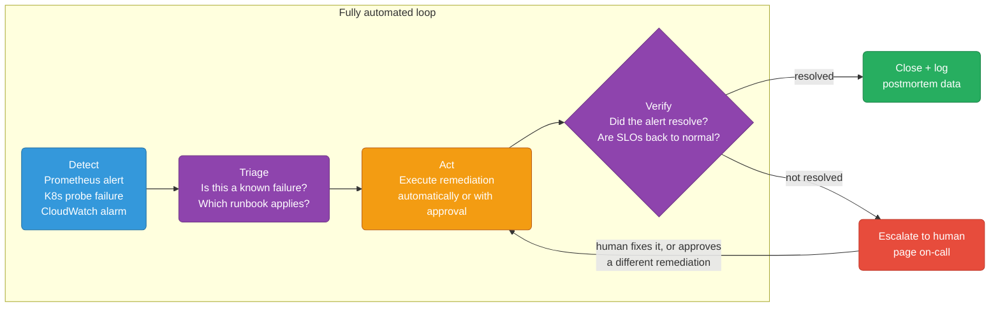
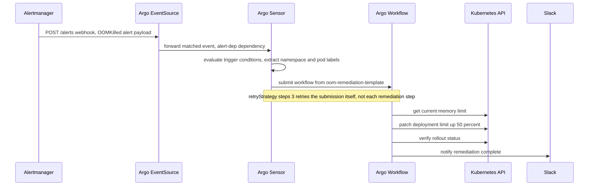
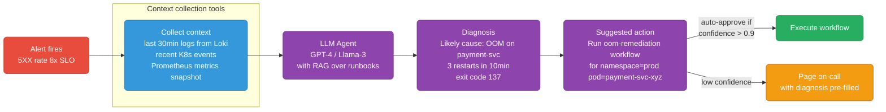

# Self-Healing Infrastructure & AIOps

Two converging ideas: automated remediation (SRE runbooks that run themselves) and AIOps (AI agents that diagnose and act on incidents). Both follow the same loop.

<div class="quiz-progress" data-quiz-progress>
  <span class="quiz-progress-label">0/0 checks</span>
  <span class="quiz-progress-bar"><span class="quiz-progress-fill"></span></span>
</div>

---

## The Self-Healing Loop



The difference from a standard alert: **Act** is automated, not a human. The human only gets involved if automation fails.

<div class="stepper">
  <div class="stepper-panels">
    <div class="stepper-panel active">
      <strong>1. Detect.</strong> A Prometheus alert fires, a Kubernetes liveness/readiness probe fails, or a CloudWatch alarm trips. Up to here it's identical to a normal on-call pipeline — nothing special has happened yet.
    </div>
    <div class="stepper-panel">
      <strong>2. Triage.</strong> The system asks two questions: is this a known failure mode, and which runbook applies? Without a confident answer to both, the safer move is routing straight to a human instead of guessing.
    </div>
    <div class="stepper-panel">
      <strong>3. Act.</strong> The matched runbook executes — either fully automatically, or gated behind an approval step (see the confidence-threshold logic further down). This is the step that differs from a plain alert-and-page pipeline.
    </div>
    <div class="stepper-panel">
      <strong>4. Verify.</strong> Did the alert clear? Are SLOs back inside their normal range? Verification is what separates "we ran a script" from "we actually fixed it."
    </div>
    <div class="stepper-panel">
      <strong>5a. Resolved &rarr; Close + log.</strong> The incident closes itself, and the remediation gets logged as postmortem data — the audit trail that answers "what's been auto-fixing itself in prod without anyone noticing?"
    </div>
    <div class="stepper-panel">
      <strong>5b. Not resolved &rarr; Escalate.</strong> A human gets paged, but the loop doesn't stop there — Escalate feeds straight back into Act, because a human's fix (or approval of a different remediation) still has to run through the same Act/Verify cycle.
    </div>
  </div>
  <div class="stepper-controls">
    <button class="stepper-prev">← Prev</button>
    <span class="stepper-dots"></span>
    <span class="stepper-label"></span>
    <button class="stepper-next">Next →</button>
  </div>
</div>

<div class="quiz-card">
  <p class="quiz-q">In the self-healing loop diagram, what happens immediately after "Escalate to human — page on-call"?</p>
  <button class="quiz-reveal">Reveal answer</button>
  <div class="quiz-a" hidden>The flow loops back into <strong>Act</strong>, not a dead end. Escalation hands the decision to a human, but their fix or approval still runs back through Act and then Verify again — the human only gets involved when automation fails, and they don't leave the loop once they're brought in.</div>
</div>

---

## Argo Events + Argo Workflows — Event-Driven Remediation

Argo Events watches for triggers (webhook, Prometheus alert, K8s event). Argo Workflows executes the remediation DAG.



<div class="stepper">
  <div class="stepper-panels">
    <div class="stepper-panel active">
      <strong>1. EventSource listens.</strong> An <code>EventSource</code> exposes a webhook endpoint (<code>/alerts</code>) that Prometheus Alertmanager POSTs to whenever an alert fires or resolves.
    </div>
    <div class="stepper-panel">
      <strong>2. Sensor matches and extracts.</strong> The <code>Sensor</code> watches the EventSource's dependency, checks its trigger conditions, and pulls fields straight out of the alert payload (<code>body.alerts.0.labels.namespace</code>, <code>...labels.pod</code>) into workflow parameters.
    </div>
    <div class="stepper-panel">
      <strong>3. Workflow submitted, with its own retry.</strong> The Sensor submits an Argo Workflow from the referenced <code>WorkflowTemplate</code>. <code>retryStrategy: steps: 3</code> lives on the trigger, so it retries the <em>submission</em> if that fails — it has nothing to do with retrying steps inside the workflow itself.
    </div>
    <div class="stepper-panel">
      <strong>4. Remediation DAG runs in order.</strong> Inside the workflow, steps execute strictly in sequence: get the current memory limit, patch it, verify the rollout, then notify. Because these are <code>steps</code> (not parallel tasks), <code>verify</code> never runs before <code>patch-limit</code> has already succeeded.
    </div>
    <div class="stepper-panel">
      <strong>5. Slack closes the loop.</strong> The final step posts to Slack — the same "close + log" idea from the self-healing loop above, just implemented as a workflow step instead of a separate system.
    </div>
  </div>
  <div class="stepper-controls">
    <button class="stepper-prev">← Prev</button>
    <span class="stepper-dots"></span>
    <span class="stepper-label"></span>
    <button class="stepper-next">Next →</button>
  </div>
</div>

### Install

```bash
kubectl create namespace argo-events
kubectl apply -n argo-events -f https://raw.githubusercontent.com/argoproj/argo-events/stable/manifests/install.yaml

kubectl create namespace argo
kubectl apply -n argo -f https://github.com/argoproj/argo-workflows/releases/download/v3.5.0/install.yaml
```

### Pattern: Prometheus alert → remediation workflow

```yaml
# EventSource: receives Prometheus Alertmanager webhooks
apiVersion: argoproj.io/v1alpha1
kind: EventSource
metadata:
  name: prometheus-alerts
  namespace: argo-events
spec:
  webhook:
    prometheus:
      port: "12000"
      endpoint: /alerts
      method: POST
---
# Sensor: maps alert name → workflow template to trigger
apiVersion: argoproj.io/v1alpha1
kind: Sensor
metadata:
  name: alert-remediator
  namespace: argo-events
spec:
  dependencies:
  - name: alert-dep
    eventSourceName: prometheus-alerts
    eventName: prometheus

  triggers:
  # OOMKilled → scale up memory
  - template:
      name: oom-remediation
      conditions: "alert-dep"
      argoWorkflow:
        operation: submit
        source:
          resource:
            apiVersion: argoproj.io/v1alpha1
            kind: Workflow
            metadata:
              generateName: oom-fix-
            spec:
              workflowTemplateRef:
                name: oom-remediation-template
        parameters:
        - src:
            dependencyName: alert-dep
            dataKey: body.alerts.0.labels.namespace
          dest: spec.arguments.parameters.0.value
        - src:
            dependencyName: alert-dep
            dataKey: body.alerts.0.labels.pod
          dest: spec.arguments.parameters.1.value
    retryStrategy:
      steps: 3
```

### Remediation workflow templates

```yaml
# Template 1: OOMKilled — patch memory limit up 50%
apiVersion: argoproj.io/v1alpha1
kind: WorkflowTemplate
metadata:
  name: oom-remediation
  namespace: argo
spec:
  arguments:
    parameters:
    - name: namespace
    - name: pod

  entrypoint: remediate
  templates:
  - name: remediate
    steps:
    - - name: get-current-limit
        template: kubectl-get-limit

    - - name: patch-limit
        template: kubectl-patch-limit
        arguments:
          parameters:
          - name: new_limit
            value: "{{steps.get-current-limit.outputs.result}}"

    - - name: verify
        template: verify-pod-running

    - - name: notify
        template: slack-notify

  - name: kubectl-get-limit
    script:
      image: bitnami/kubectl:latest
      command: [bash]
      source: |
        # Get current memory limit and increase by 50%
        current=$(kubectl get pod {{workflow.parameters.pod}} \
          -n {{workflow.parameters.namespace}} \
          -o jsonpath='{.spec.containers[0].resources.limits.memory}')
        # Convert Mi to number, multiply by 1.5
        echo "$current"

  - name: kubectl-patch-limit
    inputs:
      parameters:
      - name: new_limit
    script:
      image: bitnami/kubectl:latest
      command: [bash]
      source: |
        kubectl patch deployment \
          -n {{workflow.parameters.namespace}} \
          -l app={{workflow.parameters.pod}} \
          --type=json \
          -p='[{"op":"replace","path":"/spec/template/spec/containers/0/resources/limits/memory","value":"{{inputs.parameters.new_limit}}"}]'

  - name: verify-pod-running
    script:
      image: bitnami/kubectl:latest
      command: [bash]
      source: |
        kubectl rollout status deployment \
          -n {{workflow.parameters.namespace}} \
          --timeout=120s

  - name: slack-notify
    script:
      image: curlimages/curl:latest
      command: [sh]
      source: |
        curl -X POST $SLACK_WEBHOOK \
          -H "Content-Type: application/json" \
          -d '{"text":"Auto-remediated OOMKilled pod {{workflow.parameters.pod}} in {{workflow.parameters.namespace}}: memory limit increased"}'
      env:
      - name: SLACK_WEBHOOK
        valueFrom:
          secretKeyRef:
            name: slack-secret
            key: webhook-url
```

<div class="quiz-card">
  <p class="quiz-q">The Sensor's trigger sets retryStrategy: steps: 3. If the workflow's own kubectl-patch-limit step fails, does that get retried 3 times?</p>
  <button class="quiz-reveal">Reveal answer</button>
  <div class="quiz-a" hidden>No — that retryStrategy is set on the Sensor's trigger, which governs retrying the workflow <em>submission</em> if it fails to go through, not retries of individual steps inside the workflow's own DAG. A failing kubectl-patch-limit step has no retry configured in this template at all; it would fail the workflow outright rather than being retried 3 times.</div>
</div>

---

## Top 5 Auto-Remediation Scenarios

### 1. Pod OOMKilled repeatedly

**Trigger:** `kube_pod_container_status_restarts_total > 3` AND `kube_pod_container_status_last_terminated_reason == "OOMKilled"`

**Automated action:**
```bash
# Patch deployment memory limit up 25%
kubectl patch deployment $DEPLOY -n $NS --type=json \
  -p='[{"op":"replace","path":"/spec/template/spec/containers/0/resources/limits/memory","value":"'"$NEW_LIMIT"'"}]'
```

**Verify:** `kubectl rollout status deployment/$DEPLOY --timeout=120s`

**Escalate if:** pod still OOMKills after 2 automated increases → likely memory leak, needs code fix.

<div class="quiz-card">
  <p class="quiz-q">A pod OOMKills, gets its memory limit auto-increased once, then OOMKills again and gets increased a second time. It OOMKills a third time. What should happen?</p>
  <button class="quiz-reveal">Reveal answer</button>
  <div class="quiz-a" hidden>Escalate to a human instead of increasing the limit a third time. Repeated OOMKills surviving two automated increases points at a memory leak that needs a code fix, not a bigger limit — keeping bumping memory just delays the same failure at a higher ceiling.</div>
</div>

---

### 2. Node Disk Pressure → auto-prune

**Trigger:** `node_filesystem_avail_bytes / node_filesystem_size_bytes < 0.15`

<div class="tab-group">
  <div class="tab-buttons">
    <button data-tab="disk-direct" class="active">Direct (SSH / kubectl debug)</button>
    <button data-tab="disk-argo">Argo Workflow (NodeCondition-triggered)</button>
  </div>
  <div class="tab-panels">
    <div class="tab-panel active" data-tab-panel="disk-direct">
      Run straight against the affected node, no orchestration layer involved:
      <pre><code># Run on the affected node via SSH or kubectl debug
crictl rmi --prune                           # remove unused container images
find /var/log/containers -mtime +7 -delete   # remove old log files</code></pre>
    </div>
    <div class="tab-panel" data-tab-panel="disk-argo">
      A DaemonSet-style job wired to the NodeCondition <code>DiskPressure=True</code>, so it fires without anyone SSHing in:
      <pre><code># Argo Workflow triggered by NodeCondition DiskPressure=True
- name: prune-node
  script:
    image: bitnami/kubectl:latest
    command: [bash]
    source: |
      kubectl debug node/{{workflow.parameters.node}} \
        -it --image=ubuntu -- \
        bash -c "crictl rmi --prune &amp;&amp; journalctl --vacuum-size=500M"</code></pre>
    </div>
  </div>
</div>

<div class="quiz-card">
  <p class="quiz-q">crictl rmi --prune and the find command in the Disk Pressure remediation each clean up a different kind of disk usage. What does each one actually remove?</p>
  <button class="quiz-reveal">Reveal answer</button>
  <div class="quiz-a" hidden><code>crictl rmi --prune</code> removes unused container images that are no longer referenced by any container. The <code>find</code> command removes old log files under <code>/var/log/containers</code> older than 7 days. Running only one of the two leaves the other source of disk pressure untouched.</div>
</div>

---

### 3. Deployment stuck in rollout → auto-rollback

**Trigger:** `kube_deployment_status_condition{condition="Progressing",status="False"}` for > 5 min

**Automated action:**
```bash
kubectl rollout undo deployment/$DEPLOY -n $NS
kubectl rollout status deployment/$DEPLOY -n $NS --timeout=60s
```

**Escalate if:** rollback also fails → previous version is also broken.

<div class="quiz-card">
  <p class="quiz-q">kubectl rollout undo runs after a deployment gets stuck Progressing=False for 5+ minutes, but the rollback also fails to reach a healthy state. What's the correct next step?</p>
  <button class="quiz-reveal">Reveal answer</button>
  <div class="quiz-a" hidden>Escalate — don't keep retrying the rollback. If undoing the rollout still doesn't produce a healthy deployment, the previous version is also broken, and no amount of further automated rollback attempts will fix that; a human needs to look at what's actually wrong.</div>
</div>

---

### 4. K8s Node NotReady → cordon + drain + replace

**Trigger:** `kube_node_status_condition{condition="Ready",status="false"} > 0` for > 5 min

**Automated action:**
```bash
# Step 1: cordon (no new pods)
kubectl cordon $NODE

# Step 2: drain (move existing pods)
kubectl drain $NODE --ignore-daemonsets --delete-emptydir-data --timeout=5m

# Step 3: if on AWS, terminate instance (ASG will replace it)
INSTANCE_ID=$(kubectl get node $NODE -o jsonpath='{.spec.providerID}' | cut -d/ -f5)
aws ec2 terminate-instances --instance-ids $INSTANCE_ID
```

**Verify:** new node joins, all pods Running.

<div class="quiz-card">
  <p class="quiz-q">Why does the NotReady remediation cordon the node before draining it, instead of draining first?</p>
  <button class="quiz-reveal">Reveal answer</button>
  <div class="quiz-a" hidden>Cordoning marks the node unschedulable so no <em>new</em> pods land on it, while draining evicts the pods already there. Draining first without cordoning would let the scheduler keep placing new pods on a node that's actively being emptied out — they'd just need to be evicted again a moment later.</div>
</div>

---

### 5. RDS/Redis connection exhaustion

**Trigger:** `pg_stat_activity_count / pg_settings_max_connections > 0.9`

**Automated action:**
```bash
# Restart PgBouncer (connection pooler) to reclaim stale connections
kubectl rollout restart deployment/pgbouncer -n $NS

# If no pooler: kill idle connections > 10 min
psql -c "SELECT pg_terminate_backend(pid) FROM pg_stat_activity
         WHERE state = 'idle' AND query_start < NOW() - INTERVAL '10 min';"
```

<div class="quiz-card">
  <p class="quiz-q">The RDS/Redis connection-exhaustion remediation tries restarting PgBouncer first. Why not just go straight to killing idle connections with pg_terminate_backend?</p>
  <button class="quiz-reveal">Reveal answer</button>
  <div class="quiz-a" hidden>Killing idle connections directly is the fallback for when there's no pooler in front of the database at all. When PgBouncer is present, restarting it reclaims stale connections in one step without hand-picking which backends to terminate — the manual pg_terminate_backend query is only needed as a substitute when that pooling layer doesn't exist.</div>
</div>

---

## AIOps — AI-Assisted Incident Response

AIOps uses LLMs to automate the **Triage** step: given an alert and recent logs, determine which runbook to run and what the likely root cause is.



<div class="stepper">
  <div class="stepper-panels">
    <div class="stepper-panel active">
      <strong>1. Detect.</strong> An alert fires — in the example, a 5XX rate 8x over SLO. This is the same trigger a human on-call would get paged for.
    </div>
    <div class="stepper-panel">
      <strong>2. Retrieve.</strong> The agent pulls context before guessing: the last 30 minutes of logs from Loki, recent Kubernetes warning events, and a live Prometheus metrics snapshot. No diagnosis happens before this step completes.
    </div>
    <div class="stepper-panel">
      <strong>3. Reason.</strong> An LLM agent, augmented with RAG over the runbook library, reads the collected context and produces a diagnosis — e.g. "OOM on payment-svc, 3 restarts in 10min, exit code 137" — plus a specific suggested action tied to a known remediation workflow.
    </div>
    <div class="stepper-panel">
      <strong>4. Act or approve, based on confidence.</strong> High-confidence diagnoses trigger the matching Argo Workflow directly. Lower-confidence ones page on-call instead — but with the diagnosis already filled in, not a blank alert.
    </div>
    <div class="stepper-panel">
      <strong>5. Rejoins the self-healing loop.</strong> Whichever path it took, the outcome still flows back into Verify from the loop at the top of this page — AIOps only automates the Triage step, it doesn't replace Verify, Close, or Escalate.
    </div>
  </div>
  <div class="stepper-controls">
    <button class="stepper-prev">← Prev</button>
    <span class="stepper-dots"></span>
    <span class="stepper-label"></span>
    <button class="stepper-next">Next →</button>
  </div>
</div>

### Implementation with LangChain + Loki + Runbook RAG

```python
from langchain.agents import AgentExecutor, create_openai_tools_agent
from langchain_openai import ChatOpenAI
from langchain.tools import tool
import httpx, json

@tool
def query_loki(namespace: str, pod: str, minutes: int = 30) -> str:
    """Query recent logs from Loki for a specific pod"""
    query = f'{{namespace="{namespace}", pod=~"{pod}.*"}}'
    resp = httpx.get(
        "http://loki:3100/loki/api/v1/query_range",
        params={
            "query": query,
            "start": f"{minutes}m",
            "limit": 200,
        }
    )
    logs = [v[1] for result in resp.json()["data"]["result"]
            for v in result["values"]]
    return "\n".join(logs[-50:])  # last 50 log lines

@tool
def query_prometheus(promql: str) -> str:
    """Query current metric value from Prometheus"""
    resp = httpx.get(
        "http://prometheus:9090/api/v1/query",
        params={"query": promql}
    )
    return json.dumps(resp.json()["data"]["result"])

@tool
def get_k8s_events(namespace: str) -> str:
    """Get recent K8s warning events for a namespace"""
    import subprocess
    result = subprocess.run(
        ["kubectl", "get", "events", "-n", namespace,
         "--field-selector=type=Warning", "--sort-by=.lastTimestamp"],
        capture_output=True, text=True
    )
    return result.stdout[-3000:]  # last 3000 chars

@tool
def trigger_remediation_workflow(workflow_template: str, namespace: str, pod: str) -> str:
    """Trigger an Argo Workflow remediation template"""
    # Submit workflow via Argo API
    resp = httpx.post(
        "http://argo-server:2746/api/v1/workflows/argo",
        json={
            "workflow": {
                "spec": {
                    "workflowTemplateRef": {"name": workflow_template},
                    "arguments": {
                        "parameters": [
                            {"name": "namespace", "value": namespace},
                            {"name": "pod", "value": pod},
                        ]
                    }
                }
            }
        }
    )
    return f"Workflow submitted: {resp.json().get('metadata', {}).get('name')}"

# System prompt includes your runbook library (RAG-retrieved)
SYSTEM_PROMPT = """You are an SRE incident response agent.
When given an alert, you:
1. Collect logs and metrics to understand what's happening
2. Identify the root cause using the available tools
3. If confidence > 90% and it matches a known remediation pattern, trigger it
4. Otherwise, summarize findings for the on-call engineer

Known remediation workflows: oom-remediation, disk-prune, rollback-deployment, node-replace
"""

llm = ChatOpenAI(model="gpt-4", temperature=0)
tools = [query_loki, query_prometheus, get_k8s_events, trigger_remediation_workflow]
agent = create_openai_tools_agent(llm, tools, SYSTEM_PROMPT)
executor = AgentExecutor(agent=agent, tools=tools, verbose=True)

# Called by Alertmanager webhook
def handle_alert(alert: dict) -> str:
    namespace = alert["labels"]["namespace"]
    pod = alert["labels"].get("pod", "")
    alert_name = alert["labels"]["alertname"]

    result = executor.invoke({
        "input": f"Alert: {alert_name} fired for pod={pod} in namespace={namespace}. "
                 f"Diagnose and remediate if appropriate."
    })
    return result["output"]
```

### AlertManager webhook to AIOps agent

```yaml
# alertmanager.yml — route critical alerts to AIOps agent
route:
  routes:
  - match:
      severity: critical
    receiver: aiops-agent
    continue: true   # also page on-call

receivers:
- name: aiops-agent
  webhook_configs:
  - url: http://aiops-agent:8080/webhook/alert
    send_resolved: true
```

<div class="quiz-card">
  <p class="quiz-q">alertmanager.yml routes critical alerts to the aiops-agent receiver with continue: true. Does routing a critical alert to the AIOps agent mean on-call doesn't get paged?</p>
  <button class="quiz-reveal">Reveal answer</button>
  <div class="quiz-a" hidden>No — continue: true means Alertmanager keeps evaluating later routes after matching this one, so the alert also reaches the normal on-call route in parallel. The AIOps agent augments the page with a pre-filled diagnosis; it doesn't intercept or replace paging a human for critical alerts.</div>
</div>

---

## Human Approval Gate

Not all remediations should be fully automatic. Use a confidence threshold:

```python
CONFIDENCE_THRESHOLD = 0.85

def handle_diagnosis(diagnosis: dict):
    if diagnosis["confidence"] >= CONFIDENCE_THRESHOLD:
        # Auto-execute
        trigger_remediation(diagnosis["workflow"], diagnosis["params"])
        notify_slack(f"Auto-remediated: {diagnosis['summary']}")
    else:
        # Send to on-call with pre-filled context
        page_oncall(
            title=diagnosis["alert_name"],
            diagnosis=diagnosis["summary"],
            suggested_action=diagnosis["suggested_workflow"],
            runbook_link=diagnosis["runbook_url"],
        )
```

<div class="toggle-switch">
  <div class="toggle-buttons">
    <button data-toggle-opt="auto" class="active state-ok">confidence &ge; 0.85 — Auto-execute</button>
    <button data-toggle-opt="escalate" class="state-warn">confidence &lt; 0.85 — Escalate</button>
  </div>
  <div class="toggle-panel active" data-toggle-panel="auto">
    The workflow triggers immediately via trigger_remediation(), and Slack gets a single after-the-fact notification. No human is in the loop before the change lands.
  </div>
  <div class="toggle-panel" data-toggle-panel="escalate">
    Nothing executes automatically. page_oncall() fires instead, and it's handed the alert title, the diagnosis summary, the suggested action, and a runbook link — the human is making the call, but doesn't start from zero.
  </div>
</div>

<div class="quiz-card">
  <p class="quiz-q">When diagnosis confidence falls below CONFIDENCE_THRESHOLD, does the agent just drop the alert and let it page normally with no extra information?</p>
  <button class="quiz-reveal">Reveal answer</button>
  <div class="quiz-a" hidden>No — it still pages on-call, but page_oncall() is called with the diagnosis summary, the suggested workflow, and a runbook link already attached. Low confidence routes to a human instead of automation, but the AIOps agent's work up to that point isn't thrown away.</div>
</div>

---

## Observability for Self-Healing

Track remediation effectiveness as a metric:

```python
from prometheus_client import Counter, Histogram

remediations_total = Counter(
    "self_healing_remediations_total",
    "Auto-remediations attempted",
    labelnames=["alert_name", "outcome"]  # outcome: success, escalated, failed
)

remediation_duration = Histogram(
    "self_healing_remediation_duration_seconds",
    "Time from alert to resolution",
    labelnames=["alert_name"]
)
```

```promql
# Success rate of auto-remediation
rate(self_healing_remediations_total{outcome="success"}[1h])
/
rate(self_healing_remediations_total[1h])

# Average time to auto-resolve (MTTR for automated incidents)
histogram_quantile(0.50, rate(self_healing_remediation_duration_seconds_bucket[24h]))
```

<div class="quiz-card">
  <p class="quiz-q">The PromQL for "success rate of auto-remediation" divides rate(...{outcome="success"}[1h]) by rate(self_healing_remediations_total[1h]) instead of just reading the success counter alone. Why does the denominator matter?</p>
  <button class="quiz-reveal">Reveal answer</button>
  <div class="quiz-a" hidden>The raw success counter alone can't tell you whether remediation is reliable — it only grows, regardless of how many attempts also failed or got escalated. Dividing by the total across all three outcome values (success, escalated, failed) turns it into a rate you can alert on, e.g. "success rate dropped below 80%" — the same reason you'd never judge an SLO off a raw event count.</div>
</div>
