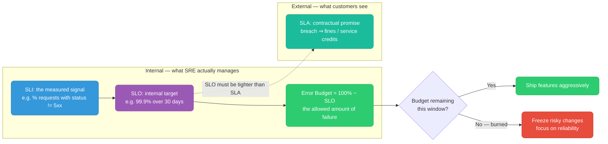
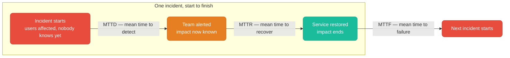
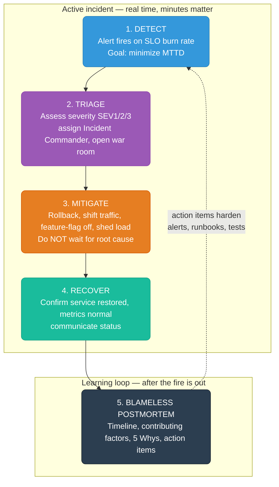
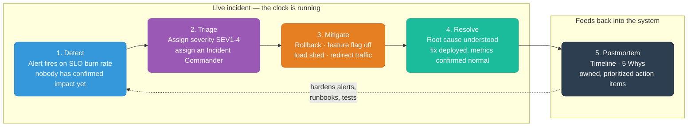

## Leader Election for Singleton Workloads

If you need exactly one active instance (not zero, not two), use Kubernetes **Lease-based leader election**. The Lease API is a lightweight lock stored in etcd.

**Use cases:** distributed job scheduler, CDC consumer, singleton reconciler, any process that must not run concurrently.

<div class="quiz-progress" data-quiz-progress>
  <span class="quiz-progress-label">0/0 checks</span>
  <span class="quiz-progress-bar"><span class="quiz-progress-fill"></span></span>
</div>

### How It Works

```mermaid
sequenceDiagram
    participant P1 as Pod 1 (candidate)
    participant P2 as Pod 2 (standby)
    participant K8s as K8s API Server<br/>(Lease object in etcd)

    rect rgb(30, 65, 45)
    Note over P1,K8s: Steady state — one leader, one idle standby
    P1->>K8s: Try to acquire Lease (create/update with holderIdentity=pod-1)
    K8s-->>P1: Lease acquired, pod-1 is leader
    P2->>K8s: Try to acquire Lease
    K8s-->>P2: Lease held by pod-1, renewDeadline not expired, not acquired

    loop Every leaseDuration/2
        P1->>K8s: Renew lease (update renewTime)
        K8s-->>P1: OK
    end
    end

    rect rgb(74, 46, 46)
    Note over P1: Pod 1 OOM-killed / crashes
    Note over K8s: Lease expires, no renewal within leaseDuration
    P2->>K8s: Try to acquire Lease, lease expired!
    K8s-->>P2: Lease acquired, pod-2 is now leader
    Note over P2: Pod 2 starts doing work
    end
```



### Go Implementation with `client-go`

```go
package main

import (
	"context"
	"fmt"
	"os"
	"time"

	metav1 "k8s.io/apimachinery/pkg/apis/meta/v1"
	"k8s.io/client-go/kubernetes"
	"k8s.io/client-go/rest"
	"k8s.io/client-go/tools/leaderelection"
	"k8s.io/client-go/tools/leaderelection/resourcelock"
)

func main() {
	// Identity: use pod name so we can see who is leader
	id := os.Getenv("POD_NAME")
	if id == "" {
		id, _ = os.Hostname()
	}

	// In-cluster config (works when running inside a K8s pod)
	cfg, err := rest.InClusterConfig()
	if err != nil {
		panic(err)
	}
	client := kubernetes.NewForConfigOrDie(cfg)

	// Lease lock — stored as a Lease object in the given namespace
	lock := &resourcelock.LeaseLock{
		LeaseMeta: metav1.ObjectMeta{
			Name:      "my-app-leader",    // Lease object name
			Namespace: "default",
		},
		Client: client.CoordinationV1(),
		LockConfig: resourcelock.ResourceLockConfig{
			Identity: id, // pod name — identifies who holds the lease
		},
	}

	ctx, cancel := context.WithCancel(context.Background())
	defer cancel()

	leaderelection.RunOrDie(ctx, leaderelection.LeaderElectionConfig{
		Lock: lock,

		// How long a lease is valid without renewal
		// If the leader crashes, a new leader can only be elected after this duration
		LeaseDuration: 15 * time.Second,

		// How long the leader has to renew before losing leadership
		// Must be < LeaseDuration
		RenewDeadline: 10 * time.Second,

		// How often the leader tries to renew
		// Must be < RenewDeadline
		RetryPeriod: 2 * time.Second,

		// ReleaseOnCancel: release the lease gracefully when context is cancelled
		// (e.g., on SIGTERM). Without this, the lease holds for LeaseDuration
		// after crash, delaying failover.
		ReleaseOnCancel: true,

		Callbacks: leaderelection.LeaderCallbacks{
			// Called when this pod becomes the leader — start your work here
			OnStartedLeading: func(ctx context.Context) {
				fmt.Printf("[%s] became leader — starting work\n", id)
				runWork(ctx)
			},

			// Called when this pod loses leadership (lease expired, context cancelled)
			// Stop your work here — MUST return quickly
			OnStoppedLeading: func() {
				fmt.Printf("[%s] lost leadership — stopping work\n", id)
				// If work goroutine is running, the ctx passed to OnStartedLeading
				// is cancelled automatically by the leader election library
				os.Exit(0) // let kubelet restart the pod to re-compete
			},

			// Called when any pod acquires the lease (informational)
			OnNewLeader: func(identity string) {
				if identity == id {
					return // we already know we're leader from OnStartedLeading
				}
				fmt.Printf("[%s] new leader elected: %s\n", id, identity)
			},
		},
	})
}

// runWork is the actual singleton work. ctx is cancelled when leadership is lost.
func runWork(ctx context.Context) {
	ticker := time.NewTicker(5 * time.Second)
	defer ticker.Stop()

	for {
		select {
		case <-ctx.Done():
			fmt.Println("work stopped — leadership lost or context cancelled")
			return
		case t := <-ticker.C:
			fmt.Printf("doing singleton work at %s\n", t.Format(time.RFC3339))
			// e.g., process a job queue, run a reconciliation loop, etc.
		}
	}
}
```

### Required RBAC

The pod needs permission to create/get/update the `Lease` object:

```yaml
apiVersion: v1
kind: ServiceAccount
metadata:
  name: my-app
  namespace: default
---
apiVersion: rbac.authorization.k8s.io/v1
kind: Role
metadata:
  name: leader-election
  namespace: default
rules:
  - apiGroups: ["coordination.k8s.io"]
    resources: ["leases"]
    verbs: ["get", "create", "update"]
---
apiVersion: rbac.authorization.k8s.io/v1
kind: RoleBinding
metadata:
  name: my-app-leader-election
  namespace: default
subjects:
  - kind: ServiceAccount
    name: my-app
roleRef:
  kind: Role
  name: leader-election
  apiGroup: rbac.authorization.k8s.io
---
apiVersion: apps/v1
kind: Deployment
metadata:
  name: my-app
spec:
  replicas: 2   # both pods run, only one is leader at a time
  template:
    spec:
      serviceAccountName: my-app  # bind the SA with lease permissions
      containers:
        - name: app
          image: my-org/my-app:v1
          env:
            - name: POD_NAME
              valueFrom:
                fieldRef:
                  fieldPath: metadata.name  # inject pod name as identity
```

### Key Tuning Parameters

| Parameter | Default | Effect of too low | Effect of too high |
|-----------|---------|------------------|--------------------|
| `LeaseDuration` | 15s | Frequent leader churn under network blips | Slow failover after leader crash |
| `RenewDeadline` | 10s | Leader gives up leadership under transient API slowness | Leader holds on too long during real failures |
| `RetryPeriod` | 2s | High API Server load (many renewals) | Slow to detect that renewal is needed |
| `replicas` | 2+ | Single point of failure if leader pod is OOM-killed | Wasted resources |

**`ReleaseOnCancel: true`** is critical for fast failover on graceful shutdown. When the pod receives SIGTERM (rolling update, scale-down), it cancels the context, the leader election library releases the Lease immediately, and a new leader is elected within `RetryPeriod` — not `LeaseDuration`. Without this, failover waits the full 15 seconds.

<div class="quiz-card">
  <p class="quiz-q">A pod is rolled during a normal deployment (SIGTERM, not a crash) and <code>ReleaseOnCancel</code> was left at its default (unset/false). Roughly how long before a standby pod takes over as leader?</p>
  <button class="quiz-reveal">Reveal answer</button>
  <div class="quiz-a" hidden>Close to the full <code>LeaseDuration</code> (15s by default) — without <code>ReleaseOnCancel: true</code>, the outgoing pod doesn't release the Lease on graceful shutdown, so the standby has to wait for it to expire naturally, exactly as if the leader had crashed. With <code>ReleaseOnCancel: true</code> the Lease is released immediately on context cancellation and a new leader is elected within <code>RetryPeriod</code> (2s by default) instead — a ~7x faster failover for the common, planned case.</div>
</div>

---

## SRE Core Concepts

### SLI, SLO, Error Budget, SLA



**SLI (Service Level Indicator):**
The actual measured signal. What you observe.
- % of requests served successfully (status != 5xx)
- % of requests under 300ms latency
- Uptime percentage
- Error rate

**SLO (Service Level Objective):**
The internal target for the SLI. What you commit to internally.
- 99.9% of requests successful over a 30-day rolling window
- p99 latency under 500ms, measured over 1-hour windows
- 99.95% availability per quarter

**Error Budget:**
`100% - SLO = allowed failure`

| SLO | Budget | Monthly downtime allowed |
|-----|--------|--------------------------|
| 99% | 1% | ~7.2 hours |
| 99.9% | 0.1% | ~43 minutes |
| 99.95% | 0.05% | ~21.6 minutes |
| 99.99% | 0.01% | ~4.3 minutes |

The budget is a **resource**: burn it fast (bad incident) -> freeze risky changes, focus on reliability. Budget remaining -> ship features aggressively. This depersonalizes the argument: the budget decides, not opinion.

**How error budget changes behavior:** The team checks error budget weekly. If a bad incident burns 50% of the month's budget in one day, the next sprint freezes new features and focuses entirely on reliability.

**SLA (Service Level Agreement):**
External contract with customers. Breaching it means fines/credits. SLOs should always be tighter than SLAs (buffer for detecting breaches before customers do).

<div class="quiz-card">
  <p class="quiz-q">A team sets its internal SLO to exactly the same number as its customer-facing SLA — both 99.9%. What's the problem?</p>
  <button class="quiz-reveal">Reveal answer</button>
  <div class="quiz-a" hidden>There's no buffer left to catch a breach internally before it becomes a paid, contractual SLA violation. The SLO is supposed to be tighter (stricter) than the SLA specifically so the team notices — and starts freezing risky changes — while they still have room to fix things before the SLA itself is breached. If both thresholds are identical, the first sign of trouble the team gets is the same moment the customer is owed a credit.</div>
</div>

---

### MTTD, MTTR, MTTF



**MTTD (Mean Time To Detect):**
Time from incident START to team KNOWS about it.

Improve by: SLO-based burn rate alerts, synthetic monitoring, anomaly detection, on-call coverage gaps analysis.

**MTTR (Mean Time To Recover):**
Time from detection to SERVICE RESTORED.

Improve by: runbooks (documented and tested), automated rollback, feature flags (instant kill switches), on-call drills, pre-approved playbooks for common failure modes.

**MTTF (Mean Time To Failure):**
Average time between incidents. Higher = more reliable.

Improve by: reducing toil, better testing, chaos engineering, capacity planning.

**Key insight:** MTTD and MTTR are separate problems.
- Fast detection + slow recovery = still bad (you know it's broken but can't fix it)
- Fast recovery + slow detection = users hurt for a long time before you knew

<div class="quiz-card">
  <p class="quiz-q">A team has excellent MTTD (alerts fire in 30 seconds) but poor MTTR (it takes 4 hours to actually fix things). Is that a reliable system from the user's point of view?</p>
  <button class="quiz-reveal">Reveal answer</button>
  <div class="quiz-a" hidden>No. Fast detection only means the team finds out quickly — it does nothing for the user, who is still impacted for the full 4 hours regardless of how fast the alert fired. MTTD and MTTR are separate problems that both have to be optimized; a great MTTD paired with a bad MTTR is still a bad incident from the outside.</div>
</div>

---

### Toil

**Toil** = manual, repetitive, automatable, reactive operational work that scales linearly with service growth and produces no enduring improvement.

**All traits must be true:**

| Trait | Question |
|-------|----------|
| Manual | No automation runs it |
| Repetitive | Done again and again |
| Automatable | Could be automated |
| Scales with growth | More users = more toil instances |
| No durable value | Does it again next time, leaves nothing behind |

**Examples:**
- Manually restarting a stuck service
- Hand-running database migrations
- Rotating certs by SSH-ing to 30 servers
- A daily release call with the same manual steps

**Why cap at ~50%:** If toil isn't capped, the team drowns in ops as the service grows and never builds anything permanent. SRE dedicates the freed time to automating the toil away.

<div class="quiz-card">
  <p class="quiz-q">A task is manual and repetitive — but every time it's done, it also permanently fixes the underlying cause so that specific instance never recurs. Is it toil?</p>
  <button class="quiz-reveal">Reveal answer</button>
  <div class="quiz-a" hidden>No — <strong>all</strong> the traits must be true, and this task fails "no durable value." Toil is defined by leaving nothing behind: same problem, same manual steps, forever. A task that produces a lasting improvement isn't toil even if it's currently manual and repetitive, because it's trending toward eliminating itself rather than scaling linearly with growth.</div>
</div>

---

### Incident Response Flow



**Key principle of step 3:** Do NOT wait for root cause analysis. Mitigate first, investigate after. Rollback the deploy, shed load, feature-flag off — worry about why later.

**Blameless postmortem questions:**
- What happened? (timeline)
- What allowed it to happen? (not who caused it — what system gap)
- How did we detect it? Could we have detected it faster?
- How did we mitigate? Could we have mitigated faster?
- What prevents this class of failure from recurring? (action items)

<div class="quiz-card">
  <p class="quiz-q">During MITIGATE, the on-call engineer doesn't yet know why error rates spiked. Should they hold off on rolling back until they've confirmed the root cause?</p>
  <button class="quiz-reveal">Reveal answer</button>
  <div class="quiz-a" hidden>No — mitigate first, investigate after. Rollback, feature-flag off, shed load, or shift traffic immediately to stop user impact; root cause analysis happens later, in the postmortem step. Waiting to understand "why" before acting only extends the outage.</div>
</div>

---

### Monitoring: RED Method and Alerting

**RED method for request-based services:**

| Signal | What it measures | Alert when |
|--------|-----------------|------------|
| **R**ate | Requests per second | Sudden drop (service down?) or spike (DDoS?) |
| **E**rrors | Error rate (5xx / total) | Exceeds error budget burn rate |
| **D**uration | Latency distribution (p50, p95, p99) | p99 exceeds SLO threshold |

**Rules for good alerts:**
1. Alert on **symptoms** (user impact), not causes (CPU high, memory high)
2. Every page must be **actionable** — if no human action needed, it is not a page
3. Use **SLO burn rate** alerts — page when consuming error budget faster than sustainable
4. Group and deduplicate — one incident = one page, not 30
5. Audit alerts quarterly — delete any that fire but nobody acts on

**SLO burn rate alert example (Prometheus):**

```promql
# Fires when error budget burns 2x faster than sustainable over 1h window
sum(rate(http_requests_total{status=~"5.."}[1h])) /
sum(rate(http_requests_total[1h]))
> (1 - 0.999) * 2     # 2x the error budget rate for 99.9% SLO
```

<div class="quiz-card">
  <p class="quiz-q">An alert pages whenever node CPU crosses 80%, regardless of whether any request is slow or failing. Does this follow the RED method's alerting rules?</p>
  <button class="quiz-reveal">Reveal answer</button>
  <div class="quiz-a" hidden>No — it alerts on a cause (CPU), not a symptom (user-facing impact measured via Rate, Errors, or Duration). Per the rules, alert on symptoms, not causes, and every page must be actionable: high CPU with no effect on error rate or latency often means nothing needs to happen, which makes it exactly the kind of alert that should be deleted in a quarterly audit.</div>
</div>

---

### Scaling: Horizontal vs Vertical

| | Horizontal (scale out) | Vertical (scale up) |
|--|----------------------|-------------------|
| How | Add more instances | Bigger instance (more CPU/RAM) |
| Works for | Stateless services, microservices | Any app, no code changes |
| Fails when | App has shared state hard to distribute | Hit the largest instance size |
| Downtime | Zero (add instances behind LB) | Possible for traditional infra (not K8s) |
| Tools | K8s HPA, ECS Autoscaling, ASG | Change instance type |

**Best practice:** Design stateless services (session in Redis, not in-process memory) so horizontal scaling works cleanly. Vertical scale is the emergency lever when you can't distribute state.

<div class="quiz-card">
  <p class="quiz-q">A service keeps user sessions in each instance's in-process memory. What happens when you try to scale it horizontally behind a load balancer?</p>
  <button class="quiz-reveal">Reveal answer</button>
  <div class="quiz-a" hidden>It breaks, or at best gets sticky-session hacks bolted on. Horizontal scaling assumes any instance can serve any request — but if a user's session only exists in the memory of the one instance that first handled them, a request routed to a different instance won't find it. That's exactly why the best practice is to keep session state in something shared like Redis, not in-process: it's what makes stateless horizontal scaling actually work cleanly instead of falling back to the vertical/emergency lever.</div>
</div>

---


## Incident Management Lifecycle



<div class="stepper">
  <div class="stepper-panels">
    <div class="stepper-panel active">
      <strong>1. Detect.</strong> An SLO burn-rate alert fires. At this instant nobody has
      confirmed real user impact yet — the goal here is purely minimizing MTTD, not diagnosing
      anything.
    </div>
    <div class="stepper-panel">
      <strong>2. Triage.</strong> Assign a severity (SEV1-4) and name an Incident Commander.
      The severity call can be wrong and downgraded later — the point is to make <em>some</em>
      call immediately so the right amount of response kicks in without delay.
    </div>
    <div class="stepper-panel">
      <strong>3. Mitigate.</strong> Rollback, feature-flag off, shed load, or shift traffic —
      whatever stops user impact fastest. Root cause is explicitly <strong>not</strong>
      required yet; a 5-minute rollback beats a 30-minute root-cause hunt every time.
    </div>
    <div class="stepper-panel">
      <strong>4. Resolve.</strong> Distinct from mitigation: this is the permanent fix, with
      root cause understood and monitoring confirming things are actually back to normal, not
      just quiet.
    </div>
    <div class="stepper-panel">
      <strong>5. Postmortem.</strong> A written, blameless record of what happened and why —
      its action items are what actually harden the alerts, runbooks, and tests that feed back
      into step 1, making the next Detect faster or the next incident less likely altogether.
    </div>
  </div>
  <div class="stepper-controls">
    <button class="stepper-prev">← Prev</button>
    <span class="stepper-dots"></span>
    <span class="stepper-label"></span>
    <button class="stepper-next">Next →</button>
  </div>
</div>

### Severity Levels

<div class="toggle-switch">
  <div class="toggle-buttons">
    <button data-toggle-opt="sev1" class="active state-bad">SEV1</button>
    <button data-toggle-opt="sev2" class="state-warn">SEV2</button>
    <button data-toggle-opt="sev3">SEV3</button>
    <button data-toggle-opt="sev4" class="state-ok">SEV4</button>
  </div>
  <div class="toggle-panel active" data-toggle-panel="sev1">
    <strong>Complete outage, data loss risk.</strong> Immediate page, war room opened.
    Examples: checkout down, database unreachable.
  </div>
  <div class="toggle-panel" data-toggle-panel="sev2">
    <strong>Significant degradation.</strong> Page, respond within 15 minutes.
    Examples: error rate 10&times; normal, p99 latency &gt; 5s.
  </div>
  <div class="toggle-panel" data-toggle-panel="sev3">
    <strong>Minor degradation, workaround exists.</strong> Ticket, handled next business day —
    no page. Examples: single region slow, non-critical feature down.
  </div>
  <div class="toggle-panel" data-toggle-panel="sev4">
    <strong>Cosmetic / no user impact.</strong> Log it, nothing more.
    Examples: wrong log line, minor UI glitch.
  </div>
</div>

<div class="quiz-card">
  <p class="quiz-q">Error rate on a non-critical internal reporting feature jumps 10&times; but every customer-facing checkout path is unaffected, and a manual workaround exists. Is this a SEV1?</p>
  <button class="quiz-reveal">Reveal answer</button>
  <div class="quiz-a" hidden>No. SEV1 is reserved for complete outage or data-loss risk on things like checkout or the database — a page-worthy, war-room-now situation. A degraded but non-critical feature with a workaround and no outage is a SEV3: file a ticket, handle it next business day, no immediate page. Severity should track user impact and blast radius, not just "the error rate went up a lot" in isolation.</div>
</div>

### Incident Commander (IC) Role

The IC is one person with authority to make decisions. They do NOT debug — they coordinate.

<div class="tab-group">
  <div class="tab-buttons">
    <button data-tab="ic-does" class="active">What the IC does</button>
    <button data-tab="ic-not">What the IC does NOT do</button>
  </div>
  <div class="tab-panels">
    <div class="tab-panel active" data-tab-panel="ic-does">
      <ul>
        <li>Declare severity, open the war room (Slack/Zoom)</li>
        <li>Assign tasks: "Alice owns the DB investigation, Bob owns the rollback"</li>
        <li>Give status updates every 15 min, even if "no change"</li>
        <li>Declare mitigation / resolution</li>
        <li>Initiate the postmortem</li>
      </ul>
    </div>
    <div class="tab-panel" data-tab-panel="ic-not">
      <ul>
        <li>Debugging the issue themselves</li>
        <li>Writing code or a fix</li>
        <li>Pulling logs or running queries themselves</li>
      </ul>
      That work belongs to the responders the IC assigned — the IC's own job is to keep
      coordinating, not to become one more pair of hands in the code.
    </div>
  </div>
</div>

<div class="quiz-card">
  <p class="quiz-q">During a SEV1, the Incident Commander is the strongest debugger on the team. Should they start pulling logs and writing the fix themselves once things get serious?</p>
  <button class="quiz-reveal">Reveal answer</button>
  <div class="quiz-a" hidden>No. The IC's role is coordination, not technical work — assigning tasks, giving status updates, declaring mitigation/resolution. If the IC starts debugging, nobody is left tracking the overall incident, assigning follow-up tasks, or giving stakeholders updates, and the response loses its coordinator exactly when it needs one most. A strong debugger should be assigned as a responder instead, with someone else holding the IC role.</div>
</div>

### Mitigation vs Resolution

<div class="toggle-switch">
  <div class="toggle-buttons">
    <button data-toggle-opt="mitigation" class="active state-warn">Mitigation</button>
    <button data-toggle-opt="resolution" class="state-ok">Resolution</button>
  </div>
  <div class="toggle-panel active" data-toggle-panel="mitigation">
    <strong>Stop the bleeding.</strong> Users are no longer impacted, but root cause is still
    unknown. Achieved via rollback, feature flag off, traffic shift, raising a rate limit, or
    scaling up.
  </div>
  <div class="toggle-panel" data-toggle-panel="resolution">
    <strong>The permanent fix.</strong> Root cause is understood, the actual fix is deployed,
    and monitoring has confirmed things are back to normal — not just quiet.
  </div>
</div>

**Always mitigate first.** Never wait for root cause before acting. A 30-minute outage while you find root cause is worse than a 5-minute outage from rolling back immediately.

<div class="quiz-card">
  <p class="quiz-q">A rollback stops the error spike and metrics return to baseline. Is the incident resolved?</p>
  <button class="quiz-reveal">Reveal answer</button>
  <div class="quiz-a" hidden>Not yet — it's mitigated. Users aren't impacted anymore, but the root cause of why the deploy broke things is still unknown at this point. Resolution specifically requires the root cause to be understood and a permanent fix deployed, with monitoring confirming normal behavior — "the bleeding stopped" and "we know why and fixed it" are two different milestones, and conflating them is how the root-cause investigation quietly never happens.</div>
</div>

---

## Blameless Postmortem Template

A postmortem is a **written record** of what happened, why, and what prevents recurrence. It is blameless — we fix systems and processes, never blame individuals.

```markdown
# Postmortem: [Service] [Brief Description] — [Date]

**Severity:** SEV1 / SEV2 / SEV3
**Duration:** HH:MM (detection to resolution)
**Impact:** [X% of users affected] [specific features broken]
**Status:** Complete / Action Items Open

---

## Summary (2–3 sentences)
What happened and what was the user impact. Written for a non-technical audience.

---

## Timeline (UTC)

| Time  | Event |
|-------|-------|
| 14:02 | Alert fires: error rate 8× SLO burn rate |
| 14:03 | On-call acknowledges, opens war room |
| 14:07 | Identifies deploy at 13:55 as likely cause |
| 14:09 | Rollback initiated |
| 14:12 | Error rate returns to baseline — **MITIGATED** |
| 14:45 | Root cause confirmed: nil pointer in new payment handler |
| 15:30 | Fix deployed, monitoring confirmed — **RESOLVED** |

---

## Root Cause

[Technical explanation. What specific change/condition caused the failure.]

Example: The v2.4.1 deploy introduced a nil pointer dereference in `payment.ProcessOrder()`
when the optional `discount_code` field was absent. The condition was not covered by unit tests.

---

## Contributing Factors (5 Whys)

1. Why did the service return 500s? → nil pointer panic in payment handler
2. Why was the nil pointer not caught? → no unit test for empty `discount_code`
3. Why was there no test? → the field was added without updating test fixtures
4. Why was it not caught in staging? → staging test data always includes a discount code
5. Why does staging not mirror prod data shapes? → no contract testing between services

Root cause is **systemic** (missing test coverage + staging data gap), not individual error.

---

## What Went Well

- Alert fired within 90 seconds of deploy
- Rollback completed in 3 minutes (< RTO target of 5 min)
- On-call had clear runbook to follow
- Status page updated before customer complaints

---

## What Went Poorly

- MTTD was good but MTTR was longer than target (30 min vs 10 min)
- War room had 8 people — too many, caused confusion
- Staging did not reproduce the bug

---

## Action Items

| Action | Owner | Due | Priority |
|--------|-------|-----|----------|
| Add unit tests for all optional fields in payment handler | Alice | 2025-06-27 | P1 |
| Add production-representative data to staging fixtures | Bob | 2025-07-04 | P1 |
| Document rollback procedure in runbook | Carol | 2025-06-27 | P2 |
| Review war room protocol — limit to 4 people max | Dan (EM) | 2025-06-30 | P2 |
| Investigate synthetic canary to catch nil panics pre-deploy | Alice | 2025-07-11 | P3 |

---

## Metrics

- **MTTD:** 1 min (alert to acknowledgment)
- **MTTR:** 30 min (detection to resolution)
- **Error budget burned:** ~18% of monthly budget
- **Users affected:** ~12,000 (estimated from error count)
```

### Postmortem Anti-Patterns

| Anti-pattern | Why it's harmful | Better |
|---|---|---|
| "Human error" as root cause | Ignores the system that allowed the error | Ask why the system allowed it |
| Blame in the doc | Chills future reporting of near-misses | Keep names out, focus on conditions |
| Action items with no owner | Never get done | Every item has a named owner + deadline |
| Action items with no priority | P3 items never get done | Explicitly mark P1 (must fix) vs P3 (nice to have) |
| Postmortem not shared | Team doesn't learn | Publish internally, link from incident channel |
| No follow-up | Action items rot | Review at next sprint planning |

<div class="quiz-card">
  <p class="quiz-q">A postmortem's Root Cause section reads: "Human error — the on-call engineer deployed without checking the runbook." Is this an acceptable root cause?</p>
  <button class="quiz-reveal">Reveal answer</button>
  <div class="quiz-a" hidden>No — this is the "human error as root cause" anti-pattern. It ignores the system gap that let a single person's mistake take down production: why was there no automated check, no staging gate, no required review that would have caught this regardless of who was deploying? The better version asks why the system allowed the error to happen and turns that into an action item, rather than stopping at "someone was careless" — which also chills future incident reporting, since nobody wants to be named as the cause.</div>
</div>

---

## On-Call Best Practices

```
Before your shift:
  □ Ensure runbooks are up to date for your services
  □ Verify alert routing is correct (your phone/Slack receives pages)
  □ Know how to rollback the last 3 deploys

During an incident:
  □ Acknowledge within 5 min
  □ Declare severity immediately (even if uncertain — downgrade later)
  □ Mitigate first, investigate second
  □ Update status page / stakeholders every 15 min
  □ Take notes in a shared doc (timestamps are critical for postmortem)

After an incident:
  □ Write postmortem within 24h (while memory is fresh)
  □ Assign action items before closing the postmortem
  □ Update runbook with anything you learned
  □ Sleep — handoff if shift continues
```

### Runbook Minimum Structure

Every page-worthy alert must link to a runbook with:

```markdown
# [Alert Name] Runbook

## What is happening
One sentence: what the alert means in plain English.

## User impact
Who is affected and how.

## Immediate triage (first 5 minutes)
1. [specific command]
2. [specific command]
3. Check [specific dashboard link]

## Likely causes (most common first)
1. Cause A → fix: [command/step]
2. Cause B → fix: [command/step]

## Escalation
If not resolved in 30 min → page [team/person]
```

---

## Error Budget Burn Rate Alerting

Error budget burn rate tells you how fast you're consuming your monthly error budget. A burn rate of 1 = exactly consuming budget at the rate that empties it in 30 days. A burn rate of 14.4 = budget exhausted in 2 hours.

### Multi-window multi-burn-rate alert (Google SRE Book)

All four rules below watch the *same* underlying signal (`payments` error rate against a 99.9% SLO) — what changes tab to tab is only the burn-rate multiplier, the pair of windows, and how urgently a human gets bothered.

<div class="tab-group">
  <div class="tab-buttons">
    <button data-tab="burn-critical" class="active state-bad">Critical (page, 14.4&times;)</button>
    <button data-tab="burn-high" class="state-warn">High (page, 6&times;)</button>
    <button data-tab="burn-medium">Medium (ticket, 3&times;)</button>
    <button data-tab="burn-low" class="state-ok">Low (inform, 1&times;)</button>
  </div>
  <div class="tab-panels">
    <div class="tab-panel active" data-tab-panel="burn-critical">
      Fires immediately: burning &gt;14.4&times; budget over <strong>both</strong> the last 1h
      AND the last 5m — that's a 2-hour burn-down. Pages on-call right now.
      <pre><code>groups:
  - name: slo.burn_rate
    rules:
      # Page immediately: burning &gt;14.4x in last 1h AND 5m (2 hour burn-down)
      - alert: ErrorBudgetBurnCritical
        expr: |
          (
            job:slo_errors:rate1h{job="payments"} &gt; (14.4 * 0.001)
            and
            job:slo_errors:rate5m{job="payments"} &gt; (14.4 * 0.001)
          )
        for: 2m
        labels:
          severity: critical
          slo: payments-availability
        annotations:
          summary: "Payments burning error budget at 14.4x, exhausted in 2h"
          runbook: https://wiki/sre/payments-runbook</code></pre>
    </div>
    <div class="tab-panel" data-tab-panel="burn-high">
      Fires when burning 6&times; budget over both the last 6h AND the last 30m — a 5-day
      burn-down. Still pages, but with more headroom than critical.
      <pre><code>      # Page: 6x burn over 6h AND 30m (5 day burn-down)
      - alert: ErrorBudgetBurnHigh
        expr: |
          (
            job:slo_errors:rate6h{job="payments"} &gt; (6 * 0.001)
            and
            job:slo_errors:rate30m{job="payments"} &gt; (6 * 0.001)
          )
        for: 15m
        labels:
          severity: page
          slo: payments-availability</code></pre>
    </div>
    <div class="tab-panel" data-tab-panel="burn-medium">
      Fires when burning 3&times; budget over both the last 3d AND the last 6h — a 10-day
      burn-down. Slow enough to be a ticket, not a page.
      <pre><code>      # Ticket: 3x burn over 3d AND 6h (10 day burn-down)
      - alert: ErrorBudgetBurnMedium
        expr: |
          (
            job:slo_errors:rate3d{job="payments"} &gt; (3 * 0.001)
            and
            job:slo_errors:rate6h{job="payments"} &gt; (3 * 0.001)
          )
        for: 1h
        labels:
          severity: ticket</code></pre>
    </div>
    <div class="tab-panel" data-tab-panel="burn-low">
      Fires when burning budget at 1&times; sustained over 3d — the pace that empties the
      whole month's budget by month end. Purely informational.
      <pre><code>      # Inform: 1x burn over 3d (budget will run out by month end)
      - alert: ErrorBudgetBurnLow
        expr: |
          job:slo_errors:rate3d{job="payments"} &gt; (1 * 0.001)
        for: 3h
        labels:
          severity: info</code></pre>
    </div>
  </div>
</div>

**The two-window trick:** requiring both a short window (high sensitivity) and a long window (high specificity) eliminates most false positives. A spike that lasts 10 minutes fires the short window but not the long — no page. A real sustained degradation fires both.

<div class="quiz-card">
  <p class="quiz-q">A burst of errors spikes for 10 minutes and then fully recovers. The 5m window's burn rate crosses 14.4&times; during that burst. Does ErrorBudgetBurnCritical page?</p>
  <button class="quiz-reveal">Reveal answer</button>
  <div class="quiz-a" hidden>No — that alert requires the short window <strong>and</strong> the long window (1h) to both cross the threshold at the same time. A 10-minute burst pushes the 5m window over, but it's too brief to drag the 1h average over 14.4&times; too, so the "and" condition never holds and no page fires. This is exactly the two-window trick: it filters out short-lived spikes while still catching a real sustained degradation, which shows up in both windows simultaneously.</div>
</div>

### Error budget math

| | SLO target | Error budget (30 days) |
|---|---|---|
| | 99.9% | 0.1% × 30 × 24 × 60 = **43.2 minutes** of downtime |

| Burn rate | Consuming budget at… | Time to exhaust the month's budget |
|---|---|---|
| 1&times; | exact sustainable pace | 43.2 min downtime/month (the budget lasts the full month) |
| 6&times; | 6&times; the sustainable pace | 43.2 ÷ 6 = **7.2 hours** |
| 14.4&times; | 14.4&times; the sustainable pace | 43.2 ÷ 14.4 = **3 hours** |

<div class="quiz-card">
  <p class="quiz-q">Which is more urgent: a burn rate of 6, or a burn rate of 14.4?</p>
  <button class="quiz-reveal">Reveal answer</button>
  <div class="quiz-a" hidden>14.4 is far more urgent — a higher burn-rate number means the budget is being consumed <em>faster</em>, not more slowly. At 6x the whole month's budget is gone in 7.2 hours; at 14.4x it's gone in about 3 hours. That's exactly why 14.4x maps to the "page immediately" critical rule and 6x maps to the slightly less urgent "high" rule — the multiplier is a speed, and bigger means less runway before the budget hits zero.</div>
</div>

**When to page vs ticket:**
- \> 2% of budget consumed in 1 hour → page (critical)
- \> 5% of budget consumed in 6 hours → page (high)
- \> 10% of budget consumed in 3 days → ticket

---

## Incident Command Playbook

### The 5-minute triage script

Every on-call engineer should run this mentally (or literally) in the first 5 minutes of any page:

```
0:00 — Acknowledge the alert. Set a 5-minute timer.
       Don't start fixing yet. Understand first.

0:30 — What is the user impact?
       "X% of /checkout requests are failing"
       "Latency p99 is 8s (normal: 200ms)"
       NOT "Prometheus alert fired"

1:00 — Is this getting better, worse, or stable?
       Look at rate of change, not absolute value.
       A metric that's bad-but-stable is different from bad-and-worsening.

2:00 — What changed recently?
       git log --since="1 hour ago"
       Recent deployments: kubectl rollout history deployment -A
       Recent config changes: check audit log

3:00 — What is the blast radius?
       One service? One region? One customer? All customers?
       If blast radius is large → escalate now, even without a fix.

4:00 — Can I mitigate faster than I can fix?
       Rollback? Feature flag off? Scale up? Redirect traffic?
       Mitigation (stop the bleeding) ≠ resolution (fix the root cause).
       Mitigate first, investigate after.

5:00 — Declare severity and bring in help if needed.
       Don't be a hero. A second pair of eyes is never wrong.
```

<div class="quiz-card">
  <p class="quiz-q">The instant a page fires, an on-call engineer immediately starts running commands to try to fix the problem. According to the 5-minute triage script, what should have happened at 0:00 instead?</p>
  <button class="quiz-reveal">Reveal answer</button>
  <div class="quiz-a" hidden>Acknowledge the alert and set a 5-minute timer to understand first — not start fixing immediately. The whole script is built around spending the first five minutes gathering facts (user impact, rate of change, what changed recently, blast radius) before acting, so that whatever action gets taken at the 4:00 mark is actually the right one instead of a guess made under panic.</div>
</div>

### Severity levels and response expectations

| Severity | Definition | Response | Example |
|---|---|---|---|
| SEV-1 | Complete service outage or data loss | Page IC + responders immediately, 24/7 | Checkout 100% down |
| SEV-2 | Major feature degraded, significant user impact | Page on-call within 15 min | 30% of logins failing |
| SEV-3 | Minor feature degraded, workaround exists | Ticket next business day | Slow report generation |
| SEV-4 | Performance degradation, no user-visible impact | Informational, fix in sprint | Latency p99 elevated |

### Incident Commander responsibilities

The IC's job is **coordination, not technical work**. If you're the IC, you should not be typing commands.

```
IC Checklist:
  [ ] Open incident channel (#incident-YYYY-MM-DD-description)
  [ ] Assign roles: IC, tech lead, scribe, comms
  [ ] First status update within 10 min: what we know, what we don't, ETA for next update
  [ ] Status update every 15-30 min during active incident
  [ ] Keep tech team focused: "What is the next action and who owns it?"
  [ ] Declare mitigation: "User impact has stopped as of HH:MM UTC"
  [ ] Declare resolution: "Root cause fixed, monitoring for recurrence"
  [ ] Schedule postmortem within 72h
```

### Scribe template (real-time during incident)

```
## Incident: [title]
Declared: HH:MM UTC  |  IC: @name  |  Severity: SEV-X

### Timeline
HH:MM — Alert fired: [alert name]
HH:MM — On-call acknowledged
HH:MM — [observation]: kubectl get pods shows 3/5 pods CrashLoopBackOff
HH:MM — [hypothesis]: Memory leak in v2.3.1 deployed at HH:MM
HH:MM — [action]: Rolled back to v2.3.0
HH:MM — [result]: Error rate dropping, pods recovering
HH:MM — Mitigation declared

### Current state
Impact: [what users see]
Ongoing actions: [who is doing what]
Next update: HH:MM UTC

### Hypotheses tried
1. DB overload — ruled out (no slow queries)
2. Memory leak in v2.3.1 — CONFIRMED (OOMKill in logs)
```

---

## Toil Tracking

Toil is manual, repetitive, automatable operational work that grows with service scale. It has no lasting value — doing it once doesn't prevent doing it again.

### Identifying toil

```
Is it:
  ✓ Manual (requires a human to execute)?
  ✓ Repetitive (you've done it before)?
  ✓ Automatable (a machine could do it)?
  ✓ Reactive (triggered by external event, not proactive)?
  ✓ No lasting value (doesn't improve the system, just keeps it running)?

→ Yes to 3+: it's toil. Track it.
```

<div class="quiz-card">
  <p class="quiz-q">A task is manual, repetitive, and automatable — but it's proactive (scheduled by the team, not triggered by an external event) and it does leave the system slightly better each time. Does it clear the "3+" bar for toil?</p>
  <button class="quiz-reveal">Reveal answer</button>
  <div class="quiz-a" hidden>Yes — it still hits 3 of the 5 traits (manual, repetitive, automatable) even though it misses "reactive" and "no lasting value." The checklist only requires 3 or more yeses, not all five, so a task can fail a couple of the traits and still count as toil worth tracking and eventually automating away.</div>
</div>

### Toil log — track it before eliminating it

```markdown
| Date | Task | Time spent | Trigger | Automatable? | Ticket |
|------|------|-----------|---------|-------------|--------|
| 2026-07-01 | Manually restart payments pod after OOM | 15 min | Alert | Yes — VPA | ENG-123 |
| 2026-07-01 | Rotate DB password in Secrets Manager | 30 min | Quarterly reminder | Yes — ESO rotation | ENG-124 |
| 2026-07-02 | Scale up Kafka consumers manually | 20 min | Lag alert | Yes — KEDA | ENG-125 |
```

**SRE target:** toil < 50% of on-call engineer's time. The rest should be engineering work that reduces future toil. If toil > 50%, escalate to engineering leadership — you need dedicated headcount for toil reduction.

### Common toil patterns and automation paths

| Toil | Automation |
|---|---|
| Restart pod after OOM | VPA (auto right-size) + GOMEMLIMIT |
| Scale service on high traffic | HPA or KEDA |
| Rotate secrets manually | ESO + AWS Secrets Manager auto-rotation |
| Approve repetitive deploy PRs | ArgoCD auto-sync + automated tests |
| Investigate same alert repeatedly | Alert on root cause, not symptom; or self-healing via Argo Events |
| Manually fix cert expiry | cert-manager |
| Clear disk on nodes | Alert + automated cleanup CronJob |
