# Async Patterns — Message Queues and Event-Driven Architecture

How services hand off work without blocking on each other — queue patterns, delivery guarantees, dead letter queues, the outbox and saga patterns for keeping data consistent across services, event sourcing, CQRS, backpressure, and idempotent consumers.

<div class="quiz-progress" data-quiz-progress>
  <span class="quiz-progress-label">0/0 checks</span>
  <span class="quiz-progress-bar"><span class="quiz-progress-fill"></span></span>
</div>

---

## 1. Why Async

| Problem | Sync Solution | Async Solution |
|---------|---------------|----------------|
| Slow downstream | User waits | Job queued, 202 returned |
| Traffic spike | Drop/timeout | Queue absorbs burst |
| Transient failure | Retry in-band | Message retried from queue |
| CPU-bound work | Blocks thread | Worker pool processes in parallel |

Core benefits:
- **Decouple** producers and consumers — deploy/scale independently
- **Absorb spikes** — queue depth grows instead of requests failing
- **Retry on failure** — message stays in queue until acked
- **Parallelism** — multiple workers consume same queue

<div class="quiz-card">
  <p class="quiz-q">Does moving work onto a queue make the work itself finish faster?</p>
  <button class="quiz-reveal">Reveal answer</button>
  <div class="quiz-a" hidden>No — the job still takes exactly as long to run. What changes is who waits for it: the caller gets a 202 Accepted immediately instead of blocking for the full duration of the work. The wins are decoupling, spike absorption, retry-on-failure, and parallelism — not raw speed.</div>
</div>

---

## 2. Sync vs Async Request Flow

```mermaid
sequenceDiagram
    participant User
    participant API
    participant Worker
    participant DB

    rect rgb(80, 30, 30)
    Note over User,DB: Sync flow — caller blocks for the entire duration of the work
    User->>API: POST /resize-image
    API->>Worker: process(image)
    Worker->>DB: save result
    DB-->>Worker: ok
    Worker-->>API: done
    API-->>User: 200 OK (waits 3s)
    end

    rect rgb(25, 55, 45)
    Note over User,DB: Async flow — caller is released the instant the job is queued
    User->>API: POST /resize-image
    API->>DB: enqueue job (status=pending)
    API-->>User: 202 Accepted + job_id
    Worker->>DB: poll queue
    Worker->>DB: save result (status=completed)
    User->>API: GET /jobs/job_id
    API-->>User: 200 completed
    end
```

<div class="quiz-card">
  <p class="quiz-q">In the async flow, does the 202 Accepted response carry the actual result of the work?</p>
  <button class="quiz-reveal">Reveal answer</button>
  <div class="quiz-a" hidden>No — 202 Accepted only confirms the job was queued (plus a <code>job_id</code>); the work hasn't run yet. The result only exists once the worker polls the queue and saves it, and the caller has to come back later with a separate <code>GET /jobs/job_id</code> to find out whether it's done. That round trip is the price of not blocking: the caller gets its response instantly, but discovering completion becomes a second, independent step.</div>
</div>

---

## 3. Message Delivery Guarantees

| Guarantee | Behavior | Tradeoff | Systems |
|-----------|----------|----------|---------|
| At-most-once | Fire and forget, no retry | May lose messages | UDP, SNS (no DLQ), Kafka (acks=0) |
| At-least-once | Retry until acked | Duplicates possible | SQS, Kafka (acks=1/-1), RabbitMQ |
| Exactly-once | Delivered and processed once | High cost, slower | Kafka transactions, SQS FIFO + dedup |

**Practical rule:** build for at-least-once + idempotent consumers. Exactly-once is expensive and rarely worth it.

<div class="quiz-card">
  <p class="quiz-q">A queue promises "at-least-once" delivery. Can a consumer still receive the exact same message twice?</p>
  <button class="quiz-reveal">Reveal answer</button>
  <div class="quiz-a" hidden>Yes — that's the whole tradeoff of at-least-once: it retries until acked, which means duplicates are possible whenever an ack is lost or delayed (e.g. the consumer processed the message but crashed before acking). The practical rule is to build for at-least-once + make consumers idempotent, rather than chase exactly-once, which is expensive and rarely worth it.</div>
</div>

---

## 4. Queue Patterns

### Point-to-Point
One message → one consumer. Workers compete; each message processed once.

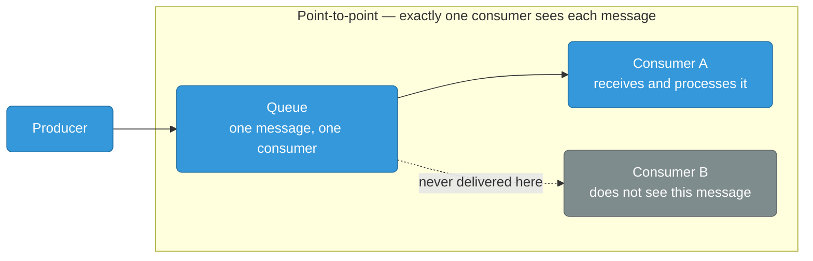

Use: task queues, job workers. SQS standard queue.

### Pub/Sub
One message → all subscribers. Fan-out.

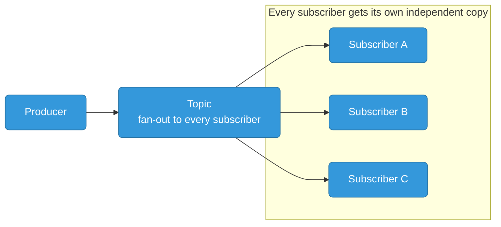

Use: event broadcast, notifications. SNS topics, Kafka topics.

### Competing Consumers
Multiple workers on the same queue for horizontal scale.

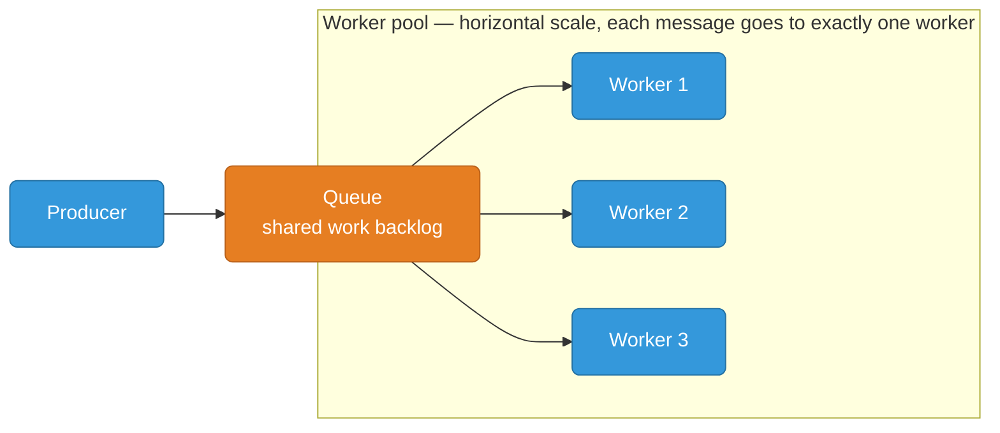

SQS: workers call `ReceiveMessage` concurrently; visibility timeout prevents double-processing.

### Priority Queue
High-priority messages processed before low-priority.

- **RabbitMQ**: `x-max-priority` queue arg, per-message `priority` property
- **SQS FIFO**: no native priority — workaround: separate queues per priority tier, consume high-priority queue first

```python
# RabbitMQ priority queue declaration
channel.queue_declare(queue='jobs', arguments={'x-max-priority': 10})
channel.basic_publish(
    exchange='', routing_key='jobs',
    body='urgent task',
    properties=pika.BasicProperties(priority=9)
)
```

<div class="quiz-card">
  <p class="quiz-q">In a point-to-point queue with competing consumers, if Consumer A pulls a message and then crashes before finishing it, does that message just disappear?</p>
  <button class="quiz-reveal">Reveal answer</button>
  <div class="quiz-a" hidden>No — this is exactly what the visibility timeout protects against. The message becomes invisible to other consumers while Consumer A holds it, but if A never deletes it before the timeout expires, it becomes visible again so another worker (Consumer B or C) can pick it up. Point-to-point and competing consumers are really the same pattern underneath: many workers pulling from one shared queue, each message processed exactly once — unless a worker fails mid-processing, in which case the message gets a second chance.</div>
</div>

---

## 5. Dead Letter Queue (DLQ)

Messages go to DLQ when:
- Max receive count exceeded (SQS: `maxReceiveCount`)
- TTL expired (RabbitMQ: `x-message-ttl`)
- Consumer explicitly rejects without requeue

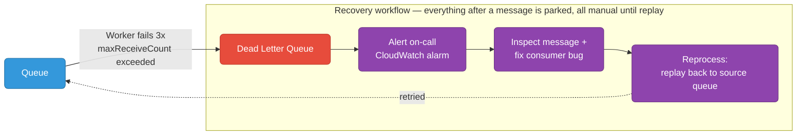

**SQS DLQ config:**
```json
{
  "RedrivePolicy": {
    "deadLetterTargetArn": "arn:aws:sqs:us-east-1:123:my-dlq",
    "maxReceiveCount": 3
  }
}
```

**Monitoring:**
- CloudWatch alarm on `ApproximateNumberOfMessagesVisible` on DLQ > 0
- Alert immediately — DLQ message = data not processed

**Reprocessing:** replay DLQ messages back to source queue after fixing the consumer bug.

<div class="quiz-card">
  <p class="quiz-q">A message lands in the DLQ. After you fix the bug that caused it to fail, does it automatically get retried?</p>
  <button class="quiz-reveal">Reveal answer</button>
  <div class="quiz-a" hidden>No — a DLQ is a parking lot, not a retry queue. Once a message is redirected there (max receive count exceeded, TTL expired, or explicit reject-without-requeue), it sits until someone explicitly replays it back to the source queue. Fixing the consumer bug doesn't drain the DLQ by itself.</div>
</div>

---

## 6. Outbox Pattern

**Problem:** dual-write — you need to write to DB *and* publish to queue atomically. If the app crashes between the two, you get inconsistency.

**Solution:** write event to an `outbox` table in the *same DB transaction*. Separate poller reads outbox and publishes.

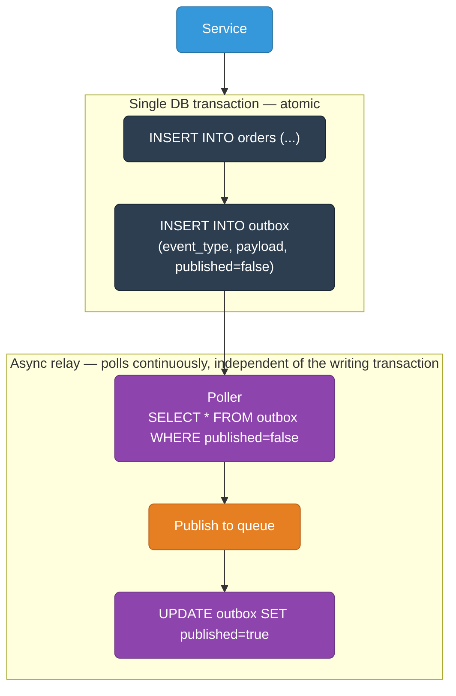

```sql
CREATE TABLE outbox (
    id          UUID PRIMARY KEY DEFAULT gen_random_uuid(),
    event_type  TEXT NOT NULL,
    payload     JSONB NOT NULL,
    published   BOOLEAN DEFAULT false,
    created_at  TIMESTAMPTZ DEFAULT now()
);
```

Tools that implement this: Debezium (CDC-based), Transactional Outbox libraries.

**Guarantee:** at-least-once delivery. Poller must handle crash between publish and mark-published → idempotent consumers required.

<div class="quiz-card">
  <p class="quiz-q">Why write the event to an outbox table instead of just publishing to the queue right after the <code>INSERT INTO orders</code> commits?</p>
  <button class="quiz-reveal">Reveal answer</button>
  <div class="quiz-a" hidden>Because "commit to DB, then publish" is two separate operations — the classic dual-write problem. If the app crashes between them, you get inconsistency: the order exists but no event was ever published, or the reverse. Writing the outbox row in the same DB transaction as the order makes both writes atomic — either both happen or neither does. The poller then handles the actual publish, and because it can also crash between publishing and marking the row published, this still only gets you at-least-once delivery — the consumer has to be idempotent.</div>
</div>

---

## 7. Saga Pattern

Distributed transactions across microservices without 2PC. Each step has a **compensation transaction** to undo on failure.

<div class="toggle-switch">
  <div class="toggle-buttons">
    <button data-toggle-opt="choreo" class="active">Choreography (events)</button>
    <button data-toggle-opt="orch">Orchestration (coordinator)</button>
  </div>
  <div class="toggle-panel active" data-toggle-panel="choreo">
    <p>Each service listens for events and emits the next one — no central coordinator, just a chain of "I did my part, here's what happened" events.</p>
    <pre><code class="language-mermaid">graph LR
    classDef svc fill:#3498db,stroke:#2471a3,color:#fff
    classDef fail fill:#e74c3c,stroke:#c0392b,color:#fff

    subgraph HAPPY["Happy path — each service reacts only to the event before it"]
        Order["OrderService"]:::svc -->|"order.created"| Inv["InventoryService"]:::svc
        Inv -->|"inventory.reserved"| Pay["PaymentService"]:::svc
        Pay -->|"payment.charged"| Ship["ShippingService"]:::svc
        Ship -->|"order.shipped"| Done["Order complete"]:::svc
    end

    subgraph COMPENSATE["Compensation chain — triggered only by payment.failed"]
        InvC["InventoryService"]:::fail
        OrderC["OrderService"]:::fail
        Cancel["Order cancelled"]:::fail
    end

    Pay -.->|"payment.failed"| InvC
    InvC -.->|"inventory.released"| OrderC
    OrderC -.->|"order.cancelled"| Cancel</code></pre>
    <p><strong>Pros:</strong> loose coupling — services don't know about each other, only about events. <strong>Cons:</strong> hard to trace the overall flow from any single place, and event loops are possible if two services end up reacting to each other's events.</p>
  </div>
  <div class="toggle-panel" data-toggle-panel="orch">
    <p>One saga orchestrator calls each service directly and owns the failure-handling logic — services don't talk to each other at all.</p>
    <pre><code class="language-mermaid">sequenceDiagram
    participant O as SagaOrchestrator
    participant Inv as InventoryService
    participant Pay as PaymentService
    participant Ship as ShippingService

    rect rgb(25, 55, 45)
    Note over O,Pay: Happy path so far — each step commits before the next begins
    O->>Inv: 1. reserve(order_id)
    Inv-->>O: reserved_ok
    O->>Pay: 2. charge(order_id)
    Pay-->>O: charge_failed
    end

    rect rgb(80, 30, 30)
    Note over O,Inv: On failure at step N, compensate steps 1..N-1
    O->>Inv: compensate: release(order_id)
    Inv-->>O: released_ok
    end</code></pre>
    <p><strong>Pros:</strong> the flow lives in one place, so it's easy to trace and reason about. <strong>Cons:</strong> the orchestrator becomes a dependency every step relies on, and a single place that has to know about every service.</p>
  </div>
</div>

<div class="quiz-card">
  <p class="quiz-q">In saga orchestration, when payment fails at step 2, does the orchestrator retry payment forever, or move on to compensation?</p>
  <button class="quiz-reveal">Reveal answer</button>
  <div class="quiz-a" hidden>It compensates: on failure at step N, the orchestrator calls compensate() for every step that already succeeded (steps 1..N-1) — in this case, releasing the inventory reservation made in step 1. That's the whole point of the pattern: since there's no 2PC across services, the saga can't roll back atomically, so it undoes completed work step by step instead.</div>
</div>

---

## 8. Saga Sequence — E-Commerce Order

```mermaid
sequenceDiagram
    participant Orchestrator
    participant Inventory
    participant Payment
    participant Shipping

    rect rgb(25, 55, 45)
    Note over Orchestrator,Payment: Happy path — each step commits before the next begins
    Orchestrator->>Inventory: reserve_items(order_id)
    Inventory-->>Orchestrator: reserved_ok
    Orchestrator->>Payment: charge_card(order_id)
    Payment-->>Orchestrator: charge_failed
    end

    rect rgb(80, 30, 30)
    Note over Orchestrator,Inventory: Compensation — undo everything that already succeeded
    Orchestrator->>Inventory: release_items(order_id)
    Inventory-->>Orchestrator: released_ok
    Orchestrator-->>Orchestrator: mark_order_failed(order_id)
    end
```

<div class="stepper">
  <div class="stepper-panels">
    <div class="stepper-panel active">
      <strong>1. Reserve inventory.</strong> The orchestrator calls <code>reserve_items(order_id)</code>. Inventory confirms with <code>reserved_ok</code> — this step has now committed, so it will need a compensating action if a later step fails.
    </div>
    <div class="stepper-panel">
      <strong>2. Charge the card.</strong> The orchestrator calls <code>charge_card(order_id)</code>. This time Payment responds with <code>charge_failed</code> — the saga cannot proceed to shipping.
    </div>
    <div class="stepper-panel">
      <strong>3. Begin compensation.</strong> Because step 1 already succeeded, the orchestrator must undo it rather than just give up — it calls <code>release_items(order_id)</code> on Inventory.
    </div>
    <div class="stepper-panel">
      <strong>4. Mark the order failed.</strong> Once the compensating action confirms (<code>released_ok</code>), the orchestrator marks the order failed. No orphaned reservation, no charge — the system lands back in a consistent state, just not the one the user wanted.
    </div>
  </div>
  <div class="stepper-controls">
    <button class="stepper-prev">← Prev</button>
    <span class="stepper-dots"></span>
    <span class="stepper-label"></span>
    <button class="stepper-next">Next →</button>
  </div>
</div>

<div class="quiz-card">
  <p class="quiz-q">In this saga run, is <code>ShippingService</code> ever called?</p>
  <button class="quiz-reveal">Reveal answer</button>
  <div class="quiz-a" hidden>No. The failure happens at the payment step, before shipping is ever reached — the orchestrator jumps straight to compensating the steps that already committed (releasing inventory) instead of continuing down the happy path. Shipping only gets called if every step before it succeeds.</div>
</div>

---

## 9. Event Sourcing

**State = current value** (traditional) vs **State = sequence of events** (event sourcing).

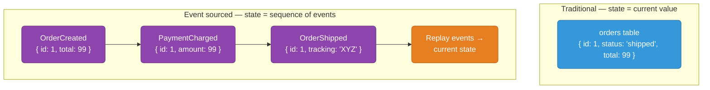

**Benefits:**
- Full audit log for free
- Rebuild read projections at any point in time
- Debug by replaying history

**Tradeoffs:**
- Querying current state requires replay or a projection
- Schema evolution of old events is hard
- Store grows forever (use snapshots)

**Snapshot pattern:** periodically store current state so replay starts from snapshot, not event 0.

<div class="quiz-card">
  <p class="quiz-q">In an event-sourced system, can you query "what's the order's current status" directly against the events table the way you'd query a normal orders table?</p>
  <button class="quiz-reveal">Reveal answer</button>
  <div class="quiz-a" hidden>Not directly — the events table only holds the history (OrderCreated, PaymentCharged, OrderShipped, ...), not a precomputed current value. Getting the current state requires replaying the events, or querying a materialized read projection built from them. This is exactly the tradeoff called out above: querying current state needs replay or a projection, which is also why the snapshot pattern exists — replaying from event 0 every time doesn't scale.</div>
</div>

---

## 10. CQRS

Separate **write model** (commands) from **read model** (queries).

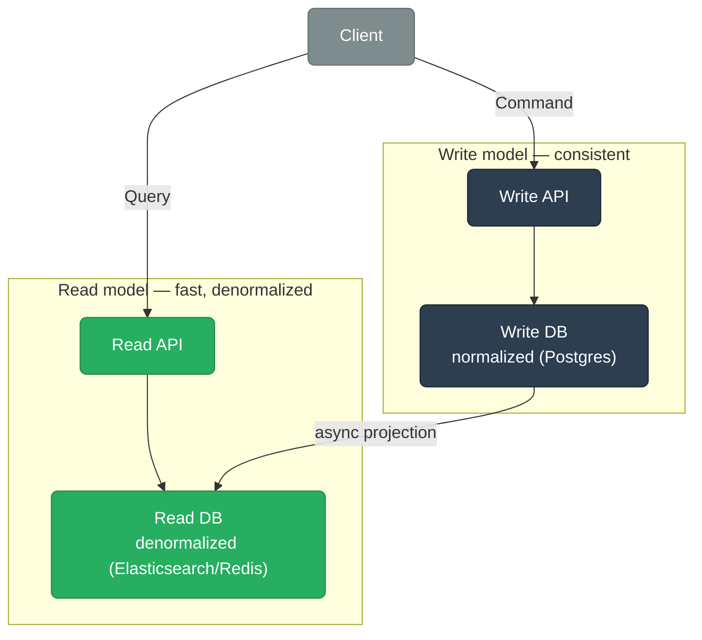

Write DB: optimized for consistency (Postgres, normalized).
Read DB: optimized for query patterns (Elasticsearch, Redis, denormalized Postgres view).

**Eventual consistency gap:** read model lags write model by milliseconds to seconds. Client must handle stale reads (show "processing" state).

CQRS + Event Sourcing pair naturally: events from write side populate read projections.

<div class="quiz-card">
  <p class="quiz-q">A client writes an order, then immediately queries it through the read API. Is it guaranteed to see the write?</p>
  <button class="quiz-reveal">Reveal answer</button>
  <div class="quiz-a" hidden>Not necessarily. The read model is populated by an async projection from the write model, so it lags by milliseconds to seconds — that's the eventual consistency gap CQRS accepts in exchange for a read model optimized for query patterns. The client has to handle stale reads, typically by showing a "processing" state until the projection catches up.</div>
</div>

---

## 11. Backpressure

Consumer falls behind → queue grows → memory/disk exhaustion → cascade failure.

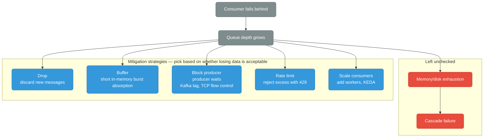

| Strategy | Behavior | Use When |
|----------|----------|----------|
| Drop | Discard new messages | Lossy telemetry, metrics |
| Buffer | In-memory queue before consumer | Short bursts only |
| Block producer | Producer waits until consumer ready | Kafka consumer lag, TCP flow control |
| Rate limit | Reject excess with 429 | API ingestion endpoints |
| Scale consumers | Add workers | Queue depth rises (KEDA) |

**KEDA + SQS autoscale:**
```yaml
triggers:
- type: aws-sqs-queue
  metadata:
    queueURL: https://sqs.us-east-1.amazonaws.com/123/my-queue
    queueLength: "10"       # scale up when >10 messages per replica
    awsRegion: us-east-1
```

<div class="quiz-card">
  <p class="quiz-q">For a metrics/telemetry pipeline where occasional data loss is acceptable but a stalled producer is not, which backpressure strategy fits — drop, or block producer?</p>
  <button class="quiz-reveal">Reveal answer</button>
  <div class="quiz-a" hidden>Drop. The table's guidance is explicit: "drop" (discard new messages) is for lossy telemetry/metrics, while "block producer" (producer waits until the consumer is ready) fits cases like Kafka consumer lag or TCP flow control, where losing data isn't acceptable but stalling the producer is. Picking the wrong one either stalls a system that could tolerate loss, or silently drops data that needed to be durable.</div>
</div>

---

## 12. Idempotency

At-least-once delivery = consumers **will** see duplicate messages. Consumers must be idempotent.

**Idempotency key pattern:**

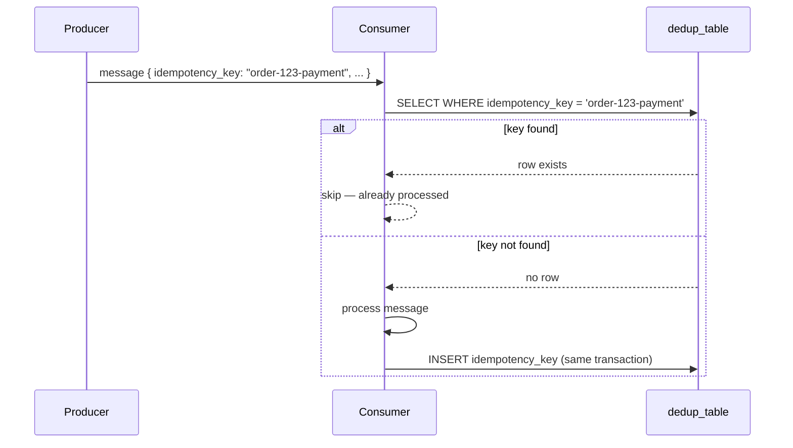

```sql
CREATE TABLE processed_events (
    idempotency_key TEXT PRIMARY KEY,
    processed_at    TIMESTAMPTZ DEFAULT now()
);

-- In consumer (single transaction):
INSERT INTO processed_events (idempotency_key) VALUES ($1)
ON CONFLICT DO NOTHING
RETURNING idempotency_key;
-- Only process if row was inserted (not a duplicate)
```

**SQS deduplication:** FIFO queues have built-in 5-minute dedup window using `MessageDeduplicationId`.

<div class="quiz-card">
  <p class="quiz-q">A consumer checks the dedup table, sees no existing row, and then processes the message — with the insert into the dedup table happening as a separate step afterward. Is that safe under at-least-once delivery?</p>
  <button class="quiz-reveal">Reveal answer</button>
  <div class="quiz-a" hidden>Only if the check, process, and insert happen in the same transaction. If they're separate steps, two redelivered copies of the same message can both pass the "not found" check before either one inserts — both get processed, defeating the dedup. The pattern above relies on <code>INSERT ... ON CONFLICT DO NOTHING RETURNING</code> and only processing when a row was actually inserted, which makes the check-and-claim atomic.</div>
</div>

---

## 13. SQS Specifics

### Visibility Timeout
After `ReceiveMessage`, message hidden from other consumers for `VisibilityTimeout` seconds.
- Worker must `DeleteMessage` before timeout or message reappears
- Set timeout > max processing time
- Extend with `ChangeMessageVisibility` for long jobs

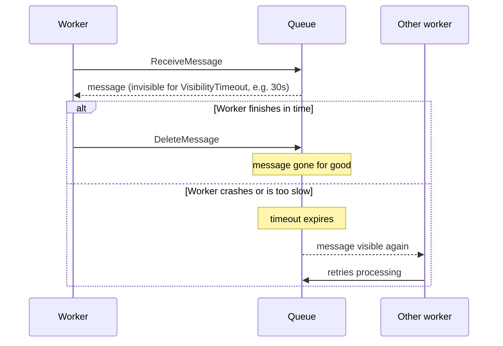

### Long Polling
`WaitTimeSeconds: 20` — connection held open until message arrives or 20s elapses. Reduces empty receives and cost.

```python
sqs.receive_message(
    QueueUrl=queue_url,
    WaitTimeSeconds=20,
    MaxNumberOfMessages=10
)
```

### FIFO vs Standard

| Feature | Standard | FIFO |
|---------|----------|------|
| Throughput | Unlimited | 300 TPS (3000 with batching) |
| Ordering | Best-effort | Strict per MessageGroupId |
| Deduplication | No | Yes (5-min window) |
| Exactly-once | No | Yes |
| Use | High-throughput tasks | Order-sensitive workflows |

### Message Groups (FIFO)
`MessageGroupId` = partition key. Messages in same group are strictly ordered. Different groups processed in parallel.

```python
sqs.send_message(
    QueueUrl=fifo_url,
    MessageBody=json.dumps(event),
    MessageGroupId=f"user-{user_id}",
    MessageDeduplicationId=event_id
)
```

### Delay Queues
`DelaySeconds` (0-900): message invisible on arrival. Use for retry backoff, scheduled tasks.

<div class="quiz-card">
  <p class="quiz-q">A worker sets VisibilityTimeout to 10s but the job actually takes 45s to process. What's the likely outcome?</p>
  <button class="quiz-reveal">Reveal answer</button>
  <div class="quiz-a" hidden>The message becomes visible again after 10s — while the first worker is still processing it — so a second worker can receive and start processing the same message too. That's why the rule is "set timeout > max processing time," and why long-running jobs need to proactively extend it with ChangeMessageVisibility instead of relying on one fixed timeout.</div>
</div>

---

## 14. Kafka vs SQS vs RabbitMQ

| Feature | Kafka | SQS | RabbitMQ |
|---------|-------|-----|----------|
| Persistence | Log, configurable retention | Up to 14 days | In-memory + optional disk |
| Ordering | Per partition | FIFO: per group, Standard: none | Per queue |
| Consumer model | Pull, consumer tracks offset | Pull, visibility timeout | Push or pull |
| Replay | Yes, seek to any offset | No | No (once acked, gone) |
| Throughput | Millions/sec | Unlimited (Standard) | ~50k/sec per queue |
| Latency | Low ms | Low ms (long poll) | Sub-ms |
| Routing | Topics + partitions | Queue per pattern | Exchanges + routing keys |
| Ops overhead | High (ZooKeeper/KRaft, brokers) | Zero (managed) | Medium (self-host or CloudAMQP) |
| Multi-consumer fanout | Yes (consumer groups) | SNS + SQS fan-out | Exchanges (fanout, topic) |
| Exactly-once | Kafka transactions | SQS FIFO | With publisher confirms + manual |

**Choose Kafka** when: replay needed, high throughput, event sourcing, stream processing (Kafka Streams, Flink).
**Choose SQS** when: AWS-native, simple task queue, zero ops.
**Choose RabbitMQ** when: complex routing, low latency, existing AMQP ecosystem.

<div class="quiz-card">
  <p class="quiz-q">Which of these three lets a consumer replay messages from an arbitrary point in the past?</p>
  <button class="quiz-reveal">Reveal answer</button>
  <div class="quiz-a" hidden>Only Kafka — it stores messages in a log with configurable retention and lets a consumer seek to any offset. SQS has no replay at all, and RabbitMQ messages are gone once acked. This is a core reason to pick Kafka over the other two: replay, event sourcing, and stream processing all depend on that log-with-seek model, not just raw throughput.</div>
</div>

---

## 15. Real Examples

### Order Processing Pipeline

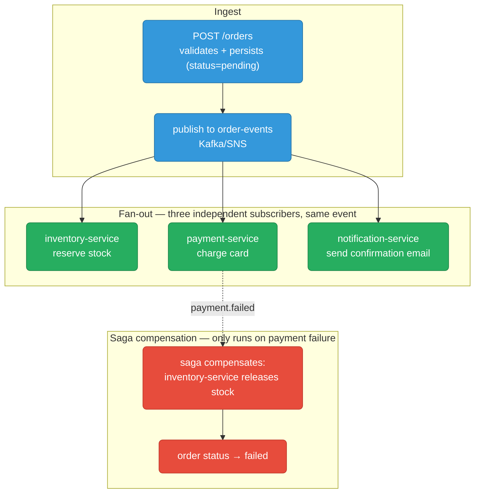

### Image Resize Pipeline

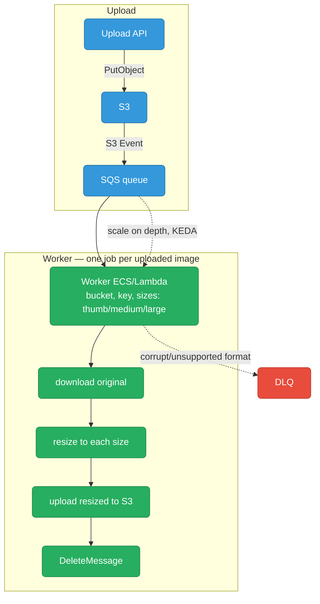

### Notification Service (Fan-out)

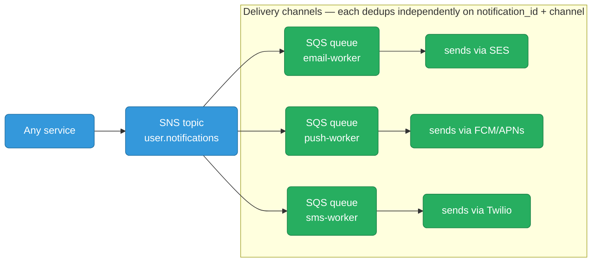

Each worker:
  - idempotency key = notification_id + channel
  - dedup before sending to avoid double-send on retry

### Audit Log (Event Sourcing)

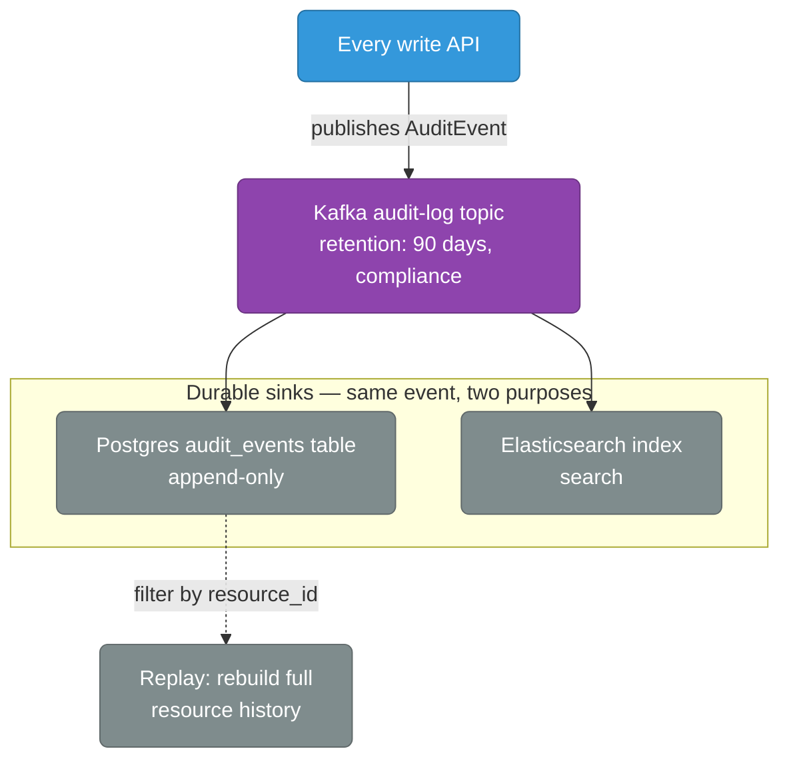

```
AuditEvent: {
  event_id, timestamp, user_id, action,
  resource_type, resource_id, before, after
}
```

<div class="quiz-card">
  <p class="quiz-q">In the notification fan-out example, each worker's idempotency key is <code>notification_id + channel</code>, not just <code>notification_id</code>. Why does the channel need to be part of the key?</p>
  <button class="quiz-reveal">Reveal answer</button>
  <div class="quiz-a" hidden>Because the same notification fans out to three independent workers (email, push, SMS) via three separate SQS queues off one SNS topic. If the key were just notification_id, the first channel to process it would "claim" that key, and the dedup check would make the other two channels look like duplicates and skip sending entirely. Including the channel keeps each channel's dedup independent, while still deduping retries within that same channel.</div>
</div>

---

## Quick Reference

```
Decouple + absorb spikes          → queue (SQS/Kafka)
Broadcast to many consumers       → pub/sub (SNS, Kafka topics)
Guaranteed processing + retry     → at-least-once + DLQ
Atomic DB write + publish         → outbox pattern
Distributed transaction           → saga (choreography or orchestration)
Full history + time travel        → event sourcing
Fast reads, separate write model  → CQRS
Prevent duplicate processing      → idempotency key + dedup table
Consumer falling behind           → backpressure (drop/block/scale/rate-limit)
```
