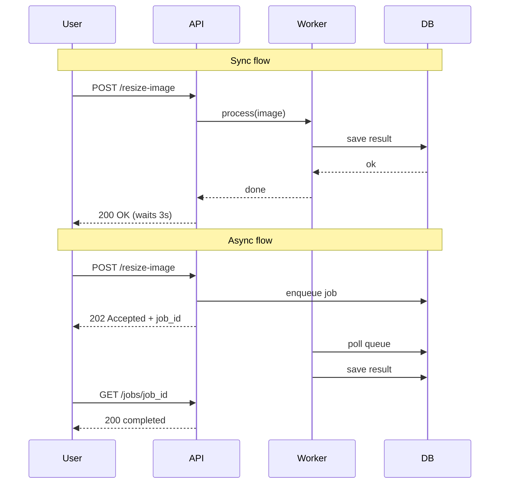
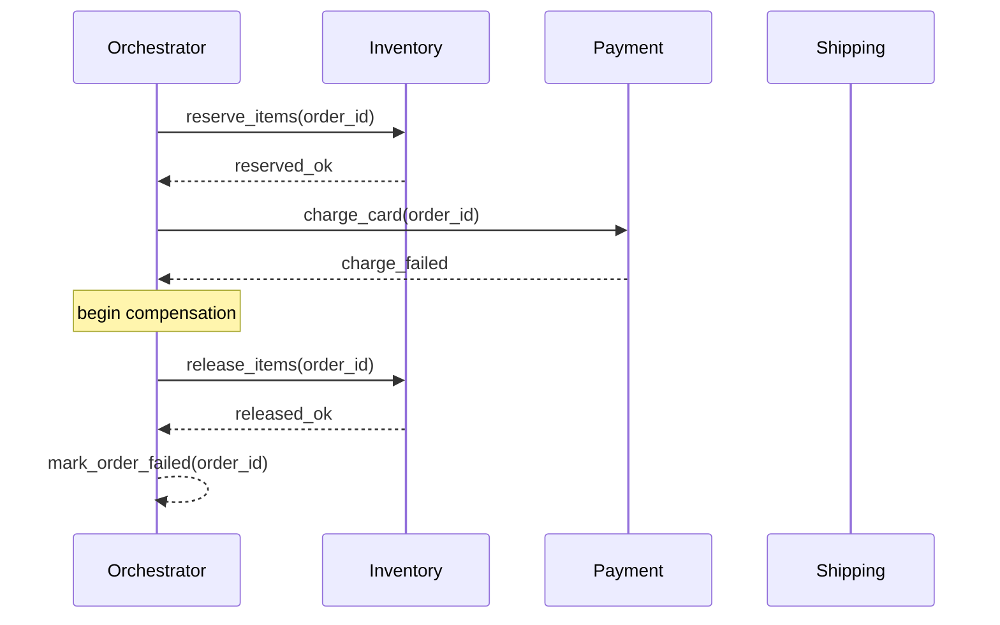

# Async Patterns — Message Queues and Event-Driven Architecture

---

## 1. Why Async

| Problem | Sync Solution | Async Solution |
|---------|---------------|----------------|
| Slow downstream | User waits | Job queued, 202 returned |
| Traffic spike | Drop/timeout | Queue absorbs burst |
| Transient failure | Retry in-band | Message retried from queue |
| CPU-bound work | Blocks thread | Worker pool processes in parallel |

Core benefits:
- **Decouple** producers and consumers — deploy/scale independently
- **Absorb spikes** — queue depth grows instead of requests failing
- **Retry on failure** — message stays in queue until acked
- **Parallelism** — multiple workers consume same queue

---

## 2. Sync vs Async Request Flow



---

## 3. Message Delivery Guarantees

| Guarantee | Behavior | Tradeoff | Systems |
|-----------|----------|----------|---------|
| At-most-once | Fire and forget, no retry | May lose messages | UDP, SNS (no DLQ), Kafka (acks=0) |
| At-least-once | Retry until acked | Duplicates possible | SQS, Kafka (acks=1/-1), RabbitMQ |
| Exactly-once | Delivered and processed once | High cost, slower | Kafka transactions, SQS FIFO + dedup |

**Practical rule:** build for at-least-once + idempotent consumers. Exactly-once is expensive and rarely worth it.

---

## 4. Queue Patterns

### Point-to-Point
One message → one consumer. Workers compete; each message processed once.

```
Producer → [Queue] → Consumer A  (Consumer B does not see this message)
```

Use: task queues, job workers. SQS standard queue.

### Pub/Sub
One message → all subscribers. Fan-out.

```
Producer → Topic → Subscriber A
                 → Subscriber B
                 → Subscriber C
```

Use: event broadcast, notifications. SNS topics, Kafka topics.

### Competing Consumers
Multiple workers on the same queue for horizontal scale.

```
Producer → [Queue] → Worker 1
                   → Worker 2
                   → Worker 3
```

SQS: workers call `ReceiveMessage` concurrently; visibility timeout prevents double-processing.

### Priority Queue
High-priority messages processed before low-priority.

- **RabbitMQ**: `x-max-priority` queue arg, per-message `priority` property
- **SQS FIFO**: no native priority — workaround: separate queues per priority tier, consume high-priority queue first

```python
# RabbitMQ priority queue declaration
channel.queue_declare(queue='jobs', arguments={'x-max-priority': 10})
channel.basic_publish(
    exchange='', routing_key='jobs',
    body='urgent task',
    properties=pika.BasicProperties(priority=9)
)
```

---

## 5. Dead Letter Queue (DLQ)

Messages go to DLQ when:
- Max receive count exceeded (SQS: `maxReceiveCount`)
- TTL expired (RabbitMQ: `x-message-ttl`)
- Consumer explicitly rejects without requeue

```
[Queue] → Worker fails 3x → [DLQ]
                               ↓
                          Alert + inspect + reprocess
```

**SQS DLQ config:**
```json
{
  "RedrivePolicy": {
    "deadLetterTargetArn": "arn:aws:sqs:us-east-1:123:my-dlq",
    "maxReceiveCount": 3
  }
}
```

**Monitoring:**
- CloudWatch alarm on `ApproximateNumberOfMessagesVisible` on DLQ > 0
- Alert immediately — DLQ message = data not processed

**Reprocessing:** replay DLQ messages back to source queue after fixing the consumer bug.

---

## 6. Outbox Pattern

**Problem:** dual-write — you need to write to DB *and* publish to queue atomically. If the app crashes between the two, you get inconsistency.

**Solution:** write event to an `outbox` table in the *same DB transaction*. Separate poller reads outbox and publishes.

```
Service → DB transaction:
            INSERT INTO orders (...)
            INSERT INTO outbox (event_type, payload, published=false)

Poller  → SELECT * FROM outbox WHERE published=false
        → publish to queue
        → UPDATE outbox SET published=true
```

```sql
CREATE TABLE outbox (
    id          UUID PRIMARY KEY DEFAULT gen_random_uuid(),
    event_type  TEXT NOT NULL,
    payload     JSONB NOT NULL,
    published   BOOLEAN DEFAULT false,
    created_at  TIMESTAMPTZ DEFAULT now()
);
```

Tools that implement this: Debezium (CDC-based), Transactional Outbox libraries.

**Guarantee:** at-least-once delivery. Poller must handle crash between publish and mark-published → idempotent consumers required.

---

## 7. Saga Pattern

Distributed transactions across microservices without 2PC. Each step has a **compensation transaction** to undo on failure.

### Choreography (events)
Each service listens for events and emits next event. No central coordinator.

```
OrderService → order.created →
  InventoryService → inventory.reserved → 
    PaymentService → payment.charged →
      ShippingService → order.shipped

On failure:
  PaymentService → payment.failed →
    InventoryService → inventory.released →
      OrderService → order.cancelled
```

Pros: loose coupling. Cons: hard to trace, event loops possible.

### Orchestration (central coordinator)
One saga orchestrator calls each service and handles failures.

```
SagaOrchestrator:
  1. call InventoryService.reserve()
  2. call PaymentService.charge()
  3. call ShippingService.ship()
  on failure at step N: call compensate() for steps 1..N-1
```

Pros: clear flow, easy to trace. Cons: orchestrator is a dependency.

---

## 8. Saga Sequence — E-Commerce Order



---

## 9. Event Sourcing

**State = current value** (traditional) vs **State = sequence of events** (event sourcing).

```
Traditional:   orders table  → { id: 1, status: "shipped", total: 99 }

Event sourced: events table  → OrderCreated   { id:1, total:99 }
                              → PaymentCharged { id:1, amount:99 }
                              → OrderShipped   { id:1, tracking:"XYZ" }
               Replay events → current state
```

**Benefits:**
- Full audit log for free
- Rebuild read projections at any point in time
- Debug by replaying history

**Tradeoffs:**
- Querying current state requires replay or a projection
- Schema evolution of old events is hard
- Store grows forever (use snapshots)

**Snapshot pattern:** periodically store current state so replay starts from snapshot, not event 0.

---

## 10. CQRS

Separate **write model** (commands) from **read model** (queries).

```
Client
  │
  ├─ Command → Write API → DB (normalized, consistent)
  │                           │
  │                           └─ async projection → Read DB (denormalized, fast)
  │
  └─ Query  → Read API  → Read DB
```

Write DB: optimized for consistency (Postgres, normalized).  
Read DB: optimized for query patterns (Elasticsearch, Redis, denormalized Postgres view).

**Eventual consistency gap:** read model lags write model by milliseconds to seconds. Client must handle stale reads (show "processing" state).

CQRS + Event Sourcing pair naturally: events from write side populate read projections.

---

## 11. Backpressure

Consumer falls behind → queue grows → memory/disk exhaustion → cascade failure.

| Strategy | Behavior | Use When |
|----------|----------|----------|
| Drop | Discard new messages | Lossy telemetry, metrics |
| Buffer | In-memory queue before consumer | Short bursts only |
| Block producer | Producer waits until consumer ready | Kafka consumer lag, TCP flow control |
| Rate limit | Reject excess with 429 | API ingestion endpoints |
| Scale consumers | Add workers | Queue depth rises (KEDA) |

**KEDA + SQS autoscale:**
```yaml
triggers:
- type: aws-sqs-queue
  metadata:
    queueURL: https://sqs.us-east-1.amazonaws.com/123/my-queue
    queueLength: "10"       # scale up when >10 messages per replica
    awsRegion: us-east-1
```

---

## 12. Idempotency

At-least-once delivery = consumers **will** see duplicate messages. Consumers must be idempotent.

**Idempotency key pattern:**
```
Producer sends: { idempotency_key: "order-123-payment", ... }
Consumer:
  1. check dedup_table WHERE idempotency_key = 'order-123-payment'
  2. if found → skip (already processed)
  3. if not found → process + INSERT into dedup_table (in same transaction)
```

```sql
CREATE TABLE processed_events (
    idempotency_key TEXT PRIMARY KEY,
    processed_at    TIMESTAMPTZ DEFAULT now()
);

-- In consumer (single transaction):
INSERT INTO processed_events (idempotency_key) VALUES ($1)
ON CONFLICT DO NOTHING
RETURNING idempotency_key;
-- Only process if row was inserted (not a duplicate)
```

**SQS deduplication:** FIFO queues have built-in 5-minute dedup window using `MessageDeduplicationId`.

---

## 13. SQS Specifics

### Visibility Timeout
After `ReceiveMessage`, message hidden from other consumers for `VisibilityTimeout` seconds.
- Worker must `DeleteMessage` before timeout or message reappears
- Set timeout > max processing time
- Extend with `ChangeMessageVisibility` for long jobs

```
[Queue] → Worker receives msg → msg invisible (30s)
  Worker finishes → DeleteMessage ✓
  Worker crashes  → timeout expires → msg visible again → retry
```

### Long Polling
`WaitTimeSeconds: 20` — connection held open until message arrives or 20s elapses. Reduces empty receives and cost.

```python
sqs.receive_message(
    QueueUrl=queue_url,
    WaitTimeSeconds=20,
    MaxNumberOfMessages=10
)
```

### FIFO vs Standard

| Feature | Standard | FIFO |
|---------|----------|------|
| Throughput | Unlimited | 300 TPS (3000 with batching) |
| Ordering | Best-effort | Strict per MessageGroupId |
| Deduplication | No | Yes (5-min window) |
| Exactly-once | No | Yes |
| Use | High-throughput tasks | Order-sensitive workflows |

### Message Groups (FIFO)
`MessageGroupId` = partition key. Messages in same group are strictly ordered. Different groups processed in parallel.

```python
sqs.send_message(
    QueueUrl=fifo_url,
    MessageBody=json.dumps(event),
    MessageGroupId=f"user-{user_id}",
    MessageDeduplicationId=event_id
)
```

### Delay Queues
`DelaySeconds` (0-900): message invisible on arrival. Use for retry backoff, scheduled tasks.

---

## 14. Kafka vs SQS vs RabbitMQ

| Feature | Kafka | SQS | RabbitMQ |
|---------|-------|-----|----------|
| Persistence | Log, configurable retention | Up to 14 days | In-memory + optional disk |
| Ordering | Per partition | FIFO: per group, Standard: none | Per queue |
| Consumer model | Pull, consumer tracks offset | Pull, visibility timeout | Push or pull |
| Replay | Yes, seek to any offset | No | No (once acked, gone) |
| Throughput | Millions/sec | Unlimited (Standard) | ~50k/sec per queue |
| Latency | Low ms | Low ms (long poll) | Sub-ms |
| Routing | Topics + partitions | Queue per pattern | Exchanges + routing keys |
| Ops overhead | High (ZooKeeper/KRaft, brokers) | Zero (managed) | Medium (self-host or CloudAMQP) |
| Multi-consumer fanout | Yes (consumer groups) | SNS + SQS fan-out | Exchanges (fanout, topic) |
| Exactly-once | Kafka transactions | SQS FIFO | With publisher confirms + manual |

**Choose Kafka** when: replay needed, high throughput, event sourcing, stream processing (Kafka Streams, Flink).  
**Choose SQS** when: AWS-native, simple task queue, zero ops.  
**Choose RabbitMQ** when: complex routing, low latency, existing AMQP ecosystem.

---

## 15. Real Examples

### Order Processing Pipeline

```
POST /orders
  → API validates + persists order (status=pending)
  → publishes to order-events (Kafka/SNS)

Consumers (parallel):
  inventory-service  → reserve stock
  payment-service    → charge card
  notification-svc   → send confirmation email

payment-service failure → publishes payment.failed
  → saga compensates: inventory-service releases stock
  → order status → failed
```

### Image Resize Pipeline

```
Upload API → S3 PutObject
           → S3 Event → SQS queue

Workers (ECS/Lambda):
  receive message: { bucket, key, sizes: [thumb, medium, large] }
  → download original
  → resize to each size
  → upload resized to S3
  → DeleteMessage

DLQ: corrupt images, unsupported format
KEDA: scale workers based on SQS depth
```

### Notification Service (Fan-out)

```
Any service → SNS topic (user.notifications)
                │
                ├─ SQS queue (email-worker)   → sends via SES
                ├─ SQS queue (push-worker)    → sends via FCM/APNs
                └─ SQS queue (sms-worker)     → sends via Twilio

Each worker:
  - idempotency key = notification_id + channel
  - dedup before sending to avoid double-send on retry
```

### Audit Log (Event Sourcing)

```
Every write API → publishes AuditEvent to Kafka (audit-log topic)

AuditEvent: {
  event_id, timestamp, user_id, action,
  resource_type, resource_id, before, after
}

Kafka retention: 90 days (compliance)
Consumer: writes to append-only audit_events table in Postgres
          + Elasticsearch index for search

Replay: rebuild full resource history by filtering on resource_id
```

---

## Quick Reference

```
Decouple + absorb spikes          → queue (SQS/Kafka)
Broadcast to many consumers       → pub/sub (SNS, Kafka topics)
Guaranteed processing + retry     → at-least-once + DLQ
Atomic DB write + publish         → outbox pattern
Distributed transaction           → saga (choreography or orchestration)
Full history + time travel        → event sourcing
Fast reads, separate write model  → CQRS
Prevent duplicate processing      → idempotency key + dedup table
Consumer falling behind           → backpressure (drop/block/scale/rate-limit)
```
