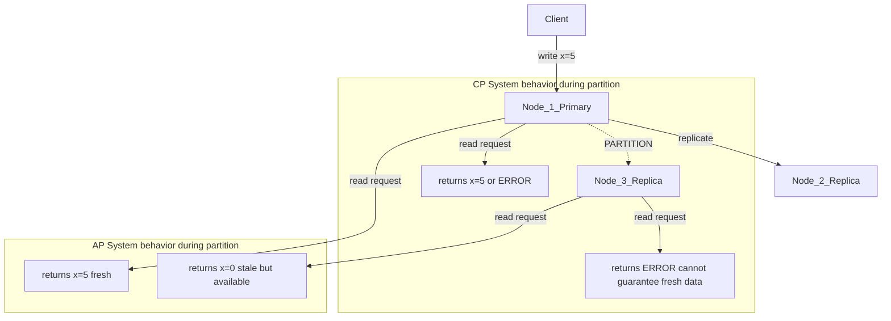

# CAP Theorem, PACELC, and Distributed System Tradeoffs

---

## 1. CAP Theorem

Every distributed system can guarantee at most **2 of 3** properties:

| Property | Definition |
|---|---|
| **Consistency (C)** | Every read receives the most recent write or an error |
| **Availability (A)** | Every request receives a response (not an error), though it may be stale |
| **Partition Tolerance (P)** | The system continues operating when network messages are dropped/delayed |

**Why P is non-negotiable:** Networks fail. Any distributed system deployed across nodes *will* experience partitions. You cannot sacrifice P — you can only choose between C and A *when a partition occurs*.

So the real tradeoff is:
- **CP**: When partitioned, reject requests to guarantee consistency (return error or block)
- **AP**: When partitioned, serve potentially stale data to guarantee availability

---

## 2. Network Partition: CP vs AP Behavior



**CP** (ZooKeeper, etcd): Node 3 refuses to serve reads — it may be out of sync. Client gets an error.

**AP** (Cassandra, DynamoDB): Node 3 serves stale data. Client gets a response, possibly wrong.

---

## 3. Real System Classifications

| System | CAP Class | Consistency | Availability | Notes |
|---|---|---|---|---|
| **PostgreSQL** | CP | Strong (single node) / configurable (replication) | Sacrifices A on partition | Synchronous replication blocks writes if replica unreachable |
| **Redis** | CP (default) | Strong on primary | Primary down = unavailable | Sentinel/Cluster still prioritize consistency; async replication means brief CP |
| **Cassandra** | AP | Eventual (tunable) | Always responds | Tunable via quorum; default eventual; AP at heart |
| **DynamoDB** | AP (default) / CP (optional) | Eventual by default | High availability across AZs | Strong consistency available per-request at higher latency |
| **ZooKeeper** | CP | Linearizable | Leader election required; partitioned nodes go unavailable | Used for coordination — correctness over uptime |
| **etcd** | CP | Linearizable (Raft) | Quorum required; minority partition = unavailable | Powers Kubernetes control plane |
| **Kafka** | CP | Strong within partition (ISR) | Unavailable if leader + ISR lost | `min.insync.replicas` governs the tradeoff |
| **MongoDB** | CP (default) | Strong on primary (w:majority) | Secondary reads = eventual | Read preference + write concern are tunable |

---

## 4. Consistency Models Spectrum

From strongest to weakest:

```
Linearizability > Sequential > Causal > Eventual
```

### Linearizability (Strong)
All operations appear instantaneous; reads always reflect the latest write globally.

- **Example:** etcd reads. After a leader writes, any subsequent read anywhere returns that value.
- **Cost:** High latency (requires cross-node coordination).

### Sequential Consistency
All nodes see operations in the same order, but not necessarily real-time.

- **Example:** A multi-player game where all clients see moves in the same sequence, but with some lag.
- **Cost:** Weaker than linearizability; no wall-clock guarantee.

### Causal Consistency
Operations that are causally related (A happens before B) are seen in that order by all nodes. Concurrent operations may be seen in different orders.

- **Example:** "Reply to a post" must appear after the original post. MongoDB with causal sessions.
- **Cost:** Lower than sequential; only tracks causally linked operations.

### Eventual Consistency
If no new updates, all replicas will converge to the same value — eventually.

- **Example:** DynamoDB default reads, Cassandra default, DNS propagation, S3 read-after-write on different regions.
- **Cost:** Reads may be stale; conflicts possible.

---

## 5. PACELC

**CAP only covers behavior during partitions.** PACELC extends it:

> If **P**artition → choose **A** or **C**
> **E**lse (normal operation) → choose **L**atency or **C**onsistency

Even without failures, replicating synchronously costs latency.

| System | P→A or C | E→L or C | Notes |
|---|---|---|---|
| **DynamoDB** | PA | EL | Eventual reads are faster; strong reads cost 2x latency |
| **Cassandra** | PA | EL | Quorum reads add latency vs ONE reads |
| **ZooKeeper** | PC | EC | Always consistent; latency accepted |
| **etcd** | PC | EC | Raft consensus on every write; consistency first |
| **MongoDB** | PC/PA | EC/EL | Depends on write concern (w:majority = PC/EC) |
| **PostgreSQL** | PC | EC | Synchronous standby = consistent but higher write latency |
| **Spanner** | PC | EC | TrueTime-based global linearizability; latency is a known cost |
| **Riak** | PA | EL | Designed for AP; vector clocks for conflict resolution |

---

## 6. Consistency vs Availability Tradeoffs in Practice

### DynamoDB: AP saves latency
```
Eventually consistent read:  ~1ms  — reads from any replica
Strongly consistent read:    ~2ms  — reads only from leader

At 100k req/s: eventually consistent = 2x throughput capacity
```
DynamoDB's default eventual consistency means your shopping cart may show a stale item count — acceptable. A banking balance cannot use this.

### ZooKeeper: CP costs availability
```
3-node ZooKeeper cluster:
- All 3 healthy: leader serves reads/writes ✓
- 1 node down: quorum intact (2/3), still operational ✓
- 2 nodes down: quorum lost → ALL reads/writes REFUSED ✗
```
ZooKeeper refuses to serve rather than risk inconsistency. This is correct for distributed locking and leader election — a stale lock is worse than no lock.

---

## 7. Tunable Consistency

### DynamoDB
```python
# Eventual consistent read (default, faster)
table.get_item(Key={"id": "123"})

# Strongly consistent read (latest data, higher latency)
table.get_item(Key={"id": "123"}, ConsistentRead=True)
```

### Cassandra Quorum
```cql
-- Strong consistency (W+R > N)
INSERT INTO orders ... USING CONSISTENCY QUORUM;   -- W=2 of 3
SELECT * FROM orders WHERE ... CONSISTENCY QUORUM; -- R=2 of 3

-- High availability, eventual
INSERT INTO orders ... USING CONSISTENCY ONE;      -- W=1 of 3
SELECT * FROM orders WHERE ... CONSISTENCY ONE;    -- R=1 of 3
```

### MongoDB Read/Write Concern
```javascript
// Strong: wait for majority replica acknowledgment
db.collection.insertOne(doc, { writeConcern: { w: "majority" } })

// Read from primary only (latest)
db.collection.find({}).readPreference("primary")

// Read from secondary (may be stale, lower latency)
db.collection.find({}).readPreference("secondaryPreferred")
```

---

## 8. Quorum Math

For a cluster of **N** nodes with **W** write acknowledgments and **R** read replicas consulted:

**Strong consistency requires: W + R > N**

This guarantees at least one node in the read set saw the latest write.

| N | W | R | W+R | Guarantee |
|---|---|---|---|---|
| 3 | 2 | 2 | 4 > 3 | **Strong** — overlap guaranteed |
| 3 | 1 | 1 | 2 < 3 | **Eventual** — reads may miss latest write |
| 3 | 3 | 1 | 4 > 3 | **Strong** — but writes are slow (all 3 must ack) |
| 3 | 1 | 3 | 4 > 3 | **Strong** — but reads hit all nodes |
| 5 | 3 | 3 | 6 > 5 | **Strong** — tolerates 2 node failures |
| 5 | 2 | 2 | 4 < 5 | **Eventual** |
| 5 | 1 | 5 | 6 > 5 | **Strong** — reads scan everything, very slow |

**Availability tradeoff:** Higher W = slower writes (more nodes must respond). Higher R = slower reads. Tune based on whether reads or writes are on the hot path.

**Fault tolerance:** With W+R>N and N=3, W=2, R=2 → you can lose **1 node** and still have quorum. With N=5, W=3, R=3 → tolerate **2 node failures**.

---

## 9. Vector Clocks and Version Vectors

Distributed systems need to detect *concurrent writes* — changes made on different nodes with no causal ordering.

### Vector Clock
Each node maintains a counter per node. On every event:
- Increment own counter
- Merge (take max) on receive

```
Node A:  [A:1, B:0, C:0]  →  write x=5
Node B:  [A:0, B:1, C:0]  →  write x=9 (concurrent with A's write)

A sends to C: C sees [A:1, B:0, C:0]
B sends to C: C sees [A:0, B:1, C:0]
```

C cannot determine which write happened first → **conflict detected**. System must reconcile (last-write-wins, merge, or surface to application).

### Conflict Resolution Strategies

| Strategy | Used By | Behavior |
|---|---|---|
| Last Write Wins (LWW) | Cassandra, DynamoDB (default) | Timestamp decides; data loss possible |
| Multi-value (siblings) | Riak | Return all conflicting values; app resolves |
| Application merge | Shopping cart (Amazon Dynamo paper) | Union of items — never lose an addition |
| Operational transform | Google Docs | CRDTs for text merging |

### Version Vectors vs Vector Clocks
- **Vector clocks**: track causality per event
- **Version vectors**: track causality per replica/object (more common in databases)

DynamoDB uses version vectors internally. Cassandra uses timestamps (LWW), not vector clocks — simpler but can lose data on concurrent writes.

---

## 10. Practical Guidance: CP vs AP by Use Case

| Use Case | Choose | Reason |
|---|---|---|
| **User authentication / session tokens** | **CP** | Stale session = security hole. Revoked token must be invalid immediately. Use Redis with strong consistency or a CP store. |
| **Shopping cart** | **AP** | Losing an item add is worse than a brief stale count. Use eventual consistency with conflict resolution (merge/union). Amazon's Dynamo paper was designed for this. |
| **Inventory count** | **CP** | Overselling is a business problem. Need exact counts. Use transactions (Postgres, DynamoDB transactions, or Cassandra LWT). |
| **Social media feed** | **AP** | A tweet appearing 200ms late is fine. Blocking all reads for consistency kills UX. Cassandra/DynamoDB eventual reads are correct here. |
| **Payment processing** | **CP** | Money cannot be double-spent or lost. Requires linearizability + transactions. Use Postgres, Spanner, or DynamoDB with transactions + idempotency keys. |

### Decision Framework

```
Is stale data dangerous (security, money, inventory)?
  YES → CP. Accept availability degradation on partition.
  NO  → AP. Accept stale reads for higher availability.

Is the operation idempotent and retryable?
  YES → AP is safer (client can retry on stale read).
  NO  → CP required (double-charge, double-deduction).

Is low latency more important than perfect accuracy?
  YES → AP + eventual consistency (feeds, analytics, caches).
  NO  → CP (financial records, auth tokens, distributed locks).
```

---

## Summary

```
CAP:    Network partition is inevitable → choose CP or AP
PACELC: Even without partition → Latency (AP) vs Consistency (CP)

CP systems:  ZooKeeper, etcd, PostgreSQL (sync), Kafka (ISR)
AP systems:  Cassandra, DynamoDB (default), Riak, Couchbase

Quorum:     W + R > N → strong consistency
Vector clocks: detect concurrent writes, enable conflict resolution

Rule of thumb:
  Money / Auth / Locks → CP
  Feeds / Carts / Caches → AP
```
