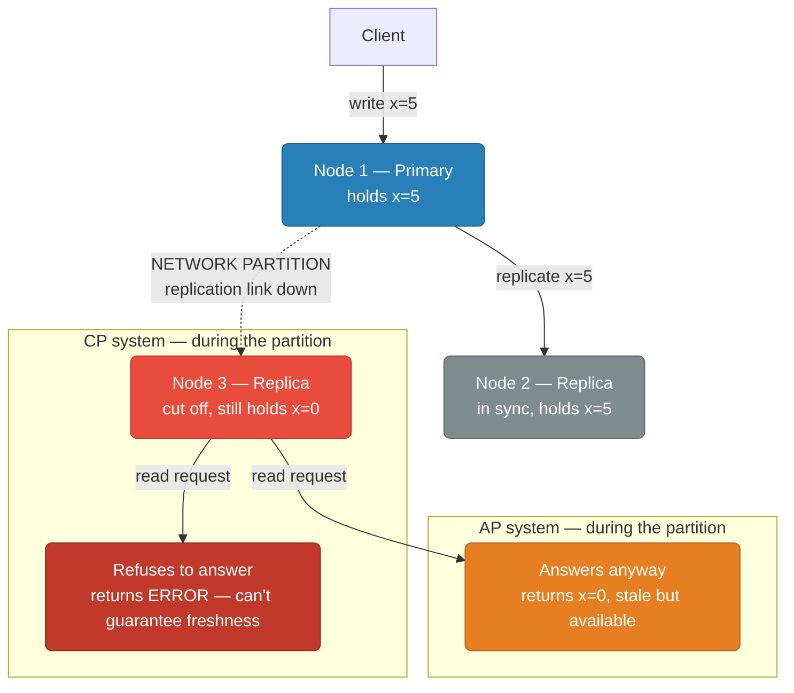
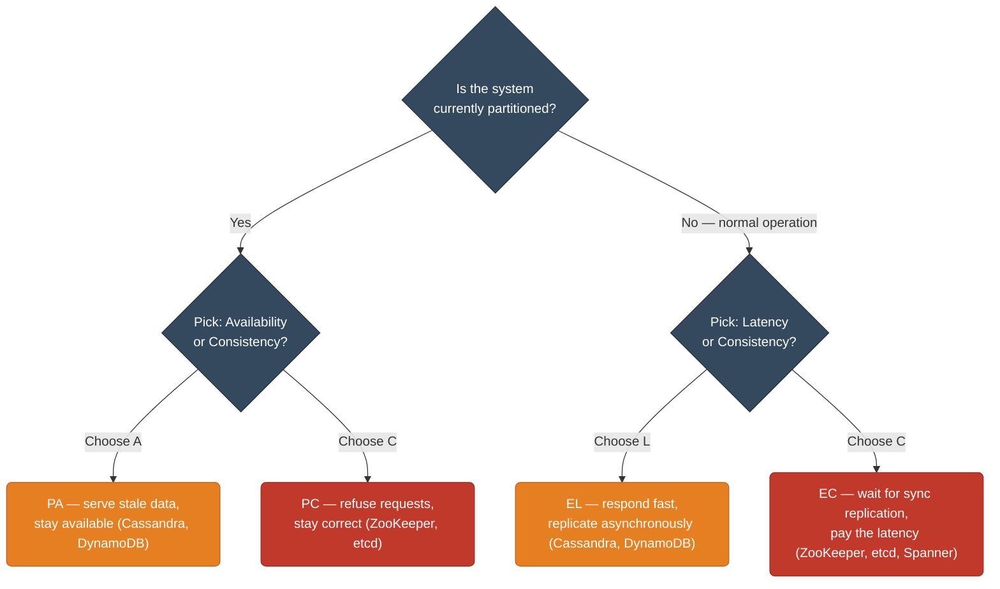
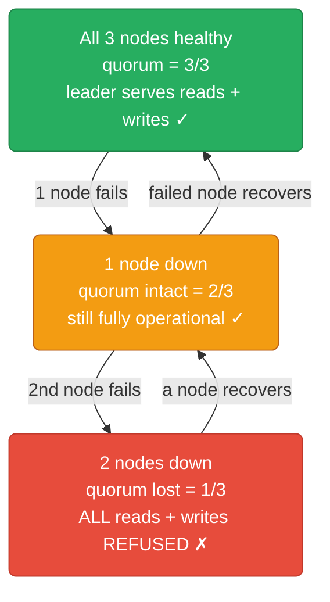
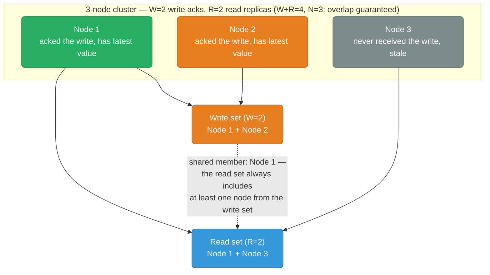
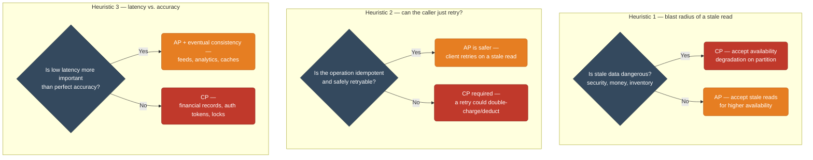

# CAP Theorem, PACELC, and Distributed System Tradeoffs

A field guide to the tradeoffs every distributed system makes — during a network partition, and even when nothing is broken. What you give up, when, and why the "right" answer depends entirely on what a stale read actually costs you.

<div class="quiz-progress" data-quiz-progress>
  <span class="quiz-progress-label">0/0 checks</span>
  <span class="quiz-progress-bar"><span class="quiz-progress-fill"></span></span>
</div>

---

## 1. CAP Theorem

Every distributed system can guarantee at most **2 of 3** properties:

| Property | Definition |
|---|---|
| **Consistency (C)** | Every read receives the most recent write or an error |
| **Availability (A)** | Every request receives a response (not an error), though it may be stale |
| **Partition Tolerance (P)** | The system continues operating when network messages are dropped/delayed |

**Why P is non-negotiable:** Networks fail. Any distributed system deployed across nodes *will* experience partitions. You cannot sacrifice P — you can only choose between C and A *when a partition occurs*.

So the real tradeoff is:
- **CP**: When partitioned, reject requests to guarantee consistency (return error or block)
- **AP**: When partitioned, serve potentially stale data to guarantee availability

<div class="quiz-card">
  <p class="quiz-q">CAP says you pick 2 of 3 properties. Why, in practice, do engineers really only choose between C and A?</p>
  <button class="quiz-reveal">Reveal answer</button>
  <div class="quiz-a" hidden>Because Partition Tolerance isn't optional — networks fail regardless of what you'd prefer, and any distributed system deployed across nodes will experience partitions. You can't "choose" P away, so the only real decision is what happens to a request <em>when</em> a partition occurs: reject it to stay correct (CP), or answer it with possibly stale data to stay available (AP).</div>
</div>

---

## 2. Network Partition: CP vs AP Behavior



**CP** (ZooKeeper, etcd): Node 3 refuses to serve reads — it may be out of sync. Client gets an error.

**AP** (Cassandra, DynamoDB): Node 3 serves stale data. Client gets a response, possibly wrong.

<div class="toggle-switch">
  <div class="toggle-buttons">
    <button data-toggle-opt="cp" class="active">CP — reject to stay correct</button>
    <button data-toggle-opt="ap">AP — answer to stay available</button>
  </div>
  <div class="toggle-panel active" data-toggle-panel="cp">
    <p>Node 3 is cut off from the primary and knows it might be stale. Rather than guess, it refuses the request — the client gets an error, or the request blocks until quorum is restored. <strong>Examples:</strong> ZooKeeper, etcd, Kafka when <code>min.insync.replicas</code> can't be met.</p>
    <p>The system is betting that a wrong answer is worse than no answer. Once the partition heals, the isolated node simply catches up via normal replication — it never accepted any writes while cut off, so there's nothing to reconcile.</p>
  </div>
  <div class="toggle-panel" data-toggle-panel="ap">
    <p>Node 3 keeps serving — it returns <code>x=0</code>, stale but a real response. <strong>Examples:</strong> Cassandra, DynamoDB.</p>
    <p>The system is betting that a possibly-wrong answer beats none. Once the partition heals, the diverged replicas must reconcile — read repair, anti-entropy, hinted handoff, or a vector-clock/version-vector merge (see Section 9) — because Node 3 may have accepted writes the primary never saw.</p>
  </div>
</div>

<div class="quiz-card">
  <p class="quiz-q">During the partition, what does the cut-off node (Node 3) actually return in an AP system versus a CP system?</p>
  <button class="quiz-reveal">Reveal answer</button>
  <div class="quiz-a" hidden>AP: Node 3 still answers — it returns <code>x=0</code>, stale but a real response, because being available matters more than being right. CP: Node 3 refuses to answer at all and returns an error, because it can't guarantee its data is fresh and won't risk serving (or accepting) something wrong.</div>
</div>

---

## 3. Real System Classifications

| System | CAP Class | Consistency | Availability | Notes |
|---|---|---|---|---|
| **PostgreSQL** | CP | Strong (single node) / configurable (replication) | Sacrifices A on partition | Synchronous replication blocks writes if replica unreachable |
| **Redis** | CP (default) | Strong on primary | Primary down = unavailable | Sentinel/Cluster still prioritize consistency; async replication means brief CP |
| **Cassandra** | AP | Eventual (tunable) | Always responds | Tunable via quorum; default eventual; AP at heart |
| **DynamoDB** | AP (default) / CP (optional) | Eventual by default | High availability across AZs | Strong consistency available per-request at higher latency |
| **ZooKeeper** | CP | Linearizable | Leader election required; partitioned nodes go unavailable | Used for coordination — correctness over uptime |
| **etcd** | CP | Linearizable (Raft) | Quorum required; minority partition = unavailable | Powers Kubernetes control plane |
| **Kafka** | CP | Strong within partition (ISR) | Unavailable if leader + ISR lost | `min.insync.replicas` governs the tradeoff |
| **MongoDB** | CP (default) | Strong on primary (w:majority) | Secondary reads = eventual | Read preference + write concern are tunable |

<div class="quiz-card">
  <p class="quiz-q">According to the classification table, is Kafka CP or AP, and what setting governs that tradeoff?</p>
  <button class="quiz-reveal">Reveal answer</button>
  <div class="quiz-a" hidden>Kafka is CP — strong consistency within a partition via the in-sync replica set (ISR), but it becomes unavailable if the leader and enough ISR replicas are lost. <code>min.insync.replicas</code> is the knob: it sets how many replicas (including the leader) must be in the ISR for a write to be accepted at all.</div>
</div>

---

### Why Consensus Gives You CP

The table above lists etcd's consistency as "Linearizable (Raft)" — but *why*
does a Raft- or Paxos-based consensus protocol earn you the C in CP, rather
than just happening to be strong most of the time? The mechanism is quorum
writes. Every write has to be replicated to and acknowledged by a **majority**
of nodes before the leader commits it and answers the client — that's exactly
the same W+R>N overlap guarantee from the quorum math in Section 8, with W set
to a majority and every read served by (or forwarded to) the current leader.

That single rule is what produces both halves of CP simultaneously. Consistency
falls out because any future leader must also win a majority vote, and a
majority-vote quorum always overlaps with any majority-write quorum in at least
one node — so a new leader can never be elected without seeing every previously
committed write. Availability loss on a minority partition isn't a bug or a
side effect — it's the *same* rule enforced from the other direction: a
minority of nodes can never assemble a quorum for a write or an election, so
it **cannot** make progress, full stop, not "make progress slowly." That
inability to progress *is* the unavailability CAP describes.

The actual leader-election state machine, term numbers, and log-replication
protocol that implement this — plus a live, interactive Raft election
simulator you can click through node failures on — live in
[databases/replication.md § 9, Consensus Algorithms](../databases/replication.md#9-consensus-algorithms).
This section only covers the CAP-level "why"; that one covers the "how."

<div class="quiz-card">
  <p class="quiz-q">A minority partition in a Raft/Paxos cluster can't get writes acknowledged. Is that because it's slow to reach quorum, or because it's structurally impossible?</p>
  <button class="quiz-reveal">Reveal answer</button>
  <div class="quiz-a" hidden>Structurally impossible, not slow. A write (and a leader election) requires acknowledgment from a majority of the full cluster. A minority partition, by definition, can never contain a majority of nodes — no amount of waiting fixes that, because the nodes it needs simply aren't reachable. That guaranteed inability to assemble a quorum is exactly what CAP calls unavailability during a partition — the CP behavior is the quorum requirement, viewed from the losing side.</div>
</div>

---

## 4. Consistency Models Spectrum

From strongest to weakest:


<div class="tab-group">
  <div class="tab-buttons">
    <button data-tab="linearizable" class="active">Linearizable</button>
    <button data-tab="sequential">Sequential</button>
    <button data-tab="causal">Causal</button>
    <button data-tab="eventual">Eventual</button>
  </div>
  <div class="tab-panels">
    <div class="tab-panel active" data-tab-panel="linearizable">
      <p><strong>Strongest model.</strong> All operations appear instantaneous; reads always reflect the latest write globally.</p>
      <p><strong>Example:</strong> etcd reads. After a leader writes, any subsequent read anywhere returns that value.</p>
      <p><strong>Cost:</strong> High latency — requires cross-node coordination.</p>
    </div>
    <div class="tab-panel" data-tab-panel="sequential">
      <p>All nodes see operations in the same order, but not necessarily in real time.</p>
      <p><strong>Example:</strong> A multi-player game where all clients see moves in the same sequence, but with some lag.</p>
      <p><strong>Cost:</strong> Weaker than linearizability; no wall-clock guarantee, only a shared ordering.</p>
    </div>
    <div class="tab-panel" data-tab-panel="causal">
      <p>Operations that are causally related (A happens before B) are seen in that order by all nodes. Concurrent operations may be seen in different orders on different nodes.</p>
      <p><strong>Example:</strong> "Reply to a post" must appear after the original post. MongoDB with causal sessions.</p>
      <p><strong>Cost:</strong> Lower than sequential; only tracks causally linked operations, everything else is unconstrained.</p>
    </div>
    <div class="tab-panel" data-tab-panel="eventual">
      <p><strong>Weakest model.</strong> If no new updates, all replicas will converge to the same value — eventually.</p>
      <p><strong>Example:</strong> DynamoDB default reads, Cassandra default, DNS propagation, S3 read-after-write on different regions.</p>
      <p><strong>Cost:</strong> Reads may be stale; conflicts possible.</p>
    </div>
  </div>
</div>

<div class="quiz-card">
  <p class="quiz-q">What actually distinguishes causal consistency from sequential consistency?</p>
  <button class="quiz-reveal">Reveal answer</button>
  <div class="quiz-a" hidden>Sequential consistency requires <em>every</em> node to agree on one global order for <em>all</em> operations, related or not. Causal consistency only orders operations that are causally related (like a reply appearing after its original post) — concurrent, unrelated operations can be seen in a different order on different nodes. Causal is the weaker, cheaper guarantee.</div>
</div>

---

## 5. PACELC

**CAP only covers behavior during partitions.** PACELC extends it:

> If **P**artition → choose **A** or **C**
> **E**lse (normal operation) → choose **L**atency or **C**onsistency

Even without failures, replicating synchronously costs latency.

| System | P→A or C | E→L or C | Notes |
|---|---|---|---|
| **DynamoDB** | PA | EL | Eventual reads are faster; strong reads cost 2x latency |
| **Cassandra** | PA | EL | Quorum reads add latency vs ONE reads |
| **ZooKeeper** | PC | EC | Always consistent; latency accepted |
| **etcd** | PC | EC | Raft consensus on every write; consistency first |
| **MongoDB** | PC/PA | EC/EL | Depends on write concern (w:majority = PC/EC) |
| **PostgreSQL** | PC | EC | Synchronous standby = consistent but higher write latency |
| **Spanner** | PC | EC | TrueTime-based global linearizability; latency is a known cost |
| **Riak** | PA | EL | Designed for AP; vector clocks for conflict resolution |



<div class="quiz-card">
  <p class="quiz-q">Does the PACELC latency-vs-consistency tradeoff only kick in during a network partition?</p>
  <button class="quiz-reveal">Reveal answer</button>
  <div class="quiz-a" hidden>No — that's the entire point of PACELC extending CAP. CAP only describes behavior during a partition. PACELC adds the "Else" branch: even during totally normal operation with no partition at all, synchronous replication for consistency still costs latency (E → L or C). A system like Spanner or a PostgreSQL synchronous standby pays that latency tax on every write, partition or not.</div>
</div>

---

## 6. Consistency vs Availability Tradeoffs in Practice

### DynamoDB: AP saves latency
```
Eventually consistent read:  ~1ms  — reads from any replica
Strongly consistent read:    ~2ms  — reads only from leader

At 100k req/s: eventually consistent = 2x throughput capacity
```
DynamoDB's default eventual consistency means your shopping cart may show a stale item count — acceptable. A banking balance cannot use this.

### ZooKeeper: CP costs availability



ZooKeeper refuses to serve rather than risk inconsistency. This is correct for distributed locking and leader election — a stale lock is worse than no lock.

<div class="quiz-card">
  <p class="quiz-q">In a 3-node ZooKeeper cluster, what happens the moment a second node goes down?</p>
  <button class="quiz-reveal">Reveal answer</button>
  <div class="quiz-a" hidden>Quorum drops to 1/3, which is a minority — so ALL reads and writes are refused across the entire cluster, not just degraded. ZooKeeper would rather be completely unavailable than risk serving or accepting data without majority agreement, because for its use case (distributed locking, leader election) a stale lock is worse than no lock at all.</div>
</div>

---

## 7. Tunable Consistency

### DynamoDB
```python
# Eventual consistent read (default, faster)
table.get_item(Key={"id": "123"})

# Strongly consistent read (latest data, higher latency)
table.get_item(Key={"id": "123"}, ConsistentRead=True)
```

### Cassandra Quorum
```cql
-- Strong consistency (W+R > N)
INSERT INTO orders ... USING CONSISTENCY QUORUM;   -- W=2 of 3
SELECT * FROM orders WHERE ... CONSISTENCY QUORUM; -- R=2 of 3

-- High availability, eventual
INSERT INTO orders ... USING CONSISTENCY ONE;      -- W=1 of 3
SELECT * FROM orders WHERE ... CONSISTENCY ONE;    -- R=1 of 3
```

### MongoDB Read/Write Concern
```javascript
// Strong: wait for majority replica acknowledgment
db.collection.insertOne(doc, { writeConcern: { w: "majority" } })

// Read from primary only (latest)
db.collection.find({}).readPreference("primary")

// Read from secondary (may be stale, lower latency)
db.collection.find({}).readPreference("secondaryPreferred")
```

---

## 8. Quorum Math

For a cluster of **N** nodes with **W** write acknowledgments and **R** read replicas consulted:

**Strong consistency requires: W + R > N**

This guarantees at least one node in the read set saw the latest write.

| N | W | R | W+R | Guarantee |
|---|---|---|---|---|
| 3 | 2 | 2 | 4 > 3 | **Strong** — overlap guaranteed |
| 3 | 1 | 1 | 2 < 3 | **Eventual** — reads may miss latest write |
| 3 | 3 | 1 | 4 > 3 | **Strong** — but writes are slow (all 3 must ack) |
| 3 | 1 | 3 | 4 > 3 | **Strong** — but reads hit all nodes |
| 5 | 3 | 3 | 6 > 5 | **Strong** — tolerates 2 node failures |
| 5 | 2 | 2 | 4 < 5 | **Eventual** |
| 5 | 1 | 5 | 6 > 5 | **Strong** — reads scan everything, very slow |



**Availability tradeoff:** Higher W = slower writes (more nodes must respond). Higher R = slower reads. Tune based on whether reads or writes are on the hot path.

**Fault tolerance:** With W+R>N and N=3, W=2, R=2 → you can lose **1 node** and still have quorum. With N=5, W=3, R=3 → tolerate **2 node failures**.

<div class="quiz-card">
  <p class="quiz-q">For N=3 with W=1, R=1, is this configuration strongly consistent?</p>
  <button class="quiz-reveal">Reveal answer</button>
  <div class="quiz-a" hidden>No. W+R = 2, which is not greater than N = 3, so there's no guaranteed overlap between the node that received the write and the node a later read hits. A read can land on a replica that never got the latest write — this is the eventual-consistency row in the quorum table, not the strong one.</div>
</div>

### Try It Yourself: Live Quorum Overlap

The table above states W+R>N as a static arithmetic rule. But the guarantee it
describes is really about *specific nodes*, not just counts — a write quorum
and a read quorum only actually overlap if the particular nodes chosen for
each happen to share a member. Toggle real nodes into a write set and a read
set below and see whether they actually intersect, for sizes both above and
at-or-below the W+R>N threshold.

<div class="structure-viz" id="quorum-overlap-viz">
  <svg class="viz-canvas" viewBox="0 0 500 260"></svg>
  <div class="viz-controls">
    <button class="viz-btn" data-viz-action="setn" data-n="3">N=3</button>
    <button class="viz-btn" data-viz-action="setn" data-n="5">N=5</button>
    <button class="viz-btn" data-viz-action="setn" data-n="7">N=7</button>
    <input class="viz-input" type="number" min="2" max="9" placeholder="custom N (2-9)" />
    <button class="viz-btn" data-viz-action="applyn">Set N</button>
    <button class="viz-btn viz-btn-danger" data-viz-action="reset">Clear picks</button>
  </div>
  <div class="viz-status"></div>
  <div class="viz-legend">
    <span><span class="viz-swatch" style="background:#e67e22"></span> write-only</span>
    <span><span class="viz-swatch" style="background:#3498db"></span> read-only</span>
    <span><span class="viz-swatch" style="background:#27ae60"></span> both — overlap point</span>
    <span><span class="viz-swatch" style="background:#7f8c8d"></span> neither</span>
  </div>
</div>

<script>
(function () {
  const svgNS = 'http://www.w3.org/2000/svg';
  const root = document.getElementById('quorum-overlap-viz');
  const svg = root.querySelector('.viz-canvas');
  const status = root.querySelector('.viz-status');
  const nInput = root.querySelector('.viz-input');

  const COLOR = {
    write: { fill: '#e67e22', stroke: '#ba6018' },
    read: { fill: '#3498db', stroke: '#2471a3' },
    both: { fill: '#27ae60', stroke: '#1e8449' },
    idle: { fill: '#7f8c8d', stroke: '#616a6b' },
  };

  const WRITE_Y = 55, READ_Y = 135, COMBINED_Y = 215, RADIUS = 20, SPACING = 80, MARGIN = 95;

  let n = 5;
  let writeSet = new Set();
  let readSet = new Set();

  // Pure, testable: given N and the specific node indices chosen for the
  // write and read sets, report set sizes, the arithmetic W+R>N check, and
  // whether the actual chosen sets share a node.
  function checkQuorumOverlap(nodeCount, writeIdx, readIdx) {
    const w = new Set(writeIdx);
    const r = new Set(readIdx);
    const overlapNodes = [...w].filter((i) => r.has(i)).sort((a, b) => a - b);
    const wPlusR = w.size + r.size;
    return {
      n: nodeCount,
      w: w.size,
      r: r.size,
      wPlusR,
      arithmeticGuarantee: wPlusR > nodeCount,
      overlaps: overlapNodes.length > 0,
      overlapNodes,
    };
  }

  function el(tag, attrs) {
    const e = document.createElementNS(svgNS, tag);
    for (const k in attrs) e.setAttribute(k, attrs[k]);
    return e;
  }

  function nodeX(i) { return MARGIN + i * SPACING; }

  function rowLabel(x, y, text) {
    const t = el('text', { x, y, style: 'text-anchor:start;font-weight:600' });
    t.textContent = text;
    svg.appendChild(t);
  }

  function nodeCircle(cx, cy, color, text, clickable, emphasize) {
    const g = el('g', {});
    const c = el('circle', {
      cx, cy, r: RADIUS,
      fill: color.fill, stroke: color.stroke,
      'stroke-width': emphasize ? 3.5 : 1.5,
    });
    if (clickable) c.style.cursor = 'pointer';
    g.appendChild(c);
    const t = el('text', { x: cx, y: cy });
    t.textContent = text;
    g.appendChild(t);
    svg.appendChild(g);
    return c;
  }

  function setStatus(msg, kind) {
    status.textContent = msg;
    status.className = 'viz-status' + (kind === 'ok' ? ' viz-status-ok' : kind === 'error' ? ' viz-status-error' : '');
  }

  function statusMessage(result) {
    const wList = '{' + [...writeSet].sort((a, b) => a - b).join(', ') + '}';
    const rList = '{' + [...readSet].sort((a, b) => a - b).join(', ') + '}';
    const arith = result.arithmeticGuarantee
      ? `W+R=${result.wPlusR} > N=${result.n} — arithmetic guarantee holds`
      : `W+R=${result.wPlusR} ≤ N=${result.n} — no arithmetic guarantee`;
    if (result.overlaps) {
      const nodes = result.overlapNodes.join(', ');
      return `W=${wList} (|W|=${result.w}), R=${rList} (|R|=${result.r}). ${arith}. These picks DO share node(s) {${nodes}} — overlap confirmed.`;
    }
    return `W=${wList} (|W|=${result.w}), R=${rList} (|R|=${result.r}). ${arith}. These picks share NO node — no overlap${result.arithmeticGuarantee ? ' (should be impossible once W+R>N — recheck your picks)' : ' (expected: W+R ≤ N never guarantees overlap)'}.`;
  }

  function draw() {
    const width = Math.max(360, MARGIN + (n - 1) * SPACING + 100);
    svg.setAttribute('viewBox', `0 0 ${width} 260`);
    while (svg.firstChild) svg.removeChild(svg.firstChild);

    const result = checkQuorumOverlap(n, writeSet, readSet);

    rowLabel(16, WRITE_Y, 'WRITE');
    rowLabel(16, READ_Y, 'READ');
    rowLabel(16, COMBINED_Y, 'BOTH');

    for (let i = 0; i < n; i++) {
      const x = nodeX(i);
      const isOverlap = result.overlapNodes.includes(i);

      if (writeSet.has(i)) {
        svg.appendChild(el('line', {
          x1: x, y1: WRITE_Y + RADIUS, x2: x, y2: COMBINED_Y - RADIUS,
          class: isOverlap ? 'viz-edge-active' : 'viz-edge',
        }));
      }
      if (readSet.has(i)) {
        svg.appendChild(el('line', {
          x1: x, y1: READ_Y + RADIUS, x2: x, y2: COMBINED_Y - RADIUS,
          class: isOverlap ? 'viz-edge-active' : 'viz-edge',
        }));
      }

      const wCircle = nodeCircle(x, WRITE_Y, writeSet.has(i) ? COLOR.write : COLOR.idle, String(i), true);
      wCircle.addEventListener('click', () => {
        if (writeSet.has(i)) writeSet.delete(i); else writeSet.add(i);
        draw();
      });

      const rCircle = nodeCircle(x, READ_Y, readSet.has(i) ? COLOR.read : COLOR.idle, String(i), true);
      rCircle.addEventListener('click', () => {
        if (readSet.has(i)) readSet.delete(i); else readSet.add(i);
        draw();
      });

      const inW = writeSet.has(i), inR = readSet.has(i);
      const combinedColor = inW && inR ? COLOR.both : inW ? COLOR.write : inR ? COLOR.read : COLOR.idle;
      nodeCircle(x, COMBINED_Y, combinedColor, String(i), false, inW && inR);
    }

    setStatus(statusMessage(result), result.overlaps ? 'ok' : (result.arithmeticGuarantee ? 'error' : ''));
  }

  root.querySelectorAll('[data-viz-action="setn"]').forEach((btn) => {
    btn.addEventListener('click', () => {
      n = parseInt(btn.getAttribute('data-n'), 10);
      writeSet = new Set();
      readSet = new Set();
      draw();
    });
  });

  root.querySelector('[data-viz-action="applyn"]').addEventListener('click', () => {
    const v = parseInt(nInput.value, 10);
    if (!v || v < 2 || v > 9) {
      setStatus('Enter a custom N between 2 and 9.', 'error');
      return;
    }
    n = v;
    writeSet = new Set();
    readSet = new Set();
    nInput.value = '';
    draw();
  });

  root.querySelector('[data-viz-action="reset"]').addEventListener('click', () => {
    writeSet = new Set();
    readSet = new Set();
    draw();
  });

  draw();
})();
</script>

**Try this:** set N=5. Pick W = {0, 1} and R = {2, 3} — sizes 2 and 2, W+R=4,
which is not greater than N=5, and these two picks share no node: no overlap.
Now, keeping the same sizes, try W = {0, 1} and R = {0, 2} instead — still
W+R=4 ≤ N=5, but this particular pair *does* share node 0. That's the point:
below the W+R>N threshold, overlap is possible but not guaranteed — whether
any given pair overlaps depends entirely on which specific nodes got picked,
which is luck unless a protocol enforces it. Now expand the read set to
{2, 3, 4} (R=3) — still W+R=5, not greater than N=5, and you can still find
non-overlapping picks. Finally grow the read set to 4 nodes (W+R=6 > N=5) and
try several completely different node choices for both sets: every single one
overlaps, no matter which specific nodes you pick — with only 5 nodes total,
2 write nodes and 4 read nodes can't help but share one. That's pigeonhole,
not luck, and it's exactly the guarantee a real quorum protocol enforces on
every request by construction (see "Why Consensus Gives You CP" above),
rather than leaving it to chance the way this toy does.

---

## 9. Vector Clocks and Version Vectors

Distributed systems need to detect *concurrent writes* — changes made on different nodes with no causal ordering.

### Vector Clock
Each node maintains a counter per node. On every event:
- Increment own counter
- Merge (take max) on receive

<div class="stepper">
  <div class="stepper-panels">
    <div class="stepper-panel active">
      <strong>1. Identical starting state.</strong> Node A, Node B, and Node C each hold the same vector clock <code>[A:0, B:0, C:0]</code> — one counter per node, all zeroed.
    </div>
    <div class="stepper-panel">
      <strong>2. Node A writes.</strong> A increments its own counter and writes <code>x=5</code>. Its clock becomes <code>[A:1, B:0, C:0]</code>.
    </div>
    <div class="stepper-panel">
      <strong>3. Node B writes concurrently.</strong> Without having seen A's write, B increments its own counter and writes <code>x=9</code>. Its clock becomes <code>[A:0, B:1, C:0]</code> — a different write, from a different starting point, at roughly the same time.
    </div>
    <div class="stepper-panel">
      <strong>4. Both replicate to Node C.</strong> A sends its update: C sees <code>[A:1, B:0, C:0]</code>. B sends its update: C sees <code>[A:0, B:1, C:0]</code>. Neither vector clock is a superset of the other.
    </div>
    <div class="stepper-panel">
      <strong>5. Conflict detected.</strong> C cannot tell which write "happened first" — the two clocks are causally concurrent, not ordered. The system must reconcile: last-write-wins, keep both as siblings, merge, or surface the conflict to the application.
    </div>
  </div>
  <div class="stepper-controls">
    <button class="stepper-prev">← Prev</button>
    <span class="stepper-dots"></span>
    <span class="stepper-label"></span>
    <button class="stepper-next">Next →</button>
  </div>
</div>

C cannot determine which write happened first → **conflict detected**. System must reconcile (last-write-wins, merge, or surface to application).

### Conflict Resolution Strategies

| Strategy | Used By | Behavior |
|---|---|---|
| Last Write Wins (LWW) | Cassandra, DynamoDB (default) | Timestamp decides; data loss possible |
| Multi-value (siblings) | Riak | Return all conflicting values; app resolves |
| Application merge | Shopping cart (Amazon Dynamo paper) | Union of items — never lose an addition |
| Operational transform | Google Docs | CRDTs for text merging |

### Version Vectors vs Vector Clocks
- **Vector clocks**: track causality per event
- **Version vectors**: track causality per replica/object (more common in databases)

DynamoDB uses version vectors internally. Cassandra uses timestamps (LWW), not vector clocks — simpler but can lose data on concurrent writes.

<div class="quiz-card">
  <p class="quiz-q">Nodes A and B each write concurrently, then both replicate to Node C. Can C tell which write happened first just by comparing the vector clocks?</p>
  <button class="quiz-reveal">Reveal answer</button>
  <div class="quiz-a" hidden>No. <code>[A:1, B:0, C:0]</code> and <code>[A:0, B:1, C:0]</code> — neither is a superset of the other, so they're causally concurrent, not ordered. C detects a conflict and must reconcile it with a strategy (last-write-wins, multi-value siblings, application merge, CRDTs), it cannot derive a "first" write from the clocks alone.</div>
</div>

---

## 10. Practical Guidance: CP vs AP by Use Case

| Use Case | Choose | Reason |
|---|---|---|
| **User authentication / session tokens** | **CP** | Stale session = security hole. Revoked token must be invalid immediately. Use Redis with strong consistency or a CP store. |
| **Shopping cart** | **AP** | Losing an item add is worse than a brief stale count. Use eventual consistency with conflict resolution (merge/union). Amazon's Dynamo paper was designed for this. |
| **Inventory count** | **CP** | Overselling is a business problem. Need exact counts. Use transactions (Postgres, DynamoDB transactions, or Cassandra LWT). |
| **Social media feed** | **AP** | A tweet appearing 200ms late is fine. Blocking all reads for consistency kills UX. Cassandra/DynamoDB eventual reads are correct here. |
| **Payment processing** | **CP** | Money cannot be double-spent or lost. Requires linearizability + transactions. Use Postgres, Spanner, or DynamoDB with transactions + idempotency keys. |

### Decision Framework



<div class="quiz-card">
  <p class="quiz-q">Why is a shopping cart a good fit for AP while inventory count is not, even though both are "commerce" data?</p>
  <button class="quiz-reveal">Reveal answer</button>
  <div class="quiz-a" hidden>Losing an item add to a cart (a stale merge) is a minor, recoverable UX issue — union/merge logic can fix it, so AP's availability wins. But a wrong inventory count can cause overselling, a real business/financial problem — so it needs CP's exact counts and transactions (Postgres, DynamoDB transactions, or Cassandra lightweight transactions).</div>
</div>

---

## Summary

```
CAP:    Network partition is inevitable → choose CP or AP
PACELC: Even without partition → Latency (AP) vs Consistency (CP)

CP systems:  ZooKeeper, etcd, PostgreSQL (sync), Kafka (ISR)
AP systems:  Cassandra, DynamoDB (default), Riak, Couchbase

Quorum:     W + R > N → strong consistency
Vector clocks: detect concurrent writes, enable conflict resolution

Rule of thumb:
  Money / Auth / Locks → CP
  Feeds / Carts / Caches → AP
```
