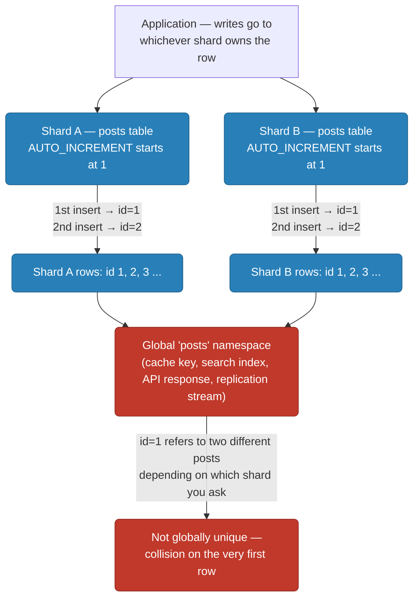
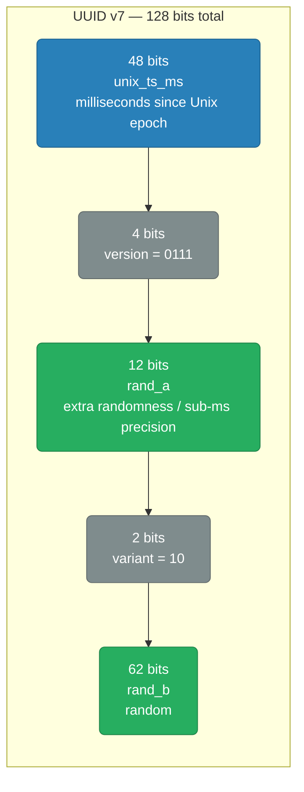
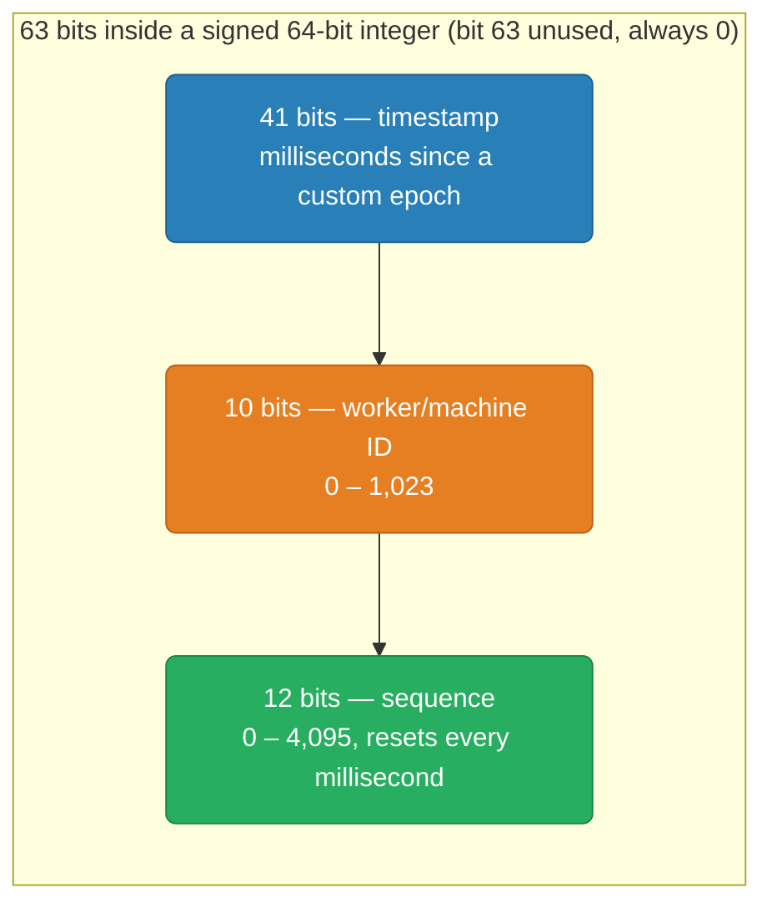
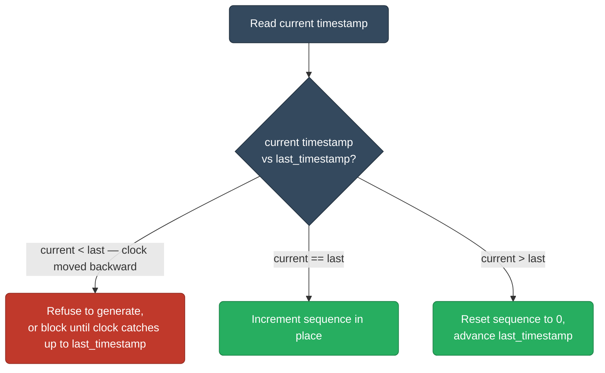
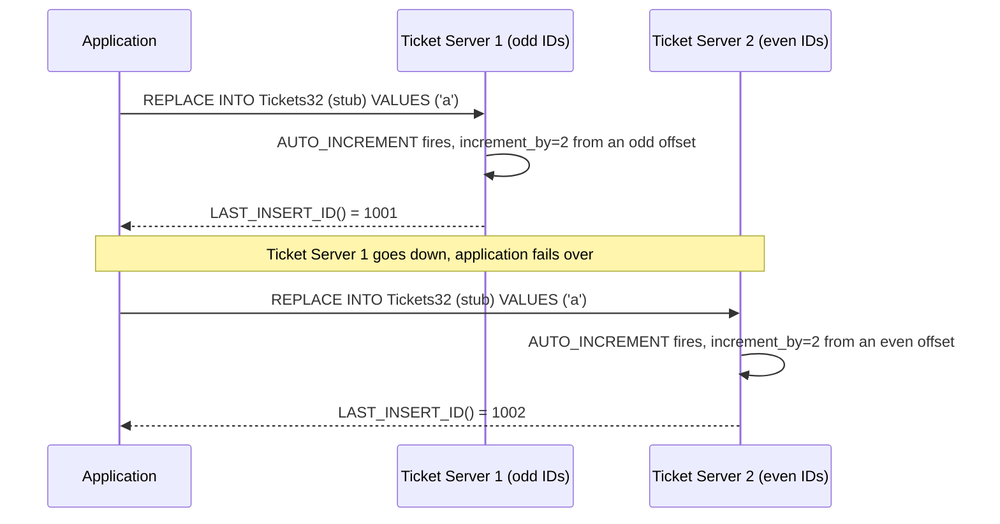
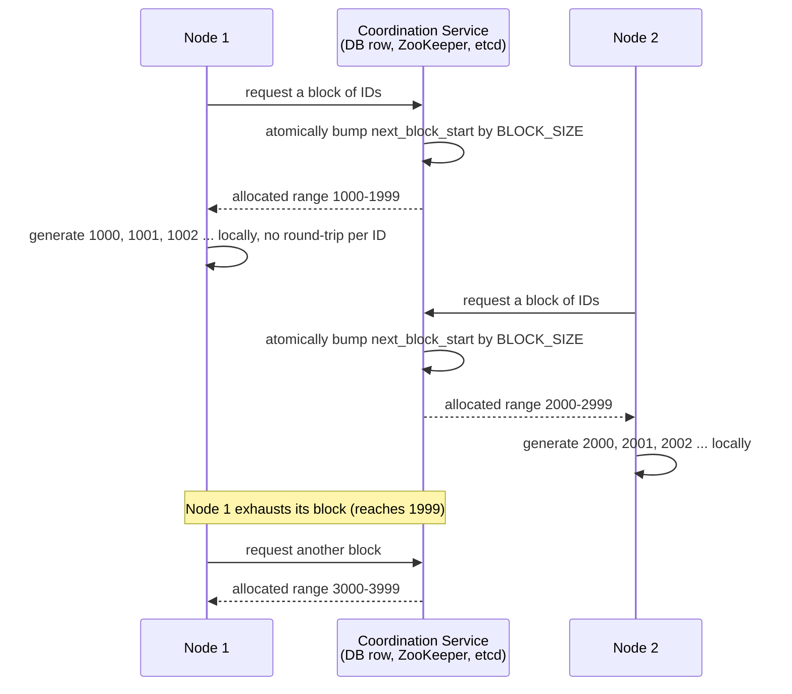
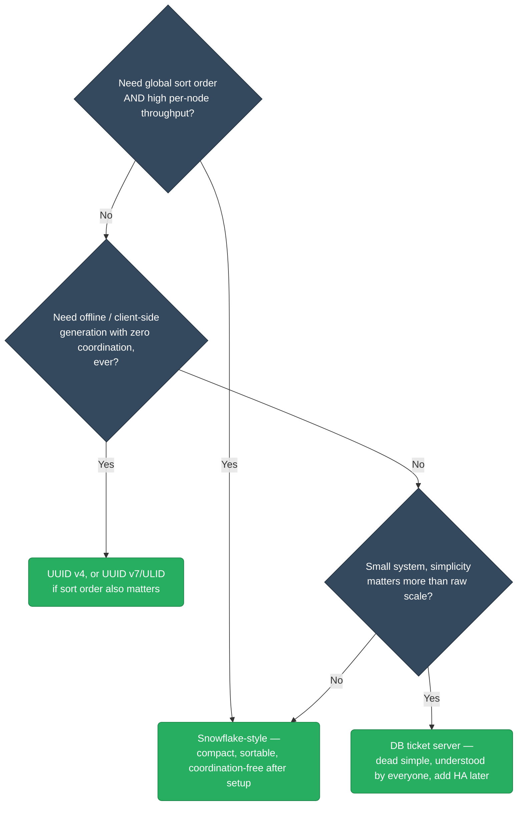

# Distributed ID Generation

Every row, event, and message needs a unique identifier — and the moment you have more than one process minting them, "just increment a number" stops being a safe answer. This guide covers why the naive approach breaks, the actual bit-level mechanics of the schemes that replace it (UUID v4, UUID v7/ULID, Twitter Snowflake, and database-assisted generators), the clock failure modes that make Snowflake-style generators harder than they look, and how to pick the right one for a real system.

<div class="quiz-progress" data-quiz-progress>
  <span class="quiz-progress-label">0/0 checks</span>
  <span class="quiz-progress-bar"><span class="quiz-progress-fill"></span></span>
</div>

---

## 1. Why a Single Auto-Increment Counter Breaks at Scale

A database `AUTO_INCREMENT` / `SERIAL` column works by having the database itself hand out the next integer, one at a time, off a single counter it owns. That design has two separate failure modes, and they show up at different points in a system's growth.

**Contention, before you ever shard.** Every insert has to go through that one counter — it's a single serialization point. Even with row-level locking optimizations, the counter lives on one primary, so write throughput for that table is ultimately capped by however fast one machine can hand out sequential integers and fsync them durably. You can't parallelize your way around it; there's only one place the "next number" comes from.

**Outright collision, the moment you shard.** This is the harder break. Split a table across two independent database shards, and each shard's `AUTO_INCREMENT` starts counting from 1 on its own — because neither shard knows the other exists. Shard A's first row gets `id=1`. Shard B's first row *also* gets `id=1`. They're not "eventually going to collide under heavy load" — they collide immediately, on the very first insert on each shard, because the two counters were never coordinated in the first place.



**Why it matters:** the ID only needs to be unique *within* a single shard's own storage — but almost nothing else in the system respects shard boundaries. A cache keyed by `post:1`, a search index document ID, a URL like `/posts/1`, or a Kafka message key all assume the ID is unique across the whole system, not just within one shard. A per-shard counter silently breaks that assumption the moment you have more than one shard.

<div class="quiz-card">
  <p class="quiz-q">Two database shards each use AUTO_INCREMENT for the same logical table. Do their IDs eventually collide once traffic gets high enough, or is it a problem from the very first row?</p>
  <button class="quiz-reveal">Reveal answer</button>
  <div class="quiz-a" hidden>From the very first row. Each shard's AUTO_INCREMENT counter starts at 1 independently, with no coordination between shards — so Shard A's first insert and Shard B's first insert both produce id=1 immediately, not after some volume threshold. It's a correctness bug baked into the design, not a scale-related race condition.</div>
</div>

---

## 2. UUID v4 — Random and Coordination-Free

A UUID (Universally Unique Identifier) is a 128-bit value. Version 4 sets 122 of those bits to cryptographically random data — the remaining 6 bits are fixed: 4 bits identify the version (`0100`) and 2 bits identify the variant (`10`), so any two conforming UUID v4 generators can be told apart from other UUID versions without any registry or coordination.

| Field | Bits | Purpose |
|---|---|---|
| Random data | 122 | The actual entropy — this is what makes it unique |
| Version | 4 | Fixed to `0100`, identifies "this is a v4 UUID" |
| Variant | 2 | Fixed to `10`, identifies the UUID variant/layout |

**Why collisions are safe to ignore in practice.** This is a birthday-paradox problem, not a "count up to 2^122 and you're fine" problem — with `N` possible values, the odds of *any two* out of `n` randomly generated values colliding cross 50% once `n` is roughly `1.18 * sqrt(N)`, not once `n` approaches `N` itself. With `N = 2^122 ≈ 5.3 × 10^36`, that crossover point works out to about **2.71 × 10^18** generated UUIDs — 2.71 quintillion. Put another way: generating **1 billion UUID v4s every second, continuously, for about a century**, only gets you to roughly a 50% chance of ever seeing a single collision. No real system generates anywhere near that volume, which is why "just use a UUID" is a completely reasonable answer to "how do I avoid coordinating ID generation across nodes."

**The real downside isn't collisions — it's sort order and index locality.** A UUID v4 carries zero information about when it was created; two IDs generated a millisecond apart look completely unrelated. That has two consequences:

1. **Not sortable by creation time.** You can't `ORDER BY id` and get chronological order — you need a separate `created_at` column and index for that, doubling the indexing cost for a property a well-designed ID could have given you for free.
2. **B-tree index fragmentation.** If the UUID is the primary key (or any indexed column), every insert lands at a random point in the index's key space instead of appending to the end. See [mysql-internals.md's InnoDB B-tree section](../databases/mysql-internals.md) — InnoDB's primary key *is* the clustered index, so a random primary key means every insert's physical row location is also random, causing constant page splits scattered across the whole tree instead of the sequential, append-only pattern a monotonic key gives you. PostgreSQL doesn't cluster the heap by primary key by default (see [postgres-internals.md's storage architecture](../databases/postgres-internals.md)), so the heap itself is unaffected — but the B-tree index on that UUID column still pays the same random-insertion page-split cost, and a larger, less cache-friendly index for every UUID-keyed lookup.

<div class="toggle-switch">
  <div class="toggle-buttons">
    <button data-toggle-opt="random" class="active state-bad">Random key (UUID v4)</button>
    <button data-toggle-opt="sequential" class="state-ok">Sequential key (auto-increment, or time-sortable ID)</button>
  </div>
  <div class="toggle-panel active" data-toggle-panel="random">
    Each new row's key value is unrelated to the last one inserted. The B-tree has no way to predict where the next insert lands, so new rows are scattered across every existing page instead of one hot page at the end. Pages that were nearly full get split to make room, half-empty pages pile up throughout the tree, and the working set of "pages currently being written to" balloons to roughly the whole index instead of just its tail — worse buffer-pool cache-hit rate, more disk I/O per insert, and a larger index on disk for the same row count.
  </div>
  <div class="toggle-panel" data-toggle-panel="sequential">
    Each new key is guaranteed larger than every existing key, so every insert lands on the single rightmost leaf page. That page fills up, splits once, and the new key range moves to the next page — a predictable, append-only pattern. Only a small, hot set of pages near the tail is ever being written to, which is exactly what keeps them resident in the buffer pool and keeps insert throughput high.
  </div>
</div>

<div class="quiz-card">
  <p class="quiz-q">You need to generate 500 million UUID v4s a day for a new service — should collision probability be a real design concern?</p>
  <button class="quiz-reveal">Reveal answer</button>
  <div class="quiz-a" hidden>No. 500 million a day is nowhere close to the volume needed for collisions to become likely — the 50% collision threshold sits around 2.71 quintillion (2.71×10^18) generated UUIDs, the equivalent of 1 billion a second for roughly 100 years straight. At 500 million/day you'd need on the order of billions of years to approach that. The real tradeoffs to weigh are sortability and index fragmentation, not collision risk.</div>
</div>

---

## 3. Time-Sortable Alternatives: UUID v7 and ULID

The fix for both problems (sortability and index fragmentation) is the same idea: put a timestamp in the *high* bits, where it drives sort order, and keep the rest random for uniqueness. Because the timestamp only increases over time, IDs generated later always sort after IDs generated earlier — and because each new ID's high bits keep growing, inserts append to the end of a B-tree just like an auto-increment key does, instead of scattering randomly.

**UUID v7** (standardized in RFC 9562) keeps the 128-bit UUID shape, so it drops into any `UUID` column type without a schema change, but rearranges the bits:



48 bits of millisecond-precision timestamp gives about 8,900 years of range from the Unix epoch — far more than any system needs. The remaining 74 bits of randomness (`rand_a` + `rand_b`) are still enough entropy that collision math stays in the same "not a real-world concern" territory as UUID v4, as long as the timestamp portion doesn't repeat too often relative to how much of `rand_a`/`rand_b` you're willing to spend on it.

**ULID** (Universally Unique Lexicographically Sortable Identifier) takes the same idea but isn't a UUID variant at all — no reserved version/variant bits — so all 80 non-timestamp bits are pure randomness:

| Field | Bits | Purpose |
|---|---|---|
| Timestamp | 48 | Milliseconds since Unix epoch |
| Randomness | 80 | Entropy for uniqueness |

A ULID is conventionally encoded as 26 characters of Crockford's Base32 (e.g. `01ARZ3NDEKTSV4RRFFQ69G5FAV`) rather than the hyphenated hex UUID string — case-insensitive, URL-safe, and the lexicographic string order matches the timestamp order directly, so `ORDER BY id` on the *string* still gives chronological order even without decoding it.

<div class="toggle-switch">
  <div class="toggle-buttons">
    <button data-toggle-opt="uuidv7" class="active">UUID v7</button>
    <button data-toggle-opt="ulid">ULID</button>
  </div>
  <div class="toggle-panel active" data-toggle-panel="uuidv7">
    Fits any existing <code>UUID</code> column type in Postgres/MySQL — no schema migration needed to adopt it, and libraries that already expect UUID-shaped values (128 bits, standard string format) work unmodified. 48-bit millisecond timestamp + 74 bits of randomness. The version/variant bits it reserves are pure overhead compared to ULID, but that overhead buys drop-in compatibility with every existing UUID column, index, and driver.
  </div>
  <div class="toggle-panel" data-toggle-panel="ulid">
    No reserved version/variant bits, so all 80 non-timestamp bits go to randomness — extra collision headroom for the same 128-bit budget. Its default string encoding (26-char Base32) is shorter and case-insensitive compared to the 36-character hyphenated UUID string, and sorts correctly as plain text without decoding. The tradeoff: it needs its own column type/library support rather than reusing a database's native UUID type, and doesn't carry the "IETF-standardized UUID" interoperability UUID v7 has.
  </div>
</div>

<div class="quiz-card">
  <p class="quiz-q">A team switches their primary key from UUID v4 to UUID v7. What specifically changes about how new rows land in the B-tree index, and why?</p>
  <button class="quiz-reveal">Reveal answer</button>
  <div class="quiz-a" hidden>New rows start appending near the tail of the index instead of scattering randomly. UUID v7 puts a 48-bit millisecond timestamp in the high bits, so each newly generated ID is numerically larger than the previous one (within normal clock progression) — the same append-mostly, few-hot-pages pattern a monotonic auto-increment key produces, instead of UUID v4's fully random insertion point.</div>
</div>

---

## 4. Twitter Snowflake — the Canonical Bit-Layout Approach

Snowflake generates a **63-bit integer** that fits safely inside a signed 64-bit type (the top bit stays 0), built entirely from local state — no database round-trip, no coordination with other workers at generation time. It packs three fields into those 63 bits, each sized for a specific reason.



**41-bit timestamp — milliseconds since a *custom* epoch, not Unix epoch.** `2^41` milliseconds is about 69.7 years of range. Counting from January 1, 1970 would burn through more than half of that range before the system even launches — Twitter's actual generator instead counts from `1288834974657` (November 4, 2010, its own launch-adjacent epoch), so the full 69.7-year budget is available from when the system goes live, not from 1970.

**10-bit worker ID — sized to the generator fleet, not to any physical limit.** `2^10 = 1,024` possible worker IDs. This isn't a hard ceiling that exists for its own sake; it's an explicit tradeoff against the sequence field — every bit given to the worker ID is a bit taken from the sequence, and vice versa, since both have to fit in the remaining 22 bits after the timestamp. 1,024 concurrent ID-generator processes is far more than almost any fleet needs (Twitter's real implementation actually splits this into a 5-bit datacenter ID and a 5-bit worker ID, still 1,024 total, so a worker's ID also encodes which datacenter minted it).

**12-bit sequence — sized to the required throughput per worker per millisecond.** `2^12 = 4,096` possible sequence values, reset to 0 at the start of every new millisecond. That caps a single worker at 4,096 IDs per millisecond, or 4,096,000 IDs/second. Across all 1,024 possible workers, the fleet's theoretical ceiling is `4,096 × 1,024 × 1,000 ≈ 4.19 billion IDs/second` — a budget so far beyond real-world ID-minting rates that the constraint in practice is almost never "we ran out of sequence space," it's "we sized the worker-ID field too small for our fleet."

### Generating one ID, step by step

<div class="stepper">
  <div class="stepper-panels">
    <div class="stepper-panel active">
      <strong>1. Get the current timestamp.</strong> Read the wall clock, then subtract the generator's custom epoch to get milliseconds-since-epoch — e.g. epoch <code>1288834974657</code>, current time yields <code>timestamp = 411,165,025,343</code>.
    </div>
    <div class="stepper-panel">
      <strong>2. Compare against the last timestamp this worker used.</strong> Every generator keeps <code>last_timestamp</code> and <code>sequence</code> in local memory from the previous call. If the new timestamp is <em>earlier</em> than <code>last_timestamp</code>, the clock has moved backward — stop here and see Section 5, don't generate an ID from a smaller timestamp than one already issued.
    </div>
    <div class="stepper-panel">
      <strong>3a. Same millisecond as last time → increment the sequence.</strong> <code>sequence = sequence + 1</code>. If that overflows past 4,095 (all 4,096 values for this millisecond already used), the worker busy-waits until the clock ticks over to the next millisecond, then proceeds as in step 3b.
    </div>
    <div class="stepper-panel">
      <strong>3b. New millisecond → reset the sequence.</strong> <code>sequence = 0</code>, and <code>last_timestamp</code> is updated to this new timestamp. A fresh millisecond means a full fresh block of 4,096 sequence values is available again.
    </div>
    <div class="stepper-panel">
      <strong>4. Assemble the 63 bits.</strong> Shift the timestamp left by 22 bits (10 for worker + 12 for sequence), OR in the worker ID shifted left by 12 bits, OR in the sequence:
      <br/><code>id = (timestamp &lt;&lt; 22) | (worker_id &lt;&lt; 12) | sequence</code>
      <br/>The result sorts by timestamp first (it occupies the highest bits), by worker second, by sequence last — a single integer that's both globally unique and roughly time-ordered, generated without a single network call.
    </div>
  </div>
  <div class="stepper-controls">
    <button class="stepper-prev">← Prev</button>
    <span class="stepper-dots"></span>
    <span class="stepper-label"></span>
    <button class="stepper-next">Next →</button>
  </div>
</div>

<div class="quiz-card">
  <p class="quiz-q">Why does Snowflake use a custom epoch (like Twitter's November 2010 date) instead of counting milliseconds from the Unix epoch (1970)?</p>
  <button class="quiz-reveal">Reveal answer</button>
  <div class="quiz-a" hidden>The 41-bit timestamp field only has about 69.7 years of total range. Counting from 1970 would waste over 40 of those years before the system even started running, leaving noticeably less runway before the field overflows. Starting from a custom epoch close to the system's actual launch date makes the full ~69.7 years available from day one.</div>
</div>

<div class="quiz-card">
  <p class="quiz-q">A single Snowflake worker tries to generate 5,000 IDs within the same millisecond. What happens to IDs 4,097 through 5,000?</p>
  <button class="quiz-reveal">Reveal answer</button>
  <div class="quiz-a" hidden>The 12-bit sequence field only holds 4,096 values (0–4,095) per millisecond per worker. Once the sequence overflows past 4,095, the generator busy-waits until the clock advances to the next millisecond, then resets the sequence to 0 and continues from there — it doesn't emit a 4,097th ID in the same millisecond, and it doesn't wrap the sequence back to 0 while still in that millisecond either, since that would collide with an ID already handed out.</div>
</div>

---

## 5. Clock Problems

Every field in a Snowflake ID assumes the timestamp only ever moves forward. That assumption isn't free — system clocks aren't perfectly monotonic wall clocks.

**What actually causes a clock to move backward:**
- **NTP correction.** If a machine's clock has drifted ahead of real time, NTP doesn't just slow the clock down — a sufficiently large correction can step it backward outright.
- **VM live migration / hypervisor clock drift.** A virtual machine's clock can jump when it's migrated between hosts, or after the host resumes from a pause, since the guest clock was frozen relative to real time during the pause.
- **Manual clock changes** or misconfigured time sync on a host that isn't running NTP at all.

**Why this is dangerous, not just cosmetic:** if a worker's clock reads a timestamp *earlier* than the timestamp it used for the last ID it issued, and it generates a new ID anyway, that new ID's timestamp bits are smaller than an ID already handed out to a caller. Depending on the sequence value picked, this can produce an outright duplicate ID, or at minimum breaks the "later IDs sort after earlier IDs" guarantee the entire scheme exists to provide.



**The standard mitigation is detection, not prevention** — a Snowflake generator can't stop the OS clock from moving backward, so it defends itself by comparing every new reading against the last timestamp it used and refusing to proceed if the new one is smaller. What "refusing" means is itself a choice between two strategies:

<div class="toggle-switch">
  <div class="toggle-buttons">
    <button data-toggle-opt="refuse" class="active state-warn">Refuse (fail fast)</button>
    <button data-toggle-opt="wait" class="state-ok">Wait (block until caught up)</button>
  </div>
  <div class="toggle-panel active" data-toggle-panel="refuse">
    The generator throws an error immediately instead of producing an ID. The caller sees a failure and can retry, alert, or fail the request outright. This surfaces the clock problem loudly and immediately — good for catching a misbehaving NTP daemon fast — but it means real ID-generation requests fail during the (hopefully brief) window until the clock recovers.
  </div>
  <div class="toggle-panel" data-toggle-panel="wait">
    The generator blocks the caller until the clock naturally advances back past <code>last_timestamp</code>, then proceeds normally. No caller sees an outright failure, but every caller during the backward-clock window pays added latency instead — and if the backward jump is large, that wait can be long enough that a caller-side timeout fires anyway.
  </div>
</div>

**Monotonic clocks help, but don't fully solve this.** A monotonic clock (`CLOCK_MONOTONIC` on Linux) is guaranteed to never move backward due to NTP adjustments — it's explicitly designed for measuring elapsed time, not wall-clock time, so NTP corrections to the wall clock don't affect it. Using it for the "did time move backward" comparison avoids the NTP-correction case entirely. It doesn't fully close the problem, though: a monotonic clock's value isn't meaningful across a process restart (it typically resets on reboot, and isn't comparable between machines), so a generator still needs the `last_timestamp` check against wall-clock time to protect against VM migration jumps and to detect drift across restarts — monotonic clocks reduce how often the check trips, they don't remove the need for the check itself.

<div class="quiz-card">
  <p class="quiz-q">A Snowflake generator detects that the current timestamp is earlier than the last timestamp it used. What are the two standard responses, and what do they trade off against each other?</p>
  <button class="quiz-reveal">Reveal answer</button>
  <div class="quiz-a" hidden>Refuse to generate (fail fast, surfacing an immediate error to the caller) or wait/block until the clock naturally catches back up to last_timestamp. Refusing surfaces the problem immediately but fails real requests during the clock-backward window; waiting avoids outright failures but adds latency to every caller during that window, and a large enough jump can still trip a caller's own timeout.</div>
</div>

---

## 6. Database-Assisted Approaches

Not every system needs Snowflake's coordination-free bit-packing. Two much simpler patterns lean on a database to do the hard part.

### Flickr's Ticket Server

A dedicated MySQL instance whose only job is minting IDs — it stores no real data, just an auto-increment counter being spun for its side effect.



`REPLACE INTO` on a single-row table deletes the existing row and inserts a new one, which is what makes the auto-increment counter tick on every call even though the table's actual content never grows — the table is a counter with a SQL interface, not a real record of anything. `LAST_INSERT_ID()` hands back the freshly minted integer, and that's the whole ID.

**HA via odd/even offsets.** A single ticket server is a single point of failure for the entire ID-minting path — every insert everywhere needs one first. Flickr's fix: run two ticket servers, one configured with `auto_increment_increment=2, auto_increment_offset=1` (always produces odd numbers), the other with `offset=2` (always produces even numbers). The application alternates between them (or fails over from one to the other). Because one server can only ever produce odd IDs and the other only even, the two servers can never hand out the same ID even though neither knows what the other is doing — no coordination required between them, just the fixed offset configuration.

<div class="quiz-card">
  <p class="quiz-q">Why does splitting two Flickr-style ticket servers into an odd-only server and an even-only server prevent collisions, without the two servers ever talking to each other?</p>
  <button class="quiz-reveal">Reveal answer</button>
  <div class="quiz-a" hidden>Because auto_increment_offset/auto_increment_increment fixes each server's output to a disjoint set — one can only ever produce odd numbers, the other only even. Since the two sets never overlap, no coordination between the servers is needed to guarantee no collision; it's guaranteed structurally by the configuration, the same way UUID v4's randomness makes coordination unnecessary for a different reason.</div>
</div>

### Range / Segment Allocation

Instead of minting one ID per database round-trip, a coordination service hands each node a whole pre-allocated block of IDs at once — the node then generates from that block locally, with zero contention, until it runs out.



Only the block hand-out itself needs to go through the coordinator — a rare event relative to individual ID generation — so the coordinator's load scales with `(ID rate) / (block size)`, not with the raw ID-generation rate. A block size of 1,000 turns a million ID generations into just 1,000 coordinator round-trips.

**The tradeoffs:** IDs aren't finely time-ordered across nodes (Node 2's `2000` was generated before Node 1's `1999` might have been, if Node 1 is slower to consume its block) — only coarsely, by which block a node was handed and roughly when. A node that crashes mid-block leaves its remaining unused IDs permanently unallocated (a gap, not a collision) — acceptable for most systems since IDs rarely need to be gap-free, only unique and roughly increasing. This is the same idea behind Hibernate's `hi/lo` allocator and Oracle sequence `CACHE`.

<div class="quiz-card">
  <p class="quiz-q">Node 1 is allocated the range 1000-1999 and crashes after using only 1000-1050. What happens to IDs 1051-1999?</p>
  <button class="quiz-reveal">Reveal answer</button>
  <div class="quiz-a" hidden>They're simply never used — a permanent gap, not a collision or a data-loss problem, because no other node was ever handed that range. Range allocation trades away gap-free sequential IDs in exchange for near-zero per-ID coordination cost; a crash just wastes the unused tail of one block rather than causing any correctness issue.</div>
</div>

---

## 7. Comparing the Approaches

<div class="tab-group">
  <div class="tab-buttons">
    <button data-tab="uuidv4" class="active">UUID v4</button>
    <button data-tab="ulid">ULID / UUID v7</button>
    <button data-tab="snowflake">Snowflake</button>
    <button data-tab="ticket">DB Ticket Server</button>
  </div>
  <div class="tab-panels">
    <div class="tab-panel active" data-tab-panel="uuidv4">
      <p><strong>Coordination:</strong> None. Any node, including an offline client, generates one independently.</p>
      <p><strong>Sortability:</strong> None — fully random, no relationship to creation time.</p>
      <p><strong>Size:</strong> 128 bits (36-character string with hyphens).</p>
      <p><strong>Clock dependency:</strong> None — doesn't read the clock at all.</p>
      <p><strong>HA:</strong> Perfect — there's no shared component to fail. The cost lands elsewhere, in index fragmentation on the storage side.</p>
    </div>
    <div class="tab-panel" data-tab-panel="ulid">
      <p><strong>Coordination:</strong> None — same coordination-free generation as UUID v4.</p>
      <p><strong>Sortability:</strong> Yes, at millisecond resolution — the high bits are a timestamp.</p>
      <p><strong>Size:</strong> 128 bits (UUID v7: standard 36-char UUID string; ULID: 26-char Base32).</p>
      <p><strong>Clock dependency:</strong> Reads the clock for the timestamp field, but a backward clock jump only affects sort order slightly (an out-of-order ID here and there) — it doesn't threaten uniqueness the way it does for Snowflake, because the random bits still provide full collision resistance regardless of the timestamp value.</p>
      <p><strong>HA:</strong> Perfect, same as UUID v4 — no shared component.</p>
    </div>
    <div class="tab-panel" data-tab-panel="snowflake">
      <p><strong>Coordination:</strong> One-time only — each worker needs a unique worker ID assigned up front (e.g. via ZooKeeper, a config value, or a Kubernetes pod ordinal), but generates every subsequent ID with zero coordination.</p>
      <p><strong>Sortability:</strong> Yes, at millisecond resolution, and compactly — the timestamp occupies the highest bits of a single integer, no decoding needed.</p>
      <p><strong>Size:</strong> 63 bits — fits in a signed 64-bit integer, roughly half the storage/index footprint of a 128-bit UUID.</p>
      <p><strong>Clock dependency:</strong> High. A backward clock jump can produce a duplicate or out-of-order ID if not explicitly detected and handled (Section 5) — this is the sharpest tradeoff of the whole approach.</p>
      <p><strong>HA:</strong> Excellent once worker IDs are assigned — generation itself never depends on any other node being up.</p>
    </div>
    <div class="tab-panel" data-tab-panel="ticket">
      <p><strong>Coordination:</strong> Every single ID requires a round-trip to a central database (ticket server) or, for range allocation, an occasional round-trip per block.</p>
      <p><strong>Sortability:</strong> Yes — it's a plain incrementing integer (or, for range allocation, coarsely ordered by block).</p>
      <p><strong>Size:</strong> Whatever integer type the counter uses — typically 32 or 64 bits, the smallest of any approach here.</p>
      <p><strong>Clock dependency:</strong> None — it's a counter, not a clock reading.</p>
      <p><strong>HA:</strong> The weakest point of this approach — the ticket server (or coordination service) is a shared dependency every node relies on. Flickr's odd/even dual-server trick, or a highly-available coordination service like etcd/ZooKeeper for range allocation, is required to avoid a single point of failure.</p>
    </div>
  </div>
</div>

| | UUID v4 | ULID / UUID v7 | Snowflake | DB Ticket Server |
|---|---|---|---|---|
| Coordination | None | None | One-time (worker ID) | Per-ID or per-block |
| Sortable by time | No | Yes (ms) | Yes (ms) | Yes |
| ID size | 128 bits | 128 bits | 63 bits | 32-64 bits |
| Clock-dependent | No | Weakly | Strongly | No |
| HA characteristics | No shared component | No shared component | No shared component after setup | Shared component is the risk |

<div class="quiz-card">
  <p class="quiz-q">Both Snowflake and UUID v7 read the system clock to build a timestamp field. Why is a backward clock jump a correctness emergency for Snowflake but only a minor sort-order blip for UUID v7?</p>
  <button class="quiz-reveal">Reveal answer</button>
  <div class="quiz-a" hidden>Snowflake's uniqueness depends entirely on the (timestamp, worker, sequence) combination never repeating — a backward clock jump can make it replay a timestamp+sequence combination already issued, producing an actual duplicate ID. UUID v7 gets its collision resistance from 74 bits of randomness that don't depend on the timestamp at all — a backward clock jump just makes that one ID sort slightly out of chronological order among its neighbors, uniqueness is untouched.</div>
</div>

---

## 8. Choosing One for a Real System



**Need global sort order and high throughput** — a message queue's offset-like ID, a distributed log, an event stream that fan-outs to many consumers expecting roughly chronological order at high volume. Snowflake-style generation is built for exactly this: compact (63 bits), sortable, and each worker generates independently once it has an ID.

**Need offline or client-side generation with zero coordination** — a mobile app creating a record while offline, a client library that can't assume network access to any ID-issuing service at generation time. UUID v4 (or UUID v7/ULID if you also want rough time order once the record eventually syncs) is the only category here that generates a valid, globally-unique ID with literally no dependency on anything external.

**Need it dead simple for a small system** — a system where the team is small, the traffic is modest, and "one more moving part" (a Snowflake worker-ID registry, clock-skew monitoring) is a cost not worth paying yet. A database ticket server is boring in the best way: it's just a database, everyone on the team already knows how to operate one, and Flickr's odd/even trick gets it to two-nines HA without exotic infrastructure. Scale to something else once the ticket server itself becomes the bottleneck, not before.

<div class="quiz-card">
  <p class="quiz-q">A team building a mobile app that needs to create records while fully offline (no network at all) is deciding between Snowflake and UUID v4. Which one actually works for this requirement, and why does the other one not?</p>
  <button class="quiz-reveal">Reveal answer</button>
  <div class="quiz-a" hidden>UUID v4. It requires zero coordination and zero network access — pure local randomness is enough. Snowflake technically doesn't need a network call to generate an individual ID either, but it does need a unique worker ID assigned up front through some coordination mechanism, which an offline-first client can't reliably obtain per-device without a working assignment process — making it a poor fit for "must work with zero connectivity, ever," where UUID v4 has no such dependency at all.</div>
</div>

---

## Summary

```
Single AUTO_INCREMENT:  one write bottleneck, collides immediately once sharded

UUID v4:        128 bits, fully random, zero coordination
                 no sort order, random-insert index fragmentation

UUID v7 / ULID: 128 bits, timestamp in high bits + random tail
                 sortable, append-friendly index inserts, still zero coordination

Snowflake:      63 bits = 41-bit timestamp + 10-bit worker + 12-bit sequence
                 sortable, compact, coordination-free after worker-ID assignment
                 fragile to backward clock jumps — must detect and refuse/wait

DB ticket server:  a database counter minting IDs as its only job
                    simple, sortable, but the server itself is a shared dependency
range allocation:  coordinator hands out ID blocks, nodes generate locally within them

Rule of thumb:
  High-throughput + must-sort            → Snowflake-style
  Offline / client-side / zero-coord     → UUID (v4, or v7/ULID for sort order)
  Small system, simplicity first         → DB ticket server
```
