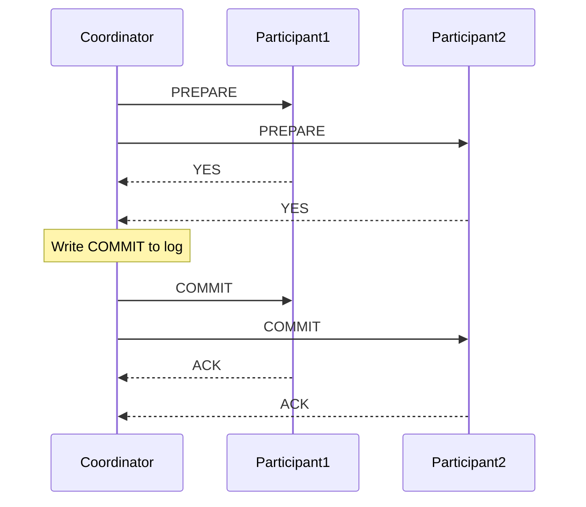
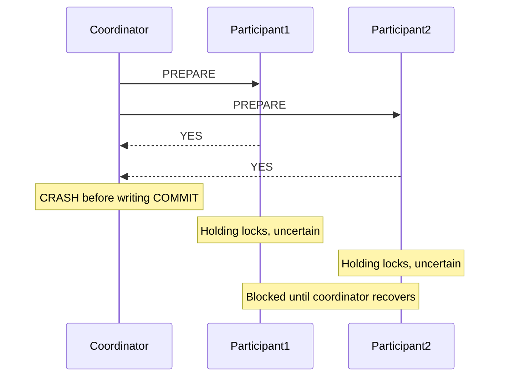
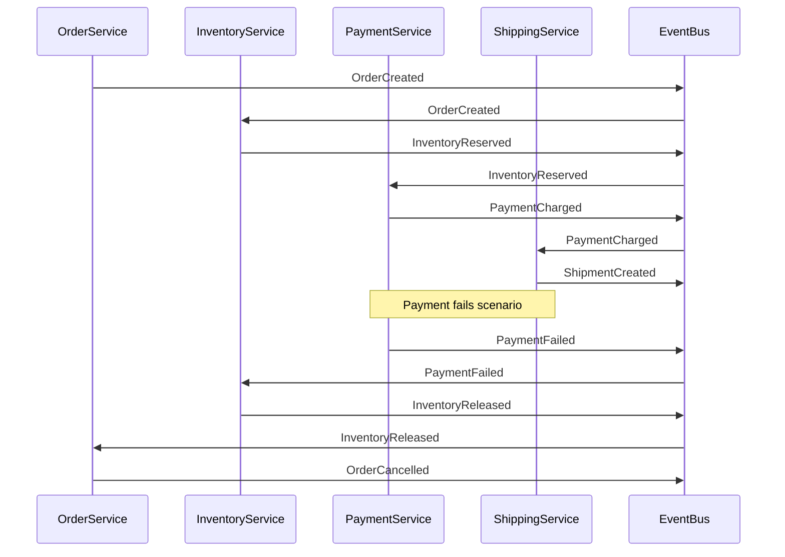
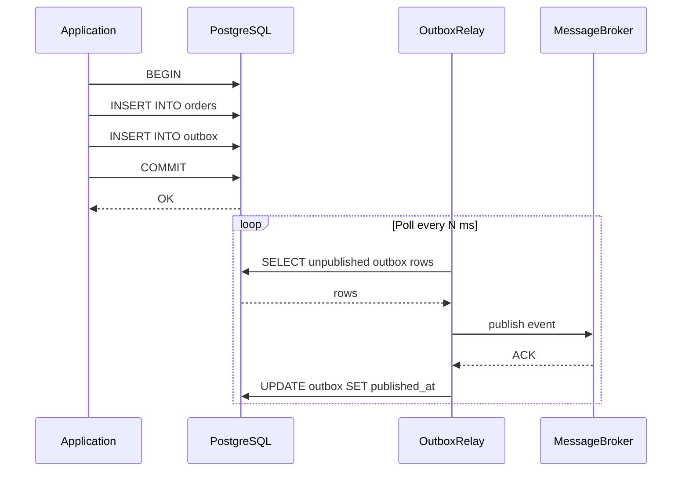

# Distributed Transactions

Patterns for maintaining consistency across services and datastores without a global ACID transaction.

---

## 1. The Dual-Write Problem

Writing to two systems (DB + message queue) in sequence — no atomic boundary spans both.

**Failure scenarios:**

| Step | Failure | Result |
|------|---------|--------|
| DB write succeeds, queue publish fails | Network timeout to broker | DB updated, event never sent — consumers miss the update |
| DB write fails, queue publish succeeds | DB constraint violation | Event published for a transaction that never happened |
| Process crashes between the two writes | OOM, pod eviction | One side is written, other is not — no way to know which |

The root cause: you cannot `COMMIT` a database transaction and publish a message atomically with two different systems. One of them will always go first.

---

## 2. Two-Phase Commit (2PC)

A distributed protocol where a **coordinator** drives **participants** through two phases to achieve atomic commit across multiple nodes.

### Phases

**Phase 1 — Prepare:**
Coordinator sends `PREPARE` to all participants. Each participant writes to its WAL (making it ready to commit), then responds `YES` or `NO`. No data is visible yet.

**Phase 2 — Commit:**
If all responded `YES`, coordinator writes `COMMIT` to its own log, then sends `COMMIT` to all participants. If any responded `NO`, coordinator sends `ROLLBACK`.

### Why it's blocking and fragile

- If the coordinator crashes **after Phase 1 but before Phase 2**, all participants are stuck in the **prepared** state — they have locks held and cannot proceed or roll back without the coordinator's decision.
- Recovery requires reading the coordinator's WAL or waiting for it to restart — this can block for minutes in production.
- Any participant failure during Phase 2 requires the coordinator to retry indefinitely (or a human to intervene).

### Coordinator crash window

```
Coordinator:  PREPARE → [crash here] → COMMIT
Participants: locked, waiting, cannot unilaterally decide
```

This is the **uncertainty window** — participants hold locks on rows they've prepared but cannot release them because they don't know if the coordinator committed or rolled back.

---

## 3. 2PC Sequence Diagrams

### Happy Path



### Coordinator Crashes After Prepare



---

## 4. Three-Phase Commit (3PC)

Adds a **pre-commit** phase between Prepare and Commit to reduce the uncertainty window.

**Phases:** Prepare → Pre-Commit → Commit

**What it adds:** After receiving all `YES` votes, coordinator sends `PRE-COMMIT`. Participants acknowledge. Only then does the coordinator send `COMMIT`. If the coordinator crashes after `PRE-COMMIT`, participants can infer the coordinator intended to commit and proceed unilaterally after a timeout.

**Still has issues:**
- Network partitions can cause split-brain: some participants receive `PRE-COMMIT`, others don't. After a coordinator crash, different participants may make different decisions.
- Adds a full RTT of latency vs 2PC.
- Rarely used in practice because of the network partition problem — Saga or Outbox patterns are preferred.

---

## 5. Saga Pattern

A saga is a sequence of **local transactions**. Each step updates one service's database. On failure, **compensating transactions** undo the preceding steps.

**Key property:** No global lock. Each local transaction commits immediately and is visible. Compensation is semantic (business-level undo), not a database rollback.

### Choreography

Services react to events without a central coordinator. Each service listens for events, does its local transaction, and emits the next event.

**Pros:**
- No single point of failure
- Services are fully decoupled
- Simple to add new steps by subscribing to events

**Cons:**
- Hard to track overall saga state (distributed observability problem)
- Cyclic dependencies between services are easy to create accidentally
- Testing the full flow requires all services running

### Orchestration

A **Saga Orchestrator** (a service or workflow engine) explicitly calls each participant and drives the flow. It knows the full saga state.

**Pros:**
- Central place to observe, debug, and retry saga state
- Easier to reason about compensations
- Can use durable execution (Temporal, AWS Step Functions)

**Cons:**
- Orchestrator is a single point of coordination (not a SPOF if made durable, but a coupling point)
- Services must expose APIs the orchestrator calls — more coupling than events

---

## 6. Saga Choreography Diagram

Order → Inventory → Payment → Shipping, with compensation on failure.



**Compensating transactions:**
| Step | Forward | Compensation |
|------|---------|--------------|
| Inventory | Reserve items | Release reservation |
| Payment | Charge card | Issue refund |
| Shipping | Create shipment | Cancel shipment |

---

## 7. Outbox Pattern

Write to an **outbox table** in the **same database transaction** as your business data. A separate relay process reads the outbox and publishes to the message broker.

**Why it works:** The outbox write and the business write share the same ACID transaction. Either both commit or both roll back. The relay publishes only after the DB transaction is committed.

```sql
-- Outbox table
CREATE TABLE outbox (
    id          UUID PRIMARY KEY DEFAULT gen_random_uuid(),
    aggregate_id TEXT NOT NULL,
    event_type  TEXT NOT NULL,
    payload     JSONB NOT NULL,
    created_at  TIMESTAMPTZ DEFAULT now(),
    published_at TIMESTAMPTZ
);

-- Business transaction (atomic)
BEGIN;
  INSERT INTO orders (id, user_id, status) VALUES ($1, $2, 'pending');
  INSERT INTO outbox (aggregate_id, event_type, payload)
    VALUES ($1, 'OrderCreated', $3);
COMMIT;
```

The relay queries unpublished rows, publishes to the broker, then marks them published:

```sql
-- Relay: poll and publish
SELECT * FROM outbox WHERE published_at IS NULL ORDER BY created_at LIMIT 100;
-- ... publish each to broker ...
UPDATE outbox SET published_at = now() WHERE id = $1;
```

**At-least-once delivery:** If the relay crashes after publishing but before marking the row, it will republish on restart. Consumers must be idempotent.

---

## 8. Outbox Sequence Diagram



---

## 9. Change Data Capture (CDC) with Debezium

CDC reads the **database replication log** (Postgres WAL, MySQL binlog) to capture every committed change as a stream of events. No polling, no outbox table needed in the application code.

**How Debezium works with Postgres:**
1. Postgres is configured with `wal_level = logical`.
2. Debezium connects as a replication slot reader — same protocol as a streaming replica.
3. Every committed `INSERT/UPDATE/DELETE` on tracked tables emits a change event to Kafka.
4. The event contains `before` and `after` row images, LSN (log sequence number), and transaction metadata.

**Why it's reliable:**
- Events come directly from the WAL — they are committed facts, not speculative writes.
- The replication slot tracks the LSN so Debezium can resume exactly where it left off after a restart.
- No dual-write: the application writes to DB normally; CDC is a side effect of the WAL.

**Tradeoffs:**
- Requires `wal_level = logical` (minor storage overhead for WAL retention).
- Schema changes (DDL) must be handled carefully — Debezium tracks schema history in a Kafka topic.
- Replication slots accumulate WAL if the consumer falls behind — can fill disk.

---

## 10. Idempotency Across Services

An idempotent operation produces the same result if called multiple times. Critical for at-least-once delivery systems.

**Idempotency key flow:**
1. Client generates a unique key (UUID or hash of request content) and sends it in the request header: `Idempotency-Key: <uuid>`.
2. Service checks a **deduplication table** before processing.
3. If key exists: return the stored response immediately, skip processing.
4. If key is new: insert the key, process, store the response.

```sql
CREATE TABLE idempotency_keys (
    key         TEXT PRIMARY KEY,
    response    JSONB NOT NULL,
    created_at  TIMESTAMPTZ DEFAULT now(),
    expires_at  TIMESTAMPTZ
);

-- Before processing
SELECT response FROM idempotency_keys WHERE key = $1 AND expires_at > now();

-- After successful processing (in same transaction as business logic)
INSERT INTO idempotency_keys (key, response, expires_at)
VALUES ($1, $2, now() + interval '24 hours')
ON CONFLICT (key) DO NOTHING;
```

**TTL:** Keys can be expired after a safe window (24h–7d) once the upstream caller no longer retries.

---

## 11. Distributed Locking

Use when multiple instances must not execute a critical section simultaneously (e.g., scheduled job, inventory deduction).

### Redis — SET NX PX

```bash
# Acquire: SET key value NX PX <ttl_ms>
SET lock:order:123 <owner_token> NX PX 5000

# Release: only if we own the lock (Lua for atomicity)
if redis.call("GET", KEYS[1]) == ARGV[1] then
  return redis.call("DEL", KEYS[1])
end
```

- `NX`: only set if not exists
- `PX 5000`: auto-expire after 5 seconds (prevents deadlock on crash)
- Always use a unique owner token and check it before releasing — prevents releasing someone else's lock

### Redlock (multi-node Redis)

Acquire the lock on N/2+1 independent Redis nodes within a time window. If quorum is reached, the lock is held. Protects against single Redis node failure.

**Controversy:** Redlock is debated (Martin Kleppmann vs Antirez). In practice, for most use cases, a single Redis instance with `NX PX` is sufficient if you can tolerate the Redis instance being a SPOF.

### ZooKeeper / etcd

- Use **ephemeral nodes** (ZooKeeper) or **leases** (etcd) — lock is automatically released if the holder crashes or disconnects.
- Stronger consistency guarantees than Redis (linearizable by default in etcd).
- Higher latency than Redis (~1–5ms vs ~0.1ms).

### Optimistic vs Pessimistic Locking

| | Optimistic | Pessimistic (Distributed Lock) |
|--|-----------|-------------------------------|
| Mechanism | Version check at write time | Lock before read |
| Contention | Low — no blocking | High — serialize all access |
| Use when | Conflicts are rare | Conflicts are frequent, or external system coordination needed |
| On conflict | Retry the operation | Wait or fail fast |

---

## 12. Optimistic Concurrency Control

No locks. Each row carries a **version** field. The writer checks the version hasn't changed before committing.

```sql
-- Schema
ALTER TABLE orders ADD COLUMN version INT NOT NULL DEFAULT 0;

-- Read
SELECT id, status, version FROM orders WHERE id = $1;

-- Update (check-and-set)
UPDATE orders
SET status = 'paid', version = version + 1
WHERE id = $1 AND version = $2;
-- If 0 rows updated: someone else modified it — retry
```

**HTTP ETags:**

```
GET /orders/123
→ ETag: "v42"

PUT /orders/123
   If-Match: "v42"
→ 200 OK if version matches
→ 412 Precondition Failed if it was modified
```

ETags are the HTTP-native expression of optimistic concurrency — the ETag is the version, `If-Match` is the check-and-set.

---

## 13. TCC (Try-Confirm-Cancel)

A reservation pattern that avoids holding database locks across service boundaries.

**Three phases per participant:**
1. **Try:** Reserve resources tentatively (don't commit them). E.g., mark inventory as "reserved" but not "deducted".
2. **Confirm:** If all Tries succeeded, confirm all reservations (make them permanent).
3. **Cancel:** If any Try failed, cancel all reservations (release the tentative holds).

**Example — inventory reservation:**

```
Try:     UPDATE inventory SET reserved = reserved + 5 WHERE sku = 'X' AND available >= 5
Confirm: UPDATE inventory SET available = available - 5, reserved = reserved - 5 WHERE sku = 'X'
Cancel:  UPDATE inventory SET reserved = reserved - 5 WHERE sku = 'X'
```

**How it avoids blocking:**
- Resources are "reserved" not "locked". Other transactions can still read and reserve (if enough available).
- The Confirm/Cancel phase is fast — no coordination needed after Try.
- Resources don't stay in limbo: a timeout on unconfirmed reservations triggers automatic Cancel.

**Tradeoffs:**
- All participants must implement three separate endpoints/operations.
- Requires a timeout/cleanup mechanism for stuck Tries.
- The orchestrator must track which participants were successfully Tried.

---

## 14. Decision Table

| Pattern | Consistency | Availability | Latency | Complexity | Use when |
|---------|------------|--------------|---------|------------|----------|
| **2PC** | Strong (ACID) | Low (blocking) | High | Medium | Same DB engine across nodes, short transactions, can tolerate blocking (rare in microservices) |
| **Saga (Choreography)** | Eventual | High | Low | High (observability) | Microservices, no central dependency, teams own their events |
| **Saga (Orchestration)** | Eventual | High | Low | Medium | Complex flows, need visibility, durable execution available |
| **Outbox** | Eventual (reliable) | High | Low | Low | Solving dual-write; use alongside Saga or CDC |
| **TCC** | Near-strong | High | Medium | High | Inventory/seat reservation, need resource holds without DB locks |
| **CDC (Debezium)** | Eventual | High | Low | Low (infra) | Event sourcing from existing DB, no app changes, Kafka-based pipelines |
| **Optimistic Lock** | Strong (per row) | High | Low | Low | Low contention, single-service writes, HTTP APIs |
| **Distributed Lock** | Strong (critical section) | Medium | Low-Medium | Low | Scheduled jobs, external system coordination, high-contention resources |

---

## 15. Real-World Examples

### E-Commerce Order (Saga Orchestration)

```
Orchestrator drives:
1. OrderService.createOrder()       → local commit
2. InventoryService.reserve()       → local commit
3. PaymentService.charge()          → local commit
4. ShippingService.createShipment() → local commit

On PaymentService failure:
← InventoryService.release()        ← compensate step 2
← OrderService.cancel()             ← compensate step 1
```

State machine stored in the orchestrator (e.g., DynamoDB or Postgres). Each step is idempotent. Retries are safe.

### Payment Processing (2PC within DB, Saga across services)

Within a single Postgres cluster (e.g., debit account A, credit account B in the same DB):
- Use a regular DB transaction — this is exactly the use case 2PC was designed for at the DB level.
- The DB engine handles 2PC internally; you write `BEGIN ... COMMIT`.

Across services (payment gateway, ledger service, notification service):
- Use Saga Orchestration.
- Payment gateway call is the critical step — design it as idempotent with an idempotency key.
- On payment failure, compensate the ledger reservation.

### Inventory Reservation for Flash Sale (TCC)

```
Try:     Reserve N units (add to reserved_count) — fast, low contention
         Return reservation_id

Confirm: Deduct from available_count, clear reservation
         Triggered when order is confirmed

Cancel:  Release reservation_count
         Triggered on: payment failure, TTL expiry, user abandonment
```

TTL on reservations (e.g., 10 minutes) prevents ghost reservations from blocking stock indefinitely. A background job sweeps expired reservations and triggers Cancel.
