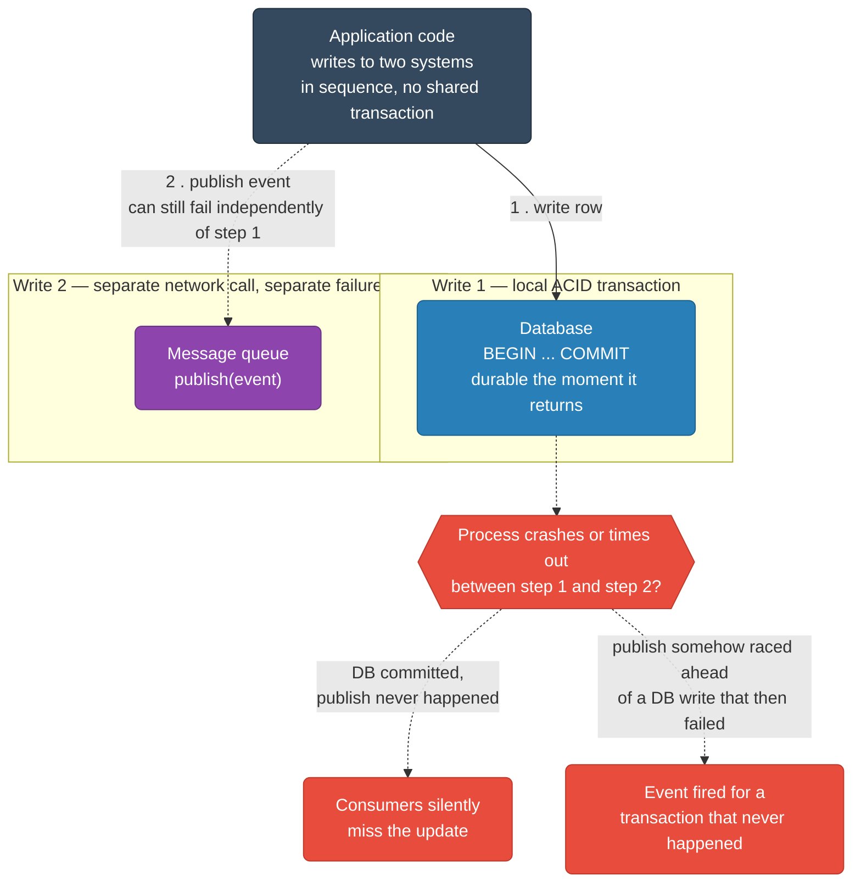
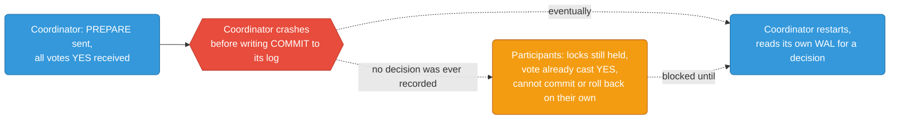
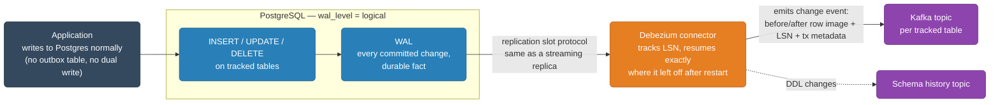
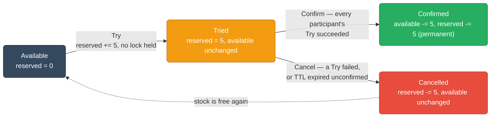

# Distributed Transactions

Patterns for maintaining consistency across services and datastores without a global ACID transaction.

<div class="quiz-progress" data-quiz-progress>
  <span class="quiz-progress-label">0/0 checks</span>
  <span class="quiz-progress-bar"><span class="quiz-progress-fill"></span></span>
</div>

---

## 1. The Dual-Write Problem

Writing to two systems (DB + message queue) in sequence — no atomic boundary spans both.



**Failure scenarios:**

| Step | Failure | Result |
|------|---------|--------|
| DB write succeeds, queue publish fails | Network timeout to broker | DB updated, event never sent — consumers miss the update |
| DB write fails, queue publish succeeds | DB constraint violation | Event published for a transaction that never happened |
| Process crashes between the two writes | OOM, pod eviction | One side is written, other is not — no way to know which |

The root cause: you cannot `COMMIT` a database transaction and publish a message atomically with two different systems. One of them will always go first.

<div class="quiz-card">
  <p class="quiz-q">The DB write commits successfully, but the queue publish call then times out. What actually happens to the update — is it just delayed?</p>
  <button class="quiz-reveal">Reveal answer</button>
  <div class="quiz-a" hidden>No — it's not delayed, it's lost from the consumers' point of view. The DB has the new state, but no event was ever emitted for it, so every downstream consumer silently misses the update entirely. There's no automatic retry of "the other half" of a dual write; without a pattern like outbox or CDC, nothing re-triggers that publish.</div>
</div>

---

## 2. Two-Phase Commit (2PC)

A distributed protocol where a **coordinator** drives **participants** through two phases to achieve atomic commit across multiple nodes.

### Phases

<div class="stepper">
  <div class="stepper-panels">
    <div class="stepper-panel active">
      <strong>1. Coordinator sends PREPARE.</strong> The coordinator sends <code>PREPARE</code> to every participant. No data is visible to anyone yet — this is purely a question: "can you commit this?"
    </div>
    <div class="stepper-panel">
      <strong>2. Participants vote.</strong> Each participant writes to its WAL — durable enough to survive a crash and still honor whatever it votes — then replies <code>YES</code> (it can commit) or <code>NO</code> (it can't). A <code>YES</code> vote is a promise: from this point on, the participant holds its locks and cannot unilaterally change its mind.
    </div>
    <div class="stepper-panel">
      <strong>3. Coordinator decides and logs.</strong> If every participant voted <code>YES</code>, the coordinator writes <code>COMMIT</code> to its own log — that log write, not any message to a participant, is the actual point of no return. If any participant voted <code>NO</code>, the coordinator decides <code>ROLLBACK</code> instead.
    </div>
    <div class="stepper-panel">
      <strong>4. Coordinator broadcasts the decision.</strong> It sends <code>COMMIT</code> (or <code>ROLLBACK</code>) to every participant. Each participant applies it, releases its locks, and replies <code>ACK</code>. Only now does the data become visible.
    </div>
  </div>
  <div class="stepper-controls">
    <button class="stepper-prev">← Prev</button>
    <span class="stepper-dots"></span>
    <span class="stepper-label"></span>
    <button class="stepper-next">Next →</button>
  </div>
</div>

### Why it's blocking and fragile

- If the coordinator crashes **after Phase 1 but before Phase 2**, all participants are stuck in the **prepared** state — they have locks held and cannot proceed or roll back without the coordinator's decision.
- Recovery requires reading the coordinator's WAL or waiting for it to restart — this can block for minutes in production.
- Any participant failure during Phase 2 requires the coordinator to retry indefinitely (or a human to intervene).

### Coordinator crash window



This is the **uncertainty window** — participants hold locks on rows they've prepared but cannot release them because they don't know if the coordinator committed or rolled back.

<div class="quiz-card">
  <p class="quiz-q">A participant votes YES in Phase 1. Why can't it just unilaterally decide to commit on its own if the coordinator disappears, instead of sitting blocked with locks held?</p>
  <button class="quiz-reveal">Reveal answer</button>
  <div class="quiz-a" hidden>Because voting YES only tells that participant its own vote — it has no way to know how the other participants voted, or what the coordinator actually decided based on all the votes together. If even one other participant voted NO, the correct outcome is ROLLBACK, not COMMIT. Only the coordinator's log holds the real decision, so every prepared participant must wait for it — that's exactly what makes 2PC blocking.</div>
</div>

---

## 3. 2PC Sequence Diagrams

### Happy Path

```mermaid
sequenceDiagram
    participant C as Coordinator
    participant P1 as Participant 1 (orders DB)
    participant P2 as Participant 2 (inventory DB)

    rect rgb(40, 55, 75)
    Note over C,P2: Phase 1 — Prepare (no data visible yet)
    C->>P1: PREPARE
    activate P1
    C->>P2: PREPARE
    activate P2
    P1-->>C: YES (WAL written, row locked)
    P2-->>C: YES (WAL written, row locked)
    end

    Note over C: Both voted YES — write COMMIT to<br/>coordinator's own log (point of no return)

    rect rgb(40, 60, 45)
    Note over C,P2: Phase 2 — Commit
    C->>P1: COMMIT
    C->>P2: COMMIT
    P1-->>C: ACK, locks released
    deactivate P1
    P2-->>C: ACK, locks released
    deactivate P2
    end
```



### Coordinator Crashes After Prepare

```mermaid
sequenceDiagram
    participant C as Coordinator
    participant P1 as Participant 1 (orders DB)
    participant P2 as Participant 2 (inventory DB)

    rect rgb(40, 55, 75)
    Note over C,P2: Phase 1 — Prepare completes normally
    C->>P1: PREPARE
    activate P1
    C->>P2: PREPARE
    activate P2
    P1-->>C: YES
    P2-->>C: YES
    end

    rect rgb(65, 50, 30)
    Note over C: CRASH — before COMMIT is written to the log
    Note over P1: Holding locks, voted YES,<br/>uncertain whether the outcome is commit or rollback
    Note over P2: Holding locks, voted YES,<br/>uncertain whether the outcome is commit or rollback
    Note over P1,P2: Blocked — cannot unilaterally commit or roll back
    end

    Note over C: Coordinator restarts, reads its WAL,<br/>replays the decision to both participants
    C->>P1: COMMIT or ROLLBACK (from recovered log)
    C->>P2: COMMIT or ROLLBACK (from recovered log)
    deactivate P1
    deactivate P2
```



<div class="quiz-card">
  <p class="quiz-q">In the crash scenario above, both P1 and P2 already voted YES before the coordinator crashes. Since they agree, why can't they just commit between themselves?</p>
  <button class="quiz-reveal">Reveal answer</button>
  <div class="quiz-a" hidden>Because "both voted YES" isn't the same as "the coordinator decided COMMIT." The coordinator might have been waiting on a third participant that voted NO, or it might have already decided ROLLBACK for an unrelated reason before crashing. P1 and P2 have no visibility into each other's votes or the coordinator's log — they can only find out the real decision from the coordinator itself, which is exactly why they're stuck blocked instead of proceeding on their own.</div>
</div>

---

## 4. Three-Phase Commit (3PC)

Adds a **pre-commit** phase between Prepare and Commit to reduce the uncertainty window.

**Phases:** Prepare → Pre-Commit → Commit

**What it adds:** After receiving all `YES` votes, coordinator sends `PRE-COMMIT`. Participants acknowledge. Only then does the coordinator send `COMMIT`. If the coordinator crashes after `PRE-COMMIT`, participants can infer the coordinator intended to commit and proceed unilaterally after a timeout.

**Still has issues:**
- Network partitions can cause split-brain: some participants receive `PRE-COMMIT`, others don't. After a coordinator crash, different participants may make different decisions.
- Adds a full RTT of latency vs 2PC.
- Rarely used in practice because of the network partition problem — Saga or Outbox patterns are preferred.

<div class="quiz-card">
  <p class="quiz-q">3PC's pre-commit phase is supposed to remove 2PC's uncertainty window — participants that received PRE-COMMIT can time out and commit unilaterally. So why is 3PC still rarely used in practice?</p>
  <button class="quiz-reveal">Reveal answer</button>
  <div class="quiz-a" hidden>The pre-commit phase only helps if the network is reliable enough that "no PRE-COMMIT arrived" reliably means "the coordinator hadn't decided yet." Under an actual network partition, some participants can receive PRE-COMMIT and others can't, purely due to the partition — not because the coordinator changed its mind. If the coordinator then crashes, the two groups time out and make different unilateral decisions: split-brain. 3PC also adds a full extra round trip of latency versus 2PC for a guarantee that doesn't actually hold under partitions, which is why Saga or Outbox are preferred in practice.</div>
</div>

---

## 5. Saga Pattern

A saga is a sequence of **local transactions**. Each step updates one service's database. On failure, **compensating transactions** undo the preceding steps.

**Key property:** No global lock. Each local transaction commits immediately and is visible. Compensation is semantic (business-level undo), not a database rollback.

### Choreography

Services react to events without a central coordinator. Each service listens for events, does its local transaction, and emits the next event.

**Pros:**
- No single point of failure
- Services are fully decoupled
- Simple to add new steps by subscribing to events

**Cons:**
- Hard to track overall saga state (distributed observability problem)
- Cyclic dependencies between services are easy to create accidentally
- Testing the full flow requires all services running

### Orchestration

A **Saga Orchestrator** (a service or workflow engine) explicitly calls each participant and drives the flow. It knows the full saga state.

**Pros:**
- Central place to observe, debug, and retry saga state
- Easier to reason about compensations
- Can use durable execution (Temporal, AWS Step Functions)

**Cons:**
- Orchestrator is a single point of coordination (not a SPOF if made durable, but a coupling point)
- Services must expose APIs the orchestrator calls — more coupling than events

<div class="quiz-card">
  <p class="quiz-q">Step 2 of a saga (say, InventoryService.reserve()) has already committed locally and is visible to other reads. Step 3 then fails. What does "compensating" step 2 actually do?</p>
  <button class="quiz-reveal">Reveal answer</button>
  <div class="quiz-a" hidden>It does not roll back a database transaction — that transaction already committed and can't be undone at the DB level. Compensation is a new, separate local transaction that semantically reverses the business effect: releasing the reservation rather than un-committing it. Between the original commit and the compensating write, other transactions may have already observed the "reserved" state — the saga accepts that temporary inconsistency instead of holding locks across service boundaries the way 2PC would.</div>
</div>

---

## 6. Saga Choreography Diagram

Order → Inventory → Payment → Shipping, with compensation on failure.

```mermaid
sequenceDiagram
    participant Q as EventBus
    participant O as OrderService
    participant I as InventoryService
    participant P as PaymentService
    participant S as ShippingService

    rect rgb(40, 60, 45)
    Note over Q,S: Happy path — each service reacts to the previous event, does a local commit, emits the next
    O->>Q: OrderCreated
    Q->>I: OrderCreated
    I->>I: local commit — reserve items
    I->>Q: InventoryReserved
    Q->>P: InventoryReserved
    P->>P: local commit — charge card
    P->>Q: PaymentCharged
    Q->>S: PaymentCharged
    S->>S: local commit — create shipment
    S->>Q: ShipmentCreated
    end

    rect rgb(65, 50, 30)
    Note over Q,S: Payment fails — compensations run in reverse, each triggered by an event, not a direct call
    P->>Q: PaymentFailed
    Q->>I: PaymentFailed
    I->>I: compensate — release reservation
    I->>Q: InventoryReleased
    Q->>O: InventoryReleased
    O->>O: compensate — cancel order
    O->>Q: OrderCancelled
    end
```



**Compensating transactions:**
| Step | Forward | Compensation |
|------|---------|--------------|
| Inventory | Reserve items | Release reservation |
| Payment | Charge card | Issue refund |
| Shipping | Create shipment | Cancel shipment |

<div class="quiz-card">
  <p class="quiz-q">When PaymentFailed fires, InventoryService reacts to it directly and runs its own compensation. In an orchestrated saga, who would have triggered that instead?</p>
  <button class="quiz-reveal">Reveal answer</button>
  <div class="quiz-a" hidden>The Saga Orchestrator would have called InventoryService.release() explicitly — it's the one tracking full saga state and knows step 2 needs undoing when step 3 fails. In choreography there is no such central caller: InventoryService has to independently subscribe to PaymentFailed and know that it means "release my reservation." That's the tradeoff called out for choreography — no single point of failure, but overall saga state is now implicit, scattered across each service's own event subscriptions.</div>
</div>

---

## 7. Outbox Pattern

Write to an **outbox table** in the **same database transaction** as your business data. A separate relay process reads the outbox and publishes to the message broker.

**Why it works:** The outbox write and the business write share the same ACID transaction. Either both commit or both roll back. The relay publishes only after the DB transaction is committed.

```sql
-- Outbox table
CREATE TABLE outbox (
    id          UUID PRIMARY KEY DEFAULT gen_random_uuid(),
    aggregate_id TEXT NOT NULL,
    event_type  TEXT NOT NULL,
    payload     JSONB NOT NULL,
    created_at  TIMESTAMPTZ DEFAULT now(),
    published_at TIMESTAMPTZ
);

-- Business transaction (atomic)
BEGIN;
  INSERT INTO orders (id, user_id, status) VALUES ($1, $2, 'pending');
  INSERT INTO outbox (aggregate_id, event_type, payload)
    VALUES ($1, 'OrderCreated', $3);
COMMIT;
```

The relay queries unpublished rows, publishes to the broker, then marks them published:

```sql
-- Relay: poll and publish
SELECT * FROM outbox WHERE published_at IS NULL ORDER BY created_at LIMIT 100;
-- ... publish each to broker ...
UPDATE outbox SET published_at = now() WHERE id = $1;
```

**At-least-once delivery:** If the relay crashes after publishing but before marking the row, it will republish on restart. Consumers must be idempotent.

<div class="quiz-card">
  <p class="quiz-q">The outbox row and the business row are written in the same BEGIN...COMMIT block. What specifically does that buy you that a separate outbox write right after COMMIT wouldn't?</p>
  <button class="quiz-reveal">Reveal answer</button>
  <div class="quiz-a" hidden>Atomicity: either both the business row and the outbox row commit together, or neither does — there's no window where one exists without the other, which is exactly the dual-write failure mode this pattern is solving. A separate write right after COMMIT reintroduces a second, independent operation that can fail on its own (crash between the two statements), putting you right back in the dual-write problem. The relay publishing the outbox row to the broker afterward is a *different* kind of at-least-once step — it can safely retry because publishing is idempotent-by-design (consumers dedupe), whereas the outbox insert itself has no such safety net if it's not in the same transaction.</div>
</div>

---

## 8. Outbox Sequence Diagram

```mermaid
sequenceDiagram
    participant App as Application
    participant DB as PostgreSQL
    participant Relay as OutboxRelay
    participant Broker as MessageBroker

    rect rgb(40, 60, 45)
    Note over App,DB: One atomic transaction — both rows commit or neither does
    App->>DB: BEGIN
    App->>DB: INSERT INTO orders
    App->>DB: INSERT INTO outbox (published_at = NULL)
    App->>DB: COMMIT
    DB-->>App: OK
    end

    loop Poll every N ms
        Relay->>DB: SELECT unpublished outbox rows
        DB-->>Relay: rows
        Relay->>Broker: publish event
        Broker-->>Relay: ACK
        Relay->>DB: UPDATE outbox SET published_at = now()
    end

    rect rgb(65, 50, 30)
    Note over Relay,Broker: Relay crashes after publish but before the UPDATE lands
    Relay->>Broker: publish event
    Broker-->>Relay: ACK
    Note over Relay: crash — published_at never gets set
    Note over Relay,DB: On restart, the row still shows unpublished →<br/>relay republishes it → consumer must dedupe
    end
```



---

## 9. Change Data Capture (CDC) with Debezium

CDC reads the **database replication log** (Postgres WAL, MySQL binlog) to capture every committed change as a stream of events. No polling, no outbox table needed in the application code.



**How Debezium works with Postgres:**
1. Postgres is configured with `wal_level = logical`.
2. Debezium connects as a replication slot reader — same protocol as a streaming replica.
3. Every committed `INSERT/UPDATE/DELETE` on tracked tables emits a change event to Kafka.
4. The event contains `before` and `after` row images, LSN (log sequence number), and transaction metadata.

**Why it's reliable:**
- Events come directly from the WAL — they are committed facts, not speculative writes.
- The replication slot tracks the LSN so Debezium can resume exactly where it left off after a restart.
- No dual-write: the application writes to DB normally; CDC is a side effect of the WAL.

**Tradeoffs:**
- Requires `wal_level = logical` (minor storage overhead for WAL retention).
- Schema changes (DDL) must be handled carefully — Debezium tracks schema history in a Kafka topic.
- Replication slots accumulate WAL if the consumer falls behind — can fill disk.

<div class="quiz-card">
  <p class="quiz-q">Unlike the outbox pattern, CDC needs no outbox table and no application-level publish call. What in the application code changes to adopt it?</p>
  <button class="quiz-reveal">Reveal answer</button>
  <div class="quiz-a" hidden>Nothing. The application just writes to Postgres normally — CDC events fall out of the WAL as a side effect of `wal_level = logical` being enabled and a replication slot being read, with zero changes to the transaction the app already runs. That's the tradeoff to hold onto: it removes app-level dual-write risk entirely, but shifts the operational burden onto the database and connector — a slow or crashed consumer lets the replication slot accumulate WAL and can fill disk.</div>
</div>

---

## 10. Idempotency Across Services

An idempotent operation produces the same result if called multiple times. Critical for at-least-once delivery systems.

**Idempotency key flow:**
1. Client generates a unique key (UUID or hash of request content) and sends it in the request header: `Idempotency-Key: <uuid>`.
2. Service checks a **deduplication table** before processing.
3. If key exists: return the stored response immediately, skip processing.
4. If key is new: insert the key, process, store the response.

```sql
CREATE TABLE idempotency_keys (
    key         TEXT PRIMARY KEY,
    response    JSONB NOT NULL,
    created_at  TIMESTAMPTZ DEFAULT now(),
    expires_at  TIMESTAMPTZ
);

-- Before processing
SELECT response FROM idempotency_keys WHERE key = $1 AND expires_at > now();

-- After successful processing (in same transaction as business logic)
INSERT INTO idempotency_keys (key, response, expires_at)
VALUES ($1, $2, now() + interval '24 hours')
ON CONFLICT (key) DO NOTHING;
```

**TTL:** Keys can be expired after a safe window (24h–7d) once the upstream caller no longer retries.

<div class="quiz-card">
  <p class="quiz-q">Two retries of the same request, carrying the same Idempotency-Key, arrive at nearly the same instant and both pass the "does this key exist?" check before either has inserted it. What goes wrong, and what actually prevents it?</p>
  <button class="quiz-reveal">Reveal answer</button>
  <div class="quiz-a" hidden>Without more care, both requests would conclude "key is new" and both would process the business logic — defeating the whole point of the idempotency key. The fix is in the SQL shown: the key is inserted with <code>ON CONFLICT (key) DO NOTHING</code> in the *same* transaction as the business logic, using the key column's uniqueness constraint as the actual race-breaker. Whichever request's INSERT commits first wins that row; the other either fails the constraint or, once retried, finds the key already present with a stored response to return.</div>
</div>

---

## 11. Distributed Locking

Use when multiple instances must not execute a critical section simultaneously (e.g., scheduled job, inventory deduction).

### Redis — SET NX PX

```bash
# Acquire: SET key value NX PX <ttl_ms>
SET lock:order:123 <owner_token> NX PX 5000

# Release: only if we own the lock (Lua for atomicity)
if redis.call("GET", KEYS[1]) == ARGV[1] then
  return redis.call("DEL", KEYS[1])
end
```

- `NX`: only set if not exists
- `PX 5000`: auto-expire after 5 seconds (prevents deadlock on crash)
- Always use a unique owner token and check it before releasing — prevents releasing someone else's lock

<div class="quiz-card">
  <p class="quiz-q">Process A holds the lock but stalls (long GC pause) past the PX TTL. Redis auto-expires the key and Process B acquires it. Process A then wakes up and calls its release script. What stops A from deleting B's lock?</p>
  <button class="quiz-reveal">Reveal answer</button>
  <div class="quiz-a" hidden>The owner-token check in the release script. A's release script does <code>GET</code> on the key and compares it against A's own token before calling <code>DEL</code> — since the key now holds B's token (not A's), the comparison fails and the Lua script returns without deleting anything. Without that check, A's release would blindly delete whatever the key currently holds, including a lock legitimately owned by B — releasing someone else's lock.</div>
</div>

### Redlock (multi-node Redis)

Acquire the lock on N/2+1 independent Redis nodes within a time window. If quorum is reached, the lock is held. Protects against single Redis node failure.

**Controversy:** Redlock is debated (Martin Kleppmann vs Antirez). In practice, for most use cases, a single Redis instance with `NX PX` is sufficient if you can tolerate the Redis instance being a SPOF.

### ZooKeeper / etcd

- Use **ephemeral nodes** (ZooKeeper) or **leases** (etcd) — lock is automatically released if the holder crashes or disconnects.
- Stronger consistency guarantees than Redis (linearizable by default in etcd).
- Higher latency than Redis (~1–5ms vs ~0.1ms).

### Optimistic vs Pessimistic Locking

| | Optimistic | Pessimistic (Distributed Lock) |
|--|-----------|-------------------------------|
| Mechanism | Version check at write time | Lock before read |
| Contention | Low — no blocking | High — serialize all access |
| Use when | Conflicts are rare | Conflicts are frequent, or external system coordination needed |
| On conflict | Retry the operation | Wait or fail fast |

<div class="toggle-switch">
  <div class="toggle-buttons">
    <button data-toggle-opt="pess" class="active state-warn">Pessimistic (Distributed Lock)</button>
    <button data-toggle-opt="opt" class="state-ok">Optimistic (Version Check)</button>
  </div>
  <div class="toggle-panel active" data-toggle-panel="pess">
    Two instances of a scheduled job wake up at the same moment. The first calls <code>SET lock:job:x &lt;token&gt; NX PX 5000</code> and gets <code>OK</code> — it now owns the critical section. The second issues the exact same command and gets <code>nil</code> back, because the key already exists: it never even starts, and either backs off and retries or gives up. Whoever holds the lock is guaranteed exclusive access for up to the TTL window — contention is resolved <strong>before</strong> any work begins.
  </div>
  <div class="toggle-panel" data-toggle-panel="opt">
    Two requests both read order #123 at <code>version = 5</code> at nearly the same time — nobody is blocked, both proceed to compute new state. Both then issue <code>UPDATE orders SET status = 'paid', version = 6 WHERE id = 123 AND version = 5</code>. The database only lets one of those <code>UPDATE</code>s actually match the <code>WHERE</code> clause; the other affects <strong>0 rows</strong>. That second caller finds out about the conflict only <strong>after</strong> doing the work, and has to retry against the row's new version — contention is resolved after the fact, not avoided up front.
  </div>
</div>

---

## 12. Optimistic Concurrency Control

No locks. Each row carries a **version** field. The writer checks the version hasn't changed before committing.

```sql
-- Schema
ALTER TABLE orders ADD COLUMN version INT NOT NULL DEFAULT 0;

-- Read
SELECT id, status, version FROM orders WHERE id = $1;

-- Update (check-and-set)
UPDATE orders
SET status = 'paid', version = version + 1
WHERE id = $1 AND version = $2;
-- If 0 rows updated: someone else modified it — retry
```

**HTTP ETags:**

```
GET /orders/123
→ ETag: "v42"

PUT /orders/123
   If-Match: "v42"
→ 200 OK if version matches
→ 412 Precondition Failed if it was modified
```

ETags are the HTTP-native expression of optimistic concurrency — the ETag is the version, `If-Match` is the check-and-set.

<div class="quiz-card">
  <p class="quiz-q">Your check-and-set UPDATE (WHERE id = $1 AND version = $2) reports 0 rows updated. Does that mean the row doesn't exist?</p>
  <button class="quiz-reveal">Reveal answer</button>
  <div class="quiz-a" hidden>Not necessarily — it most commonly means the row exists but someone else already changed it (and bumped its version) between your read and your write, so your version predicate no longer matches anything. It's a signal to re-read the current row and retry the operation, not evidence the row was deleted. This is the exact same situation as an HTTP <code>412 Precondition Failed</code> on a PUT with a stale <code>If-Match</code> ETag.</div>
</div>

---

## 13. TCC (Try-Confirm-Cancel)

A reservation pattern that avoids holding database locks across service boundaries.

**Three phases per participant:**
1. **Try:** Reserve resources tentatively (don't commit them). E.g., mark inventory as "reserved" but not "deducted".
2. **Confirm:** If all Tries succeeded, confirm all reservations (make them permanent).
3. **Cancel:** If any Try failed, cancel all reservations (release the tentative holds).

**Example — inventory reservation:**

```
Try:     UPDATE inventory SET reserved = reserved + 5 WHERE sku = 'X' AND available >= 5
Confirm: UPDATE inventory SET available = available - 5, reserved = reserved - 5 WHERE sku = 'X'
Cancel:  UPDATE inventory SET reserved = reserved - 5 WHERE sku = 'X'
```

**How it avoids blocking:**
- Resources are "reserved" not "locked". Other transactions can still read and reserve (if enough available).
- The Confirm/Cancel phase is fast — no coordination needed after Try.
- Resources don't stay in limbo: a timeout on unconfirmed reservations triggers automatic Cancel.



**Tradeoffs:**
- All participants must implement three separate endpoints/operations.
- Requires a timeout/cleanup mechanism for stuck Tries.
- The orchestrator must track which participants were successfully Tried.

<div class="quiz-card">
  <p class="quiz-q">During the Try phase, inventory is marked "reserved" rather than being locked. What can other transactions still do while a Try is pending, that they couldn't do if the row were locked?</p>
  <button class="quiz-reveal">Reveal answer</button>
  <div class="quiz-a" hidden>They can still read the row and even successfully Try their own reservation against it, as long as enough unreserved stock remains — the "Try" only increments a `reserved` counter, it never takes a database lock that blocks other transactions. That's the whole point of the pattern: resources stay concurrently accessible during the tentative phase, and only the fast, uncoordinated Confirm or Cancel step that follows actually finalizes anything.</div>
</div>

---

## 14. Decision Table

| Pattern | Consistency | Availability | Latency | Complexity | Use when |
|---------|------------|--------------|---------|------------|----------|
| **2PC** | Strong (ACID) | Low (blocking) | High | Medium | Same DB engine across nodes, short transactions, can tolerate blocking (rare in microservices) |
| **Saga (Choreography)** | Eventual | High | Low | High (observability) | Microservices, no central dependency, teams own their events |
| **Saga (Orchestration)** | Eventual | High | Low | Medium | Complex flows, need visibility, durable execution available |
| **Outbox** | Eventual (reliable) | High | Low | Low | Solving dual-write; use alongside Saga or CDC |
| **TCC** | Near-strong | High | Medium | High | Inventory/seat reservation, need resource holds without DB locks |
| **CDC (Debezium)** | Eventual | High | Low | Low (infra) | Event sourcing from existing DB, no app changes, Kafka-based pipelines |
| **Optimistic Lock** | Strong (per row) | High | Low | Low | Low contention, single-service writes, HTTP APIs |
| **Distributed Lock** | Strong (critical section) | Medium | Low-Medium | Low | Scheduled jobs, external system coordination, high-contention resources |

---

## 15. Real-World Examples

### E-Commerce Order (Saga Orchestration)

```mermaid
sequenceDiagram
    participant Orch as Saga Orchestrator
    participant Ord as OrderService
    participant Inv as InventoryService
    participant Pay as PaymentService
    participant Ship as ShippingService

    rect rgb(40, 60, 45)
    Note over Orch,Ship: Forward path — orchestrator calls each step explicitly, waits for local commit
    Orch->>Ord: 1. createOrder()
    Ord-->>Orch: local commit OK
    Orch->>Inv: 2. reserve()
    Inv-->>Orch: local commit OK
    Orch->>Pay: 3. charge()
    Pay-->>Orch: FAILS
    end

    rect rgb(65, 50, 30)
    Note over Orch,Ship: Compensation path — orchestrator walks completed steps backward
    Orch->>Inv: compensate step 2 — release()
    Inv-->>Orch: released
    Orch->>Ord: compensate step 1 — cancel()
    Ord-->>Orch: cancelled
    end
```



State machine stored in the orchestrator (e.g., DynamoDB or Postgres). Each step is idempotent. Retries are safe. Note that step 4 (`ShippingService.createShipment()`) never runs here — the orchestrator only calls forward as far as the failure, then walks backward through the steps that actually committed.

### Payment Processing (2PC within DB, Saga across services)

Within a single Postgres cluster (e.g., debit account A, credit account B in the same DB):
- Use a regular DB transaction — this is exactly the use case 2PC was designed for at the DB level.
- The DB engine handles 2PC internally; you write `BEGIN ... COMMIT`.

Across services (payment gateway, ledger service, notification service):
- Use Saga Orchestration.
- Payment gateway call is the critical step — design it as idempotent with an idempotency key.
- On payment failure, compensate the ledger reservation.

### Inventory Reservation for Flash Sale (TCC)

```
Try:     Reserve N units (add to reserved_count) — fast, low contention
         Return reservation_id

Confirm: Deduct from available_count, clear reservation
         Triggered when order is confirmed

Cancel:  Release reservation_count
         Triggered on: payment failure, TTL expiry, user abandonment
```

TTL on reservations (e.g., 10 minutes) prevents ghost reservations from blocking stock indefinitely. A background job sweeps expired reservations and triggers Cancel.
