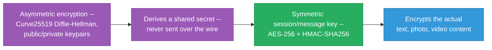
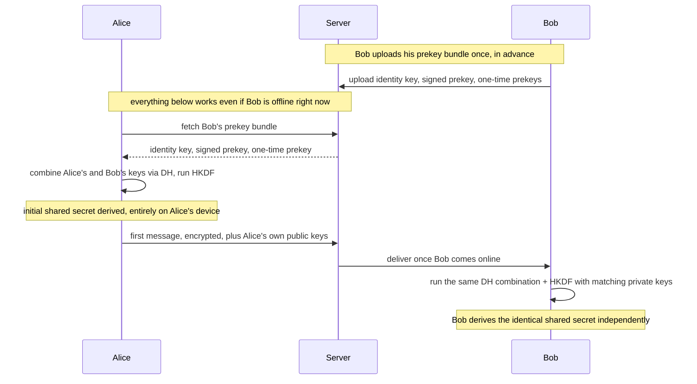
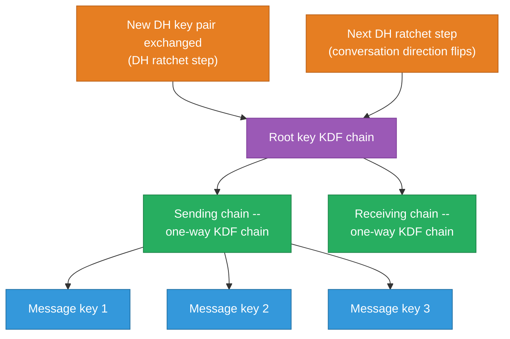
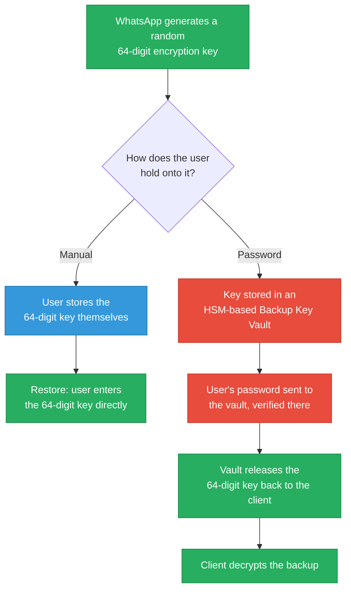
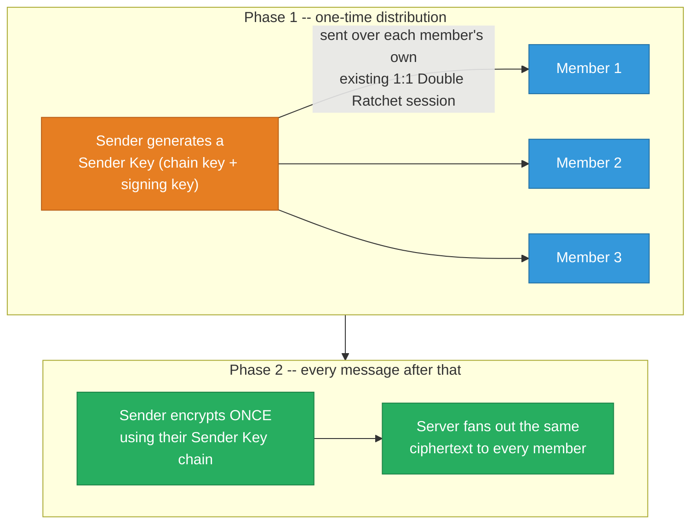
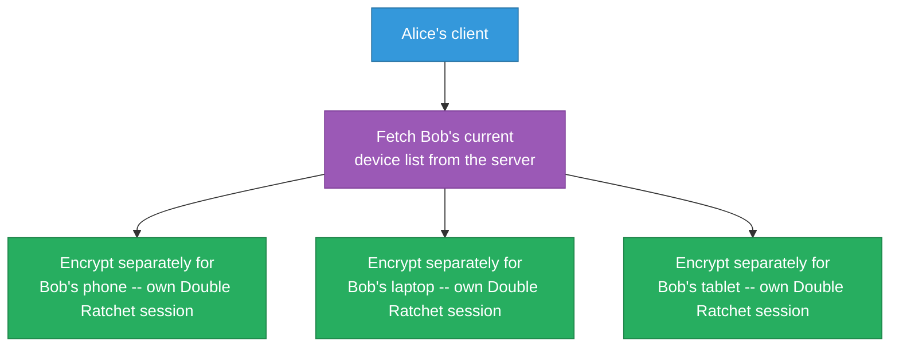
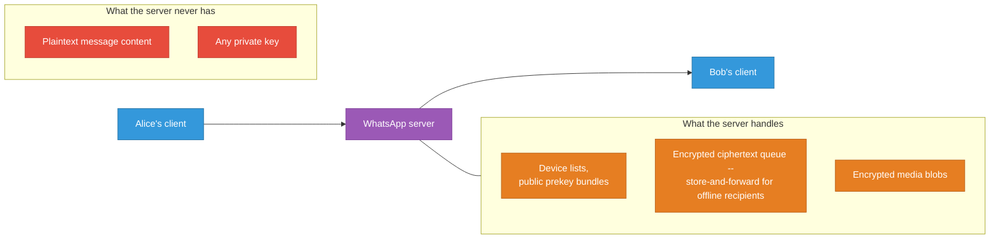
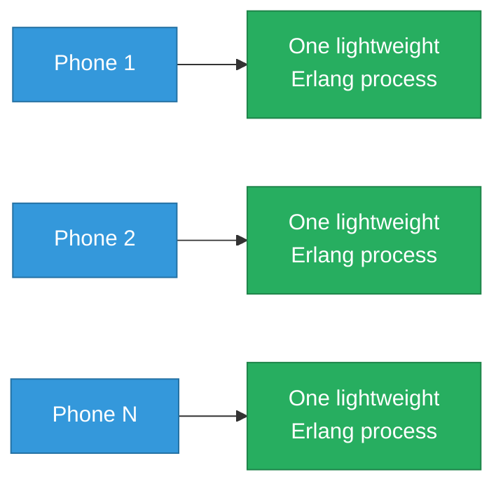

# End-to-End Encryption — Signal Protocol and System Design

How a messaging app like WhatsApp or Signal keeps a server from ever reading a message, using
WhatsApp as the running real-world example throughout: the hybrid symmetric/asymmetric split,
the Signal Protocol's handshake and ratchet, how that same crypto extends to group chat and
multi-device support, and what a server that never sees plaintext still has to do at scale.
Builds on [realtime-chat.md](./realtime-chat.md)'s connection-registry and multi-device
fan-out mechanics rather than re-deriving them — this file covers the encryption layer sitting
on top of that delivery layer.

<div class="quiz-progress" data-quiz-progress>
  <span class="quiz-progress-label">0/0 checks</span>
  <span class="quiz-progress-bar"><span class="quiz-progress-fill"></span></span>
</div>

---

## 1. The Hybrid Model — Symmetric and Asymmetric, Not One or the Other

Both. Every practical end-to-end encrypted messenger — WhatsApp and Signal included — uses
asymmetric and symmetric encryption together, for two different jobs:



- **Asymmetric encryption** (Curve25519 elliptic-curve Diffie-Hellman) establishes a shared
  secret between two parties who've never met, and keeps refreshing that secret as the
  conversation continues. It never touches the bulk message content directly.
- **Symmetric encryption** (AES-256, authenticated with HMAC-SHA256) does the actual
  encrypting/decrypting of text, photos, and videos — with a brand-new key derived for every
  single message.

The split exists because asymmetric operations are orders of magnitude more expensive per byte
than symmetric ones — elliptic-curve math doesn't come close to AES's throughput, especially
with hardware acceleration. So the pattern everywhere (TLS included — see
[tls-encryption.md](../networking/tls-encryption.md)) is the same: use the slow, expensive
asymmetric operation once to bootstrap a secret, then switch to the fast symmetric cipher for
everything that actually needs to move data. WhatsApp and Signal both implement this hybrid
model as the **Signal Protocol** (built by Open Whisper Systems, integrated into WhatsApp since
2016) — the next two sections cover exactly how.

<div class="quiz-card">
  <p class="quiz-q">Why not just use asymmetric encryption for the whole message, and skip the symmetric step entirely?</p>
  <button class="quiz-reveal">Reveal answer</button>
  <div class="quiz-a" hidden>Cost. Asymmetric (public-key) operations involve expensive elliptic-curve or modular arithmetic and don't scale to encrypting large amounts of data efficiently, while symmetric ciphers like AES are cheap, fast, and hardware-accelerated on virtually every modern CPU. Every practical E2E system uses the expensive asymmetric step only once, to derive a shared secret, then hands the actual bulk encryption to a fast symmetric cipher — never the other way around.</div>
</div>

---

## 2. Signal Protocol: X3DH — The Initial Handshake

X3DH (Extended Triple Diffie-Hellman) is how two people who've never talked before establish
that first shared secret — and it's designed to work even if one of them is completely offline
at the moment the other one wants to start the conversation.



The trick is that Bob doesn't need to be present for any of this. He uploaded a bundle of public
keys — his long-term identity key, a signed prekey, and a batch of one-time prekeys — to the
server well in advance. Alice fetches that bundle, combines it with her own keys through a
series of Diffie-Hellman exchanges (all over Curve25519), concatenates the results, and runs
them through HKDF to derive the shared secret — all of it computable on Alice's device alone.
Bob only has to come online later and run the mirror-image computation with his matching private
keys to land on the exact same secret.

<div class="quiz-card">
  <p class="quiz-q">Why does X3DH let Alice send Bob a message even though Bob is completely offline at that exact moment?</p>
  <button class="quiz-reveal">Reveal answer</button>
  <div class="quiz-a" hidden>Because Bob pre-uploaded a bundle of public keys (identity key, signed prekey, one-time prekeys) to the server in advance. Alice fetches that bundle and completes every Diffie-Hellman computation needed to derive the shared secret entirely on her own device — Bob doesn't need to participate live at all. He only needs to come online at some later point and run the same computation with his own matching private keys to arrive at the identical secret.</div>
</div>

---

## 3. Signal Protocol: The Double Ratchet

X3DH only runs once, to bootstrap the first shared secret. Everything after that — every single
message for the rest of the conversation's lifetime — is handled by the **Double Ratchet**,
which combines two separate ratcheting mechanisms.



<div class="stepper">
  <div class="stepper-panels">
    <div class="stepper-panel active">
      <strong>1. Root key established.</strong> X3DH's initial shared secret becomes the starting root key for the Double Ratchet — a direct handoff from Section 2, nothing new yet.
    </div>
    <div class="stepper-panel">
      <strong>2. Each message advances a symmetric-key ratchet.</strong> Every message sent or received derives a brand-new message key from the sending or receiving chain's current chain key, then deletes that chain key immediately — it's a one-way function, so there's no way to work backward from a newer chain state to an older message key.
    </div>
    <div class="stepper-panel">
      <strong>3. A DH ratchet step happens periodically.</strong> Roughly every time the conversation's direction flips (the other party replies), a fresh Diffie-Hellman key pair is exchanged and mixed into the root key, producing entirely new sending and receiving chains.
    </div>
    <div class="stepper-panel">
      <strong>4. Forward secrecy and post-compromise security fall out of steps 2 and 3.</strong> Deleting each chain key right after use means a compromised device holds nothing that can reconstruct past messages. A fresh DH ratchet step means even a device that was fully compromised regains security going forward, once the next key exchange happens.
    </div>
  </div>
  <div class="stepper-controls">
    <button class="stepper-prev">← Prev</button>
    <span class="stepper-dots"></span>
    <span class="stepper-label"></span>
    <button class="stepper-next">Next →</button>
  </div>
</div>

Each message's actual content is encrypted with the message key that pops out of this ratchet —
**AES-256 in CBC mode, authenticated with HMAC-SHA256** — never the raw shared secret itself.

<div class="quiz-card">
  <p class="quiz-q">An attacker fully compromises Bob's phone right now and extracts every key currently stored on it. Assuming this is a one-time snapshot (the attacker doesn't retain ongoing access), what does that expose — past messages, future messages, both, or neither?</p>
  <button class="quiz-reveal">Reveal answer</button>
  <div class="quiz-a" hidden>Neither. Past messages are protected by forward secrecy — each one's key was derived from a chain key that got deleted immediately after use, so there's no state left today that could reconstruct it. Future messages are protected by post-compromise security — the next DH ratchet step mixes in a brand-new key exchange the attacker never captured, re-securing the conversation from that point on. A one-time snapshot only exposes whatever hasn't been deleted yet at the exact instant of compromise, which in practice is very little.</div>
</div>

---

## 4. Encrypted Backups

Message history in most chat apps also has to survive a lost phone — but a cloud backup sitting
on Google Drive or iCloud is a different threat model from a live conversation, so WhatsApp
handles it with a separate mechanism (rolled out in 2021, per Meta's own engineering post).



When a user opts in, WhatsApp generates a random 64-digit key. Holding onto that key works one
of two ways: store it yourself and enter it manually on restore, or protect it with a password —
in which case the key itself lives in an **HSM-based "Backup Key Vault,"** real dedicated
hardware security module infrastructure. The password is sent to the vault and verified *there*;
only on success does the vault release the actual key back to the client. Critically, the HSM
enforces rate-limiting and lockout on failed attempts, which is what stops a stolen password hash
from being brute-forced offline the way a weakly-hashed password database could be. (Passkeys
were added as a further alternative in 2025.)

<div class="quiz-card">
  <p class="quiz-q">Someone gets unauthorized access to a WhatsApp backup file directly from Google Drive or iCloud. Can they read the chat history with just that file?</p>
  <button class="quiz-reveal">Reveal answer</button>
  <div class="quiz-a" hidden>Not without also obtaining the 64-digit key or the password protecting it. The backup file itself is encrypted with that key, and the key either lives only with the user (manual option) or behind an HSM-based vault that only releases it after verifying the correct password, with rate-limiting on guesses. Possessing the storage-provider file alone — without the key or a way to extract it from the vault — gives an attacker nothing readable.</div>
</div>

---

## 5. Group Messaging: Sender Keys

The pairwise Double Ratchet from Section 3 doesn't scale to groups on its own — encrypting a
separate copy of every message for every member, each through its own full ratchet, gets
expensive fast as group size grows. Groups use a different mechanism: **Sender Keys**.



The first time someone sends to a group, they generate a Sender Key (a ratcheting chain key plus
a signing key) and distribute it to every other member **individually** — but only once, over
each member's already-existing pairwise Double Ratchet session, so the distribution step itself
is still protected by everything covered in Sections 2-3. After that one-time step, every
subsequent group message is encrypted **once**, using the sender's own Sender Key chain (a fresh
per-message key each time, same forward-secrecy idea as the pairwise chain), and the identical
ciphertext is fanned out unchanged to every member. That's the efficiency win: O(1) encryption
operations per message regardless of group size, instead of O(n). The fan-out itself — looking up
each member's connection(s) and pushing to them — is unchanged from
[realtime-chat.md's Section 8](./realtime-chat.md#8-group-chat-fan-out-at-different-scales);
what's different here is purely that the encryption step no longer repeats per recipient.

<div class="quiz-card">
  <p class="quiz-q">A 200-person group sends a message. Does the sender's device perform 200 separate encryption operations, one per pairwise Double Ratchet session it holds with each member?</p>
  <button class="quiz-reveal">Reveal answer</button>
  <div class="quiz-a" hidden>No — that's exactly what Sender Keys avoids. The sender encrypts the message exactly once using their own Sender Key's ratcheting chain, and the server fans out that identical ciphertext to all 200 members' connections. The 200 pairwise Double Ratchet sessions only get used once, up front, to distribute the Sender Key itself to each member — not on every subsequent message.</div>
</div>

---

## 6. Multi-Device Encryption

Modern chat accounts live on more than one device — phone, laptop, tablet, web tab. WhatsApp
redesigned how this works in 2021 (per Meta's own engineering post), and the before/after
difference is a real architectural shift, not a minor tweak:

<div class="toggle-switch">
  <div class="toggle-buttons">
    <button data-toggle-opt="before" class="active state-warn">Before the 2021 redesign</button>
    <button data-toggle-opt="after" class="state-ok">After the 2021 redesign</button>
  </div>
  <div class="toggle-panel active" data-toggle-panel="before">
    A single identity key per account, held by the phone. Linked devices (WhatsApp Web/Desktop) worked by mirroring the phone's own session — the phone had to stay online and reachable to act as a relay for anything a companion device sent or received.
  </div>
  <div class="toggle-panel" data-toggle-panel="after">
    Each device — the phone plus up to 4 companions — gets its own independent identity key and connects to WhatsApp's servers directly. No phone-as-relay requirement: a companion device keeps working even while the phone is off, because it holds its own independent Double Ratchet sessions rather than borrowing the phone's.
  </div>
</div>



For 1:1 messages, the confirmed real mechanism is **client-fanout**: the sender's client fetches
the recipient's *current* device list from the server and encrypts an entirely separate
ciphertext for every device on it, since each device runs its own Double Ratchet session — there
is no shared "account-wide" plaintext copy sitting anywhere. Groups still use Sender Keys from
Section 5 for this, fanned out the same way. Device lists themselves are signed by identity keys
specifically so that a compromised or malicious server can't silently inject an extra device
onto the list to intercept messages meant for the account.

This is the crypto-layer counterpart to
[realtime-chat.md's Section 7, Multi-Device Fan-Out](./realtime-chat.md#7-multi-device-fan-out):
that section covers the connection-registry mechanics of reaching every one of a user's active
sessions (`user_id → [connection_1, connection_2, ...]`) — this section is why each of those
pushes is actually a distinct ciphertext rather than one plaintext blob copied N times.

<div class="quiz-card">
  <p class="quiz-q">Before WhatsApp's 2021 multi-device redesign, why did a linked session like WhatsApp Web stop working the moment the phone's battery died?</p>
  <button class="quiz-reveal">Reveal answer</button>
  <div class="quiz-a" hidden>Because there was only one identity key per account, held by the phone, and every linked device worked by mirroring the phone's own session rather than holding independent cryptographic state of its own — the phone had to stay online to act as a relay. The 2021 redesign gave each device its own identity key and its own independent Double Ratchet sessions, so a companion device now keeps working even if the phone is off entirely.</div>
</div>

---

## 7. Server Architecture — What the Server Can and Can't See



Everything the previous six sections described only works if the server genuinely never handles
plaintext or a private key — and it doesn't, structurally, not as a policy choice. What it does
handle: device lists and public prekey bundles (Section 2/6), a **store-and-forward queue** of
still-encrypted ciphertext for recipients who are currently offline (deleted from the server once
successfully delivered, not retained long-term), and encrypted media blobs — a photo or video is
encrypted client-side, uploaded as an opaque blob, and the key to open it travels only inside the
already-encrypted message pointing at it.

<div class="quiz-card">
  <p class="quiz-q">If WhatsApp's servers were ever compelled to hand over everything they hold on an account, what could they actually produce, given the architecture above?</p>
  <button class="quiz-reveal">Reveal answer</button>
  <div class="quiz-a" hidden>Device lists and public prekey bundles, whatever ciphertext happens to still be queued for offline delivery (encrypted, unreadable without the recipient's private keys), and metadata like who messaged whom and when — but not plaintext message content and not any private key, because neither of those ever exists on the server in the first place. "The server can't see your messages" isn't a policy promise here, it's a structural property of the system never holding the plaintext or the keys needed to produce it.</div>
</div>

---

## 8. Scale and Infrastructure

The encryption model above still has to run underneath a server handling an enormous number of
concurrent persistent connections — this is the piece that made WhatsApp's early scaling story
a widely-cited case study.



| Detail | Figure |
|---|---|
| Message volume (varies by the year measured — treat as illustrative, not a current exact figure) | reported between roughly 40 and 65 billion messages/day across WhatsApp's growth history |
| Connection model | one persistent TCP connection held open per device |
| Concurrency model | one lightweight Erlang/BEAM process per connection — not thread-per-connection, not a pooled model |
| Per-server connection capacity | FreeBSD tuned to handle over 2 million concurrent connections on a single server |

The historically-cited "50 billion messages/day with around 50 engineers" figure is real and
widely referenced, but it's a snapshot from a specific point in WhatsApp's growth, not a current
headcount or traffic claim — what makes it a useful data point for a system design discussion is
the *architecture* behind it: a lightweight-process-per-connection model with fault isolation
between connections, rather than raw headcount or a specific traffic number being the interesting
fact.

<div class="quiz-card">
  <p class="quiz-q">A single server process handles millions of concurrent connections. Does it also need to track each conversation's Double Ratchet state — chain keys, root key, message keys — to do that?</p>
  <button class="quiz-reveal">Reveal answer</button>
  <div class="quiz-a" hidden>No. The Double Ratchet's entire state lives on the two communicating clients' devices, never the server — the server never holds any private key needed to advance a ratchet, so it structurally can't participate in one. The "one lightweight process per connection" model in this section is purely about handling raw TCP connections and relaying/queueing already-encrypted bytes; it does zero cryptographic work on behalf of any conversation, which is exactly consistent with Section 7's point that the server never sees plaintext or holds private keys.</div>
</div>

---

## Quick Reference

```
Need fast per-byte encryption for actual content            → symmetric (AES-256 + HMAC-SHA256)
Need a shared secret without an existing shared channel      → asymmetric (Curve25519 DH)
Need to message someone who is currently offline             → X3DH, pre-uploaded prekey bundle
Need forward secrecy + post-compromise security               → Double Ratchet (DH ratchet + KDF chains)
Need efficient group encryption, not O(n) per message         → Sender Keys, distributed once per member
Need multiple devices per account, no phone-as-relay          → per-device identity keys + client-fanout
Need to protect a cloud backup without the server holding a key → HSM-based Backup Key Vault, password-gated
Need the server to never see plaintext or hold private keys   → encrypt/decrypt entirely on the client
```
