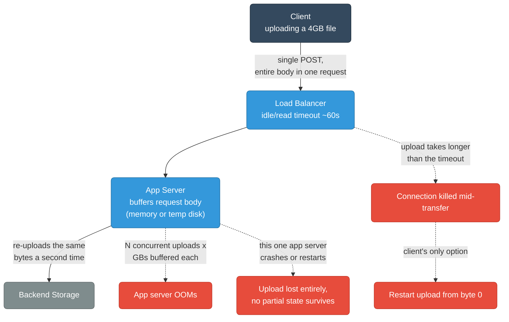
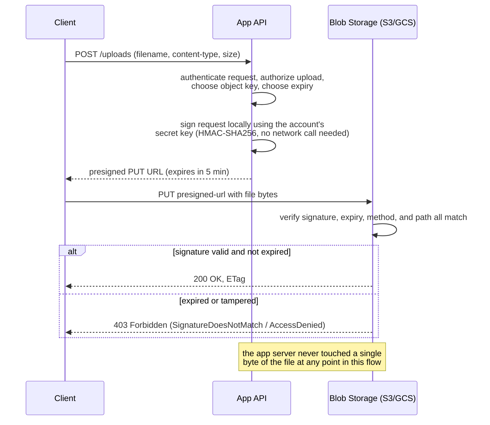
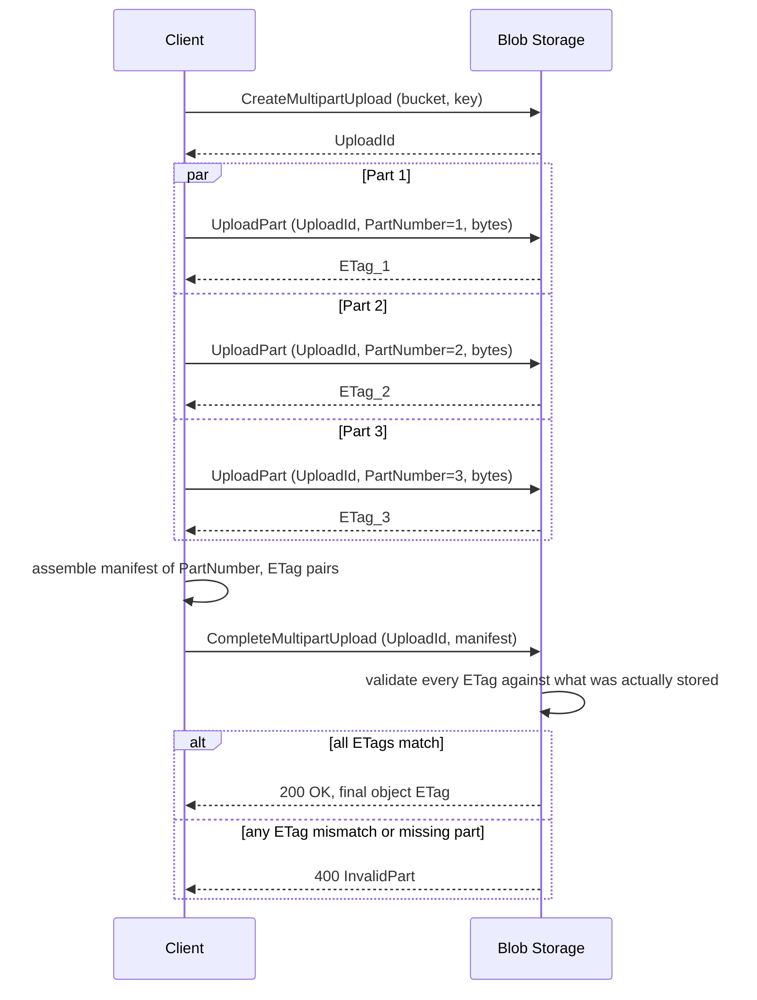
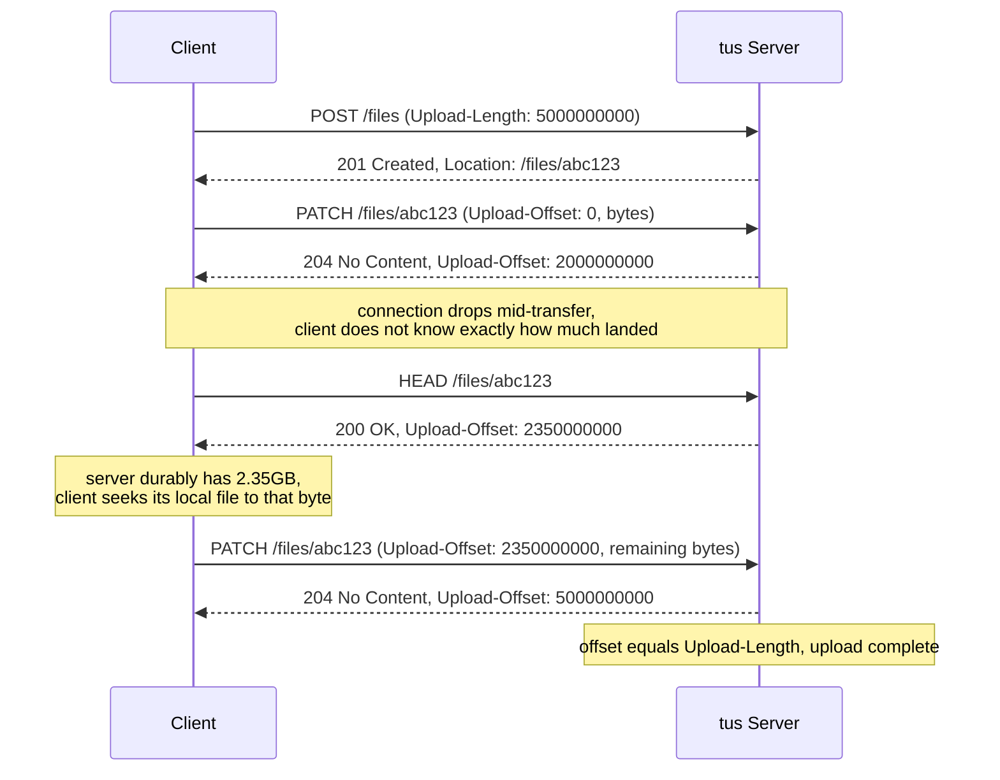
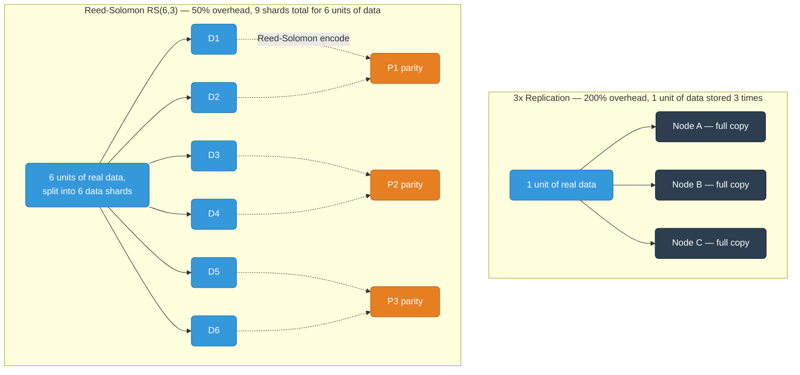
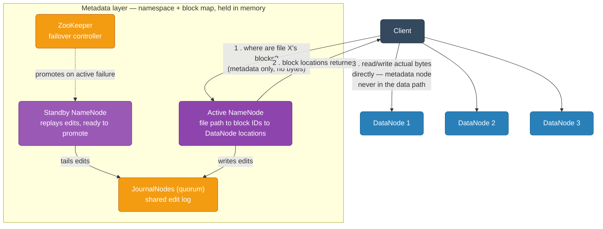
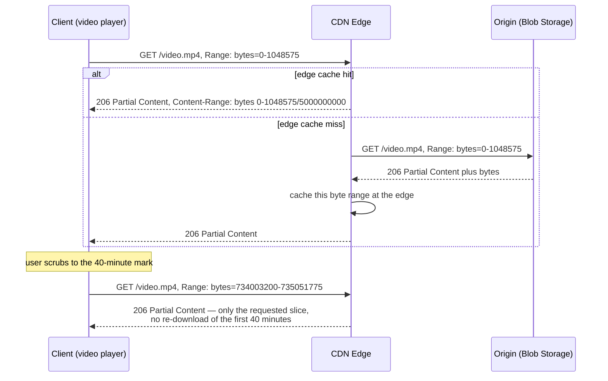
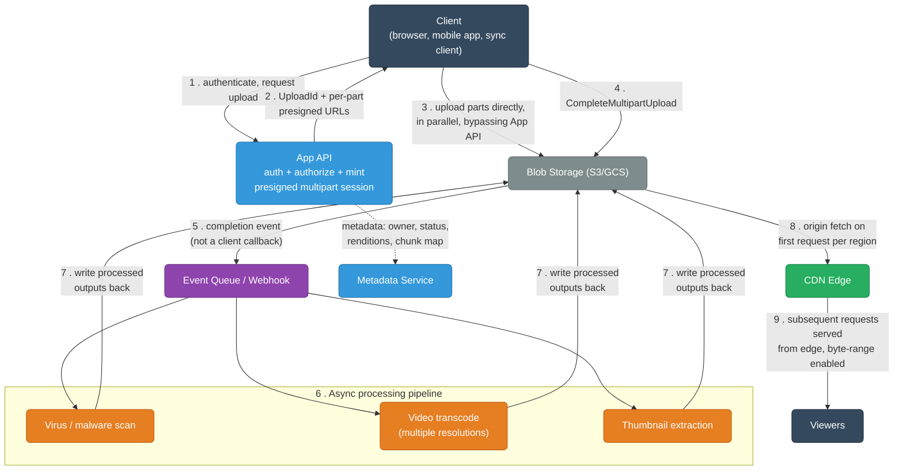

# File Transfer & Storage at Scale

How large files actually move between a client and durable storage — presigned URLs, multipart and resumable upload protocols, integrity verification, content-addressable dedup, replication vs erasure coding, and the metadata layer that ties a blob store together.

<div class="quiz-progress" data-quiz-progress>
  <span class="quiz-progress-label">0/0 checks</span>
  <span class="quiz-progress-bar"><span class="quiz-progress-fill"></span></span>
</div>

---

## 1. The Naive-Upload Problem

The obvious design — client `POST`s the whole file straight to your app server, app server writes it to storage — works fine in a demo and falls apart under real file sizes and real networks. It's worth being precise about *why*, because every technique in this guide exists to fix exactly one of these failure modes.



**Timeouts.** Load balancers and reverse proxies default to fairly short idle/read timeouts (ALB ~60s, nginx `proxy_read_timeout` 60s) because those defaults are tuned for API traffic, not multi-gigabyte transfers. A 4GB upload over a mediocre connection can easily take longer than that, and the infrastructure between client and app server has no idea it's watching a legitimate slow transfer instead of a hung connection — it just kills it.

**Memory.** Most naive server frameworks buffer the entire request body before your handler even runs, or buffer to a temp file and then read the whole thing into memory to hand off to storage. A fleet of app servers each holding a few GB of "in-flight upload" per concurrent request will OOM the instant real concurrency shows up — the app server was never supposed to be a staging buffer for bulk data.

**Single point of failure.** Every byte physically transits the app tier twice: once from client to app server, once again from app server to the actual storage backend. That doubles bandwidth cost and halves effective throughput for that hop, and if the one app server handling this upload crashes mid-transfer, the upload is just gone — there's no other instance that knows anything about it.

**No resumability.** A plain `POST` has no notion of partial progress the server remembers across a reconnect. If the connection drops at 95% through a 4GB upload, the client's only option is to restart from byte zero. On a lossy mobile network, an upload can become mathematically unable to ever finish if the failure rate is high enough relative to how long it takes to get through the file once.

**Fights horizontal scaling.** App servers behind a load balancer are supposed to be stateless and interchangeable. Any naive attempt to bolt resumability onto raw `POST` requires the client to keep hitting the *same* server that holds its partial-upload state in memory — sticky sessions — which directly undermines the reason you scaled horizontally in the first place.

**Why it matters:** every section that follows is a direct answer to one of these five problems — presigned URLs remove the app server from the data path entirely, multipart/resumable protocols solve resumability, checksums solve silent corruption, and replication/erasure coding solve durability once the bytes actually land somewhere.

<div class="quiz-card">
  <p class="quiz-q">A naive upload endpoint buffers the whole request body in memory before calling your handler. Why does this scale worse than the raw bandwidth math would suggest?</p>
  <button class="quiz-reveal">Reveal answer</button>
  <div class="quiz-a" hidden>Because memory, not bandwidth, becomes the binding constraint. Each concurrent upload holds its full multi-GB body in RAM on that one app server for the duration of the transfer — ten concurrent 2GB uploads is 20GB of RAM committed to buffering alone, on top of whatever else that instance is doing. Bandwidth would let you serve far more concurrent uploads than memory will; you OOM long before you saturate the network link.</div>
</div>

---

## 2. Presigned URLs

The fix for "the app server shouldn't be in the data path" is to have the client upload **directly to the storage backend** — S3, GCS, Azure Blob — and have the app server's only job be minting a short-lived, narrowly-scoped credential that authorizes exactly that one upload. This is a **presigned URL**.



### What's actually inside a presigned URL

A presigned URL is a normal URL with the authorization baked into its query string. For S3's SigV4 scheme, an example looks like:

```
https://my-bucket.s3.amazonaws.com/uploads/user123/video.mp4
  ?X-Amz-Algorithm=AWS4-HMAC-SHA256
  &X-Amz-Credential=AKIA.../20260812/us-east-1/s3/aws4_request
  &X-Amz-Date=20260812T140000Z
  &X-Amz-Expires=300
  &X-Amz-SignedHeaders=host;content-type
  &X-Amz-Signature=9f8e2a...
```

| Component | What it does |
|---|---|
| `X-Amz-Credential` | Which access key + date/region/service scope signed this — S3 uses this to look up the right secret to verify against |
| `X-Amz-Expires` | Seconds of validity from the moment it was signed — max 7 days under SigV4, but upload flows should use minutes |
| `X-Amz-SignedHeaders` | Which headers were included in what was signed — if the actual request omits or alters one of these, the signature no longer matches |
| `X-Amz-Signature` | An HMAC-SHA256 over the method, path, headers, and the pieces above — proof the signer possessed the secret key, without ever exposing the key itself |

The method and the path are also part of what's signed, even though they're not a separate query parameter — they're baked into the canonical request the signature was computed over. That's the whole security model in one sentence: **the signature only validates for one specific method against one specific object, for a bounded window of time.**

### Why a leaked presigned URL isn't a disaster

Generating the signature is a local HMAC computation against your own secret key — no round trip to S3 is needed to mint one, which is why the app server can issue thousands of these per second without adding load to the storage service.

- **Time-boxed, not permanent.** Once `X-Amz-Expires` elapses, the identical URL is rejected with `403` regardless of who holds it. Compare this to leaking a long-lived static access key, which stays valid until someone manually rotates it.
- **Scoped, not general.** A presigned `PutObject` URL for `uploads/user123/video.mp4` cannot be replayed against `uploads/user123/other-file.mp4`, and it cannot be used to `GetObject` that same key — the method and the exact path are part of the signed canonical request.
- **Still a bearer credential for its lifetime.** Anyone holding the URL before it expires can use it exactly as if they had your key for that one call — which is why upload flows should set expiry in minutes, not hours, and why presigned POST (which supports conditions like `content-length-range` and key-prefix restrictions) is often preferred over presigned PUT for public-facing uploads.

<div class="quiz-card">
  <p class="quiz-q">A presigned PUT URL for uploads/user123/video.mp4 leaks into a public log. Can whoever finds it read the file back, or overwrite a different file in the same folder?</p>
  <button class="quiz-reveal">Reveal answer</button>
  <div class="quiz-a" hidden>No to both. The signature is computed over the specific HTTP method and the specific object path — this URL only authorizes a PUT to that exact key. It cannot be replayed as a GET to read the object back, and it cannot be pointed at a different key like other-file.mp4 in the same folder, because that would be a different canonical request with a different required signature. The only real exposure is that anyone with the URL can overwrite that one file until X-Amz-Expires elapses.</div>
</div>

---

## 3. Multipart / Chunked Upload Protocol

Presigned URLs solve *where* the bytes go. Multipart upload solves *how* a large file gets there reliably and in parallel. This is the real S3-style API-level lifecycle — the same shape GCS's resumable-upload sessions and Azure's block blobs implement under different names.

### The lifecycle, step by step

<div class="stepper">
  <div class="stepper-panels">
    <div class="stepper-panel active">
      <strong>1. InitiateMultipartUpload.</strong> The client calls <code>CreateMultipartUpload</code> against the bucket/key. No bytes move yet — this just registers intent and returns an <code>UploadId</code> that ties every subsequent call together.
    </div>
    <div class="stepper-panel">
      <strong>2. Split the file and upload parts in parallel.</strong> The client divides the file into parts (commonly 8&ndash;100MB each), and calls <code>UploadPart</code> for each one, tagged with a <code>PartNumber</code> and the shared <code>UploadId</code>. Because each part is an independent HTTP request, the client can fire several at once over separate connections instead of streaming everything through one TCP pipe.
    </div>
    <div class="stepper-panel">
      <strong>3. Each part returns its own ETag.</strong> S3 computes the MD5 of exactly the bytes it received for that part and hands it back as the part's <code>ETag</code>. The client collects <code>{PartNumber, ETag}</code> for every part &mdash; this list is the manifest that proves what actually landed.
    </div>
    <div class="stepper-panel">
      <strong>4. CompleteMultipartUpload.</strong> The client sends the full <code>{PartNumber, ETag}</code> manifest. S3 checks every ETag against what it actually stored for that part number. Only if all of them match does it stitch the parts together into one object and return the final object's own ETag.
    </div>
    <div class="stepper-panel">
      <strong>5. AbortMultipartUpload (the escape hatch).</strong> An in-progress multipart upload that's abandoned still occupies storage for every part already uploaded &mdash; it isn't free until explicitly aborted or cleaned up by a bucket lifecycle rule. Production systems set a lifecycle policy to auto-abort incomplete uploads after N days specifically because of this.
    </div>
  </div>
  <div class="stepper-controls">
    <button class="stepper-prev">← Prev</button>
    <span class="stepper-dots"></span>
    <span class="stepper-label"></span>
    <button class="stepper-next">Next →</button>
  </div>
</div>

### The calls in sequence



### Part-size tradeoffs

S3 enforces 5MiB&ndash;5GiB per part (the last part is exempt from the minimum), a cap of 10,000 parts, and a 5TiB object ceiling — those hard limits already push you toward a sane range, but the real tradeoff is about failure cost and overhead, not just the limits:

| Part size | Overhead | Failure cost |
|---|---|---|
| Too small (e.g., 1MB) | High — 10,000 parts means 10,000 separate `UploadPart` API calls, each with its own request overhead and ETag bookkeeping | Low — losing one part means re-sending 1MB |
| Too large (e.g., 1GB) | Low — few API calls, less per-call overhead | High — losing one part late in transfer means re-sending the whole 1GB, not just the corrupted tail |
| Sweet spot (8&ndash;100MB, tuned to network reliability) | Balanced | A failed part is cheap to retry without wasting the rest of the upload |

Parallelism is the other reason multipart exists even for perfectly reliable networks: a single TCP connection's throughput is capped by the bandwidth-delay product and congestion-control ramp-up, especially over a long RTT. Splitting into parts lets the client open several connections at once and multiply effective throughput — this is the same principle behind download accelerators using range requests, covered later in this guide.

<div class="quiz-card">
  <p class="quiz-q">CompleteMultipartUpload receives a manifest where part 7's ETag doesn't match what S3 actually stored for part 7. What happens to the other 9 parts that matched fine?</p>
  <button class="quiz-reveal">Reveal answer</button>
  <div class="quiz-a" hidden>The whole CompleteMultipartUpload call fails — S3 returns 400 InvalidPart rather than assembling an object from the 9 good parts and leaving part 7 out. Assembly is all-or-nothing: every ETag in the manifest must match before any stitching happens. The practical fix is just to re-upload part 7 with a fresh UploadPart call (reusing the same UploadId) and retry Complete — the other 9 parts already uploaded successfully don't need to be resent.</div>
</div>

---

## 4. Resumable Uploads (tus.io Protocol)

Multipart's resumability is coarse: the smallest unit you can retry is a whole part. If a 100MB part dies at byte 99,999,999, you resend all 100MB. The [tus.io](https://tus.io) protocol takes a different approach — resumability at the exact byte offset, using two HTTP verbs: `HEAD` to discover progress, `PATCH` to continue.

### Interrupt and resume, step by step

<div class="stepper">
  <div class="stepper-panels">
    <div class="stepper-panel active">
      <strong>1. Create the upload resource.</strong> Client sends <code>POST /files</code> with an <code>Upload-Length</code> header declaring the total size. The server allocates storage for it and replies <code>201 Created</code> with a <code>Location</code> header pointing at the new resource URL.
    </div>
    <div class="stepper-panel">
      <strong>2. Stream bytes with PATCH.</strong> Client sends <code>PATCH</code> to that URL with an <code>Upload-Offset</code> header stating where this chunk starts, and a body of type <code>application/offset+octet-stream</code>. The server appends the bytes and replies with its new <code>Upload-Offset</code> &mdash; how much it now durably has.
    </div>
    <div class="stepper-panel">
      <strong>3. The connection drops.</strong> Mid-transfer, the network blips. The client's local record of "bytes sent" and the server's actual "bytes durably received" may now disagree &mdash; the client doesn't know if its last PATCH landed, partially landed, or landed but the ACK was lost.
    </div>
    <div class="stepper-panel">
      <strong>4. HEAD to reconcile state.</strong> On reconnect, the client sends <code>HEAD</code> to the same resource URL. The server replies with the exact <code>Upload-Offset</code> it has durably persisted &mdash; ground truth, not a guess.
    </div>
    <div class="stepper-panel">
      <strong>5. Resume from that exact byte.</strong> The client seeks its local file to the offset the server reported and issues a new <code>PATCH</code> starting there, with an <code>Upload-Offset</code> header matching the server's number exactly &mdash; a mismatch is rejected with <code>409 Conflict</code>, which prevents silently resuming from the wrong position.
    </div>
  </div>
  <div class="stepper-controls">
    <button class="stepper-prev">← Prev</button>
    <span class="stepper-dots"></span>
    <span class="stepper-label"></span>
    <button class="stepper-next">Next →</button>
  </div>
</div>



### tus vs multipart's resumability

Multipart resumes at the granularity of a whole part; tus resumes at the granularity of a single byte, because the server tells the client exactly how much it durably has, not just "which part succeeded." The tradeoff runs the other way, though: the flow above is inherently a single ongoing PATCH stream against one resource, so a naive tus client gives up multipart's easy parallelism across several TCP connections. (The protocol does support an optional `concatenation` extension for uploading partial resources in parallel and joining them server-side, but that's an extension most implementations skip.)

<div class="quiz-card">
  <p class="quiz-q">A 100MB multipart part fails at 99% through, and a tus PATCH of the same size fails at the same point. What's the actual difference in how much data has to be re-sent?</p>
  <button class="quiz-reveal">Reveal answer</button>
  <div class="quiz-a" hidden>Multipart re-sends the entire 100MB part from its own start — the smallest unit it can resume is a whole part, regardless of how much of it actually made it through. tus re-sends only the remaining ~1MB, because a HEAD request tells the client the exact byte offset the server durably has, and the next PATCH resumes from precisely that point rather than from the start of some larger unit.</div>
</div>

---

## 5. Integrity Verification

Getting bytes from A to B isn't enough — you need proof they arrived unmodified. This matters at two different granularities: per-chunk (catch corruption from one network hop before it poisons an assembled file) and whole-file (the final guarantee the object matches what the client intended to send).

### Per-part checksums

S3's `ETag` for a **single-part** upload is literally the MD5 of the object — comparing it to a local `md5sum` works fine. For a **multipart** object, this is a genuinely easy trap: the final ETag is *not* the MD5 of the full file. It's the MD5 of the concatenation of each part's individual MD5 digests, followed by a dash and the part count — something like `"9f8e2a1b3c4d5e6f7a8b9c0d1e2f3a4b-5"`. Comparing that string to a plain `md5sum` of the local file will never match, even for a perfectly correct upload.

```
part_1_md5 = md5(bytes_of_part_1)
part_2_md5 = md5(bytes_of_part_2)
...
multipart_etag = md5(part_1_md5 || part_2_md5 || ... || part_N_md5) + "-" + N
```

### Why verify per-part, not just once at the end

- **Fail fast, fail cheap.** A part-level mismatch is caught after uploading that one part — say, 20MB — instead of discovering corruption only after transferring and assembling an entire 5GB object.
- **Isolate the retry.** Once you know *which* part failed, you only re-upload that part. Whole-file-only verification tells you the file is bad but nothing about where, forcing a full re-upload to be safe.
- **Catch corruption at its source.** Parallel parts often travel over different TCP connections, sometimes through different network paths or proxies — a bit flip on one connection shouldn't be allowed to silently poison the whole object before anyone checks.

### Stronger hashes and full-object checksums

MD5 is fine for accidental corruption detection but is not collision-resistant against a deliberate adversary. S3's newer `x-amz-checksum-*` API supports CRC32, CRC32C, SHA-1, and SHA-256, computed and validated **per part** at upload time and optionally as a **full-object checksum** on completion — S3 verifies server-side, so a mismatch fails the request instead of silently storing corrupt data.

```http
PUT /uploads/report.pdf HTTP/1.1
Host: my-bucket.s3.amazonaws.com
Content-MD5: 1B2M2Y8AsgTpgAmY7PhCfg==
x-amz-checksum-sha256: 47DEQpj8HBSa+/TImW+5JCeuQeRkm5NMpJWZG3hSuFU=

<file bytes>
```

If either header doesn't match what the server actually received, the `PUT` fails outright rather than storing a silently-corrupted object.

<div class="quiz-card">
  <p class="quiz-q">You uploaded a 3-part file and want to verify it landed correctly by comparing S3's ETag to md5sum of your local copy. Why might they legitimately not match even though the upload succeeded?</p>
  <button class="quiz-reveal">Reveal answer</button>
  <div class="quiz-a" hidden>Because a multipart object's ETag is not the MD5 of the full file — it's the MD5 of the concatenation of each part's individual MD5 digests, with a "-N" suffix for the part count. A plain md5sum of the whole local file will never equal that value, even for a perfectly correct upload. To actually verify integrity, you'd need to either compare against x-amz-checksum-sha256 (a real full-object checksum, if requested at upload time) or replicate S3's exact per-part-then-concatenate MD5 scheme locally.</div>
</div>

---

## 6. Content-Addressable Storage & Deduplication

**Content-addressable storage (CAS)** derives an object's identity from a hash of its own bytes, not from a filename a human assigned. Two files with identical content hash to the identical address, so storing the second one is a no-op — this is exactly how git stores blobs (a blob's ID *is* its SHA hash) and the underlying idea behind Dropbox-style and rsync-style deduplication across near-identical files.

The interesting engineering problem is *how you cut a large file into chunks* before hashing each one — because that decision determines whether dedup survives a small edit or breaks completely.

### Fixed-size chunking

Split the file into fixed N-byte blocks (say, 4MB) and hash each one independently. Simple, but fragile: inserting even a single byte near the start of the file shifts every subsequent block's boundary by one byte. Every block after the insertion point now contains a different set of bytes than before, hashes completely differently, and dedup against the previous version of the file effectively fails for the entire remainder of the file — even though 99.9% of the actual content is unchanged.

### Content-defined chunking (CDC)

Instead of chunking by byte count, compute a **rolling hash** over a sliding window as you scan the file (rsync's adaptive rolling checksum, a Rabin fingerprint, or FastCDC's gear-hash variant), and declare a chunk boundary whenever the rolling hash satisfies some content-derived condition — for example, its low N bits are all zero. Because the trigger depends on the actual bytes at that position rather than "N bytes since the last boundary," an insertion only disturbs the boundaries immediately around the edit. The rolling hash **resynchronizes** a few bytes later, and every chunk boundary from that point onward lands in exactly the same place as it did before the edit — those chunks hash identically to the prior version and dedup normally.

```mermaid
graph TD
    classDef unchanged fill:#27ae60,stroke:#1e8449,color:#fff,rx:6
    classDef shifted fill:#e74c3c,stroke:#c0392b,color:#fff,rx:6
    classDef edit fill:#f39c12,stroke:#ba6018,color:#fff,rx:6

    subgraph FIXED["Fixed-size chunking (4MB blocks) — after inserting 1 byte near the start"]
        F0["1 byte inserted here"]:::edit --> F1["Block 1 — hash changes"]:::shifted --> F2["Block 2 — hash changes"]:::shifted --> F3["Block 3 — hash changes"]:::shifted --> F4["Block 4 — hash changes"]:::shifted
    end

    subgraph CDC["Content-defined chunking — same insertion"]
        C0["1 byte inserted here"]:::edit --> C1["Chunk 1 — boundary shifts, hash changes"]:::shifted --> C2["Chunk 2 — rolling hash resyncs, boundary matches original"]:::unchanged --> C3["Chunk 3 — identical to before, dedup hit"]:::unchanged --> C4["Chunk 4 — identical to before, dedup hit"]:::unchanged
    end
```



<div class="tab-group">
  <div class="tab-buttons">
    <button data-tab="fixedchunk" class="active">Fixed-size chunking</button>
    <button data-tab="cdcchunk">Content-defined chunking</button>
  </div>
  <div class="tab-panels">
    <div class="tab-panel active" data-tab-panel="fixedchunk">
      <strong>Boundaries at fixed byte offsets</strong> (0, 4MB, 8MB, ...) regardless of content. Trivial to implement and to compute in parallel, since chunk boundaries don't depend on scanning from the start of the file.
      <br/><br/>
      <strong>Fails on insertion/deletion.</strong> Any edit that changes the file's length before a given point shifts every subsequent boundary, so every later chunk hashes differently even though its actual content is unchanged. Dedup across versions of an edited file collapses almost entirely.
    </div>
    <div class="tab-panel" data-tab-panel="cdcchunk">
      <strong>Boundaries triggered by content</strong> — a rolling hash (Rabin fingerprint, FastCDC's gear hash) evaluated over a sliding window declares a cut point whenever it matches a pattern, independent of byte offset from the start.
      <br/><br/>
      <strong>Survives edits.</strong> An insertion or deletion only disturbs the one or two chunks immediately around it; the rolling hash resynchronizes shortly after, so every chunk further along the file matches its pre-edit hash exactly. This is what makes incremental backup tools (restic, Borg) and Dropbox-style sync efficient on edited files, not just brand-new ones.
    </div>
  </div>
</div>

**Why it matters:** FastCDC in particular improves on the original Rabin-fingerprint approach (used in LBFS and early rsync-alikes) by using a cheaper gear hash plus normalized chunking to reduce variance in chunk size while running substantially faster — the difference between CDC being a nice idea and CDC being fast enough to run on every file write.

<div class="quiz-card">
  <p class="quiz-q">You insert one word at the very beginning of a 500MB document. Under fixed-size 4MB chunking, roughly how much of the file's chunk set changes? Under content-defined chunking?</p>
  <button class="quiz-reveal">Reveal answer</button>
  <div class="quiz-a" hidden>Under fixed-size chunking, essentially the entire file — every chunk boundary is at a fixed byte offset from the start, so a length-changing edit near the beginning shifts every single chunk after it, and all of them hash differently even though almost none of the actual content changed. Under content-defined chunking, only the one or two chunks immediately around the insertion point change — the rolling hash resynchronizes to content-derived boundaries within a few bytes, so every chunk after that point lands on the same boundary and hashes identically to the pre-edit version, letting dedup skip re-storing the other ~499MB.</div>
</div>

---

## 7. Storage Durability: Replication vs. Erasure Coding

Disks fail routinely at scale — a single drive's annual failure rate runs 1&ndash;2%, which sounds low until you have tens of thousands of them, and drives start failing daily. Durability means surviving that without losing data, and there are two fundamentally different ways to pay for it.



<div class="toggle-switch">
  <div class="toggle-buttons">
    <button data-toggle-opt="replication" class="active">3x Replication</button>
    <button data-toggle-opt="erasure">Erasure Coding — RS(6,3)</button>
  </div>
  <div class="toggle-panel active" data-toggle-panel="replication">
    <strong>Overhead: 200%.</strong> Storing 1 unit of real data costs 3 units of physical storage — HDFS and GFS both default to exactly this (replication factor 3).
    <br/><br/>
    <strong>Fault tolerance:</strong> survives losing any 2 of the 3 copies before data is actually lost, as long as copies land in independent failure domains (different racks/AZs).
    <br/><br/>
    <strong>Repair is cheap.</strong> Losing a copy means reading one intact replica and streaming a fresh copy onto a healthy node — essentially a single sequential copy operation, low CPU, fast, and simple to reason about.
  </div>
  <div class="toggle-panel" data-toggle-panel="erasure">
    <strong>Overhead: 50%.</strong> 6 data shards + 3 parity shards = 9 total for 6 units of real data (9/6 = 1.5x storage, i.e. 50% overhead) &mdash; a third of the physical storage cost of 3x replication for comparable fault tolerance.
    <br/><br/>
    <strong>Fault tolerance:</strong> survives losing any 3 of the 9 shards (data or parity) before data is lost — a stronger guarantee per stored byte than 3x replication's "lose any 2 of 3," at roughly a quarter the storage overhead.
    <br/><br/>
    <strong>Repair is CPU- and network-expensive.</strong> Reconstructing one missing shard requires reading at least 6 of the remaining shards, often from 6 different nodes over the network, then running Reed-Solomon matrix inversion (Galois field arithmetic) to recompute the missing piece — a many-to-one "repair storm" instead of a single stream copy.
  </div>
</div>

**Real numbers.** Facebook's f4 warm blob storage moved data past its "hot" window from 3x replication down to a Reed-Solomon (10,4) code — 14 total shards for 10 data shards, roughly 40% overhead — trading slower, CPU-heavier reconstruction for a large absolute reduction in storage cost, justified because that data is rarely modified and rarely needs repair. Azure Storage does the same thing conceptually: Locally Redundant Storage (3 copies) for hot tiers, erasure-coded storage for cool/archive tiers where the CPU cost of an occasional reconstruction is a good trade for the storage savings.

The pattern to remember: **replication trades storage for cheap repair; erasure coding trades CPU-expensive repair for cheap storage.** Neither is universally "better" — hot, frequently-accessed, small data tends toward replication for its simplicity and repair speed; cold, bulk, rarely-touched data tends toward erasure coding because the storage savings compound and reconstructions are rare events you can afford to make expensive.

<div class="quiz-card">
  <p class="quiz-q">RS(6,3) uses only 50% storage overhead versus 200% for 3x replication, and can actually tolerate losing one more shard before data loss (3 vs. 2). Given that erasure coding looks strictly better on both axes, why doesn't everything just use it?</p>
  <button class="quiz-reveal">Reveal answer</button>
  <div class="quiz-a" hidden>Because the comparison leaves out repair cost, which runs the opposite direction. Replication's repair is a single stream copy from one intact replica — cheap, fast, low CPU. Erasure coding's repair requires reading at least 6 of the remaining shards, often from 6 different nodes over the network, then doing Reed-Solomon matrix inversion to reconstruct the missing shard — CPU-expensive and network-heavy, effectively a many-to-one repair storm. For hot, frequently-changing, small data where fast repair matters and failures are relatively routine, replication's overhead is worth paying. Erasure coding wins for cold, bulk, rarely-touched data where the storage savings are large and reconstructions are rare enough to tolerate being expensive.</div>
</div>

---

## 8. Metadata Service Design

Splitting a file across thousands of chunks on thousands of storage nodes creates a new problem: something has to know **which chunks make up which file, and where each chunk physically lives.** That mapping is the metadata layer, and it's architecturally distinct from the data plane that just durably holds bytes — GFS's master and HDFS's NameNode are the canonical designs for this split.



**How it works:** the NameNode holds the entire namespace — the directory tree and the file-to-block mapping — in memory for speed. It does *not* durably store block *locations*; those are rebuilt on startup from live heartbeats and block reports sent by every DataNode. Only the namespace structure itself (persisted via a checkpoint image plus an edit log) survives a restart. A client asks the NameNode "where are file X's blocks," gets back a list of DataNode locations, and then talks to those DataNodes directly for the actual bytes — the metadata node is deliberately never in the data path, so its load doesn't scale with data volume, only with the number of metadata operations.

### Why the metadata layer becomes the bottleneck

- **Single point of failure.** One active NameNode process resolving every path — if it dies, no client can locate any block on the entire cluster until a replacement takes over, even though every DataNode and every byte of actual data is still perfectly intact.
- **Memory ceiling, not disk ceiling.** Classic HDFS spends roughly 150 bytes of NameNode heap per tracked object (file, directory, block). A cluster can hit a metadata memory wall — unable to track more files — long before it hits an actual disk-capacity wall. This is the infamous HDFS "small files problem": a million tiny files costs the same metadata overhead as a handful of huge ones, for a fraction of the useful storage.
- **QPS ceiling on one machine.** Every `open`, `create`, `rename`, and `list` is a request to that one process. Adding more DataNodes scales storage and read/write bandwidth, but does nothing for metadata throughput, which is capped by one machine's capacity regardless of cluster size.

### How production systems fix this

- **HDFS HA** — an Active/Standby NameNode pair sharing an edit log through a quorum of JournalNodes, with ZooKeeper detecting the active's failure and promoting the standby. This removes the SPOF, but only one NameNode is ever active, so the memory and QPS ceilings are untouched.
- **HDFS Federation** — shard the namespace itself across multiple independent NameNodes (e.g., `/users` on one, `/data` on another), each with its own block pool. This is what actually breaks the single-machine ceiling, at the cost of clients needing a mount-table layer to know which NameNode owns which path.
- **The cloud-object-store alternative** — S3 and similar services skip the single-master tree-namespace design entirely. Key lookups are served by a horizontally-partitioned key-value index (sharded by hash of the object key across many nodes), so there's no one node holding the whole namespace and no single-machine memory ceiling — at the cost of giving up cheap, atomic directory rename, which falls naturally out of a tree-structured namespace but not out of a flat, hash-partitioned key index.

<div class="quiz-card">
  <p class="quiz-q">A cluster has plenty of free disk space across its DataNodes but starts rejecting new file creates. What's the most likely actual bottleneck?</p>
  <button class="quiz-reveal">Reveal answer</button>
  <div class="quiz-a" hidden>The NameNode's in-memory metadata capacity, not disk space. The NameNode holds the entire namespace and file-to-block mapping in RAM — roughly 150 bytes per tracked file/block/directory in classic HDFS — so a cluster can run out of room to track new files while its DataNodes still have plenty of free disk. This is the "small files problem": lots of tiny files consume the same metadata slot as a huge file, hitting the memory ceiling long before the actual storage capacity is exhausted.</div>
</div>

---

## 9. Download & Delivery

Once a file is durably stored, serving it back efficiently is a different problem from writing it — popular files need to avoid re-hitting origin storage on every request, and large files need to be seekable without downloading the whole thing.

### CDN edge caching

For public or frequently-accessed files, a CDN edge node caches bytes fetched from origin (the blob store) so subsequent requests from nearby clients are served from the network edge instead of hitting origin storage at all — the same cache-aside pattern as any other cache, just distributed geographically. This is exactly why user-facing downloads (video, images, large public assets) sit behind a CDN rather than serving directly from S3/GCS. See [cdn.md](../networking/cdn.md) for cache-key construction, TTL/invalidation, and provider-specific behavior — the pattern applies identically whether the origin is a web app or a blob store.

### HTTP byte-range requests

A client sends `Range: bytes=1000000-1999999`; a server that supports ranges (advertised via `Accept-Ranges: bytes` on the initial response) replies `206 Partial Content` with a `Content-Range` header and only that slice of bytes — not the whole object.

```http
GET /video.mp4 HTTP/1.1
Range: bytes=734003200-735051775

HTTP/1.1 206 Partial Content
Content-Range: bytes 734003200-735051775/5000000000
Content-Length: 1048576
```

This one mechanism enables three distinct capabilities:

- **Resumable downloads.** A paused or dropped download resumes with `Range: bytes=<already-downloaded-count>-` instead of restarting from zero — the download-side mirror of tus's `Upload-Offset`.
- **Video scrubbing/seeking.** A player jumping to the 40-minute mark of a 2-hour video requests only the bytes around that timestamp, not everything before it — this is why seeking in a streamed video is near-instant instead of waiting for a re-download.
- **Parallel chunked downloads.** A download accelerator opens several simultaneous range requests for different byte spans of the same file to multiply throughput — the download-side mirror of multipart upload's parallel parts, for the same bandwidth-delay-product reason.



<div class="quiz-card">
  <p class="quiz-q">A user scrubs a video player to the 40-minute mark of a 2-hour file served over HTTP. Without byte-range support, what would the player have to do instead?</p>
  <button class="quiz-reveal">Reveal answer</button>
  <div class="quiz-a" hidden>Download the entire file — or at minimum everything from the start up through the 40-minute mark — before it could show that frame, since a plain GET has no way to ask for just a slice. Range requests let the player send Range: bytes=&lt;offset-for-40min&gt;- and get back only that slice via 206 Partial Content, which is what makes scrubbing feel instant instead of requiring a wait proportional to how far into the file the user seeks.</div>
</div>

---

## 10. Putting It Together: An End-to-End Pipeline

Tying every piece together with a concrete example — a video upload pipeline in the shape of a simplified YouTube-style system (the same shape works for a Dropbox-style sync client, swapping "transcode" for "content-defined chunking + dedup against the user's existing blocks").



Walking the numbered steps against the rest of this guide:

1&ndash;2. The app server's entire involvement in the data path is a JSON exchange — authenticate, authorize, decide the object key, mint a presigned multipart session (§2, §3). It never sees a byte of video.
3&ndash;4. The client uploads parts directly and in parallel to blob storage, then calls `CompleteMultipartUpload` — S3 validates every part's ETag before assembling the final object (§3, §5).
5. Storage — not the client — emits the completion event. This is deliberate: a client's own "I'm done!" signal can't be trusted as the *only* source of truth, since the client can crash or the network can fail after the actual `PUT`/`Complete` succeeded but before its notification reaches your app. Driving the pipeline off the storage provider's own event (S3 Event Notification, GCS Pub/Sub) means the pipeline runs even if the client vanishes the instant the upload finishes.
6&ndash;7. Workers consume the event independently — virus scanning, transcoding to multiple renditions, thumbnail extraction — and write their outputs back to blob storage. A sync-client variant would run content-defined chunking here (§6) to dedup the new file's blocks against ones the user already has stored.
8&ndash;9. Finished, publicly-served assets sit behind a CDN (§9): the first viewer's request in a region populates the edge cache from origin, every subsequent viewer in that region is served from the edge, and byte-range support means scrubbing works without re-fetching the file from the start.
Throughout, a separate metadata service (§8) — not the blob store itself — tracks ownership, processing status, which renditions exist, and (for the dedup case) the chunk map, kept intentionally distinct from the bytes so it can be scaled, sharded, and made highly available on its own terms.

<div class="quiz-card">
  <p class="quiz-q">Why does the processing pipeline trigger off a storage-emitted completion event instead of the client calling a "processUpload" API once its upload finishes?</p>
  <button class="quiz-reveal">Reveal answer</button>
  <div class="quiz-a" hidden>Because the client's own success signal isn't trustworthy as the sole trigger — it can crash, lose network connectivity, or simply fail to make that follow-up call after the actual upload to blob storage already succeeded. If the pipeline depended on the client reliably telling the app "I'm done," a client that vanishes right after a successful upload would leave a file sitting in storage forever unprocessed. Triggering off the storage provider's own completion event (S3 Event Notification, GCS Pub/Sub) means the event fires because the bytes are actually, durably there — independent of whatever happens to the client afterward.</div>
</div>

---

## Quick Reference

| Problem | Technique | Key mechanism |
|---|---|---|
| App server can't handle multi-GB request bodies | Presigned URLs | Client uploads directly to storage; app server only signs a scoped, time-boxed URL |
| Large upload needs parallelism and partial retry | Multipart upload | `CreateMultipartUpload` → parallel `UploadPart` + ETag → `CompleteMultipartUpload` validates all ETags |
| Connection drops need byte-exact resume | tus / resumable upload | `HEAD` returns durable `Upload-Offset`; `PATCH` resumes from exactly that byte |
| Detect corruption before it poisons the whole file | Per-part checksums | MD5/SHA-256 verified per part at upload time, not just once at the end |
| Avoid storing duplicate content | Content-addressable storage | Hash of content is the address; content-defined chunking survives edits, fixed-size doesn't |
| Survive disk/node failure without excess storage cost | Replication vs erasure coding | 3x replication = 200% overhead, cheap repair; RS(6,3) = 50% overhead, CPU-expensive repair |
| Track where chunks of a file actually live | Metadata service | Separate namespace layer (NameNode-style); shard it or it becomes the QPS/memory bottleneck |
| Serve popular files fast, support seeking | CDN + byte-range requests | Edge caching for repeat requests; `Range`/`206 Partial Content` for resumable/seekable delivery |
