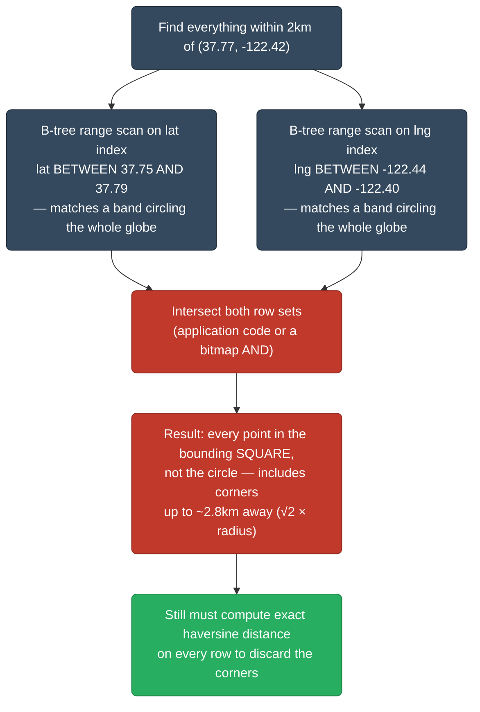
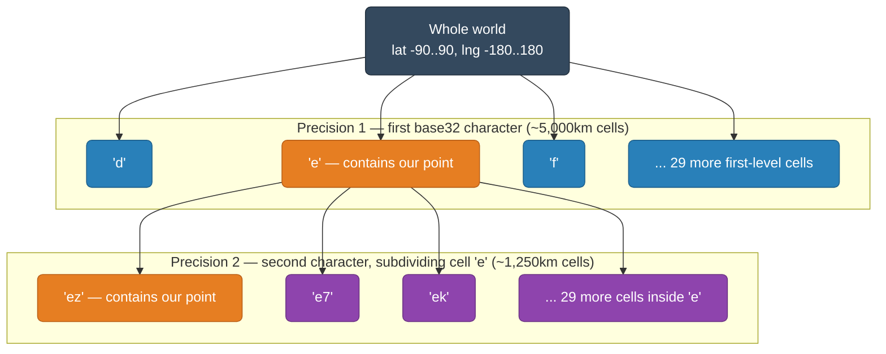
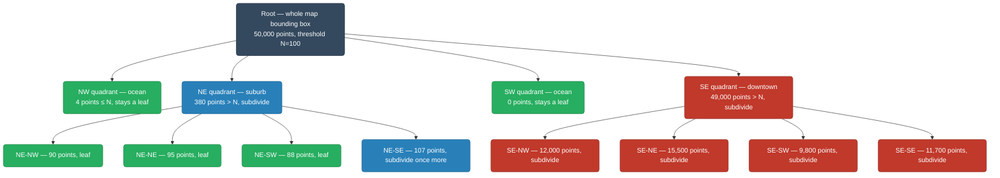
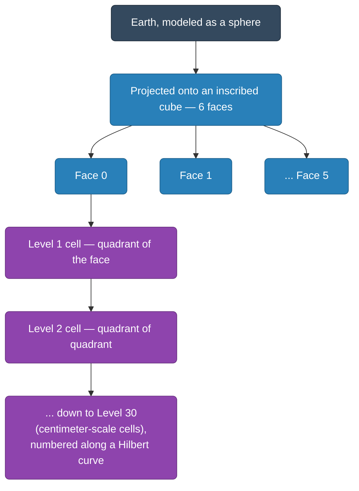
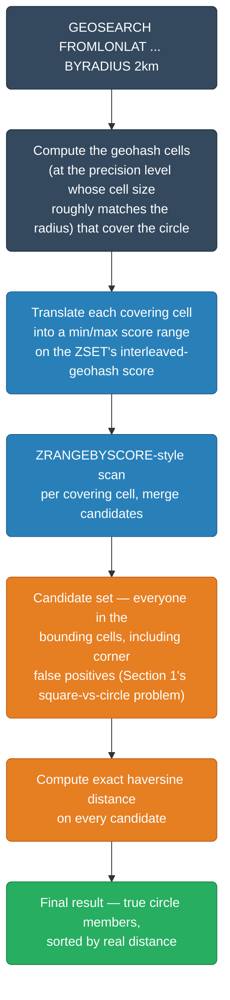
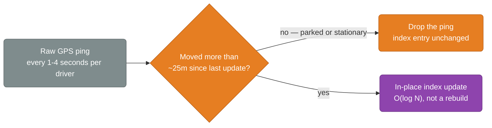
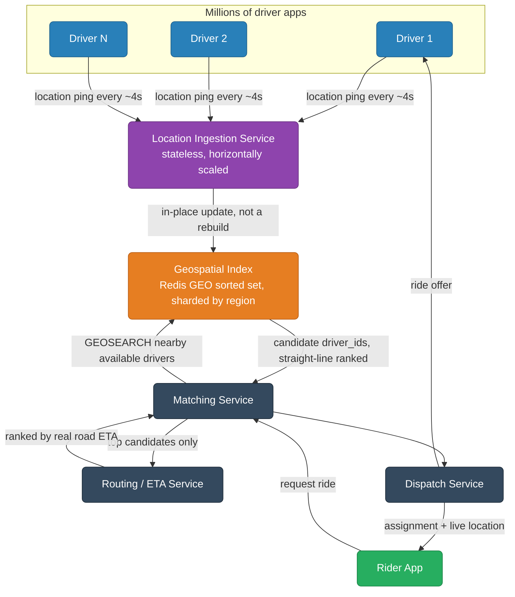
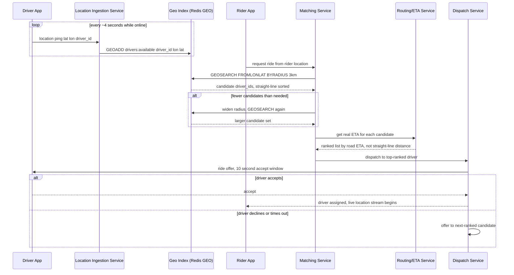

# Geospatial & Location-Based Services

Every "near me" feature — restaurants nearby, drivers within 3km, friends on a map — boils down to the same question: given a point, which of millions of other points are physically close to it, answered fast enough to feel instant. That's a genuinely different problem from a normal database lookup, and the naive fix (index latitude, index longitude, intersect the results) breaks down in a way that isn't obvious until you've actually hit it in production. This guide covers why that naive approach fails, the three real techniques that fix it — geohashing, quadtrees, and Google's S2 geometry — and how a production system (Redis GEO, a ride-hailing dispatch pipeline) actually wires one of these in at scale.

<div class="quiz-progress" data-quiz-progress>
  <span class="quiz-progress-label">0/0 checks</span>
  <span class="quiz-progress-bar"><span class="quiz-progress-fill"></span></span>
</div>

---

## 1. Why a Normal Index Can't Answer "Find Nearby"

Say you index `latitude` with a B-tree and `longitude` with a separate B-tree, and someone asks for "everything within 2km of (37.77, -122.42)." The obvious plan: run a range scan on each index (`lat BETWEEN 37.75 AND 37.79`, `lng BETWEEN -122.44 AND -122.40`), then intersect the two row sets.

This doesn't decompose the way it looks like it should. Each individual range scan is cheap in isolation, but a B-tree range scan on latitude alone matches every row in a thin band running all the way around the globe at that latitude — it has no idea longitude even exists. The database (or your application code) has to pull back both full candidate sets and intersect them before the query means anything, and neither index narrows the search on its own the way a single-column range query normally would.



Even after paying for that intersection, the result is a *square*, not a *circle* — the corners of that bounding box are up to `√2 × radius` away, so you still need a second pass computing real distance on every candidate just to throw out the false positives. The fundamental problem: **2D proximity doesn't decompose into two independent 1D range queries.** Nearness in a plane is a joint property of both coordinates together, and a B-tree only knows how to order one column at a time.

The fix in every scheme below is the same idea in different clothes: encode both dimensions into *one* sortable/searchable key, so that physical proximity in 2D space becomes locality in that single key — something an ordinary index, or a purpose-built spatial tree, can actually exploit.

<div class="quiz-card">
  <p class="quiz-q">You already have a B-tree index on latitude and a separate B-tree index on longitude. Does intersecting a latitude-range query with a longitude-range query give you an efficient "nearby" search?</p>
  <button class="quiz-reveal">Reveal answer</button>
  <div class="quiz-a" hidden>Not efficiently. Each range scan matches a full band circling the entire globe at that latitude or longitude — neither index knows the other dimension exists — so both full candidate sets have to be pulled back and intersected before the query means anything. And even after intersecting, you get the bounding square around the circle, not the circle itself, so you still need a distance-filtering pass to drop the corners. Proximity in 2D doesn't decompose into two independent 1D range queries.</div>
</div>

---

## 2. Geohashing — Turning 2D Proximity Into String-Prefix Matching

A geohash encodes a `(lat, lng)` pair into a single base32 string by interleaving the bits from two independent binary searches — one narrowing latitude, one narrowing longitude — bit by bit, alternating between them. The interleaving is the whole trick: it takes two coordinates that a plain index can't jointly reason about and produces one string where physical closeness *usually* shows up as a shared prefix.

### Encoding, bit by bit

For each dimension, start with its full range (`lat`: -90 to 90, `lng`: -180 to 180) and repeatedly binary-search: if the target is in the upper half of the current range, emit `1` and narrow to the upper half; otherwise emit `0` and narrow to the lower half. Bits are produced alternately, starting with longitude, then latitude, then longitude again, and so on. Every bit doubles the resolution in that dimension.

<div class="stepper">
  <div class="stepper-panels">
    <div class="stepper-panel active">
      <strong>1. Start with full ranges.</strong> Encoding lat=42.6, lng=-5.6.
      Latitude range starts at <code>[-90, 90]</code>, longitude range starts at
      <code>[-180, 180]</code>. Bits alternate starting with longitude.
    </div>
    <div class="stepper-panel">
      <strong>2. Interleave longitude bits.</strong> Longitude midpoint is 0;
      -5.6 &lt; 0 &rarr; bit <code>0</code>, range narrows to <code>[-180, 0]</code>.
      Next longitude turn, midpoint is -90; -5.6 &ge; -90 &rarr; bit <code>1</code>,
      range narrows to <code>[-90, 0]</code>. Each longitude turn halves the
      longitude range again, regardless of what happened on latitude turns in between.
    </div>
    <div class="stepper-panel">
      <strong>3. Interleave latitude bits, on the turns in between.</strong>
      Latitude midpoint is 0; 42.6 &ge; 0 &rarr; bit <code>1</code>, range
      narrows to <code>[0, 90]</code>. Next latitude turn, midpoint is 45;
      42.6 &lt; 45 &rarr; bit <code>0</code>, range narrows to <code>[0, 45]</code>.
      Latitude and longitude ranges shrink independently — they just take turns
      contributing a bit to the same output stream.
    </div>
    <div class="stepper-panel">
      <strong>4. Collect the interleaved bit string.</strong> After 15 turns
      (lng, lat, lng, lat, ...) the stream reads
      <code>011011111111000</code>. Every 5 bits is one base32 character's
      worth of resolution.
    </div>
    <div class="stepper-panel">
      <strong>5. Group into 5-bit chunks and base32-encode.</strong>
      <code>01101</code> = 13 = <code>e</code>. <code>11111</code> = 31 =
      <code>z</code>. <code>10000</code> (padded) = 16 = <code>s</code>...
      giving the prefix <code>ezs</code> — matching more of this coordinate's
      real geohash (<code>ezs42</code>, using the alphabet
      <code>0123456789bcdefghjkmnpqrstuvwxyz</code>, which skips
      <code>a</code>, <code>i</code>, <code>l</code>, <code>o</code> to avoid
      visual ambiguity). Keep interleaving bits for however much precision
      you need — 5 characters (25 bits) is roughly a 5km cell, 9 characters
      (45 bits) is roughly 5 meters.
    </div>
  </div>
  <div class="stepper-controls">
    <button class="stepper-prev">← Prev</button>
    <span class="stepper-dots"></span>
    <span class="stepper-label"></span>
    <button class="stepper-next">Next →</button>
  </div>
</div>



### Precision by string length

| Length | Bits | Approx. cell size |
|---|---|---|
| 1 | 5 | ~5,000 km |
| 3 | 15 | ~156 km |
| 5 | 25 | ~4.9 km |
| 6 | 30 | ~1.2 km |
| 7 | 35 | ~153 m |
| 8 | 40 | ~19 m |
| 9 | 45 | ~4.8 m |

**Why this is useful:** truncating a geohash string to a shorter prefix gives you the coarser cell that contains the full-precision point — for free, with zero decoding. "Find everything near this point" becomes "find every row whose geohash starts with this prefix," which is exactly what a plain B-tree index on a string column already does well: a prefix match is just a bounded range scan (`geohash BETWEEN 'ezs42' AND 'ezs43'`).

### The boundary discontinuity gotcha

The prefix property is a *usually*, not an *always* — and the failure mode is easy to miss. Two points can be meters apart physically but land in completely different top-level cells if they straddle a grid boundary that the interleaved-bit encoding treats as a hard edge — crossing the equator, crossing the prime meridian, or just crossing any coarse cell wall. A point at lat=0.0001 and a point at lat=-0.0001, a fraction of a millimeter apart in reality, fall on opposite sides of the very first latitude bit — every subsequent bit is computed from a different starting half of the range, so the two geohashes can share **no common prefix at all**, despite being neighbors.

**Why it matters:** prefix matching alone silently misses real neighbors sitting just across a cell edge. Every production geohash implementation (Redis GEOSEARCH, Elasticsearch's geohash grid, Uber's H3-adjacent tooling) compensates by also querying the handful of neighboring cells at the same precision, not just the cell containing the query point itself — a "search my cell and its 8 neighbors" step, not "search my cell's prefix and stop."

<div class="quiz-card">
  <p class="quiz-q">If you truncate a geohash string from 8 characters down to 5, what do you get?</p>
  <button class="quiz-reveal">Reveal answer</button>
  <div class="quiz-a" hidden>The coarser, lower-precision cell (roughly 4.9km instead of 19m) that fully contains the original point — for free, with no decoding or recomputation needed. This is exactly what an expanding-ring search exploits: drop characters to widen the search area cheaply, add characters back to narrow it.</div>
</div>

<div class="quiz-card">
  <p class="quiz-q">Two GPS points are 3 meters apart, one at lat=0.0001 and one at lat=-0.0001 (straddling the equator). Should you expect their geohash strings to share a long common prefix?</p>
  <button class="quiz-reveal">Reveal answer</button>
  <div class="quiz-a" hidden>No — potentially not even a single character. The very first latitude bit in the interleaved encoding is a binary search on [-90, 90], and these two points fall on opposite sides of that midpoint. Every bit downstream is computed from a different half of the range, so the two geohashes can diverge completely despite being neighbors in reality. This is why real implementations query neighboring cells explicitly instead of trusting prefix-matching alone.</div>
</div>

---

## 3. Quadtrees — Adaptive Spatial Partitioning

A quadtree takes a different approach: instead of a fixed grid at every precision level, it starts with one bounding box covering the whole area and recursively subdivides only where points are actually dense. Each node holds up to `N` points; the moment a cell exceeds that threshold, it splits into 4 equal quadrants (NW, NE, SW, SE), and each of those quadrants applies the same rule recursively.

The result is a tree whose *depth* tracks point density instead of a uniform grid resolution: a dense downtown core gets subdivided many levels deep because every quadrant keeps blowing past the threshold, while an empty stretch of ocean stops subdividing after the very first split because there's nothing there to split further.



```python
class QuadNode:
    def __init__(self, bounds, threshold=100):
        self.bounds = bounds        # (min_lat, min_lng, max_lat, max_lng)
        self.threshold = threshold
        self.points = []
        self.children = None        # None until this node splits

    def insert(self, point):
        if self.children is not None:
            self.child_for(point).insert(point)
            return
        self.points.append(point)
        if len(self.points) > self.threshold:
            self._split()

    def _split(self):
        self.children = [QuadNode(q, self.threshold) for q in self.bounds.quadrants()]
        for p in self.points:
            self.child_for(p).insert(p)
        self.points = None           # this node is no longer a leaf
```

**Contrast with geohash:** a geohash grid is fixed-precision everywhere — a 7-character cell is ~150m whether it covers midtown Manhattan or the middle of the Pacific. A quadtree spends its subdivision budget only where points actually exist, so a query over sparse terrain touches a shallow, cheap tree, while a query over a dense city walks deeper — resolution adapts to where the data actually lives instead of being uniform by construction.

<div class="quiz-card">
  <p class="quiz-q">In a quadtree covering a city and the ocean beside it, a leaf node over open ocean might represent an area thousands of times larger than a leaf node over downtown. Is that a bug?</p>
  <button class="quiz-reveal">Reveal answer</button>
  <div class="quiz-a" hidden>No — that's the entire design. A node only subdivides once it holds more than the threshold number of points. Ocean has almost no points, so it stops subdividing after one or two splits and stays a large leaf; downtown keeps blowing past the threshold at every level, so it keeps splitting into much smaller leaves. Leaf size tracking inversely with point density is the adaptive behavior a quadtree is built to provide, unlike a geohash's uniform grid.</div>
</div>

---

## 4. S2 Geometry — Google's Cube-Projected Alternative

Geohash has two structural weaknesses baked into its design: it's a flat lat/lng grid, so cells distort badly near the poles (lines of longitude converge there, but the encoding treats every latitude band symmetrically); and it has the boundary-discontinuity problem from Section 2, where adjacent physical points can land in unrelated cells.

Google's S2 library fixes both by changing the projection entirely. Instead of gridding latitude and longitude directly, S2 projects the sphere onto an inscribed cube — 6 faces — and then subdivides each face hierarchically, the same recursive-quadrant idea as a quadtree, down to whatever level of precision is needed (up to level 30, cells a few centimeters across). Cells on a face are numbered along a Hilbert space-filling curve, which is specifically chosen because it keeps physically adjacent cells numerically close far more consistently than a raw bit-interleaved geohash does — a Hilbert curve never "jumps" the way a naive Z-order/interleaved curve can at a boundary.



Each S2 cell has a 64-bit cell ID that encodes the face, the position along the Hilbert curve, and the subdivision level — a single sortable integer, in the same spirit as a geohash string, but built on a projection that doesn't distort near the poles and a curve that doesn't discontinuously jump at cell boundaries the way interleaved bits can. The tradeoff is implementation complexity: cube-face math and Hilbert curve indexing are meaningfully harder to hand-roll than geohash's binary-search interleaving, which is why most teams reach for S2 as a library (or a database's built-in support) rather than implementing it from scratch — this section stays conceptual rather than walking through a worked example the way Sections 2 and 3 did.

<div class="quiz-card">
  <p class="quiz-q">A flat lat/lng geohash grid and Google's S2 grid both aim to encode 2D position as a sortable key. What specific real-world problem does S2's cube projection fix that a flat lat/lng grid has?</p>
  <button class="quiz-reveal">Reveal answer</button>
  <div class="quiz-a" hidden>Distortion near the poles. Lines of longitude converge toward a point at the poles, but a geohash's binary-search encoding treats every latitude band the same way, so a cell of fixed geohash length covers a wildly different physical area near the poles than at the equator. Projecting onto a cube first and subdividing each face means cells stay much more uniform in physical size everywhere on the sphere, poles included.</div>
</div>

---

## 5. Comparing Geohash, Quadtree, and S2

<div class="tab-group">
  <div class="tab-buttons">
    <button data-tab="geohash" class="active">Geohash</button>
    <button data-tab="quadtree">Quadtree</button>
    <button data-tab="s2">S2</button>
  </div>
  <div class="tab-panels">
    <div class="tab-panel active" data-tab-panel="geohash">
      <p><strong>Precision control:</strong> Fixed per string length — same cell size everywhere at a given precision, regardless of local point density.</p>
      <p><strong>Boundary artifacts:</strong> The known weak point — adjacent physical points can land in entirely different prefixes across a cell edge (Section 2). Requires explicit neighbor-cell lookups to compensate.</p>
      <p><strong>Index-ability:</strong> Excellent — it's just a string. Drops straight into any existing B-tree index with zero custom database extension.</p>
      <p><strong>Implementation complexity:</strong> Low. Binary-search bit interleaving plus a base32 lookup table; straightforward to hand-roll.</p>
    </div>
    <div class="tab-panel" data-tab-panel="quadtree">
      <p><strong>Precision control:</strong> Adaptive — resolution follows point density automatically (dense areas subdivide deep, sparse areas stay coarse), no manual precision choice needed.</p>
      <p><strong>Boundary artifacts:</strong> Different failure mode — a query near a quadrant boundary must check sibling/neighbor nodes, similar in spirit to geohash's problem but arising from tree structure rather than bit interleaving.</p>
      <p><strong>Index-ability:</strong> Needs a real tree structure in memory or a specialized index type (e.g. PostgreSQL GiST/SP-GiST) — doesn't reduce to a plain sortable column the way geohash and S2 cell IDs do.</p>
      <p><strong>Implementation complexity:</strong> Moderate. Recursive split/insert logic and rebalancing on density change are more moving parts than geohash's stateless bit interleaving.</p>
    </div>
    <div class="tab-panel" data-tab-panel="s2">
      <p><strong>Precision control:</strong> Fixed per cell level, like geohash, but levels map to far more uniform physical cell sizes globally — including near the poles.</p>
      <p><strong>Boundary artifacts:</strong> Substantially reduced versus geohash — the Hilbert curve ordering keeps physically adjacent cells numerically close far more consistently, though some care at face boundaries is still needed.</p>
      <p><strong>Index-ability:</strong> Excellent — a 64-bit integer, sortable in any index just like geohash's string.</p>
      <p><strong>Implementation complexity:</strong> Highest of the three. Cube-face projection and Hilbert curve math are why most teams use it as a library rather than hand-rolling it.</p>
    </div>
  </div>
</div>

| | Geohash | Quadtree | S2 |
|---|---|---|---|
| Precision control | Fixed per string length | Adaptive to point density | Fixed per cell level |
| Boundary artifacts | Significant — needs neighbor lookups | Present at quadrant edges | Minimal — Hilbert curve ordering |
| Polar distortion | Yes — flat lat/lng grid | N/A (density-adaptive, not grid-fixed) | No — cube projection |
| Index-ability | Plain string, any B-tree | Needs a tree structure or GiST/SP-GiST | Plain 64-bit integer, any B-tree |
| Implementation complexity | Low | Moderate | High |

<div class="quiz-card">
  <p class="quiz-q">Which of the three approaches can you drop straight into an existing relational database's B-tree index with zero custom extension, and which one specifically needs a purpose-built tree structure or index type instead?</p>
  <button class="quiz-reveal">Reveal answer</button>
  <div class="quiz-a" hidden>Geohash (a plain string) and S2 (a plain 64-bit integer) both index natively in an ordinary B-tree — proximity search becomes a bounded range/prefix scan on a column type the database already knows how to sort. A quadtree is a real tree structure, not a flat sortable key, so it needs either an in-memory tree of its own or a specialized index type like PostgreSQL's GiST/SP-GiST to get equivalent database support.</div>
</div>

---

## 6. Redis GEO Commands — Geohashing in Production

Redis's `GEOADD` / `GEODIST` / `GEOSEARCH` family isn't a separate data structure — it's built entirely on top of a sorted set (`ZSET`), using a 52-bit interleaved geohash (26 bits latitude + 26 bits longitude, the same binary-search interleaving from Section 2, just carried out to full 52-bit precision) as the member's **score**. That 52-bit integer happens to fit exactly in a double's 52-bit mantissa, so it stores losslessly as a normal ZSET score with no separate index structure required.

```bash
# Add driver locations — member name, score is the interleaved geohash
GEOADD drivers:available -122.419 37.774 driver:42
GEOADD drivers:available -122.408 37.783 driver:99

# Straight-line distance between two members, using the stored geohash scores
GEODIST drivers:available driver:42 driver:99 km

# Find drivers within 2km of a point, nearest first, capped at 10 results
GEOSEARCH drivers:available FROMLONLAT -122.42 37.77 BYRADIUS 2 km ASC COUNT 10
```

`GEOSEARCH` (the modern replacement for the deprecated `GEORADIUS`) executes as a range query on that same sorted set, plus a correctness pass on top:



The score-range scan alone would return every point in the *bounding cells*, not the circle — exactly the square-vs-circle over-fetch problem from Section 1, just implemented with geohash-derived score ranges instead of separate lat/lng B-trees. Redis compensates the same way any geohash-backed system has to: a mandatory haversine-distance filter pass over the candidate set before returning results, discarding anything that fell in the covering cells but outside the true circle.

<div class="quiz-card">
  <p class="quiz-q">GEOSEARCH already narrows the search to a range scan on the sorted set's geohash-derived score. Why does Redis still compute exact haversine distance on every candidate afterward instead of just returning the range-scan results directly?</p>
  <button class="quiz-reveal">Reveal answer</button>
  <div class="quiz-a" hidden>Because the score range corresponds to the geohash cells covering the query circle — a bounding shape, not the circle itself. Candidates in the corners of that covering area can be farther away than the requested radius (the same square-vs-circle over-fetch from Section 1). The haversine pass is what discards those false positives and produces results that actually satisfy "within N km," not just "within the bounding cells."</div>
</div>

---

## 7. Real-Time Location Updates at Scale

A ride-hailing fleet with millions of drivers, each pinging location every few seconds, is a write-amplification problem before it's ever a read problem. If every ping triggered a full spatial index rebuild — recomputing a quadtree from scratch, or reindexing a whole geohash column — the write cost alone would be catastrophic at that ping rate, completely independent of how many riders are actually querying.

**Why it matters:** the fix isn't a smarter rebuild, it's avoiding the rebuild entirely. Each of the structures in this guide supports genuinely incremental updates:

- **Geohash / Redis GEO:** a location update is just `GEOADD` with the same member name and a new score — an `O(log N)` sorted-set update, not a structural rebuild of anything.
- **Quadtree:** a moved point is removed from its current leaf and re-inserted, which usually lands in the same leaf or a sibling — only a local operation, not a whole-tree rebuild. Splits/merges happen lazily, only for the specific node whose point count crossed the threshold.
- **S2:** recomputing one point's cell ID is a local calculation; updating a location just changes which cell the driver's ID is associated with.

On top of incremental updates, real systems also cut the *number* of writes hitting the index at all:



```python
def handle_ping(driver_id, lat, lng, last_known):
    if last_known and haversine(last_known, (lat, lng)) < 25:  # meters
        return  # stationary/parked — skip the index write entirely
    redis.geoadd("drivers:available", lng, lat, driver_id)
    cache_last_known(driver_id, lat, lng)
```

Additional levers used in practice: adapting ping frequency to driver state (a car doing 60mph reports more often than one sitting still), sharding the geo index by region so no single node absorbs the whole fleet's write volume, and treating the geo index as a purely in-memory, best-effort structure — periodically persisted, but never on the critical path of an individual ping.

<div class="quiz-card">
  <p class="quiz-q">A ride-hailing platform has 5 million drivers pinging location every 4 seconds. Why can't the spatial index just be fully rebuilt on every ping to guarantee it's always perfectly accurate?</p>
  <button class="quiz-reveal">Reveal answer</button>
  <div class="quiz-a" hidden>The write rate alone rules it out — roughly 1.25 million pings/second at that fleet size and interval — and a full rebuild costs proportional to the entire dataset, not to one changed point. Every structure here supports incremental updates instead (an O(log N) sorted-set score update for geohash, a local remove-and-reinsert for a quadtree) specifically so a single driver's move touches only that driver's entry, not the whole index.</div>
</div>

---

## 8. Case Study: Ride-Hailing Driver-Rider Matching

Putting the pieces together: continuous driver location ingestion keeps a live spatial index up to date, and a ride request triggers a query against that same index to find and rank nearby available drivers.



<div class="stepper">
  <div class="stepper-panels">
    <div class="stepper-panel active">
      <strong>1. Continuous ingestion.</strong> Every online driver's app pings
      its location roughly every 4 seconds. The ingestion service updates that
      driver's entry in the geo index in place — an O(log N) sorted-set
      update, never a rebuild (Section 7).
    </div>
    <div class="stepper-panel">
      <strong>2. Rider requests a ride.</strong> The rider app sends its
      current coordinates to the matching service.
    </div>
    <div class="stepper-panel">
      <strong>3. Spatial query for nearby drivers.</strong> The matching
      service runs GEOSEARCH against the geo index — an initial small radius
      (e.g. 3km), fast because it's narrowing millions of drivers down to a
      shortlist using nothing but the index.
    </div>
    <div class="stepper-panel">
      <strong>4. Rank the shortlist by real ETA, not index distance.</strong>
      The geo index's straight-line ranking is only good enough to build the
      candidate shortlist — a river, a highway with no nearby crossing, or
      one-way streets can make the "closest" driver by straight-line distance
      actually the slowest to arrive. Only the shortlist (a few dozen
      candidates, not millions) goes to a routing engine for real road-network
      ETA, because that computation is too expensive to run against every
      driver in the fleet.
    </div>
    <div class="stepper-panel">
      <strong>5. Dispatch to the top-ranked driver.</strong> The dispatch
      service sends a ride offer with a short accept window (e.g. 10 seconds).
    </div>
    <div class="stepper-panel">
      <strong>6. Accept, or fall through to the next candidate.</strong> If
      the driver accepts, the rider is notified and starts seeing that
      driver's live location — sourced from the same continuously-updated geo
      index. If the driver declines or the window times out, dispatch offers
      the ride to the next-ranked candidate instead of re-running the whole
      spatial query from scratch.
    </div>
  </div>
  <div class="stepper-controls">
    <button class="stepper-prev">← Prev</button>
    <span class="stepper-dots"></span>
    <span class="stepper-label"></span>
    <button class="stepper-next">Next →</button>
  </div>
</div>



<div class="quiz-card">
  <p class="quiz-q">The geo index returns candidate drivers ranked by straight-line distance. Why does the matching service still call a separate routing/ETA service instead of dispatching to whoever the index ranks first?</p>
  <button class="quiz-reveal">Reveal answer</button>
  <div class="quiz-a" hidden>Straight-line distance from the spatial index ignores roads, one-way streets, rivers, and highways with no nearby crossing — the geographically closest driver isn't always the fastest to actually arrive. The spatial index's job is only to cheaply shrink millions of drivers down to a small shortlist; real ETA ranking (which is too expensive to run against the whole fleet) only needs to run against that shortlist.</div>
</div>

---

## 9. KNN Search — "10 Closest" vs "Everything Within R"

A fixed-radius query ("everyone within 2km") and a k-nearest-neighbor query ("the 10 closest drivers") sound similar but need different algorithms. A radius query already knows the boundary of the search — it just filters. A KNN query doesn't know the radius upfront at all: the 10th-closest driver might be 400 meters away in a dense downtown, or 8 kilometers away in a sparse suburb, and there's no way to know which without actually searching.

The fix is an **expanding-ring search**: start with a small radius (or, in geohash terms, a long prefix / fine-grained cell), and if that search doesn't return at least `k` candidates, widen and search again — drop a character from the geohash prefix (Section 2's "truncating gives you the coarser containing cell," used deliberately here), or double the search radius, and don't forget to also check neighboring cells at that precision (the boundary-discontinuity gotcha from Section 2 applies here too: the true 10th-nearest point might sit just across the edge of the current search cell). Repeat until enough candidates are found, then compute exact distance on the full candidate set and keep the true top `k`.

```python
def find_k_nearest(lat, lng, k, initial_radius_km=1.0, max_radius_km=50.0):
    radius = initial_radius_km
    while radius <= max_radius_km:
        candidates = geo_index.search_radius(lat, lng, radius)  # includes neighbor cells
        if len(candidates) >= k:
            candidates.sort(key=lambda c: haversine((lat, lng), c.location))
            return candidates[:k]
        radius *= 2  # widen and try again
    return candidates  # fewer than k exist within max_radius_km — return what's there
```

<div class="toggle-switch">
  <div class="toggle-buttons">
    <button data-toggle-opt="radius" class="active">Radius query</button>
    <button data-toggle-opt="knn">KNN query</button>
  </div>
  <div class="toggle-panel active" data-toggle-panel="radius">
    The boundary is known before the search starts — "within 2km" is a fixed
    circle. One search (plus its neighbor-cell check for boundary cases) is
    enough; there's no ambiguity about whether the result set is complete,
    because completeness is defined entirely by the fixed radius.
  </div>
  <div class="toggle-panel" data-toggle-panel="knn">
    The boundary isn't known until the search has actually found enough
    points. A single fixed-radius search might come back with too few
    candidates (dense center, sparse edges) or, if the initial radius was
    generous, more than enough — either way the search radius has to adapt to
    what's actually out there, which is why this needs a loop instead of one
    query.
  </div>
</div>

<div class="quiz-card">
  <p class="quiz-q">You run a 1km-radius search (including neighbor cells) looking for the 10 closest drivers, and only find 3. Is it safe to just return those 3 as the answer?</p>
  <button class="quiz-reveal">Reveal answer</button>
  <div class="quiz-a" hidden>No. Finding only 3 within 1km doesn't mean only 3 drivers exist nearby — the 4th through 10th closest drivers might simply be a bit farther than 1km away. The correct move is to widen the search (a larger radius, or a shorter geohash prefix) and query again, repeating until at least 10 candidates are found, then picking the true 10 nearest by exact distance from that larger candidate set.</div>
</div>

---

## Summary

```
Problem: a B-tree on lat + a B-tree on lng don't jointly answer "find nearby" —
         each range scan matches a full band around the globe in one dimension.

Geohash:   interleave binary-search bits per dimension into one base32 string
           proximity → shared prefix (usually) — but boundary-straddling
           points can share no prefix at all; needs neighbor-cell lookups

Quadtree:  recursive 4-way split when a cell exceeds N points
           adapts resolution to point density — dense areas subdivide deep,
           sparse areas stay coarse; needs a real tree/GiST-style index

S2:        project the sphere onto a cube, subdivide each face, order cells
           via a Hilbert curve — fixes geohash's polar distortion and
           boundary discontinuity, at higher implementation complexity

Redis GEO: GEOADD/GEOSEARCH built on a sorted set, score = interleaved geohash
           range-scan the covering cells, then haversine-filter the corners

Scale:     millions of location pings/sec → incremental index updates
           (O(log N) score update, local tree re-insert), never a full rebuild

KNN:       radius query knows its boundary upfront; KNN doesn't —
           expanding-ring search widens the radius/prefix until k candidates
           are found, then ranks the full candidate set by exact distance
```
