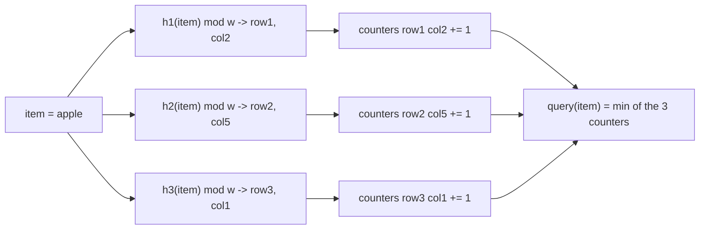

# Probabilistic Data Structures — Trading Certainty for Space

Every structure in this file answers a question exactly wrong, on purpose. A hash set gives you exact set membership by storing every element; a hash map gives you an exact per-key count by storing a counter per key; an exact distinct-item count needs memory proportional to the number of distinct items, full stop — there's no way around it if the answer has to be exact. The three structures below all make the same trade: give up an exact answer for a *probably-close* one, in exchange for memory that's orders of magnitude smaller, often a small, fixed size regardless of how much data flows through it. The error isn't a bug you tolerate — it's a knob you tune. More memory buys a predictably lower error rate; that relationship is the entire design space these structures live in.

<div class="quiz-progress" data-quiz-progress>
  <span class="quiz-progress-label">0/0 checks</span>
  <span class="quiz-progress-bar"><span class="quiz-progress-fill"></span></span>
</div>

---

## 1. Bloom Filter — Quick Recap

A Bloom filter answers one question — "have I seen this before?" — using a bit array and k hash functions instead of storing the actual items. Insert sets k bits per item; a membership check reads those same k bits back. It can never produce a false negative (a standard Bloom filter never clears a bit once set), but it can produce a false positive when other items' insertions happen to set all k of a never-inserted item's bit positions purely by coincidence. The false-positive rate is fully tunable via the ratio of bit-array size to expected item count (m/n) and the number of hash functions (k) — more bits and the right k push the false-positive rate arbitrarily low, at the cost of more memory.

The full false-positive-rate derivation, a from-scratch double-hashing implementation in Go/Python/Java with tests, and a live 16-bit array simulator you can insert into and search against already exist in [coding-practice/bloom-filter.md](../coding-practice/bloom-filter.md) — this file won't re-derive any of it. It's recapped here only as the baseline the next two structures build on: all three trade exactness for space, but each one trades away a *different* kind of exactness (membership, cardinality, frequency).

---

## 2. HyperLogLog — Counting Distinct Items in Fixed Memory

### The Problem: Cardinality at Scale

Counting *exact* cardinality — "how many distinct items have I seen" — needs, in the worst case, memory proportional to n: a hash set holding every distinct value encountered so far, because the only way to know an item is new is to check whether it's already in there. At the scale infra engineers actually operate at (unique visitors to a site per day, distinct IPs hitting an endpoint, distinct user IDs across a billions-of-events stream), that hash set can be gigabytes — and most of what it stores, you'll never query again individually. You don't need to know *which* items you've seen; you only need to know *how many distinct ones*.

HyperLogLog (HLL) estimates cardinality using a fixed, tiny amount of memory — a few KB — regardless of whether you're counting thousands of items or billions. The catch: the answer is an estimate, with a small, tunable error rate — typically ~1-2% for realistic register counts. You trade an exact count for one that's off by roughly one or two percent, in exchange for memory that stops growing with n entirely.

### The Core Trick: Leading Zeros as a Rarity Signal

Here's the naive version of the idea, before HLL's actual optimization. Hash every item with a good hash function, so its output bits look uniformly random. Look at the position of the leftmost 1-bit in that hash — equivalently, count the leading zero bits before it. A hash with, say, 10 leading zeros before its first 1 is rare: for a uniformly random hash, the probability of that specific prefix is 2⁻¹⁰, about 1 in 1024. Track the *maximum* leading-zero-count seen across every item hashed so far.

The intuition: the more distinct items you hash, the more chances you've had to see a genuinely rare one. Hash only a handful of items and seeing 10 leading zeros would be a real coincidence. Hash a million and it's expected — you've had a million chances to roll a rare outcome. That running maximum, call it R, gives a rough cardinality estimate: n ≈ 2^R. It's a real signal, but on its own it's extremely noisy — one unusually lucky (or unlucky) hash swings the whole estimate by a factor of 2.

### From One Counter to Many: Buckets and the Harmonic Mean

HLL's actual contribution is splitting that single noisy counter into many independent ones and combining them in a way that cancels out the noise. Instead of one global "max leading zeros," HLL carves each hash into two pieces: the first p bits pick one of m = 2^p **registers** (buckets), and the remaining bits are what the leading-zero count is computed from. Every item still only ever updates one register — whichever one its hash happens to select — and that register tracks the max leading-zero-count of every item ever routed to it, exactly like the naive single-counter version, just running independently m times in parallel.

The variance reduction here isn't magic — it's the same reason polling 1,000 people gives a tighter estimate than polling 1: independent samples average out their individual noise. But HLL doesn't take a plain arithmetic mean across the m registers — it uses a **harmonic mean**, because a single register that happened to see one hash with an unusually large leading-zero-count would badly skew an arithmetic mean (that one outsized 2^R term dominates the sum). A harmonic mean, built from 2⁻ᴿ terms summed and then inverted, is far less sensitive to that kind of single-register outlier — one huge R contributes an infinitesimally small 2⁻ᴿ to the sum instead of dominating it. The full estimator, with a bias-correction constant α<sub>m</sub> tuned per register count:

```
estimate = α_m * m² / Σ(2^-R_j)     for registers j = 1..m
```

More registers means more independent samples smoothed together, which means lower variance — that's the entire mechanism behind HLL's headline property: standard error is a fixed function of m alone (≈ 1.04/√m), completely independent of n.

<div class="quiz-card">
  <p class="quiz-q">A HyperLogLog sketch uses the exact same fixed number of bytes whether you feed it 100 items or 100 billion. What actually stops the estimate from collapsing or blowing up as n grows, given the structure itself never gets any bigger?</p>
  <button class="quiz-reveal">Reveal answer</button>
  <div class="quiz-a" hidden>Each of the m registers tracks a <em>max</em>, not a count — an already-large register value doesn't shrink, and a fresh flood of new items just keeps updating whichever register their hash happens to select. Growing n increases the number of items feeding the same fixed set of registers, not the number of registers themselves; the harmonic-mean formula converts those m running maxima into a cardinality estimate at read time regardless of how many increments produced them. Nothing about the structure is "storing" every item — it's smoothing per-bucket noise across a fixed set of counters, and that smoothing works identically at n=100 and n=100 billion.</div>
</div>

<div class="quiz-card">
  <p class="quiz-q">HyperLogLog's standard error is expressed as a fixed <em>percentage</em> (≈ 1.04/√m) rather than a fixed absolute count of items. Why a percentage, and why does it depend only on m?</p>
  <button class="quiz-reveal">Reveal answer</button>
  <div class="quiz-a" hidden>The error comes from how noisy the harmonic mean of m independent leading-zero maxima is — a property of the estimation technique and register count alone, not of how many items were actually inserted. More independent registers being averaged means less relative noise, the same way polling more people tightens a percentage estimate rather than an absolute headcount. That relative-noise-only-depends-on-sample-count relationship is exactly why the error shows up as a fixed percentage that applies whether the true cardinality is 100 or 100 billion, not a fixed number of items you're off by.</div>
</div>

### Redis: PFADD / PFCOUNT / PFMERGE

Redis's `PFADD`, `PFCOUNT`, and `PFMERGE` commands are a direct, production HyperLogLog implementation, not just an analogy. `PFADD key item` hashes the item and updates the sketch's registers exactly as described above; `PFCOUNT key` runs the harmonic-mean estimator; `PFMERGE dest src1 src2 ...` combines multiple sketches into one by taking the per-register maximum across all of them (see the merge follow-up at the bottom of this file for why that's exactly correct, not just a convenient hack). Every Redis HLL key costs a fixed 12 KB regardless of cardinality, with a documented standard error of ~0.81% — Redis uses far more registers than this file's demo below (16,384, i.e. p=14) specifically to push that error down close to sub-1%. See [databases/redis-internals.md](../databases/redis-internals.md#data-structures-under-the-hood) for how Redis's other core data structures (hash tables, skip lists, etc.) are implemented under the hood — HyperLogLog isn't covered there; this file is the deeper treatment of it.

### Try It Yourself: Live HyperLogLog

The demo below is a real HyperLogLog — the same hash-into-registers, track-max-leading-zeros, harmonic-mean-estimate mechanism described above — just running against 64 registers instead of Redis's 16,384, so every register fits on screen. Standard error at 64 registers is ~13% (noticeably worse than Redis's ~0.81% at 16,384 — exactly the SE ≈ 1.04/√m relationship above in action; this demo deliberately trades accuracy for visibility). Insert a few items by hand to watch individual registers update, then use "Insert 100 random items" to watch the estimate converge as more independent samples smooth out the noise. "Show True Count" reveals a count kept only for this demo's own verification — tracking every distinct item is exactly what a real HyperLogLog never does, which is the entire point of using one.

<div class="structure-viz" id="hll-live-viz">
  <svg class="viz-canvas" viewBox="0 0 532 542"></svg>
  <div class="viz-controls">
    <input class="viz-input" type="text" placeholder="item" />
    <button class="viz-btn" data-viz-action="insert">Insert</button>
    <button class="viz-btn" data-viz-action="batch">Insert 100 random items</button>
    <button class="viz-btn" data-viz-action="reveal">Show True Count</button>
    <button class="viz-btn viz-btn-danger" data-viz-action="reset">Reset</button>
  </div>
  <div class="viz-status"></div>
  <div class="viz-legend">
    <span><span class="viz-swatch" style="background:#1e3a8a"></span> register has a nonzero max</span>
    <span><span class="viz-swatch" style="background:#14532d"></span> touched by the last insert</span>
  </div>
</div>

<script>
(function () {
  const svgNS = 'http://www.w3.org/2000/svg';
  const root0 = document.getElementById('hll-live-viz');
  const svg = root0.querySelector('.viz-canvas');
  const input = root0.querySelector('.viz-input');
  const status = root0.querySelector('.viz-status');

  // 64 registers -- real Redis HLL uses 16384 (p=14); this is a small,
  // fully-on-screen stand-in that runs the exact same algorithm.
  const M = 64;
  const P = Math.log2(M);
  const REMAINING_BITS = 32 - P;
  const COLS = 8, ROWS = M / COLS, CELL = 64;

  let registers, seen, trueCount, showTrue, highlightSet, flashTimer;

  function reset() {
    registers = new Array(M).fill(0);
    seen = new Set(); // demo-only bookkeeping for the "true" cardinality --
    // a real HyperLogLog never keeps this, that's the entire point of it.
    trueCount = 0;
    showTrue = false;
    highlightSet = new Set();
  }

  function fnv1a(str) {
    let h = 0x811c9dc5;
    for (let i = 0; i < str.length; i++) {
      h ^= str.charCodeAt(i);
      h = Math.imul(h, 0x01000193);
    }
    return h >>> 0;
  }

  // Murmur3 finalizer -- remixes bits so the hash's top bits (register
  // index) and bottom bits (leading-zero rank) are both well distributed.
  function fmix32(hIn) {
    let h = hIn;
    h ^= h >>> 16;
    h = Math.imul(h, 0x85ebca6b);
    h ^= h >>> 13;
    h = Math.imul(h, 0xc2b2ae35);
    h ^= h >>> 16;
    return h >>> 0;
  }

  function hash32(str) { return fmix32(fnv1a(str)); }

  function leadingZeroCount(value, width) {
    if (value === 0) return width;
    let count = 0;
    for (let bit = width - 1; bit >= 0; bit--) {
      if ((value >>> bit) & 1) break;
      count++;
    }
    return count;
  }

  function alphaFor(m) {
    if (m === 16) return 0.673;
    if (m === 32) return 0.697;
    if (m === 64) return 0.709;
    return 0.7213 / (1 + 1.079 / m);
  }

  function addItem(item) {
    const h = hash32(item);
    const index = h >>> REMAINING_BITS;
    const mask = (1 << REMAINING_BITS) - 1;
    const w = h & mask;
    const rank = leadingZeroCount(w, REMAINING_BITS) + 1;
    const isNewMax = rank > registers[index];
    if (isNewMax) registers[index] = rank;
    return { index, rank, isNewMax };
  }

  function estimate() {
    let sum = 0, zeros = 0;
    for (let j = 0; j < M; j++) {
      sum += Math.pow(2, -registers[j]);
      if (registers[j] === 0) zeros++;
    }
    let E = (alphaFor(M) * M * M) / sum;
    if (E <= 2.5 * M && zeros > 0) E = M * Math.log(M / zeros); // small-range (linear counting) correction
    return E;
  }

  function trueCountSuffix() {
    return showTrue ? ` True count: ${trueCount} (revealed).` : '';
  }

  function setStatus(msg, kind) {
    status.textContent = msg;
    status.className = 'viz-status' + (kind === 'ok' ? ' viz-status-ok' : kind === 'error' ? ' viz-status-error' : '');
  }

  function el(tag, attrs) {
    const e = document.createElementNS(svgNS, tag);
    for (const k in attrs) e.setAttribute(k, attrs[k]);
    return e;
  }

  function scheduleFlashClear() {
    clearTimeout(flashTimer);
    flashTimer = setTimeout(() => { highlightSet = new Set(); draw(); }, 2200);
  }

  function draw() {
    svg.setAttribute('viewBox', `0 0 ${COLS * CELL + 20} ${ROWS * CELL + 20}`);
    while (svg.firstChild) svg.removeChild(svg.firstChild);
    for (let idx = 0; idx < M; idx++) {
      const r = Math.floor(idx / COLS), c = idx % COLS;
      const x = 10 + c * CELL, y = 10 + r * CELL;
      let cls = registers[idx] === 0 ? 'viz-edge' : 'viz-node';
      if (highlightSet.has(idx)) cls = 'viz-node-new';
      svg.appendChild(el('rect', { x, y, width: CELL - 8, height: CELL - 8, rx: 5, class: cls }));
      const t = el('text', { x: x + (CELL - 8) / 2, y: y + (CELL - 8) / 2 - 4 });
      t.textContent = registers[idx];
      svg.appendChild(t);
      const idxLabel = el('text', { x: x + (CELL - 8) / 2, y: y + (CELL - 8) / 2 + 14, class: 'viz-label-dim' });
      idxLabel.textContent = idx;
      svg.appendChild(idxLabel);
    }
  }

  root0.querySelector('[data-viz-action="insert"]').addEventListener('click', () => {
    const w = input.value.trim();
    if (!w) { setStatus('Enter an item first.', 'error'); return; }
    const isNewDistinct = !seen.has(w);
    seen.add(w);
    if (isNewDistinct) trueCount++;
    const { index, rank, isNewMax } = addItem(w);
    highlightSet = new Set([index]);
    input.value = '';
    const est = estimate();
    const maxMsg = isNewMax
      ? `register ${index}'s max leading-zero rank is now ${rank}.`
      : `register ${index} already had a max of ${registers[index]} (>= this item's rank of ${rank}), so nothing changed.`;
    setStatus(`Hashed "${w}" -> register ${index}, rank ${rank}. ${maxMsg} Live estimate: ${est.toFixed(1)}.${trueCountSuffix()}`, 'ok');
    draw();
    scheduleFlashClear();
  });

  root0.querySelector('[data-viz-action="batch"]').addEventListener('click', () => {
    const touched = new Set();
    for (let i = 0; i < 100; i++) {
      const w = `rand-${Math.random().toString(36).slice(2, 10)}-${Date.now()}-${i}`;
      const isNewDistinct = !seen.has(w);
      seen.add(w);
      if (isNewDistinct) trueCount++;
      const { index } = addItem(w);
      touched.add(index);
    }
    highlightSet = touched;
    const est = estimate();
    setStatus(`Inserted 100 random items (all distinct by construction). Live estimate: ${est.toFixed(1)}.${trueCountSuffix()}`, 'ok');
    draw();
    scheduleFlashClear();
  });

  root0.querySelector('[data-viz-action="reveal"]').addEventListener('click', () => {
    showTrue = true;
    const est = estimate();
    const err = trueCount > 0 ? Math.abs(est - trueCount) / trueCount * 100 : 0;
    const se = (1.04 / Math.sqrt(M) * 100).toFixed(1);
    setStatus(`True count: ${trueCount} (tracked here only for teaching -- a real HyperLogLog never stores this). Live estimate: ${est.toFixed(1)}, ${err.toFixed(1)}% off. Standard error for ${M} registers is ~${se}%.`, 'ok');
    draw();
  });

  root0.querySelector('[data-viz-action="reset"]').addEventListener('click', () => {
    reset();
    setStatus(`Reset -- empty ${M}-register array, all registers at 0.`, '');
    draw();
  });

  reset();
  setStatus(`Empty ${M}-register array. Insert an item, or jump straight to "Insert 100 random items" to see the estimate converge.`, '');
  draw();
})();
</script>

---

## 3. Count-Min Sketch — Estimating Frequency in a Stream

### The Problem

A different but related question: not "have I seen this key" (membership) or "how many distinct keys" (cardinality), but "how many times has this specific key occurred" — counting page views per URL, requests per API key, occurrences of a word across a text stream — at a scale where an exact per-key counter (a hash map) costs too much memory. If the key space is enormous (every URL ever requested, every user ID, every source IP) but an approximate frequency is good enough, a hash map's guaranteed-exact answer isn't worth what it costs to store.

### The Mechanism

A Count-Min Sketch (CMS) is a 2D array of counters: **d rows by w columns**, paired with **d independent hash functions**, one per row.

- **Increment(item):** for each of the d rows, hash the item with that row's hash function to pick a column, and increment the counter at `[row][column]`. One item touches exactly d counters — one per row, possibly the same column number in different rows by coincidence, but never two counters in the same row.
- **Query(item):** hash the item the same d ways to land on the same d cells, and return the **minimum** of those d counter values — not the sum, not the average.



That minimum is the entire trick. Each row is a smaller hash table sharing its w columns among however many distinct keys actually flow through the sketch, so any single row's counter for a given item is likely inflated by hash collisions with unrelated keys that happened to land in the same column in that row. But a collision in one row is independent of a collision in another row (different hash function, different column landing) — so it's unlikely that *every* row's cell for this item is equally polluted by unrelated traffic. Taking the minimum across rows picks whichever row happened to have the least collision noise for this specific item, which is the tightest, closest-to-true estimate available from the d numbers on hand.

### Key Property: Count-Min Sketch Never Undercounts

This gives CMS a property with no HyperLogLog equivalent: **it can only overestimate, never underestimate.** Every counter only ever goes up (on Increment); a query's minimum across d cells can be inflated above the true count by collisions, but it can never land *below* the true count, because even the least-collided row still recorded at least the item's real increments plus whatever (non-negative) collision noise landed on top. Contrast this directly with HyperLogLog, where error is roughly symmetric — an HLL estimate is just as likely to land a bit above the true cardinality as a bit below it. CMS's error is one-directional by construction, which matters for anything downstream that treats the sketch's number as a safe upper bound ("this key is at most this busy") rather than a two-sided approximation.

<div class="quiz-card">
  <p class="quiz-q">Why does taking the minimum across the d rows reduce error, instead of taking the maximum or an average?</p>
  <button class="quiz-reveal">Reveal answer</button>
  <div class="quiz-a" hidden>Any single row's counter for an item can only be inflated above the true count by hash collisions with other keys sharing that row's column — never deflated below it. The maximum would deliberately pick out whichever row happened to have the <em>worst</em> collision noise, guaranteeing the largest possible overestimate. An average would blend in an accurate-ish row with inflated ones, still dragging the result upward. The minimum instead picks whichever row's hash function happened, for this specific item, to avoid a bad collision — since the d hash functions are independent, at least one row is likely to be close to the true count, and the minimum is the only one of the three choices that actually seeks out that best case instead of averaging it away or picking the worst one outright.</div>
</div>

### Walking Through an Increment and a Query

A concrete trace on a tiny sketch (d=3 rows, w=8 columns) makes the collision-and-minimum mechanism concrete: increment `"apple"`, increment `"banana"` (which collides with apple in row 1), query `"apple"` back correctly despite that collision, then query `"cherry"` — never inserted — and watch it come back with a nonzero count purely from collisions, never a negative or "impossible" one.

<div class="stepper">
  <div class="stepper-panels">
    <div class="stepper-panel active">
      <strong>1. Start: empty 3x8 grid.</strong> All counters at 0, one row per hash function.
      <pre><code>          col0 col1 col2 col3 col4 col5 col6 col7
row1 (h1)    0    0    0    0    0    0    0    0
row2 (h2)    0    0    0    0    0    0    0    0
row3 (h3)    0    0    0    0    0    0    0    0</code></pre>
    </div>
    <div class="stepper-panel">
      <strong>2. Increment "apple".</strong> h1 -&gt; col2, h2 -&gt; col5, h3 -&gt; col1. Each of those 3 cells goes from 0 to 1.
      <pre><code>          col0 col1 col2 col3 col4 col5 col6 col7
row1 (h1)    0    0    1    0    0    0    0    0
row2 (h2)    0    0    0    0    0    1    0    0
row3 (h3)    0    1    0    0    0    0    0    0</code></pre>
    </div>
    <div class="stepper-panel">
      <strong>3. Increment "banana".</strong> h1 -&gt; col2 (a collision with apple's row-1 cell!), h2 -&gt; col7, h3 -&gt; col4. Row 1 col 2 becomes 2 -- one silent collision, invisible from the counter alone.
      <pre><code>          col0 col1 col2 col3 col4 col5 col6 col7
row1 (h1)    0    0    2    0    0    0    0    0
row2 (h2)    0    0    0    0    0    1    0    1
row3 (h3)    0    1    0    0    1    0    0    0</code></pre>
    </div>
    <div class="stepper-panel">
      <strong>4. Query "apple" -&gt; correct despite the collision.</strong> Rehash "apple" the same 3 ways: row1 col2 = 2, row2 col5 = 1, row3 col1 = 1. <code>min(2, 1, 1) = 1</code> -- the true count, even though row 1's own cell was inflated to 2 by banana's collision. Rows 2 and 3 never collided for apple, and the minimum found them.
      <pre><code>          col0 col1 col2 col3 col4 col5 col6 col7
row1 (h1)    0    0  [2]   0    0    0    0    0
row2 (h2)    0    0    0    0    0  [1]   0    1
row3 (h3)    0  [1]   0    0    1    0    0    0</code></pre>
    </div>
    <div class="stepper-panel">
      <strong>5. Query "cherry" (never inserted) -&gt; guaranteed overestimate, never negative.</strong> Cherry's own hash happens to land on row1 col2 (=2), row2 col5 (=1), row3 col4 (=1). <code>min(2, 1, 1) = 1</code> -- cherry reads back as having occurred once, purely from unrelated collisions, even though its true count is 0. Note the direction of the error: 1, not 0 and never a negative number -- exactly the "can only overestimate" property from above.
      <pre><code>          col0 col1 col2 col3 col4 col5 col6 col7
row1 (h1)    0    0  [2]   0    0    0    0    0
row2 (h2)    0    0    0    0    0  [1]   0    1
row3 (h3)    0    1    0    0  [1]   0    0    0</code></pre>
    </div>
  </div>
  <div class="stepper-controls">
    <button class="stepper-prev">← Prev</button>
    <span class="stepper-dots"></span>
    <span class="stepper-label"></span>
    <button class="stepper-next">Next →</button>
  </div>
</div>

---

## Interview Follow-Ups

**"Why not just use a real hash set or hash map if you have the memory?"** Sometimes you do, and then you should — an exact structure's exact answer is strictly better whenever it comfortably fits in memory. These structures earn their keep specifically at the scale where the exact version doesn't fit: billions of distinct items for cardinality, an enormous key space for per-key frequency. The trade only makes sense once the exact structure's memory cost is the actual problem, not a hypothetical one.

**"Can you merge two HyperLogLog sketches computed on different machines into one combined-cardinality estimate?"** Yes — this is exactly what Redis's `PFMERGE` does. Because each register just tracks a running maximum, and max is associative and commutative, merging two sketches is a per-register max across both of them. The merged sketch is indistinguishable from one that had directly seen every item from both machines — no re-hashing or access to the original raw data required, which is what makes HLL genuinely useful for distributed counting (e.g. combining per-shard unique-visitor sketches into a global one).

**"Does a Count-Min Sketch ever need to 'forget' old data, e.g. for a sliding-window rate estimate?"** Yes — since counters only ever increase, a raw CMS accumulates forever and eventually stops reflecting anything "recent." Real systems use time-decayed or windowed variants (periodically halving all counters, or keeping several sketches per time bucket and querying only the relevant ones) to keep the frequency estimate meaningful over a moving window — worth a one-sentence acknowledgment in an interview, though the decay mechanics are a separate topic from the core structure covered here.

**"Which of these three would you reach for: deduplicating events in a stream, estimating unique users, or rate-limiting by approximate frequency?"** Bloom filter for "have I seen this exact event ID" (membership, not counting); HyperLogLog for "how many distinct users" (cardinality, not membership or frequency); Count-Min Sketch for "how many times has this key occurred" (frequency, not membership or distinct-count). The three answer genuinely different questions, and reaching for the wrong one — like sizing an exact hash set when all you actually needed was approximate cardinality — is exactly where memory budgets blow up in practice.
