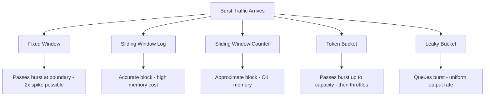

# Rate Limiting

Algorithms, distributed implementations, and production patterns.

---

## Why Rate Limiting

| Goal | Example |
|------|---------|
| DDoS protection | Block 10k req/s from single IP |
| Cost control | Prevent runaway API billing |
| Fairness | Stop one tenant from starving others |
| SLA enforcement | Guarantee 99th percentile latency |

---

## Algorithms

### 1. Fixed Window Counter

Divide time into fixed windows (e.g., 1-minute buckets). Count requests per window. Reject when count exceeds limit.

**Burst problem:** A client can send 2x the limit across a window boundary.

```
Window 1 [00:00–01:00]       Window 2 [01:00–02:00]
|████████████ 100 req|████████████ 100 req|
                     ^
              200 req in 2 seconds around boundary
```

```
key = "ratelimit:{user}:{minute}"
INCR key
EXPIRE key 60
```

Simple but flawed for burst-sensitive APIs.

---

### 2. Sliding Window Log

Store timestamp of every request. On each request:
1. Remove timestamps older than `now - window`
2. Count remaining entries
3. Reject if count >= limit, else add `now`

**Accurate** — no boundary burst. **Memory heavy** — stores every timestamp per user.

At 1000 req/min × 1M users = 1B entries in memory.

---

### 3. Sliding Window Counter (Hybrid)

Approximate sliding window using two fixed-window counters.

```
prev_window_count = 80
curr_window_count = 30
elapsed_in_current = 0.4  # 40% into current window

estimated = curr_window_count + prev_window_count * (1 - elapsed_in_current)
          = 30 + 80 * 0.6
          = 78
```

**Good enough:** error rate < 0.1% under real traffic distributions. Memory: O(1) per user.

---

### 4. Token Bucket

- Bucket holds up to `capacity` tokens
- Tokens refill at fixed `rate` (tokens/sec)
- Each request consumes 1 token; reject if bucket empty
- **Burst-friendly:** allows short bursts up to `capacity`

AWS API Gateway uses token bucket — `burst` is bucket size, `rate` is refill rate.

---

### 5. Leaky Bucket

Requests enter a queue; drain at fixed rate regardless of input rate.

- Smooths bursty traffic into uniform output
- Queue full → drop request
- Used by **nginx `limit_req`**

Differences from token bucket: token bucket allows bursts through; leaky bucket shapes them.

---

## Algorithm Comparison



---

## Redis Implementations

### Sliding Window Counter (Lua)

Atomic read-update-expiry in a single script — no race conditions.

```lua
-- KEYS[1] = current window key, KEYS[2] = prev window key
-- ARGV[1] = limit, ARGV[2] = elapsed_fraction (0.0–1.0), ARGV[3] = window_seconds

local curr = tonumber(redis.call('GET', KEYS[1])) or 0
local prev = tonumber(redis.call('GET', KEYS[2])) or 0
local limit = tonumber(ARGV[1])
local weight = 1 - tonumber(ARGV[2])
local estimated = curr + prev * weight

if estimated >= limit then
    return 0  -- rejected
end

redis.call('INCR', KEYS[1])
redis.call('EXPIRE', KEYS[1], tonumber(ARGV[3]) * 2)
return 1  -- allowed
```

```python
window = int(time.time() // 60)
curr_key = f"ratelimit:{user_id}:{window}"
prev_key = f"ratelimit:{user_id}:{window - 1}"
elapsed  = (time.time() % 60) / 60  # fraction into current window

allowed = redis.evalsha(sha, 2, curr_key, prev_key, LIMIT, elapsed, 60)
```

---

### Token Bucket (MULTI/EXEC)

```python
def is_allowed(redis, user_id, capacity, rate):
    key = f"tokenbucket:{user_id}"
    now = time.time()

    with redis.pipeline() as pipe:
        while True:
            try:
                pipe.watch(key)
                data = pipe.hgetall(key)
                tokens   = float(data.get(b'tokens', capacity))
                last_ref = float(data.get(b'last',   now))

                # refill
                elapsed = now - last_ref
                tokens  = min(capacity, tokens + elapsed * rate)

                if tokens < 1:
                    pipe.unwatch()
                    return False

                pipe.multi()
                pipe.hset(key, mapping={'tokens': tokens - 1, 'last': now})
                pipe.expire(key, int(capacity / rate) + 10)
                pipe.execute()
                return True
            except redis.WatchError:
                continue  # retry on concurrent modification
```

---

## Distributed Rate Limiting

### The Problem

```
Client ──► API Server 1 ──┐
Client ──► API Server 2 ──┼──► Each server has local counter
Client ──► API Server 3 ──┘    No coordination = 3x the limit passes
```

### Solution: Central Redis Counter

```
Client ──► API Server 1 ──┐
Client ──► API Server 2 ──┼──► Redis Cluster (central counter)
Client ──► API Server 3 ──┘
```

**Race condition without atomicity:**
```
Server1: GET tokens → 1
Server2: GET tokens → 1        # both see 1, both allow
Server1: SET tokens 0
Server2: SET tokens 0          # 2 requests pass instead of 1
```

Fix: use Lua scripts (atomic) or Redis `INCR` + TTL pattern.

### Redis Cluster Sharding

Route each rate limit key to a consistent shard:

```
hash_slot = CRC16("ratelimit:{user_id}") % 16384
```

`{}` in the key forces Redis Cluster to hash only the bracketed part — all keys for a user land on the same slot, enabling Lua scripts across those keys.

---

## Rate Limit Headers

```http
HTTP/1.1 200 OK
X-RateLimit-Limit: 100
X-RateLimit-Remaining: 42
X-RateLimit-Reset: 1719640800
```

```http
HTTP/1.1 429 Too Many Requests
Retry-After: 30
X-RateLimit-Limit: 100
X-RateLimit-Remaining: 0
X-RateLimit-Reset: 1719640800
```

| Header | Value |
|--------|-------|
| `X-RateLimit-Limit` | Max requests in window |
| `X-RateLimit-Remaining` | Requests left in current window |
| `X-RateLimit-Reset` | Unix timestamp when window resets |
| `Retry-After` | Seconds until client may retry (RFC 7231) |

---

## nginx Rate Limiting

```nginx
http {
    # define shared memory zone: 10MB stores ~160k IPs
    limit_req_zone $binary_remote_addr zone=api:10m rate=10r/s;

    server {
        location /api/ {
            # burst=20: allow queue of 20 extra requests
            # nodelay: serve burst immediately (no artificial delay)
            limit_req zone=api burst=20 nodelay;
            limit_req_status 429;
        }
    }
}
```

Without `nodelay`, nginx delays burst requests to smooth them to the rate — effectively a leaky bucket. With `nodelay`, burst requests pass immediately (token bucket behavior).

---

## AWS API Gateway Throttling

```
Account limit:    10,000 req/s  (hard ceiling across all APIs)
Stage limit:       1,000 req/s  (per deployment stage)
Method limit:        100 req/s  (per route override)
```

**Usage Plans** — attach to API keys for per-customer limits:

```
Usage Plan "free-tier":
  rate:  10 req/s
  burst: 50          # token bucket capacity
  quota: 10,000/day
```

- `rate` = token refill rate
- `burst` = bucket capacity (short spike allowed)
- `quota` = daily hard limit

Exceeds rate/burst → `429 Too Many Requests`
Exceeds quota → `429 Limit Exceeded`

---

## Rate Limiting Strategies

| Strategy | Key | Use Case |
|----------|-----|----------|
| Per-user | `ratelimit:user:{user_id}` | Authenticated API |
| Per-IP | `ratelimit:ip:{ip}` | Public endpoints, unauthenticated |
| Per-API-key | `ratelimit:key:{api_key}` | B2B / partner APIs |
| Per-endpoint | `ratelimit:{user}:{route}` | Expensive endpoints (search, export) |
| Global | `ratelimit:global` | System-wide DDoS protection |

Combine: per-IP at edge (nginx/CDN) + per-user in app layer + per-endpoint for expensive routes.

---

## Graceful Degradation

### Reject vs Queue

| | Reject (fail fast) | Queue |
|-|--------------------|-------|
| Latency | Low | Higher |
| Client UX | Gets 429 immediately | May wait and succeed |
| Server load | Bounded | Can grow unbounded |
| Use case | Stateless API | Background jobs, webhooks |

### Priority Queues for Premium Users

```
                    ┌─── Premium queue (capacity: 500) ──► Workers
Incoming requests ──┤
                    └─── Standard queue (capacity: 100) ──► Workers
```

```python
def enqueue(request):
    plan = get_user_plan(request.user_id)
    queue = "queue:premium" if plan == "premium" else "queue:standard"

    if redis.llen(queue) >= QUEUE_LIMITS[plan]:
        return 429  # queue full, reject

    redis.rpush(queue, serialize(request))
    return 202  # accepted
```

Workers drain premium queue first; fall through to standard when idle.

### Shedding Strategy

```
load < 70%  → allow all
load 70–90% → drop standard tier, allow premium
load > 90%  → drop all non-critical, return 503
```

---

## Quick Reference

| Algorithm | Memory | Burst | Accuracy | Best For |
|-----------|--------|-------|----------|----------|
| Fixed window | O(1) | Yes (boundary) | Low | Simple counters |
| Sliding window log | O(n) | No | Exact | Audit logs |
| Sliding window counter | O(1) | Partial | ~99.9% | General API limiting |
| Token bucket | O(1) | Yes (controlled) | High | API gateways |
| Leaky bucket | O(queue) | No (smoothed) | High | Traffic shaping |
