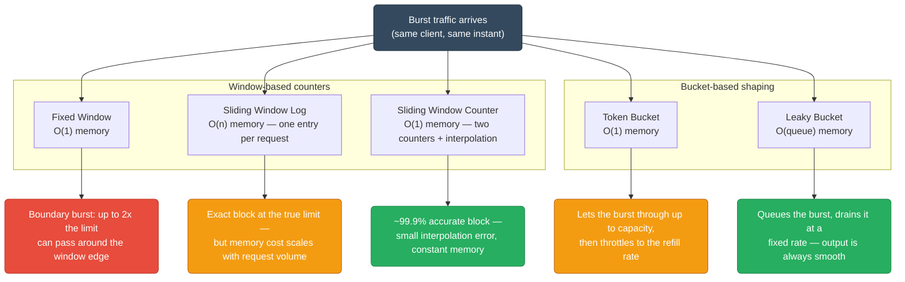
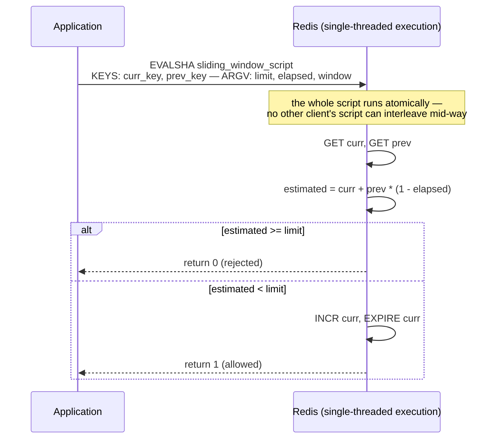
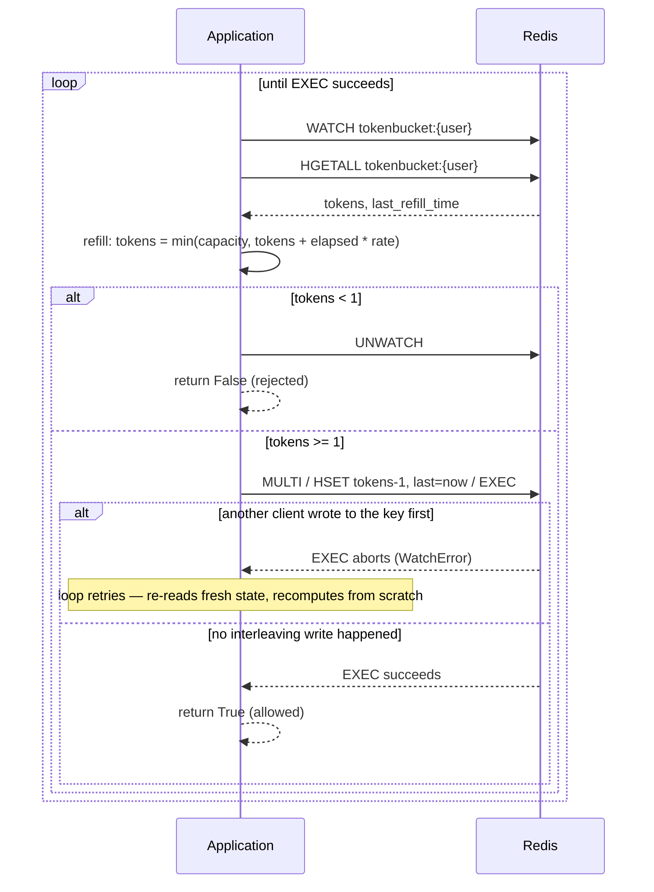
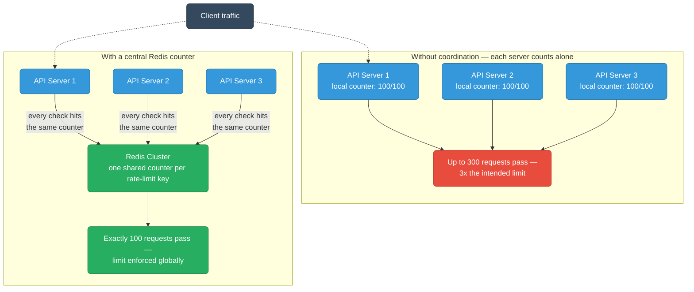
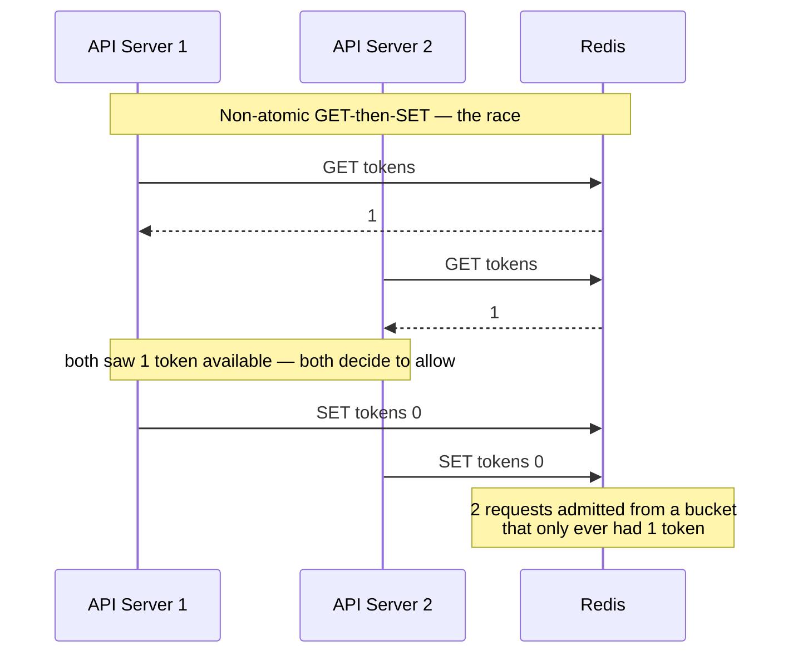
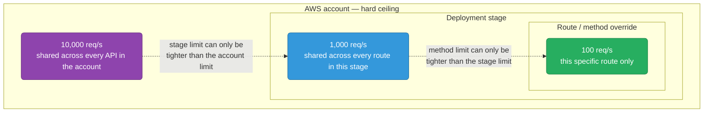
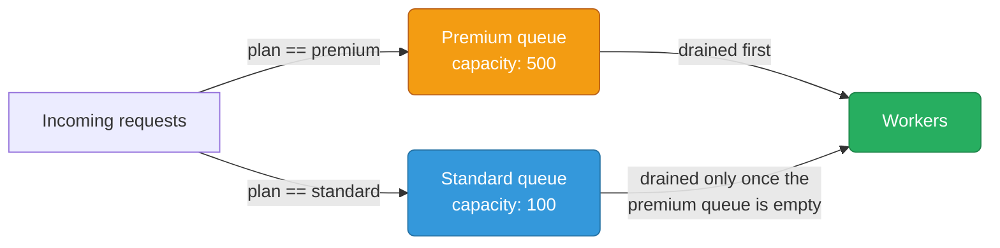

# Rate Limiting

Algorithms, distributed implementations, and production patterns.

<div class="quiz-progress" data-quiz-progress>
  <span class="quiz-progress-label">0/0 checks</span>
  <span class="quiz-progress-bar"><span class="quiz-progress-fill"></span></span>
</div>

---

## Why Rate Limiting

| Goal | Example |
|------|---------|
| DDoS protection | Block 10k req/s from single IP |
| Cost control | Prevent runaway API billing |
| Fairness | Stop one tenant from starving others |
| SLA enforcement | Guarantee 99th percentile latency |

---

## Algorithms

Every rate-limiting algorithm answers the same question — "has this client used up its budget?" — but they disagree on how much memory that costs and how a burst is treated. The first three count requests against a window in time; the last two model a bucket instead of a counter. Fixed Window, Sliding Window, Token Bucket, and Leaky Bucket are the four shapes you'll actually reach for in production — sliding window log and sliding window counter are the accuracy/memory tradeoff inside "sliding window" itself.

<div class="tab-group">
  <div class="tab-buttons">
    <button data-tab="fixed" class="active">Fixed Window</button>
    <button data-tab="sliding">Sliding Window</button>
    <button data-tab="tokenbucket">Token Bucket</button>
    <button data-tab="leakybucket">Leaky Bucket</button>
  </div>
  <div class="tab-panels">
    <div class="tab-panel active" data-tab-panel="fixed">
      <strong>Divide time into fixed windows</strong> (e.g., 1-minute buckets). Count requests per window. Reject once the count exceeds the limit.
      <br/><br/>
      <strong>Burst problem:</strong> a client can send 2x the limit across a window boundary, because each window's counter resets independently of the other — neither window alone looks like a violation.
      <pre><code class="language-mermaid">graph LR
    subgraph W1["Window 1 — 00:00 to 01:00 — 100 requests, limit not exceeded"]
        R1["100 requests, spread across the window"]:::window
    end
    subgraph W2["Window 2 — 01:00 to 02:00 — 100 requests, limit not exceeded"]
        R2["100 requests, spread across the window"]:::window
    end
    B["200 requests inside a 2-second span straddling 01:00 — each window resets independently, so neither one alone looks like a violation"]:::burst
    R1 -->|"last 100 requests of window 1, sent right before 01:00"| B
    R2 -->|"first 100 requests of window 2, sent right after 01:00"| B
    classDef window fill:#3498db,stroke:#2471a3,color:#fff;
    classDef burst fill:#e74c3c,stroke:#c0392b,color:#fff;</code></pre>
      Implementation is just a counter with a TTL:
      <pre><code>key = "ratelimit:{user}:{minute}"
INCR key
EXPIRE key 60</code></pre>
      Simple but flawed for burst-sensitive APIs.
    </div>
    <div class="tab-panel" data-tab-panel="sliding">
      Two variants trade memory for accuracy differently.
      <br/><br/>
      <strong>Sliding Window Log</strong> stores the timestamp of every request. On each request: (1) remove timestamps older than <code>now - window</code>, (2) count what's left, (3) reject if the count is at the limit, else record <code>now</code>. <strong>Accurate</strong> — no boundary burst is possible, since the window itself slides continuously instead of resetting. <strong>Memory heavy</strong> — it stores every timestamp per user; at 1000 req/min × 1M users that's 1B entries live in memory at once.
      <br/><br/>
      <strong>Sliding Window Counter</strong> approximates the same sliding window using two fixed-window counters and a weighted interpolation instead of a full timestamp log:
      <pre><code>prev_window_count = 80
curr_window_count = 30
elapsed_in_current = 0.4  # 40% into current window

estimated = curr_window_count + prev_window_count * (1 - elapsed_in_current)
          = 30 + 80 * 0.6
          = 78</code></pre>
      <strong>Good enough:</strong> error rate stays under 0.1% against real traffic distributions, for O(1) memory per user instead of O(n).
    </div>
    <div class="tab-panel" data-tab-panel="tokenbucket">
      A bucket holds up to <code>capacity</code> tokens. Tokens refill at a fixed <code>rate</code> (tokens/sec). Each request consumes 1 token; reject if the bucket is empty.
      <br/><br/>
      <strong>Burst-friendly:</strong> a client that hasn't sent anything in a while can spend its whole accumulated bucket in one burst — up to <code>capacity</code> requests all at once — then has to wait for tokens to trickle back in at <code>rate</code>.
      <br/><br/>
      <strong>AWS API Gateway uses token bucket</strong> for throttling — <code>burst</code> is the bucket size, <code>rate</code> is the refill rate.
    </div>
    <div class="tab-panel" data-tab-panel="leakybucket">
      Requests enter a queue and drain out at a fixed rate, regardless of how bursty the input rate is.
      <br/><br/>
      Smooths bursty traffic into a uniform output rate. Queue full → drop (or reject) the request. This is what <strong>nginx's <code>limit_req</code></strong> implements by default.
      <br/><br/>
      <strong>Vs. token bucket:</strong> token bucket lets a burst straight through, up to capacity, as fast as the client can send it. Leaky bucket never lets the output rate exceed the configured rate at all — it queues the burst and drains it evenly instead of passing it through.
    </div>
  </div>
</div>

---

## Algorithm Comparison



<div class="quiz-card">
  <p class="quiz-q">Token bucket and leaky bucket both "handle" bursts, but the outcome for the client is opposite. What's the key difference in what actually happens to a burst under each?</p>
  <button class="quiz-reveal">Reveal answer</button>
  <div class="quiz-a" hidden>Token bucket lets the burst through immediately, up to the bucket's capacity, as fast as the client can send it — then throttles once tokens run out. Leaky bucket never passes a burst through at all: it queues the incoming requests and drains them at a fixed rate, smoothing bursty input into a perfectly uniform output regardless of how the requests arrived.</div>
</div>

---

## Redis Implementations

### Sliding Window Counter (Lua)

Atomic read-update-expiry in a single script — no race conditions, because the entire script runs as one indivisible operation on Redis's single-threaded execution.

```lua
-- KEYS[1] = current window key, KEYS[2] = prev window key
-- ARGV[1] = limit, ARGV[2] = elapsed_fraction (0.0–1.0), ARGV[3] = window_seconds

local curr = tonumber(redis.call('GET', KEYS[1])) or 0
local prev = tonumber(redis.call('GET', KEYS[2])) or 0
local limit = tonumber(ARGV[1])
local weight = 1 - tonumber(ARGV[2])
local estimated = curr + prev * weight

if estimated >= limit then
    return 0  -- rejected
end

redis.call('INCR', KEYS[1])
redis.call('EXPIRE', KEYS[1], tonumber(ARGV[3]) * 2)
return 1  -- allowed
```

```python
window = int(time.time() // 60)
curr_key = f"ratelimit:{user_id}:{window}"
prev_key = f"ratelimit:{user_id}:{window - 1}"
elapsed  = (time.time() % 60) / 60  # fraction into current window

allowed = redis.evalsha(sha, 2, curr_key, prev_key, LIMIT, elapsed, 60)
```



---

### Token Bucket (MULTI/EXEC)

```python
def is_allowed(redis, user_id, capacity, rate):
    key = f"tokenbucket:{user_id}"
    now = time.time()

    with redis.pipeline() as pipe:
        while True:
            try:
                pipe.watch(key)
                data = pipe.hgetall(key)
                tokens   = float(data.get(b'tokens', capacity))
                last_ref = float(data.get(b'last',   now))

                # refill
                elapsed = now - last_ref
                tokens  = min(capacity, tokens + elapsed * rate)

                if tokens < 1:
                    pipe.unwatch()
                    return False

                pipe.multi()
                pipe.hset(key, mapping={'tokens': tokens - 1, 'last': now})
                pipe.expire(key, int(capacity / rate) + 10)
                pipe.execute()
                return True
            except redis.WatchError:
                continue  # retry on concurrent modification
```

`WATCH`/`MULTI`/`EXEC` is optimistic concurrency, not a lock: any client is free to read and compute against the key at the same time, and `EXEC` only fails if some other client's write actually landed on the watched key first.



<div class="quiz-card">
  <p class="quiz-q">The Python implementation above retries in a loop on redis.WatchError instead of just catching it and returning False. Why is retrying the correct response, not rejecting the request?</p>
  <button class="quiz-reveal">Reveal answer</button>
  <div class="quiz-a" hidden>A WatchError only means another client modified the key between this client's WATCH and its EXEC — it says nothing about whether this request should actually be allowed or rejected. The comment in the code is explicit about this: "retry on concurrent modification." The correct move is to re-read the now-current state and redo the refill/consume calculation against it, not to treat the conflict itself as a rejection.</div>
</div>

---

## Distributed Rate Limiting

Every API server needs to agree on the same count for the same client — otherwise the limit isn't actually a limit.



### Distributed Rate-Limit Check, Step by Step

<div class="stepper">
  <div class="stepper-panels">
    <div class="stepper-panel active">
      <strong>1. Request arrives at any API server.</strong> The load balancer sends it to Server 1, 2, or 3 with no stickiness — none of them hold rate-limit state locally, so it genuinely doesn't matter which one gets it.
    </div>
    <div class="stepper-panel">
      <strong>2. The server computes the rate-limit key and its Redis Cluster slot.</strong> <code>hash_slot = CRC16("ratelimit:{user_id}") % 16384</code> — the curly braces around the fixed part of the key force Redis Cluster to hash only that portion, so every key belonging to this user lands on the same slot.
    </div>
    <div class="stepper-panel">
      <strong>3. The server calls an atomic Lua script on that one shard.</strong> <code>EVALSHA</code> passes the key(s) as <code>KEYS</code>, so the entire read-check-increment happens inside a single round trip and a single atomic execution on Redis — not split across separate GET/SET calls from the app.
    </div>
    <div class="stepper-panel">
      <strong>4. Redis executes the check and the increment in the same atomic step.</strong> No other client's script — issued from any other API server — can interleave partway through this one.
    </div>
    <div class="stepper-panel">
      <strong>5. The shard returns allow or reject, and that's final.</strong> Every other server checking this same user's key hits the exact same shard and the exact same counter, which is what makes the limit global instead of per-server.
    </div>
  </div>
  <div class="stepper-controls">
    <button class="stepper-prev">← Prev</button>
    <span class="stepper-dots"></span>
    <span class="stepper-label"></span>
    <button class="stepper-next">Next →</button>
  </div>
</div>

### What Breaks Without Atomicity



Fix: use Lua scripts (atomic, as in the stepper above) or Redis's `INCR` + TTL pattern — anything that turns "read, decide, write" into one operation Redis executes without interruption, instead of two separate round trips a second server can slip in between.

### Redis Cluster Sharding

Route each rate limit key to a consistent shard:

```
hash_slot = CRC16("ratelimit:{user_id}") % 16384
```

`{}` in the key forces Redis Cluster to hash only the bracketed part — all keys for a user land on the same slot, enabling Lua scripts across those keys.

<div class="quiz-card">
  <p class="quiz-q">In the GET-then-SET race above, both servers read 1 token and both admitted a request — 2 requests passed from a bucket that only had 1 token. What specifically makes this possible, and what actually closes the gap?</p>
  <button class="quiz-reveal">Reveal answer</button>
  <div class="quiz-a" hidden>GET and SET are two separate round trips to Redis. Between Server 1's GET and its SET, Server 2 gets a chance to run its own GET against the same still-unchanged value — both servers make their allow/reject decision off the same stale read. The fix is collapsing "read, decide, write" into a single atomic operation — a Lua script or an INCR+TTL pattern — so no second server can read a value that's about to become stale mid-decision.</div>
</div>

---

## Rate Limit Headers

```http
HTTP/1.1 200 OK
X-RateLimit-Limit: 100
X-RateLimit-Remaining: 42
X-RateLimit-Reset: 1719640800
```

```http
HTTP/1.1 429 Too Many Requests
Retry-After: 30
X-RateLimit-Limit: 100
X-RateLimit-Remaining: 0
X-RateLimit-Reset: 1719640800
```

| Header | Value |
|--------|-------|
| `X-RateLimit-Limit` | Max requests in window |
| `X-RateLimit-Remaining` | Requests left in current window |
| `X-RateLimit-Reset` | Unix timestamp when window resets |
| `Retry-After` | Seconds until client may retry (RFC 7231) |

---

## nginx Rate Limiting

```nginx
http {
    # define shared memory zone: 10MB stores ~160k IPs
    limit_req_zone $binary_remote_addr zone=api:10m rate=10r/s;

    server {
        location /api/ {
            # burst=20: allow queue of 20 extra requests
            # nodelay: serve burst immediately (no artificial delay)
            limit_req zone=api burst=20 nodelay;
            limit_req_status 429;
        }
    }
}
```

<div class="toggle-switch">
  <div class="toggle-buttons">
    <button data-toggle-opt="delayed" class="active state-warn">Without nodelay</button>
    <button data-toggle-opt="nodelay" class="state-ok">With nodelay</button>
  </div>
  <div class="toggle-panel active" data-toggle-panel="delayed">
    nginx delays burst requests, releasing them at the steady configured rate (<code>10r/s</code> above) instead of all at once — effectively leaky bucket behavior. Higher latency for the queued requests, but the outbound rate to the upstream never spikes above the configured limit.
  </div>
  <div class="toggle-panel" data-toggle-panel="nodelay">
    Burst requests — up to the <code>burst=20</code> allowance — pass through immediately with no artificial delay, effectively token bucket behavior. Only requests beyond the combined rate + burst allowance get a <code>429</code>; nothing in the allowed burst is held back to smooth the rate.
  </div>
</div>

<div class="quiz-card">
  <p class="quiz-q">In <code>limit_req zone=api burst=20 nodelay;</code>, what does removing nodelay actually change about how those 20 burst requests are served?</p>
  <button class="quiz-reveal">Reveal answer</button>
  <div class="quiz-a" hidden>Without nodelay, the 20 burst requests are still accepted, but nginx queues and releases them at the steady configured rate instead of passing them straight through — leaky-bucket smoothing, at the cost of added latency for the queued requests. With nodelay, the same 20 requests are served immediately, and only requests beyond the burst allowance get rejected — token-bucket behavior. Either way, burst=20 defines how many extra requests can exceed the steady rate at all; nodelay only decides whether those extra requests wait or not.</div>
</div>

---

## AWS API Gateway Throttling



**Usage Plans** — attach to API keys for per-customer limits:

```
Usage Plan "free-tier":
  rate:  10 req/s
  burst: 50          # token bucket capacity
  quota: 10,000/day
```

- `rate` = token refill rate
- `burst` = bucket capacity (short spike allowed)
- `quota` = daily hard limit

Exceeds rate/burst → `429 Too Many Requests`
Exceeds quota → `429 Limit Exceeded`

<div class="quiz-card">
  <p class="quiz-q">A usage plan's rate/burst and its daily quota are both enforced with a 429 status. What's the actual difference between the two, and how would you tell them apart?</p>
  <button class="quiz-reveal">Reveal answer</button>
  <div class="quiz-a" hidden>Rate/burst is the short-term token-bucket throttle — exceeding it returns 429 Too Many Requests and the client can succeed again as soon as tokens refill, possibly seconds later. Quota is the daily hard ceiling — exceeding it returns a distinctly worded 429 Limit Exceeded, and no amount of waiting seconds or minutes fixes it; the client is locked out until the daily quota resets. Same status code, different message, different recovery time.</div>
</div>

---

## Rate Limiting Strategies

| Strategy | Key | Use Case |
|----------|-----|----------|
| Per-user | `ratelimit:user:{user_id}` | Authenticated API |
| Per-IP | `ratelimit:ip:{ip}` | Public endpoints, unauthenticated |
| Per-API-key | `ratelimit:key:{api_key}` | B2B / partner APIs |
| Per-endpoint | `ratelimit:{user}:{route}` | Expensive endpoints (search, export) |
| Global | `ratelimit:global` | System-wide DDoS protection |

Combine: per-IP at edge (nginx/CDN) + per-user in app layer + per-endpoint for expensive routes.

<div class="quiz-card">
  <p class="quiz-q">One tenant's export calls are hammering the search index and slowing down every other tenant, but their normal API traffic is fine. Which key from the table above stops just that one route, without also capping the tenant's other requests?</p>
  <button class="quiz-reveal">Reveal answer</button>
  <div class="quiz-a" hidden>Per-endpoint — ratelimit:{user}:{route}. It's scoped to both the user and the specific expensive route, so it can throttle just search/export traffic for that tenant while leaving every other endpoint they call unaffected. A blanket per-user limit would cap all of their traffic, and a global limit would penalize every other tenant too.</div>
</div>

---

## Graceful Degradation

### Reject vs Queue

| | Reject (fail fast) | Queue |
|-|--------------------|-------|
| Latency | Low | Higher |
| Client UX | Gets 429 immediately | May wait and succeed |
| Server load | Bounded | Can grow unbounded |
| Use case | Stateless API | Background jobs, webhooks |

### Priority Queues for Premium Users



```python
def enqueue(request):
    plan = get_user_plan(request.user_id)
    queue = "queue:premium" if plan == "premium" else "queue:standard"

    if redis.llen(queue) >= QUEUE_LIMITS[plan]:
        return 429  # queue full, reject

    redis.rpush(queue, serialize(request))
    return 202  # accepted
```

Workers drain premium queue first; fall through to standard when idle.

<div class="quiz-card">
  <p class="quiz-q">The premium queue has 3 requests waiting. The standard queue has 50. A worker just finished a job and is looking for its next one. Which queue does it pull from?</p>
  <button class="quiz-reveal">Reveal answer</button>
  <div class="quiz-a" hidden>Premium — workers drain the premium queue first and only fall through to standard once premium is empty, regardless of how much longer the standard queue's backlog is. Queue depth on the standard side doesn't earn it priority; plan tier does.</div>
</div>

### Shedding Strategy

| System load | Behavior |
|---|---|
| < 70% | Allow all traffic |
| 70–90% | Drop standard tier, allow premium |
| > 90% | Drop all non-critical, return 503 |

---

## Quick Reference

| Algorithm | Memory | Burst | Accuracy | Best For |
|-----------|--------|-------|----------|----------|
| Fixed window | O(1) | Yes (boundary) | Low | Simple counters |
| Sliding window log | O(n) | No | Exact | Audit logs |
| Sliding window counter | O(1) | Partial | ~99.9% | General API limiting |
| Token bucket | O(1) | Yes (controlled) | High | API gateways |
| Leaky bucket | O(queue) | No (smoothed) | High | Traffic shaping |
