# Real-Time Chat & Messaging Systems

Why request/response breaks down for chat, the transport options that fix it, and everything that gets hard once you scale past one server: connection registries and cross-server relay, delivery guarantees, ordering, presence, multi-device fan-out, group chat at scale, message history, receipts, and offline push. Builds on [async-patterns.md](./async-patterns.md) (pub/sub fan-out, idempotency) and [api-design.md](./api-design.md) (cursor pagination, idempotency keys) rather than re-deriving them.

<div class="quiz-progress" data-quiz-progress>
  <span class="quiz-progress-label">0/0 checks</span>
  <span class="quiz-progress-bar"><span class="quiz-progress-fill"></span></span>
</div>

---

## 1. Why HTTP Request/Response Doesn't Work

HTTP is fundamentally a pull model: the client sends a request, the server sends exactly one response, and the connection's job is done. The server has no channel to say "here's a new message" unless the client asks first — it can't originate a send.

Chat needs the opposite. A message written by User A has to reach User B's screen the instant it's sent, with User B's client never having asked about it. The only way to fake that on top of plain request/response is **polling**: the client re-asks "anything new?" over and over.

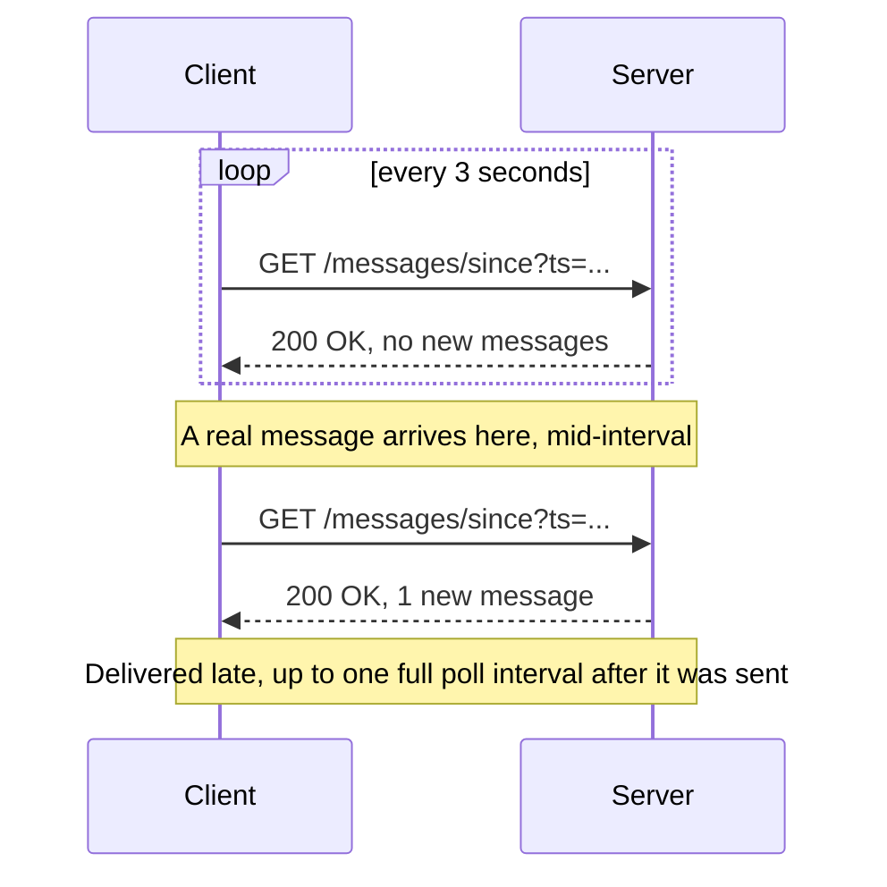

Shorten the interval and latency improves, but almost every request comes back empty — wasted round trips, wasted server CPU answering "nothing new," and a battery/bandwidth cost on mobile that scales with how many chats are open. Lengthen the interval and messages arrive late. There's no interval that's both cheap and instant, because the fix has to be structural: give the server a way to push, not just respond.

That's what every transport in the next section provides — a way for the server to send data to the client without the client asking again first.

<div class="quiz-card">
  <p class="quiz-q">Polling every 500ms instead of every 5s makes chat feel more real-time. Does it solve the underlying problem?</p>
  <button class="quiz-reveal">Reveal answer</button>
  <div class="quiz-a" hidden>No — it just trades one cost for another. Shortening the interval reduces worst-case latency, but the server still answers mostly-empty requests at a much higher rate, burning more connections, CPU, and (on mobile) battery and data for the same information. The actual problem — the server has no way to push without being asked — is unchanged; polling faster just asks more often.</div>
</div>

---

## 2. Transport Options

Three real ways to get server-initiated delivery to a browser or app, each with a different shape.

<div class="tab-group">
  <div class="tab-buttons">
    <button data-tab="ws" class="active">WebSocket</button>
    <button data-tab="lp">Long-Polling</button>
    <button data-tab="sse">Server-Sent Events</button>
  </div>
  <div class="tab-panels">
    <div class="tab-panel active" data-tab-panel="ws">
      <strong>One persistent, full-duplex TCP connection.</strong> After an HTTP Upgrade handshake, the connection stops being HTTP — both sides can send frames whenever they want, in either direction, over the same socket.
      <pre><code class="language-mermaid">sequenceDiagram
    participant C as Client
    participant S as Server
    C->>S: GET /chat, header, Upgrade: websocket
    S-->>C: 101 Switching Protocols
    Note over C,S: connection is now a raw full-duplex socket, no more request/response framing
    C->>S: send message frame
    S-->>C: push message frame, unprompted
    S-->>C: push another message frame, unprompted
    C->>S: send typing indicator frame</code></pre>
      <strong>Cost:</strong> one connection held open per client, for as long as the chat is open — that connection is stateful and pinned to whichever server accepted it (see Section 3). <strong>Compatibility:</strong> some corporate proxies and older load balancers don't handle the Upgrade handshake cleanly, though this is rare in 2026. <strong>Bidirectional:</strong> yes, natively — the only transport of the three where the client can push without opening a new request.
    </div>
    <div class="tab-panel" data-tab-panel="lp">
      <strong>Plain HTTP, held open.</strong> The client sends a request; the server doesn't answer until it has something to say (or a timeout hits); the instant the client gets a response, it immediately sends the next request. From the outside it looks like polling, but each request blocks instead of returning empty.
      <pre><code class="language-mermaid">sequenceDiagram
    participant C as Client
    participant S as Server
    C->>S: GET /chat/poll
    Note over S: server holds the request open, no response yet
    Note over S: a message arrives
    S-->>C: 200 OK, message payload
    C->>S: GET /chat/poll, sent immediately on receiving the response above
    Note over S: server holds this one open too, nothing to send yet</code></pre>
      <strong>Cost:</strong> a fresh HTTP request (new TLS-terminated connection or at least new headers) for every single message, plus the request that's always open waiting. <strong>Compatibility:</strong> plain HTTP — works through literally every proxy and firewall that allows normal web traffic, no special handling needed. <strong>Bidirectional:</strong> only in the sense that the client can also POST on a separate connection — the held-open GET is one-way (server to client) in spirit even though it's an HTTP round trip.
    </div>
    <div class="tab-panel" data-tab-panel="sse">
      <strong>One-way server-to-client stream over plain HTTP.</strong> The client opens a normal GET request with <code>Accept: text/event-stream</code> and the server keeps the response open forever, writing new events onto it as they happen — no re-request needed between messages.
      <pre><code class="language-mermaid">sequenceDiagram
    participant C as Client
    participant S as Server
    C->>S: GET /chat/stream, header, Accept: text-event-stream
    S-->>C: 200 OK, Content-Type: text-event-stream, connection stays open
    S-->>C: event, data, message 1
    S-->>C: event, data, message 2
    Note over C,S: same open response, no new request between events
    C->>S: POST /chat/send, on a completely separate connection</code></pre>
      <strong>Cost:</strong> one long-lived HTTP connection, same order of resource cost as a WebSocket. <strong>Compatibility:</strong> plain HTTP under the hood, so it survives most proxies and gets automatic reconnect-with-<code>Last-Event-ID</code> built into the browser <code>EventSource</code> API for free. <strong>Bidirectional:</strong> no — the client must send its own messages over a separate, ordinary HTTP request. That's fine for feeds and live updates, but a chat client still needs a second channel just to send.
    </div>
  </div>
</div>

| Transport | Connections needed | Proxy/firewall friendliness | Bidirectional | Typical fit |
|---|---|---|---|---|
| WebSocket | 1, held open | Good, but Upgrade can trip old middleboxes | Yes, natively | Chat, multiplayer, anything needing low-latency client→server too |
| Long-polling | New request per message + 1 always open | Excellent — plain HTTP | Client sends separately | Fallback when WebSocket is blocked |
| SSE | 1, held open | Excellent — plain HTTP | No — client sends separately | Live feeds, notifications, one-way dashboards |

**Why chat almost always picks WebSocket:** chat is inherently bidirectional at low latency — the client is both sending (its own messages, typing indicators, read receipts) and receiving, and it's doing both constantly. SSE covers the receive half well but forces a second channel for the send half. Long-polling works everywhere but pays a full HTTP request per message, which adds up fast in an active conversation. Most production chat systems still keep long-polling as an automatic fallback for the minority of networks that block WebSocket upgrades.

<div class="quiz-card">
  <p class="quiz-q">A dashboard needs to show live stock prices ticking in, with no user input going the other way. Is WebSocket the right choice here?</p>
  <button class="quiz-reveal">Reveal answer</button>
  <div class="quiz-a" hidden>It would work, but it's more than the problem needs. Server-Sent Events fit better: the traffic is purely server-to-client, SSE runs over plain HTTP (friendlier to proxies), and the browser's EventSource API gives automatic reconnect with Last-Event-ID for free. WebSocket earns its cost specifically when the client also needs to push data back at low latency — which a price ticker with no user input doesn't need.</div>
</div>

---

## 3. Connection Management at Scale

A WebSocket connection is stateful: it's an open TCP socket held in the memory of one specific server process. That's fine for a single server, but real chat backends run a fleet of WebSocket gateway servers behind a load balancer, and the load balancer doesn't know or care about chat semantics — it just spreads connections around.

That creates the classic cross-server problem: **User A is connected to Gateway 1. User B is connected to Gateway 2. User A sends a message to User B. How does Gateway 1 — which has never seen User B's socket — get that message to Gateway 2, which is the only process holding the actual TCP connection to User B?**

Two pieces solve it together:

- **Connection registry** — a shared, fast lookup (typically Redis) mapping `user_id → { server_id, connection_id }` for every currently-connected device. Every gateway writes to it on connect/disconnect and reads from it to find where a recipient actually lives.
- **Pub/sub relay** — a message bus (Redis Pub/Sub or a Kafka topic) with one channel per gateway server. Any gateway can publish onto any other gateway's channel; only that one gateway is subscribed to it, so only it receives and pushes the message down the one local socket it actually holds.

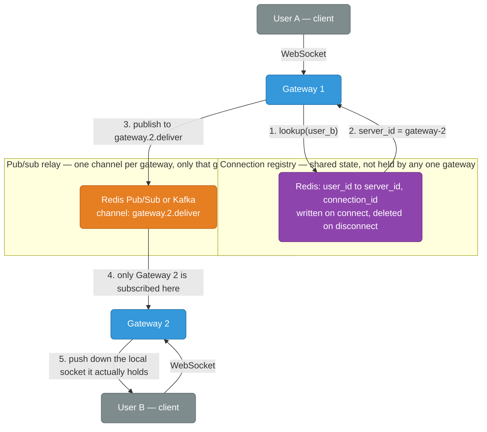

<div class="stepper">
  <div class="stepper-panels">
    <div class="stepper-panel active">
      <strong>1. User A's message lands on Gateway 1.</strong> Gateway 1 has no idea where User B is connected — it only knows its own local sockets.
    </div>
    <div class="stepper-panel">
      <strong>2. Gateway 1 looks up User B in the connection registry.</strong> A fast key-value read, typically Redis: <code>GET conn:user_b</code> returns something like <code>{server_id: "gateway-2", connection_id: "ws-8841"}</code>.
    </div>
    <div class="stepper-panel">
      <strong>3. Gateway 1 publishes the message onto Gateway 2's channel.</strong> Not a broadcast — a targeted publish onto a channel scoped to exactly one gateway (<code>gateway.2.deliver</code>), so only that one process ever sees it.
    </div>
    <div class="stepper-panel">
      <strong>4. Gateway 2 receives it from its subscription.</strong> Every gateway subscribes only to its own channel, so this delivery never touches Gateway 3, 4, or any other server in the fleet.
    </div>
    <div class="stepper-panel">
      <strong>5. Gateway 2 pushes it down User B's actual socket.</strong> This is the one step no other server in the fleet could have done — only the process holding the live TCP connection can write to it.
    </div>
  </div>
  <div class="stepper-controls">
    <button class="stepper-prev">← Prev</button>
    <span class="stepper-dots"></span>
    <span class="stepper-label"></span>
    <button class="stepper-next">Next →</button>
  </div>
</div>

**Why it matters:** without this, horizontally scaling the WebSocket layer would only let you scale the *number of connections you can accept*, not the *number of users who can actually message each other* — any two users landing on different gateways would simply be unreachable from one another. The registry plus relay is what makes "any server can reach any connected client" true despite each connection being pinned to exactly one process.

On disconnect, the gateway must delete its registry entry (or let a short TTL expire it) — a stale entry pointing at a dead connection means messages get published to a channel nobody live is reading, and silently vanish.

<div class="quiz-card">
  <p class="quiz-q">Gateway 1 crashes without cleanly closing its sockets. The registry still lists 500 users as connected to gateway-1. What happens to messages sent to them in the meantime?</p>
  <button class="quiz-reveal">Reveal answer</button>
  <div class="quiz-a" hidden>They get published onto gateway-1's channel and go nowhere — gateway-1 is dead, nothing is subscribed to receive them, and the sending gateway has no way to know that from the registry entry alone. This is exactly why the registry entry needs a short TTL refreshed by a heartbeat (the same mechanism Section 6 uses for presence) rather than relying purely on a clean disconnect handler to remove it — a crash never gets the chance to run that handler.</div>
</div>

---

## 4. Message Delivery Guarantees

Once a message is relayed across the fleet, what actually gets promised about it arriving? The same three tiers from [async-patterns.md's delivery guarantees](./async-patterns.md) apply, with chat-specific consequences:

| Guarantee | Behavior | Chat consequence |
|---|---|---|
| At-most-once | Fire and forget, no retry | A dropped connection mid-send silently loses the message — the sender sees no error, the recipient never sees the text |
| At-least-once | Ack required, retry on timeout/no-ack | The same message can arrive twice if the ack itself was lost, even though the message got through fine the first time |
| Effectively-exactly-once | At-least-once delivery + dedup on the receiving side | No silent loss, and duplicates are filtered out before they ever render |

Chat systems build the third tier the same way [async-patterns.md's idempotency section](./async-patterns.md) does for message queues in general — a **client-generated message ID** created before the message is even sent (usually a UUID), attached to the payload, and checked against a dedup store on arrival. The client generates it (not the server) specifically so retries after a dropped connection or timed-out ack reuse the *same* ID instead of minting a new one — the exact same principle as reusing an `Idempotency-Key` across retries in [api-design.md](./api-design.md).

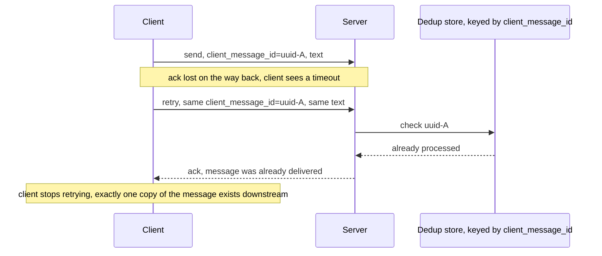

Without the dedup step this is at-least-once with visible duplicates: the recipient would see the same message text appear twice, because both the original send and the retry got processed as distinct messages.

<div class="quiz-card">
  <p class="quiz-q">Why does the client generate the message ID up front, instead of letting the server assign one when the message is first received?</p>
  <button class="quiz-reveal">Reveal answer</button>
  <div class="quiz-a" hidden>If the server assigned the ID, a retry after a lost ack would look like a brand-new message to the server — there'd be nothing to compare it against, since the ID that would've let the server recognize "I've already seen this one" wouldn't exist until the server itself created it fresh, for both the original and the retry. The client has to mint the ID before the first send specifically so the retry can carry the same value, which is the only thing the dedup check has to key on.</div>
</div>

---

## 5. Message Ordering

Chat doesn't need a single global order across every conversation on the platform — nobody cares whether a message in conversation X happened before or after an unrelated message in conversation Y. What matters is that messages **within one conversation** appear in the order they were sent, to everyone reading that conversation.

That's a much easier problem: each conversation gets its own monotonically increasing **sequence number**, assigned when the message is persisted (Section 9). A client tracks the highest sequence number it has seen per conversation; if a message arrives with a sequence number that isn't `last_seen + 1`, there's a gap, and the client knows exactly what range it's missing.

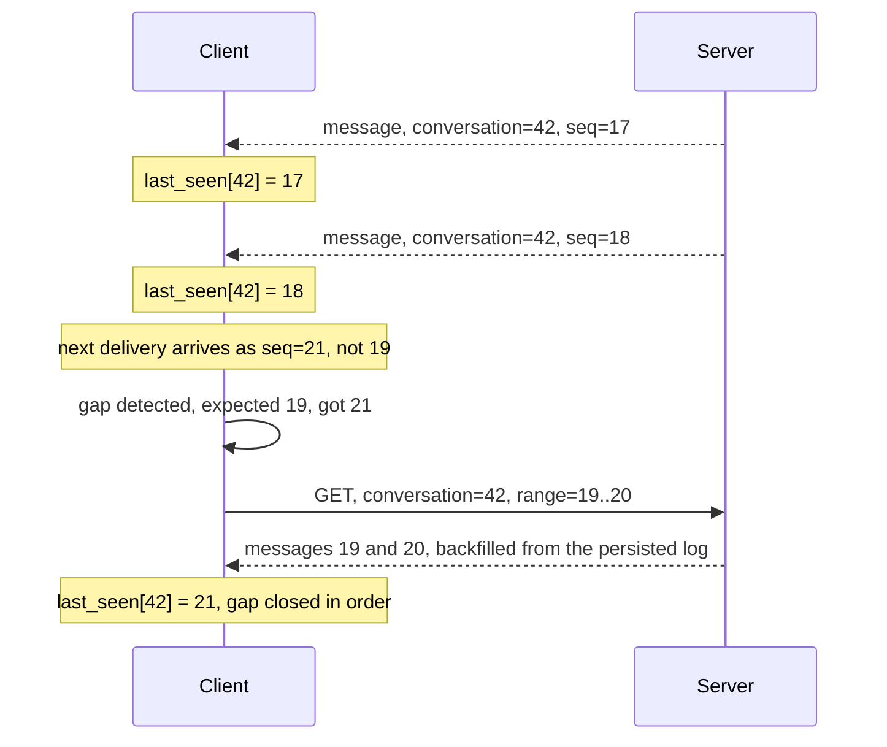

This is why per-conversation sequence numbers, not timestamps, are the right ordering key: clocks skew across servers and can even go backwards, but a counter that only ever increments per conversation gives every client an unambiguous way to detect exactly what it's missing and ask for exactly that range — no coordination with any other conversation required.

<div class="quiz-card">
  <p class="quiz-q">Why use a per-conversation sequence number instead of just ordering messages by server-received timestamp?</p>
  <button class="quiz-reveal">Reveal answer</button>
  <div class="quiz-a" hidden>Timestamps from different servers can skew, and even a single server's clock can jump backwards (NTP correction). A sequence number that only ever increments within one conversation gives every client a reliable, gap-detectable ordering signal regardless of clock behavior — "did I get 19 and 20 before 21" is a simple integer comparison, not a fuzzy time comparison that has to account for clock drift.</div>
</div>

---

## 6. Presence System

Presence — online, offline, typing — is a **heartbeat + TTL** problem, not something a client explicitly announces once and forgets. The client (or its open WebSocket connection) periodically refreshes a Redis key with a short expiry; as long as refreshes keep arriving, the key stays alive and the user reads as online. Stop refreshing — client closes, network dies, app is backgrounded — and the key simply expires on its own. Nobody has to explicitly mark the user offline.

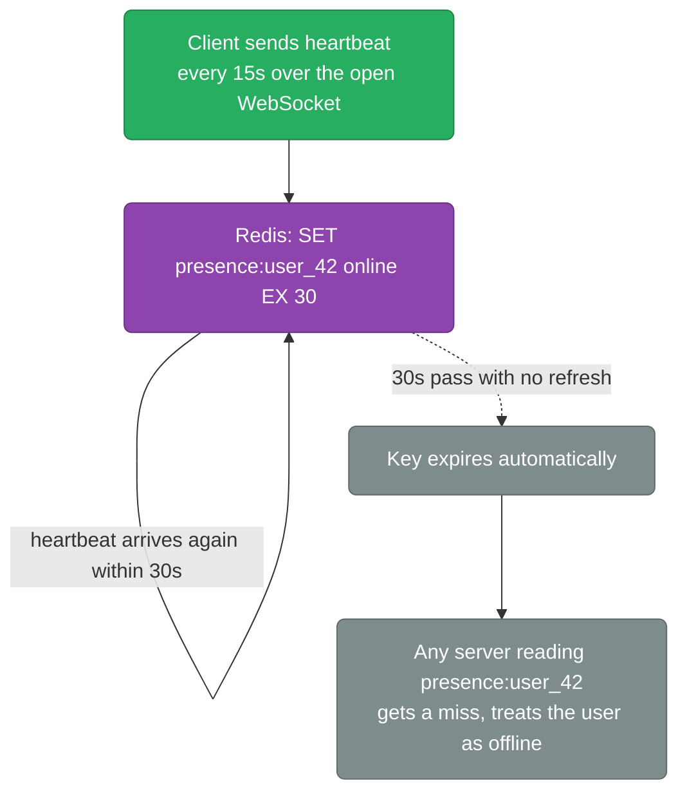

**Why presence is inherently eventually consistent:** a heartbeat interval shorter than the TTL (15s heartbeat, 30s TTL above) means there's always a window where a user who just went offline still reads as online, and a brief network blip that delays one heartbeat by a few seconds doesn't flip their status at all — the TTL hasn't lapsed yet. That slack is deliberate: a presence system tuned to flip instantly on any missed beat would flap a user's status on every minor network hiccup, which is worse UX than being a few seconds stale. Presence answers "were they recently active," not "are they connected at this exact millisecond" — and that's a feature, not a bug.

Typing indicators ride the same mechanism at a shorter TTL (2–3 seconds): the client sends a "typing" event on every keystroke (throttled), the server sets a short-lived key, and the indicator disappears automatically the moment the key expires — no explicit "stopped typing" event required either.

<div class="quiz-card">
  <p class="quiz-q">A user's phone loses signal for 5 seconds — well under the 30s presence TTL — and reconnects on its own. Does their contact see them flip to offline and back?</p>
  <button class="quiz-reveal">Reveal answer</button>
  <div class="quiz-a" hidden>No — that's exactly the slack the TTL is designed to absorb. As long as a heartbeat lands before the 30s key expires, the key never lapses and the status never flips. Only a gap longer than the TTL (client actually closed, or a network outage that outlasts it) causes the key to expire and the user to read as offline. Presence trades a few seconds of staleness for not flapping on every brief blip.</div>
</div>

---

## 7. Multi-Device Fan-Out

Modern chat users are rarely on one device — phone, laptop, tablet, web tab can all be logged into the same account simultaneously. A message addressed to that user has to reach **every active session**, not just whichever one happens to answer first.

This is the same fan-out shape covered in [async-patterns.md's pub/sub pattern](./async-patterns.md) — one message, delivered independently to every subscriber — just applied to a **per-user device list** instead of a social-graph follower list. The connection registry from Section 3 extends naturally: instead of `user_id → one connection`, it holds `user_id → [connection_1, connection_2, connection_3, ...]`, one entry per active session, each potentially on a different gateway.

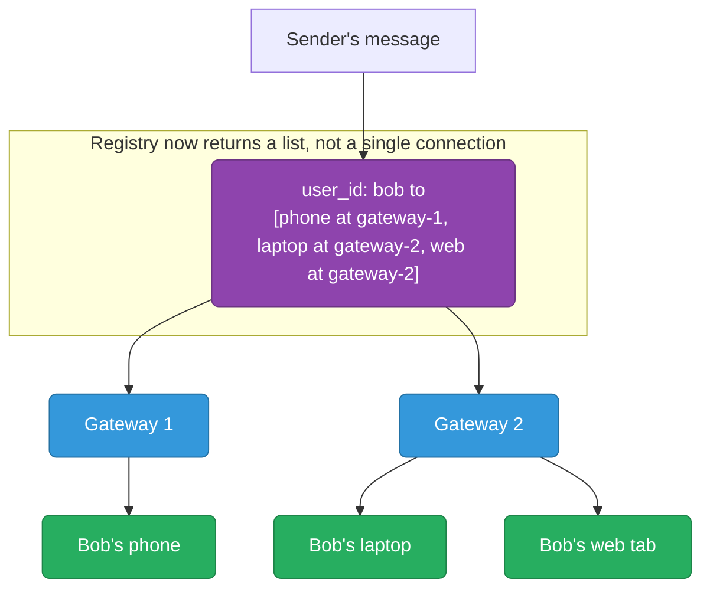

Two sessions on the *same* gateway (laptop and web tab on Gateway 2 above) still get two independent pushes — the fan-out is per connection, not per server. And per-device delivery state matters here too: if the phone is asleep and misses the WebSocket push, that's an offline-delivery case for that one device (Section 11) even while the laptop and web tab receive it live — multi-device fan-out and per-device delivery state are two different axes of the same message.

<div class="quiz-card">
  <p class="quiz-q">Bob has a laptop and a web tab both connected through the same gateway server. Does that gateway push the message to that connection once, since it's "the same server," or twice?</p>
  <button class="quiz-reveal">Reveal answer</button>
  <div class="quiz-a" hidden>Twice. Fan-out is per connection, not per server — the laptop and the web tab are two separate WebSocket connections with two separate registry entries, even though they happen to be pinned to the same gateway process. The gateway being shared is an implementation detail of where the sockets live, not a reason to collapse two independent sessions into one delivery.</div>
</div>

---

## 8. Group Chat Fan-Out at Different Scales

A 1:1 message has exactly one recipient to fan out to (times however many devices they have). Group chat has to fan out to every member — and "every member" ranges from 3 people to a 500,000-subscriber broadcast channel, which are different engineering problems wearing the same UI.

<div class="toggle-switch">
  <div class="toggle-buttons">
    <button data-toggle-opt="small" class="active state-ok">Small Group (fan-out-on-write)</button>
    <button data-toggle-opt="broadcast" class="state-warn">Broadcast Channel (fan-out-on-read)</button>
  </div>
  <div class="toggle-panel active" data-toggle-panel="small">
    <strong>Fan-out-on-write, a.k.a. push model.</strong> When a message is sent, the server immediately looks up every member's connection(s) via the registry and delivers to each one — the same mechanism as Section 3/7, just looped over a member list instead of a single recipient. For a group of 5–200 people this is cheap: one write, a handful of registry lookups, a handful of pushes, all done in milliseconds. Each member's client also gets to maintain its own simple "last read message" pointer, since the full message stream is small enough to just push at everyone.
    <br/><br/>
    <strong>Breaks down at:</strong> a "group" with 500,000 members turns one message send into 500,000 registry lookups and pushes — most of them to devices that are asleep, backgrounded, or simply not looking at the screen that instant. The write-side work scales with member count, and at broadcast scale that's the bottleneck, not the message volume itself.
  </div>
  <div class="toggle-panel" data-toggle-panel="broadcast">
    <strong>Fan-out-on-read, a.k.a. pull model, applied to chat as a hybrid.</strong> The message is written to the conversation's log exactly once — no per-member copy, no per-member push on send. Each subscriber independently tracks their own <strong>last-read pointer</strong> (a sequence number, per Section 5) and pulls everything newer than that pointer when they actually open the channel or reconnect. Write cost is now O(1) regardless of subscriber count.
    <br/><br/>
    <strong>The tradeoff:</strong> there's no instant push to every subscriber the moment the message lands — a subscriber only "gets" a channel message when they check in, which is fine for a broadcast channel (nobody expects millisecond delivery from a 500K-subscriber announcement channel) but wrong for an active back-and-forth conversation, where instant delivery is the entire point.
  </div>
</div>

**Where the crossover point actually is:** this mirrors the celebrity-problem fan-out tradeoff in [scaling.md's fan-out-on-write vs fan-out-on-read section](./scaling.md) — small fan-out sets favor push because the write cost is trivial and users expect instant delivery; huge fan-out sets favor pull because push cost scales linearly with subscribers while pull cost doesn't scale with subscribers at all. Production chat systems (Slack, Discord, Telegram) draw the line by member count and by expected interactivity: a 50-person team channel still gets fan-out-on-write because people are actively watching it, while a 100K-member broadcast channel switches to fan-out-on-read — write once, let each reader's client catch up against its own last-read pointer.

<div class="quiz-card">
  <p class="quiz-q">A broadcast channel with 200,000 subscribers uses fan-out-on-read. Does sending one message to it cost more, less, or about the same as sending one message in a 5-person group that uses fan-out-on-write?</p>
  <button class="quiz-reveal">Reveal answer</button>
  <div class="quiz-a" hidden>Less, at write time — the broadcast channel's write is O(1): one append to the conversation log, no per-subscriber lookups or pushes at all. The 5-person group's write does 5 registry lookups and 5 pushes, which is still cheap in absolute terms but scales with member count, unlike the broadcast channel's write. The cost of reaching 200,000 people didn't vanish — it moved to read time, spread across each subscriber's own pull when they check the channel, instead of being paid all at once on write.</div>
</div>

---

## 9. Message Storage & History

A conversation's history is fundamentally an **append-only log**, keyed by conversation, ordered by the sequence number from Section 5. Once a message is written, it's essentially never updated in place (edits and deletes are usually modeled as new events referencing the original, not in-place mutation) — which is exactly the append-only, time-ordered access pattern of a time-series or log store, not the update-heavy access pattern a relational schema is built for.

That shapes the storage choice: a wide-column or log-oriented store (Cassandra, DynamoDB, or a well-partitioned append-only table) with `conversation_id` as the partition key and `sequence_number` as the sort/clustering key reads and writes exactly the way chat actually behaves — recent messages in one conversation, read in order, almost never touched again after being written.

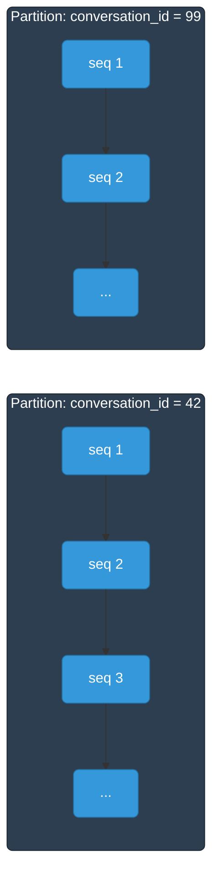

**Scroll-back uses cursor-based pagination, not offset.** A chat client scrolling up through history is the textbook case from [api-design.md's pagination strategies](./api-design.md): `OFFSET 5000` forces the store to walk past 5,000 rows just to throw them away, and that cost grows the further back a user scrolls — exactly backwards from how chat is actually used, where old history is read rarely but is still expected to load fast when it is. A cursor (the sequence number of the oldest message already loaded) turns "give me the next page" into a direct, indexed `WHERE conversation_id = 42 AND seq < :cursor ORDER BY seq DESC LIMIT 50` — constant-time regardless of how far back the user has scrolled.

<div class="quiz-card">
  <p class="quiz-q">Why does chat history fit a time-series/log storage model better than a normalized relational one?</p>
  <button class="quiz-reveal">Reveal answer</button>
  <div class="quiz-a" hidden>Because the access pattern is almost entirely append (new messages) and ordered read (scroll-back within one conversation), with essentially no in-place updates to old rows — the same shape as a time-series log, not the update-heavy, join-heavy shape relational schemas are optimized for. Partitioning by conversation_id and ordering by sequence number lines storage up with exactly how the data is actually read: recent-first, within one conversation, rarely touching anything already written.</div>
</div>

---

## 10. Delivery / Read Receipts

A message's status isn't one flag — it's a **per-recipient-device state machine**. In a group chat, one message can simultaneously be "read" on Alice's phone, "delivered but unread" on Bob's laptop, and "sent but not yet delivered" to Carol's phone, which is offline. The three states only ever move forward:

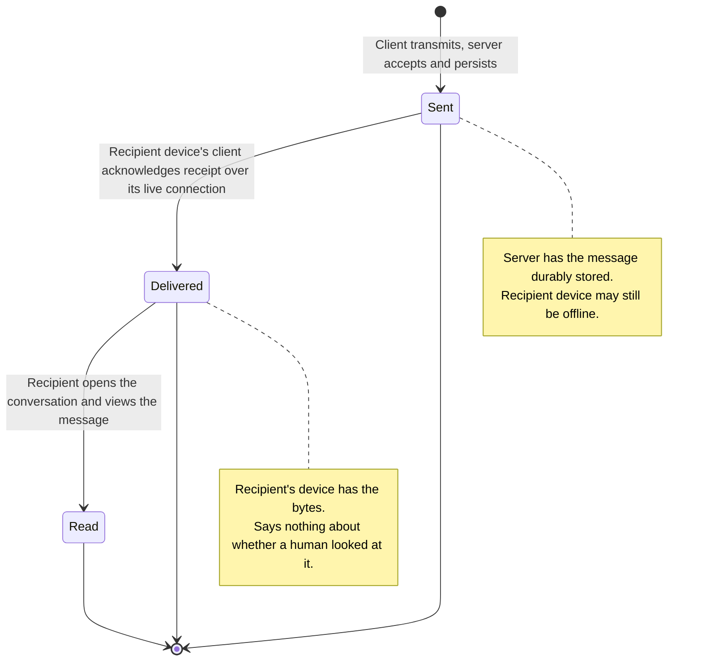

<div class="stepper">
  <div class="stepper-panels">
    <div class="stepper-panel active">
      <strong>1. Sent.</strong> The message hits the server and is durably persisted (Section 9) — this is the state the sender sees the instant their own send succeeds, and it says nothing yet about the recipient's device.
    </div>
    <div class="stepper-panel">
      <strong>2. Delivered.</strong> The recipient's device receives the message over its live connection and sends back a delivery acknowledgment. If the recipient has no active connection, the message stays at "sent" until reconnect or offline push (Section 11) — delivery is device-specific, so a 3-device user can have this state differ per device at the same instant.
    </div>
    <div class="stepper-panel">
      <strong>3. Read.</strong> The recipient's client marks the message read once it's actually rendered on screen (typically when the conversation is opened, sometimes gated further on scroll position). This is a separate signal the client has to send explicitly — the server has no way to infer "a human looked at this" from delivery alone.
    </div>
  </div>
  <div class="stepper-controls">
    <button class="stepper-prev">← Prev</button>
    <span class="stepper-dots"></span>
    <span class="stepper-label"></span>
    <button class="stepper-next">Next →</button>
  </div>
</div>

In a group of N people, one message needs N independent receipt records (one per member, per their own devices) — "delivered" for a group message usually means "delivered to at least one of that member's devices," while some clients track it per-device for finer-grained UI. Either way, receipts are always evaluated relative to a specific recipient, never as one global status on the message itself.

<div class="quiz-card">
  <p class="quiz-q">A message shows "delivered" to a recipient. Does that guarantee a human has seen it?</p>
  <button class="quiz-reveal">Reveal answer</button>
  <div class="quiz-a" hidden>No. "Delivered" only means the recipient's device received the bytes over its connection and acknowledged that — the message could be sitting unread in a notification tray or an unopened app. "Read" is a separate, later transition that only fires once the client explicitly signals the message was actually rendered on screen; the server can't infer it from delivery.</div>
</div>

---

## 11. Offline Delivery via Push Notifications

Sections 3–8 all assume the recipient has a live WebSocket connection somewhere. They often don't — phone is locked, app is killed, laptop is asleep. When the connection registry lookup from Section 3 comes back empty for every one of a user's known devices, the gateway can't push at all, so it hands off to a **push notification service** (APNs for iOS, FCM for Android/web).

The critical detail: the push notification is a wake-up trigger, not the message's system of record. The message must already be durably written to the persistent store (Section 9) *before* the push is sent — the push payload is typically just a hint ("new message from Alice") that opens the app, which then fetches the real message from the store, complete with its proper sequence number and full content. If the store write happened only after the push succeeded, a crash between the two would leave a notification the user tapped on pointing at nothing.

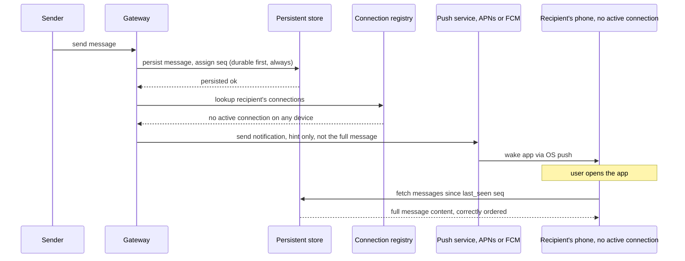

This also means offline delivery and the ordering/gap-detection mechanism from Section 5 are the same code path: a device that was offline for hours reconnects, notices its `last_seen` sequence number is far behind, and backfills the gap from the persistent store exactly like a device recovering from a brief network blip — offline for 10 seconds and offline for 10 hours are the same recovery mechanism at different scale, not two different mechanisms.

<div class="quiz-card">
  <p class="quiz-q">Could the system skip writing to the persistent store for an offline user and just rely on the push notification payload carrying the message content?</p>
  <button class="quiz-reveal">Reveal answer</button>
  <div class="quiz-a" hidden>No — push payloads are small, not guaranteed to be delivered (the OS can drop or coalesce them), and carry no ordering or gap-recovery mechanism of their own. If the message only ever lived in the push payload, a dropped notification would mean the message is simply gone with no way to detect or recover it. Persisting first, and treating the push purely as a wake-up hint that triggers a fetch from the durable store, is what makes offline delivery reliable instead of best-effort.</div>
</div>

---

## 12. Putting It Together — End-to-End Architecture

Every piece above is one layer of the same pipeline. None of them work in isolation — the gateway needs the registry to relay, the relay needs the store to actually deliver something durable, and the whole system needs the presence and push layers to cover the gap when a client isn't live.

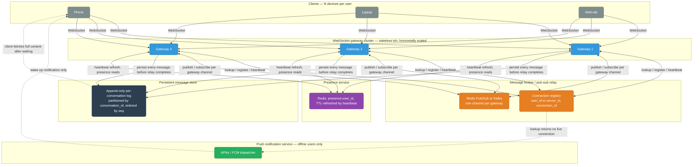

Trace one message through the whole thing: it lands on a gateway, gets persisted to the log with a sequence number (Section 9) before anything else happens, gets deduped and acked for delivery guarantees (Section 4), gets relayed via the registry and pub/sub to every one of the recipient's connected devices (Sections 3 and 7) — falling back to push for any device the registry shows as offline (Section 11) — and along the way updates delivery/read receipts (Section 10) and each participant's presence (Section 6). Group and broadcast conversations pick fan-out-on-write or fan-out-on-read (Section 8) at the relay step depending on member count. Every layer here is independently scalable — you can add gateway servers without touching the store, or reshard the store without touching the gateways — because none of them hold state the others depend on beyond what's in the registry and the log.

<div class="quiz-card">
  <p class="quiz-q">In this architecture, if the persistent message store were slow or down, would relaying messages to already-connected recipients still work?</p>
  <button class="quiz-reveal">Reveal answer</button>
  <div class="quiz-a" hidden>It shouldn't be allowed to "work" in a way that skips the store — the diagram's relay step explicitly persists every message before the relay completes, precisely so a message that reached a live recipient's screen is never only living in an in-memory pub/sub hop. If the store is down, correct behavior is to fail or queue the send, not relay first and persist later — otherwise a gateway crash right after an in-memory relay would lose the message with no durable copy anywhere, the same durability gap Section 11 calls out for offline push.</div>
</div>

---

## 13. MQTT for Real-Time Messaging

Everything through Section 12 assumes a custom protocol riding on top of a WebSocket: your own JSON envelope, your own registry, your own relay — the right call when you control both ends and want a general-purpose, low-latency bidirectional channel. But there's a whole class of client where a raw WebSocket plus a hand-rolled protocol is more overhead than the problem needs: a mobile app waking on patchy cellular, a battery-constrained wearable, a fleet of IoT sensors. **MQTT (Message Queuing Telemetry Transport)** is a lightweight publish/subscribe protocol built specifically for that world — constrained devices, unreliable networks, and a wire format designed to cost as few bytes as possible.

### Broker-mediated pub/sub, not direct relay

Section 3's WebSocket relay model is fundamentally about **finding a specific recipient**: Gateway 1 looks up exactly which gateway holds User B's live socket, then pushes directly onto that one connection. MQTT throws that lookup away entirely. Publishers and subscribers never address each other and never know the other exists — every message is **published onto a named topic** on the broker, and every client currently subscribed to that topic (or a matching wildcard, like `chat/+/typing`) gets a copy. The broker is the only party either side ever talks to.

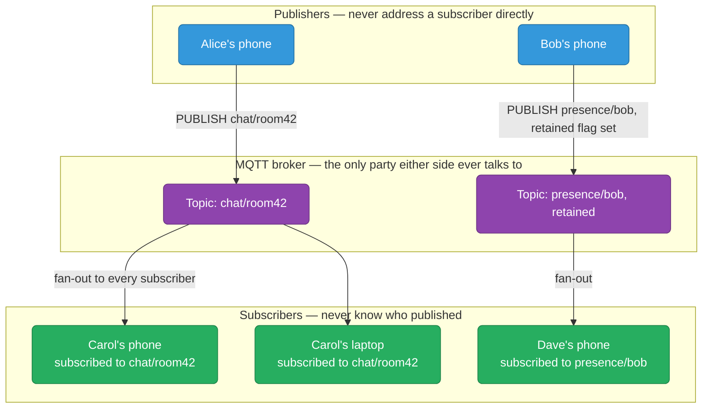

Compare this to Section 3's diagram: there, the relay's entire job was resolving "which gateway holds User B" before a single byte moved. Here, nobody resolves anything — the broker doesn't know or care who's publishing or how many subscribers exist; it just fans a topic out to whoever's currently listening. That's a strictly weaker addressing model (no way to reach exactly one recipient without a dedicated topic per user pair), but it's also why MQTT scales trivially at fan-out patterns like presence and broadcast (Section 8) — the broker does the fan-out work that Section 3's registry-plus-relay had to build by hand.

### Quality of Service: three delivery guarantees, one protocol

MQTT's QoS levels map directly onto the three tiers from [Section 4's delivery guarantees](#4-message-delivery-guarantees) — MQTT just gives each one a protocol-level number.

<div class="toggle-switch">
  <div class="toggle-buttons">
    <button data-toggle-opt="qos0" class="active state-bad">QoS 0 — at-most-once</button>
    <button data-toggle-opt="qos1" class="state-warn">QoS 1 — at-least-once</button>
    <button data-toggle-opt="qos2" class="state-ok">QoS 2 — exactly-once</button>
  </div>
  <div class="toggle-panel active" data-toggle-panel="qos0">
    <strong>Fire and forget.</strong> The publisher sends the message once and moves on — no acknowledgment, no retry, no stored copy. This is Section 4's at-most-once tier: cheapest, and a dropped packet or a broker restart mid-delivery silently loses the message with nobody noticing. Fine for a stream of sensor readings where the next one is seconds away anyway; wrong for a chat message a human is waiting to see land.
  </div>
  <div class="toggle-panel" data-toggle-panel="qos1">
    <strong>Ack required, retry on timeout.</strong> The publisher keeps the message until the broker sends a <code>PUBACK</code>; no ack within the retry window means the publisher resends with the <code>DUP</code> flag set. This is Section 4's at-least-once tier exactly — it can never silently lose a message, but a <code>PUBACK</code> lost on the way back produces a real duplicate delivery. Getting to effectively-exactly-once from here needs the same fix as Section 4: a client-generated message ID and a dedup check on arrival. MQTT doesn't do that step for you.
  </div>
  <div class="toggle-panel" data-toggle-panel="qos2">
    <strong>Four-way handshake.</strong> <code>PUBLISH</code>, then <code>PUBREC</code>, then <code>PUBREL</code>, then <code>PUBCOMP</code> — the extra round trip versus QoS 1's single ack is specifically what lets the broker track "have I already completed this exact delivery" and suppress the duplicate that QoS 1 can't. Most expensive in latency and broker bookkeeping, reserved for messages where a duplicate is actively harmful (a payment confirmation, not a typing indicator).
  </div>
</div>

<div class="quiz-card">
  <p class="quiz-q">A chat app publishes messages at QoS 1 to avoid silent loss. A user reports seeing the same message twice after a spotty connection. Is that a bug in MQTT?</p>
  <button class="quiz-reveal">Reveal answer</button>
  <div class="quiz-a" hidden>No — that's QoS 1 behaving exactly as specified. QoS 1 is at-least-once: if the PUBACK is lost even though the PUBLISH actually landed, the publisher retries and the broker delivers it again. MQTT never promises QoS 1 is duplicate-free. Getting effectively-exactly-once out of it needs the same fix as Section 4's async delivery guarantees — a client-generated message ID checked against a dedup store on arrival — MQTT's QoS levels don't include that step for you.</div>
</div>

### Retained messages and Last Will and Testament

Two MQTT features answer "what happened before I subscribed" and "how do we know a client vanished" without polling anything.

**Retained messages.** Normally a subscriber only receives messages published *after* it subscribes — MQTT has no history playback like Section 9's per-conversation log. A **retained** publish is the one exception: the broker keeps exactly the last message published to a topic with the retained flag set, and hands it to any new subscriber immediately on subscribe, before any new traffic arrives. That's a single last-known-value cache per topic, not a log — a new subscriber gets *one* message, not everything that was ever published there.

**Last Will and Testament (LWT).** When a client connects, it can register a "will" message — a topic and payload the broker promises to publish *on that client's behalf* if the connection ever drops ungracefully (TCP reset, keepalive timeout) instead of a clean `DISCONNECT`. This is a fundamentally different mechanism from Section 6's heartbeat-and-TTL presence: Section 6 is *pull*-shaped (a key silently expires, and anyone checking it later treats the absence as offline); LWT is *push*-shaped (the broker actively publishes a specific "this client went offline" message the moment it detects the drop, with nobody having to poll for it).

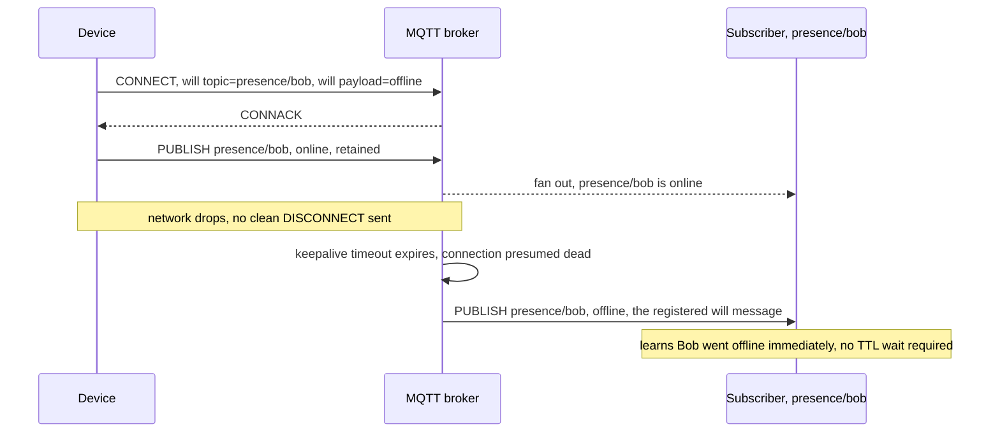

Tying the two together for presence: publish "online" as a **retained** message on connect, and register "offline" as the **will** on the same connection. Every new subscriber immediately sees the current state via the retained value, and every subscriber already listening finds out the instant a device drops via the will — the retained flag covers "catch up," the will covers "notice a departure," and neither needs Section 6's polling-style TTL expiry at all.

<div class="quiz-card">
  <p class="quiz-q">A topic has had 500 messages published to it over the last hour, all with the retained flag set. A new client subscribes right now. How many of those 500 does it receive?</p>
  <button class="quiz-reveal">Reveal answer</button>
  <div class="quiz-a" hidden>One — the most recent retained message on the topic. The broker only ever keeps the latest retained publish per topic, not a history of every retained message that's been sent; each new retained publish simply overwrites the one before it. For actual message history, that's what Section 9's persisted, sequence-numbered log is for — retained messages are a last-known-value cache, not a log.</div>
</div>

<div class="quiz-card">
  <p class="quiz-q">Section 6's presence system relies on a heartbeat and a TTL key that silently expires. Does MQTT's Last Will and Testament work the same way?</p>
  <button class="quiz-reveal">Reveal answer</button>
  <div class="quiz-a" hidden>No — they solve the same problem in opposite directions. Section 6 is pull-shaped: nobody actively marks a user offline, a key just stops being refreshed and anyone who checks it later finds it missing. LWT is push-shaped: the broker detects the dropped connection itself (via its own keepalive timeout) and immediately publishes the registered will message to every current subscriber, with no polling or expiry wait involved.</div>
</div>

### Why MQTT specifically suits mobile chat clients

Three design choices separate MQTT from "WebSocket plus your own envelope," specifically for battery- and data-constrained clients:

- **Fixed header as small as 2 bytes.** A minimal MQTT `PUBLISH` can carry a 1-byte control header plus a 1-byte remaining-length field before any actual payload — no HTTP-style headers, no JSON envelope wrapping the payload in field names. A WebSocket frame plus a hand-rolled JSON message (`{"type":"message","conversation_id":42,...}`) pays for every one of those field names on every single message; MQTT's binary framing doesn't.
- **A keepalive tuned for the constrained side, not the server side.** The client, not the broker, picks the keepalive interval at `CONNECT` time — commonly 60–300s on mobile, far longer than a typical WebSocket ping/pong cycle — a deliberate tradeoff that trades faster dead-connection detection for fewer radio wake-ups, which is what actually drains a phone's battery on a cellular connection.
- **Session persistence across reconnects.** The `CONNECT` packet's *clean session* flag decides what survives a disconnect: a clean session throws away all subscription state and any undelivered QoS 1/2 messages the moment the client drops, forcing a full resubscribe on reconnect. A **persistent session** (`clean session = false`) keeps the broker holding the client's subscriptions and any messages queued for it while it was offline, so a phone that drops in and out of coverage all day reconnects straight back into its existing subscriptions and picks up what it missed — much closer to Section 11's offline-push philosophy than to a WebSocket gateway that forgets a dropped client's state instantly.

### MQTT encryption: TLS is not optional in production

Plain MQTT on port 1883 is cleartext, full stop — the topic names, the payload, and even the username/password fields in the `CONNECT` packet (MQTT's own built-in auth mechanism) all go out on the wire exactly as typed. Anyone on the network path — a shared coffee-shop Wi-Fi, a compromised router, a man-in-the-middle — reads all of it. **MQTTS (MQTT over TLS), port 8883,** is the standard fix: the entire MQTT session, `CONNECT` packet included, rides inside a TLS tunnel the same way HTTPS wraps HTTP.

The TLS handshake for MQTT looks like any other TLS handshake, with one addition common in IoT/device fleets: **mutual TLS**, where the broker also demands and validates a client certificate, authenticating the *device* itself before a single MQTT packet is exchanged — useful when "the client" is a fleet of sensors or app installs you provisioned, not a human typing a password.

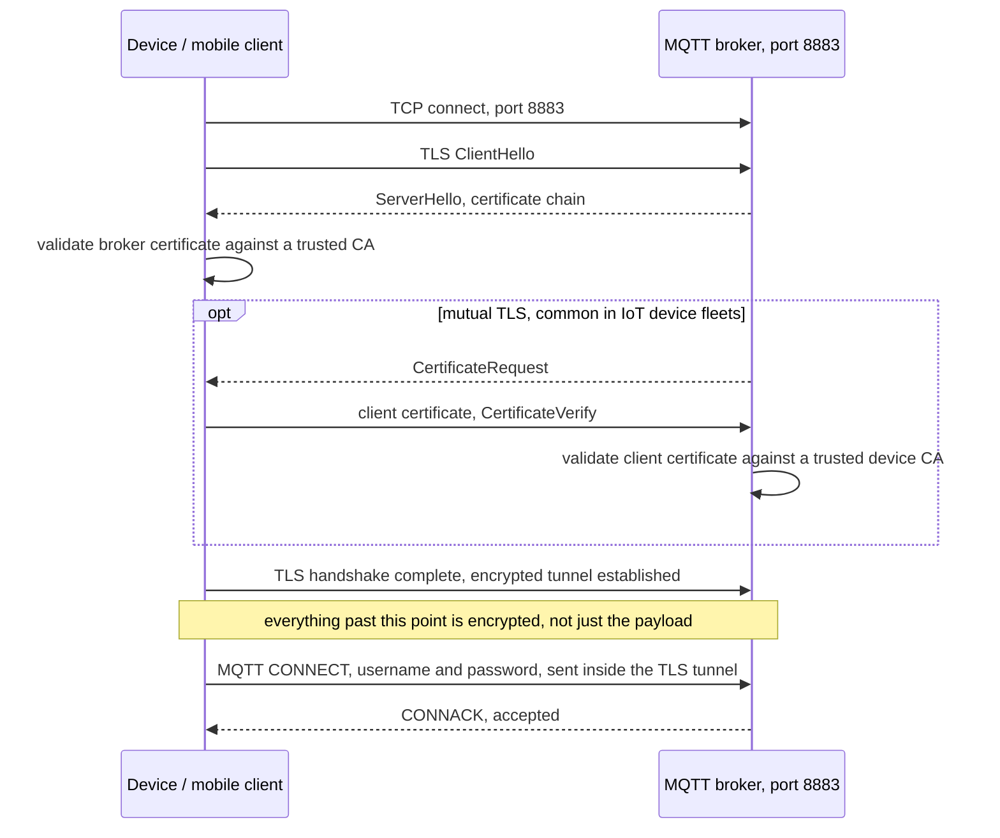

**Username/password is layered on top of TLS, not a substitute for it.** MQTT's `CONNECT` packet has native username and password fields, but they're plain fields in the packet with no encryption of their own — sent over plain port 1883, they're exactly as readable as everything else on that connection. The fields only become a meaningful auth mechanism once TLS is already protecting the channel they travel over; the encryption comes from the transport, the authentication comes from the credentials, and skipping TLS doesn't make the credentials optional — it makes them public.

---

## 14. Voice/Video Calling — WebRTC, SRTP, and Call Encryption

### Why calling can't reuse the message pipeline

Every mechanism from Sections 1–13 — the relay, the broker, the persistent store, even MQTT's QoS retries — assumes a message can be queued, retried, or delivered a few hundred milliseconds late without anyone noticing. A voice or video call is the opposite: it's a continuous stream of latency-sensitive media where a frame that arrives 300ms late is worse than a frame that never arrives at all — there's no useful way to "retry" a dropped audio packet from a second ago into a live conversation. That rules out routing every audio/video frame through your app servers the way Section 3 routes chat messages: doubling every packet's trip (client to your server, then your server to the other client) adds a round trip of latency for every single frame, all day, for the whole call. The fix is architectural, not a delivery-guarantee tweak: get the actual media flowing **peer-to-peer** wherever possible, and use your servers only for the parts that genuinely need a rendezvous point.

### WebRTC: signaling reuses what you already built, media doesn't

WebRTC splits a call into two completely different jobs:

- **Signaling** — negotiating *how* the call will connect: exchanging an SDP offer/answer (the codec, resolution, and format capabilities each side supports) and ICE candidates (below). Critically, **signaling is not a new transport** — it reuses the exact WebSocket gateway, connection registry, and pub/sub relay from Section 3. An SDP offer is just another payload relayed from Client A's gateway to Client B's gateway, looked up the same way a chat message is.
- **Media** — the actual audio/video RTP stream, negotiated during signaling but carried over a completely separate path that WebRTC tries hard to make peer-to-peer, bypassing your servers for the actual audio/video bytes once the call is set up.

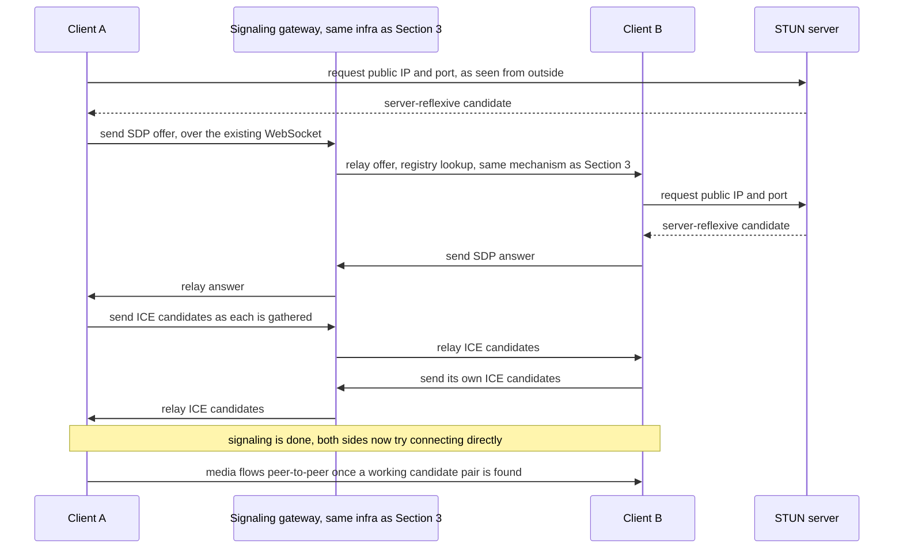

### NAT traversal: STUN, TURN, and why most clients can't just connect directly

Almost every client sits behind a NAT (home router, carrier-grade NAT on mobile) that only allows outbound connections it initiated — it has no way to route an unsolicited inbound packet to a specific device behind it. Two clients on two different NATs can't simply open a socket to each other's private IP; neither address means anything from outside its own network.

- **STUN (Session Traversal Utilities for NAT)** solves the easier half: a client asks a public STUN server "what does my traffic look like from outside," and the STUN server replies with the public IP and port the client's NAT mapped it to. That's enough for many NAT types to let two clients connect directly, once each has told the other its STUN-discovered address.
- **TURN (Traversal Using Relays around NAT)** solves the case STUN can't: some NATs (symmetric NAT) or firewalls block any unsolicited inbound connection regardless of what address is used, so direct P2P never establishes. TURN is a fallback relay server that both clients connect *outbound* to (which almost never gets blocked) — the server then forwards media between them, at the cost of putting a server hop back in the path for the whole call, exactly the cost the P2P approach was trying to avoid.

<div class="stepper">
  <div class="stepper-panels">
    <div class="stepper-panel active">
      <strong>1. Gather candidates.</strong> Each client collects every address it might be reachable at: its local host address, a server-reflexive address from STUN, and a relay address from TURN, just in case.
    </div>
    <div class="stepper-panel">
      <strong>2. Exchange candidates via signaling.</strong> Both sides send their full candidate lists over the existing WebSocket signaling channel from Section 3 — this step never touches the media path itself.
    </div>
    <div class="stepper-panel">
      <strong>3. Try direct P2P first.</strong> ICE tries candidate pairs in priority order, host and server-reflexive pairs first, checking whether traffic actually flows between them.
    </div>
    <div class="stepper-panel">
      <strong>4. Fall back to TURN relay if direct fails.</strong> If nothing in the P2P pairs works, typically because of a symmetric NAT or restrictive firewall, ICE falls back to the relay candidate, and media runs through the TURN server instead.
    </div>
    <div class="stepper-panel">
      <strong>5. Media flowing.</strong> Whichever pair succeeded, P2P or TURN relay, is now the fixed path for the rest of the call — audio and video packets flow over it directly, with the signaling channel no longer involved.
    </div>
  </div>
  <div class="stepper-controls">
    <button class="stepper-prev">← Prev</button>
    <span class="stepper-dots"></span>
    <span class="stepper-label"></span>
    <button class="stepper-next">Next →</button>
  </div>
</div>

<div class="quiz-card">
  <p class="quiz-q">Does a STUN server ever carry the actual audio/video packets of a call?</p>
  <button class="quiz-reveal">Reveal answer</button>
  <div class="quiz-a" hidden>No. STUN's only job is telling a client its own public IP and port as seen from outside its NAT — the client uses that discovered address to try a direct connection, but STUN itself never sits in the media path. TURN is the one that actually relays media, and only as a fallback once direct P2P has failed.</div>
</div>

### Group calls: mesh, SFU, or MCU

One-to-one calls have exactly one peer to connect to. Group calls have to connect every participant to every other participant's media somehow, and there are three fundamentally different ways to do that.

<div class="tab-group">
  <div class="tab-buttons">
    <button data-tab="mesh" class="active">Mesh</button>
    <button data-tab="sfu">SFU</button>
    <button data-tab="mcu">MCU</button>
  </div>
  <div class="tab-panels">
    <div class="tab-panel active" data-tab-panel="mesh">
      <strong>Every participant connects directly to every other participant.</strong> No media server at all — pure peer-to-peer, N-way. Connection count grows as O(n²): a 3-person call needs 3 connections, a 6-person call needs 15, an 8-person call needs 28. Each participant also has to upload their own stream once <em>per other participant</em>, so upload bandwidth scales with group size too. Works fine for 2–4 people; falls apart well before 10.
    </div>
    <div class="tab-panel" data-tab-panel="sfu">
      <strong>Selective Forwarding Unit — a server that receives each participant's stream once and forwards it to everyone else, unmodified.</strong> Each participant uploads exactly one stream (to the SFU) and downloads N-1 streams (one per other participant) — connection count and each client's upload cost stay flat regardless of group size, only download cost grows. The SFU does no transcoding or mixing, just packet forwarding, which keeps its own CPU cost low relative to an MCU. This is the architecture most modern group-calling products actually run.
    </div>
    <div class="tab-panel" data-tab-panel="mcu">
      <strong>Multipoint Control Unit — a server that decodes every incoming stream, mixes them into one combined audio/video stream, and re-encodes that single stream for each participant.</strong> Clients now only ever handle one incoming stream no matter how large the call is, which massively simplifies thin or low-power clients. The cost moves entirely onto the server: decoding and re-encoding N streams per participant is CPU- and latency-heavy, and it's real transcoding, not just forwarding — by far the most expensive of the three to run at scale.
    </div>
  </div>
</div>

```mermaid
graph TD
    classDef client fill:#7f8c8d,stroke:#616a6b,color:#fff,rx:6
    classDef sfu fill:#3498db,stroke:#2471a3,color:#fff,rx:6
    classDef mcu fill:#e67e22,stroke:#ba6018,color:#fff,rx:6

    subgraph MESH["Mesh — every client connects to every other client, O(n²) links"]
        M1["Client A"]:::client
        M2["Client B"]:::client
        M3["Client C"]:::client
        M1 --- M2
        M2 --- M3
        M1 --- M3
    end

    subgraph SFUD["SFU — one upload per client, server forwards to every other participant"]
        SC1["Client A"]:::client
        SC2["Client B"]:::client
        SC3["Client C"]:::client
        SRV["SFU — forward only"]:::sfu
        SC1 --> SRV
        SC2 --> SRV
        SC3 --> SRV
        SRV --> SC1
        SRV --> SC2
        SRV --> SC3
    end

    subgraph MCUD["MCU — server decodes, mixes, and re-encodes one combined stream"]
        MC1["Client A"]:::client
        MC2["Client B"]:::client
        MC3["Client C"]:::client
        MSRV["MCU — decode, mix, re-encode"]:::mcu
        MC1 --> MSRV
        MC2 --> MSRV
        MC3 --> MSRV
        MSRV --> MC1
        MSRV --> MC2
        MSRV --> MC3
    end
```

<div class="quiz-card">
  <p class="quiz-q">A 3-person mesh call adds a 4th participant. Does the bandwidth cost increase only for the new person joining?</p>
  <button class="quiz-reveal">Reveal answer</button>
  <div class="quiz-a" hidden>No — every existing participant now has to open a direct connection to the newcomer too, so each of the original 3 people's upload cost grows by one more stream. Mesh connection count is O(n²) across the whole group, not O(n) per new joiner, which is exactly why it breaks down well before a call reaches 10 or more people.</div>
</div>

### Media encryption: SRTP and the DTLS-SRTP handshake

The actual audio/video payload is encrypted with **SRTP (Secure Real-time Transport Protocol)** — RTP is the base media transport format WebRTC carries audio/video in, and SRTP adds encryption and authentication to each packet. SRTP protects media **hop-by-hop**: client-to-server if you're behind a TURN relay or an SFU, client-to-client if the call stayed genuinely peer-to-peer.

Getting SRTP's encryption keys onto both ends without a separate key-exchange channel is what **DTLS-SRTP** does: the two media endpoints run a DTLS (Datagram TLS — TLS's UDP-friendly sibling) handshake directly over the same media path ICE just established, and derive the SRTP keys from that handshake's resulting shared secret. No separate key-management server, no keys carried through signaling — the same UDP path that will carry the encrypted media also carries the handshake that produces its keys.

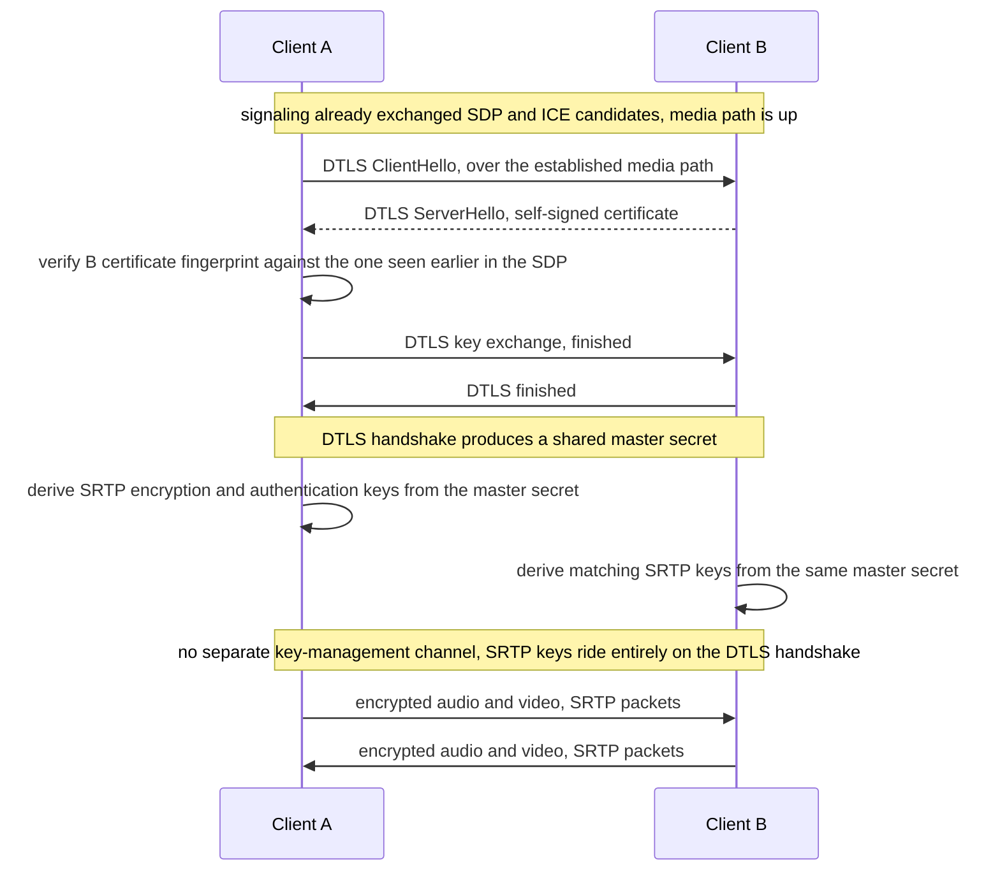

### Transport encryption is not the same claim as end-to-end encryption

This is the single easiest idea to get wrong in this whole section: **"the call uses SRTP" and "the call is end-to-end encrypted" are not the same statement**, and the gap between them depends entirely on the topology from the section above. SRTP guarantees each *hop* is encrypted — but a hop is exactly what it says: client-to-SFU, then separately SFU-to-client. If the call routes through an SFU, the SFU necessarily terminates that first hop's DTLS-SRTP session to receive the packets it needs to forward — which means it holds keys capable of decrypting the media, even though its actual job is just routing packets, not watching them. "Encrypted in transit at every hop" and "no server in the path can ever see the plaintext" are different guarantees, and only the second one is what most people mean by "end-to-end encrypted."

Getting the second guarantee for a group call — the approach Signal and WhatsApp use — needs an architecturally different step: **encrypting each media frame before it's handed to WebRTC's SRTP layer at all**, using the **Insertable Streams** API to apply per-frame encryption with keys only the actual participants hold. The SFU still receives and forwards packets exactly as before — it still needs the routing information SRTP-per-hop gives it — but the payload it forwards is now ciphertext it has no key for, encrypted above the layer the SFU can access rather than at the layer between hops. The SFU keeps doing its job (route packets, not decode them) without ever being *able* to see the plaintext, even though the underlying SRTP hop-by-hop encryption is still there doing its own job in parallel.

<div class="quiz-card">
  <p class="quiz-q">A group video call runs through an SFU, and every hop uses SRTP. Marketing calls this "end-to-end encrypted." Is that accurate?</p>
  <button class="quiz-reveal">Reveal answer</button>
  <div class="quiz-a" hidden>Not by the usual meaning of end-to-end. SRTP encrypts each hop separately, client-to-SFU and SFU-to-client, which means the SFU has to terminate the DTLS-SRTP session on its side to forward packets at all — giving it keys capable of decrypting the media, even if it never actually inspects it. True end-to-end encryption for a group call needs an extra layer on top, like WebRTC's Insertable Streams, encrypting each frame with keys only the participants hold before it ever reaches the SFU, so the SFU only ever forwards ciphertext it has no key for. "Uses SRTP" describes hop-by-hop transport security; it doesn't by itself mean the routing server can't access the content.</div>
</div>

---

## Quick Reference

```
Server can't push without being asked      → persistent connection (WebSocket/SSE/long-poll)
Need low-latency bidirectional messaging   → WebSocket
Need one-way push, proxy-friendly          → Server-Sent Events
WebSocket blocked by network               → long-polling fallback
Reach a user connected to another server   → connection registry + pub/sub relay
Prevent duplicate messages on retry        → client-generated message ID + dedup store
Detect and recover missed messages         → per-conversation sequence number + gap backfill
Online/offline without explicit signaling  → heartbeat + TTL key, eventually consistent
Reach every one of a user's devices        → registry as user_id to list of connections
Small group message fan-out                → fan-out-on-write, push to every member
Huge broadcast channel fan-out             → fan-out-on-read, per-subscriber last-read pointer
Fast scroll-back through history           → cursor-based pagination, not OFFSET
Per-recipient message status               → sent → delivered → read state machine
Recipient has no active connection         → persist first, then hand off to APNs/FCM
```
