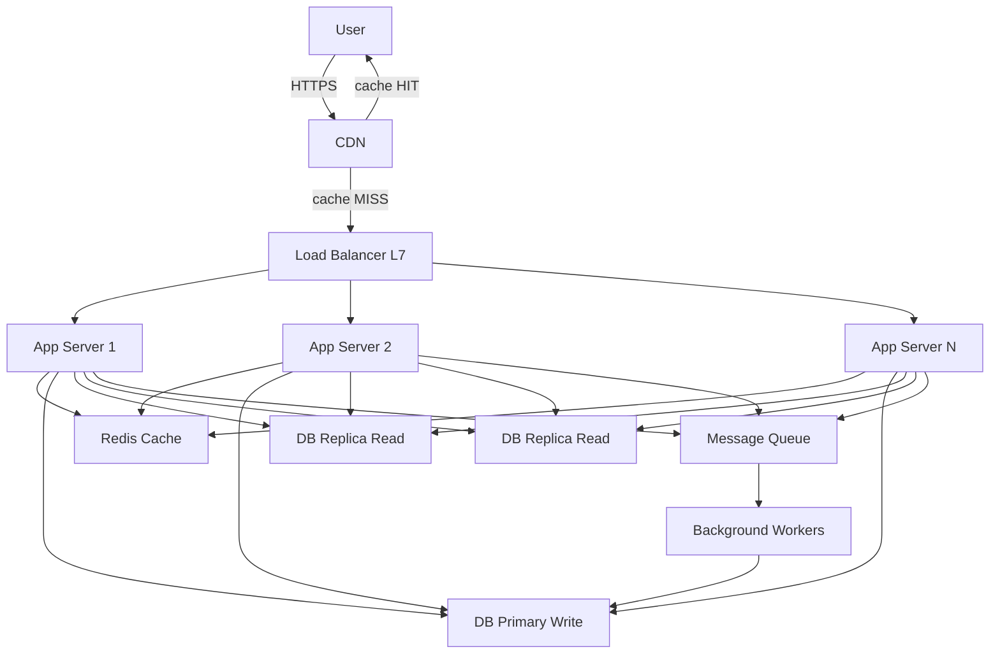
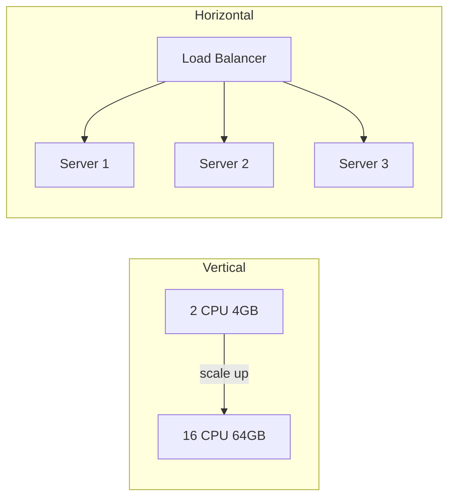
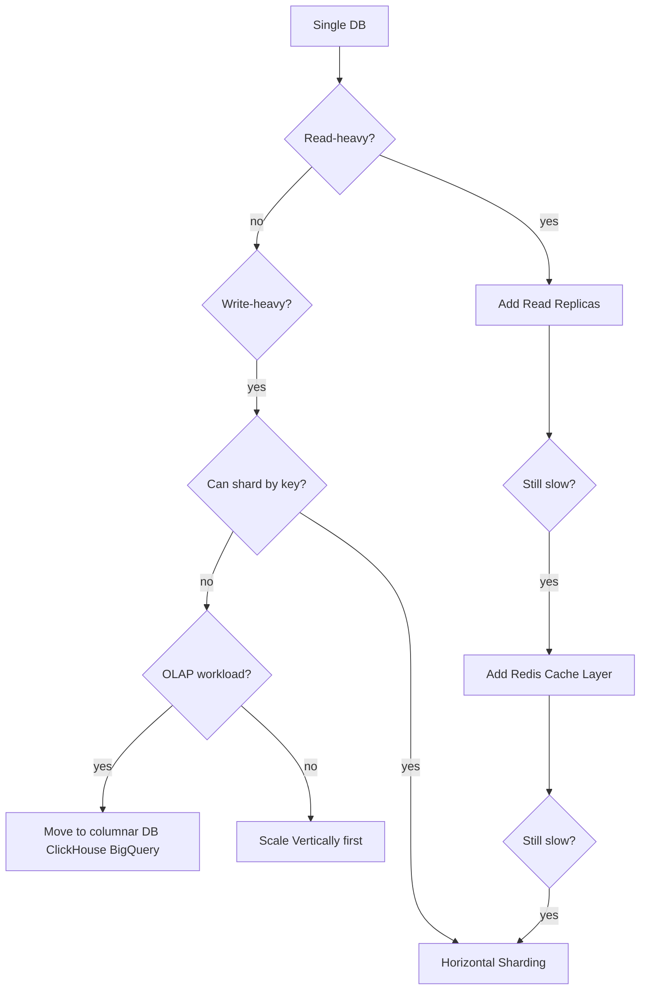
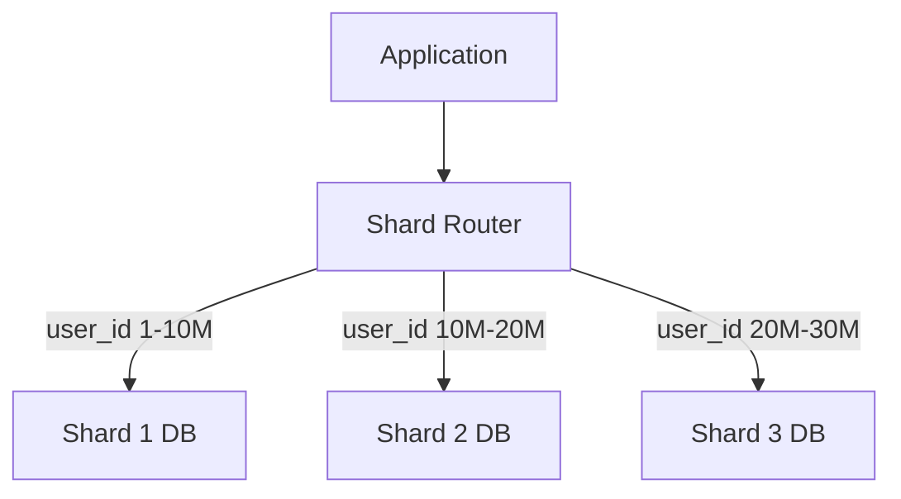
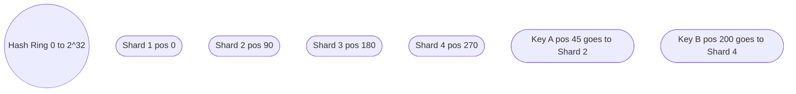
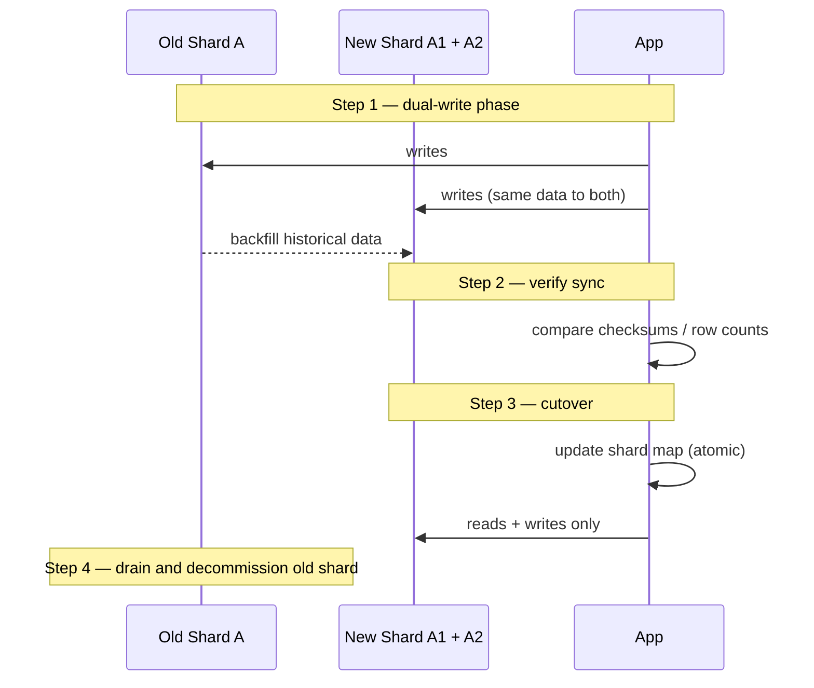
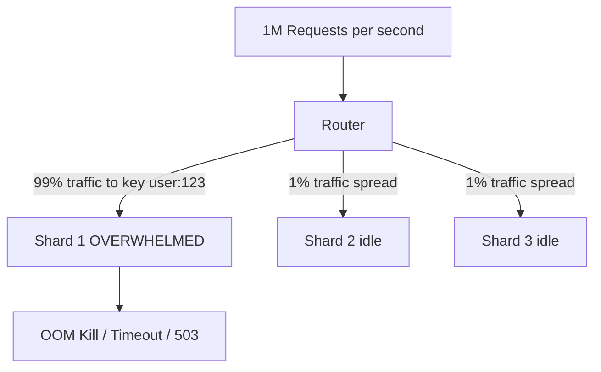

# System Design: 3-Tier Architecture & Scaling

From a single server to a globally distributed system. Every scaling decision has a cost — this guide explains the tradeoffs, not just the patterns.

---

## 3-Tier Architecture

The standard split that separates concerns and makes each tier independently scalable.

```
Tier 1 — Presentation   Client, CDN, Load Balancer
Tier 2 — Application    Stateless app servers, API servers, microservices
Tier 3 — Data           Databases, caches, object storage, queues
```



### Why 3 Tiers?

| Concern | Benefit |
|---------|---------|
| Scale tiers independently | App servers CPU-bound? Add more. DB I/O bound? Add read replicas. |
| Failure isolation | App crash doesn't corrupt DB. DB failover doesn't affect CDN. |
| Security | DB tier never exposed to internet. App tier in private subnet. |
| Deployment | Deploy new app version without touching DB or CDN. |

---

## Scaling: Vertical vs Horizontal



| | Vertical | Horizontal |
|--|----------|------------|
| What | Bigger machine | More machines |
| Limit | Hardware ceiling (~448 vCPU on AWS) | Theoretically unlimited |
| Cost | Exponential beyond a point | Linear |
| Downtime | Usually requires restart | Zero downtime with LB |
| State | Trivial (single process) | Requires stateless app design |
| Best for | DB primary, ZooKeeper, single-writer systems | App servers, workers, read replicas |

**Rule:** Scale vertically until it hurts, then scale horizontally. Databases start vertical, scale horizontally via replication and sharding.

---

## Application Tier Scaling

### Stateless Design — Prerequisite for Horizontal Scale

Every app server must be able to handle any request. State must live outside the app server.

```
❌ Stateful (can't scale out)        ✅ Stateless (can scale out)
─────────────────────────────         ─────────────────────────────
Session in server memory              Session in Redis
Local file uploads                    Files in S3 / GCS
In-process cache                      Distributed cache (Redis)
Server affinity required              Any server can handle any request
```

### Horizontal Pod Autoscaling (K8s)

```yaml
apiVersion: autoscaling/v2
kind: HorizontalPodAutoscaler
metadata:
  name: api-hpa
spec:
  scaleTargetRef:
    apiVersion: apps/v1
    kind: Deployment
    name: api
  minReplicas: 3
  maxReplicas: 50
  metrics:
    - type: Resource
      resource:
        name: cpu
        target:
          type: Utilization
          averageUtilization: 60
    - type: External                      # custom metric — queue depth
      external:
        metric:
          name: sqs_queue_depth
        target:
          type: Value
          value: "100"
```

---

## Database Scaling

Database scaling is harder than app scaling because state is involved.



### Read Replicas

Offload SELECT traffic from the primary.

```
Primary (R/W) ──── async replication ───► Replica 1 (R only)
                                      ───► Replica 2 (R only)
                                      ───► Replica 3 (R only)
```

**Connection routing in app code:**

```python
import psycopg2

write_conn = psycopg2.connect(host="db-primary.internal")
read_conn  = psycopg2.connect(host="db-replica.internal")

# All writes go to primary
with write_conn.cursor() as cur:
    cur.execute("INSERT INTO orders ...")

# All reads go to replica
with read_conn.cursor() as cur:
    cur.execute("SELECT * FROM products WHERE ...")
```

**Replica lag** — async replication means replicas are always slightly behind.  
Fix: for reads that need latest data (e.g., just-written record), read from primary.  
Measure lag: `SELECT now() - pg_last_xact_replay_timestamp()` on PostgreSQL replica.

---

## Database Sharding

Sharding = splitting data horizontally across multiple DB instances (shards). Each shard holds a subset of rows.



### Sharding Strategies

#### 1. Range-based Sharding

```
Shard 1: user_id 1        – 10,000,000
Shard 2: user_id 10000001 – 20,000,000
Shard 3: user_id 20000001 – 30,000,000
```

**Pros:** Easy range queries, simple routing.  
**Cons:** Hotspot risk — new users all go to the last shard. If most recent data is most active, one shard gets hammered.

#### 2. Hash-based Sharding

```
shard_id = hash(user_id) % num_shards

user_id=123  → hash=0xABC... → 0xABC % 4 = 3 → Shard 3
user_id=456  → hash=0xDEF... → 0xDEF % 4 = 1 → Shard 1
```

**Pros:** Even distribution, no hotspots.  
**Cons:** Range queries require scatter-gather across all shards. Resharding is painful (% num_shards changes).

#### 3. Consistent Hashing

Nodes and keys are placed on a ring. Key goes to the nearest node clockwise.



**Pros:** Adding/removing a shard only remaps ~1/N of keys (not all).  
**Cons:** Uneven distribution without virtual nodes. Virtual nodes (vnodes) fix this — each physical shard has 100-150 virtual positions on the ring.

**Used by:** Cassandra, DynamoDB, Redis Cluster (hash slots = 16384-slot ring), Memcached.

---

## Resharding

The hardest operation in distributed databases. Happens when a shard gets too large or too hot.



### Why Resharding Is Painful

- **Hash % N changes** — with simple modulo, adding 1 shard remaps ~N/(N+1) of all keys
- **Downtime risk** — if routing changes before data copy finishes, you get misses or wrong data
- **Consistency** — dual-write windows create risk of divergence
- **Cross-shard joins** — after resharding, data that was co-located may now be on different shards

### Resharding With Consistent Hashing (minimal remapping)

Adding a node to a consistent hash ring only moves ~1/N of keys. This is why Cassandra, DynamoDB, and Redis Cluster use it.

```bash
# Redis Cluster resharding
redis-cli --cluster reshard 127.0.0.1:7000 \
  --cluster-from <source-node-id> \
  --cluster-to   <target-node-id> \
  --cluster-slots 1000             # move 1000 slots
  --cluster-yes
```

---

## The Celebrity Problem (Hot Key / Hotspot Problem)

A small number of keys receive a disproportionate share of traffic. Named after the scenario where a celebrity posts on social media and their user/post ID overwhelms a single cache or DB shard.



### Solutions

#### 1. Local In-Process Cache (L1 Shadow Cache)

Keep a small in-process LRU cache for the hottest keys. Requests never reach Redis/DB for celebrity content.

```python
from cachetools import TTLCache

# 1000 items, 10 second TTL per item
local_cache = TTLCache(maxsize=1000, ttl=10)

def get_user(user_id: str):
    if user_id in local_cache:
        return local_cache[user_id]          # L1 hit — no network
    value = redis.get(f"user:{user_id}")     # L2 Redis
    if value is None:
        value = db.query(user_id)            # L3 DB
    local_cache[user_id] = value
    return value
```

#### 2. Key Splitting / Read Replicas Per Key

Append a random suffix (0–N) to the key. Each read hits a different replica.

```python
import random

NUM_COPIES = 10

def get_hot_key(key: str):
    suffix = random.randint(0, NUM_COPIES - 1)
    return redis.get(f"{key}:{suffix}")      # fan-out across 10 copies

def set_hot_key(key: str, value):
    # Write to all copies
    pipe = redis.pipeline()
    for i in range(NUM_COPIES):
        pipe.set(f"{key}:{i}", value, ex=60)
    pipe.execute()
```

#### 3. CDN / Edge Caching for Public Content

Celebrity profile pages, viral posts — cache them at the CDN edge. Never reaches the origin for cached content.

```
Cache-Control: public, max-age=60, stale-while-revalidate=300
```

#### 4. Async Fan-out vs Fan-in

Twitter-style: when a celebrity tweets, the system has two models:

```
Fan-out on write (push model):
  Celebrity tweets → write to all N million follower timelines
  PRO: read is O(1) — just read your timeline
  CON: write amplification — 1 tweet = N million writes
  Problem: celebrity with 100M followers → 100M writes per tweet

Fan-out on read (pull model):
  Follower reads timeline → fetch tweets from all followed accounts
  PRO: write is O(1)
  CON: read is O(following_count) — expensive for users following many
  Problem: user follows 5000 people → 5000 DB lookups per timeline load

Hybrid (what Twitter uses):
  Regular users: fan-out on write (precomputed timelines)
  Celebrities (>N followers): fan-out on read at query time, merged with precomputed timeline
```

#### 5. Rate Limiting Per Key

Prevent a single key from consuming the whole cluster.

```python
# Redis token bucket per key
def is_allowed(key: str, limit: int, window_seconds: int) -> bool:
    current = redis.incr(f"ratelimit:{key}")
    if current == 1:
        redis.expire(f"ratelimit:{key}", window_seconds)
    return current <= limit
```

---

## Full Scaling Journey

```
Stage 1: Single server (DB + App on same box)
         ↓ when: any real traffic
Stage 2: Separate DB server from app server
         ↓ when: DB CPU/IO contention
Stage 3: Add load balancer + 2nd app server
         ↓ when: app server CPU > 70% sustained
Stage 4: Add Redis cache layer
         ↓ when: DB reads are top 5 hottest queries, or p99 latency > SLO
Stage 5: Add CDN for static assets + public API responses
         ↓ when: bandwidth cost is significant or global users have high latency
Stage 6: Add DB read replicas
         ↓ when: reads >> writes and primary is I/O bound
Stage 7: Add async job queue (SQS, RabbitMQ, Kafka)
         ↓ when: slow synchronous operations (email, image processing, ML inference)
Stage 8: Shard the database
         ↓ when: single primary can't handle write throughput even after vertical scaling
Stage 9: Microservices split
         ↓ when: team size > 2 pizza teams, independent deploy cadence needed
Stage 10: Multi-region
          ↓ when: RTO/RPO requirements or geographic latency SLO
```

### Number Targets to Memorize

| Resource | Single Server Limit | After Scaling |
|----------|--------------------|-|
| PostgreSQL writes | ~5K TPS (SATA SSD) | Shard to 100K+ TPS |
| PostgreSQL reads | ~50K QPS with indexes | Add replicas → 500K+ QPS |
| Redis | ~100K ops/sec single thread | Cluster → millions ops/sec |
| App server | ~1K req/s (simple CRUD, 1 CPU) | Horizontal scale linearly |
| HTTP connection | ~65K connections per IP:port | Multiple IPs or SO_REUSEPORT |

---

## Cross-Cutting Concerns at Scale

### Connection Pooling

Every app server opening its own DB connections leads to connection exhaustion fast.

```
Without pooling: 100 app servers × 10 threads = 1000 DB connections
With PgBouncer:  100 app servers → PgBouncer → 20 DB connections (multiplexed)
```

```ini
# pgbouncer.ini
[pgbouncer]
pool_mode = transaction         # connection returned to pool after each transaction
max_client_conn = 10000
default_pool_size = 20
```

### Circuit Breaker

Stop cascading failures. If DB is slow, fail fast instead of queuing up threads.

```
CLOSED → requests pass through, count failures
  ↓ failure rate > threshold
OPEN → requests fail immediately (no DB call), start timer
  ↓ timeout expires
HALF_OPEN → allow one request through to test
  ↓ success
CLOSED → normal operation resumes
```

### Backpressure

When a downstream service is slow, stop accepting work upstream instead of buffering forever.

```
Client → API → Queue → Worker → DB
                ↑
         If queue depth > 10000 → return 429 to API
         API → return 503 to client
```

---

## Where to Put This In Your System Design Interview

1. Start with 3-tier: client → LB → app → DB
2. Identify the bottleneck: read-heavy (replicas + cache), write-heavy (sharding), compute-heavy (workers + queue)
3. Add CDN for static/public content
4. Address hot keys explicitly — celebrity problem shows you understand real-world failure modes
5. Mention resharding complexity when proposing sharding — shows you know the operational cost
6. End with: connection pooling, circuit breakers, observability (metrics per tier)
