# System Design: 3-Tier Architecture & Scaling

From a single server to a globally distributed system. Every scaling decision has a cost — this guide explains the tradeoffs, not just the patterns.

<div class="quiz-progress" data-quiz-progress>
  <span class="quiz-progress-label">0/0 checks</span>
  <span class="quiz-progress-bar"><span class="quiz-progress-fill"></span></span>
</div>

---

## 3-Tier Architecture

The standard split that separates concerns and makes each tier independently scalable.

| Tier | Focus | Includes |
|------|-------|----------|
| Tier 1 — Presentation | Entry point, edge | Client, CDN, Load Balancer |
| Tier 2 — Application | Business logic | Stateless app servers, API servers, microservices |
| Tier 3 — Data | State | Databases, caches, object storage, queues |

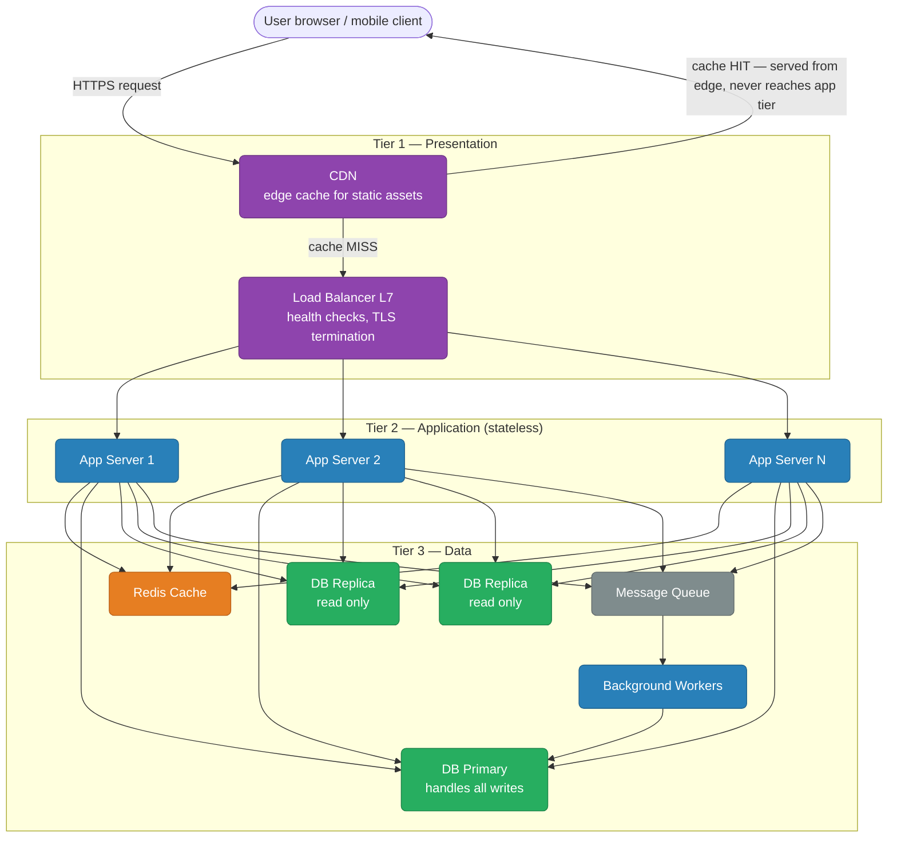

### Why 3 Tiers?

| Concern | Benefit |
|---------|---------|
| Scale tiers independently | App servers CPU-bound? Add more. DB I/O bound? Add read replicas. |
| Failure isolation | App crash doesn't corrupt DB. DB failover doesn't affect CDN. |
| Security | DB tier never exposed to internet. App tier in private subnet. |
| Deployment | Deploy new app version without touching DB or CDN. |

<div class="quiz-card">
  <p class="quiz-q">Your app servers are pegged at 90% CPU but the database is barely breaking a sweat. Do you need to scale the database tier too?</p>
  <button class="quiz-reveal">Reveal answer</button>
  <div class="quiz-a" hidden>No. That's the entire point of splitting into independent tiers — you scale the bottleneck tier, not every tier in lockstep. Add app servers here; leave the DB tier alone until <em>its</em> own metrics say otherwise.</div>
</div>

---

## Scaling: Vertical vs Horizontal

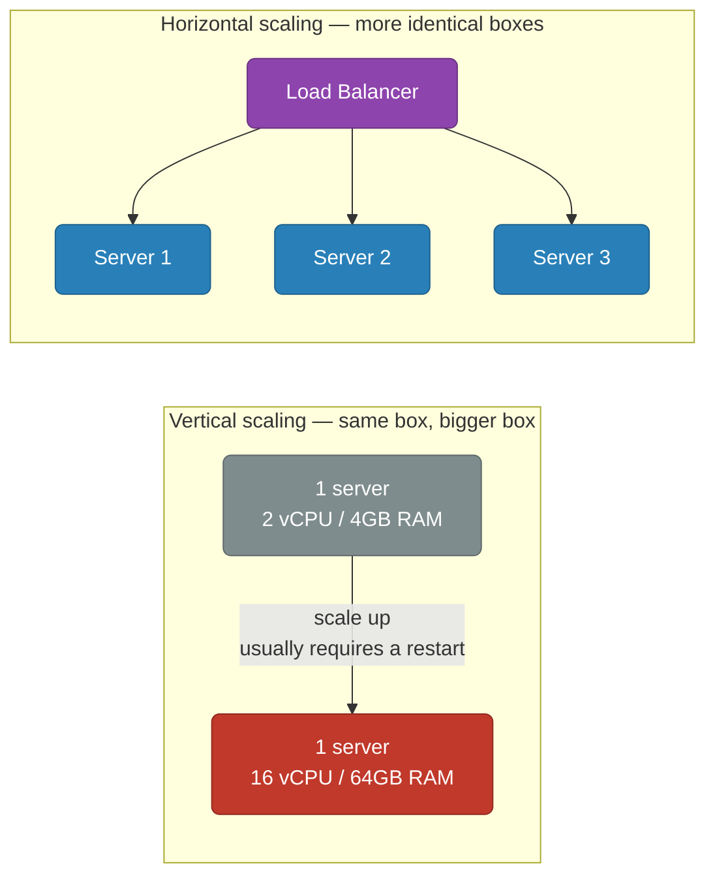

| | Vertical | Horizontal |
|--|----------|------------|
| What | Bigger machine | More machines |
| Limit | Hardware ceiling (~448 vCPU on AWS) | Theoretically unlimited |
| Cost | Exponential beyond a point | Linear |
| Downtime | Usually requires restart | Zero downtime with LB |
| State | Trivial (single process) | Requires stateless app design |
| Best for | DB primary, ZooKeeper, single-writer systems | App servers, workers, read replicas |

**Rule:** Scale vertically until it hurts, then scale horizontally. Databases start vertical, scale horizontally via replication and sharding.

<div class="quiz-card">
  <p class="quiz-q">A brand-new database-backed service is expecting modest traffic on day one. Should it be sharded from the start "to be safe"?</p>
  <button class="quiz-reveal">Reveal answer</button>
  <div class="quiz-a" hidden>No — the rule is scale vertically until it hurts, <em>then</em> go horizontal. Databases in particular start vertical and only move to replication/sharding once a bigger box stops being the answer. Sharding on day one adds massive operational complexity (routing, cross-shard joins, resharding risk) for a workload a single well-sized instance could handle.</div>
</div>

---

## Application Tier Scaling

### Stateless Design — Prerequisite for Horizontal Scale

Every app server must be able to handle any request. State must live outside the app server.

<div class="toggle-switch">
  <div class="toggle-buttons">
    <button data-toggle-opt="stateful" class="active state-bad">Stateful — can't scale out</button>
    <button data-toggle-opt="stateless" class="state-ok">Stateless — can scale out</button>
  </div>
  <div class="toggle-panel active" data-toggle-panel="stateful">
    Session lives in server memory. File uploads land on that server's local disk.
    Caching happens in-process. The result: a client's follow-up request
    <strong>must</strong> land back on the same server (session affinity) —
    which stops the load balancer from freely spreading load, and a server
    restart silently drops every session it was holding.
  </div>
  <div class="toggle-panel" data-toggle-panel="stateless">
    Session lives in Redis. Uploaded files land in S3 / GCS. Caching goes
    through a distributed cache (Redis) instead of in-process memory. Any
    server can now handle any request, so the load balancer routes wherever
    there's capacity — and a server can be killed and replaced without losing
    anything.
  </div>
</div>

### Horizontal Pod Autoscaling (K8s)

```yaml
apiVersion: autoscaling/v2
kind: HorizontalPodAutoscaler
metadata:
  name: api-hpa
spec:
  scaleTargetRef:
    apiVersion: apps/v1
    kind: Deployment
    name: api
  minReplicas: 3
  maxReplicas: 50
  metrics:
    - type: Resource
      resource:
        name: cpu
        target:
          type: Utilization
          averageUtilization: 60
    - type: External                      # custom metric — queue depth
      external:
        metric:
          name: sqs_queue_depth
        target:
          type: Value
          value: "100"
```

<div class="quiz-card">
  <p class="quiz-q">You add 10 more app server pods to fix a slowdown, but users keep reporting they're randomly getting logged out. Traffic is spread across pods via a load balancer. What's the likely root cause?</p>
  <button class="quiz-reveal">Reveal answer</button>
  <div class="quiz-a" hidden>Session state is still living in server memory (the stateful pattern). A given user's requests need to keep hitting the same pod, so spreading traffic across more pods just means more chances a request lands somewhere without that user's session — logging them out. Horizontal scaling only really works once session/state moves out to something shared like Redis.</div>
</div>

---

## Database Scaling

Database scaling is harder than app scaling because state is involved.

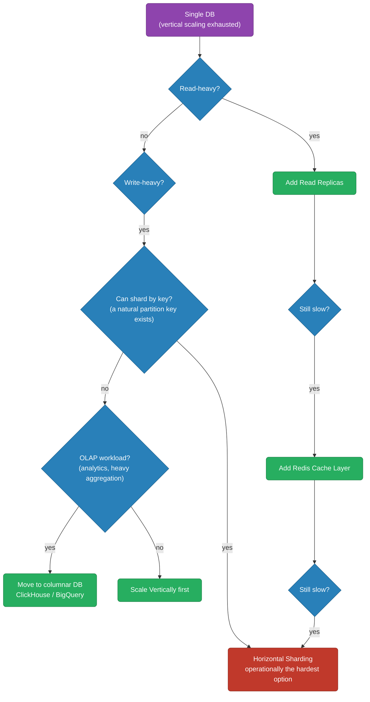

### Read Replicas

Offload SELECT traffic from the primary.

```mermaid
sequenceDiagram
    participant App as Application
    participant Primary as DB Primary (R/W)
    participant R1 as Replica 1 (R only)
    participant R2 as Replica 2 (R only)

    App->>Primary: INSERT INTO orders ...
    Primary-->>App: write acknowledged
    Note over Primary,R2: replication is asynchronous — not part of the write's critical path
    Primary->>R1: stream replicated writes
    Primary->>R2: stream replicated writes

    rect rgb(55, 45, 35)
    Note over App,R2: replica lag window — replica hasn't replayed the latest write yet
    App->>R1: SELECT ... (read traffic)
    R1-->>App: row may still reflect the pre-write state
    end
```

**Connection routing in app code:**

```python
import psycopg2

write_conn = psycopg2.connect(host="db-primary.internal")
read_conn  = psycopg2.connect(host="db-replica.internal")

# All writes go to primary
with write_conn.cursor() as cur:
    cur.execute("INSERT INTO orders ...")

# All reads go to replica
with read_conn.cursor() as cur:
    cur.execute("SELECT * FROM products WHERE ...")
```

**Replica lag** — async replication means replicas are always slightly behind.  
Fix: for reads that need latest data (e.g., just-written record), read from primary.  
Measure lag: `SELECT now() - pg_last_xact_replay_timestamp()` on PostgreSQL replica.

<div class="quiz-card">
  <p class="quiz-q">A user submits a form, gets redirected to a confirmation page that reads their own just-written record — and the page shows stale/missing data. Writes go to the primary; this read went to a replica. What's going on, and what's the fix?</p>
  <button class="quiz-reveal">Reveal answer</button>
  <div class="quiz-a" hidden>Replica lag. Replication to replicas is asynchronous, so a replica can still be behind the primary at the moment of the read. The fix is routing reads that need the absolute latest data — like reading back something you just wrote — to the primary instead of a replica.</div>
</div>

---

## Database Sharding

Sharding = splitting data horizontally across multiple DB instances (shards). Each shard holds a subset of rows.

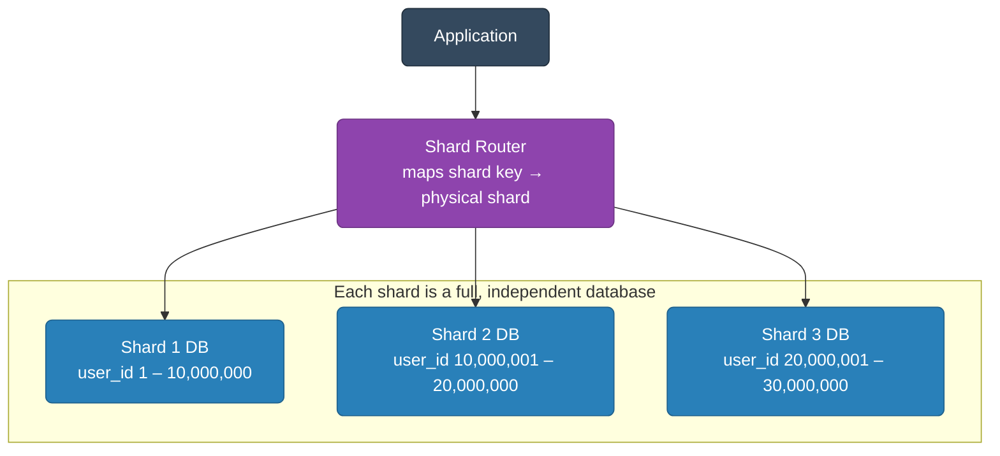

### Sharding Strategies

<div class="tab-group">
  <div class="tab-buttons">
    <button data-tab="range" class="active">Range-based</button>
    <button data-tab="hash">Hash-based</button>
    <button data-tab="consistent">Consistent Hashing</button>
  </div>
  <div class="tab-panels">
    <div class="tab-panel active" data-tab-panel="range">
      Contiguous ranges of the shard key map to a specific shard.
      <pre><code>Shard 1: user_id 1        – 10,000,000
Shard 2: user_id 10000001 – 20,000,000
Shard 3: user_id 20000001 – 30,000,000</code></pre>
      <strong>Pros:</strong> Easy range queries, simple routing.<br/>
      <strong>Cons:</strong> Hotspot risk — new users all go to the last shard.
      If most recent data is most active, one shard gets hammered.
    </div>
    <div class="tab-panel" data-tab-panel="hash">
      A hash function scatters the shard key evenly across shards.
      <pre><code>shard_id = hash(user_id) % num_shards

user_id=123  &rarr; hash=0xABC... &rarr; 0xABC % 4 = 3 &rarr; Shard 3
user_id=456  &rarr; hash=0xDEF... &rarr; 0xDEF % 4 = 1 &rarr; Shard 1</code></pre>
      <strong>Pros:</strong> Even distribution, no hotspots.<br/>
      <strong>Cons:</strong> Range queries require scatter-gather across all
      shards. Resharding is painful — every key's <code>% num_shards</code>
      result changes when <code>num_shards</code> changes.
    </div>
    <div class="tab-panel" data-tab-panel="consistent">
      Nodes and keys are placed on a ring. A key is owned by the nearest node
      walking clockwise.
      <pre><code class="language-mermaid">graph LR
    classDef shard fill:#2980b9,stroke:#1f618d,color:#fff
    classDef key fill:#e67e22,stroke:#ba6018,color:#fff

    S1["Shard 1 (ring pos 0)"]:::shard --> S2["Shard 2 (ring pos 90)"]:::shard
    S2 --> S3["Shard 3 (ring pos 180)"]:::shard
    S3 --> S4["Shard 4 (ring pos 270)"]:::shard
    S4 --> S1

    KeyA["Key A (hash pos 45)"]:::key -.->|"walk clockwise to next shard"| S2
    KeyB["Key B (hash pos 200)"]:::key -.->|"walk clockwise to next shard"| S4</code></pre>
      <strong>Pros:</strong> Adding/removing a shard only remaps ~1/N of keys
      (not all of them).<br/>
      <strong>Cons:</strong> Uneven distribution without virtual nodes.
      Virtual nodes (vnodes) fix this — each physical shard gets 100–150
      virtual positions on the ring.<br/>
      <strong>Used by:</strong> Cassandra, DynamoDB, Redis Cluster (hash slots
      = 16384-slot ring), Memcached.
    </div>
  </div>
</div>

<div class="quiz-card">
  <p class="quiz-q">You shard users by signup order using ranges (Shard 1 = earliest IDs, Shard N = newest). Signups are healthy and steady. Six months later, what operational problem is most likely brewing?</p>
  <button class="quiz-reveal">Reveal answer</button>
  <div class="quiz-a" hidden>A hotspot on the newest shard. Range-based sharding sends every new user to the last shard — if recent users are also the most active users (a common pattern), that one shard absorbs a disproportionate share of traffic while the earlier shards sit comparatively idle.</div>
</div>

---

## Resharding

The hardest operation in distributed databases. Happens when a shard gets too large or too hot.

```mermaid
sequenceDiagram
    participant App as Application
    participant Router as Shard Router
    participant Old as Old Shard A
    participant New as New Shards A1 + A2

    rect rgb(40, 55, 75)
    Note over App,Old: Phase 1 — dual-write (both old and new shards receive every write)
    App->>Router: write(key)
    Router->>Old: write
    Router->>New: write (same data, mirrored)
    Old-->>New: backfill historical rows that predate the dual-write window
    end

    rect rgb(55, 45, 35)
    Note over App,New: Phase 2 — verify sync before cutover
    App->>App: compare checksums / row counts between Old and New
    end

    rect rgb(40, 60, 45)
    Note over App,New: Phase 3 — atomic cutover
    App->>Router: update shard map (single atomic swap)
    Router->>New: all reads + writes now routed here
    end

    Note over Old: Phase 4 — drain in-flight reads, then decommission Old
```

### Why Resharding Is Painful

- **Hash % N changes** — with simple modulo, adding 1 shard remaps ~N/(N+1) of all keys
- **Downtime risk** — if routing changes before data copy finishes, you get misses or wrong data
- **Consistency** — dual-write windows create risk of divergence
- **Cross-shard joins** — after resharding, data that was co-located may now be on different shards

### Resharding With Consistent Hashing (minimal remapping)

Adding a node to a consistent hash ring only moves ~1/N of keys. This is why Cassandra, DynamoDB, and Redis Cluster use it.

```bash
# Redis Cluster resharding
redis-cli --cluster reshard 127.0.0.1:7000 \
  --cluster-from <source-node-id> \
  --cluster-to   <target-node-id> \
  --cluster-slots 1000             # move 1000 slots
  --cluster-yes
```

<div class="quiz-card">
  <p class="quiz-q">You run 4 shards with plain <code>hash(key) % num_shards</code> routing and add a 5th shard to relieve write pressure. Roughly what fraction of existing keys need to move?</p>
  <button class="quiz-reveal">Reveal answer</button>
  <div class="quiz-a" hidden>About 4/5 (N/(N+1)) of all keys — nearly everything, because almost every key's modulo result changes when the divisor changes. This is exactly why plain modulo sharding is painful to reshard, and why consistent hashing exists: it only remaps ~1/N of keys when a node is added or removed.</div>
</div>

---

## The Celebrity Problem (Hot Key / Hotspot Problem)

A small number of keys receive a disproportionate share of traffic. Named after the scenario where a celebrity posts on social media and their user/post ID overwhelms a single cache or DB shard.

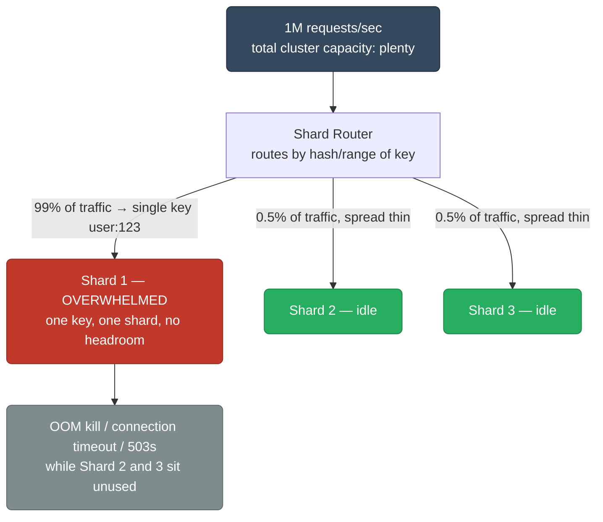

### Solutions

#### 1. Local In-Process Cache (L1 Shadow Cache)

Keep a small in-process LRU cache for the hottest keys. Requests never reach Redis/DB for celebrity content.

```python
from cachetools import TTLCache

# 1000 items, 10 second TTL per item
local_cache = TTLCache(maxsize=1000, ttl=10)

def get_user(user_id: str):
    if user_id in local_cache:
        return local_cache[user_id]          # L1 hit — no network
    value = redis.get(f"user:{user_id}")     # L2 Redis
    if value is None:
        value = db.query(user_id)            # L3 DB
    local_cache[user_id] = value
    return value
```

#### 2. Key Splitting / Read Replicas Per Key

Append a random suffix (0–N) to the key. Each read hits a different replica.

```python
import random

NUM_COPIES = 10

def get_hot_key(key: str):
    suffix = random.randint(0, NUM_COPIES - 1)
    return redis.get(f"{key}:{suffix}")      # fan-out across 10 copies

def set_hot_key(key: str, value):
    # Write to all copies
    pipe = redis.pipeline()
    for i in range(NUM_COPIES):
        pipe.set(f"{key}:{i}", value, ex=60)
    pipe.execute()
```

#### 3. CDN / Edge Caching for Public Content

Celebrity profile pages, viral posts — cache them at the CDN edge. Never reaches the origin for cached content.

```
Cache-Control: public, max-age=60, stale-while-revalidate=300
```

#### 4. Async Fan-out vs Fan-in

Twitter-style: when a celebrity tweets, the system has two models.

<div class="tab-group">
  <div class="tab-buttons">
    <button data-tab="fanout-write" class="active">Fan-out on write</button>
    <button data-tab="fanout-read">Fan-out on read</button>
    <button data-tab="fanout-hybrid">Hybrid</button>
  </div>
  <div class="tab-panels">
    <div class="tab-panel active" data-tab-panel="fanout-write">
      <strong>Push model.</strong> When a celebrity tweets, the system writes
      that tweet into every follower's precomputed timeline immediately.<br/><br/>
      <strong>Pro:</strong> Read is O(1) — a timeline load just reads your
      precomputed feed.<br/>
      <strong>Con:</strong> Write amplification — one tweet becomes N million
      writes.<br/>
      <strong>Breaks at:</strong> a celebrity with 100M followers turns 1
      tweet into 100M writes.
    </div>
    <div class="tab-panel" data-tab-panel="fanout-read">
      <strong>Pull model.</strong> When a follower opens their timeline, the
      system fetches tweets from every account they follow at read
      time.<br/><br/>
      <strong>Pro:</strong> Write is O(1) — posting a tweet touches nothing
      but that user's own data.<br/>
      <strong>Con:</strong> Read is O(following_count) — expensive for users
      following many accounts.<br/>
      <strong>Breaks at:</strong> a user following 5,000 accounts triggers
      5,000 DB lookups per timeline load.
    </div>
    <div class="tab-panel" data-tab-panel="fanout-hybrid">
      <strong>What Twitter actually uses.</strong> Regular users get fan-out
      on write — their tweets are pushed into followers' precomputed
      timelines. Celebrities (accounts above a follower-count threshold) are
      exempted from push; instead they're fetched via fan-out on read at
      query time and merged with the requester's precomputed
      timeline.<br/><br/>
      This bounds the worst case on both sides — no single tweet fans out to
      100M timelines, and no regular read has to scatter-gather across
      thousands of accounts.
    </div>
  </div>
</div>

#### 5. Rate Limiting Per Key

Prevent a single key from consuming the whole cluster.

```python
# Redis token bucket per key
def is_allowed(key: str, limit: int, window_seconds: int) -> bool:
    current = redis.incr(f"ratelimit:{key}")
    if current == 1:
        redis.expire(f"ratelimit:{key}", window_seconds)
    return current <= limit
```

<div class="quiz-card">
  <p class="quiz-q">Total cluster capacity is 1M requests/sec across many shards, plenty for the overall load. Yet one shard is timing out and getting OOM-killed. How can this happen when the cluster as a whole has so much headroom?</p>
  <button class="quiz-reveal">Reveal answer</button>
  <div class="quiz-a" hidden>Because routing sends <em>all</em> traffic for one hot key to <em>one</em> shard, no matter how much idle capacity sits on the other shards. A celebrity key can drive 99% of traffic into a single shard while its neighbors sit idle — aggregate cluster capacity doesn't help a single overwhelmed shard.</div>
</div>

---

## Full Scaling Journey

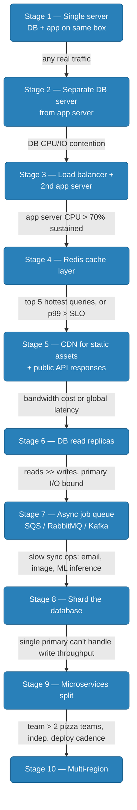

<div class="stepper">
  <div class="stepper-panels">
    <div class="stepper-panel active">
      <strong>Stage 1 — Single server.</strong> DB and app run on the same
      box. <em>Move on when:</em> any real traffic shows up.
    </div>
    <div class="stepper-panel">
      <strong>Stage 2 — Separate DB server from app server.</strong> <em>Move
      on when:</em> DB CPU/IO contention starts hurting the app.
    </div>
    <div class="stepper-panel">
      <strong>Stage 3 — Add load balancer + 2nd app server.</strong> <em>Move
      on when:</em> app server CPU > 70% sustained.
    </div>
    <div class="stepper-panel">
      <strong>Stage 4 — Add Redis cache layer.</strong> <em>Move on
      when:</em> DB reads are dominated by the top 5 hottest queries, or p99
      latency exceeds SLO.
    </div>
    <div class="stepper-panel">
      <strong>Stage 5 — Add CDN for static assets + public API
      responses.</strong> <em>Move on when:</em> bandwidth cost is
      significant or global users see high latency.
    </div>
    <div class="stepper-panel">
      <strong>Stage 6 — Add DB read replicas.</strong> <em>Move on
      when:</em> reads far outnumber writes and the primary is I/O bound.
    </div>
    <div class="stepper-panel">
      <strong>Stage 7 — Add async job queue</strong> (SQS, RabbitMQ, Kafka).
      <em>Move on when:</em> slow synchronous operations block requests
      (email, image processing, ML inference).
    </div>
    <div class="stepper-panel">
      <strong>Stage 8 — Shard the database.</strong> <em>Move on when:</em> a
      single primary can't handle write throughput even after vertical
      scaling.
    </div>
    <div class="stepper-panel">
      <strong>Stage 9 — Microservices split.</strong> <em>Move on when:</em>
      team size exceeds 2 pizza teams and independent deploy cadence is
      needed.
    </div>
    <div class="stepper-panel">
      <strong>Stage 10 — Multi-region.</strong> <em>Move on when:</em>
      RTO/RPO requirements or geographic latency SLOs demand it.
    </div>
  </div>
  <div class="stepper-controls">
    <button class="stepper-prev">← Prev</button>
    <span class="stepper-dots"></span>
    <span class="stepper-label"></span>
    <button class="stepper-next">Next →</button>
  </div>
</div>

<div class="quiz-card">
  <p class="quiz-q">True or false: once write throughput becomes a bottleneck, sharding the database is usually the first lever you should reach for.</p>
  <button class="quiz-reveal">Reveal answer</button>
  <div class="quiz-a" hidden>False. In the journey above, sharding is Stage 8 — it comes after separating the DB server, adding a cache layer, adding read replicas, and adding an async queue, and it's reserved for when a single primary can't handle write throughput even after vertical scaling. Reaching for sharding too early buys enormous operational complexity for a problem cheaper stages might have already solved.</div>
</div>

### Number Targets to Memorize

| Resource | Single Server Limit | After Scaling |
|----------|--------------------|-|
| PostgreSQL writes | ~5K TPS (SATA SSD) | Shard to 100K+ TPS |
| PostgreSQL reads | ~50K QPS with indexes | Add replicas → 500K+ QPS |
| Redis | ~100K ops/sec single thread | Cluster → millions ops/sec |
| App server | ~1K req/s (simple CRUD, 1 CPU) | Horizontal scale linearly |
| HTTP connection | ~65K connections per IP:port | Multiple IPs or SO_REUSEPORT |

---

## Cross-Cutting Concerns at Scale

### Connection Pooling

Every app server opening its own DB connections leads to connection exhaustion fast.

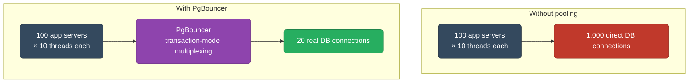

```ini
# pgbouncer.ini
[pgbouncer]
pool_mode = transaction         # connection returned to pool after each transaction
max_client_conn = 10000
default_pool_size = 20
```

### Circuit Breaker

Stop cascading failures. If DB is slow, fail fast instead of queuing up threads.

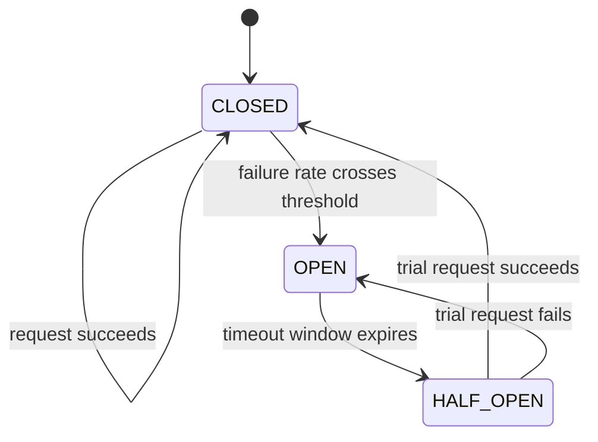

<div class="stepper">
  <div class="stepper-panels">
    <div class="stepper-panel active">
      <strong>1. CLOSED — normal operation.</strong> Requests pass straight
      through to the dependency (e.g. the DB). The breaker just counts
      failures in a rolling window; it doesn't intervene yet.
    </div>
    <div class="stepper-panel">
      <strong>2. Threshold breached → OPEN.</strong> Once the failure rate
      crosses the configured threshold, the breaker trips open. Every
      request now fails immediately — <em>no DB call is even attempted</em>
      — and a timeout timer starts.
    </div>
    <div class="stepper-panel">
      <strong>3. Timeout expires → HALF_OPEN.</strong> The breaker lets
      exactly <strong>one</strong> trial request through to test whether the
      dependency has recovered. Every other request still fails fast while
      that trial is in flight.
    </div>
    <div class="stepper-panel">
      <strong>4a. Trial succeeds → back to CLOSED.</strong> Normal traffic
      resumes immediately and the failure counter resets to zero.
    </div>
    <div class="stepper-panel">
      <strong>4b. Trial fails → back to OPEN.</strong> The dependency still
      isn't healthy. The breaker reopens and restarts the timeout instead of
      hammering the dependency with more traffic.
    </div>
  </div>
  <div class="stepper-controls">
    <button class="stepper-prev">← Prev</button>
    <span class="stepper-dots"></span>
    <span class="stepper-label"></span>
    <button class="stepper-next">Next →</button>
  </div>
</div>

### Backpressure

When a downstream service is slow, stop accepting work upstream instead of buffering forever.

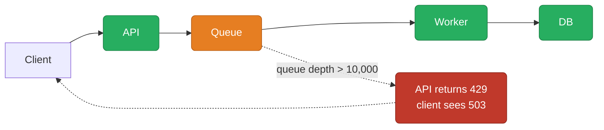

<div class="quiz-card">
  <p class="quiz-q">A circuit breaker just flipped to HALF_OPEN after its timeout expired. Does that mean traffic to the dependency goes back to normal?</p>
  <button class="quiz-reveal">Reveal answer</button>
  <div class="quiz-a" hidden>No. HALF_OPEN only lets a single trial request through to test the dependency — every other request still fails fast. Only if that one trial succeeds does the breaker close and resume normal traffic; if it fails, the breaker reopens and restarts the timeout instead of flooding a still-unhealthy dependency.</div>
</div>

---

## Where to Put This In Your System Design Interview

1. Start with 3-tier: client → LB → app → DB
2. Identify the bottleneck: read-heavy (replicas + cache), write-heavy (sharding), compute-heavy (workers + queue)
3. Add CDN for static/public content
4. Address hot keys explicitly — celebrity problem shows you understand real-world failure modes
5. Mention resharding complexity when proposing sharding — shows you know the operational cost
6. End with: connection pooling, circuit breakers, observability (metrics per tier)
